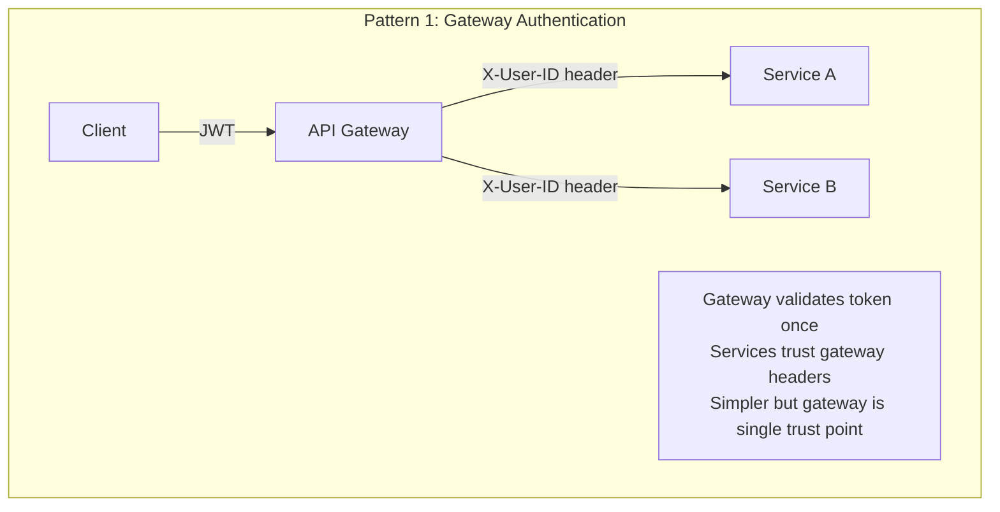
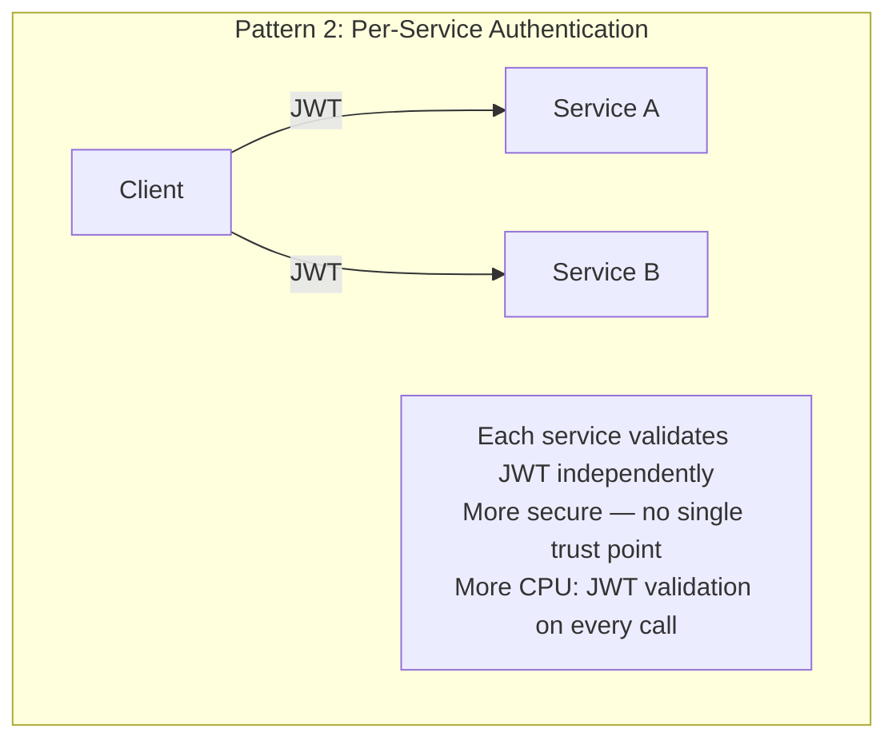
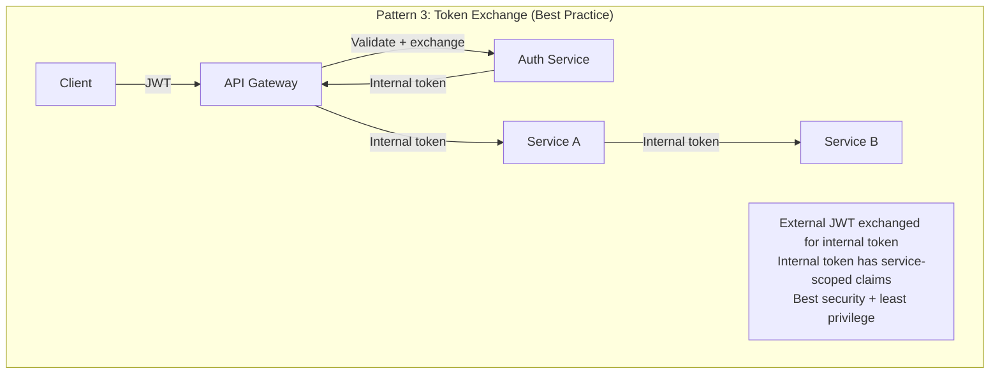
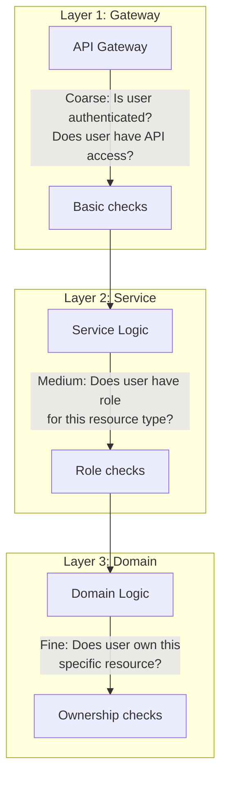
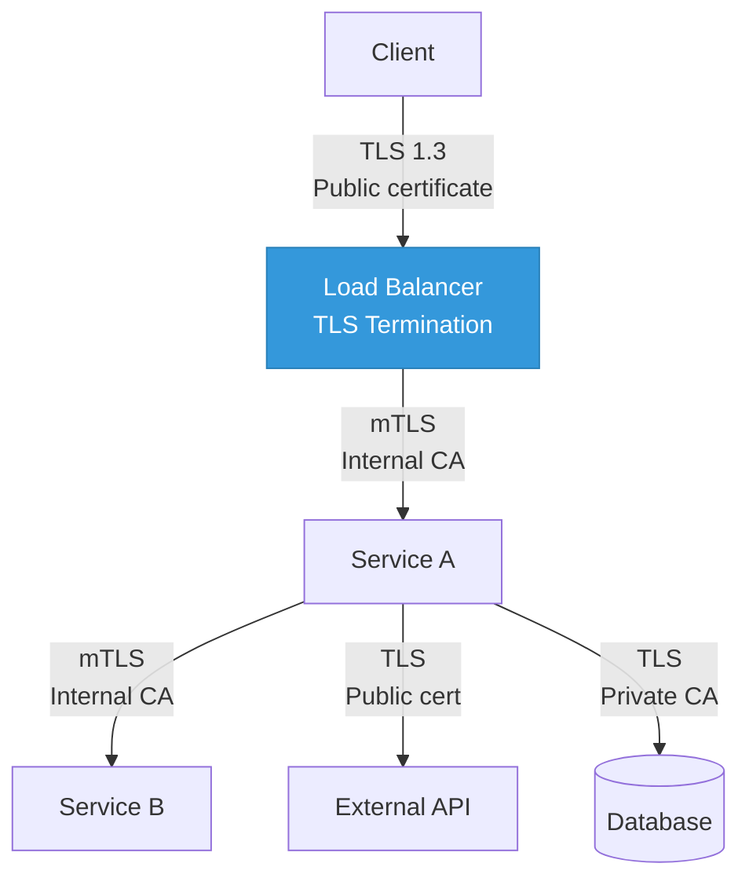
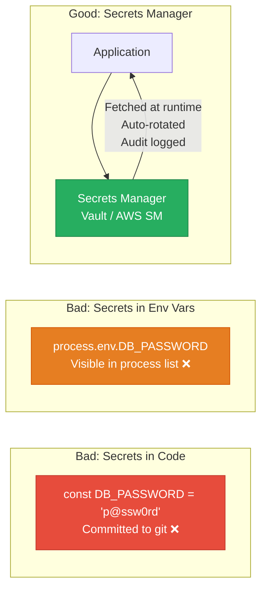
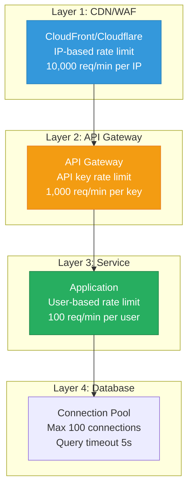
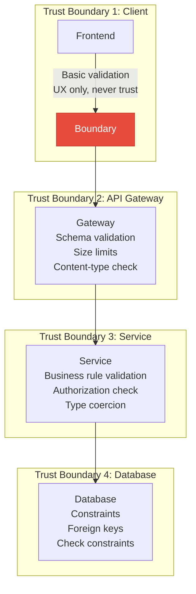
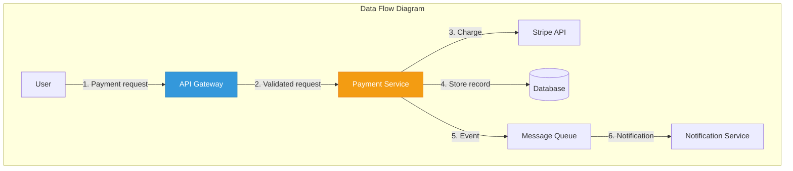

# Security in System Design

Security is not a feature you bolt on after the architecture is done. It is a design constraint that shapes every decision — from where you terminate TLS to how you propagate identity between services. The most common security failures in system design interviews and real systems are not exotic attacks. They are basics: missing authentication on internal endpoints, secrets in environment variables, trusting user input at the wrong boundary, and ignoring the principle of least privilege.

## Authentication at Architecture Level

Authentication (AuthN) answers: "Who is this request from?" The architectural question is where and how authentication happens in a distributed system.

### Authentication Patterns







### Comparison

| Pattern | Security | Performance | Complexity | Best For |
|---------|:--------:|:-----------:|:----------:|---------|
| Gateway Auth | Medium | High | Low | Small teams, < 10 services |
| Per-Service Auth | High | Medium | Medium | Zero-trust environments |
| Token Exchange | Highest | Medium | High | Large orgs, compliance needs |

### JWT vs Session: Architectural Impact

```typescript
// JWT: stateless — any service can validate without calling auth service
// Good for microservices, bad for revocation
interface JWTClaims {
  sub: string;         // User ID
  email: string;
  roles: string[];
  permissions: string[];
  iat: number;         // Issued at
  exp: number;         // Expires at (short-lived: 15-60 min)
}

// Session: stateful — requires session store lookup
// Good for revocation, bad for cross-service propagation
interface SessionLookup {
  sessionId: string;
  // Requires call to Redis/DB to resolve:
  userId: string;
  roles: string[];
  createdAt: Date;
  expiresAt: Date;
}
```

See our [JWT Deep Dive](/security/authentication/jwt-deep-dive) and [Session Management](/security/authentication/session-management) for implementation details.

## Authorization at Architecture Level

Authorization (AuthZ) answers: "Is this user allowed to do this?" This is harder than authentication and the design choices have deep architectural impact.

### Authorization Models

| Model | Description | Best For |
|-------|-------------|---------|
| **RBAC** | Roles → permissions. User has roles. | Simple systems, small permission sets |
| **ABAC** | Policies evaluate attributes (user, resource, environment) | Complex rules, dynamic conditions |
| **ReBAC** | Permissions based on relationships (owner, member, viewer) | Social apps, document sharing, multi-tenant |

See our [RBAC, ABAC, ReBAC](/security/authorization/rbac-abac-rebac) comparison.

### Where Authorization Lives



```typescript
// Layer 1 (Gateway): "Can this user access the Orders API at all?"
// Implemented as middleware
function gatewayAuth(req: Request): boolean {
  return req.user.permissions.includes('orders:read');
}

// Layer 2 (Service): "Can this user access orders for this organization?"
function serviceAuth(req: Request, orgId: string): boolean {
  return req.user.organizations.includes(orgId);
}

// Layer 3 (Domain): "Can this user view THIS specific order?"
function domainAuth(user: User, order: Order): boolean {
  return order.userId === user.id ||
         user.role === 'admin' ||
         user.managedTeams.includes(order.teamId);
}
```

### Centralized Policy Engine

For complex authorization, use a policy engine like OPA (Open Policy Agent) or Cedar:

```rego
# OPA policy (Rego language)
package orders

# Allow users to view their own orders
allow {
    input.action == "read"
    input.resource.type == "order"
    input.resource.owner == input.user.id
}

# Allow managers to view orders from their team
allow {
    input.action == "read"
    input.resource.type == "order"
    input.resource.team_id == input.user.team_id
    input.user.role == "manager"
}

# Allow admins to view all orders
allow {
    input.action == "read"
    input.resource.type == "order"
    input.user.role == "admin"
}
```

See our [Policy Engines](/security/authorization/policy-engines) and [Zanzibar](/security/authorization/zanzibar) pages.

## TLS Everywhere

### The TLS Architecture



| Segment | TLS Type | Certificate | Why |
|---------|----------|-------------|-----|
| Client → LB | TLS 1.3 | Public CA (Let's Encrypt, ACM) | Encrypt user traffic, browser trust |
| LB → Service | mTLS | Internal CA | Verify service identity, encrypt internal traffic |
| Service → Service | mTLS | Internal CA (via service mesh) | Zero-trust internal network |
| Service → Database | TLS | Database CA cert | Encrypt data in transit |
| Service → External API | TLS | External CA | Encrypt outbound traffic |

**The mistake teams make:** TLS at the edge only, plain HTTP internally. This means any compromised internal service can sniff all traffic. Use a service mesh for automatic mTLS between services. See our [TLS Handshake](/system-design/networking/tls-handshake) page.

## Secrets Management

Never store secrets in code, environment variables, or config files. Use a secrets manager.



### Secrets Architecture Pattern

```typescript
// Application fetches secrets at startup from Vault/AWS Secrets Manager
class SecretProvider {
  private cache: Map<string, { value: string; expiresAt: number }> = new Map();

  async getSecret(name: string): Promise<string> {
    const cached = this.cache.get(name);
    if (cached && cached.expiresAt > Date.now()) {
      return cached.value;
    }

    // Fetch from secrets manager
    const secret = await this.secretsManager.getSecretValue(name);

    // Cache for 5 minutes (secrets rotate, so don't cache forever)
    this.cache.set(name, {
      value: secret,
      expiresAt: Date.now() + 5 * 60 * 1000,
    });

    return secret;
  }
}

// Usage
const dbPassword = await secrets.getSecret('prod/database/password');
const apiKey = await secrets.getSecret('prod/stripe/api-key');
```

See our [Secrets Management](/security/secrets-management) section and [Vault Deep Dive](/security/secrets-management/vault-deep-dive).

## Multi-Layer Rate Limiting

Rate limiting at a single layer is insufficient. Apply it at multiple layers for defense in depth.



| Layer | Rate Limit By | Purpose | Tool |
|-------|:-------------|---------|------|
| **CDN/WAF** | IP address | Block DDoS, brute force | CloudFlare, AWS WAF |
| **API Gateway** | API key | Enforce plan limits | Kong, AWS API GW |
| **Application** | User ID | Prevent abuse | Redis + sliding window |
| **Database** | Connection pool | Protect from overload | pgBouncer, connection limits |

See our [Rate Limiting](/system-design/distributed-systems/rate-limiting) and [Advanced Rate Limiting](/security/api-security/advanced-rate-limiting) pages.

## Input Validation Boundaries

The key question: where do you validate input? The answer: at every trust boundary.



```typescript
// Validation at each boundary

// Gateway: structural validation (OpenAPI schema)
// Rejects: missing fields, wrong types, oversized payloads
const gatewaySchema = {
  type: 'object',
  required: ['email', 'amount'],
  properties: {
    email: { type: 'string', format: 'email', maxLength: 254 },
    amount: { type: 'number', minimum: 0.01, maximum: 999999.99 },
    description: { type: 'string', maxLength: 500 },
  },
  additionalProperties: false,
};

// Service: business validation
function validatePayment(input: PaymentInput, user: User): ValidationResult {
  const errors: string[] = [];

  if (input.amount > user.dailyLimit) {
    errors.push('Amount exceeds daily limit');
  }

  if (user.accountStatus !== 'active') {
    errors.push('Account is not active');
  }

  // Sanitize for storage
  input.description = sanitizeHtml(input.description);

  return { valid: errors.length === 0, errors };
}

// Database: last line of defense
// CREATE TABLE payments (
//   amount NUMERIC(10,2) CHECK (amount > 0),
//   user_id UUID REFERENCES users(id),
//   status VARCHAR(20) CHECK (status IN ('pending', 'completed', 'failed'))
// );
```

## OWASP Top 10 in System Design

How the OWASP Top 10 maps to architectural decisions:

| OWASP Risk | Architectural Mitigation |
|-----------|------------------------|
| **A01: Broken Access Control** | AuthZ at every layer, least privilege, deny-by-default |
| **A02: Cryptographic Failures** | TLS everywhere, secrets manager, encrypt at rest, strong hashing |
| **A03: Injection** | Parameterized queries, input validation at trust boundaries |
| **A04: Insecure Design** | Threat modeling before coding, abuse case analysis |
| **A05: Security Misconfiguration** | Infrastructure as code, security scanning in CI/CD, hardened defaults |
| **A06: Vulnerable Components** | Dependency scanning (Snyk/Dependabot), SBOM, update policy |
| **A07: Auth Failures** | MFA, account lockout, brute force protection, secure session management |
| **A08: Data Integrity** | Code signing, CI/CD pipeline security, SBOM verification |
| **A09: Logging & Monitoring** | Centralized logging, alerting on auth failures, audit trail |
| **A10: SSRF** | Allowlist outbound URLs, no internal URL access from user input |

See our [OWASP section](/security/owasp) for detailed coverage of each risk.

## Threat Modeling for Architects

Threat modeling is the practice of systematically identifying security risks before you build. Use STRIDE:

| Threat | Definition | Example | Mitigation |
|--------|-----------|---------|------------|
| **S**poofing | Pretending to be someone else | Forged JWT token | Token validation, mTLS |
| **T**ampering | Modifying data in transit | Man-in-the-middle | TLS, request signing |
| **R**epudiation | Denying an action | "I never made that transfer" | Audit logs, digital signatures |
| **I**nformation Disclosure | Exposing sensitive data | API returns password hashes | Field-level access control |
| **D**enial of Service | Making system unavailable | Flood of requests | Rate limiting, WAF |
| **E**levation of Privilege | Gaining unauthorized access | Vertical privilege escalation | Least privilege, AuthZ checks |

### Threat Model Example: Payment API



| Flow | Threat | STRIDE | Mitigation |
|:----:|--------|:------:|------------|
| 1 | Stolen API key used to make charges | S | API key + JWT, rate limit per key |
| 1 | Modified payment amount in transit | T | TLS, server-side amount calculation |
| 2 | Replayed payment request | S | Idempotency keys, nonce |
| 3 | Stripe API key exposed | I | Secrets manager, key rotation |
| 4 | Payment record tampered | T | Database audit log, checksums |
| 5 | Message queue poisoning | T | Message signing, schema validation |
| 6 | Notification sent to wrong user | I | Verify recipient matches payment |

## Security Architecture Checklist

### Authentication and Authorization
- [ ] AuthN at the edge (gateway or first service)
- [ ] AuthZ at every service boundary
- [ ] Short-lived tokens (15-60 min JWTs)
- [ ] Token refresh mechanism
- [ ] Service-to-service identity (mTLS or service tokens)

### Data Protection
- [ ] TLS 1.3 for all external traffic
- [ ] mTLS for all internal service-to-service traffic
- [ ] Encryption at rest for all databases
- [ ] Secrets in Vault/Secrets Manager (not env vars)
- [ ] PII encrypted with envelope encryption

### Network Security
- [ ] WAF in front of all public endpoints
- [ ] Rate limiting at CDN, gateway, and service levels
- [ ] Network segmentation (services cannot reach what they do not need)
- [ ] VPC/private networking for databases
- [ ] Egress filtering (services cannot call arbitrary external URLs)

### Monitoring and Incident Response
- [ ] Audit logging for all auth events
- [ ] Alert on authentication failures (brute force detection)
- [ ] Alert on authorization failures (privilege escalation attempts)
- [ ] Centralized security event logging
- [ ] Incident response runbook

## Related Pages

- [JWT Deep Dive](/security/authentication/jwt-deep-dive) — token-based authentication implementation
- [OAuth2 and OIDC](/security/authentication/oauth2-oidc) — federated authentication
- [RBAC, ABAC, ReBAC](/security/authorization/rbac-abac-rebac) — authorization model comparison
- [Zanzibar](/security/authorization/zanzibar) — Google's authorization system
- [OWASP Top 10](/security/owasp) — the ten most critical web application risks
- [API Security Patterns](/system-design/api-design/api-security-patterns) — securing APIs
- [Rate Limiting](/system-design/distributed-systems/rate-limiting) — rate limiting patterns
- [Secrets Management](/security/secrets-management) — managing secrets at scale
- [TLS Handshake](/system-design/networking/tls-handshake) — how TLS works under the hood
- [Vault Deep Dive](/security/secrets-management/vault-deep-dive) — HashiCorp Vault architecture
