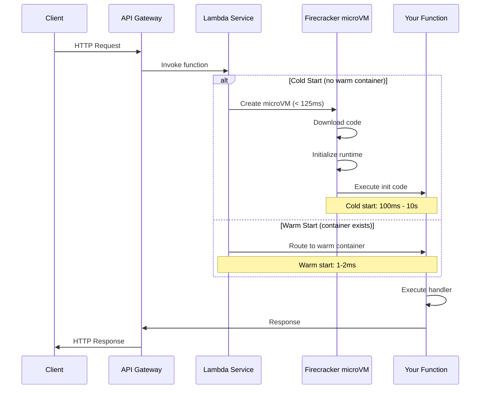
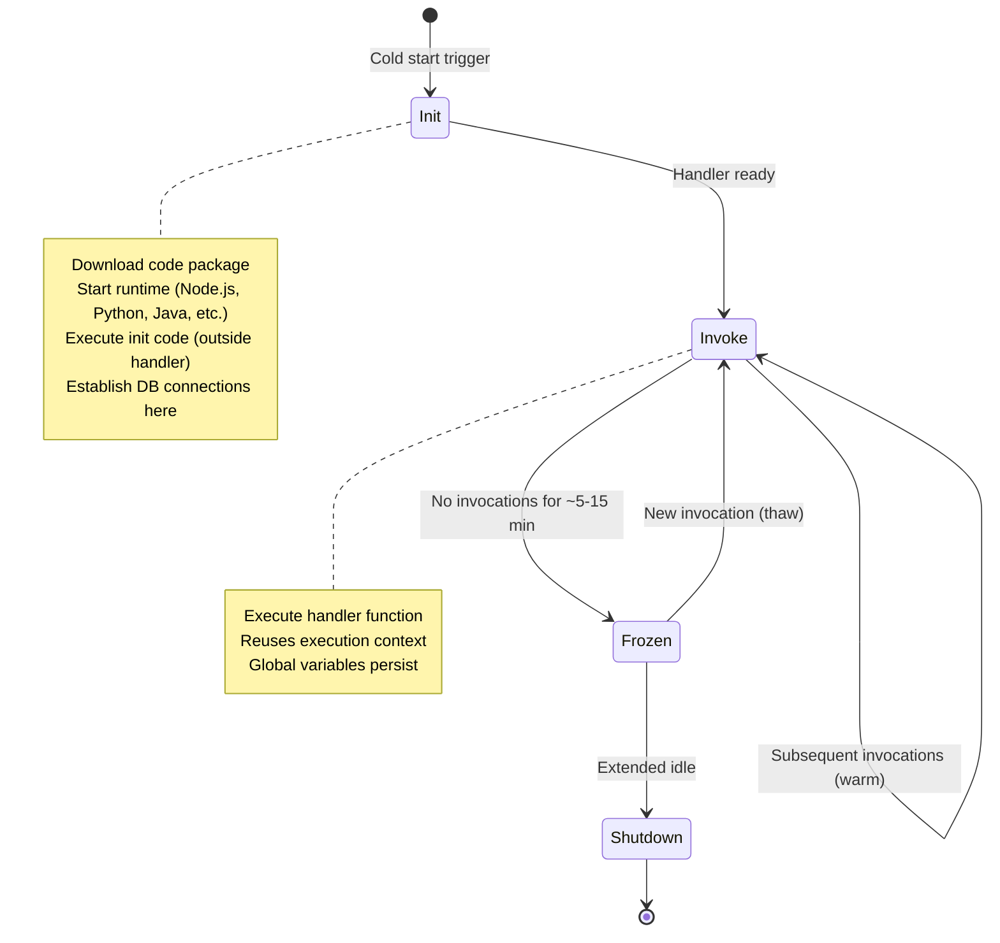
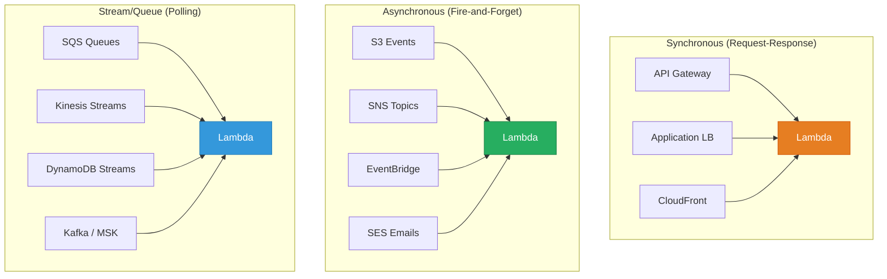
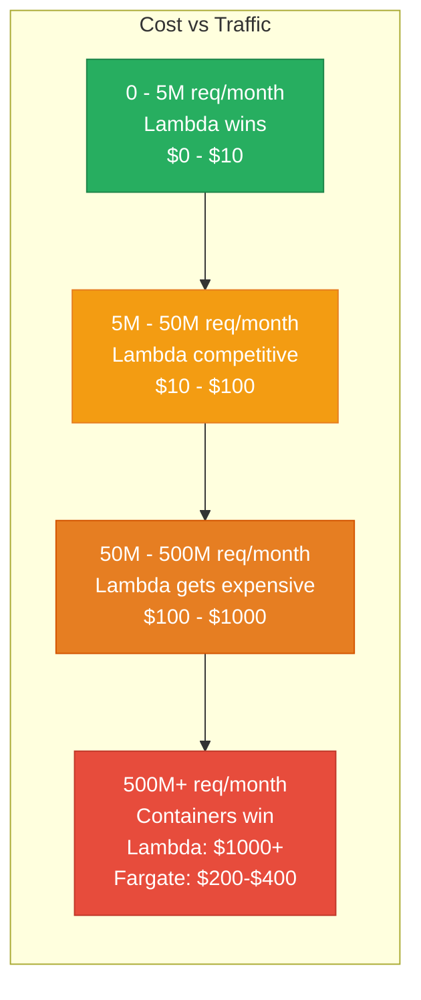
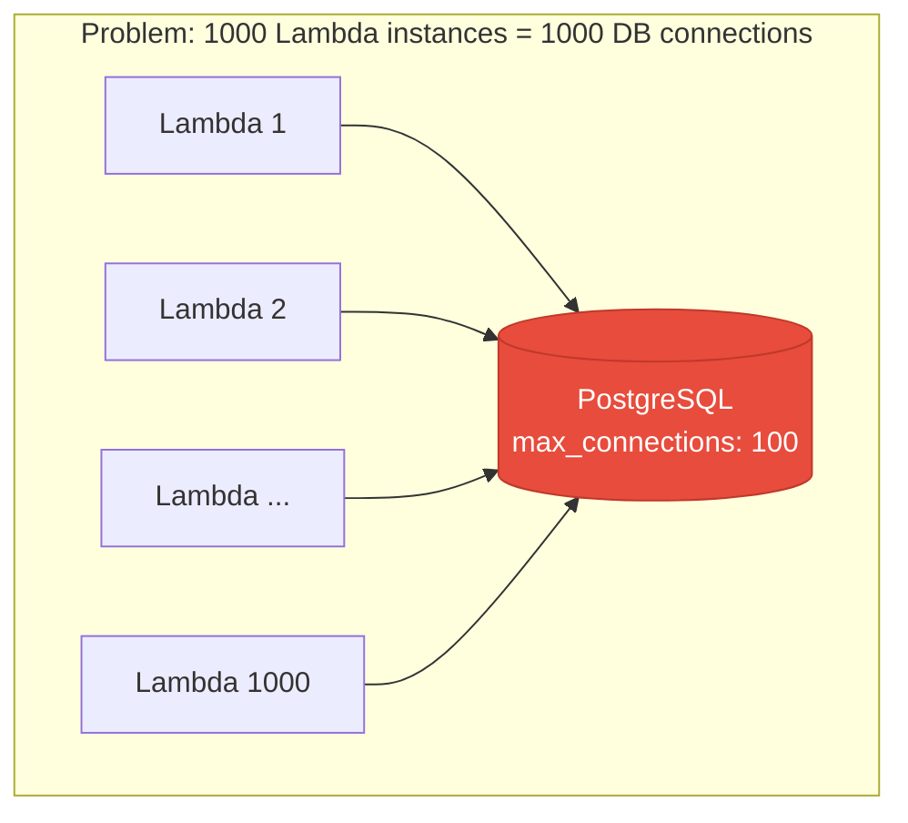
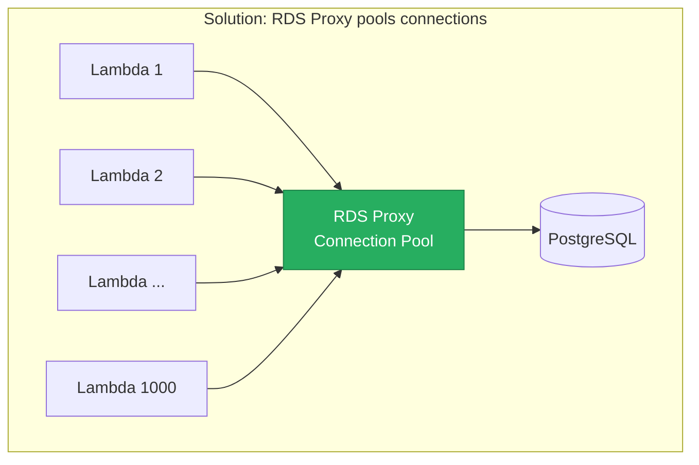
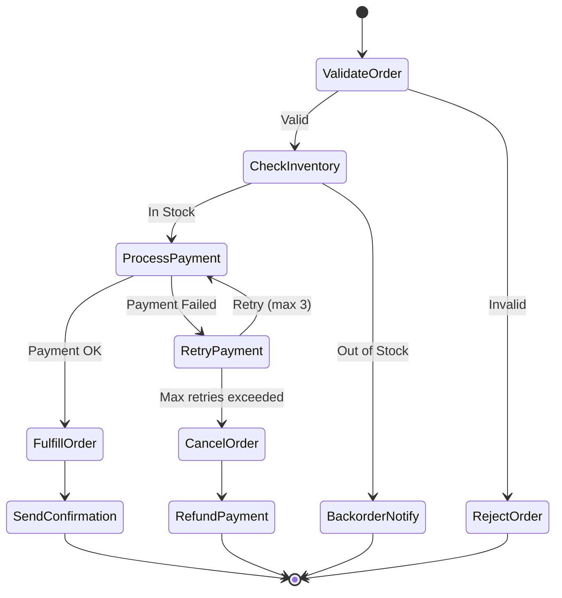
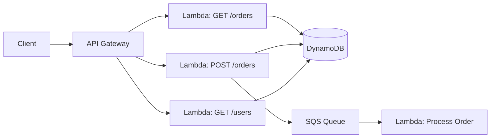
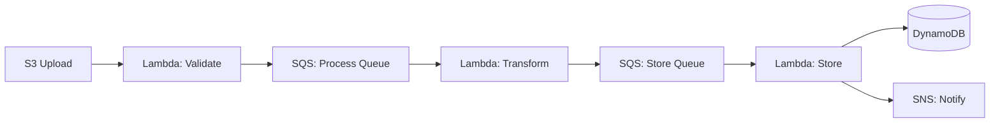

# Serverless Architecture

Serverless computing lets you run code without provisioning or managing servers. You upload a function, define a trigger, and the cloud provider handles scaling, patching, and availability. You pay only for the compute time you actually use — down to the millisecond. But "serverless" does not mean there are no servers. It means you do not think about them. The tradeoff is control: you give up control over the execution environment in exchange for zero operational overhead.

## The Execution Model

### How Lambda Actually Works



### The Lambda Lifecycle



### What Happens During Init

```typescript
// Everything OUTSIDE the handler runs during Init (cold start)
import { DynamoDB } from '@aws-sdk/client-dynamodb';
import { SSMClient, GetParameterCommand } from '@aws-sdk/client-ssm';

// These run once during cold start — expensive but cached
const dynamodb = new DynamoDB({ region: 'us-east-1' });
const ssm = new SSMClient({ region: 'us-east-1' });

// Pre-fetch config during init
let dbConfig: DatabaseConfig;
async function initConfig() {
  const param = await ssm.send(new GetParameterCommand({
    Name: '/myapp/db-config',
    WithDecryption: true,
  }));
  dbConfig = JSON.parse(param.Parameter!.Value!);
}
const configPromise = initConfig();

// The handler runs on every invocation — keep this fast
export async function handler(event: APIGatewayProxyEvent) {
  await configPromise; // Ensure init is complete

  const result = await dynamodb.getItem({
    TableName: 'orders',
    Key: { id: { S: event.pathParameters!.id! } },
  });

  return {
    statusCode: 200,
    body: JSON.stringify(result.Item),
  };
}
```

## Cold Starts: Real Numbers

Cold starts are the most debated serverless topic. Here are actual measured numbers.

### Cold Start Duration by Runtime

| Runtime | Cold Start (p50) | Cold Start (p99) | Notes |
|---------|:----------------:|:----------------:|-------|
| **Node.js 20** | 150-300ms | 500-800ms | Fastest for most workloads |
| **Python 3.12** | 200-400ms | 600-1000ms | Slightly slower than Node |
| **Go** | 80-150ms | 200-400ms | Compiled binary, fastest overall |
| **Java 21 (plain)** | 3-8s | 8-12s | JVM startup is brutal |
| **Java 21 (SnapStart)** | 200-400ms | 500-800ms | Snapshots JVM state pre-init |
| **Rust** | 50-100ms | 150-300ms | Compiled, no runtime overhead |
| **.NET 8** | 400-800ms | 1-2s | AOT compilation helps |
| **.NET 8 (AOT)** | 150-300ms | 400-600ms | Ahead-of-time compilation |

### What Affects Cold Start Duration

| Factor | Impact | Mitigation |
|--------|--------|------------|
| **Package size** | +100ms per 10MB | Tree-shake, use layers, exclude dev deps |
| **Dependencies loaded** | +50-200ms per heavy dependency | Lazy-load, use lighter alternatives |
| **VPC attachment** | +200-500ms (used to be 10s+) | Now uses Hyperplane ENI, much faster |
| **Runtime** | 50ms (Rust) to 8s (Java) | Choose runtime wisely for latency-sensitive functions |
| **Memory allocated** | More memory = proportionally more CPU = faster init | 512MB-1024MB is sweet spot for most |
| **Init code complexity** | DB connections, SDK init, config fetching | Move to init phase, cache in global scope |

### Provisioned Concurrency

For latency-sensitive workloads, provisioned concurrency keeps instances warm.

```yaml
# serverless.yml — provisioned concurrency config
functions:
  api:
    handler: src/handler.main
    runtime: nodejs20.x
    memorySize: 1024
    timeout: 30
    provisionedConcurrency: 10  # Always 10 warm instances

    events:
      - http:
          path: /orders/{id}
          method: get

# Auto-scaling provisioned concurrency
resources:
  Resources:
    ApiProvisionedConcurrencyTarget:
      Type: AWS::ApplicationAutoScaling::ScalableTarget
      Properties:
        MinCapacity: 5
        MaxCapacity: 50
        ResourceId: !Sub "function:${​{self:service}}-${​{sls:stage}}-api:current"
        ScalableDimension: lambda:function:ProvisionedConcurrency
        ServiceNamespace: lambda

    ApiProvisionedConcurrencyScaling:
      Type: AWS::ApplicationAutoScaling::ScalingPolicy
      Properties:
        PolicyName: utilization
        PolicyType: TargetTrackingScaling
        ScalingTargetId: !Ref ApiProvisionedConcurrencyTarget
        TargetTrackingScalingPolicyConfiguration:
          TargetValue: 0.7  # Scale when 70% of provisioned is in use
          PredefinedMetricSpecification:
            PredefinedMetricType: LambdaProvisionedConcurrencyUtilization
```

**Cost of provisioned concurrency:**

| Setting | Monthly Cost (us-east-1) | Explanation |
|---------|:------------------------:|-------------|
| 10 provisioned, 128MB | ~$35/month | Baseline for always-warm |
| 10 provisioned, 1024MB | ~$280/month | Higher memory = higher cost |
| 50 provisioned, 512MB | ~$700/month | Approaching EC2 cost territory |

## Event Sources

Lambda is triggered by events from dozens of AWS services. The event source determines the invocation pattern.



| Pattern | Retry Behavior | Error Handling |
|---------|---------------|----------------|
| **Synchronous** | Client retries | Return error to caller |
| **Asynchronous** | 2 automatic retries, then DLQ | Configure DLQ or on-failure destination |
| **Stream/Queue** | Retries until record expires or succeeds | Configure bisect on batch failure, max retries |

### Event Source Examples

```typescript
// API Gateway trigger — synchronous
export async function httpHandler(event: APIGatewayProxyEventV2) {
  const orderId = event.pathParameters?.id;
  const order = await getOrder(orderId);

  return {
    statusCode: 200,
    headers: { 'Content-Type': 'application/json' },
    body: JSON.stringify(order),
  };
}

// S3 trigger — asynchronous
export async function s3Handler(event: S3Event) {
  for (const record of event.Records) {
    const bucket = record.s3.bucket.name;
    const key = record.s3.object.key;

    // Process uploaded file (resize image, parse CSV, etc.)
    await processFile(bucket, key);
  }
}

// SQS trigger — queue polling
export async function sqsHandler(event: SQSEvent) {
  const failedIds: string[] = [];

  for (const record of event.Records) {
    try {
      const body = JSON.parse(record.body);
      await processMessage(body);
    } catch (error) {
      failedIds.push(record.messageId);
    }
  }

  // Partial batch failure reporting
  return {
    batchItemFailures: failedIds.map(id => ({
      itemIdentifier: id,
    })),
  };
}

// DynamoDB Streams trigger — change data capture
export async function dynamoStreamHandler(event: DynamoDBStreamEvent) {
  for (const record of event.Records) {
    if (record.eventName === 'INSERT') {
      const newItem = record.dynamodb?.NewImage;
      await indexInElasticsearch(newItem);
    } else if (record.eventName === 'MODIFY') {
      const oldItem = record.dynamodb?.OldImage;
      const newItem = record.dynamodb?.NewImage;
      await updateElasticsearch(oldItem, newItem);
    }
  }
}
```

## Cost Model

### Lambda Pricing (us-east-1, 2026)

| Component | Price | Notes |
|-----------|-------|-------|
| **Invocations** | $0.20 per 1M requests | First 1M free/month |
| **Duration** | $0.0000166667 per GB-second | Per 1ms granularity |
| **Provisioned concurrency** | $0.0000041667 per GB-second | For always-warm instances |
| **Free tier** | 1M invocations + 400,000 GB-seconds/month | Enough for small apps |

### Cost Comparison: Lambda vs EC2 vs Fargate

For a REST API handling 10M requests/month, average 200ms execution at 512MB:

```
Lambda:
  Invocations:  10M × $0.20/1M         = $2.00
  Duration:     10M × 0.2s × 0.5GB × $0.0000166667 = $16.67
  Total:                                  $18.67/month

EC2 (t3.medium, reserved 1yr):
  Instance:     $30.37/month (reserved)
  Always running, even at 3am with zero traffic
  Total:                                  $30.37/month

Fargate (0.25 vCPU, 0.5GB, 2 tasks):
  CPU:          2 × 0.25 × $0.04048/hr × 730hrs = $14.75
  Memory:       2 × 0.5 × $0.004445/hr × 730hrs = $3.25
  Total:                                  $18.00/month
```

### The Crossover Point



**Lambda is cheapest when:**
- Traffic is spiky or unpredictable
- There are long periods of zero traffic
- Functions execute in under 1 second
- You value zero ops over cost optimization

**Containers are cheapest when:**
- Traffic is steady and predictable
- Functions run for minutes (batch processing)
- You have ops capacity to manage infrastructure
- Traffic exceeds ~100M requests/month

## Limitations You Must Know

| Limitation | Value | Impact |
|-----------|-------|--------|
| **Execution timeout** | 15 minutes max | Cannot run long-running processes |
| **Memory** | 128MB - 10,240MB | CPU scales proportionally with memory |
| **Package size** | 50MB zipped / 250MB unzipped | Large ML models need container images |
| **Container image** | 10GB max | Enough for most workloads |
| **Ephemeral storage** | 512MB - 10GB `/tmp` | Not persistent between invocations |
| **Concurrent executions** | 1000 default (can increase) | Burst limit varies by region |
| **Payload size** | 6MB sync / 256KB async | Large payloads need S3 |
| **Environment variables** | 4KB total | Use SSM Parameter Store for more |
| **Connections** | No persistent connections across invocations | DB connection pooling via RDS Proxy |

### Connection Pooling Problem and Solution





```typescript
// Use RDS Proxy for connection pooling
import { RDSDataClient, ExecuteStatementCommand } from '@aws-sdk/client-rds-data';

// Option 1: RDS Data API (HTTP-based, no connection management)
const rdsData = new RDSDataClient({ region: 'us-east-1' });

export async function handler(event: any) {
  const result = await rdsData.send(new ExecuteStatementCommand({
    resourceArn: process.env.DB_CLUSTER_ARN!,
    secretArn: process.env.DB_SECRET_ARN!,
    database: 'mydb',
    sql: 'SELECT * FROM orders WHERE id = :id',
    parameters: [{ name: 'id', value: { stringValue: event.orderId } }],
  }));

  return result.records;
}
```

## Step Functions: Orchestrating Serverless Workflows

For workflows that exceed a single Lambda's 15-minute limit or require complex branching, AWS Step Functions orchestrate multiple Lambdas.



```json
{
  "Comment": "Order processing workflow",
  "StartAt": "ValidateOrder",
  "States": {
    "ValidateOrder": {
      "Type": "Task",
      "Resource": "arn:aws:lambda:us-east-1:123456:function:validate-order",
      "Next": "CheckInventory",
      "Catch": [{
        "ErrorEquals": ["ValidationError"],
        "Next": "RejectOrder"
      }]
    },
    "CheckInventory": {
      "Type": "Task",
      "Resource": "arn:aws:lambda:us-east-1:123456:function:check-inventory",
      "Next": "ProcessPayment",
      "Catch": [{
        "ErrorEquals": ["OutOfStockError"],
        "Next": "BackorderNotify"
      }]
    },
    "ProcessPayment": {
      "Type": "Task",
      "Resource": "arn:aws:lambda:us-east-1:123456:function:process-payment",
      "Retry": [{
        "ErrorEquals": ["PaymentRetryableError"],
        "IntervalSeconds": 5,
        "MaxAttempts": 3,
        "BackoffRate": 2.0
      }],
      "Catch": [{
        "ErrorEquals": ["States.ALL"],
        "Next": "CancelOrder"
      }],
      "Next": "FulfillOrder"
    },
    "FulfillOrder": {
      "Type": "Task",
      "Resource": "arn:aws:lambda:us-east-1:123456:function:fulfill-order",
      "Next": "SendConfirmation"
    },
    "SendConfirmation": {
      "Type": "Task",
      "Resource": "arn:aws:lambda:us-east-1:123456:function:send-confirmation",
      "End": true
    },
    "RejectOrder": {
      "Type": "Task",
      "Resource": "arn:aws:lambda:us-east-1:123456:function:reject-order",
      "End": true
    },
    "BackorderNotify": {
      "Type": "Task",
      "Resource": "arn:aws:lambda:us-east-1:123456:function:backorder-notify",
      "End": true
    },
    "CancelOrder": {
      "Type": "Task",
      "Resource": "arn:aws:lambda:us-east-1:123456:function:cancel-order",
      "Next": "RefundPayment"
    },
    "RefundPayment": {
      "Type": "Task",
      "Resource": "arn:aws:lambda:us-east-1:123456:function:refund-payment",
      "End": true
    }
  }
}
```

## When Serverless Beats Containers

| Scenario | Serverless | Containers | Winner |
|----------|-----------|-----------|--------|
| Spiky traffic (0 to 10K req/s) | Auto-scales instantly, $0 at idle | Need min capacity running | Serverless |
| Steady high traffic (100K req/s) | Expensive at scale | Fixed cost, efficient | Containers |
| Event processing (S3, SQS) | Native integration | Need polling infrastructure | Serverless |
| Long-running jobs (> 15 min) | Not possible | No time limit | Containers |
| Startup/MVP | Zero ops, fast iteration | Need K8s/ECS expertise | Serverless |
| WebSocket connections | Limited support | Full control | Containers |
| ML inference (GPU) | No GPU support | GPU instances available | Containers |
| Cron jobs (run 5 min/day) | Pay for 5 min/day | Pay for 24 hours/day | Serverless |

## Vendor Lock-In Mitigation

### The Lock-In Spectrum

| Component | Lock-In Level | Mitigation |
|-----------|:-------------:|------------|
| **Function handler interface** | Low | Adapter pattern per cloud |
| **Event sources (S3, SQS)** | High | Abstract behind interfaces |
| **Step Functions** | Very High | Use Temporal/Conductor instead |
| **DynamoDB in function** | High | Use abstractions, consider portable DBs |
| **IAM/permissions model** | Very High | Accept it — security is always cloud-specific |

### Portable Function Pattern

```typescript
// Core business logic — zero cloud dependencies
export class OrderProcessor {
  constructor(
    private orderRepo: OrderRepository,
    private paymentGateway: PaymentGateway,
    private notifier: Notifier,
  ) {}

  async processOrder(input: ProcessOrderInput): Promise<ProcessOrderResult> {
    const order = await this.orderRepo.findById(input.orderId);
    const payment = await this.paymentGateway.charge(order.total);
    await this.notifier.sendConfirmation(order.userId, order.id);
    return { orderId: order.id, paymentId: payment.id };
  }
}

// AWS Lambda adapter
import { APIGatewayProxyHandlerV2 } from 'aws-lambda';
const processor = new OrderProcessor(
  new DynamoDBOrderRepository(),
  new StripePaymentGateway(),
  new SESNotifier(),
);

export const handler: APIGatewayProxyHandlerV2 = async (event) => {
  const input = JSON.parse(event.body!);
  const result = await processor.processOrder(input);
  return { statusCode: 200, body: JSON.stringify(result) };
};

// Google Cloud Functions adapter
import { HttpFunction } from '@google-cloud/functions-framework';
const processor = new OrderProcessor(
  new FirestoreOrderRepository(),
  new StripePaymentGateway(),
  new SendGridNotifier(),
);

export const handler: HttpFunction = async (req, res) => {
  const result = await processor.processOrder(req.body);
  res.json(result);
};
```

## Serverless Architecture Patterns

### Pattern 1: API Backend



### Pattern 2: Event Processing Pipeline



### Pattern 3: Scheduled Jobs

```yaml
functions:
  dailyReport:
    handler: src/reports/daily.handler
    timeout: 900  # 15 minutes
    memorySize: 2048
    events:
      - schedule:
          rate: cron(0 6 * * ? *)  # 6am UTC daily
          input:
            reportType: "daily-summary"

  cleanupExpired:
    handler: src/maintenance/cleanup.handler
    timeout: 300
    events:
      - schedule:
          rate: rate(1 hour)
```

## Key Takeaways

1. **Cold starts matter** — choose runtime wisely (Go/Rust < Node.js < Python < Java), use provisioned concurrency for latency-sensitive paths
2. **Cost model favors spiky workloads** — at steady high traffic, containers are cheaper
3. **15-minute limit is real** — use Step Functions for longer workflows
4. **Connection pooling is critical** — use RDS Proxy or DynamoDB, never open new DB connections per invocation
5. **Put initialization outside the handler** — SDK clients, config fetching, DB connections go in module scope
6. **Serverless shines for event-driven architectures** — native integration with S3, SQS, DynamoDB Streams, EventBridge
7. **Vendor lock-in is manageable** — isolate business logic from cloud-specific adapters

## Related Pages

- [AWS Lambda](/infrastructure/aws/lambda) — detailed Lambda infrastructure guide
- [Cost of Scale](/system-design/advanced/cost-of-scale) — comparing serverless costs at scale
- [Event-Driven APIs](/system-design/api-design/event-driven-apis) — event sources for serverless
- [Edge Computing](/system-design/advanced/edge-computing) — serverless at the edge
- [SQS and SNS](/system-design/message-queues/sqs-sns) — queue-based Lambda triggers
- [DynamoDB Internals](/system-design/databases/dynamodb-internals) — the serverless database
