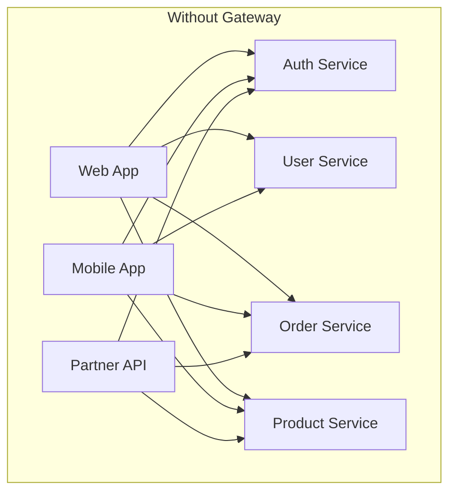
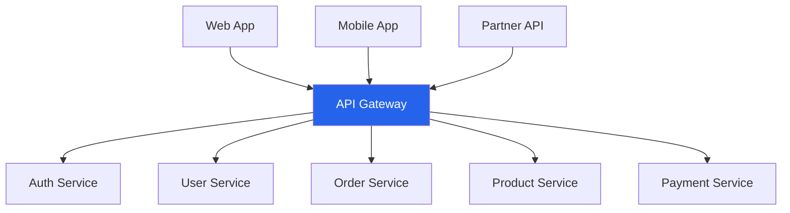
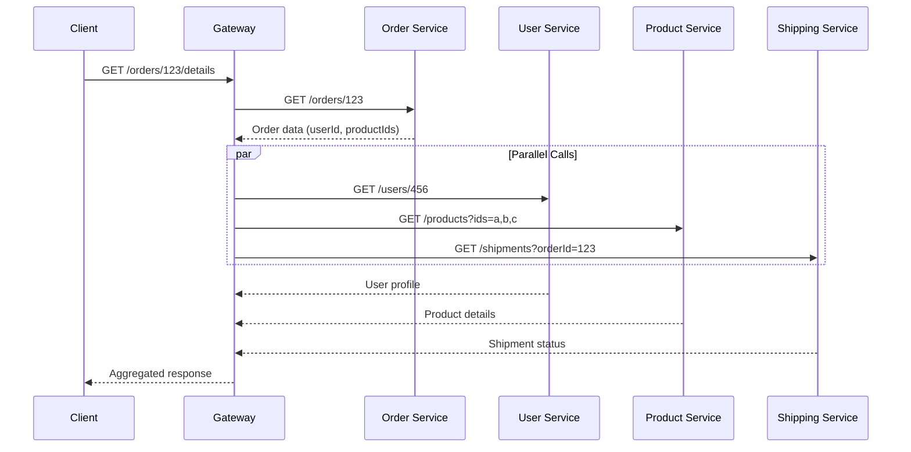
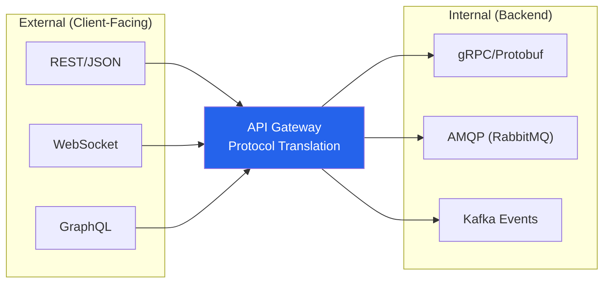
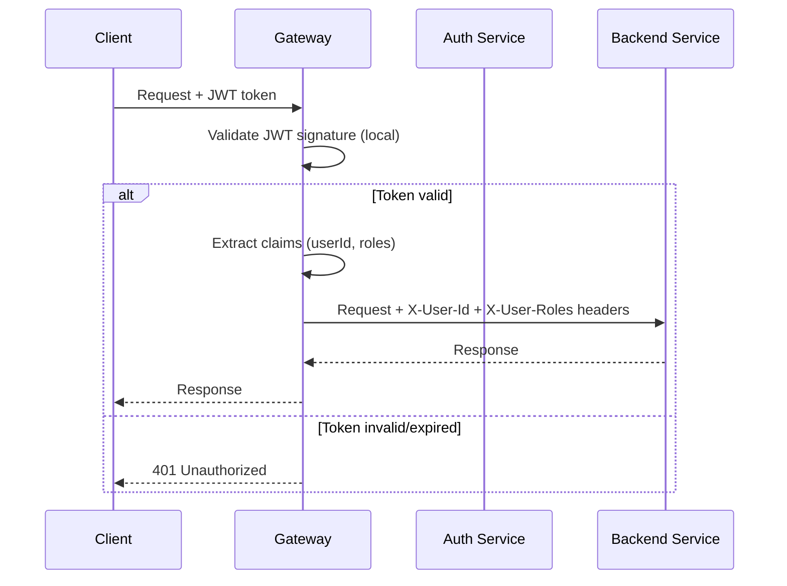
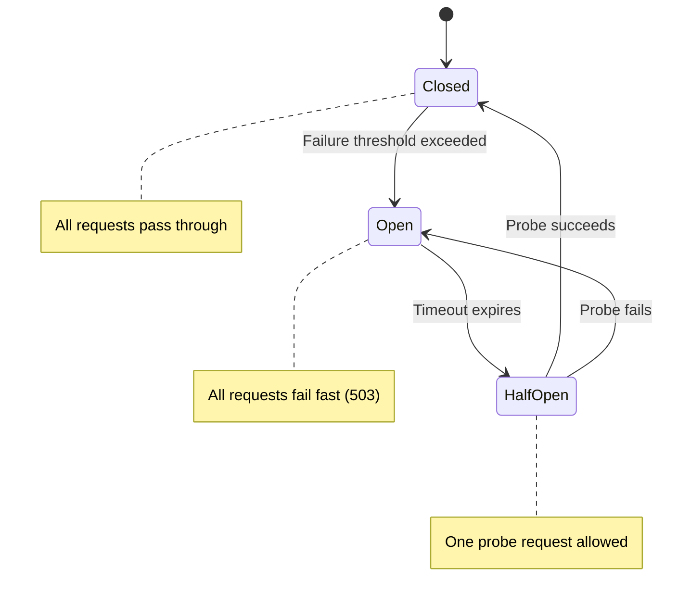
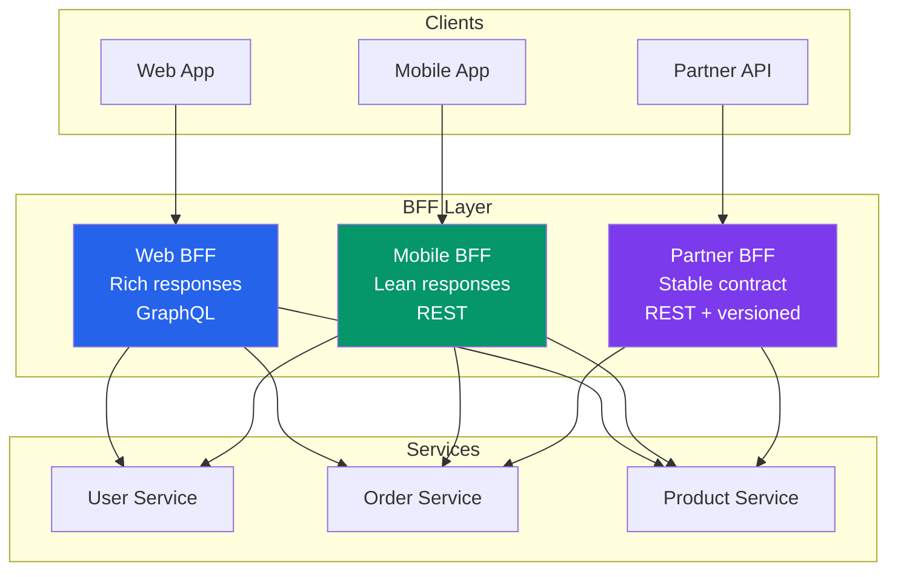
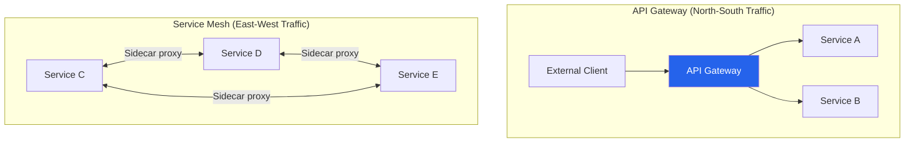
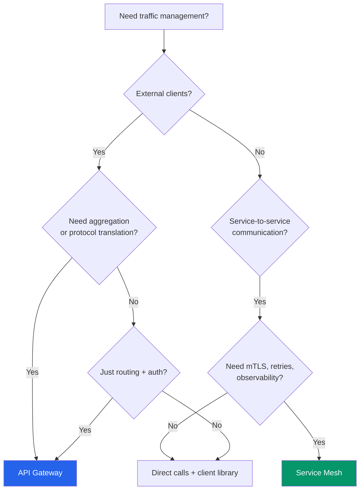

# API Gateway Patterns

An API gateway sits between clients and your backend services, acting as a reverse proxy that routes requests, enforces policies, and aggregates responses. In a monolith, you don't need one — the monolith IS the API. But the moment you split into microservices, clients face a problem: which service do I call? How do I authenticate? What if I need data from five services to render one page? The API gateway solves all of these by providing a **single entry point** that abstracts away the complexity of your backend topology.

## Why API Gateways Exist

### The Problem Without a Gateway



**Problems:**
- Clients must know about every service and its address
- Every service must implement authentication, rate limiting, CORS
- Client makes N network calls for one page (mobile = slow)
- Service addresses change during deployments — clients break
- No central place to enforce security policies

### The Solution With a Gateway



## Core Gateway Capabilities

### 1. Request Routing

The most basic function — route incoming requests to the correct backend service based on path, headers, or other attributes.

```yaml
# Example: Kong/APISIX declarative routing config
routes:
  - name: user-service
    paths:
      - /api/v1/users
      - /api/v1/profiles
    service: user-service
    strip_path: false
    methods:
      - GET
      - POST
      - PUT
      - DELETE

  - name: order-service
    paths:
      - /api/v1/orders
      - /api/v1/cart
    service: order-service

  - name: product-service
    paths:
      - /api/v1/products
      - /api/v1/categories
    service: product-service

services:
  - name: user-service
    url: http://user-service.internal:8080
    retries: 3
    connect_timeout: 5000
    read_timeout: 30000

  - name: order-service
    url: http://order-service.internal:8080
    retries: 2
    connect_timeout: 3000
    read_timeout: 15000
```

### 2. Request Aggregation (API Composition)

A single client request triggers multiple backend calls, and the gateway combines the results:

```typescript
// Gateway aggregation handler — "Get Order Details" page
// Client makes ONE call; gateway makes FOUR

interface OrderDetailsResponse {
  order: Order;
  user: UserProfile;
  products: Product[];
  shipment: ShipmentStatus;
}

async function getOrderDetails(orderId: string): Promise<OrderDetailsResponse> {
  // Fetch in parallel — critical for latency
  const [order, user, products, shipment] = await Promise.all([
    orderService.getOrder(orderId),
    userService.getUser(order.userId),          // Depends on order — need sequential
    productService.getProducts(order.productIds),
    shippingService.getShipment(orderId),
  ]);

  return { order, user, products, shipment };
}

// Better: Handle the dependency correctly
async function getOrderDetailsV2(orderId: string): Promise<OrderDetailsResponse> {
  // Phase 1: Get the order (needed for userId and productIds)
  const order = await orderService.getOrder(orderId);

  // Phase 2: Parallel calls that depend on the order
  const [user, products, shipment] = await Promise.all([
    userService.getUser(order.userId),
    productService.getProducts(order.productIds),
    shippingService.getShipment(orderId),
  ]);

  return { order, user, products, shipment };
}
```



::: tip
API composition at the gateway is appropriate for simple aggregation. If the composition logic becomes complex (business rules, data transformation, error handling for partial failures), consider a dedicated **Backend for Frontend (BFF)** service instead of putting business logic in the gateway.
:::

### 3. Protocol Translation

The gateway translates between client protocols and backend protocols:



| External Protocol | Internal Protocol | Use Case |
|------------------|-------------------|----------|
| REST/JSON | gRPC/Protobuf | Mobile/web clients talk REST; inter-service uses gRPC for performance |
| WebSocket | gRPC streaming | Real-time client updates from streaming backend services |
| GraphQL | REST/gRPC | Flexible client queries over rigid backend APIs |
| REST | Message queue | Async operations: POST request → queue message → eventual processing |

### 4. Authentication & Authorization Offloading

The gateway handles auth so services don't have to:



```typescript
// Gateway auth middleware
async function authMiddleware(req: Request, res: Response, next: NextFunction) {
  const token = req.headers.authorization?.replace('Bearer ', '');

  if (!token) {
    return res.status(401).json({ error: 'Missing authentication token' });
  }

  try {
    // Validate JWT locally (no network call needed)
    const claims = jwt.verify(token, PUBLIC_KEY, {
      algorithms: ['RS256'],
      issuer: 'auth.example.com',
    });

    // Forward identity to backend services via headers
    req.headers['x-user-id'] = claims.sub;
    req.headers['x-user-roles'] = claims.roles.join(',');
    req.headers['x-user-email'] = claims.email;
    req.headers['x-request-id'] = req.headers['x-request-id'] || crypto.randomUUID();

    // Remove the original token — backends trust the gateway
    delete req.headers.authorization;

    next();
  } catch (error) {
    if (error.name === 'TokenExpiredError') {
      return res.status(401).json({ error: 'Token expired' });
    }
    return res.status(401).json({ error: 'Invalid token' });
  }
}
```

::: warning
Once the gateway validates the token, backend services trust the `X-User-Id` header implicitly. This means the **network between the gateway and backends must be trusted** (private network, service mesh mTLS). If an attacker can reach a backend service directly and inject `X-User-Id` headers, they bypass all authentication.
:::

### 5. Rate Limiting

Protect backends from traffic spikes and abuse:

```typescript
// Rate limiting strategies at the gateway level

// 1. Fixed Window — simple but bursty at window boundaries
// 100 requests per minute per user
const fixedWindow = {
  key: 'user:{userId}',
  limit: 100,
  window: '1m',
};

// 2. Sliding Window — smoother, prevents boundary bursts
const slidingWindow = {
  key: 'user:{userId}',
  limit: 100,
  window: '1m',
  algorithm: 'sliding_window_log',
};

// 3. Token Bucket — allows controlled bursts
const tokenBucket = {
  key: 'user:{userId}',
  rate: 10,         // 10 tokens per second refill
  burst: 50,        // Max 50 tokens (allows short bursts)
};

// 4. Tiered limits by plan
const tieredLimits = {
  free:       { limit: 100,   window: '1h' },
  starter:    { limit: 1000,  window: '1h' },
  business:   { limit: 10000, window: '1h' },
  enterprise: { limit: 100000, window: '1h' },
};
```

| Algorithm | Burst Handling | Memory | Accuracy | Best For |
|-----------|---------------|--------|----------|----------|
| **Fixed window** | Allows 2x burst at boundary | Low | Low | Simple APIs |
| **Sliding window log** | No bursts | High | High | Strict rate limiting |
| **Sliding window counter** | Minimal bursts | Medium | Medium | Most APIs |
| **Token bucket** | Controlled bursts | Low | Medium | APIs that allow bursts |
| **Leaky bucket** | Smooths all traffic | Low | High | Steady throughput needed |

### 6. Circuit Breaking

Prevent cascading failures when a backend service is struggling:



```typescript
// Circuit breaker configuration
interface CircuitBreakerConfig {
  failureThreshold: number;    // 5 failures to open
  successThreshold: number;    // 3 successes to close
  timeout: number;             // 30s before trying half-open
  monitorWindow: number;       // Count failures within this window
  fallback?: () => Response;   // What to return when circuit is open
}

const orderServiceBreaker: CircuitBreakerConfig = {
  failureThreshold: 5,
  successThreshold: 3,
  timeout: 30000,
  monitorWindow: 60000,
  fallback: () => ({
    status: 503,
    body: {
      error: 'Order service temporarily unavailable',
      retryAfter: 30,
    },
  }),
};
```

::: danger
A misconfigured circuit breaker is worse than no circuit breaker. If the threshold is too low, a brief network blip opens the circuit and blocks legitimate traffic. If the threshold is too high, the circuit never opens and cascading failures propagate. Tune thresholds based on your service's error budget and normal failure rates.
:::

### 7. Response Caching

Cache responses at the gateway to reduce backend load:

```typescript
// Gateway caching strategy
const cacheRules = [
  {
    path: '/api/v1/products/*',
    method: 'GET',
    ttl: 300,                    // 5 minutes
    varyBy: ['Accept-Language'], // Different cache per language
    staleWhileRevalidate: 60,    // Serve stale for 60s while refreshing
  },
  {
    path: '/api/v1/categories',
    method: 'GET',
    ttl: 3600,                   // 1 hour — categories rarely change
    invalidateOn: ['POST /api/v1/categories', 'PUT /api/v1/categories/*'],
  },
  {
    path: '/api/v1/users/*/profile',
    method: 'GET',
    ttl: 0,                      // Never cache — personalized data
  },
];
```

| What to Cache | What NOT to Cache |
|--------------|-------------------|
| Product listings, categories | User-specific data (cart, profile) |
| Static reference data | Real-time pricing |
| Search results (short TTL) | Write operations (POST, PUT, DELETE) |
| Public API responses | Authenticated session data |

## The BFF (Backend for Frontend) Pattern

### Why BFF?

Different clients need different data shapes. A mobile app showing an order summary needs 3 fields. A web dashboard showing the same order needs 30 fields with nested relations. A single API serving both wastes bandwidth on mobile and requires extra calls on web.



### BFF vs Shared Gateway

| Aspect | Shared Gateway | BFF per Client |
|--------|---------------|----------------|
| **Response shape** | One size fits all | Tailored per client |
| **Team ownership** | Platform/infra team | Frontend team owns their BFF |
| **Deployment coupling** | One deploy affects all clients | Independent deploys |
| **Code duplication** | None | Some logic duplicated across BFFs |
| **Complexity** | One service to maintain | N services to maintain |
| **Best for** | Homogeneous clients | Diverse clients (web, mobile, IoT, partner) |

### When to Use BFF

- You have 3+ client types with significantly different data needs
- Frontend teams want control over their API layer
- Mobile performance is critical (lean payloads, fewer round trips)
- Partner APIs need stable, versioned contracts separate from internal APIs

### When NOT to Use BFF

- You have one client type (just use a gateway)
- Your team is small (overhead of maintaining multiple BFFs is not worth it)
- Your APIs are already well-designed for all clients

## Gateway vs Service Mesh

### What Each Does



| Concern | API Gateway | Service Mesh |
|---------|------------|-------------|
| **Traffic direction** | North-south (client → services) | East-west (service → service) |
| **Auth** | External auth (JWT, API keys, OAuth) | Internal auth (mTLS, SPIFFE) |
| **Rate limiting** | Per-client/per-API-key | Per-service/per-endpoint |
| **Protocol translation** | REST↔gRPC, WebSocket | Usually same protocol |
| **Aggregation** | Yes — compose multiple services | No — point-to-point |
| **Observability** | Edge metrics, client analytics | Service-to-service tracing |
| **Examples** | Kong, APISIX, AWS API Gateway, Envoy | Istio, Linkerd, Consul Connect |

::: tip
You often need **both**. The gateway handles external traffic (auth, rate limiting, protocol translation). The service mesh handles internal traffic (mTLS, retries, circuit breaking between services). They are complementary, not competing.
:::

### Decision Framework



## Gateway Technology Comparison

| Gateway | Type | Language | Best For | Drawbacks |
|---------|------|----------|----------|-----------|
| **Kong** | Self-hosted | Lua/Go | Full-featured, plugin ecosystem | Complex to operate |
| **APISIX** | Self-hosted | Lua | High performance, dynamic config | Smaller community than Kong |
| **Envoy** | Proxy | C++ | Service mesh + gateway, very fast | Complex configuration (YAML/xDS) |
| **Traefik** | Self-hosted | Go | Kubernetes-native, auto-discovery | Less full-featured than Kong |
| **AWS API Gateway** | Managed | N/A | Serverless, Lambda integration | Vendor lock-in, 30s timeout |
| **GCP API Gateway** | Managed | N/A | GCP integration, OpenAPI spec | Limited customization |
| **Azure API Management** | Managed | N/A | Enterprise features, developer portal | Expensive, complex |
| **Express Gateway** | Self-hosted | Node.js | Simple, JavaScript customization | Limited scale |

## Anti-Patterns

| Anti-Pattern | Problem | Fix |
|-------------|---------|-----|
| **God Gateway** | All business logic in the gateway | Keep gateway thin; move logic to BFFs or services |
| **Gateway per service** | Defeats the purpose of a single entry point | One gateway (or one per client type with BFF) |
| **No circuit breaking** | One failing service takes down the gateway | Add circuit breakers to every upstream |
| **Synchronous aggregation** | Gateway timeout waiting for slowest service | Set timeouts per service; return partial results |
| **Single point of failure** | One gateway instance = one outage away from total downtime | Run 3+ instances behind a load balancer |
| **Chatty gateway** | Gateway makes 20 sequential backend calls | Parallelize calls; consider GraphQL or BFF |

## Related Pages

- [REST API Best Practices](/system-design/api-design/rest-best-practices) — designing the APIs that sit behind the gateway
- [API Security Patterns](/system-design/api-design/api-security-patterns) — securing the gateway layer
- [gRPC Deep Dive](/system-design/api-design/grpc-deep-dive) — the protocol translation target for many gateways
- [API Versioning](/system-design/api-design/api-versioning) — versioning strategies at the gateway level
- [GraphQL Advanced](/system-design/api-design/graphql-advanced) — using GraphQL as a gateway aggregation layer
- [Performance Benchmarks](/performance/benchmarks) — understanding gateway-added latency in context
