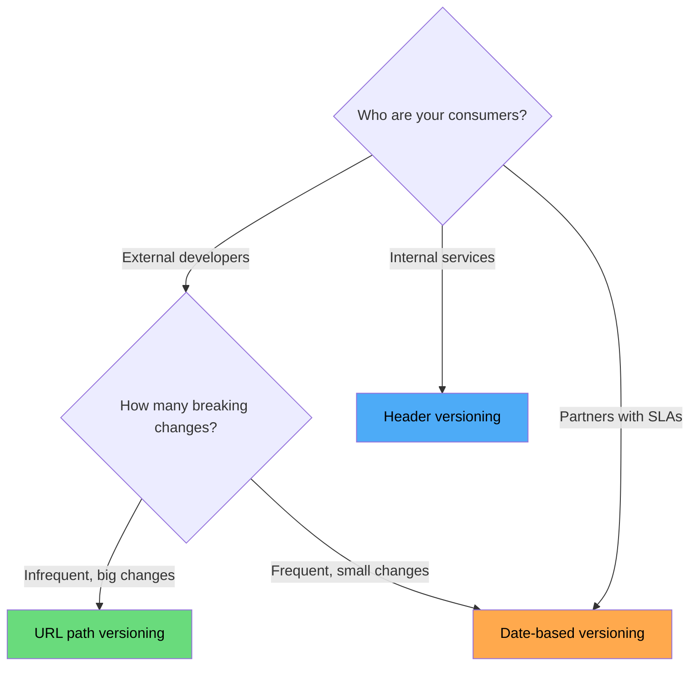
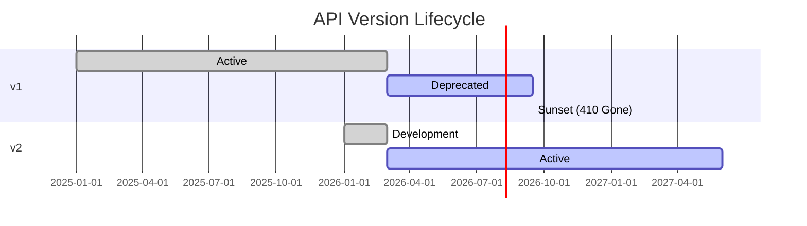

# API Versioning Strategies

Every API will change. New requirements emerge, data models evolve, mistakes need correction. The question is not whether you will version your API, but how — and the strategy you choose has profound implications for your consumers, your team's velocity, and your operational overhead.

## Why Versioning Matters

An API without a versioning strategy is a ticking time bomb. Eventually you will need to:

- Rename a field because the original name was misleading
- Change a field's type (string to object, integer to decimal)
- Remove a field that leaks internal data
- Restructure a response to support new capabilities
- Fix a security issue that requires changing request/response format

Without versioning, every change risks breaking every consumer. With versioning, you can evolve the API while giving consumers time to migrate.

## Breaking vs Non-Breaking Changes

Before choosing a versioning strategy, you must understand what constitutes a breaking change.

### Non-Breaking Changes (Additive)

These changes are safe to ship without a version bump — assuming consumers follow the robustness principle (ignore unknown fields):

| Change | Example | Why It's Safe |
|--------|---------|---------------|
| Add a new field to response | Add `created_at` to Order | Consumers ignoring unknown fields are unaffected |
| Add a new optional query parameter | Add `?include_archived=true` | Existing queries continue to work |
| Add a new endpoint | `GET /api/invoices` | No existing endpoint is affected |
| Add a new enum value | Status gains `"backordered"` | Consumers should handle unknown enum values gracefully |
| Add a new optional request field | Add optional `notes` to POST body | Existing requests without the field still work |
| Widen a constraint | Max length 50 → 100 | Existing valid inputs remain valid |

### Breaking Changes

These changes **will** break consumers and require a version bump:

| Change | Example | Why It Breaks |
|--------|---------|---------------|
| Remove a field | Remove `legacy_id` from response | Consumers reading that field get undefined/null |
| Rename a field | `userName` → `user_name` | Consumer deserialization fails |
| Change a field's type | `"price": 9.99` → `"price": { "amount": 999, "currency": "USD" }` | Type parsing breaks |
| Change a required field to optional | `email` was required, now optional | Consumers assume it is always present |
| Tighten a constraint | Max length 100 → 50 | Previously valid inputs now rejected |
| Change URL structure | `/users/42/orders` → `/orders?user_id=42` | Existing URLs return 404 |
| Change error format | Free text → RFC 7807 | Consumer error parsing breaks |
| Change authentication method | API key → OAuth 2.0 | Existing auth headers rejected |

::: danger
Removing a field from a response is always a breaking change, even if you think no one uses it. You cannot know what consumers depend on without explicit tracking. Always deprecate before removing.
:::

## Versioning Strategies

### 1. URL Path Versioning

The version is embedded in the URL path.

```
GET /api/v1/orders/42
GET /api/v2/orders/42
```

**Implementation (Express.js):**

```typescript
import express from 'express';

const app = express();

// v1 routes
const v1Router = express.Router();
v1Router.get('/orders/:id', (req, res) => {
  // v1: returns flat structure
  res.json({
    id: req.params.id,
    total: 99.99,          // number (dollars)
    customer_name: 'Alice'  // denormalized
  });
});

// v2 routes
const v2Router = express.Router();
v2Router.get('/orders/:id', (req, res) => {
  // v2: structured money, nested customer
  res.json({
    id: req.params.id,
    total: { amount: 9999, currency: 'USD' }, // structured money
    customer: { id: 'cust_7', name: 'Alice' } // nested resource
  });
});

app.use('/api/v1', v1Router);
app.use('/api/v2', v2Router);
```

| Pros | Cons |
|------|------|
| Immediately visible which version is in use | URL changes between versions |
| Easy to route at load balancer / API gateway level | Can lead to full API duplication |
| Simple to cache (different URLs = different cache keys) | Consumers must update all URLs to migrate |
| Easy to deprecate (return 410 Gone for old version URLs) | Not "pure" REST (URLs should identify resources, not versions) |

**Who uses this:** Stripe (`/v1/`), Twilio (`/2010-04-01/`), GitHub (`/v3/`).

### 2. Header Versioning

The version is specified in a custom request header.

```
GET /api/orders/42
Api-Version: 2
```

Or using the `Accept` header with a vendor media type:

```
GET /api/orders/42
Accept: application/vnd.myapp.v2+json
```

**Implementation (Express.js):**

```typescript
app.get('/api/orders/:id', (req, res) => {
  const version = req.headers['api-version'] || '1';

  const order = getOrder(req.params.id);

  if (version === '2') {
    return res.json({
      id: order.id,
      total: { amount: order.totalCents, currency: order.currency },
      customer: { id: order.customerId, name: order.customerName }
    });
  }

  // Default: v1 response
  res.json({
    id: order.id,
    total: order.totalCents / 100,
    customer_name: order.customerName
  });
});
```

| Pros | Cons |
|------|------|
| Clean URLs (resource identity is stable) | Not visible in browser URL bar or access logs |
| Fine-grained (can version individual endpoints) | Harder to cache (requires `Vary: Api-Version` header) |
| Follows HTTP content negotiation semantics | Consumers must configure custom headers in every client |
| No URL duplication | Easy to forget, leading to accidental version mismatches |

**Who uses this:** GitHub (`Accept: application/vnd.github.v3+json`), Stripe (as a secondary mechanism via `Stripe-Version` header).

### 3. Query Parameter Versioning

The version is specified as a query parameter.

```
GET /api/orders/42?version=2
```

| Pros | Cons |
|------|------|
| Simple to implement | Pollutes the query string |
| Visible in logs and URLs | Mixes versioning concern with business parameters |
| Easy to test in a browser | Can be accidentally omitted |
| Optional with a default | Not idiomatic REST |

**Who uses this:** Google APIs (some services), AWS (some services use `Action` + `Version` params).

### 4. Date-Based Versioning

Instead of incrementing integers, use the date the API version was released.

```
GET /api/orders/42
Stripe-Version: 2026-02-15
```

**This is Stripe's primary approach.** Each API version is pinned to a date, and new accounts default to the latest version. Consumers can pin to a specific date and upgrade on their own schedule.

```typescript
// Stripe-style date versioning
app.get('/api/orders/:id', (req, res) => {
  const version = req.headers['stripe-version'] || '2026-03-01';
  const versionDate = new Date(version);

  const order = getOrder(req.params.id);
  const response: Record<string, unknown> = { id: order.id };

  // Feature: structured money (shipped 2026-02-15)
  if (versionDate >= new Date('2026-02-15')) {
    response.total = { amount: order.totalCents, currency: order.currency };
  } else {
    response.total = order.totalCents / 100;
  }

  // Feature: nested customer (shipped 2026-03-01)
  if (versionDate >= new Date('2026-03-01')) {
    response.customer = { id: order.customerId, name: order.customerName };
  } else {
    response.customer_name = order.customerName;
  }

  res.json(response);
});
```

| Pros | Cons |
|------|------|
| Granular: each change gets its own version date | Complex implementation (version comparisons at every response point) |
| No big-bang version migrations | Combinatorial testing burden |
| Clear timeline of changes | Requires discipline to maintain version changelog |
| Consumers upgrade incrementally | Can accumulate significant code complexity over time |

### Strategy Comparison



| Factor | URL Path | Header | Query Param | Date-Based |
|--------|----------|--------|-------------|------------|
| **Discoverability** | Excellent | Poor | Good | Poor |
| **Cacheability** | Excellent | Needs `Vary` header | Good | Needs `Vary` header |
| **Granularity** | Entire API | Per-endpoint | Entire API | Per-change |
| **Client complexity** | Low | Medium | Low | Medium |
| **Server complexity** | Medium | Medium | Low | High |
| **Best for** | Public APIs | Internal APIs | Simple APIs | Evolving APIs with many consumers |

::: tip
For most teams, **URL path versioning** is the right default. It is the simplest to understand, implement, route, cache, and deprecate. Use date-based versioning only if you have Stripe's scale of consumer base and engineering investment.
:::

## Semantic Versioning for APIs

While SemVer (MAJOR.MINOR.PATCH) was designed for libraries, the concepts apply to APIs:

```
MAJOR — Breaking changes (new URL version: /v1 → /v2)
MINOR — New features, additive changes (no version bump needed)
PATCH — Bug fixes in existing behavior (no version bump needed)
```

In practice, most API versioning only tracks the MAJOR version. Minor and patch changes are deployed continuously without version bumps because they are non-breaking.

### Changelog Discipline

Every API change — breaking or not — should be documented:

```markdown
## 2026-03-15 (v2.3)

### Added
- `GET /api/orders` now supports `?sort` parameter
- Order response includes new `estimated_delivery` field

### Deprecated
- `customer_name` field in Order response. Use `customer.name` instead.
  Removal scheduled for 2026-09-15.

## 2026-03-01 (v2.0) — BREAKING

### Changed
- `total` field changed from number to object: `{ amount, currency }`
- `customer_name` replaced by nested `customer` object

### Removed
- `GET /api/v1/*` endpoints (sunset completed)
```

## Deprecation Workflow

Deprecation is a contract with your consumers: "this feature is going away, and here is how much time you have to migrate."

### The Sunset Header (RFC 8594)

```
HTTP/1.1 200 OK
Sunset: Sat, 15 Sep 2026 00:00:00 GMT
Deprecation: Thu, 15 Mar 2026 00:00:00 GMT
Link: <https://api.example.com/docs/migration-v2>; rel="sunset"
```

### Implementation

```typescript
function deprecationMiddleware(
  sunsetDate: Date,
  migrationUrl: string
) {
  return (req: Request, res: Response, next: NextFunction) => {
    res.set('Deprecation', new Date().toUTCString());
    res.set('Sunset', sunsetDate.toUTCString());
    res.set('Link', `<${migrationUrl}>; rel="sunset"`);

    // Log usage for tracking migration progress
    logger.warn('Deprecated endpoint accessed', {
      path: req.path,
      consumer: req.headers['x-api-key'],
      sunset: sunsetDate.toISOString()
    });

    next();
  };
}

// Apply to deprecated endpoints
v1Router.use(deprecationMiddleware(
  new Date('2026-09-15'),
  'https://api.example.com/docs/v1-to-v2-migration'
));
```

### Deprecation Timeline



### Deprecation Best Practices

1. **Announce deprecation at least 6 months before sunset** for public APIs, 3 months for internal APIs
2. **Track consumer usage** — know who is still using deprecated endpoints before sunset
3. **Provide a migration guide** — not just "use v2" but step-by-step field mapping
4. **Return `410 Gone`** after sunset, not `404 Not Found` — `410` tells consumers the resource existed but was intentionally removed
5. **Email consumers** at deprecation, at the halfway point, at 30 days, and at 7 days before sunset

## Handling Multiple Versions in Production

### The Adapter Pattern

Instead of duplicating your entire codebase for each version, use adapters to transform between versions:

```typescript
// Core business logic — version-agnostic
interface OrderCore {
  id: string;
  totalCents: number;
  currency: string;
  customerId: string;
  customerName: string;
}

// v1 response adapter
function toV1Response(order: OrderCore) {
  return {
    id: order.id,
    total: order.totalCents / 100,
    customer_name: order.customerName
  };
}

// v2 response adapter
function toV2Response(order: OrderCore) {
  return {
    id: order.id,
    total: { amount: order.totalCents, currency: order.currency },
    customer: { id: order.customerId, name: order.customerName }
  };
}

// Route handler dispatches to the right adapter
app.get('/api/:version/orders/:id', (req, res) => {
  const order = orderService.getById(req.params.id);

  switch (req.params.version) {
    case 'v1': return res.json(toV1Response(order));
    case 'v2': return res.json(toV2Response(order));
    default: return res.status(404).json({ error: 'Unknown API version' });
  }
});
```

### Testing Multiple Versions

```typescript
describe('Order API', () => {
  const testOrder: OrderCore = {
    id: 'order_1',
    totalCents: 9999,
    currency: 'USD',
    customerId: 'cust_7',
    customerName: 'Alice'
  };

  it('v1 returns flat total as dollars', async () => {
    const res = await request(app).get('/api/v1/orders/order_1');
    expect(res.body.total).toBe(99.99);
    expect(res.body.customer_name).toBe('Alice');
  });

  it('v2 returns structured total and nested customer', async () => {
    const res = await request(app).get('/api/v2/orders/order_1');
    expect(res.body.total).toEqual({ amount: 9999, currency: 'USD' });
    expect(res.body.customer.name).toBe('Alice');
  });
});
```

## API Gateway Versioning

At scale, version routing is best handled at the API gateway layer rather than in individual services:

```yaml
# Kong API Gateway configuration
services:
  - name: orders-v1
    url: http://orders-service-v1:3000
    routes:
      - name: orders-v1-route
        paths:
          - /api/v1/orders

  - name: orders-v2
    url: http://orders-service-v2:3000
    routes:
      - name: orders-v2-route
        paths:
          - /api/v2/orders
```

This allows you to deploy different versions as separate services, enabling independent scaling, deployment, and eventual shutdown of old versions.

## Common Mistakes

| Mistake | Why It's a Problem | What to Do Instead |
|---------|--------------------|--------------------|
| Versioning too eagerly | Every version is maintenance burden | Only version for true breaking changes |
| Not versioning at all | First breaking change creates chaos | Start with `/v1/` from day one |
| Supporting too many versions | Testing/maintenance grows linearly | Max 2-3 active versions |
| No sunset date | Old versions live forever | Set a sunset date at deprecation time |
| Big-bang migration | Consumers cannot migrate gradually | Phase changes, deprecate field-by-field |

## Further Reading

- [REST API Best Practices](/system-design/api-design/rest-best-practices) — the foundation for API design decisions
- [OpenAPI & Swagger](/system-design/api-design/openapi-swagger) — how to formally specify each API version
- [API Security Patterns](/system-design/api-design/api-security-patterns) — versioning considerations for auth schemes
- [Microservices API Gateway](/architecture-patterns/microservices/api-gateway-pattern) — gateway-level version routing
