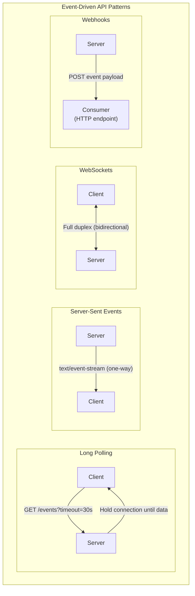
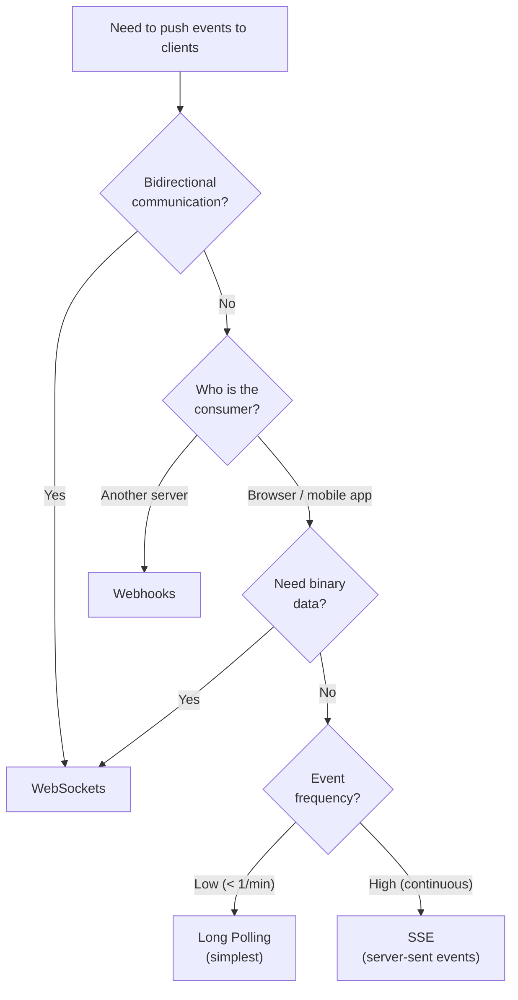
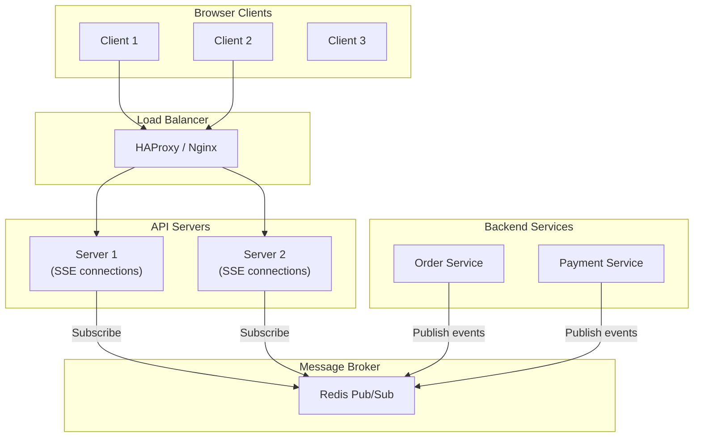

# Event-Driven APIs

Traditional REST APIs are request-response: the client asks, the server answers. Event-driven APIs flip this — the server pushes data to the client when something happens. This is essential for real-time dashboards, notifications, live collaboration, IoT telemetry, and any system where polling for changes is wasteful or too slow.

This page covers the four main patterns (webhooks, WebSockets, SSE, long polling), the AsyncAPI specification for documenting event-driven APIs, the CloudEvents standard for event formatting, and production implementation patterns.

## The Four Patterns



### Comparison Table

| Factor | Long Polling | SSE | WebSockets | Webhooks |
|--------|-------------|-----|------------|----------|
| **Direction** | Server to client (simulated) | Server to client | Bidirectional | Server to consumer |
| **Protocol** | HTTP | HTTP | WS (TCP upgrade) | HTTP |
| **Latency** | Moderate (reconnection overhead) | Low (persistent) | Lowest (persistent, full duplex) | Low (asynchronous) |
| **Connection** | Repeated HTTP requests | Single persistent HTTP | Single persistent TCP | No persistent connection |
| **Browser support** | Universal | Universal (except IE) | Universal | N/A (server-to-server) |
| **Firewall friendly** | Yes | Yes | Sometimes blocked | Consumer must be reachable |
| **Load balancer support** | Easy | Easy | Needs sticky sessions or WS-aware LB | Easy |
| **Scalability** | Low (many connections) | Medium | Medium | High (fire and forget) |
| **Reconnection** | Client handles | Built-in (`EventSource`) | Manual (or libraries) | Retry with exponential backoff |
| **Binary data** | No | No (text only) | Yes | Yes (in POST body) |
| **Best for** | Simple real-time, legacy support | Live feeds, dashboards, LLM streaming | Chat, gaming, collaborative editing | System integrations, async notifications |

### Decision Flowchart



## Server-Sent Events (SSE)

SSE is the simplest persistent push mechanism. The client opens an HTTP connection, and the server sends events as they occur. The connection stays open until closed by either side.

### Server Implementation (Python/FastAPI)

```python
from fastapi import FastAPI, Request
from fastapi.responses import StreamingResponse
import asyncio
import json

app = FastAPI()

async def event_generator(request: Request, channel: str):
    """Generate SSE events for a given channel."""
    try:
        while True:
            # Check if client disconnected
            if await request.is_disconnected():
                break

            # Get next event (from Redis, database, or queue)
            event = await get_next_event(channel)

            if event:
                # SSE format: "data: ...\n\n"
                yield f"event: {event['type']}\n"
                yield f"data: {json.dumps(event['payload'])}\n"
                yield f"id: {event['id']}\n"
                yield "\n"
            else:
                # Send heartbeat to keep connection alive
                yield ": heartbeat\n\n"

            await asyncio.sleep(0.5)
    except asyncio.CancelledError:
        pass

@app.get("/events/{channel}")
async def stream_events(channel: str, request: Request):
    return StreamingResponse(
        event_generator(request, channel),
        media_type="text/event-stream",
        headers={
            "Cache-Control": "no-cache",
            "Connection": "keep-alive",
            "X-Accel-Buffering": "no",  # Disable nginx buffering
        },
    )
```

### Server Implementation (Node.js/Express)

```typescript
import express from "express";

const app = express();

app.get("/events/:channel", (req, res) => {
  const { channel } = req.params;

  // Set SSE headers
  res.writeHead(200, {
    "Content-Type": "text/event-stream",
    "Cache-Control": "no-cache",
    Connection: "keep-alive",
    "X-Accel-Buffering": "no",
  });

  // Send initial connection event
  res.write(`event: connected\ndata: ${JSON.stringify({ channel })}\n\n`);

  // Heartbeat every 30 seconds
  const heartbeat = setInterval(() => {
    res.write(": heartbeat\n\n");
  }, 30000);

  // Subscribe to events (e.g., from Redis pub/sub)
  const subscriber = subscribeToChannel(channel, (event: Event) => {
    res.write(`event: ${event.type}\n`);
    res.write(`data: ${JSON.stringify(event.payload)}\n`);
    res.write(`id: ${event.id}\n`);
    res.write("\n");
  });

  // Cleanup on disconnect
  req.on("close", () => {
    clearInterval(heartbeat);
    subscriber.unsubscribe();
  });
});
```

### Client Implementation

```typescript
// Browser EventSource API — built-in reconnection
const eventSource = new EventSource("/events/orders");

// Listen for specific event types
eventSource.addEventListener("order.created", (event: MessageEvent) => {
  const order = JSON.parse(event.data);
  console.log(`New order: ${order.id}`);
  // event.lastEventId — for resumption after reconnection
});

eventSource.addEventListener("order.updated", (event: MessageEvent) => {
  const order = JSON.parse(event.data);
  updateOrderUI(order);
});

// Generic message handler (for events without a type)
eventSource.onmessage = (event: MessageEvent) => {
  console.log("Message:", event.data);
};

// Error handling and reconnection
eventSource.onerror = (error) => {
  if (eventSource.readyState === EventSource.CONNECTING) {
    console.log("Reconnecting...");  // EventSource auto-reconnects
  } else {
    console.error("SSE error:", error);
    eventSource.close();
  }
};

// Close when done
eventSource.close();
```

### SSE Wire Format

```
event: order.created
data: {"id": "ord_123", "total": 99.99, "status": "pending"}
id: evt_456
retry: 5000

event: order.updated
data: {"id": "ord_123", "status": "confirmed"}
id: evt_457

: this is a comment (used for heartbeats)

data: Simple message without an event type
id: evt_458

```

::: tip SSE for LLM Streaming
SSE is the standard transport for LLM streaming responses. Both OpenAI and Anthropic use SSE for their streaming APIs. The `text/event-stream` format maps naturally to token-by-token generation.
```
data: {"choices":[{"delta":{"content":"Hello"}}]}

data: {"choices":[{"delta":{"content":" world"}}]}

data: [DONE]
```
:::

## WebSockets

WebSockets provide full-duplex, bidirectional communication over a single TCP connection. After an HTTP upgrade handshake, both client and server can send messages at any time.

### Server Implementation (Python/FastAPI)

```python
from fastapi import FastAPI, WebSocket, WebSocketDisconnect
import json

app = FastAPI()

class ConnectionManager:
    """Manage active WebSocket connections."""

    def __init__(self):
        self.active_connections: dict[str, list[WebSocket]] = {}

    async def connect(self, websocket: WebSocket, channel: str):
        await websocket.accept()
        self.active_connections.setdefault(channel, []).append(websocket)

    def disconnect(self, websocket: WebSocket, channel: str):
        self.active_connections.get(channel, []).remove(websocket)

    async def broadcast(self, channel: str, message: dict):
        """Send message to all connections on a channel."""
        for connection in self.active_connections.get(channel, []):
            try:
                await connection.send_json(message)
            except Exception:
                self.disconnect(connection, channel)

manager = ConnectionManager()

@app.websocket("/ws/{channel}")
async def websocket_endpoint(websocket: WebSocket, channel: str):
    await manager.connect(websocket, channel)
    try:
        while True:
            # Receive messages from client
            data = await websocket.receive_json()

            if data["type"] == "message":
                # Broadcast to all clients in the channel
                await manager.broadcast(channel, {
                    "type": "message",
                    "sender": data.get("sender", "anonymous"),
                    "content": data["content"],
                })
            elif data["type"] == "ping":
                await websocket.send_json({"type": "pong"})

    except WebSocketDisconnect:
        manager.disconnect(websocket, channel)
        await manager.broadcast(channel, {
            "type": "system",
            "content": "A user has left the channel.",
        })
```

### Client Implementation

```typescript
class WebSocketClient {
  private ws: WebSocket | null = null;
  private reconnectAttempts = 0;
  private maxReconnectAttempts = 10;
  private handlers: Map<string, Function[]> = new Map();

  connect(url: string): void {
    this.ws = new WebSocket(url);

    this.ws.onopen = () => {
      console.log("Connected");
      this.reconnectAttempts = 0;
      // Send authentication or subscription messages
      this.send({ type: "subscribe", channels: ["orders", "alerts"] });
    };

    this.ws.onmessage = (event: MessageEvent) => {
      const data = JSON.parse(event.data);
      const handlers = this.handlers.get(data.type) || [];
      handlers.forEach((handler) => handler(data));
    };

    this.ws.onclose = (event: CloseEvent) => {
      if (!event.wasClean) {
        this.reconnect(url);
      }
    };

    this.ws.onerror = (error) => {
      console.error("WebSocket error:", error);
    };
  }

  private reconnect(url: string): void {
    if (this.reconnectAttempts >= this.maxReconnectAttempts) {
      console.error("Max reconnection attempts reached");
      return;
    }

    const delay = Math.min(1000 * Math.pow(2, this.reconnectAttempts), 30000);
    this.reconnectAttempts++;

    console.log(`Reconnecting in ${delay}ms (attempt ${this.reconnectAttempts})`);
    setTimeout(() => this.connect(url), delay);
  }

  on(eventType: string, handler: Function): void {
    const handlers = this.handlers.get(eventType) || [];
    handlers.push(handler);
    this.handlers.set(eventType, handlers);
  }

  send(data: object): void {
    if (this.ws?.readyState === WebSocket.OPEN) {
      this.ws.send(JSON.stringify(data));
    }
  }

  close(): void {
    this.ws?.close(1000, "Client closing");
  }
}

// Usage
const client = new WebSocketClient();
client.on("message", (data: any) => console.log("Message:", data.content));
client.on("alert", (data: any) => showNotification(data));
client.connect("wss://api.example.com/ws/my-channel");
```

::: warning WebSocket Scaling
WebSockets are stateful — each connection lives on a specific server. In a multi-server deployment:
1. Use **sticky sessions** (hash client IP to server) or a WebSocket-aware load balancer
2. Use **Redis Pub/Sub** or a message broker to fan out events across servers
3. Monitor connection counts — each server can handle ~10K-50K concurrent WebSocket connections depending on memory
4. Implement heartbeats (ping/pong) to detect dead connections
:::

## Long Polling

Long polling is the simplest push simulation. The client makes an HTTP request, and the server holds it open until data is available or a timeout is reached.

::: code-group

```python
from fastapi import FastAPI
import asyncio

app = FastAPI()

@app.get("/poll/{channel}")
async def long_poll(channel: str, last_event_id: str = None, timeout: int = 30):
    """Hold the request until new data is available or timeout."""
    try:
        event = await asyncio.wait_for(
            wait_for_event(channel, after=last_event_id),
            timeout=timeout,
        )
        return {"status": "event", "data": event, "event_id": event["id"]}
    except asyncio.TimeoutError:
        return {"status": "timeout", "data": None}
```

```typescript
// Client-side long polling loop
async function longPoll(
  channel: string,
  lastEventId: string | null = null
): Promise<void> {
  while (true) {
    try {
      const params = new URLSearchParams({ timeout: "30" });
      if (lastEventId) params.set("last_event_id", lastEventId);

      const response = await fetch(`/poll/${channel}?${params}`);
      const result = await response.json();

      if (result.status === "event") {
        handleEvent(result.data);
        lastEventId = result.event_id;
      }
      // Immediately reconnect for next event
    } catch (error) {
      console.error("Poll error:", error);
      await new Promise((r) => setTimeout(r, 5000)); // Back off on error
    }
  }
}
```

:::

## AsyncAPI Specification

AsyncAPI is the OpenAPI equivalent for event-driven APIs. It documents message brokers, channels, and message schemas in a machine-readable format.

```yaml
# asyncapi.yaml
asyncapi: '3.0.0'
info:
  title: Order Events API
  version: '1.0.0'
  description: |
    Real-time order events via SSE and WebSocket.
    Subscribe to receive order lifecycle notifications.

servers:
  production:
    host: api.example.com
    protocol: wss
    description: Production WebSocket server
  sse:
    host: api.example.com
    protocol: https
    description: SSE endpoint

channels:
  orders:
    address: /events/orders
    messages:
      orderCreated:
        $ref: '#/components/messages/OrderCreated'
      orderUpdated:
        $ref: '#/components/messages/OrderUpdated'
      orderCancelled:
        $ref: '#/components/messages/OrderCancelled'

operations:
  receiveOrderEvents:
    action: receive
    channel:
      $ref: '#/channels/orders'
    summary: Receive real-time order events
    messages:
      - $ref: '#/channels/orders/messages/orderCreated'
      - $ref: '#/channels/orders/messages/orderUpdated'
      - $ref: '#/channels/orders/messages/orderCancelled'

components:
  messages:
    OrderCreated:
      name: order.created
      title: Order Created
      contentType: application/json
      payload:
        type: object
        required: [order_id, customer_id, total, created_at]
        properties:
          order_id:
            type: string
            format: uuid
          customer_id:
            type: string
          total:
            type: number
            format: float
          items:
            type: array
            items:
              $ref: '#/components/schemas/OrderItem'
          created_at:
            type: string
            format: date-time

    OrderUpdated:
      name: order.updated
      title: Order Updated
      contentType: application/json
      payload:
        type: object
        required: [order_id, status, updated_at]
        properties:
          order_id:
            type: string
            format: uuid
          status:
            type: string
            enum: [confirmed, processing, shipped, delivered]
          updated_at:
            type: string
            format: date-time

    OrderCancelled:
      name: order.cancelled
      title: Order Cancelled
      contentType: application/json
      payload:
        type: object
        required: [order_id, reason, cancelled_at]
        properties:
          order_id:
            type: string
            format: uuid
          reason:
            type: string
          cancelled_at:
            type: string
            format: date-time

  schemas:
    OrderItem:
      type: object
      properties:
        product_id:
          type: string
        name:
          type: string
        quantity:
          type: integer
        price:
          type: number
```

::: tip AsyncAPI Tooling
AsyncAPI provides code generation, documentation rendering, and validation tools:
- `@asyncapi/generator` — Generate code from your spec
- `@asyncapi/studio` — Visual editor for AsyncAPI documents
- `@asyncapi/html-template` — Generate HTML documentation
- `asyncapi validate asyncapi.yaml` — Validate your spec
:::

## CloudEvents Standard

CloudEvents is a CNCF specification for describing events in a common format. It standardizes the metadata envelope so consumers can route, filter, and process events regardless of the source.

```json
{
  "specversion": "1.0",
  "id": "evt_a1b2c3d4",
  "source": "/services/order-service",
  "type": "com.example.order.created",
  "datacontenttype": "application/json",
  "time": "2026-03-20T10:30:00Z",
  "subject": "order/ord_123",
  "data": {
    "order_id": "ord_123",
    "customer_id": "cust_456",
    "total": 99.99,
    "items": [
      {"product_id": "prod_789", "quantity": 2, "price": 49.99}
    ]
  }
}
```

### CloudEvents Fields

| Field | Required | Description |
|-------|----------|-------------|
| `specversion` | Yes | CloudEvents spec version (always `"1.0"`) |
| `id` | Yes | Unique event identifier |
| `source` | Yes | Event origin (URI) |
| `type` | Yes | Event type (reverse domain notation) |
| `datacontenttype` | No | Content type of `data` field |
| `time` | No | Timestamp (RFC 3339) |
| `subject` | No | Subject of the event (resource path) |
| `data` | No | Event payload |

### Implementing CloudEvents in Python

```python
from cloudevents.http import CloudEvent, to_json, from_http
from datetime import datetime, timezone
import uuid

# Create a CloudEvent
event = CloudEvent({
    "specversion": "1.0",
    "id": str(uuid.uuid4()),
    "source": "/services/order-service",
    "type": "com.example.order.created",
    "time": datetime.now(timezone.utc).isoformat(),
    "subject": f"order/{order_id}",
    "datacontenttype": "application/json",
}, data={
    "order_id": order_id,
    "customer_id": customer_id,
    "total": 99.99,
})

# Serialize for HTTP transport
headers, body = to_json(event)

# Parse incoming CloudEvent from HTTP request
def handle_webhook(request):
    event = from_http(request.headers, request.body)
    print(f"Event type: {event['type']}")
    print(f"Event data: {event.data}")
```

## Production Architecture

### Scaling SSE with Redis



```python
import redis.asyncio as redis

class SSEBroker:
    """Fan out events to SSE connections via Redis Pub/Sub."""

    def __init__(self, redis_url: str = "redis://localhost:6379"):
        self.redis = redis.from_url(redis_url)

    async def publish(self, channel: str, event: dict):
        """Publish an event (called by backend services)."""
        await self.redis.publish(channel, json.dumps(event))

    async def subscribe(self, channel: str):
        """Subscribe to events (called by SSE endpoint)."""
        pubsub = self.redis.pubsub()
        await pubsub.subscribe(channel)

        async for message in pubsub.listen():
            if message["type"] == "message":
                yield json.loads(message["data"])
```

### Event Ordering and Idempotency

```python
class EventConsumer:
    """Process events with ordering and idempotency guarantees."""

    def __init__(self, db_pool):
        self.db_pool = db_pool

    async def process_event(self, event: dict) -> bool:
        """Process an event exactly once."""
        async with self.db_pool.acquire() as conn:
            async with conn.transaction():
                # Check idempotency — have we seen this event before?
                existing = await conn.fetchrow(
                    "SELECT id FROM processed_events WHERE event_id = $1",
                    event["id"]
                )
                if existing:
                    return False  # Already processed

                # Process the event
                await self.handle_event(event)

                # Record that we processed it
                await conn.execute(
                    "INSERT INTO processed_events (event_id, processed_at) VALUES ($1, NOW())",
                    event["id"]
                )
                return True
```

::: danger Event Ordering Is Hard
Events from distributed systems can arrive out of order. A `order.shipped` event might arrive before `order.confirmed` due to network timing. Strategies:
1. **Sequence numbers** — Include a monotonic sequence number; reject or buffer out-of-order events
2. **Timestamps** — Use server-side timestamps and process events in order; accept slight delays
3. **State machines** — Validate state transitions and reject invalid ones
4. **Eventual consistency** — Accept that order is best-effort and design handlers to be idempotent
:::

## See Also

- [Webhook Design Patterns](/system-design/api-design/webhooks) — Deep dive into webhook reliability and delivery
- [REST Best Practices](/system-design/api-design/rest-best-practices) — When request-response is the right choice
- [Python Async Deep Dive](/infrastructure/languages/python-async) — Async patterns for implementing SSE and WebSockets
- [GraphQL Advanced Patterns](/system-design/api-design/graphql-advanced) — GraphQL subscriptions as an alternative
- [OpenAPI & Swagger](/system-design/api-design/openapi-swagger) — Documenting request-response APIs
