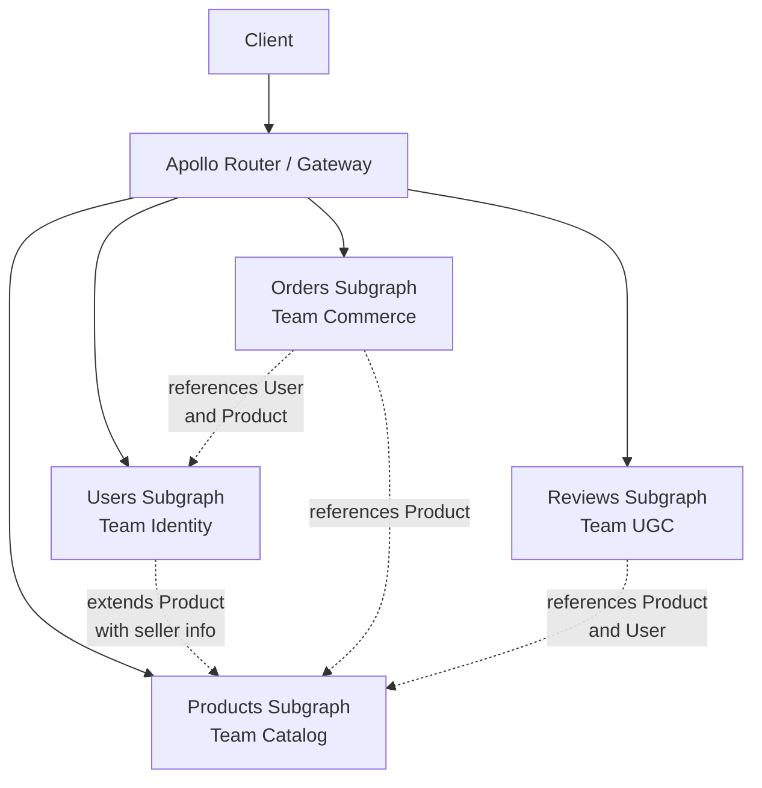
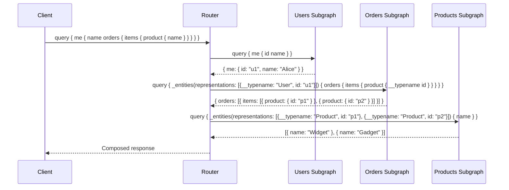
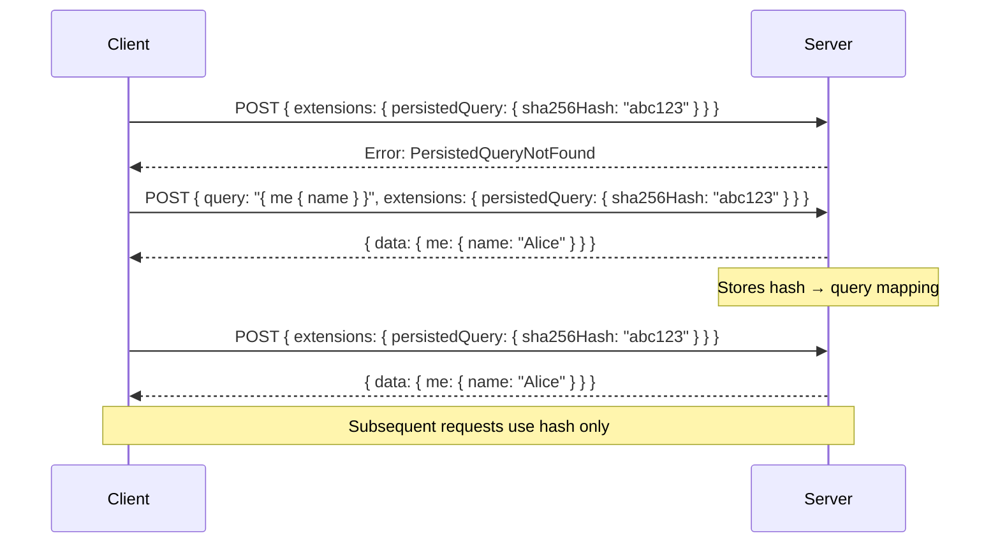
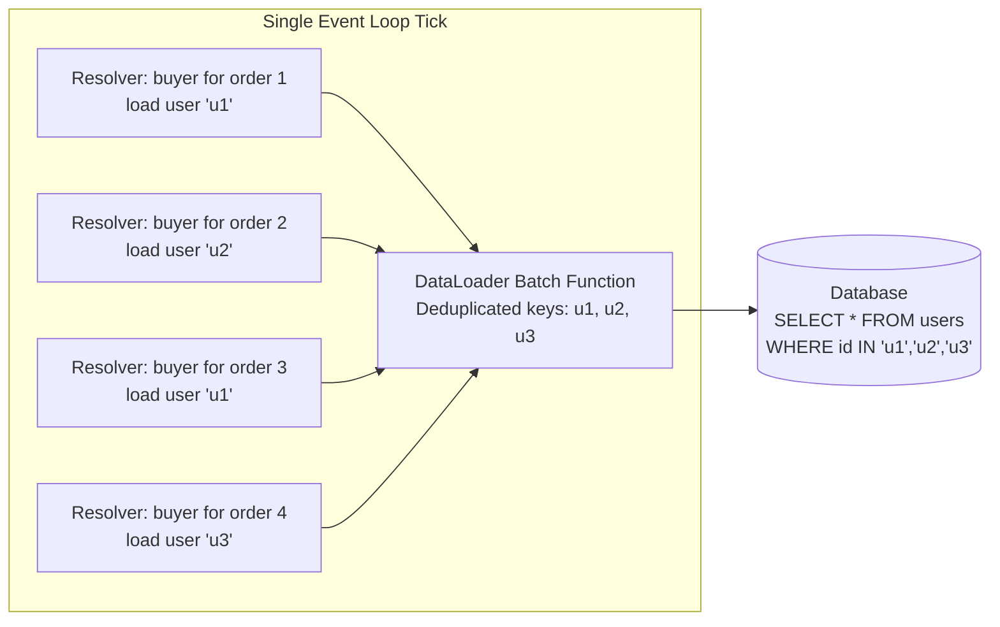

# GraphQL Advanced Patterns

GraphQL solves the over-fetching and under-fetching problem elegantly for a single service. But the moment you have 10 teams owning 50 types across 200 microservices, a single monolithic schema becomes the bottleneck. Federation lets each team own their slice of the graph. DataLoader prevents N+1 queries from destroying your database. Persisted queries eliminate the cost of parsing arbitrary client queries. Query complexity analysis stops malicious or naive queries from taking down your server.

This page covers the patterns that separate a GraphQL proof-of-concept from a production-grade graph layer serving millions of requests per day.

---

## Federation Architecture

### The Problem with Monolithic Schemas

In a monolithic GraphQL server, one team owns the entire schema. Every type, every resolver, every field. This works for small teams. At scale, it creates a bottleneck:

- Team A needs to add a field to the `User` type, but Team B owns the schema repo
- Deployments are coupled — a bug in the `Order` resolver blocks the `Product` team's release
- The schema file grows to thousands of lines, and merge conflicts become daily events

### Apollo Federation v2

Federation splits a single graph into multiple **subgraphs**, each owned by a different team. A **router** (gateway) composes them into a unified schema that clients query as if it were a single API.



Each subgraph is an independent GraphQL service that:
- Defines the types it owns
- Can extend types owned by other subgraphs
- Resolves its own fields autonomously
- Deploys independently

### Subgraph Composition

**Users subgraph** — defines and owns the `User` entity:

```typescript
// users-subgraph/schema.ts
import { buildSubgraphSchema } from '@apollo/subgraph';
import gql from 'graphql-tag';

const typeDefs = gql`
  type Query {
    me: User
    user(id: ID!): User
  }

  type User @key(fields: "id") {
    id: ID!
    name: String!
    email: String!
    createdAt: DateTime!
  }
`;

const resolvers = {
  Query: {
    me: (_, __, { currentUser }) => currentUser,
    user: (_, { id }, { dataSources }) =>
      dataSources.usersAPI.getUser(id),
  },
  User: {
    // Federation calls this when another subgraph
    // references a User by its key (id)
    __resolveReference(ref, { dataSources }) {
      return dataSources.usersAPI.getUser(ref.id);
    },
  },
};
```

**Products subgraph** — defines `Product` and extends `User` with seller info:

```typescript
const typeDefs = gql`
  type Query {
    product(id: ID!): Product
    products(first: Int = 10, after: String): ProductConnection!
  }

  type Product @key(fields: "id") {
    id: ID!
    name: String!
    price: Money!
    inventory: Int!
    seller: User!
  }

  # Extend the User type from the users subgraph
  extend type User @key(fields: "id") {
    id: ID! @external
    listings: [Product!]!
  }

  type Money {
    amount: Int!
    currency: String!
  }
`;

const resolvers = {
  Product: {
    __resolveReference(ref, { dataSources }) {
      return dataSources.productsAPI.getProduct(ref.id);
    },
    seller: (product) => ({ __typename: 'User', id: product.sellerId }),
  },
  User: {
    // Resolve listings for any User entity reference
    listings: (user, _, { dataSources }) =>
      dataSources.productsAPI.getProductsBySeller(user.id),
  },
};
```

**Orders subgraph** — references both `User` and `Product`:

```typescript
const typeDefs = gql`
  type Query {
    order(id: ID!): Order
    myOrders(first: Int = 10, after: String): OrderConnection!
  }

  type Order @key(fields: "id") {
    id: ID!
    buyer: User!
    items: [OrderItem!]!
    total: Money!
    status: OrderStatus!
    placedAt: DateTime!
  }

  type OrderItem {
    product: Product!
    quantity: Int!
    unitPrice: Money!
  }

  enum OrderStatus {
    PENDING
    CONFIRMED
    SHIPPED
    DELIVERED
    CANCELLED
  }

  extend type User @key(fields: "id") {
    id: ID! @external
    orders: [Order!]!
  }
`;
```

### Entity Resolution

When the router receives a query that spans subgraphs, it builds a **query plan** — a directed acyclic graph of fetches to each subgraph:



The `@key` directive tells the router which fields uniquely identify an entity. The `__resolveReference` function in each subgraph resolves an entity from its key fields. The router batches entity lookups automatically — if 50 orders reference 12 unique products, the router sends 12 representations in a single `_entities` query, not 50.

---

## Schema Stitching vs Federation

Schema stitching was the predecessor to federation. It still has valid use cases, but federation is the recommended approach for new projects.

| Aspect | Schema Stitching | Apollo Federation |
|--------|-----------------|-------------------|
| **Composition** | Gateway merges schemas at runtime | Router composes at build time (supergraph) |
| **Ownership** | Gateway team resolves cross-service fields | Each subgraph resolves its own fields |
| **Type extension** | Manual type merging with `delegateToSchema` | Declarative `@key`, `@extends`, `@external` |
| **Deploy coupling** | Gateway redeploy on any schema change | Subgraphs deploy independently |
| **Performance** | Extra network hop for delegated fields | Query plan optimizes fetch ordering |
| **Debugging** | Hard — delegation chains obscure errors | Better — query plans are inspectable |
| **Best for** | Legacy migration, wrapping REST APIs | Greenfield microservices, team autonomy |

::: warning
Schema stitching requires the gateway to understand every subgraph's internal schema details. As services evolve, the gateway becomes a fragile coupling point. Federation inverts this — each subgraph declares how it contributes to the graph, and the router composes automatically.
:::

---

## Subscriptions at Scale

GraphQL subscriptions provide real-time updates via a persistent connection. The spec is transport-agnostic, but WebSocket and Server-Sent Events (SSE) are the two dominant implementations.

### WebSocket Subscriptions

```typescript
// Server setup with graphql-ws (modern protocol)
import { WebSocketServer } from 'ws';
import { useServer } from 'graphql-ws/lib/use/ws';
import { makeExecutableSchema } from '@graphql-tools/schema';

const schema = makeExecutableSchema({
  typeDefs: `
    type Subscription {
      orderStatusChanged(orderId: ID!): OrderUpdate!
      newMessage(channelId: ID!): Message!
    }

    type OrderUpdate {
      orderId: ID!
      status: OrderStatus!
      updatedAt: DateTime!
    }
  `,
  resolvers: {
    Subscription: {
      orderStatusChanged: {
        subscribe: async function* (_, { orderId }, { pubsub }) {
          const channel = `ORDER_STATUS:$&#123;orderId}`;
          const iterator = pubsub.asyncIterableIterator(channel);
          for await (const event of iterator) {
            yield { orderStatusChanged: event };
          }
        },
      },
    },
  },
});

const wsServer = new WebSocketServer({ port: 4001, path: '/graphql' });

useServer(
  {
    schema,
    context: async (ctx) => {
      // Authenticate on connection init
      const token = ctx.connectionParams?.authToken;
      const user = await validateToken(token as string);
      if (!user) throw new Error('Unauthorized');
      return { user, pubsub: globalPubSub };
    },
    onConnect: (ctx) => {
      console.log(`Client connected: ${ctx.connectionParams?.clientId}`);
    },
    onDisconnect: (ctx) => {
      console.log('Client disconnected');
    },
  },
  wsServer,
);
```

### SSE for Simpler Subscriptions

Server-Sent Events work over standard HTTP, making them easier to deploy behind load balancers and CDNs. They are unidirectional (server to client only) but sufficient for most subscription use cases.

```typescript
// SSE transport for GraphQL subscriptions
import express from 'express';

app.get('/graphql/stream', async (req, res) => {
  res.setHeader('Content-Type', 'text/event-stream');
  res.setHeader('Cache-Control', 'no-cache');
  res.setHeader('Connection', 'keep-alive');

  const subscription = await subscribe({
    schema,
    document: parse(req.query.query as string),
    variableValues: JSON.parse(req.query.variables as string || '{}'),
    contextValue: { user: req.user },
  });

  if (isAsyncIterable(subscription)) {
    for await (const result of subscription) {
      res.write(`data: ${JSON.stringify(result)}\n\n`);
    }
  }

  req.on('close', () => {
    // Clean up subscription
  });
});
```

### Scaling Subscriptions

| Challenge | Solution |
|-----------|----------|
| Single server handles all connections | Use Redis PubSub to fan out events across server instances |
| WebSocket connections are stateful | Sticky sessions at the load balancer (L7 with cookie affinity) |
| Connection storms after server restart | Implement exponential backoff in client reconnection logic |
| Memory per connection | Budget ~10-50KB per subscription; monitor with prometheus |
| Federation + subscriptions | Route subscriptions to the owning subgraph via the router |

::: tip
For most production systems, start with SSE. It works through HTTP/2, requires no special load balancer configuration, and automatically reconnects. Use WebSocket only when you need bidirectional communication (e.g., collaborative editing, chat).
:::

---

## Persisted Queries and APQ

Parsing, validating, and planning a GraphQL query costs CPU on every request. Persisted queries eliminate this by pre-registering queries at build time.

### Automatic Persisted Queries (APQ)

APQ is a protocol where the client sends a hash of the query instead of the full query text. If the server has seen that hash before, it executes from cache. Otherwise, the client retries with the full query.



### Build-Time Persisted Queries

For maximum security, register all queries at build time and reject any query not in the allowlist. This eliminates entire classes of attacks (query injection, introspection abuse, resource exhaustion from crafted queries).

```typescript
// Build step: extract queries from client code
// relay-compiler or graphql-codegen generates a manifest
const queryManifest: Record<string, string> = {
  'abc123def456': 'query GetUser($id: ID!) { user(id: $id) { id name email } }',
  'xyz789ghi012': 'mutation PlaceOrder($input: PlaceOrderInput!) { placeOrder(input: $input) { id status } }',
};

// Server middleware: only execute registered queries
const persistedQueryPlugin = {
  async requestDidStart({ request }: GraphQLRequestContext) {
    const hash = request.extensions?.persistedQuery?.sha256Hash;
    if (hash && queryManifest[hash]) {
      request.query = queryManifest[hash];
    } else if (!request.query) {
      throw new GraphQLError('Only persisted queries are allowed', {
        extensions: { code: 'PERSISTED_QUERY_NOT_FOUND' },
      });
    }
  },
};
```

::: danger
In production, disable GraphQL introspection and allow only persisted queries. An open introspection endpoint lets attackers map your entire API surface. Combined with query complexity attacks, this is the most common GraphQL vulnerability.
:::

---

## The DataLoader Pattern

### The N+1 Problem

Consider this query:

```graphql
query {
  orders(first: 50) {
    nodes {
      id
      buyer {    # Each order fetches its buyer individually
        name
      }
    }
  }
}
```

Without DataLoader, this generates 51 SQL queries: 1 for the orders list, and 50 individual `SELECT * FROM users WHERE id = ?` queries — one per order's buyer. This is the N+1 problem.

### How DataLoader Works

DataLoader batches and deduplicates data-fetching calls within a single tick of the event loop:



### Implementation

```typescript
import DataLoader from 'dataloader';

// Create loaders per request (important: loaders are request-scoped)
function createLoaders(db: Database) {
  return {
    userLoader: new DataLoader<string, User>(async (userIds) => {
      // Single batched query for all requested user IDs
      const users = await db.query(
        'SELECT * FROM users WHERE id = ANY($1)',
        [userIds]
      );

      // DataLoader requires results in the same order as keys
      const userMap = new Map(users.map((u) => [u.id, u]));
      return userIds.map((id) => userMap.get(id) ?? new Error(`User ${id} not found`));
    }),

    productLoader: new DataLoader<string, Product>(async (productIds) => {
      const products = await db.query(
        'SELECT * FROM products WHERE id = ANY($1)',
        [productIds]
      );
      const productMap = new Map(products.map((p) => [p.id, p]));
      return productIds.map((id) => productMap.get(id) ?? new Error(`Product ${id} not found`));
    }),
  };
}

// Attach loaders to context (new loaders per request)
const server = new ApolloServer({
  schema,
  context: ({ req }) => ({
    loaders: createLoaders(db),
    user: authenticateRequest(req),
  }),
});

// Resolvers use loaders instead of direct DB calls
const resolvers = {
  Order: {
    buyer: (order, _, { loaders }) =>
      loaders.userLoader.load(order.buyerId),
    items: async (order, _, { loaders }) => {
      const items = await db.getOrderItems(order.id);
      // Each item's product is batched via the loader
      return items.map(async (item) => ({
        ...item,
        product: await loaders.productLoader.load(item.productId),
      }));
    },
  },
};
```

::: warning
DataLoaders must be created per-request, not globally. A global DataLoader caches results across requests, leading to stale data and memory leaks. The per-request pattern ensures the cache is fresh for every query and garbage-collected when the request completes.
:::

### DataLoader with Caching Layers

```typescript
// Layer 1: DataLoader (per-request, deduplication + batching)
// Layer 2: Redis (shared cache, TTL-based)
// Layer 3: Database (source of truth)

const userLoader = new DataLoader<string, User>(async (ids) => {
  // Check Redis first
  const cached = await redis.mget(ids.map((id) => `user:${id}`));
  const missingIds = ids.filter((_, i) => !cached[i]);

  // Fetch only cache misses from DB
  let dbUsers: User[] = [];
  if (missingIds.length > 0) {
    dbUsers = await db.query(
      'SELECT * FROM users WHERE id = ANY($1)',
      [missingIds]
    );
    // Populate Redis for next time
    const pipeline = redis.pipeline();
    for (const user of dbUsers) {
      pipeline.set(`user:${user.id}`, JSON.stringify(user), 'EX', 300);
    }
    await pipeline.exec();
  }

  // Merge cached and fresh results, maintain order
  const allUsers = new Map<string, User>();
  cached.forEach((data, i) => {
    if (data) allUsers.set(ids[i], JSON.parse(data));
  });
  dbUsers.forEach((u) => allUsers.set(u.id, u));

  return ids.map((id) => allUsers.get(id) ?? new Error(`User ${id} not found`));
});
```

---

## Query Complexity Analysis and Depth Limiting

### Why Limit Query Complexity

GraphQL's flexibility is a double-edged sword. A single query can request deeply nested data, causing exponential database load:

```graphql
# This innocent-looking query can fetch millions of rows
query {
  users(first: 100) {
    friends(first: 100) {
      friends(first: 100) {
        friends(first: 100) {
          name
        }
      }
    }
  }
}
# 100 * 100 * 100 * 100 = 100,000,000 potential records
```

### Depth Limiting

The simplest defense — reject queries that exceed a maximum nesting depth:

```typescript
import depthLimit from 'graphql-depth-limit';

const server = new ApolloServer({
  schema,
  validationRules: [depthLimit(7)], // Reject queries nested deeper than 7
});
```

### Cost-Based Complexity Analysis

Depth limiting is a blunt instrument. A better approach assigns a cost to each field and rejects queries that exceed a budget:

```typescript
import { createComplexityRule, simpleEstimator, fieldExtensionsEstimator } from 'graphql-query-complexity';

const complexityRule = createComplexityRule({
  maximumComplexity: 1000,
  estimators: [
    fieldExtensionsEstimator(),
    simpleEstimator({ defaultComplexity: 1 }),
  ],
  onComplete: (complexity: number) => {
    console.log(`Query complexity: ${complexity}`);
  },
});

// In your schema, annotate expensive fields
const typeDefs = gql`
  type Query {
    users(first: Int = 10): UserConnection!
      @complexity(value: 5, multipliers: ["first"])
    product(id: ID!): Product
      @complexity(value: 1)
  }

  type User {
    id: ID!
    name: String!
    orders: [Order!]! @complexity(value: 10)
    friends(first: Int = 10): [User!]!
      @complexity(value: 3, multipliers: ["first"])
  }
`;
```

### Complexity Calculation

The cost of a query is computed recursively:

| Field | Base Cost | Multiplier | Effective Cost |
|-------|-----------|------------|----------------|
| `users(first: 50)` | 5 | 50 | 250 |
| `users.name` | 1 | - | 1 per user = 50 |
| `users.orders` | 10 | - | 10 per user = 500 |
| `users.friends(first: 10)` | 3 | 10 | 30 per user = 1500 |
| **Total** | | | **2300** (rejected if max is 1000) |

### Combined Defense Strategy

```typescript
// Production GraphQL security layers
const server = new ApolloServer({
  schema,
  validationRules: [
    depthLimit(10),                           // Layer 1: depth limit
    createComplexityRule({ maximumComplexity: 1000 }), // Layer 2: cost analysis
  ],
  plugins: [
    ApolloServerPluginLandingPageDisabled(),   // Layer 3: disable playground
    persistedQueryPlugin,                      // Layer 4: allowlisted queries only
    {
      async requestDidStart() {
        return {
          async didResolveOperation(ctx) {
            // Layer 5: rate limit per user per operation
            const key = `gql:${ctx.contextValue.user.id}:${ctx.operationName}`;
            const count = await redis.incr(key);
            if (count === 1) await redis.expire(key, 60);
            if (count > 100) {
              throw new GraphQLError('Rate limit exceeded', {
                extensions: { code: 'RATE_LIMITED' },
              });
            }
          },
        };
      },
    },
  ],
});
```

---

## Performance Characteristics

| Metric | Without Optimization | With DataLoader | With DataLoader + Cache | With Persisted Queries |
|--------|---------------------|-----------------|------------------------|----------------------|
| SQL queries per request | N+1 (51 for 50 items) | 2 (batched) | 1-2 (cache hits) | Same (orthogonal) |
| Parse time per request | 1-5ms | Same | Same | ~0ms (pre-parsed) |
| Validation time | 0.5-2ms | Same | Same | ~0ms (pre-validated) |
| Network payload (query) | 500B - 5KB | Same | Same | 64B (hash only) |
| Memory per subscription | - | - | - | 10-50KB |

---

## Decision Framework

```
Q: Single team or multiple teams owning the schema?
├── Single team → Monolithic schema is fine, add DataLoader
└── Multiple teams → Federation

Q: Do clients need real-time updates?
├── No → Standard queries and mutations
└── Yes → Subscriptions (SSE for most cases, WebSocket for bidirectional)

Q: Public API or internal only?
├── Public → Persisted queries (build-time), disable introspection
└── Internal → APQ + complexity limits

Q: Experiencing N+1 query patterns?
├── Yes → DataLoader (always per-request scoped)
└── No → Monitor with query tracing, add DataLoader preemptively
```

---

## Further Reading

- [API Design Overview](/system-design/api-design/) — where GraphQL fits among REST, gRPC, and WebSockets
- [API Security Patterns](/system-design/api-design/api-security-patterns) — authentication and authorization patterns applicable to GraphQL
- [Pagination Patterns](/system-design/api-design/pagination-patterns) — cursor-based pagination, which is the standard for GraphQL connections
- [Caching Strategies](/system-design/caching/) — Redis caching patterns used alongside DataLoader
- [Apollo Federation documentation](https://www.apollographql.com/docs/federation/) — official federation v2 reference
- [graphql-query-complexity](https://github.com/slicknode/graphql-query-complexity) — cost analysis library
- [DataLoader GitHub](https://github.com/graphql/dataloader) — reference implementation and batching semantics
