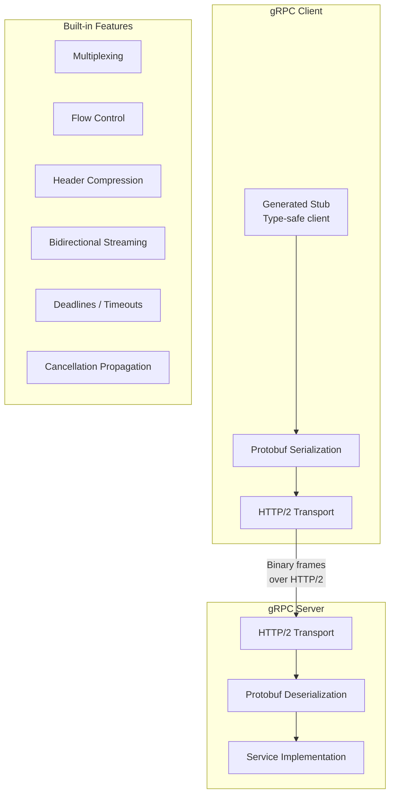
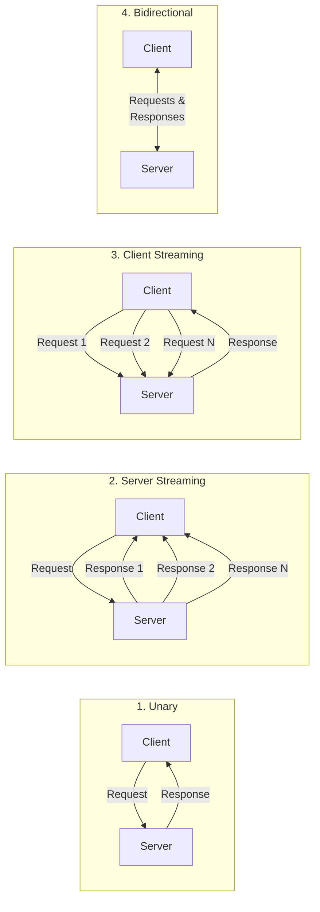
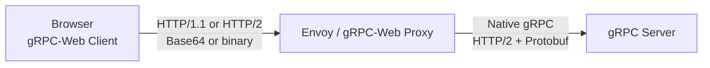
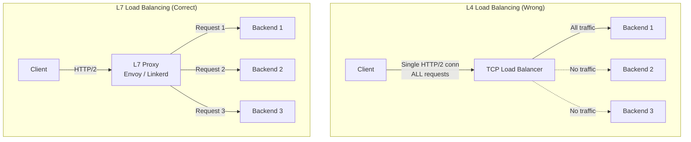
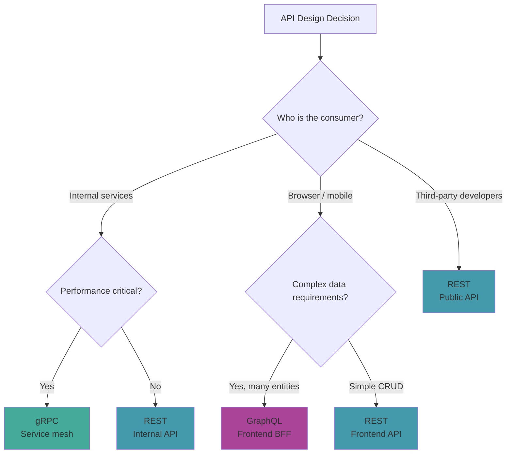
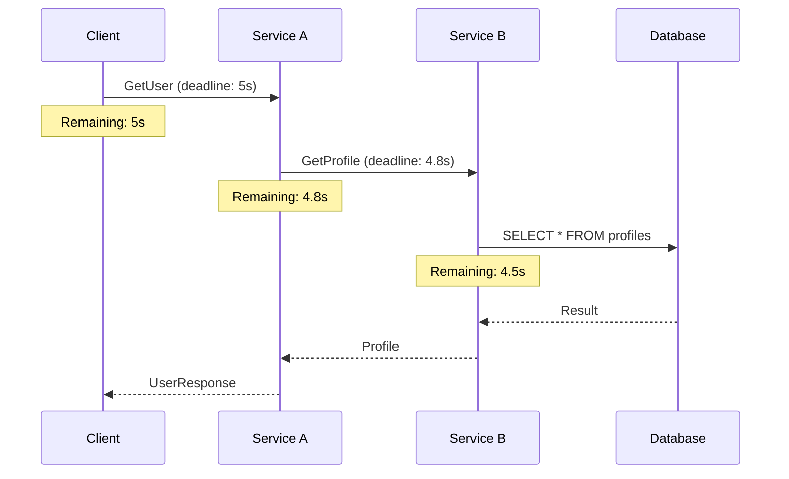

# gRPC Deep Dive

gRPC is a high-performance RPC framework built on HTTP/2 and Protocol Buffers. It is the dominant choice for service-to-service communication in microservice architectures where latency, bandwidth, and type safety matter more than human readability. Google, Netflix, Uber, and Dropbox use gRPC for internal APIs handling millions of RPCs per second.

This page covers everything from Protocol Buffer schema design to production deployment patterns: streaming, load balancing, error handling, interceptors, gRPC-Web for browser clients, and a detailed comparison with REST and GraphQL.

**Related**: [REST Best Practices](/system-design/api-design/rest-best-practices) | [GraphQL Advanced](/system-design/api-design/graphql-advanced) | [API Versioning](/system-design/api-design/api-versioning)

---

## Architecture



### Why HTTP/2 Matters

| HTTP/1.1 | HTTP/2 |
|----------|--------|
| One request per TCP connection (or pipelining with head-of-line blocking) | Multiplexed streams on single connection |
| Text-based headers (large, repetitive) | HPACK header compression |
| Request-response only | Bidirectional streaming |
| New connection per request (or keep-alive) | Single long-lived connection |

---

## Protocol Buffers (Protobuf)

### Schema Definition

```protobuf
// user_service.proto
syntax = "proto3";

package userservice.v1;

option go_package = "github.com/myorg/userservice/v1";
option java_package = "com.myorg.userservice.v1";

import "google/protobuf/timestamp.proto";
import "google/protobuf/field_mask.proto";

// Service definition
service UserService {
  // Unary RPC
  rpc GetUser(GetUserRequest) returns (GetUserResponse);
  rpc CreateUser(CreateUserRequest) returns (CreateUserResponse);
  rpc UpdateUser(UpdateUserRequest) returns (UpdateUserResponse);
  rpc DeleteUser(DeleteUserRequest) returns (DeleteUserResponse);

  // Server streaming
  rpc ListUsers(ListUsersRequest) returns (stream User);

  // Client streaming
  rpc BulkCreateUsers(stream CreateUserRequest) returns (BulkCreateResponse);

  // Bidirectional streaming
  rpc SyncUsers(stream SyncRequest) returns (stream SyncResponse);
}

// Messages
message User {
  string id = 1;
  string name = 2;
  string email = 3;
  UserRole role = 4;
  google.protobuf.Timestamp created_at = 5;
  google.protobuf.Timestamp updated_at = 6;
  Address address = 7;
  repeated string tags = 8;
  map<string, string> metadata = 9;
}

enum UserRole {
  USER_ROLE_UNSPECIFIED = 0;
  USER_ROLE_ADMIN = 1;
  USER_ROLE_EDITOR = 2;
  USER_ROLE_VIEWER = 3;
}

message Address {
  string street = 1;
  string city = 2;
  string state = 3;
  string country = 4;
  string postal_code = 5;
}

message GetUserRequest {
  string id = 1;
}

message GetUserResponse {
  User user = 1;
}

message CreateUserRequest {
  string name = 1;
  string email = 2;
  UserRole role = 3;
  Address address = 4;
}

message CreateUserResponse {
  User user = 1;
}

message UpdateUserRequest {
  string id = 1;
  User user = 2;
  google.protobuf.FieldMask update_mask = 3;  // Partial updates
}

message UpdateUserResponse {
  User user = 1;
}

message DeleteUserRequest {
  string id = 1;
}

message DeleteUserResponse {}

message ListUsersRequest {
  int32 page_size = 1;
  string page_token = 2;
  string filter = 3;  // e.g., "role=ADMIN AND created_at > 2024-01-01"
}

message BulkCreateResponse {
  int32 created_count = 1;
  repeated string failed_ids = 2;
}

message SyncRequest {
  oneof action {
    User upsert = 1;
    string delete_id = 2;
  }
}

message SyncResponse {
  string id = 1;
  SyncStatus status = 2;
}

enum SyncStatus {
  SYNC_STATUS_UNSPECIFIED = 0;
  SYNC_STATUS_CREATED = 1;
  SYNC_STATUS_UPDATED = 2;
  SYNC_STATUS_DELETED = 3;
  SYNC_STATUS_FAILED = 4;
}
```

### Protobuf Best Practices

::: warning
**Never reuse field numbers.** When you remove a field, mark it as `reserved` so future developers cannot accidentally reuse the number, which would corrupt data from old messages.

```protobuf
message User {
  reserved 6, 9;                    // reserved field numbers
  reserved "phone", "legacy_role";  // reserved field names

  string id = 1;
  string name = 2;
  // field 6 was 'phone', removed in v2
  // field 9 was 'legacy_role', removed in v3
}
```
:::

| Rule | Rationale |
|------|-----------|
| Always use `proto3` syntax | proto2 is legacy; proto3 has sane defaults |
| First enum value must be `UNSPECIFIED = 0` | Zero is the default; an unset field should not imply a valid value |
| Use `google.protobuf.FieldMask` for partial updates | Avoids null-vs-absent ambiguity |
| Package names should include version (`v1`) | Enables side-by-side versioning |
| Use `repeated` instead of custom list wrappers | Protobuf natively supports arrays |
| Prefer `string` for IDs (not `int64`) | UUIDs, KSUIDs, etc. do not fit in 64 bits |

---

## The Four RPC Patterns



### Implementation Examples (Go)

```go
// 1. Unary RPC
func (s *server) GetUser(ctx context.Context, req *pb.GetUserRequest) (*pb.GetUserResponse, error) {
    user, err := s.db.FindUser(ctx, req.GetId())
    if err != nil {
        return nil, status.Errorf(codes.NotFound, "user %s not found", req.GetId())
    }
    return &pb.GetUserResponse{User: user}, nil
}

// 2. Server Streaming — server sends multiple responses
func (s *server) ListUsers(req *pb.ListUsersRequest, stream pb.UserService_ListUsersServer) error {
    cursor := s.db.NewCursor(req.GetFilter())
    for cursor.Next() {
        user := cursor.User()
        if err := stream.Send(user); err != nil {
            return err
        }
    }
    return cursor.Err()
}

// 3. Client Streaming — client sends multiple requests
func (s *server) BulkCreateUsers(stream pb.UserService_BulkCreateUsersServer) error {
    var count int32
    for {
        req, err := stream.Recv()
        if err == io.EOF {
            return stream.SendAndClose(&pb.BulkCreateResponse{
                CreatedCount: count,
            })
        }
        if err != nil {
            return err
        }
        if err := s.db.CreateUser(stream.Context(), req); err == nil {
            count++
        }
    }
}

// 4. Bidirectional Streaming
func (s *server) SyncUsers(stream pb.UserService_SyncUsersServer) error {
    for {
        req, err := stream.Recv()
        if err == io.EOF {
            return nil
        }
        if err != nil {
            return err
        }

        var resp pb.SyncResponse
        switch action := req.GetAction().(type) {
        case *pb.SyncRequest_Upsert:
            resp = s.handleUpsert(stream.Context(), action.Upsert)
        case *pb.SyncRequest_DeleteId:
            resp = s.handleDelete(stream.Context(), action.DeleteId)
        }

        if err := stream.Send(&resp); err != nil {
            return err
        }
    }
}
```

---

## Error Handling

gRPC defines a standard set of error codes (similar to HTTP status codes but more precise):

| gRPC Code | HTTP Equivalent | When to Use |
|-----------|----------------|-------------|
| `OK` (0) | 200 | Success |
| `CANCELLED` (1) | 499 | Client cancelled the request |
| `INVALID_ARGUMENT` (3) | 400 | Validation error (bad input) |
| `NOT_FOUND` (5) | 404 | Resource does not exist |
| `ALREADY_EXISTS` (6) | 409 | Duplicate creation attempt |
| `PERMISSION_DENIED` (7) | 403 | Authenticated but not authorized |
| `UNAUTHENTICATED` (16) | 401 | Missing or invalid credentials |
| `RESOURCE_EXHAUSTED` (8) | 429 | Rate limited or quota exceeded |
| `FAILED_PRECONDITION` (9) | 400 | System not in required state |
| `UNAVAILABLE` (14) | 503 | Transient error, retry with backoff |
| `INTERNAL` (13) | 500 | Bug in the server |
| `DEADLINE_EXCEEDED` (4) | 504 | Timeout |
| `UNIMPLEMENTED` (12) | 501 | Method not implemented |

### Rich Error Details

```go
import (
    "google.golang.org/grpc/codes"
    "google.golang.org/grpc/status"
    "google.golang.org/genproto/googleapis/rpc/errdetails"
)

func (s *server) CreateUser(ctx context.Context, req *pb.CreateUserRequest) (*pb.CreateUserResponse, error) {
    // Validation with rich error details
    var violations []*errdetails.BadRequest_FieldViolation

    if req.GetName() == "" {
        violations = append(violations, &errdetails.BadRequest_FieldViolation{
            Field:       "name",
            Description: "Name is required",
        })
    }
    if !isValidEmail(req.GetEmail()) {
        violations = append(violations, &errdetails.BadRequest_FieldViolation{
            Field:       "email",
            Description: "Invalid email format",
        })
    }

    if len(violations) > 0 {
        st := status.New(codes.InvalidArgument, "validation failed")
        br := &errdetails.BadRequest{FieldViolations: violations}
        st, _ = st.WithDetails(br)
        return nil, st.Err()
    }

    // ... create user
}
```

::: tip
Use `UNAVAILABLE` for transient errors that clients should retry (database connection lost, downstream service temporarily down). Use `INTERNAL` for bugs that retrying will not fix. Clients should have different retry policies for each code.
:::

---

## Interceptors (Middleware)

```go
// Unary server interceptor — logging + metrics
func loggingInterceptor(
    ctx context.Context,
    req interface{},
    info *grpc.UnaryServerInfo,
    handler grpc.UnaryHandler,
) (interface{}, error) {
    start := time.Now()

    // Call the handler
    resp, err := handler(ctx, req)

    // Log the call
    duration := time.Since(start)
    code := status.Code(err)

    log.Info("gRPC call",
        "method", info.FullMethod,
        "code", code.String(),
        "duration", duration,
    )

    // Record metrics
    grpcRequestDuration.WithLabelValues(info.FullMethod, code.String()).Observe(duration.Seconds())
    grpcRequestTotal.WithLabelValues(info.FullMethod, code.String()).Inc()

    return resp, err
}

// Authentication interceptor
func authInterceptor(
    ctx context.Context,
    req interface{},
    info *grpc.UnaryServerInfo,
    handler grpc.UnaryHandler,
) (interface{}, error) {
    // Skip auth for health checks
    if info.FullMethod == "/grpc.health.v1.Health/Check" {
        return handler(ctx, req)
    }

    md, ok := metadata.FromIncomingContext(ctx)
    if !ok {
        return nil, status.Error(codes.Unauthenticated, "missing metadata")
    }

    tokens := md.Get("authorization")
    if len(tokens) == 0 {
        return nil, status.Error(codes.Unauthenticated, "missing token")
    }

    claims, err := validateToken(tokens[0])
    if err != nil {
        return nil, status.Error(codes.Unauthenticated, "invalid token")
    }

    // Add claims to context
    ctx = context.WithValue(ctx, claimsKey, claims)
    return handler(ctx, req)
}

// Chain interceptors
server := grpc.NewServer(
    grpc.ChainUnaryInterceptor(
        loggingInterceptor,
        authInterceptor,
        recoveryInterceptor,
    ),
    grpc.ChainStreamInterceptor(
        streamLoggingInterceptor,
        streamAuthInterceptor,
    ),
)
```

---

## gRPC-Web

Browsers cannot make raw HTTP/2 gRPC calls (no control over HTTP/2 frames). gRPC-Web solves this with a proxy that translates between gRPC-Web (HTTP/1.1 or HTTP/2) and native gRPC.



### Envoy Configuration

```yaml
# envoy.yaml
static_resources:
  listeners:
    - name: listener_0
      address:
        socket_address:
          address: 0.0.0.0
          port_value: 8080
      filter_chains:
        - filters:
            - name: envoy.filters.network.http_connection_manager
              typed_config:
                "@type": type.googleapis.com/envoy.extensions.filters.network.http_connection_manager.v3.HttpConnectionManager
                codec_type: auto
                stat_prefix: ingress_http
                route_config:
                  name: local_route
                  virtual_hosts:
                    - name: local_service
                      domains: ["*"]
                      routes:
                        - match: { prefix: "/" }
                          route:
                            cluster: grpc_service
                            timeout: 30s
                      cors:
                        allow_origin_string_match:
                          - prefix: "http://localhost"
                        allow_methods: "GET, PUT, DELETE, POST, OPTIONS"
                        allow_headers: "content-type, x-grpc-web, authorization"
                        expose_headers: "grpc-status, grpc-message"
                http_filters:
                  - name: envoy.filters.http.grpc_web
                    typed_config:
                      "@type": type.googleapis.com/envoy.extensions.filters.http.grpc_web.v3.GrpcWeb
                  - name: envoy.filters.http.cors
                    typed_config:
                      "@type": type.googleapis.com/envoy.extensions.filters.http.cors.v3.Cors
                  - name: envoy.filters.http.router
                    typed_config:
                      "@type": type.googleapis.com/envoy.extensions.filters.http.router.v3.Router
  clusters:
    - name: grpc_service
      connect_timeout: 5s
      type: logical_dns
      lb_policy: round_robin
      typed_extension_protocol_options:
        envoy.extensions.upstreams.http.v3.HttpProtocolOptions:
          "@type": type.googleapis.com/envoy.extensions.upstreams.http.v3.HttpProtocolOptions
          explicit_http_config:
            http2_protocol_options: {}
      load_assignment:
        cluster_name: grpc_service
        endpoints:
          - lb_endpoints:
              - endpoint:
                  address:
                    socket_address:
                      address: grpc-server
                      port_value: 50051
```

### TypeScript gRPC-Web Client

```typescript
import { GrpcWebFetchTransport } from '@protobuf-ts/grpcweb-transport';
import { UserServiceClient } from './generated/user_service.client';

const transport = new GrpcWebFetchTransport({
  baseUrl: 'http://localhost:8080',
  deadline: 10_000, // 10s timeout
});

const client = new UserServiceClient(transport);

// Unary call
async function getUser(id: string) {
  const { response } = await client.getUser({ id });
  console.log(response.user?.name);
}

// Server streaming
async function listUsers() {
  const call = client.listUsers({ pageSize: 100, pageToken: '', filter: '' });
  for await (const user of call.responses) {
    console.log(user.name);
  }
}
```

---

## Load Balancing

gRPC uses long-lived HTTP/2 connections, which means traditional L4 load balancers (TCP round-robin) do not distribute requests evenly — all requests on a connection go to the same backend.



### Load Balancing Strategies

| Strategy | How It Works | Best For |
|----------|-------------|----------|
| **Proxy-based (L7)** | Envoy/Nginx terminates HTTP/2, distributes per-request | Kubernetes, service mesh |
| **Client-side** | Client knows all backends, picks one per call | High-performance, no proxy overhead |
| **Look-aside** | Client queries external LB service (e.g., xDS) | Large-scale, dynamic backends |
| **Service mesh** | Sidecar proxy handles LB transparently | Kubernetes + Istio/Linkerd |

### Client-Side Load Balancing (Go)

```go
import (
    "google.golang.org/grpc"
    "google.golang.org/grpc/resolver"
    _ "google.golang.org/grpc/balancer/roundrobin"
)

// Register a custom resolver that returns backend addresses
conn, err := grpc.Dial(
    "dns:///my-service.default.svc.cluster.local:50051",
    grpc.WithDefaultServiceConfig(`{"loadBalancingConfig": [{"round_robin":{}}]}`),
    grpc.WithTransportCredentials(insecure.NewCredentials()),
)
```

::: danger
If you use a standard cloud load balancer (AWS ALB, GCP Load Balancer) with gRPC, make sure it is configured for HTTP/2 and L7 (application-level) balancing. An L4 (TCP) load balancer will pin all requests from a single client to one backend, creating hot spots.
:::

---

## gRPC vs REST vs GraphQL

| Dimension | gRPC | REST | GraphQL |
|-----------|------|------|---------|
| **Protocol** | HTTP/2 | HTTP/1.1 or HTTP/2 | HTTP/1.1 or HTTP/2 |
| **Serialization** | Protobuf (binary) | JSON (text) | JSON (text) |
| **Schema** | `.proto` files | OpenAPI (optional) | GraphQL SDL |
| **Code generation** | First-class (protoc) | Optional (openapi-gen) | Optional (codegen) |
| **Streaming** | 4 patterns (native) | SSE, WebSockets (bolted on) | Subscriptions (WebSocket) |
| **Browser support** | Via gRPC-Web proxy | Native | Native |
| **Caching** | No built-in (no GET) | HTTP caching (GET) | Complex (POST bodies) |
| **Human readable** | No (binary) | Yes (JSON) | Yes (JSON) |
| **Payload size** | Small (~1/3 of JSON) | Large | Medium |
| **Latency** | Low | Medium | Medium |
| **Learning curve** | High | Low | Medium |
| **Best for** | Service-to-service | Public APIs, CRUD | Frontend-driven APIs |

### When to Use Each



---

## Deadlines and Timeouts

```go
// Client sets a deadline — propagated through the entire call chain
ctx, cancel := context.WithTimeout(context.Background(), 5*time.Second)
defer cancel()

resp, err := client.GetUser(ctx, &pb.GetUserRequest{Id: "user-1"})
if err != nil {
    st, _ := status.FromError(err)
    if st.Code() == codes.DeadlineExceeded {
        log.Warn("request timed out")
    }
}
```



::: tip
Deadlines propagate automatically through the context. If Service A has 5 seconds remaining and spends 200ms on its own logic, it passes the remaining 4.8 seconds to Service B. This prevents cascading timeouts where downstream services outlive the original client deadline.
:::

---

## Health Checking

```protobuf
// Standard gRPC health check protocol
syntax = "proto3";

package grpc.health.v1;

service Health {
  rpc Check(HealthCheckRequest) returns (HealthCheckResponse);
  rpc Watch(HealthCheckRequest) returns (stream HealthCheckResponse);
}

message HealthCheckRequest {
  string service = 1;
}

message HealthCheckResponse {
  enum ServingStatus {
    UNKNOWN = 0;
    SERVING = 1;
    NOT_SERVING = 2;
    SERVICE_UNKNOWN = 3;
  }
  ServingStatus status = 1;
}
```

```go
// Register health service
import "google.golang.org/grpc/health"
import healthpb "google.golang.org/grpc/health/grpc_health_v1"

healthServer := health.NewServer()
healthpb.RegisterHealthServer(grpcServer, healthServer)

// Set service status
healthServer.SetServingStatus("userservice.v1.UserService", healthpb.HealthCheckResponse_SERVING)
```

---

## Further Reading

- [REST Best Practices](/system-design/api-design/rest-best-practices) — when REST is the right choice
- [GraphQL Advanced](/system-design/api-design/graphql-advanced) — federation, DataLoader, and production GraphQL
- [API Versioning](/system-design/api-design/api-versioning) — versioning strategies for gRPC and REST
- [Event Versioning](/architecture-patterns/event-driven/event-versioning) — schema evolution patterns that apply to protobuf
- [Observability Tools](/devops/observability-tools/) — tracing gRPC calls across services
