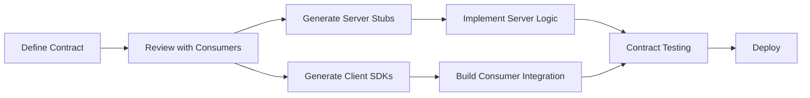
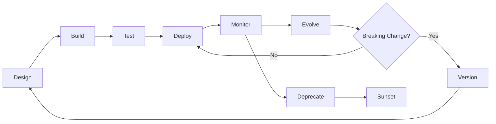

# API Design

An API is a contract. It is the single most important boundary in your system because it is the surface other engineers, other teams, and often other companies build against. Get it wrong and you are stuck with it — sometimes for a decade. Get it right and it becomes the leverage that lets your system scale in complexity without collapsing under its own weight.

This section does not teach API design as a checklist of conventions. It builds your intuition for why those conventions exist, when to break them, and how to make decisions when the textbook answer does not apply.

## Why API Design Matters

Every system you build has at least one API, whether you designed it consciously or not. The moment another service calls your code over a network boundary, an API exists. The question is whether it is intentional or accidental.

Bad APIs cause real damage:

- **Coupling explosions** — consumers build workarounds for inconsistent APIs, creating hidden dependencies that make every change risky
- **Performance cliffs** — under-fetching forces N+1 request chains; over-fetching wastes bandwidth and server resources
- **Security gaps** — APIs that expose internal data models leak implementation details attackers exploit
- **Integration friction** — every hour a partner engineer spends decoding your API is an hour they are not building

Good APIs have compounding returns. Stripe's API is frequently cited not because it is technically novel, but because it is so consistent that developers can guess the endpoint for a resource they have never used before. That consistency is not an accident — it is the product of deliberate design.

## API-First Development

API-first means you design the API contract before writing any implementation code. This is not just a process preference — it fundamentally changes how teams work.



### Why API-First Wins

| Approach | Contract Defined | Consumer Can Start | Misalignment Risk |
|----------|-----------------|--------------------|--------------------|
| **Code-first** | After implementation | After server ships | High — contract is whatever the code happens to produce |
| **API-first** | Before implementation | Immediately (from mock/stub) | Low — contract is reviewed before anyone writes code |

::: tip
API-first does not mean you need a heavyweight specification upfront. Even a shared Markdown file with endpoint descriptions, request/response examples, and error codes is better than nothing. The goal is alignment before implementation.
:::

### The Contract is the Product

For internal APIs, the contract is what your team promises to other teams. For external APIs, the contract is your product. In both cases, the contract must be:

1. **Discoverable** — consumers can find it without asking a human
2. **Unambiguous** — every field, status code, and error has a clear meaning
3. **Stable** — changes follow a versioning and deprecation policy
4. **Testable** — consumers can validate their integration against the contract

## API Styles Compared

There is no universally correct API style. Each makes different trade-offs, and the right choice depends on your use case, your consumers, and your team's expertise.

### REST (Representational State Transfer)

REST models your API as a collection of resources, each identified by a URL, manipulated through standard HTTP methods.

```
GET    /api/orders/42          → Fetch order 42
POST   /api/orders             → Create a new order
PUT    /api/orders/42          → Replace order 42 entirely
PATCH  /api/orders/42          → Partially update order 42
DELETE /api/orders/42          → Delete order 42
```

**Strengths:** Universal tooling (browsers, cURL, Postman), cacheable via HTTP semantics, easy to understand.
**Weaknesses:** Over-fetching/under-fetching, no built-in subscription model, multiple round trips for complex queries.

Deep dive: [REST API Best Practices](/system-design/api-design/rest-best-practices)

### GraphQL

GraphQL lets consumers specify exactly the data they need in a query language, eliminating over-fetching.

```graphql
query {
  order(id: "42") {
    id
    status
    items {
      product { name, price }
      quantity
    }
    customer { name, email }
  }
}
```

**Strengths:** Precise data fetching, strong type system, single endpoint, excellent for frontend-driven APIs.
**Weaknesses:** Caching is harder (no URL-based caching), authorization complexity at the field level, potential for expensive queries.

### gRPC (Google Remote Procedure Call)

gRPC uses Protocol Buffers for schema definition and HTTP/2 for transport, offering high performance and strong typing.

```protobuf
service OrderService {
  rpc GetOrder(GetOrderRequest) returns (Order);
  rpc ListOrders(ListOrdersRequest) returns (stream Order);
  rpc CreateOrder(CreateOrderRequest) returns (Order);
}

message Order {
  string id = 1;
  string status = 2;
  repeated OrderItem items = 3;
  google.protobuf.Timestamp created_at = 4;
}
```

**Strengths:** Binary serialization (10x smaller payloads), bidirectional streaming, code generation for 11+ languages, built-in deadlines and cancellation.
**Weaknesses:** Not browser-native (needs grpc-web proxy), harder to debug (binary format), steeper learning curve.

### WebSockets

WebSockets provide full-duplex communication over a single TCP connection, ideal for real-time scenarios.

```typescript
// Server (Node.js with ws)
wss.on('connection', (ws) => {
  ws.on('message', (data) => {
    const msg = JSON.parse(data.toString());
    if (msg.type === 'subscribe') {
      subscriptions.add(ws, msg.channel);
    }
  });
});

// Client
const ws = new WebSocket('wss://api.example.com/ws');
ws.send(JSON.stringify({ type: 'subscribe', channel: 'orders:42' }));
ws.onmessage = (event) => {
  const update = JSON.parse(event.data);
  console.log('Order updated:', update);
};
```

**Strengths:** True real-time, low latency after connection established, bidirectional.
**Weaknesses:** Stateful connections complicate load balancing, no built-in request/response semantics, connection management overhead.

### Decision Matrix

| Factor | REST | GraphQL | gRPC | WebSockets |
|--------|------|---------|------|------------|
| **Consumer type** | External/public | Frontend apps | Internal services | Real-time clients |
| **Performance** | Good | Good | Excellent | Good |
| **Caching** | Excellent (HTTP) | Complex | Manual | N/A |
| **Streaming** | SSE only | Subscriptions | Native | Native |
| **Browser support** | Native | Native | Via proxy | Native |
| **Schema/typing** | Optional (OpenAPI) | Built-in | Built-in (protobuf) | Manual |
| **Learning curve** | Low | Medium | Medium-High | Low |
| **Tooling maturity** | Excellent | Good | Good | Fair |

::: warning
Do not choose gRPC for your public API just because it is faster. Your external consumers almost certainly expect REST or GraphQL. Use gRPC for internal service-to-service communication where you control both ends.
:::

## API Lifecycle

APIs are not static artifacts. They evolve through a lifecycle that must be managed deliberately.



### Design Phase

- Define resources, operations, and data models
- Write [OpenAPI specification](/system-design/api-design/openapi-swagger) or protobuf definitions
- Review with consumers (API design review)
- Generate mock servers for early consumer testing

### Build Phase

- Implement business logic behind the contract
- Generate server stubs from specification
- Build input validation and error handling
- Implement [authentication and authorization](/system-design/api-design/api-security-patterns)

### Operate Phase

- Monitor latency, error rates, and usage patterns
- Enforce [rate limiting](/system-design/api-design/api-security-patterns) and quotas
- Track which consumers use which endpoints (for deprecation planning)
- Maintain documentation accuracy

### Evolve Phase

- Add new endpoints and fields (non-breaking)
- Follow [versioning strategy](/system-design/api-design/api-versioning) for breaking changes
- Communicate deprecation timelines
- Run old and new versions in parallel during migration

## API Governance

At scale (10+ services, 3+ teams), API consistency does not happen by accident. You need governance — not bureaucracy, but shared standards and automated enforcement.

### What to Standardize

| Concern | Example Standard |
|---------|-----------------|
| **Naming** | `snake_case` for JSON fields, plural nouns for collections |
| **Errors** | RFC 7807 Problem Details format |
| **Pagination** | Cursor-based with `next_cursor` / `prev_cursor` |
| **Versioning** | URL path versioning (`/v2/orders`) |
| **Auth** | OAuth 2.0 with JWT bearer tokens |
| **Rate limiting** | `X-RateLimit-*` headers on every response |
| **Health checks** | `GET /health` returning `{ "status": "ok" }` |

### How to Enforce

1. **Linting** — tools like Spectral lint OpenAPI specs against your style guide
2. **Code generation** — generate server stubs and client SDKs from the spec so implementations cannot drift
3. **Contract testing** — automated tests verify the implementation matches the spec
4. **API review** — require review of spec changes before implementation (like code review, but for contracts)

::: tip
Start governance early but light. A shared style guide and a Spectral ruleset are enough for most teams. Add process only when you see real consistency problems.
:::

## Section Map

| Topic | What You'll Learn | Key Concepts |
|-------|-------------------|--------------|
| [REST Best Practices](/system-design/api-design/rest-best-practices) | Resource naming, HTTP methods, status codes, error design, Richardson Maturity Model | HATEOAS, RFC 7807, idempotency |
| [API Versioning](/system-design/api-design/api-versioning) | URL, header, and query param versioning strategies, deprecation policies | Semantic versioning, sunset headers, breaking change detection |
| [OpenAPI & Swagger](/system-design/api-design/openapi-swagger) | OpenAPI 3.1 specification, schema design, code generation, documentation | Design-first vs code-first, Spectral linting, SDK generation |
| [Pagination Patterns](/system-design/api-design/pagination-patterns) | Offset, cursor, and keyset pagination with trade-offs and benchmarks | Cursor encoding, stable ordering, total count challenges |
| [Webhooks](/system-design/api-design/webhooks) | Event delivery architecture, retry strategies, signature verification | HMAC signing, idempotency keys, dead letter queues |
| [API Security Patterns](/system-design/api-design/api-security-patterns) | Authentication methods, rate limiting, input validation, request signing | OAuth 2.0, JWT, mTLS, AWS Signature V4 |

## Core Principles

Before diving into specific topics, internalize these principles. They apply regardless of whether you are building REST, GraphQL, or gRPC APIs.

### 1. Consistency Over Cleverness

If every endpoint in your API uses `snake_case` except one that uses `camelCase`, consumers will spend time debugging a casing issue instead of building features. Consistency reduces cognitive load.

### 2. Make the Common Case Easy

The 80% use case should require minimal parameters and no special headers. Advanced features (field selection, expansion, filtering) should be additive, not required.

### 3. Fail Loudly and Helpfully

Never return a `200 OK` with an error in the body. Use appropriate status codes. Include machine-readable error codes and human-readable messages. Tell the consumer what went wrong and how to fix it.

### 4. Design for Evolvability

Every API will change. Design so that adding new fields, new endpoints, and new optional parameters is always a non-breaking change. This means consumers must ignore unknown fields (the robustness principle).

### 5. Treat Security as a First-Class Concern

Authentication, authorization, rate limiting, and input validation are not afterthoughts bolted on at the end. They are core design decisions that shape the API surface. See [API Security Patterns](/system-design/api-design/api-security-patterns).

## What's Next

Start with [REST Best Practices](/system-design/api-design/rest-best-practices) — REST remains the dominant style for web APIs and understanding it deeply will make every other style easier to evaluate. Then work through [API Versioning](/system-design/api-design/api-versioning) to understand how APIs evolve, and [OpenAPI & Swagger](/system-design/api-design/openapi-swagger) to see how contracts are formalized.

If you are building event-driven systems, jump to [Webhooks](/system-design/api-design/webhooks) after REST. If security is your immediate concern, go straight to [API Security Patterns](/system-design/api-design/api-security-patterns).

For broader system design context, see [Distributed Systems](/system-design/distributed-systems/) and [Load Balancing](/system-design/load-balancing/).
