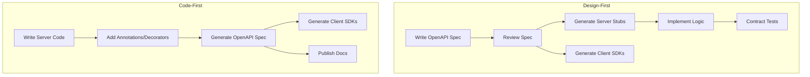

# OpenAPI & Swagger

OpenAPI is the industry standard for describing REST APIs. It is a machine-readable specification that serves as the single source of truth for your API — driving documentation, code generation, testing, and governance from one file. If your API does not have an OpenAPI spec, you do not have a contract — you have an accident waiting to happen.

## OpenAPI vs Swagger — Clearing Up the Confusion

| Term | What It Is |
|------|-----------|
| **Swagger** | The original name for the specification (versions 1.x, 2.0), now refers to the tooling suite |
| **OpenAPI** | The specification itself, from version 3.0 onwards (governed by the OpenAPI Initiative under the Linux Foundation) |
| **Swagger UI** | Interactive documentation viewer |
| **Swagger Editor** | Browser-based spec editor |
| **OpenAPI Generator** | Code generation tool (community-maintained fork of swagger-codegen) |

Use "OpenAPI" when talking about the specification. Use "Swagger" only when referring to the specific tools.

## OpenAPI 3.1 Specification Structure

OpenAPI 3.1 aligns fully with JSON Schema 2020-12, making it significantly more expressive than 3.0. Here is the top-level structure:

```yaml
openapi: 3.1.0
info:
  title: Order Service API
  description: Manages customer orders and fulfillment
  version: 2.0.0
  contact:
    name: Platform Team
    email: platform@example.com
  license:
    name: MIT
    url: https://opensource.org/licenses/MIT

servers:
  - url: https://api.example.com/v2
    description: Production
  - url: https://staging-api.example.com/v2
    description: Staging
  - url: http://localhost:3000/v2
    description: Local development

paths:
  /orders:
    get:
      # ... endpoint definitions
    post:
      # ...
  /orders/{orderId}:
    get:
      # ...

components:
  schemas:
    # ... reusable data models
  securitySchemes:
    # ... auth definitions
  parameters:
    # ... reusable parameters
  responses:
    # ... reusable responses

security:
  - bearerAuth: []

tags:
  - name: Orders
    description: Order management operations
  - name: Customers
    description: Customer profile operations
```

## Defining Endpoints

### A Complete Endpoint Example

```yaml
paths:
  /orders:
    get:
      operationId: listOrders
      tags: [Orders]
      summary: List orders
      description: |
        Returns a paginated list of orders for the authenticated user.
        Supports filtering by status and date range.
      parameters:
        - $ref: '#/components/parameters/PageCursor'
        - $ref: '#/components/parameters/PageSize'
        - name: status
          in: query
          description: Filter by order status
          schema:
            type: string
            enum: [pending, processing, shipped, delivered, cancelled]
        - name: created_after
          in: query
          description: Filter orders created after this date (ISO 8601)
          schema:
            type: string
            format: date-time
      responses:
        '200':
          description: Paginated list of orders
          content:
            application/json:
              schema:
                $ref: '#/components/schemas/OrderList'
              example:
                data:
                  - id: order_abc123
                    status: shipped
                    total: { amount: 9999, currency: USD }
                    created_at: "2026-03-15T10:30:00Z"
                pagination:
                  next_cursor: eyJpZCI6ImFiYzEyMyJ9
                  has_more: true
        '401':
          $ref: '#/components/responses/Unauthorized'
        '429':
          $ref: '#/components/responses/RateLimited'

    post:
      operationId: createOrder
      tags: [Orders]
      summary: Create an order
      description: Creates a new order for the authenticated user.
      requestBody:
        required: true
        content:
          application/json:
            schema:
              $ref: '#/components/schemas/CreateOrderRequest'
      responses:
        '201':
          description: Order created successfully
          headers:
            Location:
              description: URL of the created order
              schema:
                type: string
                format: uri
          content:
            application/json:
              schema:
                $ref: '#/components/schemas/Order'
        '422':
          $ref: '#/components/responses/ValidationError'
```

## Schema Design with Components

### The `$ref` System

`$ref` is how you avoid duplication. Define schemas once in `components/schemas` and reference them everywhere.

```yaml
components:
  schemas:
    # Money — reused across all financial fields
    Money:
      type: object
      required: [amount, currency]
      properties:
        amount:
          type: integer
          description: Amount in smallest currency unit (cents for USD)
          example: 9999
        currency:
          type: string
          pattern: '^[A-Z]{3}$'
          description: ISO 4217 currency code
          example: USD

    # Order — the core domain object
    Order:
      type: object
      required: [id, status, total, created_at]
      properties:
        id:
          type: string
          pattern: '^order_[a-zA-Z0-9]{10,}$'
          example: order_abc123def4
        status:
          type: string
          enum: [pending, processing, shipped, delivered, cancelled]
        total:
          $ref: '#/components/schemas/Money'
        items:
          type: array
          items:
            $ref: '#/components/schemas/OrderItem'
        customer:
          $ref: '#/components/schemas/CustomerSummary'
        created_at:
          type: string
          format: date-time
        updated_at:
          type: string
          format: date-time

    # Create request — subset of Order fields
    CreateOrderRequest:
      type: object
      required: [items]
      properties:
        items:
          type: array
          minItems: 1
          maxItems: 100
          items:
            type: object
            required: [product_id, quantity]
            properties:
              product_id:
                type: string
              quantity:
                type: integer
                minimum: 1
                maximum: 999
        notes:
          type: string
          maxLength: 500
        idempotency_key:
          type: string
          format: uuid

    # Paginated list wrapper
    OrderList:
      type: object
      required: [data, pagination]
      properties:
        data:
          type: array
          items:
            $ref: '#/components/schemas/Order'
        pagination:
          $ref: '#/components/schemas/CursorPagination'

    CursorPagination:
      type: object
      required: [has_more]
      properties:
        next_cursor:
          type: string
          nullable: true
        prev_cursor:
          type: string
          nullable: true
        has_more:
          type: boolean
```

### Composition: allOf, oneOf, anyOf

```yaml
components:
  schemas:
    # allOf — combine schemas (inheritance/extension)
    PremiumOrder:
      allOf:
        - $ref: '#/components/schemas/Order'
        - type: object
          properties:
            priority_shipping:
              type: boolean
            loyalty_points_earned:
              type: integer

    # oneOf — exactly one of (discriminated union)
    PaymentMethod:
      oneOf:
        - $ref: '#/components/schemas/CreditCardPayment'
        - $ref: '#/components/schemas/BankTransferPayment'
        - $ref: '#/components/schemas/WalletPayment'
      discriminator:
        propertyName: type
        mapping:
          credit_card: '#/components/schemas/CreditCardPayment'
          bank_transfer: '#/components/schemas/BankTransferPayment'
          wallet: '#/components/schemas/WalletPayment'

    CreditCardPayment:
      type: object
      required: [type, card_last_four]
      properties:
        type:
          type: string
          const: credit_card
        card_last_four:
          type: string
          pattern: '^\d{4}$'

    # Error response (RFC 7807)
    ProblemDetail:
      type: object
      required: [type, title, status]
      properties:
        type:
          type: string
          format: uri
        title:
          type: string
        status:
          type: integer
        detail:
          type: string
        instance:
          type: string
          format: uri
```

### Reusable Parameters and Responses

```yaml
components:
  parameters:
    PageCursor:
      name: cursor
      in: query
      description: Pagination cursor from previous response
      schema:
        type: string

    PageSize:
      name: limit
      in: query
      description: Number of items per page
      schema:
        type: integer
        minimum: 1
        maximum: 100
        default: 20

    ResourceId:
      name: id
      in: path
      required: true
      schema:
        type: string

  responses:
    Unauthorized:
      description: Authentication required
      content:
        application/json:
          schema:
            $ref: '#/components/schemas/ProblemDetail'
          example:
            type: https://api.example.com/errors/unauthorized
            title: Unauthorized
            status: 401
            detail: Bearer token is missing or invalid

    ValidationError:
      description: Request validation failed
      content:
        application/json:
          schema:
            allOf:
              - $ref: '#/components/schemas/ProblemDetail'
              - type: object
                properties:
                  errors:
                    type: array
                    items:
                      type: object
                      properties:
                        field: { type: string }
                        code: { type: string }
                        message: { type: string }

    RateLimited:
      description: Rate limit exceeded
      headers:
        Retry-After:
          schema: { type: integer }
          description: Seconds to wait before retrying
        X-RateLimit-Limit:
          schema: { type: integer }
        X-RateLimit-Remaining:
          schema: { type: integer }
        X-RateLimit-Reset:
          schema: { type: integer }
      content:
        application/json:
          schema:
            $ref: '#/components/schemas/ProblemDetail'

  securitySchemes:
    bearerAuth:
      type: http
      scheme: bearer
      bearerFormat: JWT
      description: JWT token obtained from /auth/token

    apiKey:
      type: apiKey
      in: header
      name: X-API-Key
```

## Design-First vs Code-First



| Factor | Design-First | Code-First |
|--------|-------------|------------|
| **Contract stability** | High — spec is reviewed before implementation | Low — spec is whatever the code produces |
| **Parallel development** | Yes — frontend can start from spec/mocks | No — must wait for server |
| **Spec quality** | Intentional, clean | Often noisy, includes implementation artifacts |
| **Developer experience** | Extra step (write spec) before coding | Natural flow (just code) |
| **Best for** | Public APIs, multi-team APIs | Internal APIs, rapid prototyping |
| **Risk** | Spec drift (implementation diverges from spec) | Unintentional breaking changes |

::: tip
Use design-first for any API with external consumers or more than one consuming team. Use code-first for internal APIs where you control both sides and can tolerate spec imperfections.
:::

### Code-First with NestJS

```typescript
import { Controller, Get, Query } from '@nestjs/common';
import { ApiOperation, ApiQuery, ApiResponse, ApiTags } from '@nestjs/swagger';

@ApiTags('Orders')
@Controller('orders')
export class OrdersController {
  @Get()
  @ApiOperation({ summary: 'List orders' })
  @ApiQuery({ name: 'status', required: false, enum: OrderStatus })
  @ApiQuery({ name: 'limit', required: false, type: Number })
  @ApiResponse({ status: 200, type: OrderListDto })
  @ApiResponse({ status: 401, description: 'Unauthorized' })
  async listOrders(
    @Query('status') status?: OrderStatus,
    @Query('limit') limit?: number
  ): Promise<OrderListDto> {
    // Implementation
  }
}
```

### Code-First with FastAPI (Python)

```python
from fastapi import FastAPI, Query
from pydantic import BaseModel, Field
from enum import Enum

class OrderStatus(str, Enum):
    pending = "pending"
    shipped = "shipped"
    delivered = "delivered"

class Money(BaseModel):
    amount: int = Field(..., description="Amount in cents", example=9999)
    currency: str = Field(..., pattern=r"^[A-Z]{3}$", example="USD")

class Order(BaseModel):
    id: str = Field(..., pattern=r"^order_[a-zA-Z0-9]+$")
    status: OrderStatus
    total: Money

app = FastAPI(title="Order Service API", version="2.0.0")

@app.get("/orders", response_model=list[Order])
async def list_orders(
    status: OrderStatus | None = Query(None, description="Filter by status"),
    limit: int = Query(20, ge=1, le=100, description="Items per page")
):
    """List orders for the authenticated user."""
    ...
```

FastAPI generates a complete OpenAPI 3.1 spec at `/openapi.json` and serves Swagger UI at `/docs` automatically.

## Code Generation

The real power of OpenAPI is generating code from the spec, eliminating the possibility of implementation drift.

### Server Stub Generation

```bash
# Generate TypeScript Express server stubs
npx @openapitools/openapi-generator-cli generate \
  -i openapi.yaml \
  -g typescript-express-server \
  -o ./generated/server

# Generate Go server stubs
npx @openapitools/openapi-generator-cli generate \
  -i openapi.yaml \
  -g go-server \
  -o ./generated/server-go
```

### Client SDK Generation

```bash
# Generate TypeScript client (axios-based)
npx @openapitools/openapi-generator-cli generate \
  -i openapi.yaml \
  -g typescript-axios \
  -o ./generated/client-ts

# Generate Python client
npx @openapitools/openapi-generator-cli generate \
  -i openapi.yaml \
  -g python \
  -o ./generated/client-python
```

### Orval — TypeScript-First Code Generation

Orval is purpose-built for TypeScript and generates React Query / SWR hooks, Zod validators, and MSW mock handlers from OpenAPI specs.

```typescript
// orval.config.ts
export default {
  orders: {
    input: './openapi.yaml',
    output: {
      mode: 'tags-split',
      target: './src/api',
      schemas: './src/api/model',
      client: 'react-query',
      mock: true, // Generate MSW handlers
    },
  },
};
```

Running `npx orval` generates:

```typescript
// Generated: src/api/orders.ts
import { useQuery, useMutation } from '@tanstack/react-query';

export const useListOrders = (
  params?: ListOrdersParams,
  options?: UseQueryOptions<OrderList>
) => {
  return useQuery<OrderList>({
    queryKey: ['orders', params],
    queryFn: () => axios.get('/orders', { params }),
    ...options
  });
};

export const useCreateOrder = (
  options?: UseMutationOptions<Order, Error, CreateOrderRequest>
) => {
  return useMutation({
    mutationFn: (data: CreateOrderRequest) =>
      axios.post('/orders', data),
    ...options
  });
};
```

::: tip
Orval's MSW mock generation is particularly valuable — you get realistic mock servers for frontend development without writing any mock code by hand.
:::

## API Documentation

### Swagger UI

The default interactive documentation viewer. Consumers can explore endpoints and make test requests directly from the browser.

```typescript
// Express.js setup
import swaggerUi from 'swagger-ui-express';
import spec from './openapi.json';

app.use('/docs', swaggerUi.serve, swaggerUi.setup(spec, {
  customCss: '.swagger-ui .topbar { display: none }',
  customSiteTitle: 'Order Service API Docs'
}));
```

### Redoc

A more polished, read-only documentation viewer with three-panel layout.

```html
<!DOCTYPE html>
<html>
<head>
  <title>Order Service API</title>
  <meta charset="utf-8"/>
  <link href="https://fonts.googleapis.com/css?family=Inter" rel="stylesheet">
</head>
<body>
  <redoc spec-url='/openapi.yaml'
         hide-download-button
         theme='{
           "colors": { "primary": { "main": "#4dabf7" } },
           "typography": { "fontFamily": "Inter, sans-serif" }
         }'>
  </redoc>
  <script src="https://cdn.redoc.ly/redoc/latest/bundles/redoc.standalone.js"></script>
</body>
</html>
```

### Documentation Comparison

| Feature | Swagger UI | Redoc | Stoplight Elements |
|---------|-----------|-------|--------------------|
| **Try-it-out** | Yes | No (needs extension) | Yes |
| **Three-panel layout** | No | Yes | Yes |
| **Code samples** | Basic | Good | Good |
| **Search** | Basic | Good | Good |
| **Customization** | Limited | Good | Excellent |
| **Self-hosted** | Yes | Yes | Yes |
| **Free** | Yes | Yes | Freemium |

## Linting with Spectral

Spectral validates your OpenAPI spec against style rules — catching inconsistencies before they reach consumers.

```yaml
# .spectral.yaml
extends: spectral:oas
rules:
  # Require operation IDs
  operation-operationId: error

  # Enforce snake_case for properties
  oas3-schema-properties-snake-case:
    description: Properties must use snake_case
    severity: error
    given: "$.components.schemas..properties[*]~"
    then:
      function: casing
      functionOptions:
        type: snake

  # Require descriptions on all operations
  operation-description: error

  # Require examples
  oas3-valid-schema-example: error

  # Require error responses
  operation-4xx-response:
    description: Every operation must define at least one 4xx response
    severity: warn
    given: "$.paths[*][get,post,put,patch,delete].responses"
    then:
      function: schema
      functionOptions:
        schema:
          patternProperties:
            "^4\\d{2}$": true
          minProperties: 1
```

```bash
# Run linting
npx @stoplight/spectral-cli lint openapi.yaml

# Output:
# /openapi.yaml
#  45:11  warning  operation-description  Operation must have a description.
#  67:15  error    snake-case-props       Property "customerId" should be "customer_id"
```

::: warning
Add Spectral to your CI pipeline. Treat spec linting failures the same way you treat TypeScript type errors — they block the build.
:::

## Contract Testing

Code generation and documentation are only useful if the implementation matches the spec. Contract testing verifies this.

```typescript
// Using Prism (Stoplight's mock/proxy server) for contract testing
// prism proxy validates requests/responses against the spec

// package.json
{
  "scripts": {
    "test:contract": "prism proxy openapi.yaml http://localhost:3000 --errors"
  }
}
```

```typescript
// Jest-based contract test with openapi-backend
import OpenAPIBackend from 'openapi-backend';

const api = new OpenAPIBackend({ definition: './openapi.yaml' });

describe('Contract Tests', () => {
  it('GET /orders response matches schema', async () => {
    const response = await fetch('http://localhost:3000/orders');
    const body = await response.json();

    const validation = api.validateResponse(body, {
      path: '/orders',
      method: 'get',
      status: 200
    });

    expect(validation.errors).toBeUndefined();
  });
});
```

## CI/CD Integration

```yaml
# .github/workflows/api.yml
name: API Spec CI
on:
  pull_request:
    paths:
      - 'openapi.yaml'
      - 'src/api/**'

jobs:
  lint-spec:
    runs-on: ubuntu-latest
    steps:
      - uses: actions/checkout@v4
      - run: npx @stoplight/spectral-cli lint openapi.yaml

  breaking-changes:
    runs-on: ubuntu-latest
    steps:
      - uses: actions/checkout@v4
        with:
          fetch-depth: 0
      - name: Check for breaking changes
        run: |
          npx oasdiff breaking \
            --base <(git show main:openapi.yaml) \
            --revision openapi.yaml \
            --fail-on ERR

  generate-sdks:
    needs: [lint-spec, breaking-changes]
    runs-on: ubuntu-latest
    steps:
      - uses: actions/checkout@v4
      - run: npx orval --config orval.config.ts
      - run: npm run test:contract
```

## Further Reading

- [REST API Best Practices](/system-design/api-design/rest-best-practices) — the conventions your OpenAPI spec should enforce
- [API Versioning](/system-design/api-design/api-versioning) — how to version specs across API generations
- [API Security Patterns](/system-design/api-design/api-security-patterns) — security schemes in OpenAPI
- [Pagination Patterns](/system-design/api-design/pagination-patterns) — schema patterns for paginated responses
