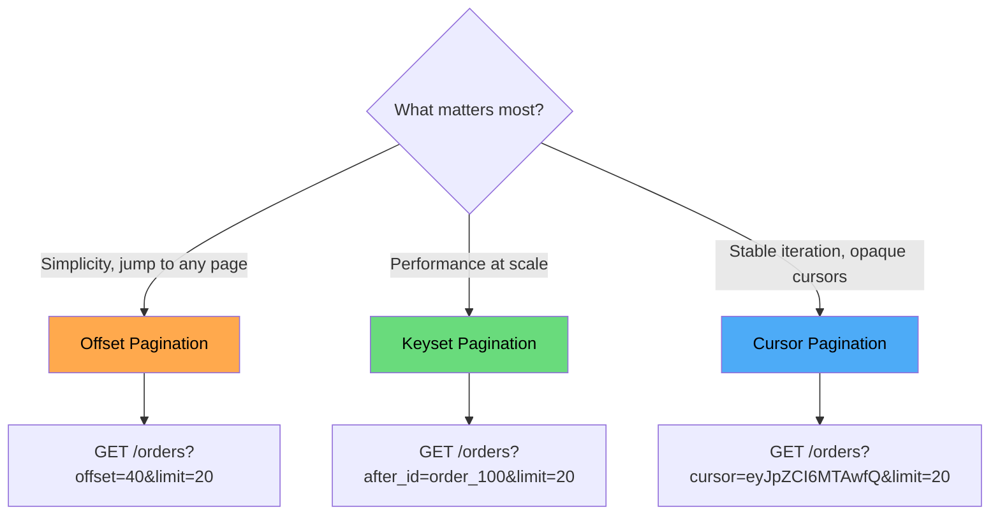

# API Pagination Patterns

Every collection endpoint must be paginated. Without pagination, a single `GET /orders` request can return millions of rows, saturate your database connection pool, exhaust server memory, and blow through your client's bandwidth budget. Pagination is not a nice-to-have — it is a reliability requirement.

But not all pagination is equal. The three major strategies — offset, cursor, and keyset — make fundamentally different trade-offs between simplicity, performance, and consistency. Choosing wrong can mean the difference between 5ms and 5-second page loads at scale.

## The Three Strategies at a Glance



| Strategy | Query Cost | Page Jumping | Consistency | Complexity |
|----------|-----------|:------------:|:-----------:|:----------:|
| **Offset** | O(offset + limit) | Yes | Unstable | Low |
| **Cursor** | O(limit) | No | Stable | Medium |
| **Keyset** | O(limit) | No | Stable | Medium |

## Offset-Based Pagination

The simplest approach: skip N rows, return the next M.

### How It Works

```
GET /api/orders?offset=0&limit=20    → rows 1-20
GET /api/orders?offset=20&limit=20   → rows 21-40
GET /api/orders?offset=40&limit=20   → rows 41-60
```

### Implementation

```typescript
// Express.js handler
app.get('/api/orders', async (req, res) => {
  const limit = Math.min(parseInt(req.query.limit as string) || 20, 100);
  const offset = parseInt(req.query.offset as string) || 0;

  const [orders, totalCount] = await Promise.all([
    db.query(
      'SELECT * FROM orders ORDER BY created_at DESC LIMIT $1 OFFSET $2',
      [limit, offset]
    ),
    db.query('SELECT COUNT(*) FROM orders')
  ]);

  res.json({
    data: orders.rows,
    pagination: {
      offset,
      limit,
      total: parseInt(totalCount.rows[0].count),
      has_more: offset + limit < parseInt(totalCount.rows[0].count)
    }
  });
});
```

### Response Format

```json
{
  "data": [
    { "id": "order_41", "status": "shipped", "created_at": "2026-03-15T10:00:00Z" },
    { "id": "order_42", "status": "pending", "created_at": "2026-03-15T09:30:00Z" }
  ],
  "pagination": {
    "offset": 40,
    "limit": 20,
    "total": 1523,
    "has_more": true
  }
}
```

### The Performance Problem

Offset pagination uses SQL `OFFSET`, which does not skip rows — it reads and discards them:

```sql
-- Page 1: scans 20 rows
SELECT * FROM orders ORDER BY created_at DESC LIMIT 20 OFFSET 0;

-- Page 50: scans 1,000 rows, returns 20
SELECT * FROM orders ORDER BY created_at DESC LIMIT 20 OFFSET 980;

-- Page 5,000: scans 100,000 rows, returns 20
SELECT * FROM orders ORDER BY created_at DESC LIMIT 20 OFFSET 99980;
```

The database must sort and scan all rows up to `offset + limit` for every request. At high offsets, this becomes progressively slower.

```
Offset     |  Query Time (1M rows, PostgreSQL)
-----------+-----------------------------------
0          |  2ms
1,000      |  5ms
10,000     |  25ms
100,000    |  180ms
500,000    |  900ms
900,000    |  1,600ms
```

### The Consistency Problem

Offset pagination is unstable when data changes between page requests:

```
State at time T0: [A, B, C, D, E, F, G, H]

Client requests page 1 (offset=0, limit=4): [A, B, C, D]

New item X is inserted at position 1.

State at time T1: [X, A, B, C, D, E, F, G, H]

Client requests page 2 (offset=4, limit=4): [D, E, F, G]
                                              ↑ D appears AGAIN
```

Item D is returned on both pages. If an item is deleted between requests, a different item is skipped entirely. For frequently changing datasets, this means consumers see duplicates or miss records.

::: warning
Offset pagination is acceptable for small, mostly-static datasets (admin dashboards, configuration lists) and use cases that require page jumping (showing "Page 3 of 12"). For anything else, use cursor or keyset pagination.
:::

### When Offset Is Still the Right Choice

- **UI requires page numbers** — "Go to page 7 of 12" is only possible with offset
- **Total count is needed** — some UIs show "Showing 41-60 of 1,523 results"
- **Dataset is small** — under 10,000 rows, the performance difference is negligible
- **Data is rarely modified** — reference data, catalogs, configuration

## Cursor-Based Pagination

Cursor pagination uses an opaque token (the "cursor") that encodes the position in the result set. The server knows how to decode the cursor to resume from where the previous page ended.

### How It Works

```
GET /api/orders?limit=20
→ { data: [...], pagination: { next_cursor: "eyJpZCI6Im9yZGVyXzIwIn0=" } }

GET /api/orders?cursor=eyJpZCI6Im9yZGVyXzIwIn0=&limit=20
→ { data: [...], pagination: { next_cursor: "eyJpZCI6Im9yZGVyXzQwIn0=" } }

GET /api/orders?cursor=eyJpZCI6Im9yZGVyXzQwIn0=&limit=20
→ { data: [...], pagination: { next_cursor: null, has_more: false } }
```

### Cursor Encoding

The cursor is typically a base64-encoded JSON object containing the sort key values of the last item:

```typescript
interface CursorPayload {
  id: string;
  created_at: string;  // Include all sort key fields
}

function encodeCursor(payload: CursorPayload): string {
  return Buffer.from(JSON.stringify(payload)).toString('base64url');
}

function decodeCursor(cursor: string): CursorPayload {
  return JSON.parse(Buffer.from(cursor, 'base64url').toString());
}
```

::: tip
Use `base64url` encoding (not standard base64) for cursors. Standard base64 includes `+`, `/`, and `=` characters that need URL encoding. `base64url` uses `-`, `_` instead and is safe in query parameters.
:::

### Implementation

```typescript
app.get('/api/orders', async (req, res) => {
  const limit = Math.min(parseInt(req.query.limit as string) || 20, 100);
  const cursor = req.query.cursor as string | undefined;

  let query = 'SELECT * FROM orders';
  const params: unknown[] = [];

  if (cursor) {
    const decoded = decodeCursor(cursor);
    // Keyset condition: resume after the cursor position
    query += ` WHERE (created_at, id) < ($1, $2)`;
    params.push(decoded.created_at, decoded.id);
  }

  query += ` ORDER BY created_at DESC, id DESC LIMIT $${params.length + 1}`;
  params.push(limit + 1); // Fetch one extra to detect has_more

  const result = await db.query(query, params);
  const hasMore = result.rows.length > limit;
  const data = hasMore ? result.rows.slice(0, limit) : result.rows;

  const lastItem = data[data.length - 1];
  const nextCursor = hasMore && lastItem
    ? encodeCursor({ id: lastItem.id, created_at: lastItem.created_at })
    : null;

  res.json({
    data,
    pagination: {
      next_cursor: nextCursor,
      has_more: hasMore
    }
  });
});
```

### Why Cursors Are Fast

The cursor translates to a `WHERE` clause that uses an index, not an `OFFSET` that scans and discards rows:

```sql
-- Cursor pagination: always fast, regardless of "page number"
SELECT * FROM orders
WHERE (created_at, id) < ('2026-03-15T10:00:00Z', 'order_980')
ORDER BY created_at DESC, id DESC
LIMIT 20;

-- With a composite index on (created_at DESC, id DESC),
-- this is an index seek + 20 row fetch = O(limit)
```

### Supporting the Index

```sql
-- This index makes cursor pagination fast
CREATE INDEX idx_orders_cursor
ON orders (created_at DESC, id DESC);
```

## Keyset Pagination

Keyset pagination is the underlying mechanism that makes cursor pagination fast. The difference is that keyset pagination uses visible, meaningful values (like IDs and timestamps) rather than opaque encoded cursors.

### How It Works

```
GET /api/orders?limit=20
GET /api/orders?after_id=order_20&after_created_at=2026-03-15T09:00:00Z&limit=20
GET /api/orders?after_id=order_40&after_created_at=2026-03-14T15:00:00Z&limit=20
```

### Implementation

```python
# FastAPI + SQLAlchemy example
from fastapi import FastAPI, Query
from sqlalchemy import select, and_, tuple_
from datetime import datetime

app = FastAPI()

@app.get("/orders")
async def list_orders(
    limit: int = Query(20, ge=1, le=100),
    after_id: str | None = Query(None),
    after_created_at: datetime | None = Query(None),
):
    query = select(Order).order_by(
        Order.created_at.desc(), Order.id.desc()
    )

    if after_id and after_created_at:
        # Keyset condition using tuple comparison
        query = query.where(
            tuple_(Order.created_at, Order.id) <
            tuple_(after_created_at, after_id)
        )

    query = query.limit(limit + 1)
    results = await db.execute(query)
    orders = results.scalars().all()

    has_more = len(orders) > limit
    data = orders[:limit]

    return {
        "data": [order.to_dict() for order in data],
        "pagination": {
            "has_more": has_more,
            "next_params": {
                "after_id": data[-1].id,
                "after_created_at": data[-1].created_at.isoformat()
            } if has_more and data else None
        }
    }
```

### Cursor vs Keyset: When to Use Which

| Factor | Cursor (opaque) | Keyset (visible) |
|--------|:---------------:|:-----------------:|
| **Client simplicity** | Simpler (just pass the token) | Must track multiple fields |
| **Server flexibility** | Can change encoding without breaking clients | Changing sort fields breaks clients |
| **Debugging** | Harder (opaque tokens) | Easier (visible values) |
| **Bookmarking** | Not meaningful | Can construct URLs manually |
| **Security** | Hides implementation details | Exposes sort key values |

::: tip
For public APIs, prefer opaque cursors — they give you the freedom to change the underlying implementation without a breaking change. For internal APIs, keyset pagination with visible parameters is simpler and easier to debug.
:::

## Multi-Column Sorting with Pagination

When paginating with multiple sort criteria, the keyset condition must be a tuple comparison:

```sql
-- Sort by status ASC, then created_at DESC, then id DESC
-- Keyset condition for "next page after (shipped, 2026-03-15, order_50)":

SELECT * FROM orders
WHERE (status, created_at DESC, id DESC) > ('shipped', '2026-03-15', 'order_50')
ORDER BY status ASC, created_at DESC, id DESC
LIMIT 20;
```

In practice, tuple comparison in SQL can be tricky. The expanded form:

```sql
WHERE status > 'shipped'
   OR (status = 'shipped' AND created_at < '2026-03-15')
   OR (status = 'shipped' AND created_at = '2026-03-15' AND id < 'order_50')
```

::: warning
Multi-column keyset pagination requires a composite index that matches the sort order exactly. Without it, the database falls back to a full table scan. Always verify with `EXPLAIN ANALYZE`.
:::

## The Total Count Problem

Offset pagination naturally provides a total count. Cursor/keyset pagination does not — and computing total count can be expensive.

### Strategies

| Strategy | Cost | Accuracy | Implementation |
|----------|------|----------|----------------|
| **Exact count** | High (`COUNT(*)` on every request) | Perfect | `SELECT COUNT(*) FROM orders WHERE ...` |
| **Cached count** | Low (periodic refresh) | Stale (seconds to minutes) | Redis counter, updated by triggers or background job |
| **Estimated count** | Very low | Approximate | `SELECT reltuples FROM pg_class WHERE relname = 'orders'` |
| **No count** | Zero | N/A | Return `has_more` only; show "Load more" instead of page numbers |

```typescript
// PostgreSQL fast estimate (within ~10% accuracy for large tables)
async function estimateCount(table: string): Promise<number> {
  const result = await db.query(
    `SELECT reltuples::bigint AS estimate
     FROM pg_class
     WHERE relname = $1`,
    [table]
  );
  return result.rows[0]?.estimate || 0;
}
```

::: tip
For most APIs, `has_more: true/false` is sufficient. The "infinite scroll" UI pattern has trained users to not expect total counts. Only compute exact counts when the UI genuinely requires page numbers.
:::

## Response Format Standards

### Standard Cursor Pagination Response

```json
{
  "data": [
    { "id": "order_42", "status": "shipped" },
    { "id": "order_41", "status": "pending" }
  ],
  "pagination": {
    "next_cursor": "eyJpZCI6Im9yZGVyXzQxIiwiY3JlYXRlZF9hdCI6IjIwMjYtMDMtMTRUMTU6MDA6MDBaIn0",
    "prev_cursor": "eyJpZCI6Im9yZGVyXzQyIiwiY3JlYXRlZF9hdCI6IjIwMjYtMDMtMTVUMTA6MDA6MDBaIn0",
    "has_more": true
  }
}
```

### Standard Offset Pagination Response

```json
{
  "data": [
    { "id": "order_42", "status": "shipped" },
    { "id": "order_41", "status": "pending" }
  ],
  "pagination": {
    "offset": 40,
    "limit": 20,
    "total": 1523,
    "has_more": true
  }
}
```

### Link Header (RFC 8288)

Some APIs use the HTTP `Link` header for pagination instead of response body fields:

```
Link: <https://api.example.com/orders?cursor=abc123>; rel="next",
      <https://api.example.com/orders?cursor=xyz789>; rel="prev"
```

GitHub uses this pattern. It keeps the response body clean but requires consumers to parse headers.

## Performance Benchmark

Testing with PostgreSQL 15, 10 million rows, indexed on `(created_at DESC, id DESC)`:

```
Strategy     | Page 1    | Page 100  | Page 10,000 | Page 500,000
-------------+-----------+-----------+-------------+-------------
Offset       | 1.2ms     | 3.8ms     | 180ms       | 2,400ms
Cursor       | 1.2ms     | 1.3ms     | 1.3ms       | 1.3ms
Keyset       | 1.2ms     | 1.3ms     | 1.3ms       | 1.3ms
```

The difference is not marginal — at page 500,000, offset pagination is **1,800x slower** than cursor pagination. This matters when you have background jobs iterating through entire tables or consumers that deep-paginate.

## Common Mistakes

| Mistake | Impact | Fix |
|---------|--------|-----|
| No pagination at all | Unbounded response sizes, OOM crashes | Always paginate collection endpoints |
| No upper limit on `limit` parameter | `?limit=1000000` bypasses pagination | Cap at 100 (or your measured safe maximum) |
| Using `OFFSET` for background iteration | Progressively slower as you go deeper | Use cursor/keyset with `WHERE` clause |
| Cursor encodes only one field | Ambiguous position when values are not unique | Encode all sort key fields + a unique tiebreaker (ID) |
| No `ORDER BY` in paginated query | Results are non-deterministic | Always specify explicit, stable ordering |
| Offset with `ORDER BY RANDOM()` | Different random order on every page | Use `setseed()` or pre-computed random column |

## GraphQL Pagination (Relay Connection Spec)

GraphQL's Relay specification defines a standard cursor-based pagination format:

```graphql
query {
  orders(first: 20, after: "cursor_abc") {
    edges {
      cursor
      node {
        id
        status
        total { amount currency }
      }
    }
    pageInfo {
      hasNextPage
      hasPreviousPage
      startCursor
      endCursor
    }
    totalCount
  }
}
```

The `edges` / `node` / `pageInfo` structure is verbose but provides a consistent interface across all paginated queries in a GraphQL API.

## Further Reading

- [REST API Best Practices](/system-design/api-design/rest-best-practices) — filtering, sorting, and field selection alongside pagination
- [Database Indexing](/system-design/databases/) — why index design is critical for pagination performance
- [OpenAPI & Swagger](/system-design/api-design/openapi-swagger) — how to define pagination schemas in your API spec
- [Caching](/system-design/caching/) — cache strategies for paginated responses
