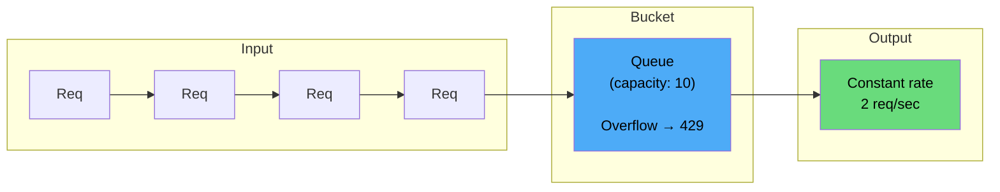
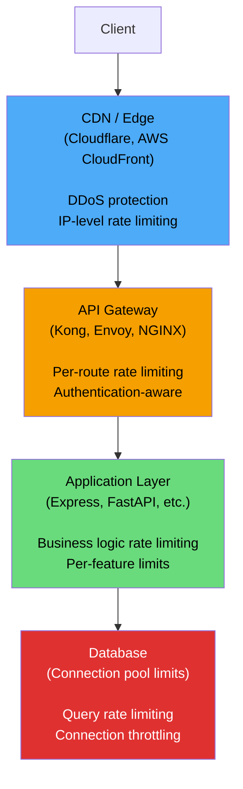

# API Rate Limiting Deep Dive

Rate limiting is the mechanism that prevents any single client from consuming more than their fair share of your API's capacity. Without rate limiting, a single misbehaving client — whether malicious, buggy, or simply enthusiastic — can starve all other clients of resources.

But rate limiting is harder than it appears. The naive approach (count requests per minute, reject when over the limit) fails in distributed systems, creates unfair behavior at window boundaries, and does not account for burst patterns. Production rate limiting requires understanding the trade-offs between five major algorithms, the distributed coordination challenges of enforcing limits across multiple servers, and the operational complexity of choosing the right limits.

This page covers every major rate limiting algorithm with working code, the math behind each approach, distributed implementation with Redis, and the production considerations that textbooks skip.

## Why Rate Limiting Matters

### Without Rate Limiting

```
Scenario: API with no rate limiting

Normal load: 1,000 req/s across 100 clients (10 req/s per client)
Server capacity: 2,000 req/s

Tuesday 3:14 PM:
  Client X has a bug — retry loop sends 50,000 req/s
  Server saturated at 2,000 req/s
  99 legitimate clients get timeouts and errors
  Client X consumes 100% of capacity
  TOTAL OUTAGE for everyone except the broken client
```

Rate limiting protects against:
- **Abuse and DDoS** — malicious actors flooding your API
- **Buggy clients** — retry loops without backoff, infinite pagination
- **Cost control** — preventing runaway API usage that blows your infrastructure budget
- **Fair resource sharing** — ensuring no single tenant monopolizes shared infrastructure
- **Compliance** — enforcing contractual usage limits for paid API tiers

## The Five Algorithms

### Overview Comparison

| Algorithm | Accuracy | Memory | Burst Handling | Complexity | Best For |
|-----------|:--------:|:------:|:--------------:|:----------:|----------|
| **Fixed Window** | Low | Very low | Poor (boundary spike) | Very low | Simple use cases |
| **Sliding Window Log** | Perfect | High | Perfect | Medium | Low-volume, precision-critical |
| **Sliding Window Counter** | High | Low | Good | Medium | General purpose (recommended) |
| **Token Bucket** | High | Low | Excellent (configurable burst) | Medium | APIs with burst tolerance |
| **Leaky Bucket** | High | Low | Strict (smoothing) | Medium | Strict rate enforcement |

### Algorithm 1: Fixed Window Counter

The simplest approach. Divide time into fixed windows (e.g., 1-minute intervals) and count requests in each window.

```
Window: 14:00:00 - 14:00:59  |  14:01:00 - 14:01:59
Limit: 100 requests per minute

14:00:00  Request 1     ✅  (count: 1)
14:00:15  Request 45    ✅  (count: 45)
14:00:30  Request 100   ✅  (count: 100)
14:00:31  Request 101   ❌  RATE LIMITED (count: 100, limit reached)
14:01:00  Request 102   ✅  (count: 1, new window)
```

**Redis implementation:**

```lua
-- fixed_window.lua (Redis Lua script — atomic)
local key = KEYS[1]          -- "rate:user:123:1712345000"
local limit = tonumber(ARGV[1])  -- 100
local window = tonumber(ARGV[2]) -- 60 (seconds)

local current = redis.call('INCR', key)

if current == 1 then
  redis.call('EXPIRE', key, window)
end

if current > limit then
  return 0  -- rejected
else
  return 1  -- allowed
end
```

```typescript
async function fixedWindowRateLimit(
  redis: Redis,
  userId: string,
  limit: number,
  windowSeconds: number
): Promise<{ allowed: boolean; remaining: number }> {
  const windowStart = Math.floor(Date.now() / 1000 / windowSeconds) * windowSeconds;
  const key = `rate:${userId}:${windowStart}`;

  const current = await redis.incr(key);
  if (current === 1) {
    await redis.expire(key, windowSeconds);
  }

  return {
    allowed: current <= limit,
    remaining: Math.max(0, limit - current),
  };
}
```

**The boundary problem:**

```
Limit: 100 requests per minute

14:00:30  50 requests  (window 14:00 count: 50)
14:00:59  50 requests  (window 14:00 count: 100)
14:01:00  100 requests (window 14:01 count: 100)  ← NEW WINDOW, COUNTER RESET

Result: 200 requests in 61 seconds, despite a "100/min" limit
The burst at the window boundary allows 2x the intended rate.
```



```mermaid
gantt
    title Fixed Window Boundary Problem
    dateFormat HH:mm:ss
    axisFormat %H:%M:%S

    section Window 1
    50 requests (OK)      :done, 14:00:30, 29s
    50 requests (OK)      :done, 14:00:59, 1s

    section Window 2
    100 requests (OK)     :done, 14:01:00, 1s

    section Reality
    200 req in ~61 seconds :crit, 14:00:30, 31s
```

### Algorithm 2: Sliding Window Log

Keep a timestamped log of every request. For each new request, count how many requests fall within the trailing window.

```
Window: trailing 60 seconds
Limit: 100 requests per minute

Request at 14:01:25:
  1. Add timestamp 14:01:25 to the log
  2. Remove all timestamps older than 14:00:25 (60s ago)
  3. Count remaining timestamps
  4. If count > 100, reject; otherwise, allow
```

**Redis implementation using sorted sets:**

```lua
-- sliding_window_log.lua
local key = KEYS[1]              -- "rate:user:123"
local limit = tonumber(ARGV[1])  -- 100
local window = tonumber(ARGV[2]) -- 60000 (milliseconds)
local now = tonumber(ARGV[3])    -- current timestamp in ms

-- Remove entries outside the window
redis.call('ZREMRANGEBYSCORE', key, 0, now - window)

-- Count entries in the window
local count = redis.call('ZCARD', key)

if count >= limit then
  return 0  -- rejected
end

-- Add the current request
redis.call('ZADD', key, now, now .. ':' .. math.random(1000000))
redis.call('EXPIRE', key, math.ceil(window / 1000))

return 1  -- allowed
```

**Trade-off:** Perfect accuracy, but O(N) memory per user where N is the request count within the window. For a user making 10,000 requests/minute, that is 10,000 sorted set entries per key. This does not scale for high-volume APIs.

### Algorithm 3: Sliding Window Counter

A hybrid of fixed window and sliding window log. Uses the counts from the current and previous fixed windows, weighted by the position within the current window.

```
Limit: 100 requests per minute
Previous window (14:00-14:01): 80 requests
Current window  (14:01-14:02): 30 requests so far
Current time:   14:01:15 (25% into current window)

Weighted count = (previous_count * overlap_ratio) + current_count
               = (80 * 0.75) + 30
               = 60 + 30
               = 90

90 < 100 → ALLOWED
```

The `overlap_ratio` is the fraction of the previous window that overlaps with the trailing sliding window:

$$\text{overlap\_ratio} = 1 - \frac{t_{\text{current}} - t_{\text{window\_start}}}{t_{\text{window\_size}}}$$

**Redis implementation:**

```lua
-- sliding_window_counter.lua
local current_key = KEYS[1]      -- "rate:user:123:14:01"
local previous_key = KEYS[2]     -- "rate:user:123:14:00"
local limit = tonumber(ARGV[1])  -- 100
local window = tonumber(ARGV[2]) -- 60 (seconds)
local now = tonumber(ARGV[3])    -- current epoch seconds

local window_start = math.floor(now / window) * window
local elapsed = now - window_start
local overlap_ratio = 1 - (elapsed / window)

local previous_count = tonumber(redis.call('GET', previous_key) or '0')
local current_count = tonumber(redis.call('GET', current_key) or '0')

local weighted_count = math.floor(previous_count * overlap_ratio) + current_count

if weighted_count >= limit then
  return 0  -- rejected
end

redis.call('INCR', current_key)
redis.call('EXPIRE', current_key, window * 2)

return 1  -- allowed
```

```typescript
async function slidingWindowCounter(
  redis: Redis,
  userId: string,
  limit: number,
  windowSeconds: number
): Promise<{ allowed: boolean; remaining: number }> {
  const now = Date.now() / 1000;
  const windowStart = Math.floor(now / windowSeconds) * windowSeconds;
  const elapsed = now - windowStart;
  const overlapRatio = 1 - elapsed / windowSeconds;

  const currentKey = `rate:${userId}:${windowStart}`;
  const previousKey = `rate:${userId}:${windowStart - windowSeconds}`;

  const [previousCount, currentCount] = await Promise.all([
    redis.get(previousKey).then(v => parseInt(v ?? '0', 10)),
    redis.get(currentKey).then(v => parseInt(v ?? '0', 10)),
  ]);

  const weightedCount = Math.floor(previousCount * overlapRatio) + currentCount;

  if (weightedCount >= limit) {
    return { allowed: false, remaining: 0 };
  }

  await redis.multi()
    .incr(currentKey)
    .expire(currentKey, windowSeconds * 2)
    .exec();

  return {
    allowed: true,
    remaining: Math.max(0, limit - weightedCount - 1),
  };
}
```

::: tip
The sliding window counter is the best general-purpose algorithm. It uses only two counters per user (O(1) memory), has no boundary spike problem (unlike fixed window), and provides good accuracy (within 0.003% of the true sliding window in Cloudflare's measurements). This is what Cloudflare, Stripe, and most production rate limiters use.
:::

### Algorithm 4: Token Bucket

A bucket holds tokens (up to a maximum capacity). Tokens are added at a fixed rate. Each request consumes one token. If the bucket is empty, the request is rejected.

```
Bucket capacity: 10 tokens
Refill rate: 2 tokens per second
Burst: up to 10 requests instantly (if bucket is full)

Time 0.0s:  Bucket has 10 tokens
             Request → consumes 1 token (9 remaining)
Time 0.0s:  9 more requests → bucket empty (0 remaining)
Time 0.0s:  Request → REJECTED (bucket empty)
Time 0.5s:  1 token refilled (bucket has 1 token)
Time 0.5s:  Request → consumes 1 token (0 remaining)
Time 1.0s:  2 tokens refilled (bucket has 2 tokens)
```

The math for token bucket:

$$\text{tokens} = \min\left(\text{capacity}, \text{tokens\_last} + \text{rate} \times (t_{\text{now}} - t_{\text{last}})\right)$$

**Redis implementation:**

```lua
-- token_bucket.lua
local key = KEYS[1]                -- "bucket:user:123"
local capacity = tonumber(ARGV[1]) -- 10
local rate = tonumber(ARGV[2])     -- 2 (tokens per second)
local now = tonumber(ARGV[3])      -- current time (seconds, float)
local requested = tonumber(ARGV[4]) -- 1 (tokens to consume)

-- Get current bucket state
local bucket = redis.call('HMGET', key, 'tokens', 'last_refill')
local tokens = tonumber(bucket[1]) or capacity
local last_refill = tonumber(bucket[2]) or now

-- Calculate tokens to add since last refill
local elapsed = now - last_refill
local new_tokens = elapsed * rate
tokens = math.min(capacity, tokens + new_tokens)

-- Try to consume tokens
if tokens >= requested then
  tokens = tokens - requested
  redis.call('HMSET', key, 'tokens', tokens, 'last_refill', now)
  redis.call('EXPIRE', key, math.ceil(capacity / rate) * 2)
  return 1  -- allowed
else
  -- Update refill time even on rejection (to avoid token drift)
  redis.call('HMSET', key, 'tokens', tokens, 'last_refill', now)
  redis.call('EXPIRE', key, math.ceil(capacity / rate) * 2)
  return 0  -- rejected
end
```

**Token bucket is ideal when you want to allow bursts.** A user on a "100 requests per minute" plan can send 10 requests in 1 second as long as they have accumulated enough tokens, then wait for refills. This matches real-world API usage patterns better than strict per-second enforcement.

### Algorithm 5: Leaky Bucket

The inverse of token bucket — conceptually, requests enter a bucket (queue) that leaks at a constant rate. If the bucket is full, new requests are rejected. This produces a perfectly smooth output rate regardless of input burstiness.

```
Bucket capacity: 10
Leak rate: 2 per second (one request processed every 500ms)

Burst of 15 requests at time 0:
  Requests 1-10: accepted into bucket
  Requests 11-15: REJECTED (bucket full)

  Processing:
  t=0.0s: Request 1 leaks out (bucket: 9)
  t=0.5s: Request 2 leaks out (bucket: 8)
  t=1.0s: Request 3 leaks out (bucket: 7)
  ...
  t=4.5s: Request 10 leaks out (bucket: 0)
```



**Implementation (as a counter with timestamps):**

```lua
-- leaky_bucket.lua
local key = KEYS[1]
local capacity = tonumber(ARGV[1]) -- 10
local leak_rate = tonumber(ARGV[2]) -- 2 (per second)
local now = tonumber(ARGV[3])

local bucket = redis.call('HMGET', key, 'water', 'last_leak')
local water = tonumber(bucket[1]) or 0
local last_leak = tonumber(bucket[2]) or now

-- Leak water since last check
local elapsed = now - last_leak
local leaked = elapsed * leak_rate
water = math.max(0, water - leaked)

-- Try to add water (request)
if water < capacity then
  water = water + 1
  redis.call('HMSET', key, 'water', water, 'last_leak', now)
  redis.call('EXPIRE', key, math.ceil(capacity / leak_rate) * 2)
  return 1  -- allowed
else
  redis.call('HMSET', key, 'water', water, 'last_leak', now)
  redis.call('EXPIRE', key, math.ceil(capacity / leak_rate) * 2)
  return 0  -- rejected (bucket full)
end
```

**Token bucket vs. leaky bucket:**

| Property | Token Bucket | Leaky Bucket |
|----------|:------------:|:------------:|
| Burst allowed | Yes (up to capacity) | No (smooth output) |
| Output rate | Variable (bursty) | Constant (smooth) |
| Good for | APIs with burst tolerance | Strict rate enforcement |
| Use case | User-facing APIs | Backend processing queues |

## Distributed Rate Limiting

In production, your API runs on multiple servers. A rate limiter that only counts requests on a single server allows N times the limit if you have N servers.

### The Coordination Problem

```
Rate limit: 100 req/min per user

Server A receives 60 requests from User X → allows all (local count: 60)
Server B receives 60 requests from User X → allows all (local count: 60)

Actual requests allowed: 120 (exceeds the 100 limit)
```

### Solution 1: Centralized Counter (Redis)

All servers check and increment a shared counter in Redis. This is the standard approach.

```typescript
// All servers call the same Redis instance
const allowed = await slidingWindowCounter(redis, userId, 100, 60);

// Pros: Exact counting, simple
// Cons: Redis is a single point of failure, adds latency per request
```

**Redis latency considerations:**
- Same-region Redis: ~0.5-1ms per rate limit check
- Cross-region Redis: 10-50ms per rate limit check (unacceptable)
- Solution: Use region-local Redis instances with partial limits

### Solution 2: Per-Region Limits

Split the global limit across regions proportionally:

```
Global limit: 1000 req/min per user

us-east-1 (handles 40% of traffic): local limit = 400 req/min
eu-west-1 (handles 35% of traffic): local limit = 350 req/min
ap-south-1 (handles 25% of traffic): local limit = 250 req/min

Total capacity: 1000 req/min (if traffic distribution matches)
```

::: warning
Per-region limits are imprecise. If a user suddenly shifts all traffic to one region, they get that region's partial limit instead of the full global limit. This is usually acceptable — slight inaccuracy is better than cross-region latency on every request.
:::

### Solution 3: Local Counter with Sync

Each server maintains a local counter and periodically syncs with a central store:

```typescript
class LocalRateLimiter {
  private localCount = 0;
  private globalCount = 0;
  private syncInterval = 1000; // sync every second

  constructor(private redis: Redis, private limit: number) {
    setInterval(() => this.sync(), this.syncInterval);
  }

  async check(userId: string): Promise<boolean> {
    // Check against global count (updated periodically)
    if (this.globalCount + this.localCount >= this.limit) {
      return false;
    }
    this.localCount++;
    return true;
  }

  private async sync() {
    // Push local count to Redis, pull global total
    const added = await this.redis.incrby(`rate:${this.userId}`, this.localCount);
    this.localCount = 0;
    this.globalCount = added;
  }
}

// Pros: Very fast (no Redis call per request), eventual consistency
// Cons: Can overshoot the limit by (num_servers * sync_interval * request_rate)
```

### Race Conditions

The classic check-then-increment race:

```
Thread A: GET rate:user:123 → 99
Thread B: GET rate:user:123 → 99
Thread A: 99 < 100, allow! SET rate:user:123 100
Thread B: 99 < 100, allow! SET rate:user:123 100

Both requests allowed, but only one should have been.
```

**Solution: Atomic operations.** All Redis implementations above use either `INCR` (atomic) or Lua scripts (atomic). Never use separate GET and SET commands for rate limiting.

```lua
-- WRONG: race condition
local count = redis.call('GET', key)
if tonumber(count) < limit then
  redis.call('INCR', key)  -- Race: another request may have incremented between GET and INCR
  return 1
end

-- RIGHT: atomic increment + check
local count = redis.call('INCR', key)
if count > limit then
  return 0  -- Already incremented, but over limit
end
return 1
```

### Clock Skew

In distributed systems, server clocks drift. If Server A's clock is 2 seconds ahead of Server B's, window boundaries differ:

```
Server A (clock: 14:01:02): current window = 14:01
Server B (clock: 14:01:00): current window = 14:01

Usually fine — both see the same window.

But near window boundaries:
Server A (clock: 14:02:01): current window = 14:02 (new window, counter reset)
Server B (clock: 14:01:59): current window = 14:01 (old window)

Server A allows requests in the new window while Server B is still counting in the old window.
```

**Mitigation:** Use NTP to keep clocks synchronized (typically within 1-10ms). For sliding window counter and token bucket, small clock drift has negligible effect. For fixed window, clock skew can exacerbate the boundary problem.

## Rate Limiting at Different Layers

### Multi-Layer Defense



| Layer | What to Limit | Why |
|-------|--------------|-----|
| **CDN/Edge** | Requests per IP, geographic blocks | Stop DDoS before it reaches your infrastructure |
| **API Gateway** | Requests per API key, per route | Enforce plan limits, protect backend services |
| **Application** | Per user + per feature (e.g., 10 password attempts/hour) | Business-specific limits that gateways cannot express |
| **Database** | Connection pool size, query timeout | Prevent any single service from starving DB connections |

### API Gateway Rate Limiting

**Nginx:**

```nginx
# Define a rate limit zone (10 req/s per IP, 10MB shared memory)
limit_req_zone $binary_remote_addr zone=api:10m rate=10r/s;

server {
    location /api/ {
        # Allow burst of 20, delay excess requests (don't reject immediately)
        limit_req zone=api burst=20 delay=10;
        limit_req_status 429;

        proxy_pass http://backend;
    }
}
```

**Kong (API Gateway):**

```yaml
# Kong rate limiting plugin
plugins:
  - name: rate-limiting
    config:
      minute: 100
      hour: 5000
      policy: redis
      redis_host: redis.internal
      redis_port: 6379
      redis_database: 0
      hide_client_headers: false
      fault_tolerant: true  # Allow requests if Redis is down
```

**Envoy:**

```yaml
# Envoy rate limit filter
http_filters:
  - name: envoy.filters.http.ratelimit
    typed_config:
      "@type": type.googleapis.com/envoy.extensions.filters.http.ratelimit.v3.RateLimit
      domain: api
      rate_limit_service:
        grpc_service:
          envoy_grpc:
            cluster_name: rate_limit_service
```

## HTTP Headers

Standard headers for communicating rate limit state to clients:

```http
HTTP/1.1 200 OK
X-RateLimit-Limit: 100
X-RateLimit-Remaining: 67
X-RateLimit-Reset: 1712345100

# When rate limited:
HTTP/1.1 429 Too Many Requests
X-RateLimit-Limit: 100
X-RateLimit-Remaining: 0
X-RateLimit-Reset: 1712345100
Retry-After: 45
Content-Type: application/json

{
  "error": {
    "code": "RATE_LIMIT_EXCEEDED",
    "message": "Rate limit exceeded. Try again in 45 seconds.",
    "retry_after": 45
  }
}
```

### IETF Standard Headers (RFC 6585 + Draft)

The IETF `RateLimit` header draft proposes standardized headers:

```http
RateLimit-Limit: 100
RateLimit-Remaining: 67
RateLimit-Reset: 45

# RateLimit-Policy (describes the policy)
RateLimit-Policy: 100;w=60
# meaning: 100 requests per 60-second window
```

::: tip
Always include `Retry-After` in 429 responses. Well-behaved clients use this header to schedule their next retry. Without it, clients guess (often poorly), leading to thundering herd retries that make the overload worse.
:::

### Implementation in Express.js

```typescript
import { Redis } from 'ioredis';

interface RateLimitResult {
  allowed: boolean;
  limit: number;
  remaining: number;
  resetAt: number; // Unix epoch seconds
  retryAfter?: number; // seconds
}

function rateLimitMiddleware(
  redis: Redis,
  limit: number,
  windowSeconds: number
) {
  return async (req: Request, res: Response, next: NextFunction) => {
    const key = extractKey(req); // user ID, API key, or IP
    const result = await checkRateLimit(redis, key, limit, windowSeconds);

    // Always set rate limit headers
    res.set('X-RateLimit-Limit', String(result.limit));
    res.set('X-RateLimit-Remaining', String(result.remaining));
    res.set('X-RateLimit-Reset', String(result.resetAt));

    if (!result.allowed) {
      res.set('Retry-After', String(result.retryAfter));
      return res.status(429).json({
        error: {
          code: 'RATE_LIMIT_EXCEEDED',
          message: `Rate limit of ${limit} requests per ${windowSeconds}s exceeded`,
          retry_after: result.retryAfter,
        },
      });
    }

    next();
  };
}

function extractKey(req: Request): string {
  // Priority: authenticated user > API key > IP address
  if (req.user?.id) return `user:${req.user.id}`;
  if (req.headers['x-api-key']) return `key:${req.headers['x-api-key']}`;
  return `ip:${req.ip}`;
}
```

## Rate Limit Dimensions

Choose what to rate limit by, based on your threat model and fairness requirements:

| Dimension | Best For | Weakness |
|-----------|----------|----------|
| **IP address** | Anonymous APIs, DDoS protection | Shared IPs (NAT, corporate proxies) penalize multiple users |
| **User ID** | Authenticated APIs | Requires authentication; attackers create multiple accounts |
| **API key** | B2B APIs with key-based auth | Key sharing, one key per org may be too coarse |
| **Endpoint** | Protecting expensive operations | Does not limit total user consumption |
| **Composite** (user + endpoint) | Fine-grained control | Complex configuration, more Redis keys |

### Multi-Dimensional Rate Limiting

```typescript
// Apply multiple rate limits simultaneously
const limits = [
  { key: `user:${userId}`,              limit: 1000, window: 60 },   // 1000/min per user
  { key: `user:${userId}:search`,       limit: 30,   window: 60 },   // 30 searches/min
  { key: `user:${userId}:export`,       limit: 5,    window: 3600 }, // 5 exports/hour
  { key: `ip:${clientIp}`,              limit: 100,  window: 60 },   // 100/min per IP
  { key: `global:expensive-endpoint`,   limit: 500,  window: 60 },   // 500/min global
];

// All limits must pass — reject if ANY limit is exceeded
for (const { key, limit, window } of limits) {
  const result = await checkRateLimit(redis, key, limit, window);
  if (!result.allowed) {
    return res.status(429).json({
      error: {
        code: 'RATE_LIMIT_EXCEEDED',
        limit_type: key.split(':')[0], // Tells client WHICH limit they hit
        retry_after: result.retryAfter,
      },
    });
  }
}
```

## Adaptive Rate Limiting

Static rate limits are set in advance and do not respond to real-time system load. Adaptive rate limiting adjusts limits based on current server health.

```typescript
class AdaptiveRateLimiter {
  private baseLimit = 1000;     // requests per minute
  private currentLimit = 1000;
  private checkInterval = 5000; // check every 5 seconds

  constructor() {
    setInterval(() => this.adjustLimits(), this.checkInterval);
  }

  private async adjustLimits() {
    const metrics = await getSystemMetrics();

    if (metrics.errorRate > 0.05) {
      // Error rate above 5% — aggressively reduce limits
      this.currentLimit = Math.max(100, this.currentLimit * 0.5);
    } else if (metrics.p99Latency > 2000) {
      // P99 latency above 2s — moderately reduce limits
      this.currentLimit = Math.max(100, this.currentLimit * 0.8);
    } else if (metrics.cpuUsage > 0.8) {
      // CPU above 80% — slightly reduce limits
      this.currentLimit = Math.max(100, this.currentLimit * 0.9);
    } else if (metrics.errorRate < 0.01 && metrics.p99Latency < 500) {
      // System is healthy — gradually increase toward base limit
      this.currentLimit = Math.min(this.baseLimit, this.currentLimit * 1.1);
    }
  }

  getLimit(): number {
    return Math.floor(this.currentLimit);
  }
}
```

::: warning
Adaptive rate limiting adds complexity and can create feedback loops. If reducing limits causes clients to retry aggressively, the retry traffic triggers further limit reductions, creating a death spiral. Always include a minimum floor and combine adaptive limits with client-side exponential backoff guidance.
:::

## Rate Limiting in Microservices

In a microservice architecture, a single user request may fan out to multiple internal services. Where do you enforce rate limits?

### Edge vs. Service-Level Limiting

```
User → API Gateway (rate limit: 100 req/min)
         ↓
       Order Service (internal, no rate limit?)
         ↓
       Payment Service (rate limit: 50 req/min — expensive external calls)
         ↓
       Notification Service (rate limit: 10 req/min — email provider limits)
```

**Guidelines:**
- **Edge/Gateway:** Enforce user-facing plan limits (100 req/min for free tier, 10,000 for enterprise)
- **Service-level:** Enforce resource-specific limits (payment processing capacity, external API quotas)
- **Circuit breakers:** Complement rate limiting for inter-service communication — if a downstream service is failing, stop sending requests

### Propagating Rate Limit Context

```typescript
// API Gateway adds rate limit headers to internal requests
const internalHeaders = {
  'X-User-Id': userId,
  'X-Rate-Limit-Tier': user.plan, // 'free', 'pro', 'enterprise'
  'X-Request-Priority': 'normal', // 'high', 'normal', 'low'
};

// Downstream services use this context for their own rate limiting
// Payment service: enterprise gets 100 tx/min, free gets 10 tx/min
```

## Tools and Services

| Tool | Type | Best For |
|------|------|----------|
| **Cloudflare Rate Limiting** | Edge | DDoS + API rate limiting at CDN layer |
| **AWS API Gateway** | Managed gateway | AWS-native APIs, usage plans |
| **Kong Rate Limiting** | API gateway plugin | Self-hosted or managed gateway |
| **Envoy RLS** | Service mesh | Microservice-level rate limiting |
| **Nginx `limit_req`** | Reverse proxy | Simple, fast, no external dependencies |
| **Redis + Lua** | Custom | Full control, any algorithm |
| **Upstash** | Serverless Redis | Serverless/edge rate limiting |
| **Arcjet** | SDK | Developer-friendly, multiple protections |

## Testing Rate Limits

### Load Testing

```bash
# Test with hey (HTTP load generator)
hey -n 200 -c 10 -m GET \
  -H "Authorization: Bearer $TOKEN" \
  https://api.example.com/v1/orders

# Expected: first 100 requests succeed (200), next 100 get 429
# Check: X-RateLimit-Remaining decrements correctly
# Check: Retry-After is present and accurate on 429 responses
```

### Unit Testing

```typescript
describe('Rate Limiter', () => {
  let redis: Redis;

  beforeEach(async () => {
    redis = new Redis(); // test Redis instance
    await redis.flushdb();
  });

  it('allows requests within the limit', async () => {
    for (let i = 0; i < 100; i++) {
      const result = await checkRateLimit(redis, 'user:1', 100, 60);
      expect(result.allowed).toBe(true);
    }
  });

  it('rejects requests over the limit', async () => {
    // Exhaust the limit
    for (let i = 0; i < 100; i++) {
      await checkRateLimit(redis, 'user:1', 100, 60);
    }

    // Next request should be rejected
    const result = await checkRateLimit(redis, 'user:1', 100, 60);
    expect(result.allowed).toBe(false);
    expect(result.remaining).toBe(0);
  });

  it('resets after the window expires', async () => {
    // Exhaust the limit
    for (let i = 0; i < 100; i++) {
      await checkRateLimit(redis, 'user:1', 100, 1); // 1-second window
    }

    // Wait for window to expire
    await sleep(1100);

    // Should be allowed again
    const result = await checkRateLimit(redis, 'user:1', 100, 1);
    expect(result.allowed).toBe(true);
  });

  it('returns correct Retry-After value', async () => {
    for (let i = 0; i < 100; i++) {
      await checkRateLimit(redis, 'user:1', 100, 60);
    }

    const result = await checkRateLimit(redis, 'user:1', 100, 60);
    expect(result.retryAfter).toBeGreaterThan(0);
    expect(result.retryAfter).toBeLessThanOrEqual(60);
  });
});
```

## Graceful Degradation

When your rate limiting infrastructure (Redis) goes down, you need a fallback:

```typescript
async function checkRateLimitWithFallback(
  redis: Redis,
  key: string,
  limit: number,
  window: number
): Promise<RateLimitResult> {
  try {
    return await checkRateLimit(redis, key, limit, window);
  } catch (error) {
    logger.error('Rate limit check failed', { error, key });

    // Fallback strategy — choose ONE:

    // Option 1: Fail open (allow all requests)
    // Risk: No rate limiting during Redis outage
    return { allowed: true, remaining: limit, resetAt: 0 };

    // Option 2: Fail closed (reject all requests)
    // Risk: Total outage during Redis failure
    // return { allowed: false, remaining: 0, resetAt: 0, retryAfter: 30 };

    // Option 3: In-memory fallback (approximate, per-instance)
    // return localRateLimiter.check(key, limit / instanceCount, window);
  }
}
```

::: tip
Most production systems fail open — allowing requests through when the rate limiter is unavailable. A brief period without rate limiting is usually less damaging than rejecting all requests. The exception is security-critical endpoints (login, password reset) where fail-closed is appropriate.
:::

---

## Key Takeaway

::: tip Key Takeaway
The sliding window counter is the right default algorithm for most production rate limiters — it has O(1) memory, no boundary spike problem, and good accuracy. Use Redis Lua scripts for atomic distributed counting, always return `Retry-After` headers so clients can back off intelligently, and design your rate limiter to fail open unless the endpoint is security-critical. The algorithm matters less than the operational decisions: what dimension to limit by, what limits to set, and how to communicate limits to clients.
:::

---

## Misconceptions

::: danger 6 Rate Limiting Misconceptions

**1. "Rate limiting is just counting requests per minute."**
Counting per minute with a fixed window allows 2x the intended rate at window boundaries. The choice of algorithm (fixed window, sliding window, token bucket, leaky bucket) determines accuracy, burst behavior, and memory usage. "100 per minute" means very different things depending on which algorithm enforces it.

**2. "Rate limiting prevents DDoS attacks."**
Application-layer rate limiting protects against individual abusive clients but does not stop volumetric DDoS attacks. A large DDoS attack saturates your network bandwidth before your rate limiter even sees the packets. DDoS protection requires edge-level mitigation (Cloudflare, AWS Shield) that operates at the network layer.

**3. "If I rate limit at the API gateway, I don't need rate limiting elsewhere."**
Gateway rate limiting enforces user-facing plan limits, but does not protect downstream services from internal amplification. A single API request that fans out to 50 internal service calls can overwhelm a downstream service. Rate limit at each layer proportional to that layer's capacity.

**4. "Rate limiting should always reject requests."**
Rejection (429 response) is one strategy. Others include: queuing (leaky bucket), degrading response quality (return cached data instead of real-time), deprioritizing (serve rate-limited users with lower priority), or throttling (add artificial latency to slow down the client). The right strategy depends on the use case.

**5. "The rate limit should match the server's maximum capacity."**
Rate limits should be set well below maximum capacity to leave headroom for traffic spikes, retries, and operational overhead. If your server handles 10,000 req/s at peak, setting the aggregate rate limit to 10,000 means any traffic spike causes failure. Set limits at 60-80% of capacity and autoscale for the rest.

**6. "IP-based rate limiting is sufficient for API protection."**
IP-based limiting penalizes all users behind shared IPs (corporate NATs, VPNs, mobile carriers). A single corporate proxy can serve thousands of distinct users from one IP. For authenticated APIs, always rate limit by user ID or API key, not IP. Use IP limiting only as a coarse first line of defense for unauthenticated endpoints.
:::

---

## When NOT to Use Rate Limiting

| Scenario | Why Not | What to Do Instead |
|----------|---------|-------------------|
| Internal service-to-service calls (trusted) | Rate limiting adds latency and complexity between trusted services | Use circuit breakers and load shedding instead |
| Static asset serving (CDN) | CDN handles scale; rate limiting adds unnecessary latency | Rely on CDN's built-in DDoS protection |
| Batch/offline processing pipelines | Not real-time; backpressure mechanisms are more appropriate | Use queue-based backpressure (SQS, Kafka consumer groups) |
| Webhook receivers you control | You control the sender; rate limit the sender, not the receiver | Configure the sender's outgoing rate |
| Development and staging environments | Slows down testing, hides production-only issues | Disable rate limiting in non-production environments |
| GraphQL introspection (dev mode) | Developer tooling needs unlimited access | Disable in production, allow in development |

---

## In Production

::: warning Production Considerations

**Redis is your single point of failure.** If Redis goes down, every rate limit check fails. Run Redis in a high-availability configuration (Redis Sentinel or Redis Cluster) and always implement a fallback strategy (fail open for most endpoints, fail closed for security-critical ones).

**Set limits based on data, not guesses.** Before deploying rate limits, analyze your actual traffic patterns. What does the 95th percentile user look like? What is the maximum legitimate burst? Set limits above normal usage but below abuse thresholds. Too tight and you frustrate legitimate users; too loose and you fail to protect against abuse.

**Communicate limits clearly.** Document rate limits in your API documentation, return limit information in every response (not just 429s), and provide a rate limit status endpoint so clients can check their usage. Developer experience around rate limits determines whether clients implement proper backoff or just retry blindly.

**Monitor rate limit rejections.** Track 429 responses by user, endpoint, and time. A sudden spike in 429s from a specific user may indicate a bug in their client. A gradual increase across many users may indicate your limits are too tight for growing usage. Alert on both patterns.

**Use tiered limits for pricing.** Rate limits are a natural pricing lever for APIs. Free tier: 100 req/min. Pro: 1,000 req/min. Enterprise: 10,000 req/min. This aligns infrastructure costs with revenue and gives users a clear upgrade path.

**Test the 429 response path.** It is surprisingly common for the 429 response to be misconfigured — wrong status code, missing headers, incorrect JSON format. Include rate limit responses in your API contract tests.
:::

---

## Quiz

::: details Quiz — 7 Questions

**Q1: What is the boundary spike problem in fixed window rate limiting?**
At the boundary between two windows, a client can make the full limit in the last moments of one window and the full limit in the first moments of the next window, effectively getting 2x the intended rate in a short time span. For example, with a 100/minute limit, a client could make 100 requests at 14:00:59 and 100 requests at 14:01:00 — 200 requests in 2 seconds.

**Q2: Why is the sliding window counter preferred over the sliding window log?**
The sliding window log stores every individual request timestamp (O(N) memory per user), which does not scale for high-volume APIs. The sliding window counter uses only two counters per user (O(1) memory) and achieves comparable accuracy by weighting the previous and current fixed window counts proportionally. Cloudflare measured the accuracy difference at 0.003%.

**Q3: When would you choose a token bucket over a sliding window counter?**
When you want to explicitly allow bursts. A token bucket with capacity 10 and rate 2/second lets a user send 10 requests instantly if they have been idle, then sustain 2/second afterward. This matches real-world API usage patterns where clients send requests in bursts (e.g., page load fires 10 API calls simultaneously). A sliding window counter does not distinguish between bursty and steady traffic.

**Q4: Why must rate limit operations be atomic in Redis?**
Without atomicity, a check-then-increment race condition allows multiple concurrent requests to read the same count, all decide they are under the limit, and all increment — allowing more requests through than the limit permits. Redis Lua scripts execute atomically (single-threaded), eliminating this race.

**Q5: What is the difference between fail-open and fail-closed when the rate limiter is unavailable?**
Fail-open allows all requests through when the rate limiter (Redis) is down — no rate limiting during the outage. Fail-closed rejects all requests when the rate limiter is unavailable. Most production systems fail open because a brief period without rate limiting is less damaging than a complete outage. Security-critical endpoints (login, password reset) may fail closed.

**Q6: Why should you rate limit by user ID instead of IP address for authenticated APIs?**
IP-based limiting penalizes all users behind shared IPs (corporate NATs, VPNs, mobile carriers). Thousands of legitimate users may share a single IP through a corporate proxy. Rate limiting by user ID ensures each authenticated user gets their full allocation regardless of network topology.

**Q7: What does the `Retry-After` header accomplish?**
It tells the client exactly how many seconds to wait before retrying. Without it, clients guess when to retry — often too aggressively, creating a thundering herd effect when many rate-limited clients retry simultaneously. A well-implemented `Retry-After` header with client-side jitter spreads retries over time and reduces recovery load.
:::

---

## Exercise

::: details Build a Multi-Tier Rate Limiter

**Scenario:** You are building a B2B API with three pricing tiers: Free, Pro, and Enterprise. The API has both cheap endpoints (list items) and expensive endpoints (generate report, export CSV).

**Requirements:**

| Tier | Global Limit | Search Limit | Export Limit | Burst |
|------|-------------|--------------|--------------|-------|
| Free | 60/min | 10/min | 2/hour | 5 |
| Pro | 600/min | 100/min | 20/hour | 50 |
| Enterprise | 6000/min | 1000/min | 200/hour | 500 |

**Part 1 — Algorithm selection**
1. Which algorithm would you choose for the global limit? Why?
2. Which algorithm would you choose for the export limit? Why?
3. How do you handle the burst column?

**Part 2 — Implementation**
4. Write a Redis Lua script that checks all applicable limits for a single request atomically (global + endpoint-specific).
5. Implement the Express.js middleware that applies the correct limits based on the user's tier.
6. Return proper HTTP headers including `X-RateLimit-Limit`, `X-RateLimit-Remaining`, `X-RateLimit-Reset`, and `Retry-After`.

**Part 3 — Distributed**
7. Your API runs in 3 regions (us-east, eu-west, ap-south). How do you enforce the global limit across regions?
8. What happens when Redis in us-east goes down? Design the fallback behavior.
9. How do you handle a client that creates 100 free-tier API keys to circumvent the rate limit?

**Part 4 — Operations**
10. A customer on the Pro tier reports they are getting 429 errors but claims they are under the limit. How do you debug this?
11. Design a dashboard that shows rate limit utilization per tier, per endpoint, with alerting for anomalies.

**Evaluation criteria:**
- Correct algorithm choice with justification
- Atomic Redis operations (no race conditions)
- Proper HTTP status codes and headers
- Graceful degradation when Redis is unavailable
- Multi-dimensional limits enforced simultaneously
- Monitoring and observability built in
:::

---

## One-Liner Summary

Rate limiting protects your API from abusive and buggy clients using algorithms like sliding window counter and token bucket — enforced atomically in Redis, communicated via HTTP headers, and designed to fail open because no rate limiting is better than no service.

---

## Further Reading

- [REST Best Practices](/system-design/api-design/rest-best-practices) — API design foundations including error handling and status codes
- [API Gateway Patterns](/system-design/api-design/api-gateway-patterns) — where rate limiting fits in the gateway architecture
- [API Security Patterns](/system-design/api-design/api-security-patterns) — rate limiting as part of a broader security strategy
- [Redis Internals](/system-design/databases/redis-internals) — understanding the Redis data structures behind rate limiting
- [Load Balancing](/system-design/load-balancing/) — distributing traffic across servers that each enforce limits
- [Caching](/system-design/caching/) — caching and rate limiting often coexist at the same layer
