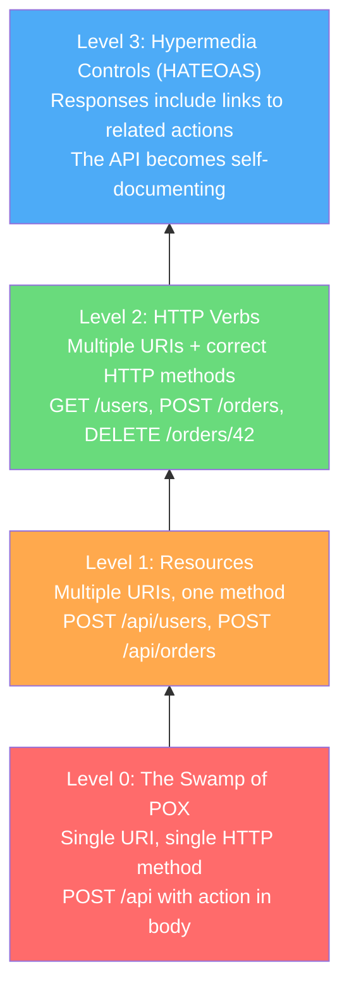

# REST API Best Practices

REST is not a protocol — it is an architectural style defined by Roy Fielding in his 2000 doctoral dissertation. Most APIs that call themselves "RESTful" implement a fraction of what Fielding described. This page covers what actually matters in production: the conventions, patterns, and design decisions that make a REST API intuitive, consistent, and evolvable.

## Resource-Oriented Design

REST thinks in **resources**, not actions. A resource is any concept your API exposes — a user, an order, an invoice, a deployment. Resources are nouns, never verbs.

### Naming Conventions

```
# Good — resources are nouns, collections are plural
GET    /api/users
GET    /api/users/42
GET    /api/users/42/orders
POST   /api/users/42/orders

# Bad — action-oriented, verb-based
GET    /api/getUser?id=42
POST   /api/createOrder
POST   /api/users/42/sendEmail
```

| Rule | Example | Rationale |
|------|---------|-----------|
| Use plural nouns for collections | `/users` not `/user` | `GET /users` returns a list; `GET /users/42` returns one item from that list |
| Use lowercase with hyphens | `/order-items` not `/orderItems` | URLs are case-insensitive in practice, hyphens are more readable |
| Nest to express relationships | `/users/42/orders` | Shows that orders belong to a user |
| Limit nesting to 2 levels | `/users/42/orders` not `/users/42/orders/7/items/3/reviews` | Deep nesting creates coupling and long URLs |
| Use query params for filtering | `/orders?status=shipped` | Keeps the resource path clean |

::: warning
Avoid nesting beyond two levels. If you need `/users/42/orders/7/items/3`, consider promoting `items` to a top-level resource: `GET /order-items/3`. Deep nesting couples your URL structure to your data model.
:::

### Singleton vs Collection Resources

```
GET /users              → Collection: returns array of users
GET /users/42           → Singleton: returns one user
GET /users/42/profile   → Singleton sub-resource (one-to-one relationship)
GET /users/42/orders    → Collection sub-resource (one-to-many relationship)
```

## HTTP Methods

Each HTTP method carries semantic meaning. Using them correctly enables caching, retry logic, and intermediary processing.

| Method | Semantics | Idempotent | Safe | Request Body |
|--------|-----------|:----------:|:----:|:------------:|
| `GET` | Read a resource | Yes | Yes | No |
| `POST` | Create a new resource | No | No | Yes |
| `PUT` | Replace a resource entirely | Yes | No | Yes |
| `PATCH` | Partially update a resource | No* | No | Yes |
| `DELETE` | Remove a resource | Yes | No | Optional |
| `HEAD` | Same as GET, no body | Yes | Yes | No |
| `OPTIONS` | Describe available methods | Yes | Yes | No |

*PATCH can be made idempotent with JSON Merge Patch (RFC 7396), but JSON Patch (RFC 6902) operations like "add to array" are not idempotent.

### PUT vs PATCH

```typescript
// PUT — replaces the entire resource
// Client must send ALL fields; missing fields are set to defaults
PUT /api/users/42
{
  "name": "Alice Chen",
  "email": "alice@example.com",
  "role": "admin",
  "preferences": { "theme": "dark", "locale": "en-US" }
}

// PATCH (JSON Merge Patch) — updates only specified fields
// Unmentioned fields remain unchanged
PATCH /api/users/42
Content-Type: application/merge-patch+json
{
  "role": "admin"
}
```

::: tip
In practice, most "update" operations should use `PATCH`, not `PUT`. True full-resource replacement is rare and error-prone — a consumer who forgets a field will accidentally null it out.
:::

### Idempotency in Practice

Idempotency means calling the same operation multiple times produces the same result. This is critical for reliability — when a network timeout occurs, the client can safely retry an idempotent request.

```typescript
// Idempotent: calling DELETE twice results in the same state
DELETE /api/orders/42   → 200 OK (order deleted)
DELETE /api/orders/42   → 404 Not Found (already deleted — same end state)

// Non-idempotent: calling POST twice creates duplicates
POST /api/orders { ... }  → 201 Created (order 100)
POST /api/orders { ... }  → 201 Created (order 101) ← duplicate!
```

To make `POST` idempotent, use an **idempotency key**:

```typescript
POST /api/orders
Idempotency-Key: txn_abc123def456
Content-Type: application/json

{ "product_id": "prod_99", "quantity": 2 }
```

The server stores the response keyed by `Idempotency-Key`. If the same key is sent again, the server returns the stored response without re-executing the operation.

## Richardson Maturity Model

Leonard Richardson defined four maturity levels for REST APIs. Most production APIs sit at Level 2.



### Level 2 is the Sweet Spot

Most APIs should target Level 2. It gives you the full benefit of HTTP semantics (caching, idempotency, intermediary processing) without the complexity of full HATEOAS.

### HATEOAS in Practice

HATEOAS (Hypermedia as the Engine of Application State) means responses include links that tell the consumer what actions are available next.

```json
{
  "id": "order_42",
  "status": "pending",
  "total": 99.99,
  "_links": {
    "self": { "href": "/api/orders/42" },
    "cancel": { "href": "/api/orders/42/cancel", "method": "POST" },
    "payment": { "href": "/api/orders/42/payment", "method": "POST" },
    "items": { "href": "/api/orders/42/items" }
  }
}
```

After the order is paid, the `cancel` and `payment` links disappear, and a `refund` link appears. The client does not need to know the business rules — the API tells it what is possible.

::: tip
HATEOAS is powerful but rarely implemented fully in practice. A pragmatic middle ground: include `self` links and links to related resources, but do not try to encode your entire state machine in hypermedia controls.
:::

## Status Codes

Use status codes correctly. They are the first thing consumers check and the primary mechanism for error handling.

### Success Codes

| Code | When to Use | Response Body |
|------|-------------|---------------|
| `200 OK` | Successful GET, PUT, PATCH, DELETE | The resource or result |
| `201 Created` | Successful POST that created a resource | The created resource + `Location` header |
| `202 Accepted` | Request accepted for async processing | Status endpoint URL or job ID |
| `204 No Content` | Successful DELETE or PUT with no body to return | Empty |

### Client Error Codes

| Code | When to Use |
|------|-------------|
| `400 Bad Request` | Malformed syntax, invalid JSON, validation errors |
| `401 Unauthorized` | Missing or invalid authentication credentials |
| `403 Forbidden` | Authenticated but not authorized for this action |
| `404 Not Found` | Resource does not exist |
| `405 Method Not Allowed` | HTTP method not supported for this resource |
| `409 Conflict` | State conflict (e.g., duplicate creation, version mismatch) |
| `422 Unprocessable Entity` | Syntactically valid but semantically invalid (validation failed) |
| `429 Too Many Requests` | [Rate limit](/system-design/api-design/api-security-patterns) exceeded |

### Server Error Codes

| Code | When to Use |
|------|-------------|
| `500 Internal Server Error` | Unexpected server failure |
| `502 Bad Gateway` | Upstream service returned invalid response |
| `503 Service Unavailable` | Server overloaded or in maintenance |
| `504 Gateway Timeout` | Upstream service timed out |

::: danger
Never return `200 OK` with an error message in the body. This breaks every HTTP client library, every monitoring tool, and every consumer's error handling logic. If something went wrong, use a 4xx or 5xx status code.
:::

## Error Response Design (RFC 7807)

RFC 7807 (Problem Details for HTTP APIs) defines a standard error format that is machine-readable and human-friendly.

```json
{
  "type": "https://api.example.com/errors/insufficient-funds",
  "title": "Insufficient Funds",
  "status": 422,
  "detail": "Account acc_123 has a balance of $10.00, but the transaction requires $25.00.",
  "instance": "/api/transactions/txn_456",
  "balance": 1000,
  "required": 2500,
  "currency": "USD"
}
```

| Field | Required | Purpose |
|-------|:--------:|---------|
| `type` | Yes | URI identifying the error type (can be a documentation link) |
| `title` | Yes | Short, human-readable summary |
| `status` | Yes | HTTP status code (repeated for convenience) |
| `detail` | No | Human-readable explanation specific to this occurrence |
| `instance` | No | URI identifying this specific error occurrence |
| *extensions* | No | Additional fields specific to the error type |

### Validation Errors

For validation errors, extend RFC 7807 with a structured `errors` array:

```json
{
  "type": "https://api.example.com/errors/validation-error",
  "title": "Validation Failed",
  "status": 422,
  "detail": "The request body contains 2 validation errors.",
  "errors": [
    {
      "field": "email",
      "code": "INVALID_FORMAT",
      "message": "Must be a valid email address"
    },
    {
      "field": "age",
      "code": "OUT_OF_RANGE",
      "message": "Must be between 18 and 120"
    }
  ]
}
```

::: tip
Always include both a machine-readable `code` (for programmatic handling) and a human-readable `message` (for display or logging) in validation errors. Consumers should never have to parse free-text messages to determine error types.
:::

## Filtering, Sorting, and Field Selection

### Filtering

Use query parameters for filtering. Keep the syntax simple and consistent.

```
GET /api/orders?status=shipped
GET /api/orders?status=shipped&created_after=2026-01-01
GET /api/orders?customer_id=42&status=pending,processing
GET /api/products?price_min=10&price_max=100
```

For complex filtering, consider a structured filter parameter:

```
GET /api/orders?filter[status]=shipped&filter[total_gte]=100
```

### Sorting

Use a `sort` parameter with field names. Prefix with `-` for descending order.

```
GET /api/orders?sort=-created_at              # Newest first
GET /api/orders?sort=status,-created_at       # By status asc, then date desc
```

### Field Selection

Let consumers request only the fields they need to reduce payload size.

```
GET /api/orders?fields=id,status,total
GET /api/orders?fields=id,status&expand=customer
```

### Resource Expansion

Instead of forcing consumers to make multiple requests, allow inline expansion of related resources.

```
# Without expansion — requires 2 requests
GET /api/orders/42           → { "customer_id": "cust_7", ... }
GET /api/customers/cust_7   → { "name": "Alice", ... }

# With expansion — single request
GET /api/orders/42?expand=customer
→ {
    "id": "order_42",
    "customer": { "id": "cust_7", "name": "Alice", "email": "alice@example.com" },
    ...
  }
```

::: warning
Limit expansion depth. Allowing `?expand=customer.orders.items.product.category` creates arbitrarily complex queries that can crush your database. Cap it at 1-2 levels.
:::

## Pagination

Every collection endpoint must be paginated. Returning unbounded result sets is a denial-of-service vulnerability waiting to happen.

See [Pagination Patterns](/system-design/api-design/pagination-patterns) for a deep dive on offset vs cursor vs keyset pagination.

Quick example of cursor-based pagination:

```json
{
  "data": [
    { "id": "order_100", "status": "shipped" },
    { "id": "order_99", "status": "pending" }
  ],
  "pagination": {
    "next_cursor": "eyJpZCI6Ijk5In0=",
    "has_more": true
  }
}
```

## Bulk Operations

When consumers need to operate on multiple resources at once, provide explicit bulk endpoints rather than forcing them to make N individual requests.

```typescript
// Bulk create
POST /api/orders/bulk
Content-Type: application/json

{
  "operations": [
    { "method": "create", "body": { "product_id": "prod_1", "quantity": 2 } },
    { "method": "create", "body": { "product_id": "prod_2", "quantity": 1 } }
  ]
}

// Response — per-item status
{
  "results": [
    { "index": 0, "status": 201, "body": { "id": "order_100" } },
    { "index": 1, "status": 422, "body": { "error": "Product prod_2 out of stock" } }
  ],
  "summary": { "succeeded": 1, "failed": 1 }
}
```

## Request and Response Headers

### Standard Request Headers

| Header | Purpose |
|--------|---------|
| `Accept: application/json` | Content negotiation |
| `Content-Type: application/json` | Request body format |
| `Authorization: Bearer <token>` | Authentication |
| `Idempotency-Key: <uuid>` | Safe retries for POST |
| `If-None-Match: <etag>` | Conditional GET (caching) |
| `If-Match: <etag>` | Optimistic concurrency control |

### Standard Response Headers

| Header | Purpose |
|--------|---------|
| `Content-Type: application/json` | Response body format |
| `Location: /api/orders/42` | URL of created resource (with 201) |
| `ETag: "abc123"` | Resource version for caching |
| `X-Request-Id: req_xyz` | Correlation ID for debugging |
| `X-RateLimit-Limit: 1000` | Rate limit ceiling |
| `X-RateLimit-Remaining: 999` | Remaining requests in window |
| `X-RateLimit-Reset: 1679961600` | When the window resets (Unix timestamp) |
| `Retry-After: 30` | Seconds to wait (with 429 or 503) |

## Versioning

Every API changes. How you handle those changes determines whether your consumers trust you or fear you.

See [API Versioning Strategies](/system-design/api-design/api-versioning) for the full treatment. The short version: use URL path versioning (`/v2/orders`) for simplicity, and maintain a clear deprecation policy.

## Content Negotiation

```
# Request JSON (default)
GET /api/orders/42
Accept: application/json

# Request CSV export
GET /api/orders
Accept: text/csv

# Request specific API version via media type
GET /api/orders/42
Accept: application/vnd.myapp.v2+json
```

## API Design Checklist

Use this checklist before shipping any new endpoint:

- [ ] Resource name is a plural noun
- [ ] HTTP method matches the operation semantics
- [ ] Success status code is correct (201 for creation, 204 for deletion, etc.)
- [ ] Error responses follow RFC 7807 format
- [ ] Validation errors include field-level detail
- [ ] Collection endpoints are paginated
- [ ] Sensitive data is not leaked in responses
- [ ] Idempotency key is supported for non-idempotent operations
- [ ] Rate limiting headers are included
- [ ] OpenAPI spec is updated

## Further Reading

- [API Versioning Strategies](/system-design/api-design/api-versioning) — how to evolve your API without breaking consumers
- [OpenAPI & Swagger](/system-design/api-design/openapi-swagger) — formalizing your API contract
- [Pagination Patterns](/system-design/api-design/pagination-patterns) — choosing the right pagination strategy
- [API Security Patterns](/system-design/api-design/api-security-patterns) — authentication, rate limiting, and abuse prevention
- [Webhooks](/system-design/api-design/webhooks) — push-based event delivery
- [Caching](/system-design/caching/) — HTTP caching, ETags, and cache-control headers
