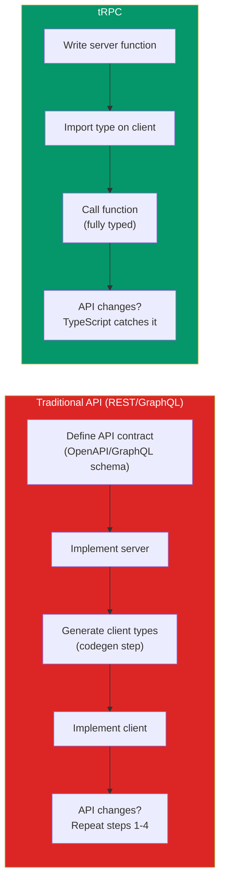
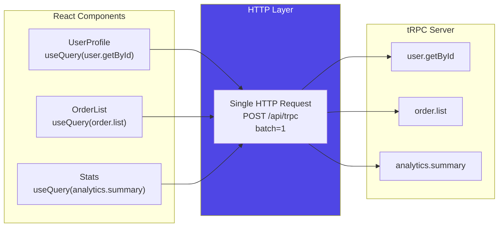
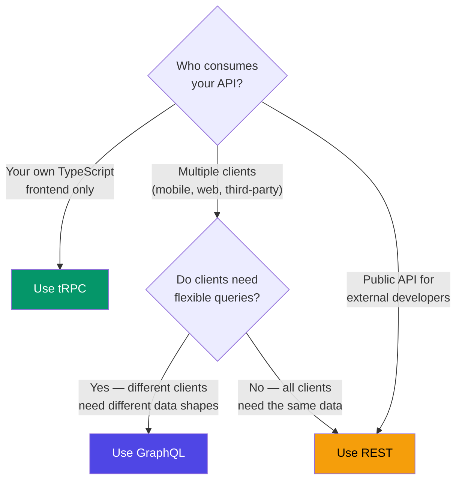

# tRPC End-to-End Type Safety

tRPC is a framework for building type-safe APIs without code generation, schema definitions, or runtime overhead. In a traditional API, the client and server communicate through a contract — an OpenAPI spec, a GraphQL schema, or an informal agreement about what JSON shapes look like. tRPC eliminates that contract entirely. The server defines procedures (functions), and the client calls them directly with full TypeScript inference. Change a function's return type on the server, and every client call that uses it shows a type error immediately — no build step, no code generation, no runtime validation failures in production.

This page covers the complete tRPC architecture: how it works under the hood, how to structure routers and procedures, how it integrates with React Query, how to handle real-time subscriptions, and when to choose tRPC over REST or GraphQL.

## Why tRPC Exists

Consider the traditional API development workflow:



The problem tRPC solves: in a TypeScript monorepo (or any setup where client and server share types), maintaining a separate API contract is redundant work. The server already knows the types. The client already uses TypeScript. Why not just share the types directly?

::: tip The Key Insight
tRPC does not transmit types over the network. It transmits plain JSON over HTTP, just like any REST API. The types are shared at build time through TypeScript imports. At runtime, tRPC is just HTTP requests and JSON responses.
:::

## Core Concepts

### The Router

A tRPC router is a collection of procedures (endpoints). Routers can be nested to create namespaces:

```typescript
// server/trpc.ts — Initialize tRPC
import { initTRPC, TRPCError } from '@trpc/server';
import { z } from 'zod';

// Context type — available in every procedure
interface Context {
  db: Database;
  user: User | null;
}

const t = initTRPC.context<Context>().create();

export const router = t.router;
export const publicProcedure = t.procedure;
export const protectedProcedure = t.procedure.use(async ({ ctx, next }) => {
  if (!ctx.user) {
    throw new TRPCError({ code: 'UNAUTHORIZED' });
  }
  return next({ ctx: { ...ctx, user: ctx.user } });
});
```

### Procedures

Procedures are the individual endpoints in a tRPC API. There are three types:

```typescript
// server/routers/user.ts
import { z } from 'zod';
import { router, publicProcedure, protectedProcedure } from '../trpc';

export const userRouter = router({
  // QUERY — read data (maps to HTTP GET)
  getById: publicProcedure
    .input(z.object({ id: z.string().uuid() }))
    .query(async ({ input, ctx }) => {
      const user = await ctx.db.users.findById(input.id);
      if (!user) {
        throw new TRPCError({
          code: 'NOT_FOUND',
          message: `User ${input.id} not found`,
        });
      }
      return user;
    }),

  // MUTATION — write data (maps to HTTP POST)
  create: protectedProcedure
    .input(z.object({
      name: z.string().min(2).max(100),
      email: z.string().email(),
      role: z.enum(['user', 'admin']).default('user'),
    }))
    .mutation(async ({ input, ctx }) => {
      return ctx.db.users.create({
        ...input,
        createdBy: ctx.user.id,
      });
    }),

  // MUTATION with output validation
  updateProfile: protectedProcedure
    .input(z.object({
      name: z.string().min(2).optional(),
      bio: z.string().max(500).optional(),
    }))
    .output(z.object({
      id: z.string(),
      name: z.string(),
      bio: z.string().nullable(),
      updatedAt: z.date(),
    }))
    .mutation(async ({ input, ctx }) => {
      return ctx.db.users.update(ctx.user.id, input);
    }),

  // QUERY with complex input
  list: publicProcedure
    .input(z.object({
      page: z.number().int().positive().default(1),
      limit: z.number().int().min(1).max(100).default(20),
      search: z.string().optional(),
      role: z.enum(['user', 'admin']).optional(),
    }))
    .query(async ({ input, ctx }) => {
      const { page, limit, search, role } = input;
      const offset = (page - 1) * limit;

      const [users, total] = await Promise.all([
        ctx.db.users.findMany({ search, role, limit, offset }),
        ctx.db.users.count({ search, role }),
      ]);

      return {
        users,
        pagination: {
          page,
          limit,
          total,
          totalPages: Math.ceil(total / limit),
        },
      };
    }),
});
```

### The App Router (Root Router)

```typescript
// server/routers/_app.ts
import { router } from '../trpc';
import { userRouter } from './user';
import { orderRouter } from './order';
import { productRouter } from './product';
import { analyticsRouter } from './analytics';

export const appRouter = router({
  user: userRouter,
  order: orderRouter,
  product: productRouter,
  analytics: analyticsRouter,
});

// Export the type — this is what the client imports
export type AppRouter = typeof appRouter;
```

### Context

The context is created per-request and provides shared resources (database connections, authenticated user, etc.) to all procedures:

```typescript
// server/context.ts
import type { CreateNextContextOptions } from '@trpc/server/adapters/next';
import { getSession } from 'next-auth/react';
import { db } from './database';

export async function createContext({ req, res }: CreateNextContextOptions) {
  const session = await getSession({ req });

  return {
    db,
    user: session?.user ?? null,
    req,
    res,
  };
}

export type Context = Awaited<ReturnType<typeof createContext>>;
```

## Middleware

tRPC middleware is composable and type-safe. Each middleware can modify the context before passing it to the next middleware or the procedure:

```typescript
import { TRPCError } from '@trpc/server';

// Logging middleware
const loggerMiddleware = t.middleware(async ({ path, type, next }) => {
  const start = Date.now();
  const result = await next();
  const duration = Date.now() - start;

  console.log(`${type} ${path} — ${duration}ms`);
  return result;
});

// Rate limiting middleware
const rateLimitMiddleware = t.middleware(async ({ ctx, next }) => {
  const key = ctx.user?.id ?? ctx.req.ip;
  const allowed = await ctx.rateLimiter.check(key);

  if (!allowed) {
    throw new TRPCError({
      code: 'TOO_MANY_REQUESTS',
      message: 'Rate limit exceeded',
    });
  }

  return next();
});

// Compose middleware into reusable procedures
const rateLimitedProcedure = protectedProcedure
  .use(loggerMiddleware)
  .use(rateLimitMiddleware);

// Use in routes
export const paymentRouter = router({
  charge: rateLimitedProcedure
    .input(z.object({ amount: z.number().positive() }))
    .mutation(async ({ input, ctx }) => {
      return processPayment(ctx.user.id, input.amount);
    }),
});
```

## React Query Integration

tRPC's React integration is built on top of TanStack React Query. Every tRPC query maps to a React Query query, and every mutation maps to a React Query mutation. You get all of React Query's features — caching, deduplication, background refetching, optimistic updates — with full type safety.

### Setup

```typescript
// utils/trpc.ts (client-side)
import { createTRPCReact } from '@trpc/react-query';
import type { AppRouter } from '../server/routers/_app';

export const trpc = createTRPCReact<AppRouter>();
```

```tsx
// app/providers.tsx
'use client';

import { QueryClient, QueryClientProvider } from '@tanstack/react-query';
import { httpBatchLink } from '@trpc/client';
import { trpc } from '@/utils/trpc';
import { useState } from 'react';

export function TRPCProvider({ children }: { children: React.ReactNode }) {
  const [queryClient] = useState(() => new QueryClient());
  const [trpcClient] = useState(() =>
    trpc.createClient({
      links: [
        httpBatchLink({
          url: '/api/trpc',
          headers() {
            return {
              // Add auth headers, etc.
            };
          },
        }),
      ],
    })
  );

  return (
    <trpc.Provider client={trpcClient} queryClient={queryClient}>
      <QueryClientProvider client={queryClient}>
        {children}
      </QueryClientProvider>
    </trpc.Provider>
  );
}
```

### Using Queries and Mutations

```tsx
'use client';

import { trpc } from '@/utils/trpc';

export function UserList() {
  // Fully typed — hover over `data` to see the exact return type
  const { data, isLoading, error } = trpc.user.list.useQuery({
    page: 1,
    limit: 20,
  });

  const createUser = trpc.user.create.useMutation({
    onSuccess: () => {
      // Invalidate the user list query to trigger a refetch
      utils.user.list.invalidate();
    },
    onError: (error) => {
      // error.message is typed
      console.error('Failed to create user:', error.message);
    },
  });

  const utils = trpc.useUtils();

  if (isLoading) return <div>Loading...</div>;
  if (error) return <div>Error: {error.message}</div>;

  return (
    <div>
      <ul>
        {data.users.map(user => (
          <li key={user.id}>{user.name} — {user.email}</li>
        ))}
      </ul>

      <p>
        Page {data.pagination.page} of {data.pagination.totalPages}
      </p>

      <button
        onClick={() => createUser.mutate({
          name: 'New User',
          email: 'new@example.com',
        })}
        disabled={createUser.isPending}
      >
        {createUser.isPending ? 'Creating...' : 'Add User'}
      </button>
    </div>
  );
}
```

### Optimistic Updates

```tsx
const updateUser = trpc.user.updateProfile.useMutation({
  onMutate: async (newData) => {
    // Cancel outgoing queries
    await utils.user.getById.cancel({ id: userId });

    // Snapshot the previous value
    const previousUser = utils.user.getById.getData({ id: userId });

    // Optimistically update
    utils.user.getById.setData({ id: userId }, (old) => ({
      ...old!,
      ...newData,
    }));

    return { previousUser };
  },
  onError: (err, newData, context) => {
    // Rollback on error
    utils.user.getById.setData(
      { id: userId },
      context?.previousUser
    );
  },
  onSettled: () => {
    // Refetch to ensure consistency
    utils.user.getById.invalidate({ id: userId });
  },
});
```

### Request Batching

tRPC automatically batches multiple queries made in the same render cycle into a single HTTP request:



## Subscriptions with WebSockets

tRPC supports real-time subscriptions through WebSockets:

```typescript
// server/routers/chat.ts
import { observable } from '@trpc/server/observable';
import { EventEmitter } from 'events';

const ee = new EventEmitter();

export const chatRouter = router({
  sendMessage: protectedProcedure
    .input(z.object({
      channelId: z.string(),
      content: z.string().min(1).max(2000),
    }))
    .mutation(async ({ input, ctx }) => {
      const message = {
        id: crypto.randomUUID(),
        channelId: input.channelId,
        content: input.content,
        author: ctx.user.name,
        createdAt: new Date(),
      };

      await ctx.db.messages.create(message);
      ee.emit(`channel:${input.channelId}`, message);

      return message;
    }),

  // SUBSCRIPTION — real-time updates via WebSocket
  onMessage: protectedProcedure
    .input(z.object({ channelId: z.string() }))
    .subscription(({ input }) => {
      return observable<Message>((emit) => {
        const handler = (message: Message) => {
          emit.next(message);
        };

        ee.on(`channel:${input.channelId}`, handler);

        // Cleanup when client disconnects
        return () => {
          ee.off(`channel:${input.channelId}`, handler);
        };
      });
    }),
});
```

```tsx
// Client-side subscription usage
'use client';

import { trpc } from '@/utils/trpc';

export function ChatRoom({ channelId }: { channelId: string }) {
  const [messages, setMessages] = useState<Message[]>([]);

  trpc.chat.onMessage.useSubscription(
    { channelId },
    {
      onData: (message) => {
        setMessages(prev => [...prev, message]);
      },
      onError: (err) => {
        console.error('Subscription error:', err);
      },
    }
  );

  const sendMessage = trpc.chat.sendMessage.useMutation();

  return (
    <div>
      {messages.map(msg => (
        <div key={msg.id}>
          <strong>{msg.author}:</strong> {msg.content}
        </div>
      ))}
      <ChatInput onSend={(content) =>
        sendMessage.mutate({ channelId, content })
      } />
    </div>
  );
}
```

## tRPC vs REST vs GraphQL

| Dimension | REST | GraphQL | tRPC |
|-----------|------|---------|------|
| Type safety | Manual (OpenAPI + codegen) | Schema + codegen | Automatic (TypeScript inference) |
| Overfetching | Common problem | Solved by design | N/A (you control the query function) |
| Learning curve | Low | High (SDL, resolvers, fragments) | Low (just TypeScript functions) |
| Tooling | Postman, curl, browser | GraphiQL, Apollo DevTools | tRPC DevTools, React Query DevTools |
| Caching | HTTP caching (ETags, Cache-Control) | Complex (Apollo normalized cache) | React Query cache |
| File uploads | Native multipart | Requires extensions | Via separate route handler |
| Public APIs | Standard | Excellent for diverse clients | Not designed for public APIs |
| Multi-language clients | Any language | Any language | TypeScript only |
| Real-time | WebSockets (separate) | Subscriptions (built-in) | Subscriptions (built-in) |
| Bundle size | 0 (fetch) | ~30KB (client library) | ~5KB (client) |

### When to Use Each



::: warning tRPC Is Not for Public APIs
tRPC requires the client and server to share TypeScript types. If you are building a public API for external developers who may use Python, Go, or Ruby, tRPC is the wrong choice. Use REST with OpenAPI or GraphQL with a published schema.
:::

## Monorepo Setup

tRPC shines in monorepos where the client and server share a TypeScript project. Here is a typical structure:

```
my-app/
├── packages/
│   ├── api/                    # tRPC server
│   │   ├── src/
│   │   │   ├── routers/
│   │   │   │   ├── _app.ts    # Root router
│   │   │   │   ├── user.ts
│   │   │   │   └── order.ts
│   │   │   ├── trpc.ts        # tRPC initialization
│   │   │   └── context.ts     # Context creation
│   │   ├── package.json
│   │   └── tsconfig.json
│   └── shared/                 # Shared types and utilities
│       ├── src/
│       │   ├── types.ts
│       │   └── validators.ts  # Shared Zod schemas
│       └── package.json
├── apps/
│   ├── web/                    # Next.js frontend
│   │   ├── src/
│   │   │   ├── utils/trpc.ts  # tRPC client setup
│   │   │   └── app/
│   │   └── package.json
│   └── mobile/                 # React Native (also uses tRPC)
│       └── package.json
├── package.json                # Workspace root
└── turbo.json                  # Turborepo config
```

### Workspace Configuration

```json
// packages/api/package.json
{
  "name": "@myapp/api",
  "main": "src/routers/_app.ts",
  "types": "src/routers/_app.ts",
  "exports": {
    ".": "./src/routers/_app.ts",
    "./context": "./src/context.ts"
  }
}
```

```typescript
// apps/web/src/utils/trpc.ts
import { createTRPCReact } from '@trpc/react-query';
// Import the TYPE only — no server code is bundled into the client
import type { AppRouter } from '@myapp/api';

export const trpc = createTRPCReact<AppRouter>();
```

::: tip Type-Only Imports
The `import type` ensures that only the TypeScript types are imported — no server code, no database drivers, no secrets. The resulting client bundle contains zero server-side code.
:::

## Error Handling

tRPC has a structured error system that maps to HTTP status codes:

```typescript
import { TRPCError } from '@trpc/server';

// Error codes map to HTTP status codes
const errorMap = {
  BAD_REQUEST:          400,
  UNAUTHORIZED:         401,
  FORBIDDEN:            403,
  NOT_FOUND:            404,
  TIMEOUT:              408,
  CONFLICT:             409,
  PRECONDITION_FAILED:  412,
  PAYLOAD_TOO_LARGE:    413,
  METHOD_NOT_SUPPORTED: 405,
  UNPROCESSABLE_CONTENT: 422,
  TOO_MANY_REQUESTS:    429,
  CLIENT_CLOSED_REQUEST: 499,
  INTERNAL_SERVER_ERROR: 500,
};

// Throwing errors in procedures
export const orderRouter = router({
  cancel: protectedProcedure
    .input(z.object({ orderId: z.string() }))
    .mutation(async ({ input, ctx }) => {
      const order = await ctx.db.orders.findById(input.orderId);

      if (!order) {
        throw new TRPCError({
          code: 'NOT_FOUND',
          message: `Order ${input.orderId} does not exist`,
        });
      }

      if (order.userId !== ctx.user.id) {
        throw new TRPCError({
          code: 'FORBIDDEN',
          message: 'You can only cancel your own orders',
        });
      }

      if (order.status === 'shipped') {
        throw new TRPCError({
          code: 'PRECONDITION_FAILED',
          message: 'Cannot cancel a shipped order',
        });
      }

      return ctx.db.orders.update(input.orderId, { status: 'cancelled' });
    }),
});
```

## Testing

tRPC procedures can be tested directly without starting an HTTP server:

```typescript
import { createCallerFactory } from '@trpc/server';
import { appRouter } from './routers/_app';

const createCaller = createCallerFactory(appRouter);

describe('User Router', () => {
  it('should create a user', async () => {
    const caller = createCaller({
      db: mockDb,
      user: { id: '1', name: 'Admin', role: 'admin' },
    });

    const result = await caller.user.create({
      name: 'Test User',
      email: 'test@example.com',
    });

    expect(result.name).toBe('Test User');
    expect(result.email).toBe('test@example.com');
  });

  it('should throw UNAUTHORIZED for unauthenticated users', async () => {
    const caller = createCaller({
      db: mockDb,
      user: null, // not authenticated
    });

    await expect(
      caller.user.create({ name: 'Test', email: 'test@example.com' })
    ).rejects.toThrow('UNAUTHORIZED');
  });
});
```

## Cross-References

- [TypeScript Advanced Patterns](/infrastructure/languages/typescript-advanced) — generics and type inference
- [REST Best Practices](/system-design/api-design/rest-best-practices) — alternative API architecture
- [GraphQL Advanced](/system-design/api-design/graphql-advanced) — alternative for flexible queries
- [Next.js Patterns](/infrastructure/languages/nextjs-patterns) — tRPC integration with Next.js
- [API Security Patterns](/system-design/api-design/api-security-patterns) — securing your API layer

## Summary

| Concept | Purpose |
|---------|---------|
| Router | Namespace for grouping procedures |
| Procedure | Individual endpoint (query, mutation, subscription) |
| Context | Per-request state (db, user, etc.) |
| Middleware | Composable pre-processing (auth, logging, rate limiting) |
| Type Provider | `import type { AppRouter }` — shares types without code |
| Batching | Multiple queries in one HTTP request |
| Subscriptions | Real-time updates via WebSocket |

tRPC is not a replacement for REST or GraphQL. It is a specialized tool for a specific scenario: TypeScript frontends consuming TypeScript backends. In that scenario, it eliminates an entire category of bugs (type mismatches between client and server) and an entire category of work (API contract maintenance, code generation). If your frontend and backend both speak TypeScript, there is no faster path to a type-safe, production-ready API.
