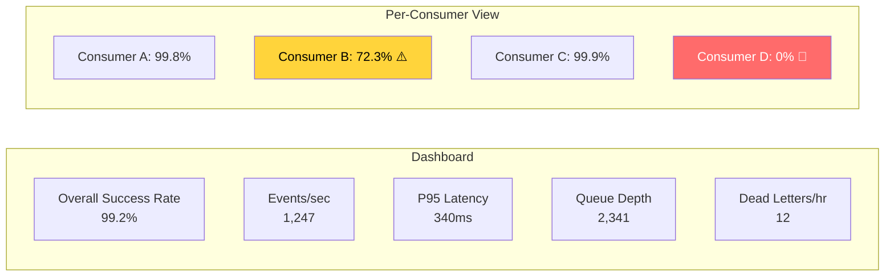
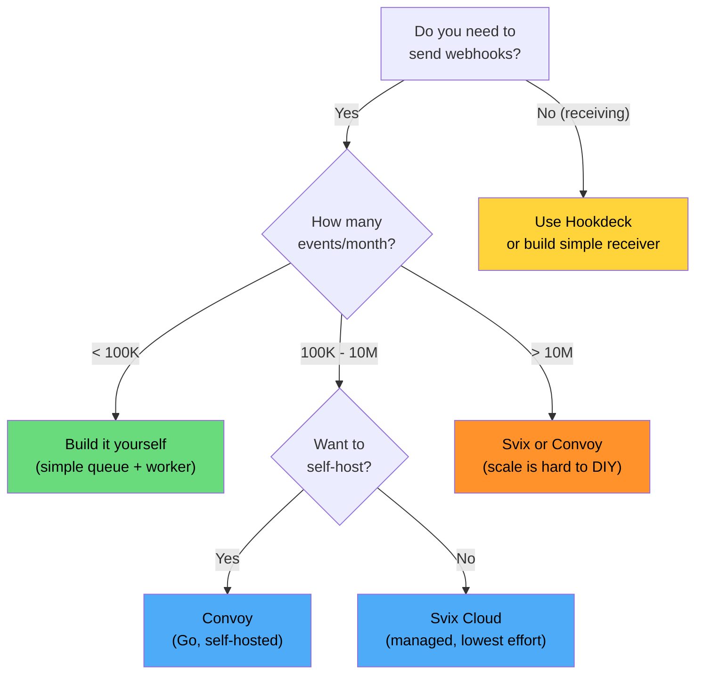

# Webhook Infrastructure at Scale

The [Webhook Design Patterns](/system-design/api-design/webhooks) page covers the fundamentals — payload design, signatures, and retry logic. This page goes deeper: building webhook infrastructure that reliably delivers millions of events per day, handles consumer failures gracefully, provides operational visibility, and scales horizontally.

If you are deciding whether to build or buy, we also compare the three leading webhook-as-a-service platforms: Svix, Convoy, and Hookdeck.

---

## The Scale of the Problem

When you send a few hundred webhooks per day, everything works. When you send millions, every edge case becomes a daily occurrence:

| Failure Mode | Frequency at Scale | Impact |
|-------------|-------------------|--------|
| Consumer returns 500 | Hundreds per hour | Retry backlog grows |
| Consumer is down for hours | Weekly | Millions of retries queued |
| Consumer is permanently gone | Monthly | Dead letter queue fills up |
| DNS resolution fails | Daily | Transient delivery failures |
| TLS certificate expired | Monthly | Cannot connect to consumer |
| Consumer is slow (> 30s) | Thousands per day | Ties up worker threads |
| Consumer returns 200 but does not process | Unknown | Silent data loss |
| Network partition | Quarterly | Entire regions lose connectivity |
| Your outage sends burst on recovery | Quarterly | Thundering herd to consumers |

---

## Architecture for Reliable Delivery

```mermaid
graph TD
    subgraph "Event Production"
        APP[Application] -->|emit event| EB[Event Bus\nKafka / SQS]
    end

    subgraph "Webhook Service"
        EB --> DISP[Dispatcher\nFetch subscriptions]
        DISP --> SIGN[Signer\nHMAC-SHA256]
        SIGN --> DLVR[Delivery Workers\n(HTTP POST)]
    end

    subgraph "Delivery Infrastructure"
        DLVR --> CONS{Consumer\nResponse?}
        CONS -->|2xx| LOG[Log success]
        CONS -->|4xx client error| DLQ1["Dead Letter\n(do not retry)"]
        CONS -->|5xx / timeout| RETRY[Retry Queue\n(exponential backoff)"]
        RETRY --> DLVR
        RETRY -->|max retries| DLQ2[Dead Letter Queue]
    end

    subgraph "Operations"
        LOG --> DASH[Dashboard\nDelivery metrics]
        DLQ1 --> DASH
        DLQ2 --> DASH
        DASH --> ALERT[Alerting]
    end

    style DLQ1 fill:#ff6b6b,color:#fff
    style DLQ2 fill:#ff6b6b,color:#fff
    style LOG fill:#69db7c,color:#000
```

### Key Design Decisions

| Decision | Recommendation | Why |
|----------|---------------|-----|
| **Queue technology** | Kafka or SQS with DLQ | Durability, at-least-once, built-in retry |
| **Worker pool** | Dedicated per-consumer pools | One slow consumer cannot block others |
| **Timeout** | 30 seconds max | Prevent thread exhaustion |
| **Max retries** | 5-8 attempts over 24-48 hours | Balance reliability vs resource waste |
| **Idempotency** | Include event ID, advise consumers to deduplicate | At-least-once delivery means duplicates |
| **Ordering** | Best-effort (not guaranteed) | Strict ordering is extremely expensive |

---

## Retry Strategy

### Exponential Backoff with Jitter

```python
import random
import time

def compute_retry_delay(attempt: int, base_delay: int = 30) -> int:
    """
    Exponential backoff with full jitter.

    Attempt 1: 0-60s    (random within 0 to 2*base)
    Attempt 2: 0-120s
    Attempt 3: 0-240s
    Attempt 4: 0-480s
    Attempt 5: 0-960s   (~16 min max)
    Attempt 6: 0-1920s  (~32 min max)
    Attempt 7: 0-3600s  (capped at 1 hour)
    """
    max_delay = min(base_delay * (2 ** attempt), 3600)  # Cap at 1 hour
    return random.randint(0, max_delay)

# Retry schedule (expected values with jitter):
# Attempt 1:  ~30 seconds later
# Attempt 2:  ~1 minute later
# Attempt 3:  ~2 minutes later
# Attempt 4:  ~4 minutes later
# Attempt 5:  ~8 minutes later
# Attempt 6:  ~16 minutes later
# Attempt 7:  ~30 minutes later
# Attempt 8:  ~1 hour later
# Total span: ~2 hours (but up to 24 hours with variance)
```

::: tip
Full jitter (random between 0 and max) is better than equal jitter (delay/2 + random(delay/2)). It provides better spread and reduces the chance of correlated retries across consumers. See [AWS Architecture Blog's analysis](https://aws.amazon.com/blogs/architecture/exponential-backoff-and-jitter/) for the math.
:::

### Retry Response Code Handling

| Response | Action | Reasoning |
|----------|--------|-----------|
| **2xx** | Success, log, move on | Consumer accepted the event |
| **301/302** | Follow redirect once | Consumer moved; update endpoint if permanent |
| **400** | Dead letter, do NOT retry | Payload is malformed — retrying will not fix it |
| **401/403** | Dead letter, alert consumer | Auth issue — consumer needs to fix credentials |
| **404** | Dead letter after 3 attempts | Endpoint may not exist yet (race condition) |
| **408** | Retry | Request timeout, likely transient |
| **410** | Dead letter, disable endpoint | Consumer explicitly says "gone" |
| **429** | Retry with `Retry-After` header | Consumer is rate limiting you |
| **500/502/503** | Retry with backoff | Server error, likely transient |
| **Connection refused** | Retry with backoff | Consumer is down |
| **DNS failure** | Retry with backoff | DNS is likely transient |
| **TLS error** | Retry 2x, then dead letter + alert | Certificate issue — consumer needs to fix |

```python
class WebhookDeliveryWorker:
    def deliver(self, event, endpoint):
        try:
            response = httpx.post(
                endpoint.url,
                json=event.payload,
                headers=self.build_headers(event, endpoint),
                timeout=httpx.Timeout(
                    connect=5.0,
                    read=25.0,
                    write=5.0,
                    pool=5.0
                ),
            )

            if response.status_code < 300:
                self.mark_success(event, endpoint, response)
                return

            if response.status_code in (400, 401, 403, 410):
                self.dead_letter(event, endpoint, response,
                               reason=f"Client error: {response.status_code}")
                if response.status_code == 410:
                    self.disable_endpoint(endpoint)
                return

            if response.status_code == 429:
                retry_after = int(response.headers.get('Retry-After', 60))
                self.schedule_retry(event, endpoint, delay=retry_after)
                return

            # 5xx — retry with backoff
            self.schedule_retry(event, endpoint)

        except httpx.ConnectError:
            self.schedule_retry(event, endpoint)
        except httpx.TimeoutException:
            self.schedule_retry(event, endpoint)
        except ssl.SSLError:
            if event.attempt < 2:
                self.schedule_retry(event, endpoint)
            else:
                self.dead_letter(event, endpoint, reason="TLS error")
                self.alert_consumer(endpoint, "TLS certificate issue")
```

---

## Consumer Isolation

The most critical design requirement: **one slow or failing consumer must not affect delivery to others**.

### Per-Consumer Queue Architecture

```mermaid
graph TD
    EB[Event Bus] --> FAN[Fan-Out\nService]
    FAN --> Q1[Queue: Consumer A]
    FAN --> Q2[Queue: Consumer B]
    FAN --> Q3[Queue: Consumer C]

    Q1 --> W1[Worker Pool A\n(3 workers)]
    Q2 --> W2[Worker Pool B\n(3 workers)]
    Q3 --> W3[Worker Pool C\n(3 workers)]

    W1 --> CA[Consumer A\nHealthy]
    W2 --> CB[Consumer B\nDown - retrying]
    W3 --> CC[Consumer C\nHealthy]

    style CB fill:#ff6b6b,color:#fff
    style CA fill:#69db7c,color:#000
    style CC fill:#69db7c,color:#000
```

```python
class WebhookDispatcher:
    """Fan out events to per-consumer queues."""

    def dispatch(self, event):
        # Find all subscriptions for this event type
        subscriptions = self.subscription_store.get_active(
            event_type=event.type
        )

        for sub in subscriptions:
            # Each consumer gets its own queue
            queue_name = f"webhook-delivery-{sub.endpoint_id}"

            self.queue.enqueue(
                queue_name,
                {
                    'event_id': event.id,
                    'endpoint_id': sub.endpoint_id,
                    'payload': event.payload,
                    'attempt': 0,
                    'max_attempts': sub.max_retries or 8,
                }
            )

    def get_consumer_health(self, endpoint_id):
        """Track per-consumer delivery health."""
        recent = self.delivery_log.get_recent(endpoint_id, count=100)

        success_rate = sum(1 for d in recent if d.success) / len(recent)
        avg_latency = sum(d.latency_ms for d in recent) / len(recent)

        return {
            'success_rate': success_rate,
            'avg_latency_ms': avg_latency,
            'consecutive_failures': self.count_consecutive_failures(endpoint_id),
        }
```

### Circuit Breaker for Endpoints

When a consumer is persistently failing, stop hammering it:

```python
class EndpointCircuitBreaker:
    """Circuit breaker per consumer endpoint."""

    CLOSED = 'closed'       # Normal operation
    OPEN = 'open'           # Endpoint is down, stop sending
    HALF_OPEN = 'half_open' # Testing if endpoint recovered

    def __init__(self, failure_threshold=10, recovery_time=300):
        self.failure_threshold = failure_threshold
        self.recovery_time = recovery_time  # seconds
        self.state = self.CLOSED
        self.failure_count = 0
        self.last_failure_time = None

    def should_attempt(self) -> bool:
        if self.state == self.CLOSED:
            return True

        if self.state == self.OPEN:
            # Check if recovery period has passed
            if time.time() - self.last_failure_time > self.recovery_time:
                self.state = self.HALF_OPEN
                return True  # Allow one test request
            return False

        if self.state == self.HALF_OPEN:
            return True  # Already in test mode

    def record_success(self):
        self.failure_count = 0
        self.state = self.CLOSED

    def record_failure(self):
        self.failure_count += 1
        self.last_failure_time = time.time()

        if self.failure_count >= self.failure_threshold:
            self.state = self.OPEN
```

::: warning
When the circuit breaker opens, you must still queue events — do not drop them. Queue events with a future delivery time (after the circuit breaker recovery window). When the breaker transitions to half-open, deliver the oldest queued event as a test. If it succeeds, drain the queue.
:::

---

## Signature Verification

### Standard Webhook Signature (Svix-Compatible)

```python
import hashlib
import hmac
import time

class WebhookSigner:
    """Generate and verify webhook signatures using the Standard Webhooks spec."""

    def sign(self, payload: str, secret: str) -> dict:
        msg_id = generate_uuid()
        timestamp = str(int(time.time()))

        # Sign: timestamp.payload
        to_sign = f"{msg_id}.{timestamp}.{payload}"
        signature = hmac.new(
            secret.encode(),
            to_sign.encode(),
            hashlib.sha256
        ).hexdigest()

        return {
            'webhook-id': msg_id,
            'webhook-timestamp': timestamp,
            'webhook-signature': f"v1,{signature}",
        }

    def verify(self, payload: str, headers: dict, secret: str,
               tolerance_seconds: int = 300) -> bool:
        msg_id = headers['webhook-id']
        timestamp = headers['webhook-timestamp']
        expected_sig = headers['webhook-signature']

        # Check timestamp tolerance (prevent replay attacks)
        ts = int(timestamp)
        if abs(time.time() - ts) > tolerance_seconds:
            raise ValueError("Timestamp too old or too far in the future")

        # Compute expected signature
        to_sign = f"{msg_id}.{timestamp}.{payload}"
        computed = hmac.new(
            secret.encode(),
            to_sign.encode(),
            hashlib.sha256
        ).hexdigest()

        expected = expected_sig.split(',')[1]  # Remove "v1," prefix
        return hmac.compare_digest(computed, expected)
```

### Key Rotation

```python
class SecretRotation:
    """Support two active signing secrets during rotation."""

    def sign_with_current(self, payload, endpoint):
        # Always sign with the current (newest) secret
        current_secret = endpoint.signing_secrets[-1]
        return self.signer.sign(payload, current_secret)

    def verify_with_any(self, payload, headers, endpoint):
        # Accept signatures from any active secret
        for secret in endpoint.signing_secrets:
            try:
                if self.signer.verify(payload, headers, secret):
                    return True
            except Exception:
                continue
        return False

    def rotate_secret(self, endpoint):
        new_secret = generate_secret()
        endpoint.signing_secrets.append(new_secret)

        # Keep only last 2 secrets
        if len(endpoint.signing_secrets) > 2:
            endpoint.signing_secrets = endpoint.signing_secrets[-2:]

        # Notify consumer of new secret via API/dashboard
        self.notify_consumer(endpoint, new_secret)
```

---

## Event Ordering

Strict ordering is expensive and usually unnecessary. Here is the spectrum:

| Ordering Level | Implementation | Cost |
|---------------|---------------|------|
| **No ordering** | Parallel delivery, fastest wins | Lowest |
| **Best-effort** | FIFO queue per consumer, but retries may reorder | Low |
| **Per-entity** | Partition by entity ID, sequential within partition | Medium |
| **Strict global** | Single sequential queue per consumer | Very high |

```python
class OrderedDelivery:
    """Per-entity ordering: events for the same entity are delivered in order."""

    def enqueue(self, event, endpoint):
        entity_key = event.payload.get('entity_id', event.id)

        # Partition key ensures same entity goes to same queue partition
        self.queue.enqueue(
            queue=f"webhook-{endpoint.id}",
            message=event,
            partition_key=entity_key
        )

    def process(self, endpoint_id, partition):
        """Process events for one entity sequentially."""
        while event := self.queue.peek(endpoint_id, partition):
            success = self.deliver(event, endpoint_id)

            if success:
                self.queue.ack(event)
            else:
                # Block this partition until retry succeeds
                # Other partitions (other entities) continue independently
                delay = compute_retry_delay(event.attempt)
                self.queue.requeue(event, delay=delay)
                break  # Stop processing this partition
```

::: tip
Per-entity ordering is the sweet spot: events for `order_123` arrive in order (created → paid → shipped), but `order_123` and `order_456` are independent and can be delivered in parallel. This matches most consumers' expectations without the performance cost of global ordering.
:::

---

## Monitoring and Observability

### Delivery Dashboard Metrics

| Metric | Computation | Alert Threshold |
|--------|------------|----------------|
| **Delivery success rate** | Successful / total attempts | < 95% (15-min window) |
| **Delivery latency P95** | Time from event to successful delivery | > 5 seconds |
| **Retry rate** | Retried events / total events | > 10% |
| **Dead letter rate** | Dead-lettered / total events | > 1% |
| **Queue depth** | Pending events across all consumer queues | > 100K |
| **Consumer success rate** | Per-consumer delivery success | < 80% per consumer |
| **Event lag** | Oldest undelivered event age | > 1 hour |



### Consumer Health Notifications

When a consumer's endpoint is failing, proactively notify them:

```python
class ConsumerHealthNotifier:
    def check_and_notify(self, endpoint):
        health = self.get_consumer_health(endpoint.id)

        if health['consecutive_failures'] >= 50:
            # Email the consumer's admin
            self.send_notification(
                endpoint.admin_email,
                subject="Webhook endpoint failing",
                body=f"""
Your webhook endpoint {endpoint.url} has failed
{health['consecutive_failures']} consecutive deliveries.

Last error: {health['last_error']}
Last attempt: {health['last_attempt_time']}

Events are being queued and will be retried.
If failures continue for 72 hours, the endpoint
will be automatically disabled.

Check your endpoint health at:
https://dashboard.example.com/webhooks/{endpoint.id}
"""
            )

        if health['consecutive_failures'] >= 500:
            self.disable_endpoint(endpoint)
            self.send_notification(
                endpoint.admin_email,
                subject="Webhook endpoint disabled",
                body="Endpoint disabled after 500 consecutive failures."
            )
```

---

## Build vs Buy: Webhook Platforms

### Comparison: Svix vs Convoy vs Hookdeck

| Feature | Svix | Convoy | Hookdeck |
|---------|------|--------|----------|
| **Type** | Webhook sending | Webhook sending + receiving | Webhook receiving / proxy |
| **Open source** | Yes (MIT) | Yes (MPL-2.0) | No (SaaS only) |
| **Self-hosted** | Yes | Yes | No |
| **Primary use** | Send webhooks to your customers | Send + receive webhooks | Receive and manage inbound webhooks |
| **Language** | Rust | Go | N/A (SaaS) |
| **Dashboard** | Consumer-facing portal | Admin portal | Developer portal |
| **Retry logic** | Exponential backoff, configurable | Configurable retry policies | Automatic retries |
| **Signatures** | Standard Webhooks spec (HMAC) | HMAC, API key, basic auth | Verification built-in |
| **Event types** | Schema registry | Event types | Topic-based routing |
| **Rate limiting** | Per-endpoint | Per-endpoint | Per-source |
| **Filtering** | Consumer-side event type filtering | Server-side filtering | Transform + filter |
| **Idempotency** | Event ID based | Built-in dedup | Built-in |
| **Logs & replay** | Full event logs, one-click replay | Event logs, replay | Full request logs, replay |
| **SDKs** | Python, Node, Go, Java, Ruby, Kotlin | Go, JS, Python | JS, Python |
| **Pricing** | Free tier + usage | Free (self-hosted) + cloud | Free tier + usage |

### When to Build vs Buy



::: tip
The build-vs-buy threshold is roughly at 100K events/month. Below that, a simple queue worker is sufficient. Above that, the operational complexity of retry management, consumer isolation, monitoring, and the consumer-facing portal justifies using a dedicated platform.
:::

---

## Building Your Own: Minimal Architecture

If you decide to build, here is the minimum viable webhook infrastructure:

```python
# Minimal webhook system using PostgreSQL + worker

# Schema
"""
CREATE TABLE webhook_events (
    id UUID PRIMARY KEY DEFAULT gen_random_uuid(),
    event_type TEXT NOT NULL,
    payload JSONB NOT NULL,
    created_at TIMESTAMPTZ DEFAULT NOW()
);

CREATE TABLE webhook_endpoints (
    id UUID PRIMARY KEY DEFAULT gen_random_uuid(),
    url TEXT NOT NULL,
    secret TEXT NOT NULL,
    event_types TEXT[] NOT NULL,
    active BOOLEAN DEFAULT TRUE,
    created_at TIMESTAMPTZ DEFAULT NOW()
);

CREATE TABLE webhook_deliveries (
    id UUID PRIMARY KEY DEFAULT gen_random_uuid(),
    event_id UUID REFERENCES webhook_events(id),
    endpoint_id UUID REFERENCES webhook_endpoints(id),
    status TEXT DEFAULT 'pending',  -- pending, success, failed, dead_letter
    attempt INT DEFAULT 0,
    next_attempt_at TIMESTAMPTZ,
    last_response_code INT,
    last_error TEXT,
    created_at TIMESTAMPTZ DEFAULT NOW(),
    delivered_at TIMESTAMPTZ
);

CREATE INDEX idx_deliveries_pending
    ON webhook_deliveries (next_attempt_at)
    WHERE status = 'pending';
"""

class MinimalWebhookWorker:
    """Poll-based webhook delivery worker."""

    def run(self):
        while True:
            # Fetch next batch of due deliveries
            deliveries = self.db.query("""
                SELECT d.*, e.payload, ep.url, ep.secret
                FROM webhook_deliveries d
                JOIN webhook_events e ON d.event_id = e.id
                JOIN webhook_endpoints ep ON d.endpoint_id = ep.id
                WHERE d.status = 'pending'
                  AND d.next_attempt_at <= NOW()
                ORDER BY d.next_attempt_at
                LIMIT 100
                FOR UPDATE SKIP LOCKED
            """)

            for delivery in deliveries:
                self.process(delivery)

            if not deliveries:
                time.sleep(1)

    def process(self, delivery):
        try:
            headers = self.sign(delivery.payload, delivery.secret)
            resp = httpx.post(
                delivery.url,
                json=delivery.payload,
                headers=headers,
                timeout=30
            )

            if resp.status_code < 300:
                self.mark_success(delivery)
            elif resp.status_code < 500:
                self.mark_dead_letter(delivery, resp.status_code)
            else:
                self.schedule_retry(delivery, resp.status_code)

        except Exception as e:
            self.schedule_retry(delivery, error=str(e))

    def schedule_retry(self, delivery, status_code=None, error=None):
        attempt = delivery.attempt + 1
        if attempt > 8:
            self.mark_dead_letter(delivery, status_code, error)
            return

        delay = compute_retry_delay(attempt)
        self.db.execute("""
            UPDATE webhook_deliveries
            SET attempt = %s,
                next_attempt_at = NOW() + INTERVAL '%s seconds',
                last_response_code = %s,
                last_error = %s
            WHERE id = %s
        """, [attempt, delay, status_code, error, delivery.id])
```

::: danger
This minimal implementation works for low volume but lacks per-consumer isolation, circuit breaking, and horizontal scaling. If a single consumer is slow, `FOR UPDATE SKIP LOCKED` helps but does not fully isolate. For production at scale, use per-consumer queues (SQS, Redis Streams) instead of polling a database table.
:::

---

## Key Takeaways

1. **Consumer isolation is the hardest problem** — one failing consumer must not block others; use per-consumer queues
2. **Exponential backoff with full jitter** — prevents thundering herd and distributes retry load evenly
3. **Circuit breakers per endpoint** — stop hammering dead consumers; queue events for later delivery
4. **4xx vs 5xx handling** — do not retry client errors (400, 401, 403); they will never succeed
5. **Signature verification is mandatory** — use HMAC-SHA256 with timestamp to prevent replay attacks
6. **Per-entity ordering is the sweet spot** — strict global ordering is too expensive; no ordering loses business semantics
7. **Build below 100K events/month, buy above** — Svix (cloud) or Convoy (self-hosted) handle the operational complexity you do not want to own
8. **Monitor per-consumer health** — proactively notify consumers when their endpoints are failing
