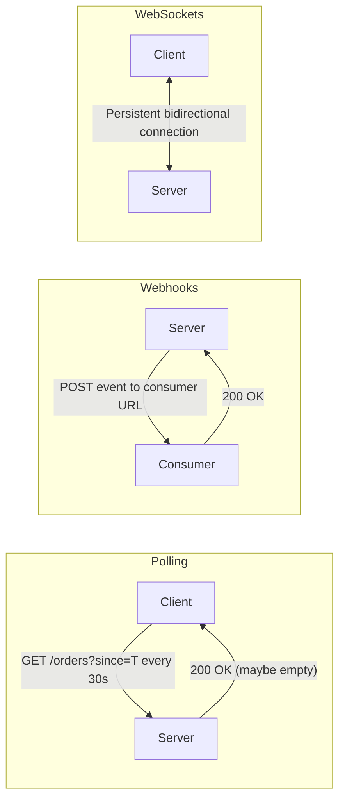
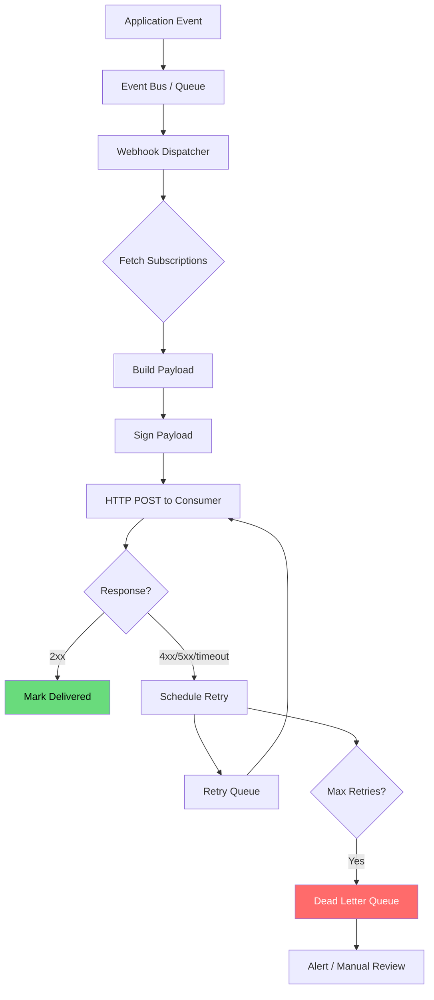

# Webhook Design Patterns

Webhooks flip the communication model. Instead of the consumer polling your API asking "has anything changed?", you push events to the consumer the moment something happens. This sounds simple, but reliable webhook delivery at scale is one of the hardest problems in API design — involving retry logic, signature verification, ordering guarantees, and failure isolation.

## Webhooks vs Polling vs WebSockets

Before building a webhook system, understand when each approach is appropriate.



| Factor | Polling | Webhooks | WebSockets |
|--------|---------|----------|------------|
| **Direction** | Client pulls | Server pushes | Bidirectional |
| **Latency** | Poll interval (seconds-minutes) | Near real-time (seconds) | Real-time (milliseconds) |
| **Server load** | High (many empty responses) | Low (only fires on events) | Medium (persistent connections) |
| **Reliability** | Client controls retry | Server must handle retry | Connection drops need reconnection |
| **Complexity** | Very low | Medium | High |
| **Firewall friendly** | Yes | Consumer must be reachable | Needs WebSocket-capable infrastructure |
| **Best for** | Simple integrations, batch sync | Event-driven integrations | Live dashboards, chat, gaming |

::: tip
Webhooks are the right choice when: (1) events are infrequent enough that polling is wasteful, (2) consumers need near-real-time notification, and (3) consumers can expose an HTTP endpoint. If consumers cannot expose endpoints (mobile apps, browsers), use WebSockets or server-sent events instead.
:::

## Webhook Delivery Architecture

A production webhook system has several components working together.



### Key Design Decisions

1. **Decouple event generation from delivery** — the application emits events to a queue; a separate service handles delivery. This prevents webhook delivery failures from blocking your main application.
2. **Per-consumer isolation** — one slow or failing consumer should not delay delivery to others.
3. **Persistent queue** — use a durable message queue ([Kafka](/system-design/message-queues/), SQS, RabbitMQ) so events survive process restarts.

## Event Payload Design

### Standard Webhook Payload

```json
{
  "id": "evt_abc123def456",
  "type": "order.shipped",
  "created_at": "2026-03-15T10:30:00Z",
  "api_version": "2026-03-01",
  "data": {
    "object": {
      "id": "order_42",
      "status": "shipped",
      "tracking_number": "1Z999AA10123456784",
      "shipped_at": "2026-03-15T10:28:00Z",
      "customer": {
        "id": "cust_7",
        "email": "alice@example.com"
      }
    },
    "previous_attributes": {
      "status": "processing",
      "tracking_number": null
    }
  }
}
```

### Payload Design Principles

| Principle | Rationale |
|-----------|-----------|
| **Include a unique event ID** | Consumers use it for idempotency |
| **Include a type string** | Consumers route to the right handler without parsing the body |
| **Include the full object** | Consumers do not need to make a follow-up API call |
| **Include `previous_attributes`** | Consumers can see exactly what changed |
| **Include `api_version`** | Payload format matches the version the consumer subscribed with |
| **Use consistent naming** | Same field names as your REST API responses |

### Fat vs Thin Payloads

```json
// Fat payload — includes full object data
{
  "type": "order.shipped",
  "data": {
    "object": { "id": "order_42", "status": "shipped", "total": { "amount": 9999, "currency": "USD" }, ... }
  }
}

// Thin payload — includes only the reference
{
  "type": "order.shipped",
  "data": {
    "object_id": "order_42",
    "object_type": "order"
  }
}
```

| Approach | Pros | Cons |
|----------|------|------|
| **Fat** | Consumer has all data immediately, no follow-up API call | Larger payloads, stale data if consumer processes late |
| **Thin** | Small payloads, consumer always gets fresh data | Requires API call (added latency and load), fails if API is down |

::: tip
Use fat payloads by default. The added bandwidth cost is negligible compared to the reliability benefit of not requiring consumers to make a follow-up API call. Include a `data.object.url` field so consumers can optionally fetch the latest version.
:::

## Signature Verification (HMAC)

Webhooks are HTTP requests from your server to the consumer's URL. The consumer must verify that the request genuinely came from you, not from an attacker who guessed the URL.

### Signing Algorithm

```typescript
import crypto from 'crypto';

function signPayload(
  payload: string,
  secret: string,
  timestamp: number
): string {
  const signedContent = `${timestamp}.${payload}`;
  return crypto
    .createHmac('sha256', secret)
    .update(signedContent)
    .digest('hex');
}

// When sending a webhook:
const timestamp = Math.floor(Date.now() / 1000);
const body = JSON.stringify(eventPayload);
const signature = signPayload(body, webhookSecret, timestamp);

// Include in headers
const headers = {
  'Content-Type': 'application/json',
  'X-Webhook-Id': eventPayload.id,
  'X-Webhook-Timestamp': timestamp.toString(),
  'X-Webhook-Signature': `v1=${signature}`
};
```

### Verification on the Consumer Side

```typescript
import crypto from 'crypto';

function verifyWebhookSignature(
  body: string,
  signatureHeader: string,
  timestampHeader: string,
  secret: string,
  toleranceSeconds: number = 300 // 5 minutes
): boolean {
  const timestamp = parseInt(timestampHeader);
  const now = Math.floor(Date.now() / 1000);

  // Reject old timestamps to prevent replay attacks
  if (Math.abs(now - timestamp) > toleranceSeconds) {
    throw new Error('Webhook timestamp too old — possible replay attack');
  }

  // Compute expected signature
  const signedContent = `${timestamp}.${body}`;
  const expectedSignature = crypto
    .createHmac('sha256', secret)
    .update(signedContent)
    .digest('hex');

  // Constant-time comparison to prevent timing attacks
  const expected = `v1=${expectedSignature}`;
  const received = signatureHeader;

  if (expected.length !== received.length) return false;
  return crypto.timingSafeEqual(
    Buffer.from(expected),
    Buffer.from(received)
  );
}

// Express middleware
app.post('/webhooks/orders', express.raw({ type: 'application/json' }), (req, res) => {
  const body = req.body.toString();

  try {
    const isValid = verifyWebhookSignature(
      body,
      req.headers['x-webhook-signature'] as string,
      req.headers['x-webhook-timestamp'] as string,
      process.env.WEBHOOK_SECRET!
    );

    if (!isValid) {
      return res.status(401).json({ error: 'Invalid signature' });
    }

    const event = JSON.parse(body);
    // Process event...

    res.status(200).json({ received: true });
  } catch (err) {
    res.status(400).json({ error: (err as Error).message });
  }
});
```

::: danger
Always use `crypto.timingSafeEqual` for signature comparison. Regular string comparison (`===`) is vulnerable to timing attacks — an attacker can determine the correct signature byte-by-byte by measuring response times.
:::

### Key Rotation

Webhook signing secrets must be rotatable without downtime. Support multiple active signatures during rotation:

```
X-Webhook-Signature: v1=abc123,v1=def456
```

The consumer tries each signature and accepts the request if any matches. This allows you to:
1. Generate new secret
2. Start signing with both old and new secrets
3. Notify consumers to update their secret
4. Stop signing with old secret

## Retry Strategies

Webhook delivery will fail. Networks are unreliable, consumer servers go down, deployments cause brief outages. Your retry strategy determines whether events are eventually delivered or silently lost.

### Exponential Backoff with Jitter

```typescript
function calculateRetryDelay(
  attempt: number,
  baseDelay: number = 1000,  // 1 second
  maxDelay: number = 86400000 // 24 hours
): number {
  // Exponential backoff: 1s, 2s, 4s, 8s, 16s, ...
  const exponentialDelay = baseDelay * Math.pow(2, attempt);

  // Cap at max delay
  const cappedDelay = Math.min(exponentialDelay, maxDelay);

  // Add jitter (0-100% of delay) to prevent thundering herd
  const jitter = Math.random() * cappedDelay;

  return Math.floor(cappedDelay / 2 + jitter);
}
```

### Typical Retry Schedule

```
Attempt 1:  Immediate delivery
Attempt 2:  ~1 minute after failure
Attempt 3:  ~5 minutes
Attempt 4:  ~30 minutes
Attempt 5:  ~2 hours
Attempt 6:  ~8 hours
Attempt 7:  ~24 hours
Attempt 8:  Dead letter queue → alert
```

### What Counts as Success?

| Response | Action |
|----------|--------|
| `200-299` | Mark as delivered, stop retrying |
| `301/302` | Follow redirect (max 3 redirects), then deliver |
| `400-499` (except 429) | Do not retry — consumer error, mark as failed |
| `429 Too Many Requests` | Retry with `Retry-After` header delay |
| `500-599` | Retry with backoff |
| Connection timeout (10s) | Retry with backoff |
| DNS resolution failure | Retry with backoff |
| TLS handshake failure | Retry with backoff, alert if persistent |

::: warning
Never retry `4xx` errors (except `429`). A `400 Bad Request` or `404 Not Found` will not succeed on retry — retrying wastes resources and can look like a DDoS attack on the consumer's endpoint.
:::

## Idempotency

Because retries are inevitable, consumers must handle duplicate deliveries. The webhook `id` field enables this.

### Consumer-Side Idempotency

```typescript
// Consumer stores processed event IDs
const processedEvents = new Set<string>(); // In production, use Redis or a database

app.post('/webhooks', async (req, res) => {
  const event = req.body;

  // Check if already processed
  const alreadyProcessed = await redis.sismember(
    'processed_webhooks',
    event.id
  );

  if (alreadyProcessed) {
    // Acknowledge without reprocessing
    return res.status(200).json({ received: true, duplicate: true });
  }

  try {
    // Process the event
    await handleEvent(event);

    // Mark as processed (with TTL to prevent unbounded growth)
    await redis.sadd('processed_webhooks', event.id);
    await redis.expire('processed_webhooks', 7 * 24 * 60 * 60); // 7 days

    res.status(200).json({ received: true });
  } catch (err) {
    // Return 500 so the sender retries
    res.status(500).json({ error: 'Processing failed' });
  }
});
```

### Provider-Side Idempotency

On the sending side, use the event ID to deduplicate at the queue level:

```typescript
// When enqueuing a webhook for delivery
await queue.send({
  messageId: event.id,        // SQS message deduplication ID
  body: JSON.stringify(event),
  groupId: event.data.object.id // FIFO ordering per resource
});
```

## Ordering Guarantees

Webhook ordering is hard. Events are generated in order, but network latency, retries, and parallel delivery can reorder them.

### Strategies

| Strategy | Guarantee | Complexity |
|----------|-----------|------------|
| **No ordering** | Events may arrive in any order | Low |
| **Per-resource ordering** | Events for the same resource arrive in order | Medium |
| **Global ordering** | All events arrive in order | Very high (not practical) |

### Per-Resource Ordering

```typescript
// Include a sequence number per resource
{
  "id": "evt_abc123",
  "type": "order.updated",
  "sequence": 7,              // Monotonically increasing per resource
  "data": {
    "object": {
      "id": "order_42",
      "version": 7            // Matches sequence
    }
  }
}
```

Consumers can detect out-of-order delivery by checking the sequence number:

```typescript
async function handleEvent(event: WebhookEvent) {
  const lastSequence = await redis.get(
    `webhook_seq:${event.data.object.id}`
  );

  if (lastSequence && event.sequence <= parseInt(lastSequence)) {
    // Out of order or duplicate — skip
    console.log(`Skipping event ${event.id}: sequence ${event.sequence} <= ${lastSequence}`);
    return;
  }

  await processEvent(event);
  await redis.set(
    `webhook_seq:${event.data.object.id}`,
    event.sequence.toString()
  );
}
```

::: tip
For most webhook use cases, include the full current state in the payload and let the consumer overwrite. If the consumer gets event 5 then event 7 (skipping 6), and both contain the full order object, the consumer ends up with the correct state. This "last-write-wins" approach is simpler than strict ordering.
:::

## Webhook Subscription Management

### Registration API

```yaml
# POST /api/webhooks
{
  "url": "https://consumer.example.com/webhooks/orders",
  "events": ["order.created", "order.shipped", "order.delivered"],
  "secret": null  # Server generates and returns it
}

# Response
{
  "id": "wh_endpoint_abc123",
  "url": "https://consumer.example.com/webhooks/orders",
  "events": ["order.created", "order.shipped", "order.delivered"],
  "secret": "whsec_xK8dL2mN9pQrStUvWxYz...",
  "status": "active",
  "created_at": "2026-03-15T10:00:00Z"
}
```

### Endpoint Health Tracking

Track delivery success rate per endpoint and automatically disable failing endpoints:

```typescript
interface EndpointHealth {
  endpoint_id: string;
  total_attempts: number;
  successful_deliveries: number;
  consecutive_failures: number;
  last_success_at: Date | null;
  last_failure_at: Date | null;
  status: 'active' | 'degraded' | 'disabled';
}

async function updateEndpointHealth(
  endpointId: string,
  success: boolean
) {
  const health = await getEndpointHealth(endpointId);

  if (success) {
    health.consecutive_failures = 0;
    health.last_success_at = new Date();
    health.status = 'active';
  } else {
    health.consecutive_failures++;
    health.last_failure_at = new Date();

    // Disable after 7 days of consecutive failures
    if (health.consecutive_failures > 500) {
      health.status = 'disabled';
      await notifyConsumer(endpointId, 'Webhook endpoint disabled due to persistent failures');
    } else if (health.consecutive_failures > 50) {
      health.status = 'degraded';
    }
  }

  await saveEndpointHealth(health);
}
```

### Testing and Debugging

Provide consumers with tools to debug webhook integration:

```
# Send a test event
POST /api/webhooks/wh_endpoint_abc123/test
{
  "event_type": "order.shipped"
}

# List recent delivery attempts
GET /api/webhooks/wh_endpoint_abc123/attempts
→ {
    "data": [
      {
        "id": "attempt_xyz",
        "event_id": "evt_abc123",
        "status": "delivered",
        "response_code": 200,
        "response_time_ms": 145,
        "attempted_at": "2026-03-15T10:30:01Z"
      },
      {
        "id": "attempt_def",
        "event_id": "evt_abc124",
        "status": "failed",
        "response_code": 500,
        "response_body": "Internal Server Error",
        "next_retry_at": "2026-03-15T10:35:00Z",
        "attempted_at": "2026-03-15T10:30:02Z"
      }
    ]
  }

# Replay a failed event
POST /api/webhooks/wh_endpoint_abc123/replay
{
  "event_id": "evt_abc124"
}
```

## Implementation: Complete Webhook Dispatcher

```typescript
import { Queue, Worker } from 'bullmq';
import crypto from 'crypto';
import fetch from 'node-fetch';

interface WebhookJob {
  eventId: string;
  endpointId: string;
  url: string;
  secret: string;
  payload: string;
  attempt: number;
}

// Queue for webhook delivery
const webhookQueue = new Queue<WebhookJob>('webhooks', {
  connection: { host: 'redis', port: 6379 }
});

// Enqueue a webhook for delivery
async function dispatchWebhook(event: AppEvent) {
  const subscriptions = await getSubscriptionsForEvent(event.type);

  for (const sub of subscriptions) {
    if (sub.status !== 'active') continue;

    const payload = JSON.stringify(event);
    await webhookQueue.add('deliver', {
      eventId: event.id,
      endpointId: sub.id,
      url: sub.url,
      secret: sub.secret,
      payload,
      attempt: 0
    }, {
      attempts: 8,
      backoff: { type: 'exponential', delay: 60000 },
      removeOnComplete: 1000,
      removeOnFail: false // Keep failures for debugging
    });
  }
}

// Worker that processes the queue
const worker = new Worker<WebhookJob>('webhooks', async (job) => {
  const { url, secret, payload, eventId } = job.data;
  const timestamp = Math.floor(Date.now() / 1000);

  // Sign the payload
  const signature = crypto
    .createHmac('sha256', secret)
    .update(`${timestamp}.${payload}`)
    .digest('hex');

  // Deliver
  const controller = new AbortController();
  const timeout = setTimeout(() => controller.abort(), 10000);

  try {
    const response = await fetch(url, {
      method: 'POST',
      headers: {
        'Content-Type': 'application/json',
        'X-Webhook-Id': eventId,
        'X-Webhook-Timestamp': timestamp.toString(),
        'X-Webhook-Signature': `v1=${signature}`,
        'User-Agent': 'MyApp-Webhooks/1.0'
      },
      body: payload,
      signal: controller.signal
    });

    if (response.status >= 200 && response.status < 300) {
      await updateEndpointHealth(job.data.endpointId, true);
      return; // Success
    }

    if (response.status >= 400 && response.status < 500 && response.status !== 429) {
      // Client error — do not retry
      await updateEndpointHealth(job.data.endpointId, false);
      return; // Move to failed without retry
    }

    // Server error or 429 — throw to trigger retry
    throw new Error(`Webhook delivery failed: ${response.status}`);
  } finally {
    clearTimeout(timeout);
  }
}, {
  connection: { host: 'redis', port: 6379 },
  concurrency: 50,
  limiter: { max: 100, duration: 1000 } // 100 deliveries/second
});
```

## Security Considerations

| Threat | Mitigation |
|--------|------------|
| **Forged webhooks** | HMAC signature verification |
| **Replay attacks** | Timestamp validation (reject events older than 5 minutes) |
| **SSRF via webhook URL** | Validate consumer URLs against allowlist; block private IPs |
| **Payload interception** | Require HTTPS endpoints only |
| **Secret leakage** | Rotate secrets periodically; never log secrets |
| **DDoS via webhooks** | Rate limit delivery per endpoint; circuit breaker on failures |

::: danger
Always validate that webhook URLs are not pointed at internal services (127.0.0.1, 10.x.x.x, 169.254.x.x). Attackers can register webhook endpoints pointed at your internal infrastructure, turning your webhook system into an SSRF attack vector.
:::

## Further Reading

- [REST API Best Practices](/system-design/api-design/rest-best-practices) — designing the webhook registration API
- [API Security Patterns](/system-design/api-design/api-security-patterns) — HMAC signing, authentication, and abuse prevention
- [Message Queues](/system-design/message-queues/) — the delivery infrastructure behind webhook systems
- [Dead Letter Queues](/system-design/message-queues/dead-letter-queues) — handling permanently failed deliveries
- [Rate Limiting](/security/api-security/rate-limiting) — protecting consumers from delivery floods
