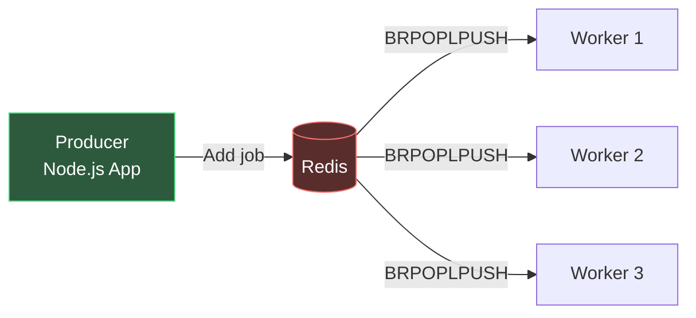
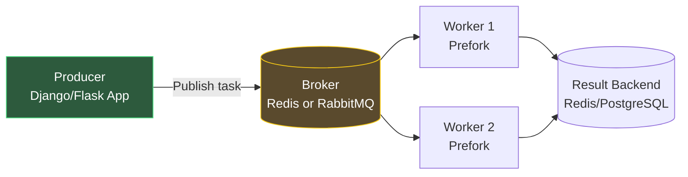
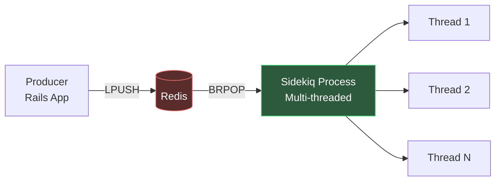
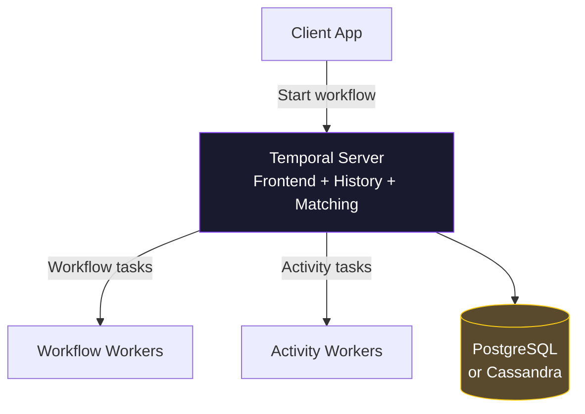
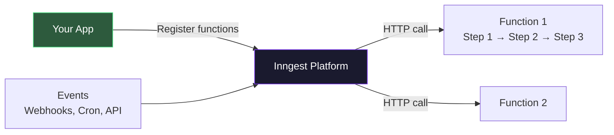
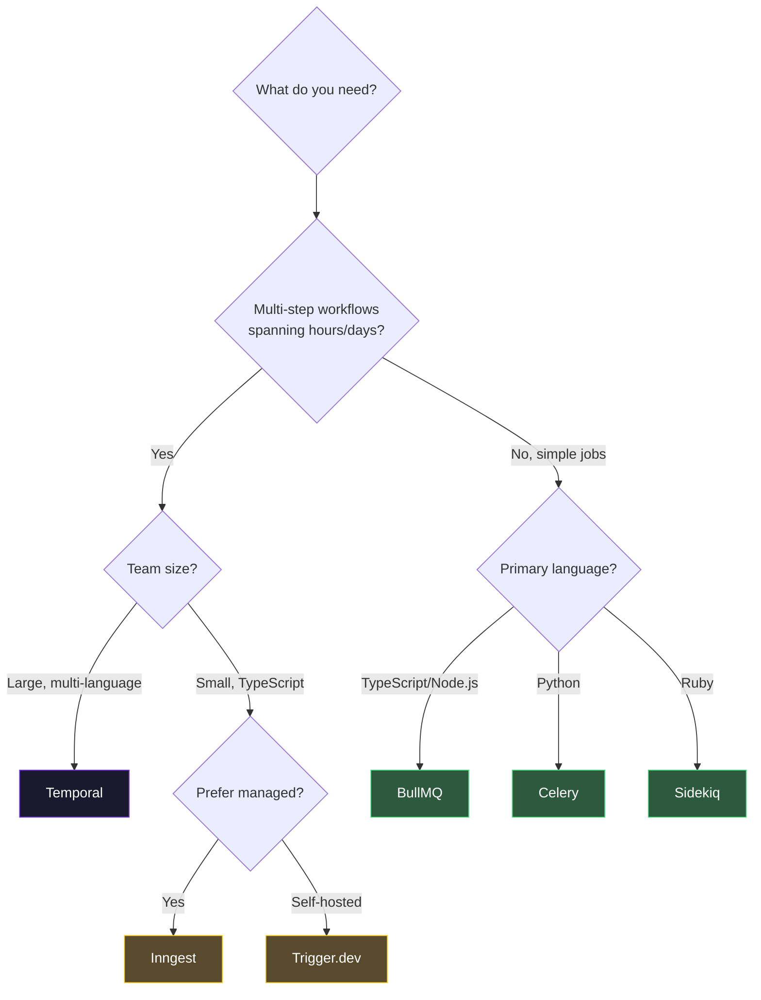

# Job Queue Comparison

## Why This Comparison Exists

Choosing a job queue is one of those decisions that is easy to get wrong and expensive to change. Migrate from BullMQ to Temporal 18 months in, and you are rewriting every job handler, changing your infrastructure, and retraining your team. This page provides an honest, technical comparison so you can make the right choice on day one.

The comparison is organized around the questions that actually matter in production:

1. What languages and frameworks does it support?
2. How does it handle failures and retries?
3. What persistence guarantees does it provide?
4. How does it scale?
5. What does it cost?
6. How complex is the operational burden?

---

## The Contenders

| Queue | Category | Primary Language | Backing Store | License |
|-------|----------|-----------------|---------------|---------|
| **BullMQ** | Job queue | TypeScript/Node.js | Redis | MIT |
| **Celery** | Task queue | Python | Redis, RabbitMQ | BSD |
| **Sidekiq** | Job queue | Ruby | Redis | LGPL / Commercial |
| **Temporal** | Workflow engine | Any (TypeScript, Go, Java, Python, .NET) | PostgreSQL, Cassandra, MySQL | MIT |
| **Inngest** | Event-driven queue | TypeScript, Go, Python | Managed (cloud) | Source-available |
| **Trigger.dev** | Background job platform | TypeScript | Managed (cloud) / Self-hosted PostgreSQL | Apache 2.0 |

---

## Feature Comparison

### Core Features

| Feature | BullMQ | Celery | Sidekiq | Temporal | Inngest | Trigger.dev |
|---------|--------|--------|---------|----------|---------|-------------|
| Simple job dispatch | Yes | Yes | Yes | Yes | Yes | Yes |
| Delayed jobs | Yes | Yes | Yes | Yes (timer) | Yes | Yes |
| Scheduled (cron) jobs | Yes | Yes (Beat) | Yes (Enterprise) | Yes | Yes | Yes |
| Priority queues | Yes | Yes | Yes | Yes (task queues) | Yes | Yes |
| Job chaining | Yes (flows) | Yes (chains) | Yes (batches, Pro) | Yes (workflow) | Yes (steps) | Yes |
| Fan-out/fan-in | Yes (flows) | Yes (groups) | Yes (batches, Pro) | Yes (child workflows) | Yes | Yes |
| Rate limiting | Yes | Yes (manual) | Yes (Enterprise) | Yes (activity) | Yes (built-in) | Yes |
| Dead letter queue | Yes | Yes | Yes | N/A (retries indefinitely or fails) | Yes | Yes |
| Job progress tracking | Yes | Yes (custom) | No (use callbacks) | Yes (queries) | Yes | Yes |
| Web UI / Dashboard | Yes (Bull Board) | Yes (Flower) | Yes (built-in) | Yes (Temporal UI) | Yes (cloud console) | Yes (cloud/self-hosted) |
| Exactly-once semantics | No (at-least-once) | No (at-least-once) | No (at-least-once) | Yes (with activities) | Yes (step-level) | Yes (step-level) |

### Advanced Features

| Feature | BullMQ | Celery | Sidekiq | Temporal | Inngest | Trigger.dev |
|---------|--------|--------|---------|----------|---------|-------------|
| Multi-step workflows | Flows (limited) | Canvas (chains, groups, chords) | Batches (Pro) | Native | Native (steps) | Native |
| Saga / compensation | Manual | Manual | Manual | Native | Manual | Manual |
| Long-running (hours/days) | Not recommended | Not recommended | Not recommended | Native | Yes | Yes |
| Signals (external events) | No | No | No | Native | Events | Yes |
| Human-in-the-loop | No | No | No | Yes (signals + queries) | Wait for event | Wait for event |
| Workflow versioning | N/A | N/A | N/A | Native (patched API) | Version header | Versioned tasks |
| Durable execution | No | No | No | Yes | Yes | Yes |
| Cancellation propagation | Yes | Yes (revoke) | Limited | Yes (cascading) | Yes | Yes |
| Observability / Tracing | Manual (metrics) | Manual | Built-in metrics | Built-in (full history) | Built-in | Built-in |

---

## Architecture Comparison

### BullMQ



**Strengths**: Extremely fast (Redis-native). Simple API. Excellent TypeScript support. Mature ecosystem (Bull Board dashboard). Flows for job dependencies.

**Weaknesses**: Redis is a single point of failure (unless using Redis Sentinel/Cluster). No durable execution. No built-in workflow orchestration. Node.js only.

```typescript
// BullMQ example
import { Queue, Worker } from 'bullmq';

const emailQueue = new Queue('emails', {
  connection: { host: 'redis', port: 6379 },
});

// Enqueue a job
await emailQueue.add('send-welcome', {
  userId: '123',
  email: 'user@example.com',
}, {
  attempts: 3,
  backoff: { type: 'exponential', delay: 1000 },
  removeOnComplete: { age: 86400 },
  removeOnFail: { age: 604800 },
});

// Process jobs
const worker = new Worker('emails', async (job) => {
  await sendEmail(job.data.email, 'Welcome!', 'welcome-template');
}, {
  connection: { host: 'redis', port: 6379 },
  concurrency: 10,
  limiter: { max: 100, duration: 60000 },  // 100 jobs per minute
});
```

### Celery



**Strengths**: Python ecosystem standard. Supports multiple brokers (Redis, RabbitMQ, SQS). Canvas API for complex task composition. Mature and battle-tested.

**Weaknesses**: Python only. Complex configuration. Monitoring requires Flower (separate deployment). Memory leaks in long-running workers (prefork pool). No built-in rate limiting.

```python
# Celery example
from celery import Celery, chain, group

app = Celery('tasks', broker='redis://redis:6379/0')

@app.task(bind=True, max_retries=3, default_retry_delay=60)
def send_welcome_email(self, user_id: str, email: str):
    try:
        send_email(email, 'Welcome!', 'welcome-template')
    except EmailServiceError as exc:
        raise self.retry(exc=exc)

# Task composition with Canvas
workflow = chain(
    validate_order.s(order_id),
    group(
        reserve_inventory.s(),
        validate_payment.s(),
    ),
    charge_card.s(),
    send_confirmation.s(),
)
workflow.apply_async()
```

### Sidekiq



**Strengths**: Ruby ecosystem standard. Fast (threaded, not forked). Simple API. Built-in web UI. Sidekiq Pro/Enterprise add batches, rate limiting, unique jobs.

**Weaknesses**: Ruby only. Advanced features require paid license. Redis dependency. No workflow orchestration.

```ruby
# Sidekiq example
class WelcomeEmailWorker
  include Sidekiq::Worker

  sidekiq_options queue: 'emails', retry: 3

  def perform(user_id, email)
    UserMailer.welcome(user_id, email).deliver_now
  end
end

# Enqueue
WelcomeEmailWorker.perform_async('123', 'user@example.com')

# Delayed
WelcomeEmailWorker.perform_in(1.hour, '123', 'user@example.com')

# Scheduled
WelcomeEmailWorker.perform_at(Time.now + 1.day, '123', 'user@example.com')
```

### Temporal



**Strengths**: Multi-language SDKs. Durable execution (survives crashes). Native saga/compensation. Signals and queries. Workflow versioning. Full execution history. The most powerful option.

**Weaknesses**: Operational complexity (Temporal server is a distributed system itself). Steep learning curve (determinism rules). Overkill for simple jobs. Resource-intensive.

::: tip Temporal Cloud Eliminates Operational Burden
If Temporal's operational complexity concerns you, Temporal Cloud is a fully managed service. You only run workers — Temporal manages the server, persistence, and scaling. Pricing starts at $200/month for 50K actions.
:::

### Inngest



**Strengths**: No infrastructure to manage (serverless-native). Step functions with durable execution. Built-in rate limiting, throttling, debouncing. Event-driven model. Excellent DX.

**Weaknesses**: Vendor lock-in (managed cloud). Self-hosted option is newer. Limited language support compared to Temporal. Less mature ecosystem.

```typescript
// Inngest example
import { Inngest } from 'inngest';

const inngest = new Inngest({ id: 'my-app' });

export const processOrder = inngest.createFunction(
  {
    id: 'process-order',
    retries: 3,
    throttle: { limit: 100, period: '1m' },
  },
  { event: 'order/created' },
  async ({ event, step }) => {
    // Each step is durable — survives crashes
    const payment = await step.run('validate-payment', async () => {
      return await stripe.paymentIntents.retrieve(
        event.data.paymentIntentId
      );
    });

    const inventory = await step.run('reserve-inventory', async () => {
      return await reserveItems(event.data.items);
    });

    // Wait for an external event (e.g., webhook)
    const shipment = await step.waitForEvent(
      'wait-for-shipment',
      {
        event: 'shipment/created',
        match: 'data.orderId',
        timeout: '7d',
      }
    );

    await step.run('send-confirmation', async () => {
      await sendEmail(event.data.email, 'Order shipped!');
    });
  }
);
```

### Trigger.dev


**Strengths**: TypeScript-first. Full-stack background jobs (connect to any API). Long-running tasks (up to 5 minutes on Hobby, unlimited on Pro). Built-in integrations. Self-hostable. Open-source.

**Weaknesses**: TypeScript only. Newer product (less battle-tested). Self-hosting requires PostgreSQL.

```typescript
// Trigger.dev v3 example
import { task, wait } from '@trigger.dev/sdk/v3';

export const processOrder = task({
  id: 'process-order',
  retry: { maxAttempts: 3, factor: 2, minTimeoutInMs: 1000 },
  run: async (payload: { orderId: string; items: OrderItem[] }) => {
    // Step 1: Validate payment
    const payment = await validatePayment(payload.orderId);

    // Step 2: Reserve inventory
    const reservation = await reserveInventory(payload.items);

    // Step 3: Wait for external event
    const result = await wait.forRequest<ShipmentData>({
      id: `shipment-${payload.orderId}`,
      timeout: '7d',
    });

    // Step 4: Send confirmation
    await sendConfirmationEmail(payload.orderId, result.trackingNumber);

    return { status: 'completed', trackingNumber: result.trackingNumber };
  },
});
```

---

## Performance & Scaling

| Dimension | BullMQ | Celery | Sidekiq | Temporal | Inngest | Trigger.dev |
|-----------|--------|--------|---------|----------|---------|-------------|
| Max throughput (jobs/sec) | 50K+ | 10K+ | 25K+ | 10K+ | Managed | Managed |
| Worker scaling | Horizontal (add processes) | Horizontal (add workers) | Horizontal (add processes) | Horizontal (add workers) | Auto-scaling | Auto-scaling |
| Queue scaling | Redis Cluster | Broker-dependent | Redis Cluster | DB partitioning | Managed | Managed |
| Memory per job | ~1KB (Redis) | ~2KB (broker-dependent) | ~1KB (Redis) | ~5-50KB (event history) | Managed | Managed |
| Max job payload | 512MB (Redis limit) | Broker-dependent | 512MB (Redis limit) | 2MB (recommended) | 4MB | 10MB |
| Horizontal scaling limit | Redis Cluster nodes | Broker capacity | Redis Cluster nodes | Persistence layer | Platform limits | Platform limits |

::: warning Redis Memory Pressure
BullMQ and Sidekiq store all job data in Redis. A queue with 1 million pending jobs, each with 1KB of data, consumes ~1GB of Redis memory. If your Redis instance runs out of memory, you lose jobs. Monitor Redis memory usage and configure `maxmemory-policy` to `noeviction` to prevent silent data loss.
:::

---

## Persistence & Durability

| Property | BullMQ | Celery | Sidekiq | Temporal | Inngest | Trigger.dev |
|----------|--------|--------|---------|----------|---------|-------------|
| Jobs survive restart | Yes (Redis AOF/RDB) | Yes (broker-dependent) | Yes (Redis AOF/RDB) | Yes (database) | Yes (managed) | Yes (database) |
| Jobs survive Redis crash | Partial (depends on persistence config) | Partial | Partial | Yes (no Redis) | Yes | Yes |
| ACID guarantees | No | No | No | Yes (database-backed) | Yes | Yes |
| Transactional enqueue | No (separate from app DB) | No | No | Yes (within workflow) | No | No |
| Data retention | Configurable | Configurable | Configurable | Configurable (namespace) | 7 days (free) | Configurable |

---

## Operational Complexity

| Aspect | BullMQ | Celery | Sidekiq | Temporal | Inngest | Trigger.dev |
|--------|--------|--------|---------|----------|---------|-------------|
| Infrastructure required | Redis | Redis/RabbitMQ + result backend | Redis | Temporal Server + DB | None (cloud) | None (cloud) or PostgreSQL |
| Monitoring setup | Manual (Prometheus exporter) | Flower + manual | Built-in + manual | Built-in UI | Built-in | Built-in |
| Deployment complexity | Low (npm package) | Medium (worker processes + Beat) | Low (gem + process) | High (Temporal server cluster) | None (serverless) | Low (npm package) |
| Learning curve | Low | Medium | Low | High | Medium | Low |
| Debug experience | Manual (log-based) | Manual (Flower) | Good (web UI) | Excellent (full replay) | Good (step-level logs) | Good (step-level logs) |

---

## Pricing

| Product | Free Tier | Paid | Self-Hosted |
|---------|-----------|------|-------------|
| **BullMQ** | Open source (unlimited) | N/A | Yes (free) |
| **Celery** | Open source (unlimited) | N/A | Yes (free) |
| **Sidekiq** | Open source (limited features) | Pro: $99/month, Enterprise: custom | Yes (license) |
| **Temporal** | Open source (unlimited) | Cloud: from $200/month | Yes (free) |
| **Inngest** | 50K steps/month | From $50/month | Self-hosted (source-available) |
| **Trigger.dev** | 50K runs/month | From $25/month | Yes (open source) |

---

## Decision Matrix

### Choose BullMQ If:
- You are building in Node.js/TypeScript
- You already run Redis
- Your jobs are simple (send email, process image, sync data)
- You need high throughput (50K+ jobs/sec)
- You want minimal operational overhead

### Choose Celery If:
- You are building in Python (Django, Flask, FastAPI)
- You need Canvas for complex task composition
- Your team has Python expertise
- You want broker flexibility (Redis, RabbitMQ, SQS)

### Choose Sidekiq If:
- You are building in Ruby (Rails)
- You want a polished, batteries-included solution
- You are willing to pay for Pro/Enterprise features
- Your team values Ruby ecosystem conventions

### Choose Temporal If:
- You have multi-step workflows that span minutes to days
- You need saga/compensation patterns
- You need to support multiple languages
- Reliability is more important than simplicity
- You can invest in the learning curve and operational complexity

### Choose Inngest If:
- You want serverless-native background jobs
- You prefer event-driven architecture
- You want built-in rate limiting and throttling
- You do not want to manage infrastructure

### Choose Trigger.dev If:
- You are building in TypeScript
- You want durable execution without Temporal's complexity
- You need long-running tasks (minutes to hours)
- You want an open-source option with a managed cloud



::: tip Start Simple, Graduate When Needed
Most teams should start with BullMQ (Node.js), Celery (Python), or Sidekiq (Ruby). These cover 90% of background job needs with minimal complexity. Only move to Temporal, Inngest, or Trigger.dev when you hit the workflow orchestration wall — multi-step processes, sagas, long-running tasks, or cross-service coordination that makes simple queues painful.
:::

See also: [Background Jobs Overview](/system-design/background-jobs/) for fundamentals, [Temporal Deep Dive](/system-design/background-jobs/temporal) for workflow orchestration, and [Job Processing Patterns](/system-design/background-jobs/patterns) for retry, fan-out, and rate limiting strategies that apply to any queue.
