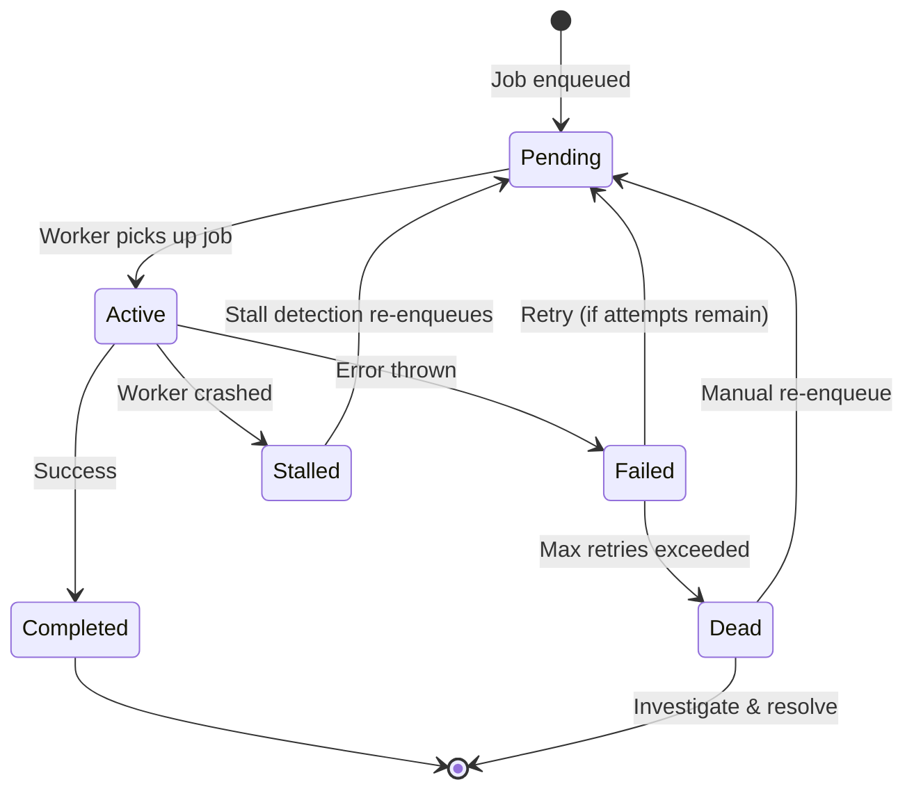
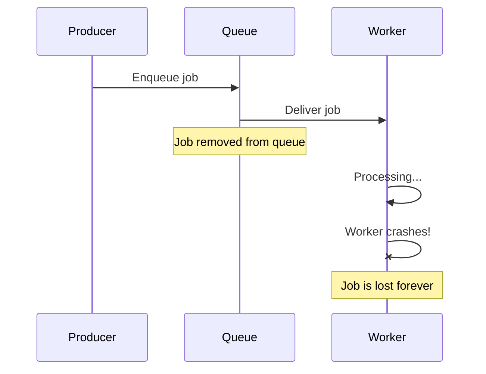
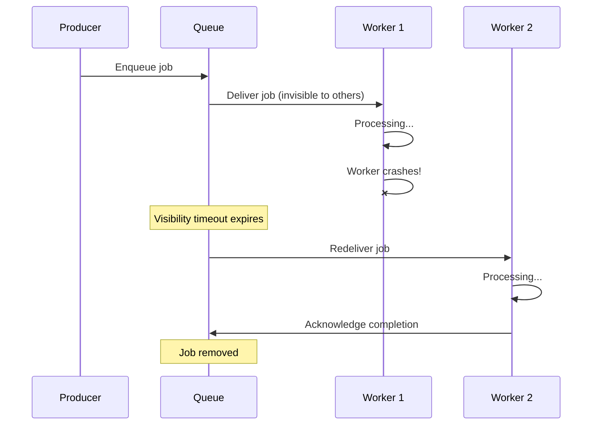
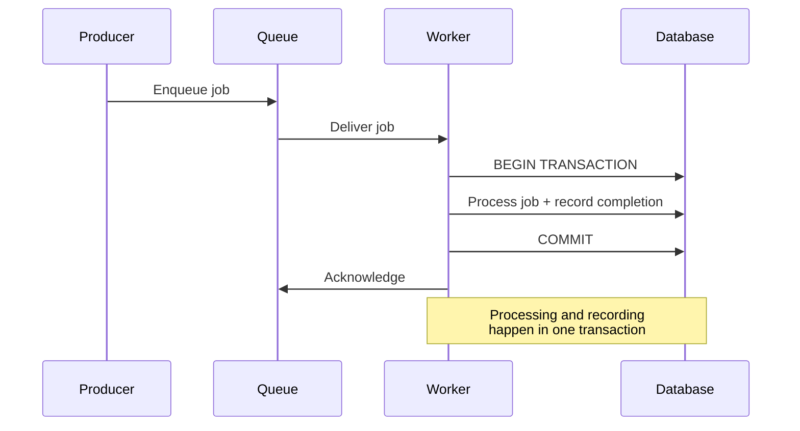
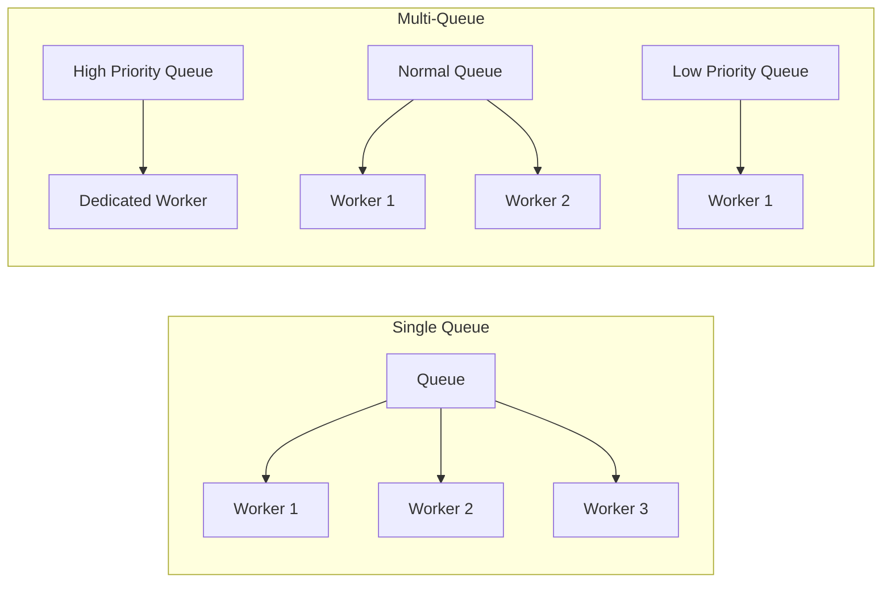

# Background Jobs

## Why Background Jobs Exist

Every web application starts with a simple model: a request comes in, the server processes it, and a response goes out. This synchronous model works until it doesn't. The moment you need to send an email, generate a PDF, process an image, charge a credit card, sync data to a third-party API, or run a report — you face a choice: make the user wait, or do the work in the background.

The answer is almost always background. Here is why:

1. **Latency**: Users expect responses in under 200ms. Sending an email takes 500ms-2s. Generating a PDF takes 2-10s. Processing a video takes minutes.
2. **Reliability**: External services fail. If your payment processor has a 99.9% success rate, 1 in 1,000 checkout attempts will fail. Background jobs can retry. Synchronous requests cannot (without making the user wait).
3. **Resource isolation**: A CPU-intensive image processing task should not compete for resources with the API serving user requests.
4. **Throughput**: A web server has a fixed number of connections. Long-running synchronous tasks exhaust that pool. Background workers can be scaled independently.

### When to Use Background Jobs

| Scenario | Synchronous | Background | Why |
|----------|------------|------------|-----|
| Lookup user profile | Yes | No | Fast, user needs the result immediately |
| Send welcome email | No | Yes | User does not need to wait for delivery |
| Process payment | Initiate sync | Complete in background | Start the charge, handle webhook async |
| Generate monthly report | No | Yes | Takes minutes, deliver when ready |
| Resize uploaded image | No | Yes | CPU-intensive, user can see a placeholder |
| Update search index | No | Yes | Eventual consistency is acceptable |
| Real-time chat message | Yes (WebSocket) | No | Must be delivered immediately |
| Data export (CSV/PDF) | No | Yes | Large datasets take time to process |

::: tip The 100ms Rule
If the operation takes more than 100ms and the user does not need the result immediately, move it to a background job. This keeps your API responsive and your users happy.
:::

---

## Job Lifecycle

Every background job follows the same lifecycle, regardless of the queue technology:



### Job States Explained

| State | Description | Duration |
|-------|-------------|----------|
| **Pending** | Job is in the queue, waiting for a worker | Milliseconds to hours (depends on queue depth) |
| **Active** | A worker has claimed the job and is processing it | Seconds to minutes (depends on job type) |
| **Completed** | Job finished successfully | Terminal state |
| **Failed** | Job threw an error, may be retried | Transient (moves to Pending or Dead) |
| **Dead** | Job exhausted all retries | Terminal — requires manual intervention |
| **Stalled** | Worker died mid-processing, no heartbeat | Detected by queue, re-enqueued to Pending |

### Job Metadata

Every job should carry metadata beyond the payload:

```typescript
interface Job<T = unknown> {
  /** Unique identifier for the job */
  id: string;
  /** Job type — determines which handler processes it */
  type: string;
  /** The actual data the job handler needs */
  payload: T;
  /** When the job was created */
  createdAt: Date;
  /** How many times this job has been attempted */
  attemptNumber: number;
  /** Maximum allowed attempts */
  maxAttempts: number;
  /** Priority (lower number = higher priority) */
  priority: number;
  /** When to process (for delayed/scheduled jobs) */
  scheduledFor: Date | null;
  /** Correlation ID for tracing */
  correlationId: string;
  /** Which queue this job belongs to */
  queue: string;
  /** Timeout for processing in milliseconds */
  timeoutMs: number;
  /** When the job was last attempted */
  lastAttemptAt: Date | null;
  /** Error from the last failed attempt */
  lastError: string | null;
}
```

---

## Delivery Guarantees

The fundamental question in distributed job processing: if you enqueue a job, how many times will it be processed?

### At-Most-Once

The job is processed zero or one times. If the worker crashes mid-processing, the job is lost.



**Implementation**: Remove the job from the queue before processing begins.

**Use cases**: Logging, analytics, metrics — where losing an occasional data point is acceptable.

### At-Least-Once

The job is processed one or more times. If the worker crashes, the job is redelivered. This means the job handler must be **idempotent** because it may be called multiple times.



**Implementation**: Job remains in the queue until explicitly acknowledged. If not acknowledged within a timeout, it becomes visible again.

**Use cases**: Most production workloads — emails, payments, data processing. Idempotency ensures duplicate processing is safe.

### Exactly-Once

The job is processed exactly one time. This is the holy grail but is technically impossible in a distributed system without transactional coupling between the queue and the processor.



**Implementation**: Transactional outbox pattern — process the job and record its completion in the same database transaction. The queue acknowledgment is best-effort.

**Use cases**: Financial transactions, inventory management — where duplicate processing causes real-world harm.

::: warning "Exactly-Once" is Usually "Effectively Once"
True exactly-once semantics require the queue and the processor to participate in the same transaction. Most systems achieve "effectively once" by combining at-least-once delivery with idempotent processing. This is the practical approach recommended for nearly all workloads.
:::

---

## Idempotency

Idempotency means that processing a job multiple times produces the same result as processing it once. Since at-least-once delivery is the practical standard, every job handler must be idempotent.

### Idempotency Strategies

#### 1. Idempotency Keys

Store a record of processed job IDs. Before processing, check if the ID has been seen:

```typescript
async function processPayment(job: Job<PaymentPayload>): Promise<void> {
  const idempotencyKey = `payment:${job.id}`;

  // Check if already processed
  const existing = await redis.get(idempotencyKey);
  if (existing) {
    logger.info(`Job ${job.id} already processed, skipping`);
    return;
  }

  // Process the payment
  const result = await paymentGateway.charge({
    amount: job.payload.amount,
    customerId: job.payload.customerId,
    idempotencyKey: job.id,  // Payment gateway also uses this
  });

  // Record completion (with TTL for cleanup)
  await redis.set(idempotencyKey, JSON.stringify(result), 'EX', 86400 * 7);
}
```

#### 2. Database Constraints

Use unique constraints to prevent duplicate effects:

```typescript
async function createInvoice(job: Job<InvoicePayload>): Promise<void> {
  try {
    await db.query(
      `INSERT INTO invoices (id, order_id, amount, created_at)
       VALUES ($1, $2, $3, NOW())
       ON CONFLICT (order_id) DO NOTHING`,
      [job.id, job.payload.orderId, job.payload.amount]
    );
  } catch (err) {
    // Unique constraint violation = already processed
    if (err.code === '23505') {
      logger.info(`Invoice for order ${job.payload.orderId} already exists`);
      return;
    }
    throw err;
  }
}
```

#### 3. Conditional Updates

Only apply changes if the current state matches expectations:

```typescript
async function updateInventory(
  job: Job<InventoryPayload>
): Promise<void> {
  const result = await db.query(
    `UPDATE inventory
     SET quantity = quantity - $1,
         last_updated_job_id = $2
     WHERE product_id = $3
       AND last_updated_job_id != $2
       AND quantity >= $1`,
    [job.payload.quantity, job.id, job.payload.productId]
  );

  if (result.rowCount === 0) {
    // Either already processed (idempotent) or insufficient stock
    const current = await db.query(
      `SELECT quantity, last_updated_job_id
       FROM inventory WHERE product_id = $1`,
      [job.payload.productId]
    );

    if (current.rows[0]?.last_updated_job_id === job.id) {
      logger.info(`Job ${job.id} already applied`);
      return;
    }

    throw new Error(
      `Insufficient inventory for product ${job.payload.productId}`
    );
  }
}
```

::: tip Make External Calls Idempotent Too
If your job calls an external API (Stripe, SendGrid, Twilio), pass your job ID as the idempotency key. Most payment and communication APIs support idempotency keys natively. This protects against duplicate charges or duplicate emails even if your job runs twice.
:::

---

## Job Queue Architecture

### Single-Queue vs. Multi-Queue



**Single queue**: Simple. All jobs compete for workers. A flood of low-priority jobs blocks high-priority ones. Suitable for small systems.

**Multi-queue**: Complex but allows priority isolation. Dedicated workers for each queue. Critical jobs (payments) are never blocked by bulk operations (report generation). Required for production systems with mixed workloads.

### Queue-Backed vs. Database-Backed

| Feature | Queue-Backed (Redis, SQS) | Database-Backed (Postgres) |
|---------|---------------------------|---------------------------|
| Throughput | Very high (100K+ jobs/sec) | Moderate (1K-10K jobs/sec) |
| Durability | Depends (Redis can lose data) | Transactional guarantees |
| Visibility timeout | Built-in | Must implement |
| Exactly-once with business data | Requires coordination | Natural (same transaction) |
| Operational complexity | Separate infrastructure | Reuse existing DB |
| Scaling | Horizontal (partitions) | Limited by DB connections |

::: tip Start with Database-Backed Queues
For most applications, a Postgres-backed job queue (like Graphile Worker, PGMQ, or a custom implementation) eliminates an entire category of consistency bugs. You can enqueue a job in the same transaction that creates the data it processes. Move to Redis-backed queues (BullMQ) or managed queues (SQS) when throughput demands it.
:::

```typescript
// Database-backed job queue — transactional enqueue
async function createOrderWithJobs(order: Order): Promise<void> {
  await db.transaction(async (tx) => {
    // Create the order
    await tx.query(
      `INSERT INTO orders (id, user_id, total)
       VALUES ($1, $2, $3)`,
      [order.id, order.userId, order.total]
    );

    // Enqueue jobs in the same transaction
    await tx.query(
      `INSERT INTO job_queue (id, type, payload, status)
       VALUES ($1, 'send_confirmation_email', $2, 'pending'),
              ($3, 'update_inventory', $4, 'pending'),
              ($5, 'sync_to_analytics', $6, 'pending')`,
      [
        uuid(), JSON.stringify({ orderId: order.id }),
        uuid(), JSON.stringify({ items: order.items }),
        uuid(), JSON.stringify({ event: 'order_created', orderId: order.id }),
      ]
    );
  });
  // If the transaction rolls back, the jobs are never created
  // No orphan jobs, no missing jobs
}
```

---

## Producer-Consumer Patterns

### The Basic Pattern

```typescript
// Producer: enqueue work
class JobProducer {
  constructor(private queue: Queue) {}

  async enqueue<T>(
    type: string,
    payload: T,
    options?: JobOptions
  ): Promise<string> {
    const jobId = crypto.randomUUID();

    await this.queue.add({
      id: jobId,
      type,
      payload,
      priority: options?.priority ?? 10,
      maxAttempts: options?.maxAttempts ?? 3,
      scheduledFor: options?.delay
        ? new Date(Date.now() + options.delay)
        : null,
      correlationId: options?.correlationId
        ?? getRequestContext()?.correlationId
        ?? jobId,
    });

    return jobId;
  }
}

// Consumer: process work
class JobConsumer {
  private handlers = new Map<string, JobHandler>();

  register(type: string, handler: JobHandler): void {
    this.handlers.set(type, handler);
  }

  async process(job: Job): Promise<void> {
    const handler = this.handlers.get(job.type);
    if (!handler) {
      throw new Error(`No handler registered for job type: ${job.type}`);
    }

    const span = tracer.startSpan(`job.${job.type}`, {
      attributes: {
        'job.id': job.id,
        'job.attempt': job.attemptNumber,
        'job.correlation_id': job.correlationId,
      },
    });

    try {
      await handler(job);
      metrics.increment(`jobs.${job.type}.completed`);
      metrics.histogram(
        `jobs.${job.type}.duration`,
        Date.now() - job.lastAttemptAt!.getTime()
      );
    } catch (err) {
      metrics.increment(`jobs.${job.type}.failed`);
      span.recordException(err as Error);
      throw err;  // Queue handles retry logic
    } finally {
      span.end();
    }
  }
}
```

---

## Monitoring Background Jobs

### Key Metrics

| Metric | What It Tells You | Alert Threshold |
|--------|-------------------|-----------------|
| Queue depth | How much work is waiting | > 10,000 (growing) |
| Processing rate (jobs/sec) | Worker throughput | Dropping below baseline |
| Error rate | Percentage of jobs failing | > 5% |
| Dead letter queue size | Jobs that exhausted retries | > 0 (always investigate) |
| Job latency (enqueue to start) | How long jobs wait | > 30 seconds |
| Job duration (start to complete) | How long jobs take | > 2x p95 baseline |
| Worker utilization | Are workers busy or idle | > 90% (need more workers) |
| Stalled job count | Workers crashing mid-job | > 0 |

```typescript
// Prometheus metrics for job monitoring
import { Counter, Histogram, Gauge } from 'prom-client';

const jobsEnqueued = new Counter({
  name: 'jobs_enqueued_total',
  help: 'Total jobs enqueued',
  labelNames: ['queue', 'type'],
});

const jobsCompleted = new Counter({
  name: 'jobs_completed_total',
  help: 'Total jobs completed successfully',
  labelNames: ['queue', 'type'],
});

const jobsFailed = new Counter({
  name: 'jobs_failed_total',
  help: 'Total jobs that failed',
  labelNames: ['queue', 'type', 'error_class'],
});

const jobDuration = new Histogram({
  name: 'job_duration_seconds',
  help: 'Time to process a job',
  labelNames: ['queue', 'type'],
  buckets: [0.1, 0.5, 1, 5, 10, 30, 60, 300],
});

const queueDepth = new Gauge({
  name: 'queue_depth',
  help: 'Number of jobs waiting in queue',
  labelNames: ['queue'],
});

const deadLetterQueueSize = new Gauge({
  name: 'dead_letter_queue_size',
  help: 'Number of jobs in dead letter queue',
  labelNames: ['queue'],
});
```

::: danger Never Ignore the Dead Letter Queue
A growing dead letter queue means jobs are permanently failing. Every job in the DLQ represents a business operation that did not complete — an email not sent, a payment not processed, an order not fulfilled. Set up alerts on DLQ size and investigate immediately.
:::

---

## What To Read Next

| Topic | Page | Why |
|-------|------|-----|
| Temporal workflows | [Temporal Deep Dive](/system-design/background-jobs/temporal) | When jobs need complex orchestration, sagas, long-running workflows |
| Queue technology comparison | [Job Queue Comparison](/system-design/background-jobs/comparison) | Choosing between BullMQ, Celery, Sidekiq, Temporal, and others |
| Processing patterns | [Job Processing Patterns](/system-design/background-jobs/patterns) | Retry strategies, fan-out/fan-in, rate limiting, batch processing |
| Message queues | [Message Queues Overview](/system-design/message-queues/) | Understanding the infrastructure that queues are built on |
| Exactly-once semantics | [Exactly-Once Semantics](/system-design/message-queues/exactly-once-semantics) | Deep dive into delivery guarantees |

See also: [Dead Letter Queues](/system-design/message-queues/dead-letter-queues) for handling permanently failed messages.
