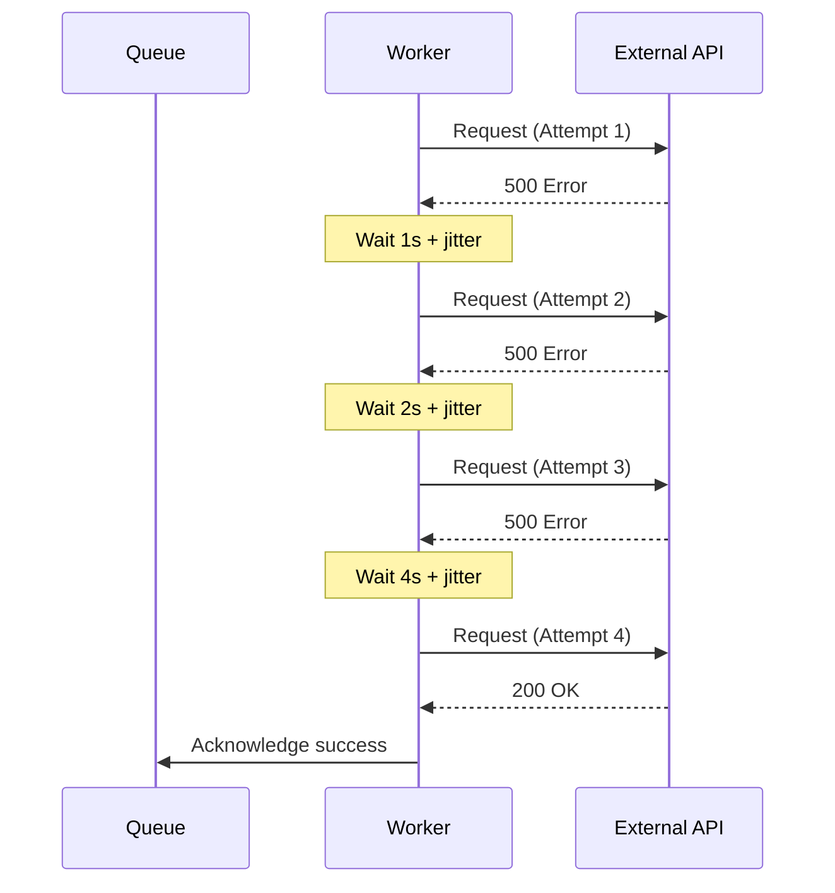
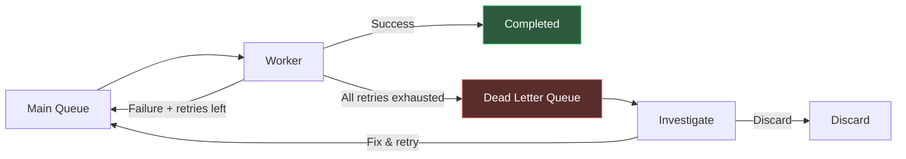
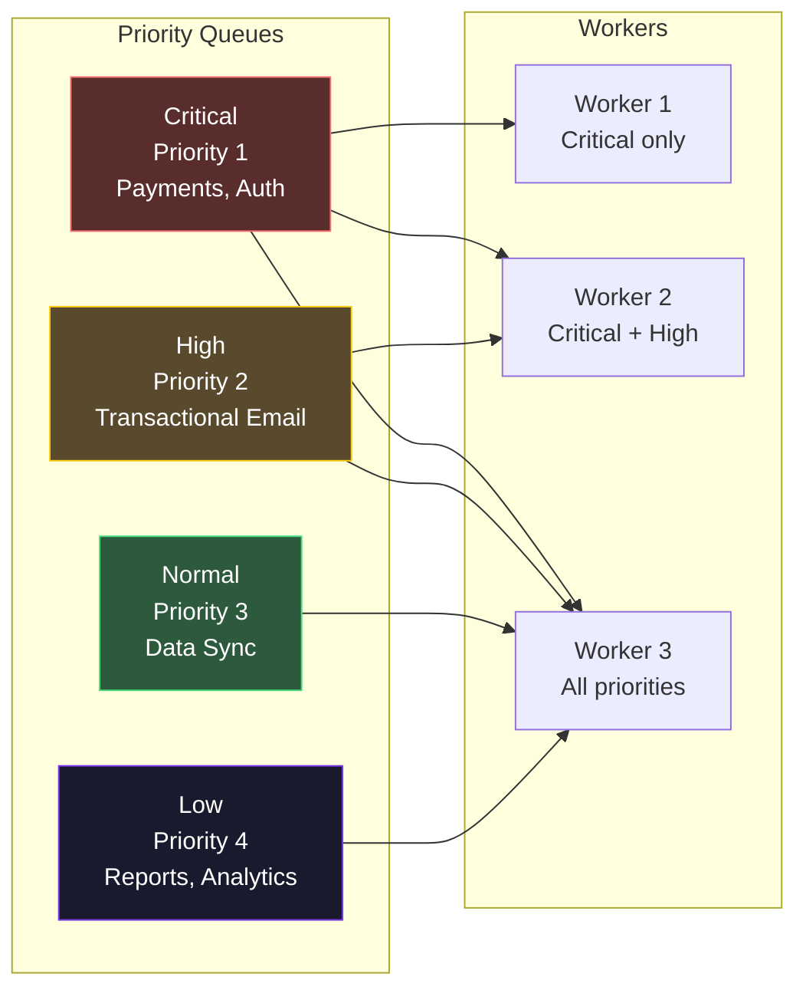
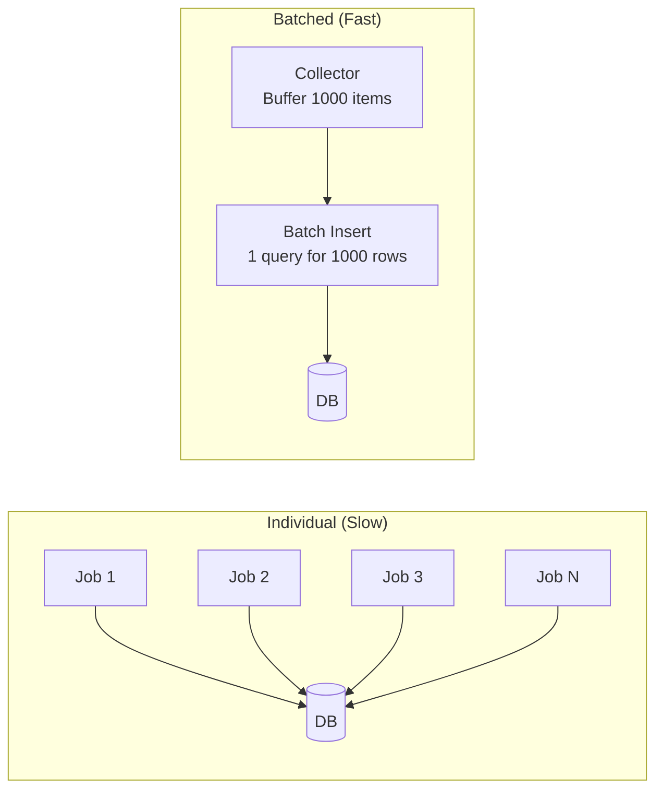
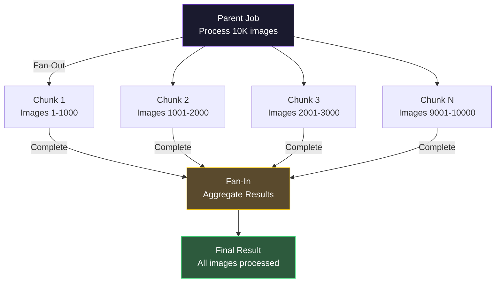

# Job Processing Patterns

## Why Patterns Matter

Every production job queue eventually encounters the same problems: jobs fail and need retrying, some jobs are more important than others, external APIs have rate limits, large workloads need splitting, and jobs have dependencies on each other. These are not unique problems — they are universal, and the solutions are well-established patterns.

This page documents the patterns that separate a fragile job system from a production-grade one. Each pattern includes the problem it solves, when to use it, implementation details, and common pitfalls.

---

## Pattern 1: Retry with Exponential Backoff

### The Problem

Jobs fail. Network requests time out, databases are temporarily unavailable, third-party APIs return 500 errors. A naive retry (immediately re-enqueue on failure) creates a thundering herd -- all failed jobs retry simultaneously, overwhelming the already-struggling service.

### The Solution

Wait before retrying, with each subsequent retry waiting longer (exponential backoff). Add randomized jitter to prevent retry synchronization across workers.



### Implementation

```typescript
interface RetryConfig {
  maxAttempts: number;
  initialDelayMs: number;
  backoffMultiplier: number;
  maxDelayMs: number;
  jitterFactor: number;  // 0 to 1, where 1 = full jitter
}

function calculateDelay(attempt: number, config: RetryConfig): number {
  const exponentialDelay =
    config.initialDelayMs * Math.pow(config.backoffMultiplier, attempt - 1);
  const cappedDelay = Math.min(exponentialDelay, config.maxDelayMs);
  const jitter = cappedDelay * config.jitterFactor * Math.random();
  return Math.floor(cappedDelay - (cappedDelay * config.jitterFactor / 2) + jitter);
}

// BullMQ implementation
const queue = new Queue('api-calls', {
  connection: redisConnection,
  defaultJobOptions: {
    attempts: 5,
    backoff: { type: 'exponential', delay: 1000 },
  },
});
```

### Retry delay progression

| Attempt | Base Delay | With Jitter (range) |
|---------|-----------|---------------------|
| 1 | 1s | 0.5s - 1.5s |
| 2 | 2s | 1s - 3s |
| 3 | 4s | 2s - 6s |
| 4 | 8s | 4s - 12s |
| 5 | 16s | 8s - 24s |
| 6 | 32s | 16s - 48s |
| 7 | 60s (capped) | 30s - 90s |

::: tip Always Add Jitter
Without jitter, if 1,000 jobs fail simultaneously (e.g., a database outage), all 1,000 retry at exactly the same time. With full jitter, retries are spread across the entire delay window. AWS recommends full jitter for all retry strategies -- it provides the best spread at no cost.
:::

### Non-Retryable Errors

Not all errors should be retried. Distinguish between transient and permanent failures:

```typescript
async function processPayment(job: Job<PaymentPayload>): Promise<void> {
  try {
    await paymentGateway.charge(job.data);
  } catch (err) {
    if (err.code === 'card_declined') {
      throw new NonRetryableError(`Card declined: ${err.message}`);
    }
    if (err.code === 'invalid_amount') {
      throw new NonRetryableError(`Invalid amount: ${err.message}`);
    }
    // Unknown/transient errors -- retry with backoff
    throw err;
  }
}
```

---

## Pattern 2: Dead Letter Queues

### The Problem

After all retries are exhausted, what happens to the failed job? If you discard it, you lose business-critical operations. If you re-enqueue it, you create an infinite loop.

### The Solution

Move permanently failed jobs to a dead letter queue (DLQ) for investigation and manual re-processing.



### Implementation

```typescript
worker.on('failed', async (job, err) => {
  if (!job) return;

  if (job.attemptsMade >= (job.opts.attempts ?? 1)) {
    await dlq.add('dead-job', {
      originalJobId: job.id,
      originalQueue: 'orders',
      payload: job.data,
      error: err.message,
      stack: err.stack,
      attemptsMade: job.attemptsMade,
      failedAt: new Date().toISOString(),
    });

    await alerting.send({
      severity: 'warning',
      title: `Job moved to DLQ: ${job.name}`,
      details: `Job ${job.id} failed after ${job.attemptsMade} attempts`,
    });
  }
});
```

Provide an admin API to re-process DLQ jobs individually or in bulk (after fixing the root cause). Always remove the job from the DLQ after re-enqueueing to prevent duplicates.

::: danger Monitor Your DLQ Size
A growing DLQ indicates a systemic problem -- not individual job failures. If the DLQ grows by 100 jobs in an hour, something upstream has broken (API down, data corruption, deployment bug). Alert on DLQ growth rate, not just DLQ size.
:::

---

## Pattern 3: Priority Queues

### The Problem

Not all jobs are equally urgent. A payment confirmation email should be sent before a weekly digest. An order fulfillment job should process before a data analytics sync.

### The Solution

Assign priorities to jobs. Workers process higher-priority jobs first.



**Strategy 1: Separate queues per priority** (recommended). Create dedicated queues (`critical`, `high`, `normal`, `low`) with dedicated workers for critical queues and shared workers that drain in priority order.

**Strategy 2: Single queue with priority field** (simpler). Use the queue's built-in priority mechanism (`priority: 1` for highest). Simpler to set up but no isolation -- a flood of normal jobs still competes for worker slots.

::: tip Avoid Priority Inversion
If you have a single queue with priority, low-priority jobs can starve when a constant stream of high-priority jobs arrives. Use separate queues with dedicated workers to prevent starvation. Reserve at least one worker for each priority level.
:::

---

## Pattern 4: Rate-Limited Workers

### The Problem

External APIs have rate limits. Stripe allows 100 requests per second. SendGrid allows 600 per minute. If your workers send requests faster than the rate limit, you get 429 errors, wasted retries, and potential API key suspension.

### The Solution

Limit the rate at which workers process jobs, matching the external API's rate limit.

```typescript
// BullMQ built-in rate limiter
const worker = new Worker('email-sender', async (job) => {
  await sendGridClient.send({
    to: job.data.to,
    subject: job.data.subject,
    html: job.data.html,
  });
}, {
  connection: redisConnection,
  concurrency: 5,
  limiter: {
    max: 500,         // Maximum 500 jobs
    duration: 60000,  // Per 60 seconds
  },
});
```

For finer control, implement a **token bucket limiter** -- a class that maintains a token count, refills at a fixed rate, and blocks callers when tokens are exhausted. Call `await limiter.acquire()` before each API call.

::: warning Rate Limits Across Multiple Workers
If you run 5 worker instances, each with a rate limit of 100/sec, your total rate is 500/sec -- not 100/sec. Coordinate rate limiting across workers using a shared counter in Redis.
:::

---

## Pattern 5: Batch Processing

### The Problem

Processing items one at a time is inefficient for bulk operations. Inserting 10,000 rows one-by-one is 100x slower than a single batch insert.

### The Solution

Collect items and process them in batches.



Build a `BatchCollector<T>` that buffers items and flushes when either `batchSize` is reached or `flushIntervalMs` elapses:

```typescript
const analyticsCollector = new BatchCollector<AnalyticsEvent>(
  1000,  // Flush every 1000 events
  5000,  // Or every 5 seconds
  async (events) => {
    await db.query(
      `INSERT INTO analytics_events (user_id, event, properties, created_at)
       SELECT * FROM unnest($1::text[], $2::text[], $3::jsonb[], $4::timestamp[])`,
      [
        events.map(e => e.userId),
        events.map(e => e.event),
        events.map(e => JSON.stringify(e.properties)),
        events.map(e => e.createdAt.toISOString()),
      ]
    );
  }
);
```

For large exports, split work into chunk jobs. The parent calculates total rows, creates chunk jobs with `offset`/`limit`, each chunk stores results to S3, and an atomic Redis counter tracks completions.

---

## Pattern 6: Fan-Out / Fan-In

### The Problem

A single task needs to be split into parallel subtasks (fan-out), and the results must be collected when all subtasks complete (fan-in).

### The Solution



### Implementation with BullMQ Flows

```typescript
import { FlowProducer } from 'bullmq';
const flowProducer = new FlowProducer({ connection: redisConnection });

// Parent job runs AFTER all children complete
await flowProducer.add({
  name: 'aggregate-results',
  queueName: 'aggregation',
  data: { reportId: 'report-123' },
  children: [
    { name: 'process-chunk', queueName: 'processing', data: { chunk: 1 } },
    { name: 'process-chunk', queueName: 'processing', data: { chunk: 2 } },
    { name: 'process-chunk', queueName: 'processing', data: { chunk: 3 } },
  ],
});
```

### Fan-In with Redis Counters

For manual fan-in without BullMQ Flows, each chunk stores its result in a Redis hash and atomically increments a completion counter. When the counter equals the total chunks, the last chunk to finish enqueues the aggregation job.

---

## Pattern 7: Scheduled and Recurring Jobs

### The Problem

Some work must happen at specific times (send a reminder 24 hours after signup) or on a recurring schedule (generate daily reports at 2 AM).

### Implementation

```typescript
// Delayed job -- process at a future time
await queue.add('send-reminder', {
  userId: '123',
  message: 'Complete your profile!',
}, {
  delay: 24 * 60 * 60 * 1000,  // 24 hours from now
});

// Recurring job with BullMQ repeat
await queue.add('daily-report', {
  reportType: 'revenue',
}, {
  repeat: {
    pattern: '0 2 * * *',  // Every day at 2 AM
    tz: 'America/New_York',
  },
  jobId: 'daily-revenue-report',  // Prevent duplicates
});
```

::: tip Prevent Duplicate Scheduled Jobs
When using repeatable jobs, always set a `jobId`. Without it, restarting your application creates duplicate scheduled jobs. BullMQ uses the `jobId` + `repeat` configuration to deduplicate.
:::

---

## Pattern 8: Job Chaining

### The Problem

Jobs have dependencies -- Job B cannot start until Job A completes. A simple approach (enqueue Job B at the end of Job A) tightly couples the jobs and makes error handling complex.

### Implementation

```typescript
// BullMQ Flow -- declarative job dependencies
const flowProducer = new FlowProducer({ connection: redisConnection });

await flowProducer.add({
  name: 'send-confirmation',
  queueName: 'emails',
  data: { orderId: '123' },
  children: [
    {
      name: 'generate-invoice',
      queueName: 'invoices',
      data: { orderId: '123' },
      children: [
        {
          name: 'charge-payment',
          queueName: 'payments',
          data: { orderId: '123', amount: 99.99 },
        },
      ],
    },
  ],
});
// Execution order: charge-payment -> generate-invoice -> send-confirmation
```


### Dynamic Chaining

For conditional workflows, enqueue the next job based on the result of the current one:

```typescript
const worker = new Worker('order-processor', async (job) => {
  const result = await processOrderStep(job.data);

  if (result.requiresApproval) {
    await approvalQueue.add('manual-review', {
      orderId: job.data.orderId,
      reason: result.flagReason,
    });
  } else {
    await fulfillmentQueue.add('fulfill-order', {
      orderId: job.data.orderId,
      items: result.items,
    });
  }

  return result;
}, { connection: redisConnection });
```

---

## Pattern 9: Idempotent Job Processing

### The Problem

At-least-once delivery means jobs can be processed more than once. Without idempotency, duplicate processing causes duplicate charges, duplicate emails, or duplicate database records.

### Implementation

```typescript
// Idempotent job wrapper using Redis SET NX
function makeIdempotent<T>(
  handler: (job: Job<T>) => Promise<void>,
  keyExtractor: (job: Job<T>) => string,
  ttlSeconds: number
): (job: Job<T>) => Promise<void> {
  return async (job: Job<T>) => {
    const key = `idempotency:${keyExtractor(job)}`;
    const acquired = await redis.set(key, 'processing', 'EX', ttlSeconds, 'NX');

    if (!acquired) {
      const status = await redis.get(key);
      if (status === 'completed') return;  // Already processed
      if (status === 'processing') {
        throw new Error('Job is being processed by another worker');
      }
    }

    try {
      await handler(job);
      await redis.set(key, 'completed', 'EX', ttlSeconds);
    } catch (err) {
      await redis.del(key);  // Allow retry
      throw err;
    }
  };
}

// Usage
const sendEmail = makeIdempotent(
  async (job: Job<EmailPayload>) => {
    await emailService.send(job.data);
  },
  (job) => `email:${job.data.to}:${job.data.templateId}:${job.data.orderId}`,
  86400  // 24-hour TTL
);
```

---

## Pattern Summary

| Pattern | Problem | Key Mechanism | Complexity |
|---------|---------|---------------|------------|
| Retry with backoff | Transient failures | Exponential delay + jitter | Low |
| Dead letter queue | Permanent failures | Separate queue for investigation | Low |
| Priority queues | Job urgency differences | Multiple queues or priority field | Medium |
| Rate-limited workers | External API rate limits | Token bucket or sliding window | Medium |
| Batch processing | Inefficient one-by-one processing | Buffer + flush | Medium |
| Fan-out/fan-in | Parallel subtask processing | Split + counter + aggregate | High |
| Scheduled jobs | Time-based execution | Cron patterns or delayed enqueue | Low |
| Job chaining | Task dependencies | Flow dependencies or dynamic enqueue | Medium |
| Idempotent processing | Duplicate job execution | Idempotency key + dedup check | Medium |

::: tip Combine Patterns
These patterns are not mutually exclusive. A production job system typically uses 5-7 of them simultaneously. For example: priority queues (Pattern 3) with retry backoff (Pattern 1), dead letter queues (Pattern 2), rate limiting (Pattern 4), and idempotency (Pattern 9). Layer them intentionally -- each pattern solves a specific failure mode.
:::

See also: [Background Jobs Overview](/system-design/background-jobs/) for job lifecycle fundamentals, [Temporal Deep Dive](/system-design/background-jobs/temporal) for durable workflow orchestration, [Job Queue Comparison](/system-design/background-jobs/comparison) for choosing a queue technology, and [Dead Letter Queues](/system-design/message-queues/dead-letter-queues) for the infrastructure-level DLQ pattern.
