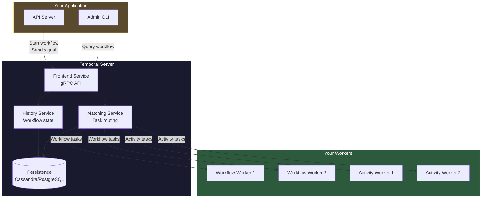
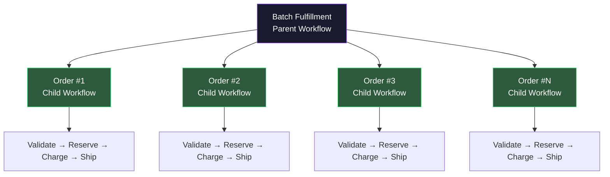

# Temporal Deep Dive

## Why Temporal Exists

Traditional job queues solve a simple problem: process work asynchronously. But real-world business processes are not simple jobs — they are workflows with branching logic, error handling, timeouts, human approvals, retries, and state that must survive server crashes.

Consider an order fulfillment workflow:

1. Validate payment
2. Reserve inventory
3. If inventory is unavailable, wait up to 48 hours for restock
4. Charge the credit card
5. If charge fails, release inventory and notify customer
6. Generate shipping label
7. Send confirmation email
8. Wait for delivery webhook (could be days)
9. Update order status

Building this with a traditional job queue requires: 8 job types, a state machine in your database, compensating transactions for every failure, timeout monitoring, and careful coordination between jobs. Each piece can fail independently, and the combination of failure modes creates a testing matrix that grows exponentially.

Temporal eliminates this complexity. You write the workflow as a simple function. Temporal handles: retries, state persistence, timeouts, error propagation, worker crashes, and replay. If a worker crashes halfway through step 4, Temporal replays the workflow from the beginning but skips the already-completed activities.

### Temporal vs. Traditional Queues

| Capability | Traditional Queue | Temporal |
|-----------|-------------------|----------|
| Simple async job | Built for this | Works, but overkill |
| Multi-step workflow | Manual state machine | Native workflow function |
| Error compensation (saga) | Manual rollback jobs | Built-in with Temporal |
| Long-running (days/weeks) | Timer + polling | Native durable timer |
| Human-in-the-loop | External system | Signals |
| Visibility into running jobs | Limited | Full workflow history |
| Versioning running workflows | Not applicable | Built-in versioning |

---

## Core Concepts

### Architecture



### Workflows

A workflow is a deterministic function that orchestrates activities. It must be deterministic because Temporal replays it from the beginning when recovering from failures.

```typescript
// workflows/order-fulfillment.ts
import {
  proxyActivities,
  sleep,
  condition,
  defineSignal,
  defineQuery,
  setHandler,
} from '@temporalio/workflow';

import type * as activities from '../activities';

const {
  validatePayment,
  reserveInventory,
  chargeCard,
  releaseInventory,
  generateShippingLabel,
  sendConfirmationEmail,
  notifyCustomer,
} = proxyActivities<typeof activities>({
  startToCloseTimeout: '30 seconds',
  retry: {
    maximumAttempts: 3,
    initialInterval: '1 second',
    backoffCoefficient: 2,
    maximumInterval: '30 seconds',
    nonRetryableErrorTypes: ['InvalidPaymentError', 'FraudDetectedError'],
  },
});

// Signals — external events that affect the workflow
const deliveryConfirmedSignal = defineSignal<[{ trackingId: string }]>(
  'deliveryConfirmed'
);
const cancelOrderSignal = defineSignal('cancelOrder');

// Queries — read workflow state without modifying it
const orderStatusQuery = defineQuery<OrderStatus>('orderStatus');

interface OrderInput {
  orderId: string;
  userId: string;
  items: OrderItem[];
  paymentMethodId: string;
}

export async function orderFulfillmentWorkflow(
  input: OrderInput
): Promise<OrderResult> {
  let status: OrderStatus = 'validating_payment';
  let cancelled = false;
  let deliveryInfo: { trackingId: string } | null = null;

  // Set up query handler
  setHandler(orderStatusQuery, () => status);

  // Set up cancel signal handler
  setHandler(cancelOrderSignal, () => {
    cancelled = true;
  });

  // Set up delivery confirmation handler
  setHandler(deliveryConfirmedSignal, (info) => {
    deliveryInfo = info;
  });

  // Step 1: Validate payment
  await validatePayment({ userId: input.userId, paymentMethodId: input.paymentMethodId, amount: calculateTotal(input.items) });
  if (cancelled) return { status: 'cancelled', reason: 'Customer cancelled' };

  // Step 2: Reserve inventory (wait up to 48h for restock if unavailable)
  status = 'reserving_inventory';
  const reservation = await reserveInventory({ orderId: input.orderId, items: input.items });
  if (!reservation.success) {
    status = 'waiting_for_restock';
    const restocked = await condition(() => cancelled, '48 hours');
    if (cancelled || !restocked) {
      await notifyCustomer({ userId: input.userId, message: 'Order cancelled — out of stock.' });
      return { status: 'cancelled', reason: 'Out of stock' };
    }
  }

  // Step 3: Charge the card (compensate on failure)
  status = 'charging_payment';
  try {
    await chargeCard({ userId: input.userId, paymentMethodId: input.paymentMethodId, amount: calculateTotal(input.items), orderId: input.orderId });
  } catch (err) {
    await releaseInventory({ orderId: input.orderId, items: input.items });
    await notifyCustomer({ userId: input.userId, message: 'Payment failed.' });
    return { status: 'failed', reason: 'Payment failed' };
  }

  // Step 4-5: Ship and confirm
  status = 'generating_label';
  const label = await generateShippingLabel({ orderId: input.orderId, items: input.items });
  await sendConfirmationEmail({ userId: input.userId, orderId: input.orderId, trackingNumber: label.trackingNumber });

  // Step 6: Wait for delivery (could be days)
  status = 'awaiting_delivery';
  await condition(() => deliveryInfo !== null || cancelled, '30 days');

  if (deliveryInfo) return { status: 'delivered', trackingId: deliveryInfo.trackingId };
  return { status: 'delivery_timeout' };
}
```

::: danger Workflow Determinism Rules
Workflow code MUST be deterministic. Temporal replays it to rebuild state. These are forbidden inside workflows:
- `Math.random()` — use `workflow.random()` instead
- `Date.now()` — use `workflow.now()` instead
- `setTimeout` / `setInterval` — use `workflow.sleep()` instead
- Network calls, database queries — use Activities instead
- Reading environment variables — pass values as workflow input

Violating determinism causes non-determinism errors during replay, which halt the workflow.
:::

### Activities

Activities are the non-deterministic side-effect-producing functions. They make API calls, query databases, send emails — all the real work:

```typescript
// activities/index.ts
import Stripe from 'stripe';
import { ApplicationFailure } from '@temporalio/activity';

const stripe = new Stripe(process.env.STRIPE_SECRET_KEY!);

export async function validatePayment(input: {
  userId: string;
  paymentMethodId: string;
  amount: number;
}): Promise<{ valid: boolean }> {
  const paymentMethod = await stripe.paymentMethods.retrieve(
    input.paymentMethodId
  );
  if (paymentMethod.customer !== input.userId) {
    // Non-retryable: permanent business logic failure
    throw ApplicationFailure.nonRetryable(
      'Payment method does not belong to user',
      'InvalidPaymentError'
    );
  }
  return { valid: true };
}

export async function chargeCard(input: {
  userId: string; paymentMethodId: string;
  amount: number; orderId: string;
}): Promise<{ chargeId: string }> {
  const paymentIntent = await stripe.paymentIntents.create({
    amount: Math.round(input.amount * 100),
    currency: 'usd',
    customer: input.userId,
    payment_method: input.paymentMethodId,
    confirm: true,
    idempotency_key: `order_${input.orderId}`,
  });
  return { chargeId: paymentIntent.id };
}
// Other activities (reserveInventory, releaseInventory, etc.)
// follow the same pattern: API calls + nonRetryable for permanent errors
```

---

## Signals and Queries

### Signals: External Events

Signals deliver data to a running workflow from the outside. The workflow does not poll -- it waits for the signal. From your API server, get a workflow handle and call `handle.signal()`:

```typescript
// Delivery webhook handler
app.post('/webhooks/delivery', async (req, res) => {
  const { orderId, trackingId, status } = req.body;
  if (status === 'delivered') {
    const handle = client.workflow.getHandle(`order-${orderId}`);
    await handle.signal(deliveryConfirmedSignal, { trackingId });
  }
  res.sendStatus(200);
});

// Customer cancellation
app.post('/orders/:id/cancel', async (req, res) => {
  const handle = client.workflow.getHandle(`order-${req.params.id}`);
  await handle.signal(cancelOrderSignal);
  res.json({ message: 'Cancellation requested' });
});
```

### Queries: Read Workflow State

Queries let you read the current state of a running workflow without modifying it. Call `handle.query(orderStatusQuery)` from your API server. The query handler runs inside the workflow and returns the current value of workflow-local variables. Queries are synchronous and read-only -- they cannot modify workflow state or schedule activities.

---

## Child Workflows

Complex workflows can spawn child workflows for parallel execution or logical isolation. Use `executeChild()` to start a child and wait for its result, or `startChild()` for fire-and-forget. Set `ParentClosePolicy` to control what happens to children if the parent is cancelled.



A parent workflow can batch child executions (e.g., process 10 orders concurrently) using `Promise.all()` with `executeChild()`. The parent waits for all children to complete and aggregates results.

---

## Saga Pattern with Temporal

The saga pattern coordinates distributed transactions with compensating actions. Temporal makes sagas trivial:

```typescript
export async function bookTripWorkflow(
  input: TripBookingInput
): Promise<TripBookingResult> {
  const compensations: Array<() => Promise<void>> = [];

  try {
    const flight = await bookFlight(input);
    compensations.push(() => cancelFlight({ bookingId: flight.bookingId }));

    const hotel = await bookHotel(input);
    compensations.push(() => cancelHotel({ bookingId: hotel.bookingId }));

    const car = await bookCarRental(input);
    compensations.push(() => cancelCarRental({ bookingId: car.bookingId }));

    await chargeCustomer({
      customerId: input.customerId,
      amount: flight.price + hotel.price + car.price,
    });

    return { status: 'confirmed', flight, hotel, car };
  } catch (err) {
    // Run compensations in reverse order
    for (const compensate of compensations.reverse()) {
      await compensate().catch(e => console.error('Compensation failed:', e));
    }
    throw err;
  }
}
```

::: tip Compensations are NOT Rollbacks
A compensation undoes the business effect, not the technical state. `cancelFlight()` creates a new cancellation transaction -- the original booking record still exists, marked as cancelled.
:::

---

## Workflow Versioning

When you change a workflow's logic, running workflows still execute the old code (via replay). You must use versioning to handle this:

```typescript
import { patched, deprecatePatch } from '@temporalio/workflow';

export async function orderFulfillmentWorkflow(
  input: OrderInput
): Promise<OrderResult> {
  // ... earlier steps ...

  // Version 1: Original — just charge the card
  // Version 2: Added fraud check before charging
  if (patched('add-fraud-check')) {
    // New code path — only executed by new workflow runs
    const fraudResult = await checkForFraud({
      userId: input.userId,
      amount: calculateTotal(input.items),
      orderId: input.orderId,
    });

    if (fraudResult.isFraudulent) {
      await releaseInventory({
        orderId: input.orderId,
        items: input.items,
      });
      return { status: 'rejected', reason: 'Fraud detected' };
    }
  }
  // Existing workflows replay without the fraud check — determinism preserved

  await chargeCard({
    userId: input.userId,
    paymentMethodId: input.paymentMethodId,
    amount: calculateTotal(input.items),
    orderId: input.orderId,
  });

  // ... remaining steps ...
}
```

### Versioning Lifecycle

1. **Version 1**: Original workflow code
2. **Version 2**: Wrap new logic in `if (patched('patch-name'))`. Running V1 workflows continue unmodified; new workflows execute the patched path.
3. **Version 3**: After all V1 workflows complete, call `deprecatePatch('patch-name')` and remove the old code path entirely.

---

## Failure Handling

### Activity Retry Policies

```typescript
const activities = proxyActivities<typeof activities>({
  startToCloseTimeout: '30 seconds',
  retry: {
    // Maximum number of attempts (including the first)
    maximumAttempts: 5,
    // First retry after 1 second
    initialInterval: '1 second',
    // Exponential backoff multiplier
    backoffCoefficient: 2,
    // Cap the retry interval
    maximumInterval: '1 minute',
    // These error types skip retries entirely
    nonRetryableErrorTypes: [
      'InvalidPaymentError',
      'FraudDetectedError',
      'ResourceNotFoundError',
    ],
  },
});
```

### Timeouts

Temporal provides multiple timeout types:

| Timeout | What It Controls | Default |
|---------|-----------------|---------|
| `startToCloseTimeout` | Max time for a single activity attempt | Required |
| `scheduleToCloseTimeout` | Max time including all retries | None |
| `scheduleToStartTimeout` | Max time waiting in the task queue | None |
| `heartbeatTimeout` | Max time between heartbeats | None |

### Heartbeats for Long-Running Activities

For activities that run for minutes (file processing, large data imports), call `heartbeat()` periodically with progress data. If the worker crashes, Temporal restarts the activity on another worker. The heartbeat data is passed to the new attempt, allowing it to resume from where the previous attempt stopped. Set `heartbeatTimeout` on the activity options to control how long Temporal waits before considering the activity stalled.

---

## Worker and Client Setup

Workers connect to the Temporal server via `NativeConnection`, then register workflows and activities on a specific task queue. Key configuration: `maxConcurrentActivityTaskExecutions` (default 100), `maxConcurrentWorkflowTaskExecutions` (default 40). Handle `SIGINT`/`SIGTERM` with `worker.shutdown()` for graceful drain.

From your application, create a `Client`, then start workflows with `client.workflow.start()`. Each workflow gets a unique `workflowId` (e.g., `order-${orderId}`) and is assigned to a `taskQueue`. Set `workflowExecutionTimeout` to bound maximum execution time.

```typescript
// Start a workflow from an API handler
app.post('/orders', async (req, res) => {
  const orderId = crypto.randomUUID();
  const handle = await client.workflow.start(orderFulfillmentWorkflow, {
    taskQueue: 'order-fulfillment',
    workflowId: `order-${orderId}`,
    args: [{
      orderId,
      userId: req.user.id,
      items: req.body.items,
      paymentMethodId: req.body.paymentMethodId,
    }],
    workflowExecutionTimeout: '30 days',
  });
  res.status(201).json({ orderId, workflowId: handle.workflowId });
});
```

---

## When to Use Temporal vs. Simple Queues

| Scenario | Simple Queue | Temporal |
|----------|-------------|----------|
| Send an email | Yes | Overkill |
| Process an image | Yes | Overkill |
| Multi-step order fulfillment | Painful | Yes |
| Saga with compensations | Very painful | Yes |
| Wait for external events (days) | Polling + timers | Native signals |
| Long-running subscriptions | Complex state machine | Simple workflow |
| Scheduled recurring jobs | Cron + queue | Cron workflows |

::: tip Temporal is Not a Job Queue
Do not use Temporal as a replacement for BullMQ or Celery for simple fire-and-forget jobs. Temporal's overhead (history events, replay, persistence) is wasted on `sendEmail(to, subject, body)`. Use Temporal when you need durable orchestration — multi-step processes that span minutes, hours, or days and must survive infrastructure failures.
:::

See also: [Background Jobs Overview](/system-design/background-jobs/) for fundamentals, [Job Queue Comparison](/system-design/background-jobs/comparison) for choosing between Temporal and alternatives, and [Job Processing Patterns](/system-design/background-jobs/patterns) for retry and fan-out patterns.
