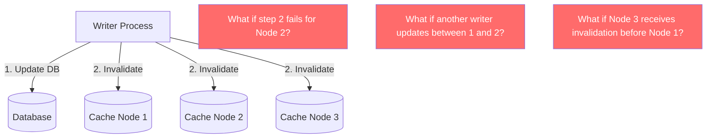
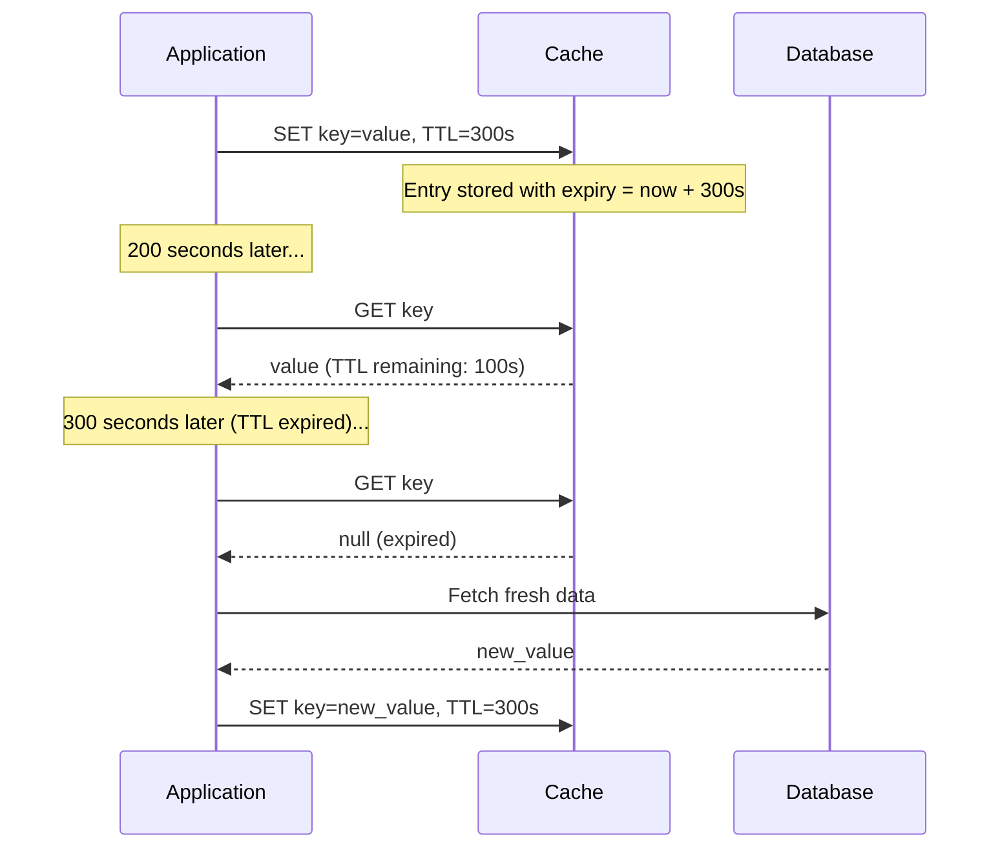
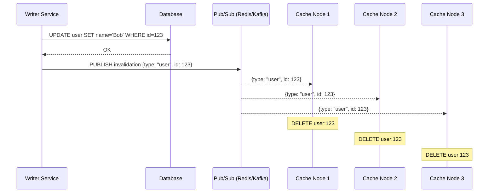
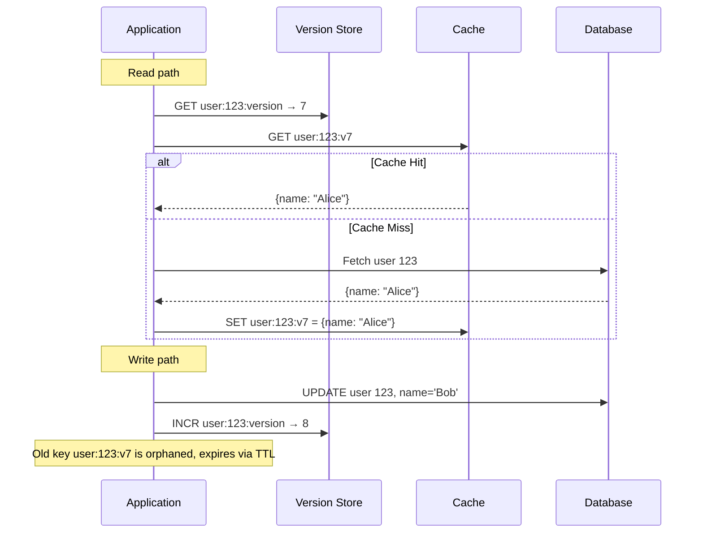
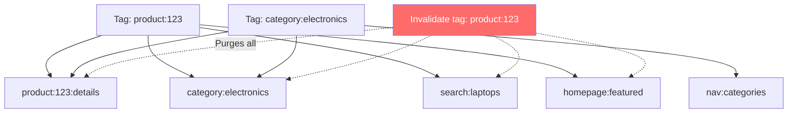
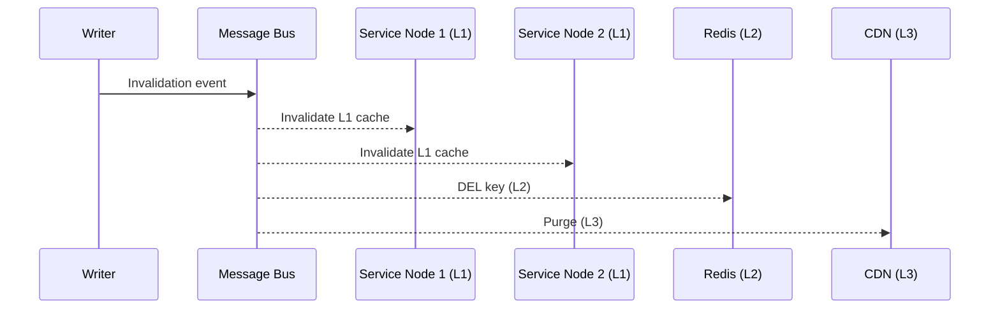
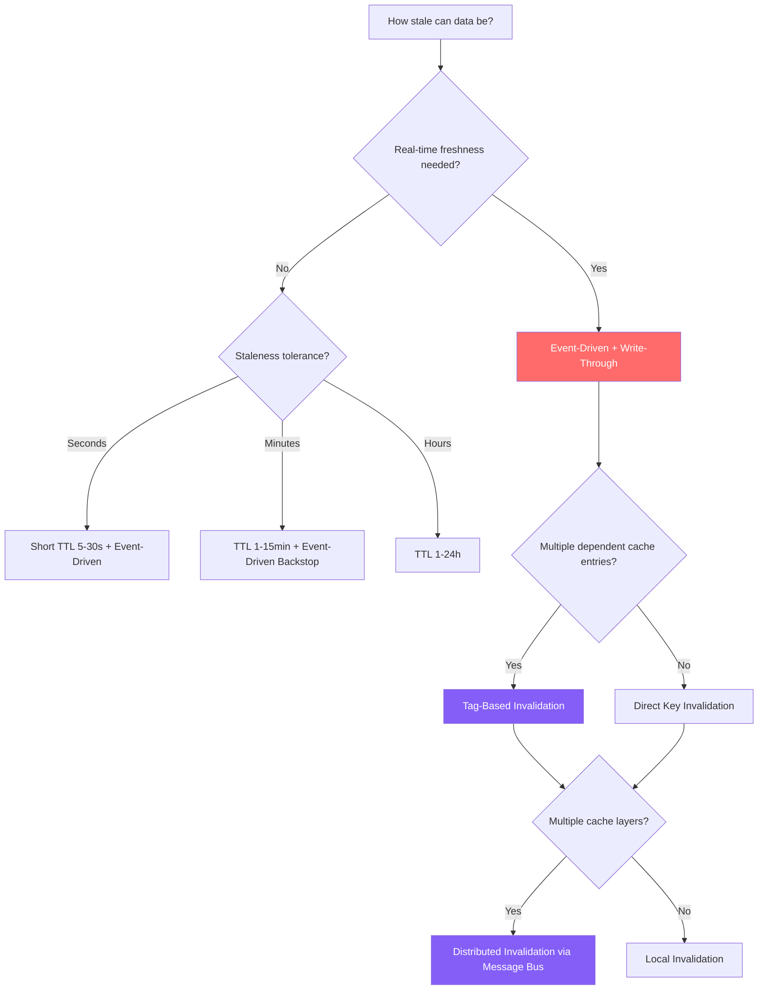

# Cache Invalidation

Phil Karlton's famous quote — "There are only two hard things in Computer Science: cache invalidation and naming things" — is not hyperbole. Cache invalidation is genuinely one of the hardest problems in systems engineering because it requires coordinating state across multiple systems with different failure modes, latency characteristics, and consistency guarantees. Every invalidation strategy trades off between freshness, performance, complexity, and reliability. Get it wrong and you serve stale data to millions of users. Get it really wrong and you create feedback loops that are impossible to debug.

## Why Invalidation Is Hard

The fundamental tension: a cache exists to avoid going to the source of truth, but the source of truth is the only place that knows when the cached data is stale. This creates a coordination problem — the system that knows the data changed (the writer) may be completely decoupled from the system that cached it (the reader).

Invalidation is hard because of these constraints:

1. **Distributed state:** Cache and database are separate systems with separate failure modes
2. **Concurrency:** Multiple writers can update the same data simultaneously
3. **Ordering:** Network messages can arrive out of order
4. **Partial failure:** The invalidation message may succeed or fail independently of the write
5. **Scale:** Invalidating across hundreds of cache nodes, CDN PoPs, and in-process caches
6. **Composition:** Cached data may be derived from multiple source records



## First Principles

Every invalidation strategy answers these questions:

1. **When** should the cached value be considered stale? (Time-based, event-based, or version-based?)
2. **Who** is responsible for triggering invalidation? (The writer, the cache, or a third party?)
3. **How** is invalidation propagated? (Direct delete, broadcast, pubsub, or polling?)
4. **What** happens during the invalidation window? (Serve stale, return error, or block?)

---

## TTL-Based Invalidation

Time-to-live (TTL) is the simplest and most commonly used invalidation strategy. Every cache entry has an expiration time. When the TTL expires, the entry is removed (or marked stale) and the next access triggers a fresh load from the source of truth.

### How It Works



### TypeScript Implementation

```typescript
class TTLCache<T> {
  private redis: Redis;
  private defaultTtl: number;
  private prefix: string;

  constructor(redis: Redis, options: { defaultTtl: number; prefix: string }) {
    this.redis = redis;
    this.defaultTtl = options.defaultTtl;
    this.prefix = options.prefix;
  }

  private key(id: string): string {
    return `${this.prefix}:${id}`;
  }

  async get(
    id: string,
    fetcher: () => Promise<T | null>
  ): Promise<T | null> {
    const cached = await this.redis.get(this.key(id));
    if (cached !== null) {
      return JSON.parse(cached) as T;
    }

    const fresh = await fetcher();
    if (fresh !== null) {
      await this.set(id, fresh);
    }
    return fresh;
  }

  async set(id: string, value: T, ttl?: number): Promise<void> {
    await this.redis.set(
      this.key(id),
      JSON.stringify(value),
      'EX',
      ttl ?? this.defaultTtl
    );
  }

  /**
   * Set with jittered TTL to prevent thundering herd on expiry.
   * Adds ±15% random jitter to the base TTL.
   */
  async setWithJitter(id: string, value: T, baseTtl?: number): Promise<void> {
    const base = baseTtl ?? this.defaultTtl;
    const jitter = base * 0.15;
    const ttl = Math.floor(base + (Math.random() * 2 - 1) * jitter);
    await this.set(id, value, ttl);
  }
}
```

### Choosing TTL Values

TTL selection is a trade-off between freshness and cache hit rate:

$$
\text{Expected staleness} = \frac{\text{TTL}}{2}
$$

On average, cached data is stale by half the TTL duration. For a 5-minute TTL, the average staleness is 2.5 minutes.

| Data Type | Recommended TTL | Rationale |
|-----------|-----------------|-----------|
| Static assets (JS, CSS, images) | 1 year (immutable with content hash) | Content-addressed, never changes |
| User session data | 15-30 minutes | Matches session timeout |
| Product catalog | 5-15 minutes | Changes infrequently, short staleness acceptable |
| User profile | 1-5 minutes | Changes occasionally, users expect quick updates |
| Feature flags | 30-60 seconds | Need fast propagation of flag changes |
| Real-time prices/inventory | 5-15 seconds | Staleness directly impacts business |
| Authentication tokens | Match token expiry | Security-critical, must expire on time |

### TTL Jitter

If all cache entries for a frequently-accessed dataset are set with the same TTL, they all expire at the same time, causing a **thundering herd**. The solution is TTL jitter — adding a random offset to each entry's TTL.

$$
\text{TTL}_{\text{actual}} = \text{TTL}_{\text{base}} + \text{Uniform}(-j, +j)
$$

where $j$ is the jitter range (typically 10-20% of the base TTL).

### Limitations of TTL-Only Invalidation

- **Staleness is guaranteed:** Data is always stale by up to the full TTL duration.
- **No early invalidation:** Even if you know the data changed, you can't tell TTL-based caches to refresh early (without adding another mechanism).
- **TTL too short:** High miss rate, increased origin load.
- **TTL too long:** Stale data served for extended periods.

---

## Event-Driven Invalidation (Pub/Sub)

Event-driven invalidation uses a messaging system to propagate invalidation signals in near-real-time. When data changes, the writer publishes an invalidation event. All cache nodes subscribe to these events and invalidate their local copies.

### How It Works



### TypeScript Implementation

```typescript
interface InvalidationEvent {
  type: string;
  id: string;
  timestamp: number;
  source: string; // Which service triggered the invalidation
}

class EventDrivenCacheInvalidator {
  private redis: Redis;
  private subscriber: Redis;
  private channel: string;
  private localCache: Map<string, { value: unknown; setAt: number }>;

  constructor(redis: Redis, channel: string) {
    this.redis = redis;
    this.subscriber = redis.duplicate();
    this.channel = channel;
    this.localCache = new Map();
  }

  async start(): Promise<void> {
    await this.subscriber.subscribe(this.channel);

    this.subscriber.on('message', (_channel: string, message: string) => {
      try {
        const event: InvalidationEvent = JSON.parse(message);
        this.handleInvalidation(event);
      } catch (err) {
        console.error('Failed to process invalidation event:', err);
      }
    });
  }

  private async handleInvalidation(event: InvalidationEvent): Promise<void> {
    const cacheKey = `${event.type}:${event.id}`;

    // Check if our cached version is older than the invalidation event
    const entry = this.localCache.get(cacheKey);
    if (entry && entry.setAt < event.timestamp) {
      this.localCache.delete(cacheKey);
    }

    // Also invalidate in Redis (distributed cache)
    await this.redis.del(cacheKey);
  }

  async publishInvalidation(type: string, id: string): Promise<void> {
    const event: InvalidationEvent = {
      type,
      id,
      timestamp: Date.now(),
      source: process.env.SERVICE_NAME ?? 'unknown',
    };

    await this.redis.publish(this.channel, JSON.stringify(event));
  }

  async stop(): Promise<void> {
    await this.subscriber.unsubscribe(this.channel);
    await this.subscriber.quit();
  }
}

// Usage in a write path
class UserService {
  private db: Pool;
  private invalidator: EventDrivenCacheInvalidator;

  constructor(db: Pool, invalidator: EventDrivenCacheInvalidator) {
    this.db = db;
    this.invalidator = invalidator;
  }

  async updateUser(id: string, name: string): Promise<void> {
    // Step 1: Update database
    await this.db.query('UPDATE users SET name = $1 WHERE id = $2', [name, id]);

    // Step 2: Publish invalidation event
    await this.invalidator.publishInvalidation('user', id);
  }
}
```

### Database-Triggered Invalidation

Instead of relying on application code to publish invalidation events (which is error-prone — a developer might forget), you can use the database itself as the event source:

- **PostgreSQL:** Use `LISTEN`/`NOTIFY` or logical replication (WAL)
- **MySQL:** Parse the binlog with tools like Debezium
- **MongoDB:** Use Change Streams

```typescript
// PostgreSQL LISTEN/NOTIFY approach
class PostgresInvalidationListener {
  private client: pg.Client;
  private redis: Redis;

  async start(): Promise<void> {
    await this.client.connect();
    await this.client.query('LISTEN cache_invalidation');

    this.client.on('notification', async (msg) => {
      if (msg.channel === 'cache_invalidation' && msg.payload) {
        const { table, id } = JSON.parse(msg.payload);
        await this.redis.del(`${table}:${id}`);
      }
    });
  }
}

// In PostgreSQL, create a trigger:
// CREATE OR REPLACE FUNCTION notify_cache_invalidation()
// RETURNS TRIGGER AS $$
// BEGIN
//   PERFORM pg_notify('cache_invalidation',
//     json_build_object('table', TG_TABLE_NAME, 'id', NEW.id)::text
//   );
//   RETURN NEW;
// END;
// $$ LANGUAGE plpgsql;
//
// CREATE TRIGGER users_cache_invalidation
// AFTER INSERT OR UPDATE OR DELETE ON users
// FOR EACH ROW EXECUTE FUNCTION notify_cache_invalidation();
```

### Failure Modes of Event-Driven Invalidation

| Failure | Impact | Mitigation |
|---------|--------|------------|
| Pub/sub message lost | Cache never invalidated, serves stale data forever | TTL as backstop, at-least-once delivery (Kafka vs Redis pub/sub) |
| Consumer disconnected during publish | Missed invalidation events | Durable subscriptions (Kafka consumer groups), catch-up on reconnect |
| Out-of-order events | Newer data overwritten by older invalidation | Include timestamps, only invalidate if event is newer than cached version |
| High event volume | Consumer can't keep up, growing lag | Batch invalidation, increase consumer parallelism |

::: warning Redis Pub/Sub Is Fire-and-Forget
Redis Pub/Sub does NOT guarantee delivery. If a subscriber is disconnected when a message is published, that message is lost. For critical invalidation, use Redis Streams (with consumer groups) or Kafka. Use Redis Pub/Sub only when TTL provides an acceptable backstop.
:::

---

## Versioned Keys

Versioned keys eliminate the need for explicit invalidation entirely. Instead of invalidating a cache entry when data changes, you **change the cache key** so that old entries are simply never accessed again.

### How It Works



### TypeScript Implementation

```typescript
class VersionedKeyCache<T> {
  private redis: Redis;
  private ttlSeconds: number;
  private prefix: string;

  constructor(redis: Redis, options: { ttlSeconds: number; prefix: string }) {
    this.redis = redis;
    this.ttlSeconds = options.ttlSeconds;
    this.prefix = options.prefix;
  }

  private versionKey(id: string): string {
    return `${this.prefix}:${id}:version`;
  }

  private dataKey(id: string, version: number): string {
    return `${this.prefix}:${id}:v${version}`;
  }

  async get(id: string, fetcher: () => Promise<T | null>): Promise<T | null> {
    // Step 1: Get current version
    const versionStr = await this.redis.get(this.versionKey(id));
    const version = versionStr ? parseInt(versionStr, 10) : 0;

    // Step 2: Try to get data at current version
    const dataStr = await this.redis.get(this.dataKey(id, version));
    if (dataStr !== null) {
      return JSON.parse(dataStr) as T;
    }

    // Step 3: Cache miss — fetch from DB
    const data = await fetcher();
    if (data !== null) {
      await this.redis.set(
        this.dataKey(id, version),
        JSON.stringify(data),
        'EX',
        this.ttlSeconds
      );
    }
    return data;
  }

  async invalidate(id: string): Promise<number> {
    // Increment version — old keys become orphans
    const newVersion = await this.redis.incr(this.versionKey(id));
    return newVersion;
  }

  async write(
    id: string,
    data: T,
    dbWriter: () => Promise<void>
  ): Promise<void> {
    // Step 1: Write to DB
    await dbWriter();

    // Step 2: Increment version
    const newVersion = await this.redis.incr(this.versionKey(id));

    // Step 3: Optionally pre-populate the new version
    await this.redis.set(
      this.dataKey(id, newVersion),
      JSON.stringify(data),
      'EX',
      this.ttlSeconds
    );
  }
}
```

### Advantages

- **No explicit invalidation needed** — changing the version implicitly invalidates all old entries
- **No race conditions** on invalidation — version increments are atomic
- **Rollback is trivial** — decrement the version to "un-invalidate"
- **Stampede-safe** — different readers at different versions don't interfere

### Disadvantages

- **Memory waste** — orphaned old-version entries persist until TTL expiry
- **Two lookups per read** — one for the version, one for the data (can be pipelined)
- **Version counter must be durable** — if the version store is lost, all caches become stale
- **Not suitable for high-cardinality** data — version counter per key adds overhead

---

## Tag-Based Invalidation

Tag-based invalidation allows you to associate cache entries with one or more tags, then invalidate all entries with a given tag in a single operation. This is particularly useful when a single data change affects multiple cache entries.

### The Problem Tags Solve

Consider a product page that is composed of data from multiple sources:

```
product:123        → product details
category:electronics → list of products
search:laptops     → search results
homepage:featured  → featured products
```

When product 123's price changes, all four cache entries become stale. Without tags, you need to know every cache key that depends on product 123 — which is a combinatorial explosion.

### How It Works



### TypeScript Implementation

```typescript
class TagBasedCache<T> {
  private redis: Redis;
  private ttlSeconds: number;

  constructor(redis: Redis, options: { ttlSeconds: number }) {
    this.redis = redis;
    this.ttlSeconds = options.ttlSeconds;
  }

  /**
   * Store a value with associated tags.
   * Each tag maintains a set of cache keys that depend on it.
   */
  async set(key: string, value: T, tags: string[]): Promise<void> {
    const pipeline = this.redis.pipeline();

    // Store the value
    pipeline.set(key, JSON.stringify(value), 'EX', this.ttlSeconds);

    // Store the tags associated with this key
    pipeline.set(
      `${key}:tags`,
      JSON.stringify(tags),
      'EX',
      this.ttlSeconds
    );

    // Add this key to each tag's set
    for (const tag of tags) {
      pipeline.sadd(`tag:${tag}`, key);
      pipeline.expire(`tag:${tag}`, this.ttlSeconds * 2); // Tags live longer
    }

    await pipeline.exec();
  }

  async get(key: string): Promise<T | null> {
    const cached = await this.redis.get(key);
    return cached ? (JSON.parse(cached) as T) : null;
  }

  /**
   * Invalidate all cache entries associated with a tag.
   */
  async invalidateByTag(tag: string): Promise<number> {
    const tagKey = `tag:${tag}`;

    // Get all keys associated with this tag
    const keys = await this.redis.smembers(tagKey);

    if (keys.length === 0) return 0;

    // Delete all associated keys, their tag metadata, and the tag set itself
    const pipeline = this.redis.pipeline();
    for (const key of keys) {
      pipeline.del(key);
      pipeline.del(`${key}:tags`);
    }
    pipeline.del(tagKey);

    await pipeline.exec();
    return keys.length;
  }

  /**
   * Invalidate by multiple tags (union — any key matching any tag).
   */
  async invalidateByTags(tags: string[]): Promise<number> {
    const allKeys = new Set<string>();

    for (const tag of tags) {
      const keys = await this.redis.smembers(`tag:${tag}`);
      keys.forEach((k) => allKeys.add(k));
    }

    if (allKeys.size === 0) return 0;

    const pipeline = this.redis.pipeline();
    for (const key of allKeys) {
      pipeline.del(key);
      pipeline.del(`${key}:tags`);
    }
    for (const tag of tags) {
      pipeline.del(`tag:${tag}`);
    }

    await pipeline.exec();
    return allKeys.size;
  }
}

// Usage
const cache = new TagBasedCache<ProductPage>(redis, { ttlSeconds: 300 });

// Cache a product page with tags
await cache.set('page:product:123', productPageData, [
  'product:123',
  'category:electronics',
  'brand:apple',
]);

// When product 123's price changes, invalidate everything that depends on it
const purged = await cache.invalidateByTag('product:123');
console.log(`Purged ${purged} cache entries`);
```

### CDN Surrogate Keys

CDN providers implement tag-based invalidation through **surrogate keys** (also called cache tags):

- **Fastly:** `Surrogate-Key` header (space-separated tags)
- **Cloudflare:** `Cache-Tag` header (comma-separated)
- **Akamai:** `Edge-Cache-Tag` header

This allows instant purging of all CDN-cached pages that depend on a specific entity.

---

## Write-Invalidate vs Write-Update

When a write occurs, you have two choices:

### Write-Invalidate (Delete on Write)

Delete the cache entry. The next read will fetch fresh data.

```typescript
async onWrite(key: string): Promise<void> {
  await this.db.update(key, newValue);
  await this.redis.del(`cache:${key}`); // Invalidate
}
```

### Write-Update (Update on Write)

Update the cache entry with the new value directly.

```typescript
async onWrite(key: string, newValue: T): Promise<void> {
  await this.db.update(key, newValue);
  await this.redis.set(`cache:${key}`, JSON.stringify(newValue), 'EX', ttl); // Update
}
```

### Which to Choose?

| Factor | Write-Invalidate | Write-Update |
|--------|-------------------|--------------|
| Consistency under concurrency | Safer (idempotent delete) | Dangerous (last-write-wins race) |
| Read latency after write | Higher (next read is a miss) | Lower (cache has new value) |
| Complexity | Simple | Complex (must produce correct cached representation) |
| Wasted computation | May invalidate data that's never read again | May update data that's never read again |
| Derived data | Works well (reader re-derives from source) | Hard (writer must produce the same derived format) |

**Default to write-invalidate.** Only use write-update when read-after-write latency is critical AND you can guarantee correct serialization AND you have no concurrency concerns.

### The Write-Update Race Condition

```
Thread A: DB write (value=10) at T1
Thread B: DB write (value=20) at T2
Thread B: Cache update (value=20) at T3
Thread A: Cache update (value=10) at T4  ← WRONG! DB has 20, cache has 10
```

This race condition means the cache permanently disagrees with the database until the TTL expires. With write-invalidate (delete), both threads delete the key, and the next reader gets the correct value from the database.

---

## Distributed Invalidation

In a distributed system with multiple cache nodes (or multiple layers: L1 in-process + L2 Redis + L3 CDN), invalidating one node is not enough. You must propagate invalidation to all nodes.

### Broadcast Invalidation



### TypeScript Implementation: Multi-Layer Invalidator

```typescript
interface CacheLayer {
  name: string;
  invalidate(key: string): Promise<void>;
  invalidateByTag?(tag: string): Promise<void>;
}

class InProcessCacheLayer implements CacheLayer {
  name = 'L1-InProcess';
  private cache: Map<string, unknown>;

  constructor(cache: Map<string, unknown>) {
    this.cache = cache;
  }

  async invalidate(key: string): Promise<void> {
    this.cache.delete(key);
  }
}

class RedisCacheLayer implements CacheLayer {
  name = 'L2-Redis';
  private redis: Redis;

  constructor(redis: Redis) {
    this.redis = redis;
  }

  async invalidate(key: string): Promise<void> {
    await this.redis.del(key);
  }
}

class CDNCacheLayer implements CacheLayer {
  name = 'L3-CDN';
  private cdnApiUrl: string;
  private apiKey: string;

  constructor(cdnApiUrl: string, apiKey: string) {
    this.cdnApiUrl = cdnApiUrl;
    this.apiKey = apiKey;
  }

  async invalidate(key: string): Promise<void> {
    await fetch(`${this.cdnApiUrl}/purge`, {
      method: 'POST',
      headers: {
        Authorization: `Bearer ${this.apiKey}`,
        'Content-Type': 'application/json',
      },
      body: JSON.stringify({ keys: [key] }),
    });
  }
}

class DistributedInvalidator {
  private layers: CacheLayer[];

  constructor(layers: CacheLayer[]) {
    this.layers = layers;
  }

  /**
   * Invalidate across all layers. Uses Promise.allSettled to ensure
   * all layers are attempted even if one fails.
   */
  async invalidate(key: string): Promise<void> {
    const results = await Promise.allSettled(
      this.layers.map((layer) => layer.invalidate(key))
    );

    // Log failures but don't throw — partial invalidation is better than none
    for (let i = 0; i < results.length; i++) {
      if (results[i].status === 'rejected') {
        console.error(
          `Invalidation failed for layer ${this.layers[i].name}: ` +
          `${(results[i] as PromiseRejectedResult).reason}`
        );
      }
    }
  }

  /**
   * Invalidate with retry for failed layers.
   */
  async invalidateWithRetry(
    key: string,
    maxRetries: number = 3
  ): Promise<void> {
    let pendingLayers = [...this.layers];

    for (let attempt = 0; attempt < maxRetries && pendingLayers.length > 0; attempt++) {
      const results = await Promise.allSettled(
        pendingLayers.map((layer) => layer.invalidate(key))
      );

      pendingLayers = pendingLayers.filter(
        (_, i) => results[i].status === 'rejected'
      );

      if (pendingLayers.length > 0 && attempt < maxRetries - 1) {
        await new Promise((resolve) =>
          setTimeout(resolve, Math.pow(2, attempt) * 100)
        );
      }
    }

    if (pendingLayers.length > 0) {
      console.error(
        `Invalidation failed after ${maxRetries} retries for layers: ` +
        pendingLayers.map((l) => l.name).join(', ')
      );
    }
  }
}
```

---

## The ABA Problem in Caching

The ABA problem occurs when a value changes from A to B and back to A, and a concurrent observer cannot detect that any change occurred. In caching, this leads to a subtle bug:

```
Time 1: Cache has value A (version 1)
Time 2: Writer 1 updates DB to B, invalidates cache
Time 3: Reader fetches B from DB, caches it (version "B")
Time 4: Writer 2 updates DB back to A
Time 5: Writer 2 invalidates cache
Time 6: Reader fetches A from DB, caches it

All correct so far. But consider this concurrent scenario:

Time 1: Cache has value A
Time 2: Writer 1 reads A from cache (for read-modify-write)
Time 3: Writer 2 updates DB to B
Time 4: Writer 2 updates DB back to A
Time 5: Writer 1 does compare-and-swap: "if cache == A, set to C"
Time 6: CAS succeeds because value is A — but the cache was updated twice!
         Writer 1 missed the intermediate state B.
```

### Why This Matters

If you use cached values for optimistic concurrency control (compare-and-swap), the ABA problem means your concurrency checks can silently pass when they should fail.

### Solution: Monotonic Version Numbers

Never compare values — compare version numbers that only increase:

```typescript
interface VersionedEntry<T> {
  value: T;
  version: number; // Monotonically increasing
}

class ABAProofCache<T> {
  private redis: Redis;

  async compareAndSet(
    key: string,
    expectedVersion: number,
    newValue: T
  ): Promise<boolean> {
    // Lua script for atomic check-and-set
    const script = `
      local current = redis.call('GET', KEYS[1])
      if current == false then return 0 end
      local entry = cjson.decode(current)
      if entry.version ~= tonumber(ARGV[1]) then return 0 end
      entry.value = cjson.decode(ARGV[2])
      entry.version = entry.version + 1
      redis.call('SET', KEYS[1], cjson.encode(entry))
      return 1
    `;

    const result = await this.redis.eval(
      script,
      1,
      key,
      expectedVersion.toString(),
      JSON.stringify(newValue)
    );

    return result === 1;
  }
}
```

---

## Invalidation Ordering Problems

### The Delete-Before-Write Problem

```
Incorrect ordering:
Time 1: Thread A deletes cache for user:123
Time 2: Thread B reads user:123, gets cache miss, fetches OLD value from DB
Time 3: Thread B writes OLD value to cache
Time 4: Thread A writes NEW value to DB
Result: Cache has OLD value, DB has NEW value — inconsistent!
```

The correct ordering is **always write to DB first, then invalidate cache**. But even this has a window:

```
Correct ordering, still a window:
Time 1: Thread A writes NEW value to DB
Time 2: Thread B reads user:123, gets cache miss
Time 3: Thread B fetches NEW value from DB
Time 4: Thread B writes NEW value to cache
Time 5: Thread A deletes cache for user:123
Result: Cache is empty — next read gets correct value. Safe!
```

### Double-Delete Pattern

To further reduce the inconsistency window, use the **double-delete** pattern:

```typescript
async updateWithDoubleDelete(
  key: string,
  updater: () => Promise<void>
): Promise<void> {
  // First delete: remove potentially stale cache
  await this.redis.del(key);

  // Update database
  await updater();

  // Short delay to allow in-flight reads to complete
  // then second delete to catch any reads that re-populated the cache
  // with stale data between DB write and first delete
  setTimeout(async () => {
    await this.redis.del(key);
  }, 500); // 500ms is typically enough for in-flight reads
}
```

The double-delete is a pragmatic solution, not a perfect one. The delay is a heuristic. For strict consistency, use write-through caching.

---

## Derived Data Invalidation

The hardest invalidation problem: when cached data is derived from multiple source records.

Consider a dashboard that shows:
- Total revenue (aggregated from all orders)
- Top 10 products (derived from orders + products)
- User activity graph (derived from events)

When a single order is placed, the cache entries for total revenue, top products, and potentially the activity graph are all stale. Tracking these dependencies is the challenge.

### Dependency Graph Approach

```typescript
class DependencyTracker {
  private redis: Redis;

  /**
   * Register that a cache key depends on a source entity.
   * When the source entity changes, we know which cache keys to invalidate.
   */
  async registerDependency(
    cacheKey: string,
    sourceEntity: string
  ): Promise<void> {
    await this.redis.sadd(`deps:${sourceEntity}`, cacheKey);
  }

  /**
   * When a source entity changes, invalidate all cache keys that depend on it.
   */
  async onSourceChange(sourceEntity: string): Promise<string[]> {
    const dependentKeys = await this.redis.smembers(`deps:${sourceEntity}`);

    if (dependentKeys.length > 0) {
      const pipeline = this.redis.pipeline();
      for (const key of dependentKeys) {
        pipeline.del(key);
      }
      pipeline.del(`deps:${sourceEntity}`); // Clean up dependency set
      await pipeline.exec();
    }

    return dependentKeys;
  }
}

// Usage
const deps = new DependencyTracker(redis);

// When computing the dashboard cache:
const revenue = await computeTotalRevenue();
await cache.set('dashboard:revenue', revenue);
await deps.registerDependency('dashboard:revenue', 'orders'); // depends on orders table

// When an order is placed:
await deps.onSourceChange('orders');
// This invalidates dashboard:revenue (and any other cache depending on orders)
```

---

::: info War Story
**The Stale Price Bug (E-Commerce Platform, 2019)**

An e-commerce platform cached product prices with a 10-minute TTL. When the merchandising team ran a flash sale, they updated prices in the database. But the cache still served old prices for up to 10 minutes. Customers saw the sale price on the landing page (not cached) but the old price on the product detail page (cached). Some customers were charged the old, higher price. The legal and customer service fallout lasted months.

The fix: event-driven invalidation triggered by database writes, with TTL as a backstop, not the primary invalidation mechanism. Price updates now invalidate the cache within 200ms.
:::

::: info War Story
**The Infinite Cache Loop (Social Media Platform, 2021)**

A social media platform cached user follower counts. When a user followed someone, the system: (1) updated the database, (2) invalidated the cache. But the invalidation triggered a cache miss, which triggered a re-computation of the follower count. The re-computation queried a read replica that hadn't received the write yet (replication lag), so the OLD follower count was re-cached. The user would see the follow succeed, refresh the page, and see the old count. They'd follow again (thinking it didn't work), creating duplicate follow records.

The fix: after a write, the system now computes the new value (old count + 1) and writes it directly to the cache (write-update), bypassing the read replica entirely. TTL-based expiry eventually corrects any drift.
:::

::: info War Story
**The Cascading Invalidation Storm (Content Platform, 2022)**

A content platform used tag-based invalidation. A single popular author tag was associated with 50,000 cached pages. When the author updated their bio, the system invalidated all 50,000 entries simultaneously. This caused 50,000 cache misses, which sent 50,000 queries to the database, which overwhelmed the DB connection pool, which caused the entire site to go down for 4 minutes.

The fix: rate-limited invalidation. When invalidating a tag with more than 1,000 associated keys, the system spreads the invalidation over 60 seconds (staggered deletes). Combined with stale-while-revalidate, users see slightly stale data for up to 60 seconds, but the database survives.
:::

## Decision Framework



## Performance Characteristics

| Strategy | Invalidation Latency | Complexity | Stale Data Window | Memory Overhead |
|----------|---------------------|------------|-------------------|-----------------|
| TTL-only | 0 (passive) | Very low | Up to full TTL | None |
| Event-driven | 10-200ms | Medium | Very small (propagation time) | Pub/sub infrastructure |
| Versioned keys | ~0 (version bump is instant) | Medium | ~0 | Orphaned entries until TTL |
| Tag-based | 10-500ms (depends on tag set size) | High | Small | Tag sets in Redis |
| Double-delete | ~500ms (second delete delay) | Low | ~500ms | None |
| DB trigger | 10-100ms (depends on trigger mechanism) | High (setup) | Very small | DB trigger overhead |

## Mathematical Foundation

### Staleness Probability

For TTL-based invalidation, the probability that a cached entry is stale at any given time depends on the data change rate $\lambda$ (changes per second) and the TTL $T$ (seconds):

The probability that the data has changed at least once during the remaining TTL is:

$$
P(\text{stale}) = 1 - e^{-\lambda \cdot T_{\text{remaining}}}
$$

If we don't know the remaining TTL (it's uniformly distributed between 0 and $T$):

$$
P(\text{stale}) = 1 - \frac{1 - e^{-\lambda T}}{\lambda T}
$$

For $\lambda = 0.01$ (one change per 100 seconds) and $T = 300$ seconds:

$$
P(\text{stale}) = 1 - \frac{1 - e^{-3}}{3} \approx 1 - \frac{1 - 0.0498}{3} \approx 1 - 0.3167 \approx 0.683
$$

This means that at any random point in time, there is a 68.3% chance the cached value is stale. This is why TTL alone is often insufficient for frequently-changing data.

### Optimal TTL

The optimal TTL minimizes total cost, balancing the cost of staleness $C_s$ against the cost of cache misses $C_m$:

$$
\text{Cost}(T) = \frac{C_s \cdot P(\text{stale})}{T} + \frac{C_m}{T}
$$

Taking the derivative and setting to zero gives the optimal TTL, which depends on the ratio $\frac{C_s}{C_m}$ and the change rate $\lambda$. In practice, most teams set TTLs heuristically and tune based on monitoring.

## Advanced Topics

### Content-Addressable Caching

The ultimate invalidation strategy: don't invalidate. Use a content hash as the cache key, so that when the content changes, the key changes automatically.

```typescript
import { createHash } from 'crypto';

function contentKey(content: string): string {
  return createHash('sha256').update(content).digest('hex').slice(0, 16);
}

// The cache key IS the content hash
// If the content changes, the key changes — no invalidation needed
const key = `render:${contentKey(templateSource + JSON.stringify(data))}`;
```

This pattern is used by:
- Webpack/Vite for asset filenames (bundle.[hash].js)
- Docker for image layers
- Git for object storage
- CDNs for immutable assets

### Lease-Based Invalidation

Instead of deleting a cache entry, grant the reader a **lease** — a time-limited promise that the cache will not be invalidated during the lease period. If a write arrives during the lease, the write is queued until the lease expires. This provides bounded staleness with predictable performance.

This is used in Facebook's Memcache (TAO) system, where leases prevent thundering herds and stale sets simultaneously.
