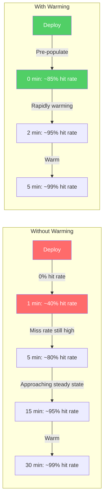
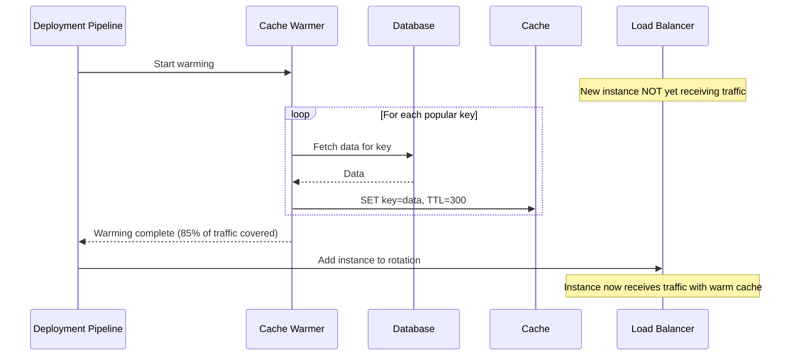
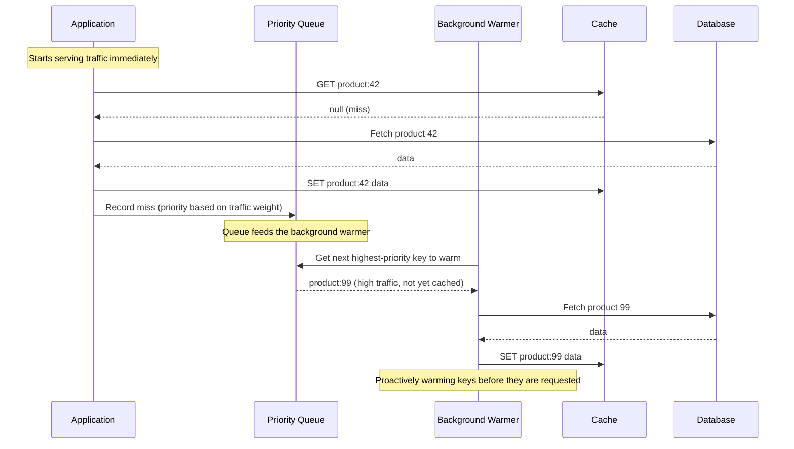
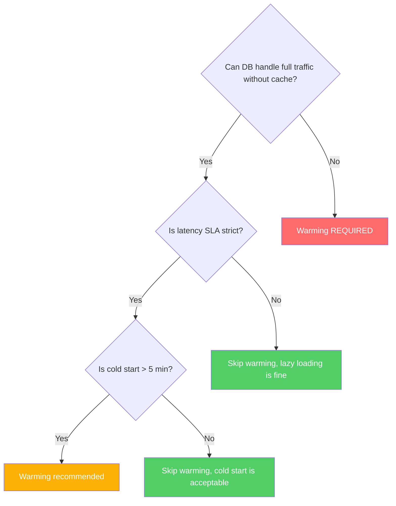
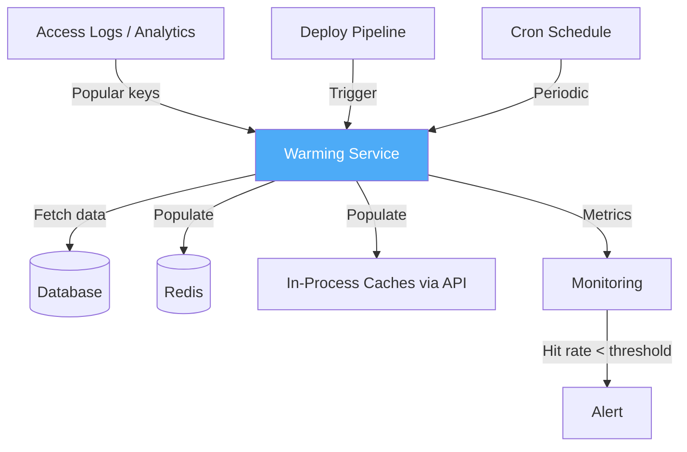

# Cache Warming

Cache warming is the process of proactively populating a cache before it receives production traffic. A cold cache — one that has just been deployed, restarted, or scaled — has a 0% hit rate. Every request is a cache miss, every miss hits the origin database, and if your system was designed to operate behind a cache (as most production systems are), the database suddenly receives 10x-100x its normal load. Cache warming prevents this by pre-populating the cache with the data most likely to be requested.

## Why This Matters

The cold start problem is not theoretical. It happens every time you:

- **Deploy a new version** of your application (new processes, empty in-process caches)
- **Restart a Redis instance** (all cached data lost)
- **Scale out** by adding new cache nodes to a cluster (consistent hashing redistributes keys, many nodes have empty slots)
- **Fail over** to a standby cache (standby may be empty)
- **Recover from an outage** (caches are cold, traffic hits database at full rate)

The gap between "cache is cold" and "cache is warm" is the most dangerous period for your system.

## First Principles

A warm cache is one whose contents reflect the current access pattern — the keys most likely to be requested are already cached. The value of warming depends on two factors:

1. **How skewed is your access pattern?** If 10% of keys serve 90% of requests (Zipf distribution), warming just those 10% gives you 90% hit rate immediately.
2. **How expensive is a cache miss?** If a miss takes 500ms (complex query, multiple joins), the cost of serving 1000 misses per second is devastating. If a miss takes 2ms, cold starts are painful but survivable.

The decision to warm is a cost-benefit analysis:

$$
\text{Value of warming} = (\text{Miss rate without warming}) \times (\text{Cost per miss}) \times (\text{Warm-up duration})
$$

If the warm-up duration is 5 minutes and you serve 10,000 requests per second with a 50ms miss cost:

$$
\text{Misses during cold start} = 10{,}000 \times 300 = 3{,}000{,}000 \text{ misses}
$$

$$
\text{Total added latency} = 3{,}000{,}000 \times 0.05 = 150{,}000 \text{ seconds of user wait time}
$$

That is 150,000 seconds of cumulative user-facing latency that warming would eliminate.

## The Cold Start Timeline



---

## Strategy 1: On-Deploy Pre-Population

Before the application starts serving traffic, run a warming script that populates the cache with the most frequently accessed data.

### How It Works



### TypeScript Implementation

```typescript
interface WarmingConfig {
  redis: Redis;
  db: Pool;
  batchSize: number;
  concurrency: number;
  prefix: string;
  ttlSeconds: number;
}

interface KeyDefinition {
  key: string;
  query: string;
  params: unknown[];
  priority: number; // Higher = warm first
}

class CacheWarmer {
  private config: WarmingConfig;
  private warmed: number = 0;
  private failed: number = 0;
  private startTime: number = 0;

  constructor(config: WarmingConfig) {
    this.config = config;
  }

  /**
   * Warm the cache with the given keys, respecting concurrency limits.
   */
  async warm(keys: KeyDefinition[]): Promise<WarmingResult> {
    this.startTime = Date.now();
    this.warmed = 0;
    this.failed = 0;

    // Sort by priority (highest first)
    const sorted = [...keys].sort((a, b) => b.priority - a.priority);

    // Process in batches with controlled concurrency
    for (let i = 0; i < sorted.length; i += this.config.batchSize) {
      const batch = sorted.slice(i, i + this.config.batchSize);
      await this.warmBatch(batch);

      // Log progress
      const progress = Math.round(
        ((i + batch.length) / sorted.length) * 100
      );
      console.log(
        `Cache warming: ${progress}% complete ` +
        `(${this.warmed} warmed, ${this.failed} failed)`
      );
    }

    return {
      totalKeys: keys.length,
      warmed: this.warmed,
      failed: this.failed,
      durationMs: Date.now() - this.startTime,
    };
  }

  private async warmBatch(keys: KeyDefinition[]): Promise<void> {
    // Process batch with concurrency limit
    const chunks = this.chunk(keys, this.config.concurrency);

    for (const chunk of chunks) {
      await Promise.allSettled(
        chunk.map((keyDef) => this.warmSingleKey(keyDef))
      );
    }
  }

  private async warmSingleKey(keyDef: KeyDefinition): Promise<void> {
    try {
      const result = await this.config.db.query(keyDef.query, keyDef.params);
      if (result.rows.length > 0) {
        const cacheKey = `${this.config.prefix}:${keyDef.key}`;
        await this.config.redis.set(
          cacheKey,
          JSON.stringify(result.rows[0]),
          'EX',
          this.config.ttlSeconds
        );
        this.warmed++;
      }
    } catch (error) {
      this.failed++;
      console.error(`Failed to warm key ${keyDef.key}:`, error);
    }
  }

  private chunk<T>(array: T[], size: number): T[][] {
    const chunks: T[][] = [];
    for (let i = 0; i < array.length; i += size) {
      chunks.push(array.slice(i, i + size));
    }
    return chunks;
  }
}

interface WarmingResult {
  totalKeys: number;
  warmed: number;
  failed: number;
  durationMs: number;
}

// Usage in a deployment script
async function warmOnDeploy(): Promise<void> {
  const warmer = new CacheWarmer({
    redis,
    db,
    batchSize: 100,
    concurrency: 10,
    prefix: 'product',
    ttlSeconds: 300,
  });

  // Get the most popular keys from access logs or analytics
  const popularProducts = await db.query(`
    SELECT product_id, view_count
    FROM product_views_daily
    WHERE date = CURRENT_DATE - INTERVAL '1 day'
    ORDER BY view_count DESC
    LIMIT 10000
  `);

  const keys: KeyDefinition[] = popularProducts.rows.map((row) => ({
    key: `${row.product_id}`,
    query: 'SELECT * FROM products WHERE id = $1',
    params: [row.product_id],
    priority: row.view_count,
  }));

  const result = await warmer.warm(keys);
  console.log(
    `Warming complete: ${result.warmed}/${result.totalKeys} keys in ${result.durationMs}ms`
  );
}
```

### Identifying Popular Keys

The effectiveness of pre-population depends entirely on knowing which keys to warm. Sources for this information:

| Source | Pros | Cons |
|--------|------|------|
| Yesterday's access logs | Reflects real access patterns | One day old, misses new content |
| Redis `MONITOR` (sampled) | Real-time access pattern | High overhead, sampling bias |
| Application metrics (key counters) | Accurate, real-time | Requires instrumentation |
| Analytics/warehouse | Historical trends, ML-ready | Delayed (hours to days) |
| Static configuration | Simple, predictable | Manual, doesn't adapt |

### Rate-Limiting the Warmer

Pre-population can overwhelm the database if you warm too aggressively. The warmer's DB query rate should be capped at a fraction of the database's capacity:

$$
\text{Warmer QPS} \leq \text{DB capacity} \times 0.2
$$

If your database handles 1,000 QPS at steady state, the warmer should not exceed 200 QPS to leave headroom for regular traffic.

---

## Strategy 2: Lazy Warming with Prioritized Keys

Instead of blocking deployment to warm the cache, start serving traffic immediately but prioritize cache population for the most important keys.

### How It Works



### TypeScript Implementation

```typescript
class LazyWarmer {
  private redis: Redis;
  private missCounter: Map<string, number> = new Map();
  private warmingQueue: Array<{ key: string; priority: number }> = [];
  private isRunning = false;
  private prefix: string;
  private ttlSeconds: number;
  private warmingConcurrency: number;

  constructor(
    redis: Redis,
    options: {
      prefix: string;
      ttlSeconds: number;
      warmingConcurrency?: number;
    }
  ) {
    this.redis = redis;
    this.prefix = options.prefix;
    this.ttlSeconds = options.ttlSeconds;
    this.warmingConcurrency = options.warmingConcurrency ?? 5;
  }

  /**
   * Record a cache miss. Frequently missed keys get higher warming priority.
   */
  recordMiss(key: string): void {
    const count = (this.missCounter.get(key) ?? 0) + 1;
    this.missCounter.set(key, count);

    // If this key has been missed enough times, add to warming queue
    if (count >= 3) {
      this.enqueueForWarming(key, count);
    }
  }

  private enqueueForWarming(key: string, priority: number): void {
    // Avoid duplicates
    if (this.warmingQueue.some((item) => item.key === key)) return;

    this.warmingQueue.push({ key, priority });
    this.warmingQueue.sort((a, b) => b.priority - a.priority);

    // Start background warming if not already running
    if (!this.isRunning) {
      this.startWarming();
    }
  }

  private async startWarming(): Promise<void> {
    this.isRunning = true;

    while (this.warmingQueue.length > 0) {
      const batch = this.warmingQueue.splice(0, this.warmingConcurrency);
      await Promise.allSettled(
        batch.map((item) => this.warmKey(item.key))
      );
    }

    this.isRunning = false;
  }

  private async warmKey(key: string): Promise<void> {
    // Check if it's already been cached by a regular request
    const exists = await this.redis.exists(`${this.prefix}:${key}`);
    if (exists) {
      this.missCounter.delete(key);
      return;
    }

    // Subclasses or injected fetchers handle the actual data loading
    // This is the hook point
  }

  /**
   * Periodic cleanup: reset miss counters for keys that are now cached.
   */
  cleanup(): void {
    for (const [key] of this.missCounter) {
      this.redis.exists(`${this.prefix}:${key}`).then((exists) => {
        if (exists) this.missCounter.delete(key);
      });
    }
  }
}
```

---

## Strategy 3: Shadow Traffic

Shadow traffic (also called "dark launching" or "traffic mirroring") routes a copy of production traffic to the new cache without serving responses from it. This warms the cache with the exact real-world access pattern.

### How It Works

```mermaid
graph LR
    LB[Load Balancer] -->|Production traffic| OldCache[Old Cache Cluster]
    LB -->|Mirrored traffic, responses discarded| NewCache[New Cache Cluster]

    OldCache -->|Serves responses| Users[Users]
    NewCache -->|Warming, no responses served| Void[/dev/null]

    style OldCache fill:#51cf66,color:#fff
    style NewCache fill:#fab005,color:#fff
```

### TypeScript Implementation

```typescript
class ShadowTrafficWarmer {
  private primaryCache: Redis;
  private shadowCache: Redis;
  private prefix: string;
  private ttlSeconds: number;
  private shadowEnabled: boolean;

  constructor(options: {
    primaryCache: Redis;
    shadowCache: Redis;
    prefix: string;
    ttlSeconds: number;
  }) {
    this.primaryCache = options.primaryCache;
    this.shadowCache = options.shadowCache;
    this.prefix = options.prefix;
    this.ttlSeconds = options.ttlSeconds;
    this.shadowEnabled = true;
  }

  /**
   * Read from primary cache. If shadow is enabled, also populate shadow cache.
   */
  async get<T>(key: string, fetcher: () => Promise<T | null>): Promise<T | null> {
    const ck = `${this.prefix}:${key}`;

    // Always read from primary
    const cached = await this.primaryCache.get(ck);
    if (cached !== null) {
      const parsed = JSON.parse(cached) as T;

      // Mirror to shadow cache (fire-and-forget)
      if (this.shadowEnabled) {
        this.shadowCache
          .set(ck, cached, 'EX', this.ttlSeconds)
          .catch(() => {}); // Ignore shadow errors
      }

      return parsed;
    }

    // Primary miss — fetch from origin
    const data = await fetcher();
    if (data !== null) {
      const serialized = JSON.stringify(data);
      await this.primaryCache.set(ck, serialized, 'EX', this.ttlSeconds);

      // Also populate shadow
      if (this.shadowEnabled) {
        this.shadowCache
          .set(ck, serialized, 'EX', this.ttlSeconds)
          .catch(() => {});
      }
    }

    return data;
  }

  /**
   * Cut over: start reading from shadow cache (now warm).
   */
  async cutover(): Promise<void> {
    this.shadowEnabled = false;
    // Swap references
    const temp = this.primaryCache;
    this.primaryCache = this.shadowCache;
    this.shadowCache = temp;
  }

  /**
   * Get shadow cache hit rate to determine if it's warm enough for cutover.
   */
  async getShadowHitRate(sampleKeys: string[]): Promise<number> {
    let hits = 0;
    for (const key of sampleKeys) {
      const exists = await this.shadowCache.exists(`${this.prefix}:${key}`);
      if (exists) hits++;
    }
    return hits / sampleKeys.length;
  }
}
```

### When to Use Shadow Traffic

- **Cache migration:** Moving from one Redis cluster to another
- **Cache technology change:** Moving from Memcached to Redis
- **Major version upgrades:** Upgrading Redis versions with data format changes
- **Region failover preparation:** Warming a standby region's cache before failover

---

## Strategy 4: Predictive Warming

Predictive warming uses access patterns to anticipate which data will be needed and pre-caches it before any request arrives. This is the most sophisticated warming strategy.

### Access Pattern Analysis

```typescript
class PredictiveWarmer {
  private redis: Redis;
  private db: Pool;
  private prefix: string;
  private ttlSeconds: number;

  constructor(redis: Redis, db: Pool, prefix: string, ttlSeconds: number) {
    this.redis = redis;
    this.db = db;
    this.prefix = prefix;
    this.ttlSeconds = ttlSeconds;
  }

  /**
   * Time-based prediction: warm data that is historically popular at this time.
   * E.g., breakfast recipes at 7 AM, dinner recipes at 5 PM.
   */
  async warmByTimePattern(): Promise<number> {
    const currentHour = new Date().getHours();
    const dayOfWeek = new Date().getDay();

    const results = await this.db.query(
      `SELECT key, avg_requests_per_hour
       FROM access_patterns
       WHERE hour_of_day = $1
         AND day_of_week = $2
       ORDER BY avg_requests_per_hour DESC
       LIMIT 1000`,
      [currentHour, dayOfWeek]
    );

    let warmed = 0;
    for (const row of results.rows) {
      const exists = await this.redis.exists(`${this.prefix}:${row.key}`);
      if (!exists) {
        await this.warmKey(row.key);
        warmed++;
      }
    }

    return warmed;
  }

  /**
   * Correlated access prediction: if a user views product A,
   * they are likely to view products B, C, D next.
   * Pre-warm B, C, D when A is accessed.
   */
  async warmCorrelated(accessedKey: string): Promise<void> {
    const correlations = await this.db.query(
      `SELECT related_key, correlation_score
       FROM key_correlations
       WHERE source_key = $1
         AND correlation_score > 0.3
       ORDER BY correlation_score DESC
       LIMIT 10`,
      [accessedKey]
    );

    // Warm correlated keys in the background
    await Promise.allSettled(
      correlations.rows.map((row) => this.warmKey(row.related_key))
    );
  }

  /**
   * Session-based prediction: warm data for the user's likely next page.
   * Based on common navigation patterns (e.g., after search → product detail).
   */
  async warmForUserSession(
    userId: string,
    currentPage: string
  ): Promise<void> {
    const nextPages = await this.predictNextPages(userId, currentPage);
    await Promise.allSettled(
      nextPages.map((page) => this.warmPageData(page))
    );
  }

  private async predictNextPages(
    userId: string,
    currentPage: string
  ): Promise<string[]> {
    // Simple Markov chain: what pages do users typically visit after this one?
    const result = await this.db.query(
      `SELECT next_page, transition_probability
       FROM page_transitions
       WHERE current_page = $1
       ORDER BY transition_probability DESC
       LIMIT 5`,
      [currentPage]
    );

    return result.rows
      .filter((row) => row.transition_probability > 0.1)
      .map((row) => row.next_page);
  }

  private async warmPageData(page: string): Promise<void> {
    // Implementation depends on page type
    // This would fetch and cache the data needed to render the page
  }

  private async warmKey(key: string): Promise<void> {
    const data = await this.db.query(
      'SELECT * FROM cacheable_data WHERE key = $1',
      [key]
    );
    if (data.rows.length > 0) {
      await this.redis.set(
        `${this.prefix}:${key}`,
        JSON.stringify(data.rows[0]),
        'EX',
        this.ttlSeconds
      );
    }
  }
}
```

### Predictive Warming Techniques

| Technique | Complexity | Accuracy | Use Case |
|-----------|------------|----------|----------|
| Time-based (hourly/daily patterns) | Low | Medium | News sites, recipe sites, media |
| Correlated access (item-to-item) | Medium | High | E-commerce (related products) |
| Session-based (next page prediction) | High | Medium-High | Multi-page workflows |
| ML-based (trained on access logs) | Very High | Highest | Large-scale platforms with diverse content |
| Geographic (warm by region before peak hours) | Medium | Medium | Global services |

---

## When Warming Is Necessary vs Overkill

### Warming Is Necessary When

- **Cold start takes > 5 minutes** to reach 90% hit rate
- **Database cannot handle full load** without the cache (most production systems)
- **Latency SLA is strict** (p99 < 100ms) and misses are expensive
- **Deployment frequency is high** (multiple deploys per day, each resetting in-process caches)
- **Cache failure causes cascading outages** (database goes down without cache protection)

### Warming Is Overkill When

- **Access pattern is flat** (uniform distribution, no popular keys to pre-populate)
- **Cold start resolves quickly** (< 30 seconds to reach acceptable hit rate)
- **Database can handle full load** (cache is an optimization, not a necessity)
- **Data is user-specific** (each user's data is unique, can't predict who will visit)
- **Warming time exceeds TTL** (by the time you warm a key, it would expire anyway)

### Decision Framework



## Performance Characteristics

### Warming Time Estimation

The time to warm a cache of $K$ keys with a warmer running at $Q$ queries per second:

$$
T_{\text{warm}} = \frac{K}{Q}
$$

For 10,000 keys at 200 QPS:

$$
T_{\text{warm}} = \frac{10{,}000}{200} = 50 \text{ seconds}
$$

### Impact on Hit Rate

If the top $K$ keys cover fraction $F$ of all requests (from Zipf distribution analysis):

$$
\text{Initial hit rate after warming} = F
$$

For a Zipf distribution with parameter $\alpha = 1.0$ and $N = 1{,}000{,}000$ total keys, warming the top $K = 10{,}000$ keys covers:

$$
F = \frac{\sum_{i=1}^{K} 1/i}{\sum_{i=1}^{N} 1/i} = \frac{H_{10{,}000}}{H_{1{,}000{,}000}} = \frac{9.21}{14.39} \approx 0.64
$$

So warming the top 1% of keys gives you a 64% hit rate immediately. With $\alpha = 1.2$ (more skewed):

$$
F \approx 0.85
$$

The more skewed the access pattern, the more effective warming is.

::: info War Story
**The Black Friday Cold Start (Retail, 2021)**

A major retailer deployed a new version of their product service at 11 PM on Thanksgiving night, 1 hour before Black Friday deals went live. The deployment reset all in-process LRU caches across 200 application servers. At midnight, traffic surged from 500 to 50,000 requests per second. With cold caches, every request hit Redis (L2), which was also cold because the cache key format had changed in the new version. Redis missed and hit PostgreSQL. PostgreSQL received 50,000 queries per second against a normal load of 500. The database connection pool was exhausted in 8 seconds. The site was down for 22 minutes on the biggest shopping day of the year. Estimated revenue loss: $3.2 million.

The post-mortem led to three changes: (1) cache key versioning that doesn't change on every deploy, (2) mandatory cache warming before cutting over traffic, and (3) a canary deployment that receives 1% of traffic for 10 minutes before full rollout, allowing caches to warm organically.
:::

## Advanced: Warming Pipeline Architecture

For large-scale systems, cache warming should be a dedicated service:



Key design decisions:
- **Rate limiting:** The warmer must not overwhelm the database. Cap at 10-20% of DB capacity.
- **Priority ordering:** Warm the most popular keys first for maximum impact with minimum effort.
- **Idempotency:** Running the warmer twice should be safe (just refreshes TTLs).
- **Monitoring:** Track warming progress, time to warm, resulting hit rate, and DB load during warming.
- **Abort conditions:** If DB latency spikes during warming, back off or pause.
