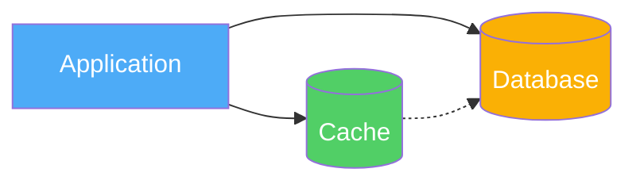
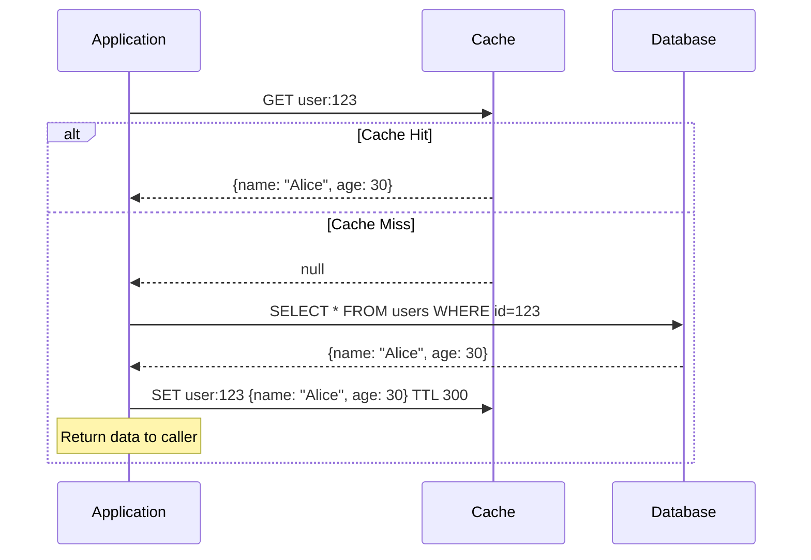
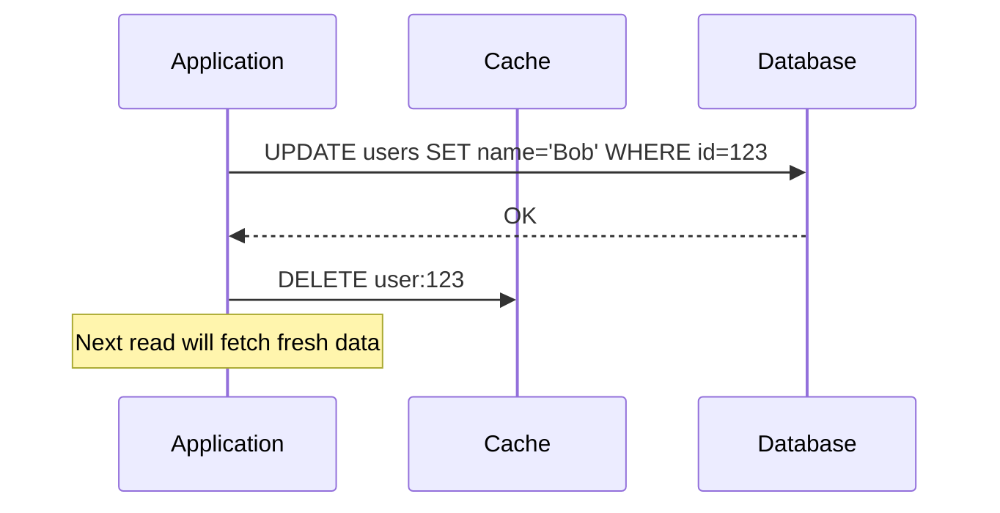
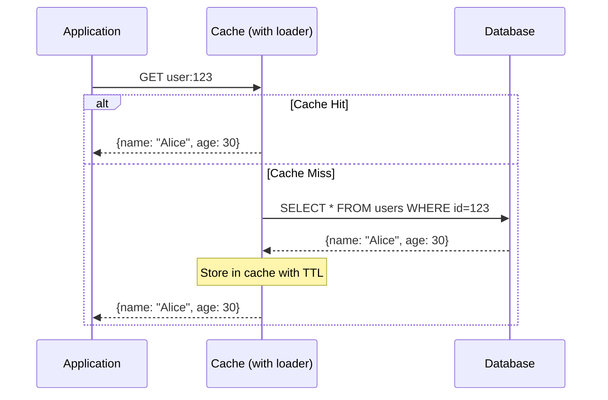
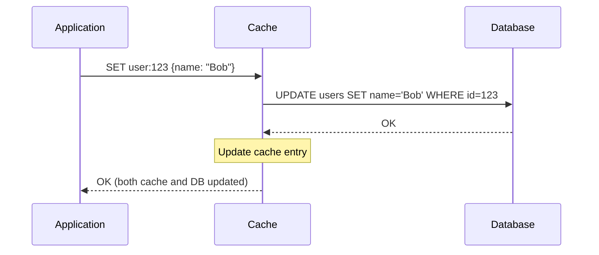
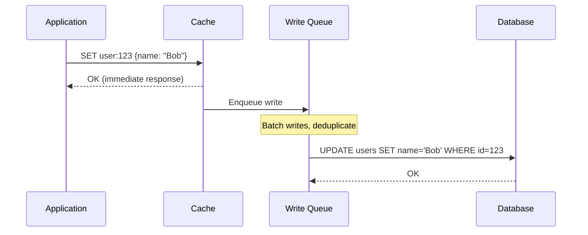
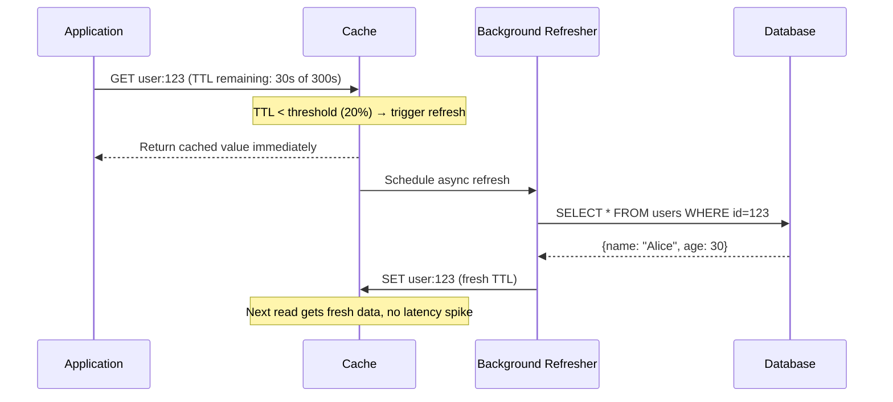
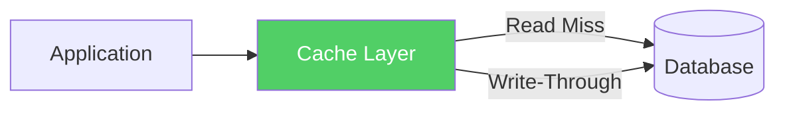
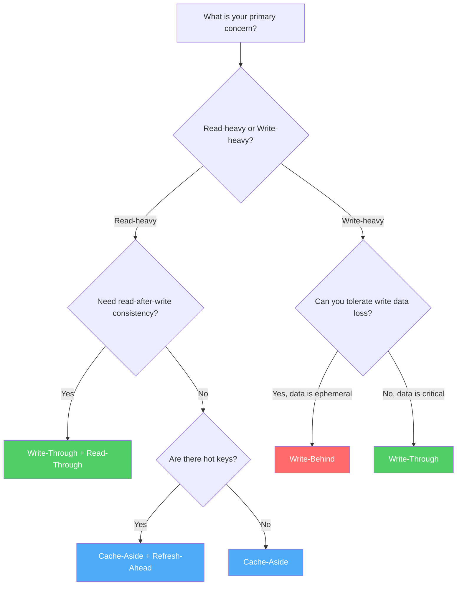

# Caching Strategies

Every caching system must answer two questions: **How do reads interact with the cache?** and **How do writes interact with the cache?** The five fundamental strategies are different answers to these questions, each with distinct consistency guarantees, performance characteristics, and failure modes. Choosing the wrong strategy for your access pattern is the single most common caching mistake — and it's usually invisible until you're debugging a production incident at 2 AM.

## Why This Matters

The strategy you choose determines:
- Whether reads ever see stale data (and for how long)
- Whether writes can be lost during a crash
- How much load your origin database handles
- How complex your application code becomes
- Whether cache and database can diverge permanently

There is no universally "best" strategy. Each is optimal for a specific set of constraints. This page gives you the tools to make that choice correctly.

## First Principles

A cache is a secondary data store that sits between a consumer (your application) and a source of truth (your database). Every caching strategy is defined by answering three questions:

1. **Who populates the cache?** The application, the cache library, or a background process?
2. **When is the cache populated?** On read (lazy), on write (eager), or on a schedule (proactive)?
3. **Where do writes go first?** To the cache, to the database, or to both?



## Cache-Aside (Lazy Loading)

Cache-aside is the most common caching strategy. The application manages the cache explicitly — it checks the cache, and on a miss, fetches from the database and populates the cache. The cache has no awareness of the database; it is a simple key-value store.

### How It Works



On write, the application updates the database and invalidates (or deletes) the cache entry:



### TypeScript Implementation

```typescript
import Redis from 'ioredis';
import { Pool } from 'pg';

interface CacheAsideOptions {
  ttlSeconds: number;
  prefix: string;
}

class CacheAsideClient<T> {
  private redis: Redis;
  private db: Pool;
  private options: CacheAsideOptions;

  constructor(redis: Redis, db: Pool, options: CacheAsideOptions) {
    this.redis = redis;
    this.db = db;
    this.options = options;
  }

  private cacheKey(key: string): string {
    return `${this.options.prefix}:${key}`;
  }

  async get(key: string, fetcher: () => Promise<T | null>): Promise<T | null> {
    const cacheKey = this.cacheKey(key);

    // Step 1: Check cache
    const cached = await this.redis.get(cacheKey);
    if (cached !== null) {
      return JSON.parse(cached) as T;
    }

    // Step 2: Cache miss — fetch from source of truth
    const data = await fetcher();
    if (data === null) {
      // Don't cache null results (or cache with short TTL to prevent
      // repeated DB lookups — see "negative caching" below)
      return null;
    }

    // Step 3: Populate cache
    await this.redis.set(
      cacheKey,
      JSON.stringify(data),
      'EX',
      this.options.ttlSeconds
    );

    return data;
  }

  async invalidate(key: string): Promise<void> {
    await this.redis.del(this.cacheKey(key));
  }

  async update(
    key: string,
    updater: () => Promise<T>
  ): Promise<T> {
    // Step 1: Update the source of truth
    const updated = await updater();

    // Step 2: Invalidate cache (delete, don't update)
    await this.invalidate(key);

    return updated;
  }
}

// Usage
const userCache = new CacheAsideClient<User>(redis, db, {
  ttlSeconds: 300,
  prefix: 'user',
});

// Read
const user = await userCache.get('123', async () => {
  const result = await db.query('SELECT * FROM users WHERE id = $1', [123]);
  return result.rows[0] ?? null;
});

// Write
await userCache.update('123', async () => {
  const result = await db.query(
    'UPDATE users SET name = $1 WHERE id = $2 RETURNING *',
    ['Bob', 123]
  );
  return result.rows[0];
});
```

### Why Delete Instead of Update on Write?

A subtle but critical design decision: on write, **delete the cache entry rather than updating it**. Here's why:

**Race condition with update-on-write:**

```
Time 1: Thread A writes value=10 to DB
Time 2: Thread B writes value=20 to DB
Time 3: Thread B updates cache to 20
Time 4: Thread A updates cache to 10  ← STALE! DB has 20, cache has 10
```

**No race with delete-on-write:**

```
Time 1: Thread A writes value=10 to DB
Time 2: Thread B writes value=20 to DB
Time 3: Thread B deletes cache
Time 4: Thread A deletes cache (idempotent, no harm)
Time 5: Next read fetches 20 from DB ← CORRECT
```

Deletion is idempotent. Setting a value is not. In concurrent systems, prefer idempotent operations.

### When to Use Cache-Aside

- **Read-heavy workloads** with infrequent writes
- When you can tolerate stale data for the duration of the TTL
- When the application already has access to both cache and database
- When you want explicit control over caching logic
- When different data types need different caching policies

### Failure Modes

| Failure | Impact | Mitigation |
|---------|--------|------------|
| Cache unavailable | All requests hit DB (fallback works) | Circuit breaker, graceful degradation |
| DB unavailable | Cache hits still work, misses fail | Serve stale data with warning |
| Cache-DB inconsistency | Stale reads until TTL expires | Shorter TTLs, event-driven invalidation |
| Thundering herd | Popular key expires, all requests hit DB | Request coalescing, locking |
| Cache full | Eviction of frequently-used keys | Proper sizing, monitoring eviction rate |

### Consistency Guarantees

- **Read-after-write consistency:** NOT guaranteed. A write followed by an immediate read may hit the cache before the invalidation is processed (especially with distributed caches where invalidation propagates asynchronously).
- **Eventual consistency:** Yes, within the TTL window. After TTL expires, the next read fetches fresh data.
- **Monotonic reads:** NOT guaranteed. Two consecutive reads may return different values if an invalidation happens between them.

---

## Read-Through

Read-through is similar to cache-aside, but the **cache itself** is responsible for loading data from the database on a miss. The application only talks to the cache — never directly to the database for reads.

### How It Works



### TypeScript Implementation

```typescript
type Loader<T> = (key: string) => Promise<T | null>;

class ReadThroughCache<T> {
  private redis: Redis;
  private loader: Loader<T>;
  private ttlSeconds: number;
  private prefix: string;

  // In-flight request tracking for request coalescing
  private inflight: Map<string, Promise<T | null>> = new Map();

  constructor(
    redis: Redis,
    loader: Loader<T>,
    options: { ttlSeconds: number; prefix: string }
  ) {
    this.redis = redis;
    this.loader = loader;
    this.ttlSeconds = options.ttlSeconds;
    this.prefix = options.prefix;
  }

  private cacheKey(key: string): string {
    return `${this.prefix}:${key}`;
  }

  async get(key: string): Promise<T | null> {
    const ck = this.cacheKey(key);

    // Check cache
    const cached = await this.redis.get(ck);
    if (cached !== null) {
      return JSON.parse(cached) as T;
    }

    // Request coalescing: if another request is already loading
    // this key, wait for that result instead of issuing a duplicate query
    const existing = this.inflight.get(ck);
    if (existing) {
      return existing;
    }

    // Load from source of truth
    const loadPromise = this.loadAndCache(ck, key);
    this.inflight.set(ck, loadPromise);

    try {
      return await loadPromise;
    } finally {
      this.inflight.delete(ck);
    }
  }

  private async loadAndCache(
    cacheKey: string,
    rawKey: string
  ): Promise<T | null> {
    const data = await this.loader(rawKey);
    if (data !== null) {
      await this.redis.set(
        cacheKey,
        JSON.stringify(data),
        'EX',
        this.ttlSeconds
      );
    }
    return data;
  }
}

// Usage — application never touches DB directly for reads
const userCache = new ReadThroughCache<User>(
  redis,
  async (key: string) => {
    const result = await db.query(
      'SELECT * FROM users WHERE id = $1',
      [key]
    );
    return result.rows[0] ?? null;
  },
  { ttlSeconds: 300, prefix: 'user' }
);

const user = await userCache.get('123'); // Cache handles everything
```

### When to Use Read-Through

- When you want to simplify application code by hiding the cache/DB interaction
- When multiple services read the same data and you want a single caching layer
- When using a caching library or framework that supports loaders (e.g., Guava Cache, Caffeine)
- When request coalescing is critical (read-through makes it easier to implement at the cache layer)

### Read-Through vs Cache-Aside

| Aspect | Cache-Aside | Read-Through |
|--------|-------------|--------------|
| Who loads on miss? | Application | Cache |
| Application complexity | Higher (manages cache explicitly) | Lower (cache is transparent) |
| Flexibility | More (different logic per caller) | Less (single loader function) |
| Request coalescing | Must implement in app | Natural fit at cache layer |
| Testability | Cache is a dumb store (easy to mock) | Cache has logic (harder to test) |

### Failure Modes

All the same failure modes as cache-aside, plus:

| Failure | Impact | Mitigation |
|---------|--------|------------|
| Loader hangs | Requests queue up behind the loader | Timeouts on loader, circuit breaker |
| Loader throws | No data returned, cache remains empty | Retry with backoff, serve stale if available |
| Loader returns wrong data | Bad data cached for TTL duration | Schema validation before caching |

---

## Write-Through

Write-through updates the cache and the database **synchronously** on every write. The write is only considered successful when both the cache and database have been updated.

### How It Works



### TypeScript Implementation

```typescript
class WriteThroughCache<T> {
  private redis: Redis;
  private db: Pool;
  private ttlSeconds: number;
  private prefix: string;

  constructor(
    redis: Redis,
    db: Pool,
    options: { ttlSeconds: number; prefix: string }
  ) {
    this.redis = redis;
    this.db = db;
    this.ttlSeconds = options.ttlSeconds;
    this.prefix = options.prefix;
  }

  private cacheKey(key: string): string {
    return `${this.prefix}:${key}`;
  }

  async read(key: string, fetcher: () => Promise<T | null>): Promise<T | null> {
    const ck = this.cacheKey(key);
    const cached = await this.redis.get(ck);
    if (cached !== null) {
      return JSON.parse(cached) as T;
    }

    const data = await fetcher();
    if (data !== null) {
      await this.redis.set(ck, JSON.stringify(data), 'EX', this.ttlSeconds);
    }
    return data;
  }

  async write(
    key: string,
    data: T,
    dbWriter: (data: T) => Promise<void>
  ): Promise<void> {
    // Step 1: Write to database FIRST
    // This ordering ensures that if the cache write fails,
    // the database still has the correct value.
    await dbWriter(data);

    // Step 2: Write to cache
    await this.redis.set(
      this.cacheKey(key),
      JSON.stringify(data),
      'EX',
      this.ttlSeconds
    );
  }

  /**
   * Atomic write-through with rollback on failure.
   * If the cache update fails after the DB write succeeds,
   * we invalidate the cache key so the next read fetches fresh data.
   */
  async writeAtomic(
    key: string,
    data: T,
    dbWriter: (data: T) => Promise<void>
  ): Promise<void> {
    await dbWriter(data);

    try {
      await this.redis.set(
        this.cacheKey(key),
        JSON.stringify(data),
        'EX',
        this.ttlSeconds
      );
    } catch (error) {
      // Cache write failed — invalidate to prevent serving stale data
      await this.redis.del(this.cacheKey(key)).catch(() => {
        // If even the delete fails, log and rely on TTL for eventual consistency
      });
      // Don't throw — the DB write succeeded, which is the important part
    }
  }
}

// Usage
const userCache = new WriteThroughCache<User>(redis, db, {
  ttlSeconds: 300,
  prefix: 'user',
});

await userCache.write(
  '123',
  { id: 123, name: 'Bob', age: 31 },
  async (data) => {
    await db.query(
      'UPDATE users SET name = $1, age = $2 WHERE id = $3',
      [data.name, data.age, data.id]
    );
  }
);
```

### When to Use Write-Through

- When you **cannot tolerate stale reads** after a write (strong read-after-write consistency)
- When write volume is low to moderate (each write has the latency of DB + cache)
- Financial systems, user profile updates, configuration data
- When combined with read-through for a fully consistent cache layer

### Failure Modes

| Failure | Impact | Mitigation |
|---------|--------|------------|
| DB write fails | Cache not updated (correct behavior) | Standard DB error handling |
| Cache write fails after DB write | Cache has stale data until TTL | Invalidate cache on failure, TTL as backstop |
| Write latency too high | Both DB and cache on critical path | Consider write-behind for latency-sensitive paths |
| Cache and DB write ordering | If cache updated first and DB fails, stale cache | Always write DB first |

### Consistency Guarantees

- **Read-after-write consistency:** YES, as long as the cache write succeeds after the DB write.
- **Strong consistency:** Nearly. A small window exists between the DB write completing and the cache being updated, during which another reader could see the old cached value.
- **Durability:** Yes, data is always in the database. The cache is just a performance optimization.

---

## Write-Behind (Write-Back)

Write-behind is the most aggressive caching strategy for write performance. Writes go to the cache **immediately** and are asynchronously flushed to the database in the background. The application perceives the write as complete the instant the cache is updated.

### How It Works



### TypeScript Implementation

```typescript
interface PendingWrite<T> {
  key: string;
  data: T;
  timestamp: number;
  retries: number;
}

class WriteBehindCache<T> {
  private redis: Redis;
  private db: Pool;
  private prefix: string;
  private ttlSeconds: number;

  private writeQueue: PendingWrite<T>[] = [];
  private flushInterval: ReturnType<typeof setInterval> | null = null;
  private maxBatchSize: number;
  private flushIntervalMs: number;
  private maxRetries: number;

  constructor(
    redis: Redis,
    db: Pool,
    options: {
      prefix: string;
      ttlSeconds: number;
      maxBatchSize?: number;
      flushIntervalMs?: number;
      maxRetries?: number;
    }
  ) {
    this.redis = redis;
    this.db = db;
    this.prefix = options.prefix;
    this.ttlSeconds = options.ttlSeconds;
    this.maxBatchSize = options.maxBatchSize ?? 100;
    this.flushIntervalMs = options.flushIntervalMs ?? 1000;
    this.maxRetries = options.maxRetries ?? 3;
  }

  private cacheKey(key: string): string {
    return `${this.prefix}:${key}`;
  }

  start(): void {
    this.flushInterval = setInterval(() => {
      this.flush().catch((err) => {
        console.error('Write-behind flush failed:', err);
      });
    }, this.flushIntervalMs);
  }

  stop(): Promise<void> {
    if (this.flushInterval) {
      clearInterval(this.flushInterval);
      this.flushInterval = null;
    }
    // Final flush to drain the queue
    return this.flush();
  }

  async read(key: string, fetcher: () => Promise<T | null>): Promise<T | null> {
    const ck = this.cacheKey(key);
    const cached = await this.redis.get(ck);
    if (cached !== null) {
      return JSON.parse(cached) as T;
    }

    const data = await fetcher();
    if (data !== null) {
      await this.redis.set(ck, JSON.stringify(data), 'EX', this.ttlSeconds);
    }
    return data;
  }

  async write(key: string, data: T): Promise<void> {
    // Step 1: Update cache immediately
    await this.redis.set(
      this.cacheKey(key),
      JSON.stringify(data),
      'EX',
      this.ttlSeconds
    );

    // Step 2: Enqueue for async DB write
    // Deduplicate: if the same key is already in the queue, replace it
    const existingIndex = this.writeQueue.findIndex((w) => w.key === key);
    if (existingIndex !== -1) {
      this.writeQueue[existingIndex] = {
        key,
        data,
        timestamp: Date.now(),
        retries: 0,
      };
    } else {
      this.writeQueue.push({
        key,
        data,
        timestamp: Date.now(),
        retries: 0,
      });
    }

    // If queue is full, flush immediately
    if (this.writeQueue.length >= this.maxBatchSize) {
      await this.flush();
    }
  }

  private async flush(): Promise<void> {
    if (this.writeQueue.length === 0) return;

    // Take a batch from the queue
    const batch = this.writeQueue.splice(0, this.maxBatchSize);
    const failed: PendingWrite<T>[] = [];

    // Process batch — in production, use a proper batch insert
    for (const item of batch) {
      try {
        await this.persistToDb(item.key, item.data);
      } catch (error) {
        if (item.retries < this.maxRetries) {
          failed.push({ ...item, retries: item.retries + 1 });
        } else {
          // Dead letter — log for manual intervention
          console.error(
            `Write-behind: max retries exceeded for key=${item.key}`,
            error
          );
        }
      }
    }

    // Re-enqueue failed items at the front
    if (failed.length > 0) {
      this.writeQueue.unshift(...failed);
    }
  }

  private async persistToDb(key: string, data: T): Promise<void> {
    // This would be your actual DB write logic
    // Override or inject this in a real implementation
    throw new Error('persistToDb must be implemented by subclass');
  }

  /**
   * Returns the number of pending writes.
   * Useful for monitoring — if this grows unboundedly,
   * the DB is not keeping up.
   */
  getPendingWriteCount(): number {
    return this.writeQueue.length;
  }
}
```

### When to Use Write-Behind

- **Write-heavy workloads** where write latency is critical (e.g., analytics, event logging, session updates)
- When you can tolerate a small window of potential data loss (writes in the queue that haven't been flushed)
- When write deduplication provides a significant benefit (many writes to the same key — only the latest matters)
- Gaming leaderboards, view counters, real-time dashboards

### Failure Modes

| Failure | Impact | Mitigation |
|---------|--------|------------|
| Process crashes before flush | **Data loss** — writes in the queue are gone | Use a durable queue (Redis stream, Kafka), not in-memory |
| DB unavailable during flush | Writes queue up, memory grows | Bounded queue, backpressure, dead letter queue |
| Cache evicts before DB write | Data loss — only copy was in cache | Persist queue separately from cache, or use longer TTLs |
| Out-of-order writes | DB may have stale version | Track write timestamps, use optimistic concurrency |

::: warning Data Loss Risk
Write-behind can lose data. If the process crashes between accepting a write (cache updated) and flushing it to the database, that write is lost. For data that must not be lost, use write-through or write to the database directly. Only use write-behind when you've accepted the risk and have mitigation in place (e.g., a durable write-ahead log).
:::

### Consistency Guarantees

- **Read-after-write consistency from the cache:** YES. The cache has the latest value immediately.
- **Read-after-write consistency from the database:** NO. The database may lag behind the cache by seconds.
- **Durability:** NO (for in-memory queue). Data can be lost between cache write and DB flush.
- **Eventual consistency:** YES, assuming the flush eventually succeeds.

---

## Refresh-Ahead

Refresh-ahead proactively refreshes cache entries **before they expire**, based on the prediction that they will be accessed again. This eliminates the latency spike of a cache miss for hot keys while still keeping the data fresh.

### How It Works



### TypeScript Implementation

```typescript
interface RefreshAheadOptions {
  ttlSeconds: number;
  refreshThreshold: number; // 0.0 to 1.0 — refresh when remaining TTL is below this fraction
  prefix: string;
}

class RefreshAheadCache<T> {
  private redis: Redis;
  private loader: (key: string) => Promise<T | null>;
  private options: RefreshAheadOptions;
  private refreshing: Set<string> = new Set();

  constructor(
    redis: Redis,
    loader: (key: string) => Promise<T | null>,
    options: RefreshAheadOptions
  ) {
    this.redis = redis;
    this.loader = loader;
    this.options = options;
  }

  private cacheKey(key: string): string {
    return `${this.options.prefix}:${key}`;
  }

  async get(key: string): Promise<T | null> {
    const ck = this.cacheKey(key);

    // Use a pipeline to get both value and TTL in one round trip
    const pipeline = this.redis.pipeline();
    pipeline.get(ck);
    pipeline.ttl(ck);
    const results = await pipeline.exec();

    if (!results) return this.loadAndCache(key);

    const [getResult, ttlResult] = results;
    const cached = getResult?.[1] as string | null;
    const ttl = ttlResult?.[1] as number;

    if (cached === null) {
      // Cache miss — load synchronously
      return this.loadAndCache(key);
    }

    // Check if we should proactively refresh
    const refreshThresholdSeconds =
      this.options.ttlSeconds * this.options.refreshThreshold;

    if (ttl > 0 && ttl < refreshThresholdSeconds) {
      // TTL is below threshold — trigger async refresh
      this.triggerRefresh(key);
    }

    return JSON.parse(cached) as T;
  }

  private triggerRefresh(key: string): void {
    const ck = this.cacheKey(key);

    // Prevent duplicate refreshes for the same key
    if (this.refreshing.has(ck)) return;
    this.refreshing.add(ck);

    // Fire-and-forget async refresh
    this.loadAndCache(key)
      .catch((err) => {
        console.error(`Refresh-ahead failed for key=${key}:`, err);
      })
      .finally(() => {
        this.refreshing.delete(ck);
      });
  }

  private async loadAndCache(key: string): Promise<T | null> {
    const data = await this.loader(key);
    if (data !== null) {
      await this.redis.set(
        this.cacheKey(key),
        JSON.stringify(data),
        'EX',
        this.options.ttlSeconds
      );
    }
    return data;
  }
}

// Usage
const userCache = new RefreshAheadCache<User>(
  redis,
  async (key) => {
    const result = await db.query(
      'SELECT * FROM users WHERE id = $1',
      [key]
    );
    return result.rows[0] ?? null;
  },
  {
    ttlSeconds: 300,
    refreshThreshold: 0.2, // Refresh when less than 20% of TTL remains (< 60s)
    prefix: 'user',
  }
);
```

### When to Use Refresh-Ahead

- **Hot keys** that are accessed frequently and where a cache miss causes noticeable latency
- When data changes moderately often but reads vastly outnumber writes
- When you want the freshness of short TTLs without the miss penalty
- Product catalog pages, trending content, feature flags

### When NOT to Use Refresh-Ahead

- Long-tail access patterns where most keys are accessed once (wasted refresh work)
- Data that changes so rarely that TTL-based expiration is sufficient
- When background refresh load would overwhelm the database

### Failure Modes

| Failure | Impact | Mitigation |
|---------|--------|------------|
| Refresh fails | Existing cached value expires, causing a regular miss | Keep serving stale value, log failure, retry |
| Too many refreshes | DB overloaded by background refresh traffic | Rate-limit refresh rate, only refresh keys with recent access |
| Refresh storm at startup | Many keys near expiry trigger simultaneous refreshes | Jitter TTLs, cap concurrent refreshes |

### Consistency Guarantees

- **Read-after-write consistency:** NOT guaranteed (same as cache-aside).
- **Freshness:** Better than cache-aside with the same TTL, because data is refreshed before expiry.
- **Staleness window:** Equal to the TTL minus the refresh threshold. For a 300s TTL with 20% threshold, maximum staleness is 300s (if the refresh fails).

---

## Strategy Comparison

| Strategy | Read Performance | Write Performance | Consistency | Data Loss Risk | Complexity | Best For |
|----------|-----------------|-------------------|-------------|----------------|------------|----------|
| Cache-Aside | First read slow (miss) | Fast (invalidate only) | Eventual (TTL) | None | Low | General purpose |
| Read-Through | First read slow (miss) | N/A (read strategy) | Eventual (TTL) | None | Medium | Simplified app code |
| Write-Through | Fast (always cached) | Slow (sync DB + cache) | Strong | None | Medium | Read-after-write required |
| Write-Behind | Fast (always cached) | Very fast (async) | Eventual | **Yes** | High | Write-heavy workloads |
| Refresh-Ahead | Fast (no expiry gaps) | N/A (read strategy) | Better eventual | None | Medium | Hot keys, predictable access |

## Combining Strategies

In practice, you almost never use a single strategy. Real systems combine them:

### Read-Through + Write-Through

The "consistent cache" pattern. Reads always go through the cache (with automatic loading on miss). Writes always update both cache and database synchronously. This gives strong read-after-write consistency at the cost of higher write latency.



### Cache-Aside + Write-Behind

The "performance cache" pattern. Reads use cache-aside with lazy loading. Writes go through write-behind for minimal latency. This gives excellent performance but weaker consistency and a risk of data loss.

### Read-Through + Refresh-Ahead

The "hot cache" pattern. Reads go through the cache with automatic loading. Frequently-accessed keys are proactively refreshed before expiry. This minimizes read latency for popular content.

## Negative Caching

A frequently overlooked pattern: **caching the absence of data**. If a user requests ID `99999` and it doesn't exist, without negative caching, every request for that ID hits the database.

```typescript
async get(key: string, fetcher: () => Promise<T | null>): Promise<T | null> {
  const ck = this.cacheKey(key);
  const cached = await this.redis.get(ck);

  if (cached === '__NULL__') {
    return null; // Negative cache hit
  }

  if (cached !== null) {
    return JSON.parse(cached) as T;
  }

  const data = await fetcher();

  if (data === null) {
    // Cache the negative result with a shorter TTL
    await this.redis.set(ck, '__NULL__', 'EX', 60);
    return null;
  }

  await this.redis.set(ck, JSON.stringify(data), 'EX', this.ttlSeconds);
  return data;
}
```

::: info War Story
A social media platform experienced a DDoS attack where bots repeatedly requested non-existent user profiles. Without negative caching, every request went to the database. With 10,000 requests per second for non-existent IDs, the database connection pool was exhausted within minutes. Adding negative caching with a 30-second TTL reduced DB load from those requests by 99.97%. The fix was three lines of code.
:::

## Edge Cases & Failure Modes

### The Cache Stampede Race

Even with cache-aside, there's a subtle race condition:

```
Time 0: Key "popular" expires
Time 1: 1000 concurrent requests all see cache miss
Time 2: All 1000 requests hit the database simultaneously
Time 3: Database is overwhelmed
```

This is the **thundering herd problem**, covered in depth in the [dedicated page](./thundering-herd).

### Serialization Mismatches

If you cache serialized data (JSON) and your object schema changes, deserialization can fail:

```typescript
// v1 cached: {"name": "Alice", "age": 30}
// v2 code expects: {"name": "Alice", "age": 30, "email": string}

// Solution: version your cache keys
const cacheKey = `user:v2:${id}`;
```

### Hot Key Problem

A single cache key that receives disproportionate traffic can become a bottleneck, even in a distributed cache. If all requests for a viral tweet go to one Redis shard, that shard becomes the bottleneck.

Solutions:
- **Key replication:** Store the same value under multiple keys (`hotkey:1`, `hotkey:2`, ... `hotkey:N`) and randomly select one per request
- **Local caching (L1):** Cache hot keys in-process memory in addition to Redis
- **Read replicas:** Use Redis read replicas to distribute load

## Decision Framework

Use this flowchart to choose your strategy:



## Performance Characteristics

| Operation | Cache-Aside | Read-Through | Write-Through | Write-Behind |
|-----------|-------------|--------------|---------------|--------------|
| Read (hit) | O(1) ~1ms | O(1) ~1ms | O(1) ~1ms | O(1) ~1ms |
| Read (miss) | O(1) + DB query | O(1) + DB query | O(1) + DB query | O(1) + DB query |
| Write | DB write + cache delete | N/A | DB write + cache write | Cache write only |
| Write latency | ~5-50ms | N/A | ~10-100ms | ~1ms |
| DB load (reads) | Proportional to miss rate | Proportional to miss rate | Proportional to miss rate | Proportional to miss rate |
| DB load (writes) | 1x (direct writes) | N/A | 1x (synchronous) | Batched, potentially < 1x |

## Mathematical Foundation

The effectiveness of any caching strategy is governed by the **cache hit rate**, which depends on the access pattern. For a cache of size $C$ entries with a total of $N$ possible entries, accessed following a Zipf distribution with parameter $\alpha$:

$$
\text{Hit Rate} = \frac{\sum_{i=1}^{C} \frac{1}{i^{\alpha}}}{\sum_{i=1}^{N} \frac{1}{i^{\alpha}}}
$$

For typical web traffic ($\alpha \approx 0.8$ to $1.2$), a cache holding just 10-20% of the total dataset can achieve 80-95% hit rates. This is why caching is so effective — access patterns are heavily skewed.

The detailed mathematics are covered in [Cache Sizing Math](./cache-sizing-math).

## Advanced: Adaptive Strategy Selection

Production systems can dynamically switch strategies based on observed access patterns:

```typescript
class AdaptiveCache<T> {
  private readCount = 0;
  private writeCount = 0;
  private windowMs = 60_000;

  private getReadWriteRatio(): number {
    return this.readCount / Math.max(this.writeCount, 1);
  }

  private selectStrategy(): 'cache-aside' | 'write-through' | 'write-behind' {
    const ratio = this.getReadWriteRatio();
    if (ratio > 10) return 'cache-aside';        // Read-heavy
    if (ratio < 2) return 'write-behind';          // Write-heavy
    return 'write-through';                        // Balanced
  }
}
```

This is an advanced pattern that adds complexity. Start with a fixed strategy and only add adaptive switching when you have data showing that different access patterns occur at different times (e.g., read-heavy during business hours, write-heavy during batch processing at night).
