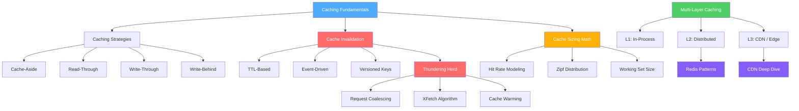

# Caching

Caching is the most impactful performance optimization in all of computing. Every layer of the modern stack — from CPU registers to CDN edge nodes — is a cache. Understanding caching deeply means understanding trade-offs between speed, freshness, memory, and complexity. Get it right and your system handles 100x the load. Get it wrong and you serve stale data, crash under thundering herds, or burn money on memory you don't need.

This section doesn't just describe caching patterns. It takes you from the physics of memory hierarchies through the mathematics of hit-rate modeling to the engineering decisions that separate a cache that saves your system from one that destroys your data integrity.

## Why Caching Exists

Every cache exists because of a single physical reality: **accessing data from a closer, faster storage medium is cheaper than recomputing or re-fetching it from the source of truth.** This is a consequence of the memory hierarchy, which itself is a consequence of physics — faster storage is more expensive per bit, so we have less of it.

| Storage Tier | Latency | Capacity | Cost per GB |
|---|---|---|---|
| CPU L1 Cache | ~1 ns | 64 KB | Built into CPU |
| CPU L3 Cache | ~10 ns | 32 MB | Built into CPU |
| RAM | ~100 ns | 64-512 GB | ~$5 |
| NVMe SSD | ~100 μs | 1-4 TB | ~$0.10 |
| Network (same DC) | ~500 μs | Unlimited | Variable |
| Network (cross-region) | ~50 ms | Unlimited | Variable |
| Disk (HDD) | ~10 ms | 8-20 TB | ~$0.02 |

The ratio between accessing RAM and crossing a network is 1,000x to 500,000x. That gap is what makes caching worthwhile — and what makes cache misses so expensive.

## Concept Map



## Learning Path

Follow this order for the most coherent understanding:

| Order | Topic | Why This Order |
|-------|-------|----------------|
| 1 | [Caching Strategies](./caching-strategies) | The foundational read/write patterns — everything else builds on these |
| 2 | [Cache Invalidation](./cache-invalidation) | The hardest problem — understand why stale data is inevitable and how to manage it |
| 3 | [Thundering Herd](./thundering-herd) | What happens when caching goes wrong at scale, and how to prevent it |
| 4 | [Cache Warming](./cache-warming) | Solving the cold-start problem — critical for deployments and failover |
| 5 | [Multi-Layer Caching](./multi-layer-caching) | Combining L1/L2/L3 caches for maximum performance and resilience |
| 6 | [Cache Sizing Math](./cache-sizing-math) | The mathematics behind "how big should my cache be?" |
| 7 | [Redis Caching Patterns](./redis-caching-patterns) | Production Redis patterns — eviction, pipelining, Lua scripts, data structures |
| 8 | [CDN Deep Dive](./cdn-deep-dive) | Edge caching at global scale — headers, purging, cache key design |

## The Two Hard Problems

Phil Karlton famously said:

> **"There are only two hard things in Computer Science: cache invalidation and naming things."**

He was right. Caching is easy to add and extraordinarily hard to get right. The failure modes are subtle — stale data served for hours, thundering herds that take down origin servers, inconsistency between cache layers, memory bloat from unbounded caches, and cache stampedes during deploys.

Every page in this section addresses one or more of these failure modes head-on, with the mathematics to prove the solutions work and the war stories to show what happens when they don't.

## The Fundamental Trade-Off

Every caching decision is a point on this triangle:

```
        Freshness
           /\
          /  \
         /    \
        /      \
       /________\
   Speed      Memory
```

- **Freshness vs Speed:** Shorter TTLs mean fresher data but more cache misses and higher origin load.
- **Freshness vs Memory:** Storing more versions for consistency costs memory.
- **Speed vs Memory:** Caching more data means faster responses but larger memory footprint and higher cost.

There is no free lunch. Every pattern in this section is a specific trade-off along these axes, and the right choice depends on your access patterns, consistency requirements, and budget.

## Key Metrics

Before diving into patterns, understand the metrics that define cache effectiveness:

- **Hit Rate** — Percentage of requests served from cache. Target: 85-99% depending on use case.
- **Miss Rate** — 1 - Hit Rate. Each miss means a full round-trip to origin.
- **Eviction Rate** — How often entries are evicted before expiry. High eviction rate means the cache is too small.
- **Latency at p50/p99** — Cache hits should be sub-millisecond (in-process) or single-digit ms (distributed).
- **Origin Load** — Traffic that reaches the source of truth. Caching should reduce this by 10-100x.
- **Stale Serve Rate** — Percentage of responses served from expired cache entries. Acceptable in some systems, fatal in others.
- **Memory Utilization** — How efficiently cache memory is used. Overprovisioning wastes money; underprovisioning causes thrashing.

## Prerequisites

This section assumes familiarity with:
- Basic data structures (hash maps, linked lists)
- Network fundamentals (HTTP, TCP/IP)
- Database basics (reads, writes, indexes)
- Asynchronous programming in TypeScript/JavaScript

No prior caching knowledge is required — we build from first principles.
