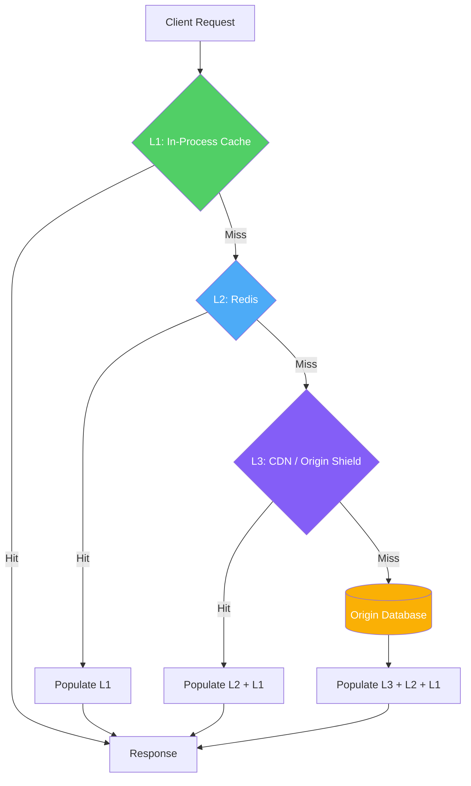
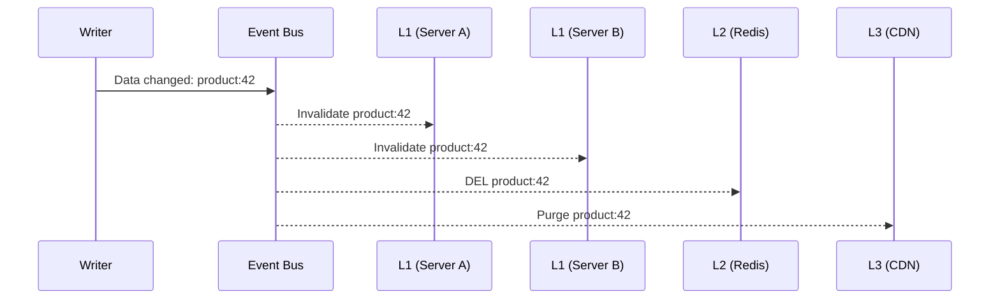
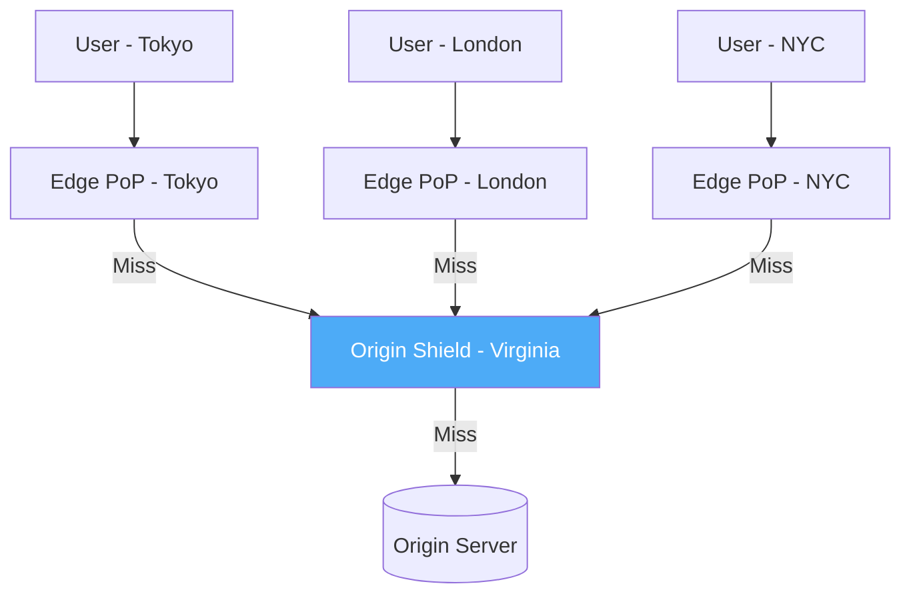
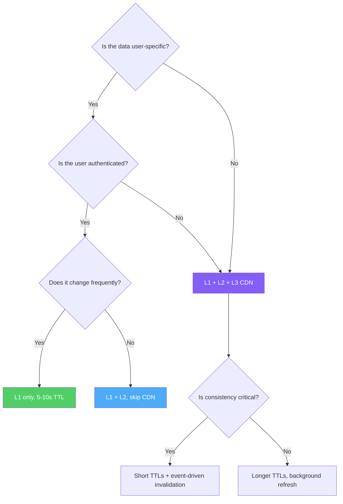

# Multi-Layer Caching

A single cache is a single point of failure and a single performance bottleneck. Production systems use multiple layers of caching, each with different latency, capacity, and consistency characteristics. Understanding how to design, implement, and operate a multi-layer cache hierarchy is the difference between a system that handles 100 requests per second and one that handles 1,000,000.

## Why Multiple Layers

Each cache layer has a fundamental trade-off between latency and capacity:

| Layer | Example | Latency | Capacity | Shared? | Survives Restart? |
|-------|---------|---------|----------|---------|-------------------|
| L1 | In-process LRU Map | ~0.001 ms | 10-100 MB | No (per-process) | No |
| L2 | Redis / Memcached | ~1-5 ms | 1-100 GB | Yes (shared) | Depends on config |
| L3 | CDN edge (CloudFront, Cloudflare) | ~10-50 ms | Unbounded | Yes (global) | Yes (distributed) |
| Origin | PostgreSQL / API | ~10-500 ms | Unlimited | Yes | Yes |

No single layer is optimal for all use cases:
- L1 is blazing fast but limited in size and per-process (not shared)
- L2 is shared but requires a network hop
- L3 is globally distributed but has higher latency and limited control

A well-designed hierarchy uses each layer for what it does best.

## First Principles

Multi-layer caching follows the **inclusion principle** from CPU cache design: ideally, every entry in L1 also exists in L2, and every entry in L2 also exists in L3. This means a miss at L1 can be served from L2 without going to the origin.

However, strict inclusion is expensive to maintain in software caches (unlike CPU caches, which enforce it in hardware). In practice, software cache hierarchies are **non-inclusive** — entries can exist in any layer independently.

The key design decisions:
1. **Which data goes in which layer?** (Everything in all layers, or selective?)
2. **How do reads cascade?** (L1 → L2 → L3 → Origin, or skip layers?)
3. **How do writes propagate?** (Invalidate all layers, or just L1?)
4. **How is consistency maintained?** (TTL, events, or strict ordering?)

## Core Architecture



## L1: In-Process Cache

The L1 cache lives inside the application process. It is the fastest possible cache because it requires zero network I/O — it's a data structure in memory.

### LRU Cache Implementation

```typescript
class LRUCache<K, V> {
  private capacity: number;
  private cache: Map<K, { value: V; expiry: number }>;

  constructor(capacity: number) {
    this.capacity = capacity;
    this.cache = new Map();
  }

  get(key: K): V | undefined {
    const entry = this.cache.get(key);
    if (!entry) return undefined;

    // Check TTL
    if (entry.expiry > 0 && Date.now() > entry.expiry) {
      this.cache.delete(key);
      return undefined;
    }

    // Move to end (most recently used) — Map insertion order trick
    this.cache.delete(key);
    this.cache.set(key, entry);

    return entry.value;
  }

  set(key: K, value: V, ttlMs: number = 0): void {
    // Delete first to reset position in Map
    this.cache.delete(key);

    // Evict LRU entry if at capacity
    if (this.cache.size >= this.capacity) {
      const firstKey = this.cache.keys().next().value;
      if (firstKey !== undefined) {
        this.cache.delete(firstKey);
      }
    }

    this.cache.set(key, {
      value,
      expiry: ttlMs > 0 ? Date.now() + ttlMs : 0,
    });
  }

  delete(key: K): boolean {
    return this.cache.delete(key);
  }

  clear(): void {
    this.cache.clear();
  }

  get size(): number {
    return this.cache.size;
  }

  /**
   * Periodic cleanup of expired entries.
   * Call this on an interval (e.g., every 60 seconds).
   */
  evictExpired(): number {
    let evicted = 0;
    const now = Date.now();
    for (const [key, entry] of this.cache) {
      if (entry.expiry > 0 && now > entry.expiry) {
        this.cache.delete(key);
        evicted++;
      }
    }
    return evicted;
  }
}
```

### L1 Design Considerations

**Size limit:** L1 must be bounded. An unbounded in-process cache will eventually consume all available memory and crash the process. A typical L1 holds 1,000 to 100,000 entries, depending on entry size.

**Eviction policy:** LRU (Least Recently Used) is the default. LFU (Least Frequently Used) is better when access patterns have a long tail. Most production systems use LRU for simplicity.

**Per-process isolation:** Each application instance has its own L1 cache. If you have 20 instances, you have 20 independent L1 caches. This means L1 consistency is impossible to guarantee across instances — one instance may have a stale value while another has a fresh one.

**TTL must be short:** Because L1 caches are not shared and cannot receive invalidation events from other processes, TTLs should be very short (5-30 seconds) to limit staleness.

---

## L2: Distributed Cache (Redis)

The L2 cache is a shared, distributed cache that all application instances can access. Redis is the most common choice. It provides sub-5ms access for most operations, supports rich data structures, and can be clustered for high availability.

### L2 Design Considerations

**Network latency:** Every L2 access requires a network round trip. Within the same data center, this is 0.5-2ms. Cross-region, it can be 10-100ms. Minimize round trips with pipelining and multi-key operations.

**Serialization cost:** Data must be serialized (usually JSON or MessagePack) for storage and deserialized on read. For complex objects, this can dominate the total access time. Consider using a binary format like Protocol Buffers for frequently accessed entries.

**Connection pooling:** Each application instance needs a connection to Redis. With 100 instances and 10 connections each, Redis handles 1,000 connections. Monitor connection count and tune pool sizes.

**Cluster vs Single-Node:** Redis Cluster distributes data across shards. This increases capacity but adds complexity (cross-slot operations, resharding). Start with a single node until you need more than 20-30 GB of cache or more than 100,000 operations per second.

---

## L3: CDN / Edge Cache

The L3 cache sits at the edge of the network, geographically close to users. CDN providers operate hundreds of Points of Presence (PoPs) worldwide, each with its own cache.

### When to Use L3

- **Static assets:** Always cache at the CDN (JS, CSS, images, fonts)
- **API responses:** Cache GET responses that are the same for all users (public data)
- **Personalized content:** Do NOT cache at L3 unless you can vary by user (cookies, headers)
- **HTML pages:** Cache for anonymous users, bypass for logged-in users

### L3 Design Considerations

- **Cache key:** Controlled by URL, query parameters, and `Vary` header
- **Invalidation:** Typically through purge API or surrogate keys (see CDN Deep Dive)
- **Staleness:** CDN caches are independently managed — you cannot atomically invalidate all PoPs simultaneously
- **Cost:** CDN cache misses result in origin fetches, which cost bandwidth and latency

---

## Multi-Layer Cache Manager

The multi-layer cache manager orchestrates reads and writes across all layers, handling population, invalidation, and consistency.

### TypeScript Implementation

```typescript
import Redis from 'ioredis';

interface CacheEntry<T> {
  value: T;
  createdAt: number;
  version: number;
}

interface MultiLayerCacheOptions {
  l1MaxSize: number;
  l1TtlMs: number;       // L1 TTL (short, e.g., 10-30 seconds)
  l2TtlSeconds: number;  // L2 TTL (medium, e.g., 5-15 minutes)
  prefix: string;
}

class MultiLayerCacheManager<T> {
  private l1: LRUCache<string, CacheEntry<T>>;
  private l2: Redis;
  private options: MultiLayerCacheOptions;

  // Metrics
  private metrics = {
    l1Hits: 0,
    l2Hits: 0,
    originHits: 0,
    totalRequests: 0,
  };

  constructor(l2: Redis, options: MultiLayerCacheOptions) {
    this.l1 = new LRUCache(options.l1MaxSize);
    this.l2 = l2;
    this.options = options;
  }

  private cacheKey(key: string): string {
    return `${this.options.prefix}:${key}`;
  }

  async get(
    key: string,
    fetcher: () => Promise<T | null>
  ): Promise<T | null> {
    this.metrics.totalRequests++;
    const ck = this.cacheKey(key);

    // L1: Check in-process cache
    const l1Entry = this.l1.get(ck);
    if (l1Entry !== undefined) {
      this.metrics.l1Hits++;
      return l1Entry.value;
    }

    // L2: Check Redis
    const l2Raw = await this.l2.get(ck);
    if (l2Raw !== null) {
      this.metrics.l2Hits++;
      const l2Entry: CacheEntry<T> = JSON.parse(l2Raw);

      // Populate L1
      this.l1.set(ck, l2Entry, this.options.l1TtlMs);

      return l2Entry.value;
    }

    // Origin: Fetch from source of truth
    this.metrics.originHits++;
    const data = await fetcher();

    if (data !== null) {
      const entry: CacheEntry<T> = {
        value: data,
        createdAt: Date.now(),
        version: 1,
      };

      // Populate L2
      await this.l2.set(
        ck,
        JSON.stringify(entry),
        'EX',
        this.options.l2TtlSeconds
      );

      // Populate L1
      this.l1.set(ck, entry, this.options.l1TtlMs);
    }

    return data;
  }

  /**
   * Invalidate across all layers.
   */
  async invalidate(key: string): Promise<void> {
    const ck = this.cacheKey(key);

    // Invalidate L1 (synchronous, same process)
    this.l1.delete(ck);

    // Invalidate L2 (asynchronous, network call)
    await this.l2.del(ck);
  }

  /**
   * Write-through: update L1 and L2 with the new value.
   */
  async set(key: string, value: T): Promise<void> {
    const ck = this.cacheKey(key);
    const entry: CacheEntry<T> = {
      value,
      createdAt: Date.now(),
      version: 1,
    };

    // Update L2 first (durable)
    await this.l2.set(
      ck,
      JSON.stringify(entry),
      'EX',
      this.options.l2TtlSeconds
    );

    // Update L1
    this.l1.set(ck, entry, this.options.l1TtlMs);
  }

  /**
   * Bulk get with pipeline optimization for L2.
   */
  async getMany(
    keys: string[],
    fetcher: (key: string) => Promise<T | null>
  ): Promise<Map<string, T | null>> {
    const results = new Map<string, T | null>();
    const l2MissKeys: string[] = [];

    // L1 check
    for (const key of keys) {
      const ck = this.cacheKey(key);
      const l1Entry = this.l1.get(ck);
      if (l1Entry !== undefined) {
        this.metrics.l1Hits++;
        results.set(key, l1Entry.value);
      } else {
        l2MissKeys.push(key);
      }
    }

    if (l2MissKeys.length === 0) return results;

    // L2 check with pipeline (single round trip for all L2 misses)
    const pipeline = this.l2.pipeline();
    for (const key of l2MissKeys) {
      pipeline.get(this.cacheKey(key));
    }
    const l2Results = await pipeline.exec();

    const originMissKeys: string[] = [];

    if (l2Results) {
      for (let i = 0; i < l2MissKeys.length; i++) {
        const key = l2MissKeys[i];
        const [err, raw] = l2Results[i];

        if (!err && raw !== null) {
          this.metrics.l2Hits++;
          const entry: CacheEntry<T> = JSON.parse(raw as string);

          // Populate L1
          this.l1.set(this.cacheKey(key), entry, this.options.l1TtlMs);
          results.set(key, entry.value);
        } else {
          originMissKeys.push(key);
        }
      }
    }

    // Origin fetch for remaining misses
    for (const key of originMissKeys) {
      this.metrics.originHits++;
      const data = await fetcher(key);
      results.set(key, data);

      if (data !== null) {
        const entry: CacheEntry<T> = {
          value: data,
          createdAt: Date.now(),
          version: 1,
        };
        const ck = this.cacheKey(key);

        await this.l2.set(ck, JSON.stringify(entry), 'EX', this.options.l2TtlSeconds);
        this.l1.set(ck, entry, this.options.l1TtlMs);
      }
    }

    return results;
  }

  getMetrics(): CacheMetrics {
    const total = this.metrics.totalRequests || 1;
    return {
      l1HitRate: this.metrics.l1Hits / total,
      l2HitRate: this.metrics.l2Hits / total,
      originHitRate: this.metrics.originHits / total,
      totalRequests: this.metrics.totalRequests,
      ...this.metrics,
    };
  }

  resetMetrics(): void {
    this.metrics = { l1Hits: 0, l2Hits: 0, originHits: 0, totalRequests: 0 };
  }
}

interface CacheMetrics {
  l1HitRate: number;
  l2HitRate: number;
  originHitRate: number;
  totalRequests: number;
  l1Hits: number;
  l2Hits: number;
  originHits: number;
}
```

### Usage

```typescript
const cache = new MultiLayerCacheManager<Product>(redis, {
  l1MaxSize: 10_000,
  l1TtlMs: 15_000,        // 15 seconds
  l2TtlSeconds: 300,       // 5 minutes
  prefix: 'product',
});

// Read — cascades through L1 → L2 → Origin automatically
const product = await cache.get('42', async () => {
  const result = await db.query(
    'SELECT * FROM products WHERE id = $1',
    [42]
  );
  return result.rows[0] ?? null;
});

// Write — invalidates both layers
await cache.invalidate('42');

// Bulk read — uses Redis pipeline for efficiency
const products = await cache.getMany(
  ['42', '43', '44', '45'],
  async (key) => {
    const result = await db.query(
      'SELECT * FROM products WHERE id = $1',
      [key]
    );
    return result.rows[0] ?? null;
  }
);
```

---

## Consistency Between Layers

The hardest part of multi-layer caching is keeping layers consistent. There are three approaches:

### 1. TTL-Based Consistency (Weakest, Simplest)

Each layer has its own TTL. L1 has the shortest TTL, L3 has the longest. Staleness is bounded by the longest TTL.

```
L1 TTL: 10 seconds (very fresh, not shared)
L2 TTL: 5 minutes (reasonably fresh, shared)
L3 TTL: 1 hour (may be stale, globally distributed)
```

**Staleness window:** Up to L1 TTL for most requests (since most hit L1). Worst case is L3 TTL if L3 serves a stale response and it propagates inward.

### 2. Event-Driven Invalidation (Stronger, More Complex)

When data changes, publish an invalidation event that all layers consume:



```typescript
class MultiLayerInvalidator {
  private l1: LRUCache<string, unknown>;
  private l2: Redis;
  private subscriber: Redis;
  private cdnPurger: CDNPurger;
  private channel: string;

  async start(): Promise<void> {
    await this.subscriber.subscribe(this.channel);

    this.subscriber.on('message', (_channel: string, message: string) => {
      const { key } = JSON.parse(message);
      this.handleInvalidation(key);
    });
  }

  private async handleInvalidation(key: string): Promise<void> {
    // L1: immediate, synchronous
    this.l1.delete(key);

    // L2: asynchronous, network call
    await this.l2.del(key);

    // L3: asynchronous, API call (may take seconds)
    await this.cdnPurger.purge(key).catch((err) => {
      console.error(`CDN purge failed for ${key}:`, err);
    });
  }

  async publishInvalidation(key: string): Promise<void> {
    await this.l2.publish(this.channel, JSON.stringify({ key }));
  }
}
```

### 3. Version-Based Consistency (Strongest, Most Complex)

Each cache entry includes a version number. Lower layers can reject entries if the version is older than what they have.

```typescript
async getWithVersionCheck(key: string): Promise<T | null> {
  const l1Entry = this.l1.get(key);
  const l2Raw = await this.l2.get(key);
  const l2Entry = l2Raw ? JSON.parse(l2Raw) : null;

  if (l1Entry && l2Entry) {
    if (l1Entry.version < l2Entry.version) {
      // L1 is stale — update it from L2
      this.l1.set(key, l2Entry, this.options.l1TtlMs);
      return l2Entry.value;
    }
    return l1Entry.value;
  }

  if (l1Entry) return l1Entry.value;
  if (l2Entry) {
    this.l1.set(key, l2Entry, this.options.l1TtlMs);
    return l2Entry.value;
  }

  return null;
}
```

---

## Performance Analysis

### Effective Hit Rate

The effective hit rate of a multi-layer cache is:

$$
\text{Effective hit rate} = 1 - (1 - h_1)(1 - h_2)(1 - h_3)
$$

where $h_1$, $h_2$, $h_3$ are the independent hit rates of L1, L2, L3.

For $h_1 = 0.80$, $h_2 = 0.90$, $h_3 = 0.95$:

$$
\text{Effective} = 1 - (0.20)(0.10)(0.05) = 1 - 0.001 = 0.999
$$

A 99.9% effective hit rate, even though no single layer is above 95%.

### Effective Latency

The effective average latency is:

$$
\bar{L} = h_1 \cdot L_1 + (1-h_1) \cdot h_2 \cdot (L_1 + L_2) + (1-h_1)(1-h_2) \cdot h_3 \cdot (L_1 + L_2 + L_3) + (1-h_1)(1-h_2)(1-h_3) \cdot (L_1 + L_2 + L_3 + L_{\text{origin}})
$$

With typical values:

| Parameter | Value |
|-----------|-------|
| $L_1$ | 0.01 ms |
| $L_2$ | 2 ms |
| $L_3$ | 20 ms |
| $L_{\text{origin}}$ | 50 ms |
| $h_1$ | 0.80 |
| $h_2$ | 0.90 |
| $h_3$ | 0.95 |

$$
\bar{L} = 0.80 \times 0.01 + 0.20 \times 0.90 \times 2.01 + 0.20 \times 0.10 \times 0.95 \times 22.01 + 0.001 \times 72.01
$$

$$
\bar{L} = 0.008 + 0.3618 + 0.4182 + 0.072 \approx 0.86 \text{ ms}
$$

Sub-millisecond average latency. Without caching: 50 ms. That's a 58x improvement.

### Origin Load Reduction

The fraction of requests that reach the origin is:

$$
\text{Origin load} = (1 - h_1)(1 - h_2)(1 - h_3) = 0.001 = 0.1\%
$$

A 1000x reduction in origin traffic. If the origin database handles 100 QPS at capacity, the cache allows the system to handle 100,000 QPS of user traffic.

---

## CDN Integration Patterns

### Pattern 1: CDN as L3 with API Backend

```
User → CDN Edge → API Gateway → L1 (in-process) → L2 (Redis) → Database
```

The CDN caches API responses based on `Cache-Control` headers. This works for public, non-personalized data.

```typescript
// Express middleware to set cache headers for CDN
function cdnCacheHeaders(
  maxAge: number,
  staleWhileRevalidate: number = 0
): RequestHandler {
  return (_req, res, next) => {
    const directives = [
      'public',
      `max-age=${maxAge}`,
      `s-maxage=${maxAge}`, // CDN-specific max-age
    ];

    if (staleWhileRevalidate > 0) {
      directives.push(`stale-while-revalidate=${staleWhileRevalidate}`);
    }

    res.setHeader('Cache-Control', directives.join(', '));
    res.setHeader('Surrogate-Key', 'product-list'); // For tag-based purging
    next();
  };
}

// Usage
app.get('/api/products', cdnCacheHeaders(60, 3600), async (req, res) => {
  const products = await cache.get('products', fetchProducts);
  res.json(products);
});
```

### Pattern 2: CDN with Origin Shield

An origin shield is a single CDN PoP that all other PoPs query on a miss, instead of each PoP querying the origin independently. This reduces origin load and increases CDN hit rate.



Without origin shield: 200 PoPs × 1 miss each = 200 origin requests.
With origin shield: 200 PoPs → 1 shield → 1 origin request.

### Pattern 3: Edge Compute + Cache

Modern CDNs (Cloudflare Workers, Fastly Compute, CloudFront Functions) allow running code at the edge. This enables edge-side cache logic:

```typescript
// Cloudflare Worker example
export default {
  async fetch(request: Request): Promise<Response> {
    const cache = caches.default;
    const cacheKey = new URL(request.url);

    // Check edge cache
    let response = await cache.match(cacheKey);
    if (response) {
      return response;
    }

    // Cache miss — fetch from origin
    response = await fetch(request);

    // Only cache successful responses
    if (response.status === 200) {
      const cloned = response.clone();
      // Non-blocking cache put
      cache.put(cacheKey, cloned);
    }

    return response;
  },
};
```

---

## Edge Cases & Failure Modes

### L1-L2 Inconsistency During Invalidation

```
Time 1: Server A's L1 has product:42 = $10
Time 2: Writer updates DB to $15, invalidates L2
Time 3: Server A's L1 still has $10 (no invalidation event received yet)
Time 4: Server A serves $10 from L1 — STALE
```

**Mitigation:** Very short L1 TTLs (10-15 seconds). The staleness window is bounded by the L1 TTL.

### Layer Bypass Under Load

If L2 (Redis) becomes slow or unavailable, should L1 misses go directly to the origin?

```typescript
async getWithFallback(
  key: string,
  fetcher: () => Promise<T | null>
): Promise<T | null> {
  // L1 check
  const l1 = this.l1.get(key);
  if (l1) return l1.value;

  // L2 check with timeout
  try {
    const l2 = await Promise.race([
      this.l2.get(this.cacheKey(key)),
      new Promise<null>((resolve) => setTimeout(() => resolve(null), 50)), // 50ms timeout
    ]);

    if (l2 !== null) {
      const entry = JSON.parse(l2 as string) as CacheEntry<T>;
      this.l1.set(key, entry, this.options.l1TtlMs);
      return entry.value;
    }
  } catch {
    // L2 is down — skip to origin
    console.warn('L2 cache unavailable, falling back to origin');
  }

  // Origin
  return fetcher();
}
```

### Memory Pressure Across Layers

If L1 grows too large, it competes with application code for heap memory, causing GC pauses. Monitor L1 size and set a strict maximum:

```typescript
const L1_MAX_ENTRIES = 10_000;
const L1_MAX_MEMORY_MB = 100;

// Periodic check
setInterval(() => {
  const memUsage = process.memoryUsage();
  const heapUsedMB = memUsage.heapUsed / 1024 / 1024;

  if (heapUsedMB > L1_MAX_MEMORY_MB * 0.8) {
    // Aggressively evict L1 entries
    const evictCount = Math.floor(l1Cache.size * 0.25);
    for (let i = 0; i < evictCount; i++) {
      const firstKey = l1Cache.keys().next().value;
      if (firstKey) l1Cache.delete(firstKey);
    }
    console.warn(`L1 cache emergency eviction: removed ${evictCount} entries`);
  }
}, 10_000);
```

::: info War Story
**The L1 Cache Memory Leak (SaaS Platform, 2022)**

A SaaS platform used an in-process Map as an L1 cache with no size limit. During a marketing campaign, traffic tripled, and the L1 cache grew from 50 MB to 3 GB. Node.js garbage collection pauses went from 10ms to 2 seconds. API latency spiked to 3 seconds. The team initially blamed the database, spending 4 hours profiling queries before discovering the L1 cache had consumed 80% of the heap.

The fix: replaced the unbounded Map with a bounded LRU cache of 10,000 entries (approximately 50 MB). Added heap monitoring that triggers L1 eviction when heap usage exceeds 70%.
:::

::: info War Story
**The CDN Cache Poisoning (Media Company, 2023)**

A media company cached API responses at the CDN (L3) using the URL as the cache key. They forgot that the `Accept-Language` header affected the response content. A request from a Spanish-speaking user cached the Spanish version of the homepage at the CDN. All subsequent users worldwide received the Spanish homepage for 30 minutes (the CDN TTL).

The fix: added `Vary: Accept-Language` to the response headers, which tells the CDN to include the language header in the cache key. Also added monitoring for unexpected `Accept-Language` distributions in CDN analytics.
:::

## Decision Framework: Layer Selection



## Advanced: Cache Coherence Protocols

In CPU architecture, cache coherence protocols (MESI, MOESI) ensure that when one core writes to a cache line, all other cores' copies are invalidated. Software caches can borrow from these ideas:

| State | CPU Meaning | Software Cache Analogy |
|-------|-------------|----------------------|
| Modified | Dirty, only copy | Write-behind: cache has value not yet in DB |
| Exclusive | Clean, only copy | Only one server has cached this key |
| Shared | Clean, may exist elsewhere | Multiple servers have cached this key |
| Invalid | Stale or empty | Invalidated, needs refresh |

A software cache coherence protocol would track which servers have each key cached and send targeted invalidation messages. This is expensive at scale (N servers × M keys = N×M state entries) but viable for small clusters with very hot keys.

## Advanced: Adaptive TTL by Layer

Instead of fixed TTLs, adjust TTLs based on access frequency and layer:

```typescript
function adaptiveTtl(
  layer: 'l1' | 'l2',
  accessRate: number, // requests per second for this key
  baseTtl: number
): number {
  if (layer === 'l1') {
    // L1: hot keys get longer TTL (more benefit from caching)
    // Cold keys get shorter TTL (less worth caching)
    if (accessRate > 100) return baseTtl * 3;   // Very hot: 45s
    if (accessRate > 10) return baseTtl;          // Normal: 15s
    return baseTtl * 0.5;                         // Cold: 7.5s
  }

  if (layer === 'l2') {
    // L2: hot keys get longer TTL (reduce Redis load)
    // Cold keys get shorter TTL (free up Redis memory)
    if (accessRate > 100) return baseTtl * 2;   // Very hot: 10min
    if (accessRate > 10) return baseTtl;          // Normal: 5min
    return baseTtl * 0.3;                         // Cold: 1.5min
  }

  return baseTtl;
}
```
