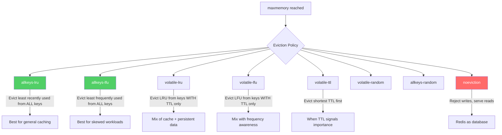
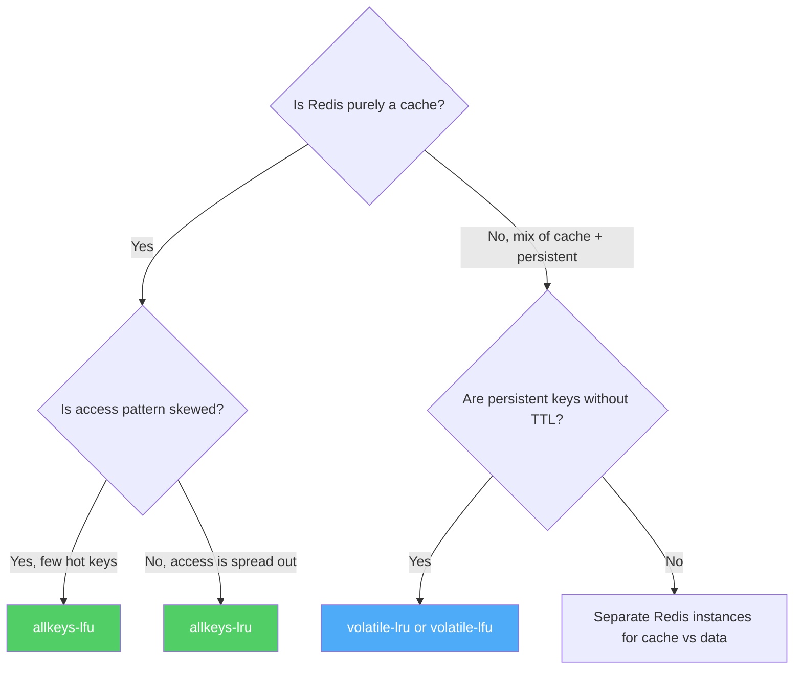
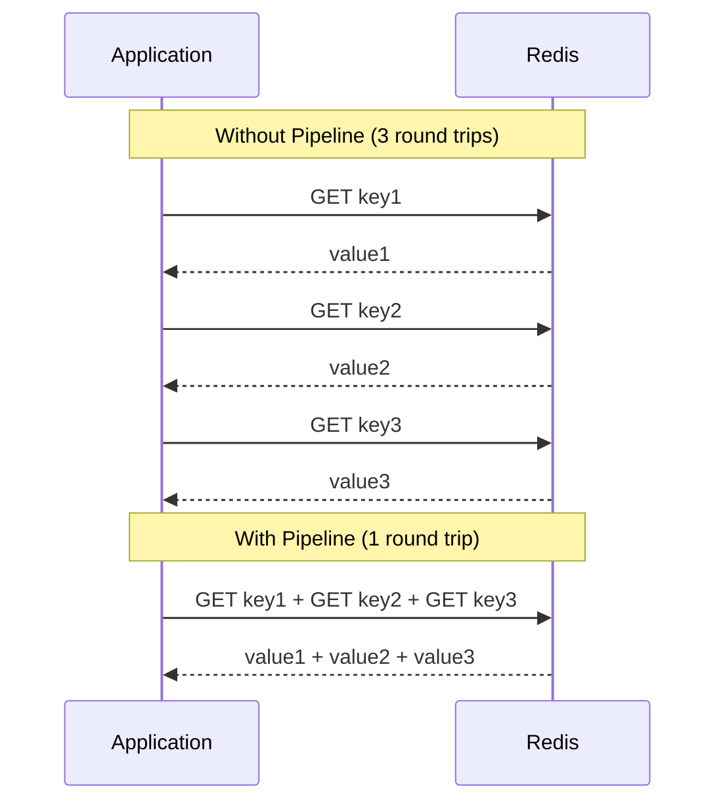
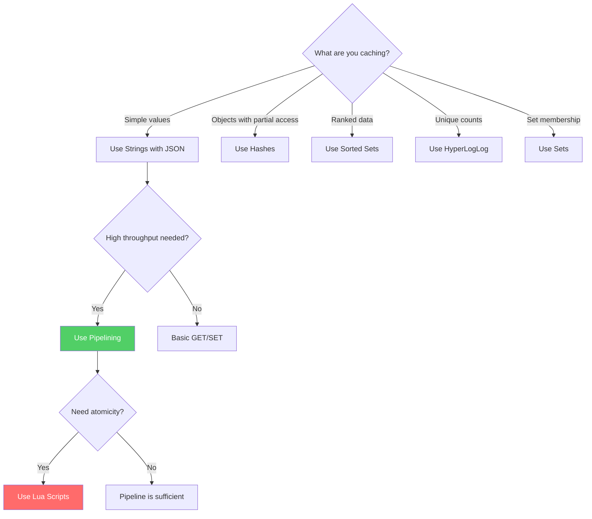

# Redis Caching Patterns

Redis is the most widely used caching layer in production systems. It is an in-memory data structure store that can function as a cache, a database, a message broker, and a stream engine. When used as a cache, Redis provides sub-millisecond latency, rich data structures beyond simple key-value pairs, and built-in eviction policies. But using Redis effectively requires understanding its memory model, eviction behavior, atomicity guarantees, and the specific patterns that exploit its strengths.

## Redis as Cache vs Redis as Database

This distinction is critical and frequently confused.

| Aspect | Redis as Cache | Redis as Database |
|--------|---------------|-------------------|
| Data loss tolerance | Acceptable (origin has the truth) | Unacceptable |
| Persistence | Disabled or RDB only | AOF + RDB, fsync always |
| Eviction policy | allkeys-lru or allkeys-lfu | noeviction |
| maxmemory | Set to available RAM | Set with headroom for growth |
| Replication | Nice-to-have | Required |
| TTL on keys | Always set | Rarely set |
| Data recovery | Re-fetch from origin | Restore from backup |

When using Redis as a cache, **treat every key as expendable**. Any key can be evicted at any time. Your application must handle the case where a key that "should" exist doesn't. If your application breaks when a Redis key is missing, you're using Redis as a database, not a cache.

## First Principles

Redis is single-threaded for command execution (since Redis 6, I/O is multi-threaded, but command execution is still single-threaded). This means:

1. **Every command is atomic.** No need for locks on individual operations.
2. **Long-running commands block everything.** An O(N) command on a large key blocks all other clients.
3. **Pipeline to amortize latency.** The bottleneck is usually network round trips, not Redis execution time.

## Eviction Policies

When Redis reaches its `maxmemory` limit, it must evict keys to make room for new ones. The eviction policy determines which keys are removed.

### The Policies



### Policy Deep Dive

**`allkeys-lru` (Recommended Default for Caching)**

Evicts the least recently used key from the entire keyspace. Best for general-purpose caching where recency is a good proxy for future access. Redis uses an **approximated LRU** — it samples `maxmemory-samples` random keys (default 5) and evicts the least recently used among the sample. Increasing the sample size improves accuracy but costs CPU.

**`allkeys-lfu` (Best for Skewed Workloads)**

Evicts the least frequently used key. Better than LRU when some keys are accessed in bursts (recently accessed but not popular) while other keys are steadily popular. LFU uses a logarithmic frequency counter that decays over time, preventing historical frequency from permanently pinning keys in cache.

LFU configuration:
```
lfu-log-factor 10     # Higher = slower counter growth (more accesses needed to increase)
lfu-decay-time 1      # Minutes between frequency counter halving
```

**`volatile-lru` / `volatile-lfu`**

Same as their `allkeys-` counterparts, but only evict keys that have a TTL set. Keys without a TTL are never evicted. Use this when Redis stores a mix of cache data (with TTL) and persistent data (without TTL).

**`volatile-ttl`**

Evicts keys with the shortest remaining TTL first. Useful when your TTL values encode priority — short TTL means less important.

**`noeviction`**

Rejects write commands when memory is full. Reads still work. Use this only when Redis is a database, not a cache.

### Choosing the Right Policy



### TypeScript: Monitoring Evictions

```typescript
import Redis from 'ioredis';

class RedisEvictionMonitor {
  private redis: Redis;
  private intervalId: ReturnType<typeof setInterval> | null = null;

  constructor(redis: Redis) {
    this.redis = redis;
  }

  async getEvictionStats(): Promise<EvictionStats> {
    const info = await this.redis.info('stats');
    const memory = await this.redis.info('memory');

    const evictedKeys = this.parseInfoField(info, 'evicted_keys');
    const keyspaceMisses = this.parseInfoField(info, 'keyspace_misses');
    const keyspaceHits = this.parseInfoField(info, 'keyspace_hits');
    const usedMemory = this.parseInfoField(memory, 'used_memory');
    const maxMemory = this.parseInfoField(memory, 'maxmemory');

    const hitRate = keyspaceHits / Math.max(keyspaceHits + keyspaceMisses, 1);

    return {
      evictedKeys,
      hitRate,
      missRate: 1 - hitRate,
      memoryUsedBytes: usedMemory,
      memoryMaxBytes: maxMemory,
      memoryUtilization: maxMemory > 0 ? usedMemory / maxMemory : 0,
    };
  }

  private parseInfoField(info: string, field: string): number {
    const match = info.match(new RegExp(`${field}:(\\d+)`));
    return match ? parseInt(match[1], 10) : 0;
  }

  startMonitoring(intervalMs: number = 10_000): void {
    this.intervalId = setInterval(async () => {
      const stats = await this.getEvictionStats();

      if (stats.memoryUtilization > 0.90) {
        console.warn(
          `Redis memory at ${(stats.memoryUtilization * 100).toFixed(1)}%. ` +
          `Evictions: ${stats.evictedKeys}. Hit rate: ${(stats.hitRate * 100).toFixed(1)}%`
        );
      }

      if (stats.hitRate < 0.80) {
        console.warn(
          `Redis hit rate low: ${(stats.hitRate * 100).toFixed(1)}%. ` +
          `Consider increasing maxmemory or reviewing key patterns.`
        );
      }
    }, intervalMs);
  }

  stopMonitoring(): void {
    if (this.intervalId) {
      clearInterval(this.intervalId);
      this.intervalId = null;
    }
  }
}

interface EvictionStats {
  evictedKeys: number;
  hitRate: number;
  missRate: number;
  memoryUsedBytes: number;
  memoryMaxBytes: number;
  memoryUtilization: number;
}
```

---

## Pipelining for Bulk Operations

Every Redis command requires a network round trip. For a single command, this is 0.5-2ms within a data center. For 100 commands issued sequentially, it's 50-200ms. Pipelining batches multiple commands into a single round trip.

### How Pipelining Works



### TypeScript: Pipeline Patterns

```typescript
class RedisCacheWithPipeline {
  private redis: Redis;
  private prefix: string;

  constructor(redis: Redis, prefix: string) {
    this.redis = redis;
    this.prefix = prefix;
  }

  /**
   * Bulk get: fetch multiple keys in a single round trip.
   */
  async getMany<T>(keys: string[]): Promise<Map<string, T | null>> {
    if (keys.length === 0) return new Map();

    const pipeline = this.redis.pipeline();
    const cacheKeys = keys.map((k) => `${this.prefix}:${k}`);

    for (const ck of cacheKeys) {
      pipeline.get(ck);
    }

    const results = await pipeline.exec();
    const map = new Map<string, T | null>();

    if (results) {
      for (let i = 0; i < keys.length; i++) {
        const [err, value] = results[i];
        if (!err && value !== null) {
          map.set(keys[i], JSON.parse(value as string) as T);
        } else {
          map.set(keys[i], null);
        }
      }
    }

    return map;
  }

  /**
   * Bulk set: store multiple key-value pairs in a single round trip.
   */
  async setMany<T>(
    entries: Array<{ key: string; value: T; ttlSeconds: number }>
  ): Promise<void> {
    if (entries.length === 0) return;

    const pipeline = this.redis.pipeline();

    for (const { key, value, ttlSeconds } of entries) {
      pipeline.set(
        `${this.prefix}:${key}`,
        JSON.stringify(value),
        'EX',
        ttlSeconds
      );
    }

    await pipeline.exec();
  }

  /**
   * Bulk delete: remove multiple keys in a single round trip.
   */
  async deleteMany(keys: string[]): Promise<void> {
    if (keys.length === 0) return;

    const pipeline = this.redis.pipeline();
    for (const key of keys) {
      pipeline.del(`${this.prefix}:${key}`);
    }
    await pipeline.exec();
  }

  /**
   * Get-or-fetch pattern with pipeline for L2 cache layer.
   * Returns hits from Redis, and a list of missed keys for origin fetch.
   */
  async getOrFetch<T>(
    keys: string[],
    fetcher: (missedKeys: string[]) => Promise<Map<string, T>>
  ): Promise<Map<string, T>> {
    // Step 1: Pipeline get all keys from Redis
    const cached = await this.getMany<T>(keys);

    // Step 2: Identify misses
    const missedKeys = keys.filter((k) => cached.get(k) === null);

    if (missedKeys.length === 0) {
      // All hits
      return cached as Map<string, T>;
    }

    // Step 3: Fetch missed keys from origin
    const fetched = await fetcher(missedKeys);

    // Step 4: Pipeline set fetched values into Redis
    const toCache: Array<{ key: string; value: T; ttlSeconds: number }> = [];
    for (const [key, value] of fetched) {
      toCache.push({ key, value, ttlSeconds: 300 });
      cached.set(key, value);
    }
    await this.setMany(toCache);

    return cached as Map<string, T>;
  }
}
```

### Pipeline Size Limits

Don't pipeline too many commands at once. A pipeline with 1 million commands will:
- Consume significant client-side memory (buffering all commands)
- Block Redis for longer (processing the batch)
- Risk timeout if the batch takes too long

**Recommended:** Pipeline in batches of 100-1000 commands.

---

## Lua Scripting for Atomic Operations

Redis Lua scripts execute atomically — no other command can run between the script's steps. This is essential for cache operations that require read-modify-write semantics.

### Pattern: Atomic Get-or-Set (Cache Stampede Prevention)

```typescript
class AtomicCache {
  private redis: Redis;

  constructor(redis: Redis) {
    this.redis = redis;
  }

  /**
   * Atomic cache check + lock acquisition.
   * Returns the cached value if present, or acquires a lock for cache population.
   *
   * Lua script ensures that checking the cache and setting the lock
   * happen atomically — no race between check and set.
   */
  async getOrLock(
    key: string,
    lockTtlSeconds: number
  ): Promise<{ hit: true; value: string } | { hit: false; lockAcquired: boolean }> {
    const script = `
      -- Check if key exists in cache
      local cached = redis.call('GET', KEYS[1])
      if cached then
        return {'HIT', cached}
      end

      -- Cache miss — try to acquire lock
      local lockKey = KEYS[1] .. ':lock'
      local acquired = redis.call('SET', lockKey, ARGV[1], 'NX', 'EX', ARGV[2])
      if acquired then
        return {'LOCK', 'acquired'}
      else
        return {'LOCK', 'waiting'}
      end
    `;

    const lockId = Math.random().toString(36).slice(2);
    const result = await this.redis.eval(
      script,
      1,
      key,
      lockId,
      lockTtlSeconds.toString()
    ) as string[];

    if (result[0] === 'HIT') {
      return { hit: true, value: result[1] };
    }

    return { hit: false, lockAcquired: result[1] === 'acquired' };
  }

  /**
   * Atomic increment with ceiling (rate limiting).
   * Returns the new count and whether the limit was exceeded.
   */
  async incrementWithLimit(
    key: string,
    limit: number,
    windowSeconds: number
  ): Promise<{ count: number; allowed: boolean }> {
    const script = `
      local current = redis.call('INCR', KEYS[1])
      if current == 1 then
        redis.call('EXPIRE', KEYS[1], ARGV[2])
      end
      if current > tonumber(ARGV[1]) then
        return {current, 0}
      end
      return {current, 1}
    `;

    const result = await this.redis.eval(
      script,
      1,
      key,
      limit.toString(),
      windowSeconds.toString()
    ) as number[];

    return { count: result[0], allowed: result[1] === 1 };
  }
}
```

### Pattern: Atomic Conditional Update

```typescript
/**
 * Update a cached value only if the version matches (optimistic concurrency).
 * Prevents write-write conflicts in cache.
 */
async function conditionalUpdate(
  redis: Redis,
  key: string,
  expectedVersion: number,
  newValue: string,
  newVersion: number,
  ttlSeconds: number
): Promise<boolean> {
  const script = `
    local current = redis.call('GET', KEYS[1])
    if not current then
      -- Key doesn't exist, set it
      redis.call('SET', KEYS[1], ARGV[1], 'EX', ARGV[3])
      return 1
    end

    local entry = cjson.decode(current)
    if entry.version ~= tonumber(ARGV[2]) then
      -- Version mismatch, reject update
      return 0
    end

    -- Version matches, apply update
    redis.call('SET', KEYS[1], ARGV[1], 'EX', ARGV[3])
    return 1
  `;

  const payload = JSON.stringify({ value: newValue, version: newVersion });
  const result = await redis.eval(
    script,
    1,
    key,
    payload,
    expectedVersion.toString(),
    ttlSeconds.toString()
  );

  return result === 1;
}
```

### Lua Script Best Practices

| Practice | Reason |
|----------|--------|
| Keep scripts short | Long scripts block all Redis operations |
| Use KEYS array for all key accesses | Required for Redis Cluster compatibility |
| Cache scripts with EVALSHA | Avoids transmitting the script text on every call |
| Never do I/O in Lua | No HTTP calls, no file access — Lua in Redis is sandboxed |
| Test with SCRIPT DEBUG | Redis has a built-in Lua debugger |

```typescript
// Pre-load script and use EVALSHA for efficiency
class CachedLuaScript {
  private redis: Redis;
  private script: string;
  private sha: string | null = null;

  constructor(redis: Redis, script: string) {
    this.redis = redis;
    this.script = script;
  }

  async execute(keys: string[], args: string[]): Promise<unknown> {
    if (!this.sha) {
      this.sha = await this.redis.script('LOAD', this.script) as string;
    }

    try {
      return await this.redis.evalsha(this.sha, keys.length, ...keys, ...args);
    } catch (error) {
      if (error instanceof Error && error.message.includes('NOSCRIPT')) {
        // Script was flushed — reload
        this.sha = await this.redis.script('LOAD', this.script) as string;
        return await this.redis.evalsha(this.sha, keys.length, ...keys, ...args);
      }
      throw error;
    }
  }
}
```

---

## Redis Data Structures for Caching

Redis is more than a key-value store. Its data structures enable caching patterns that are impossible with simple strings.

### Hashes: Caching Objects with Partial Updates

```typescript
class HashCache {
  private redis: Redis;
  private prefix: string;
  private ttlSeconds: number;

  constructor(redis: Redis, prefix: string, ttlSeconds: number) {
    this.redis = redis;
    this.prefix = prefix;
    this.ttlSeconds = ttlSeconds;
  }

  /**
   * Cache an object as a Redis Hash.
   * Allows partial reads and updates without deserializing the entire object.
   */
  async setObject(key: string, obj: Record<string, string | number>): Promise<void> {
    const ck = `${this.prefix}:${key}`;
    const pipeline = this.redis.pipeline();
    pipeline.hmset(ck, obj);
    pipeline.expire(ck, this.ttlSeconds);
    await pipeline.exec();
  }

  async getObject(key: string): Promise<Record<string, string> | null> {
    const ck = `${this.prefix}:${key}`;
    const result = await this.redis.hgetall(ck);
    return Object.keys(result).length > 0 ? result : null;
  }

  /**
   * Get specific fields only (avoids transferring the entire object).
   */
  async getFields(key: string, fields: string[]): Promise<(string | null)[]> {
    const ck = `${this.prefix}:${key}`;
    return this.redis.hmget(ck, ...fields);
  }

  /**
   * Update a single field without touching the rest.
   * Useful for incrementing counters, updating status, etc.
   */
  async updateField(key: string, field: string, value: string | number): Promise<void> {
    const ck = `${this.prefix}:${key}`;
    await this.redis.hset(ck, field, value.toString());
  }

  /**
   * Atomic increment of a numeric field.
   */
  async incrementField(key: string, field: string, amount: number = 1): Promise<number> {
    const ck = `${this.prefix}:${key}`;
    return this.redis.hincrby(ck, field, amount);
  }
}

// Usage: User profile cache with partial updates
const userCache = new HashCache(redis, 'user', 300);

// Cache a user profile
await userCache.setObject('123', {
  name: 'Alice',
  email: 'alice@example.com',
  loginCount: '42',
  lastLogin: Date.now().toString(),
});

// Increment login count without reading/writing the entire profile
await userCache.incrementField('123', 'loginCount');

// Get only the name and email (not the entire profile)
const [name, email] = await userCache.getFields('123', ['name', 'email']);
```

### Sorted Sets: Leaderboards and Top-N

```typescript
class LeaderboardCache {
  private redis: Redis;
  private key: string;
  private maxEntries: number;

  constructor(redis: Redis, key: string, maxEntries: number = 100) {
    this.redis = redis;
    this.key = key;
    this.maxEntries = maxEntries;
  }

  /**
   * Update a player's score. O(log N) per operation.
   */
  async updateScore(playerId: string, score: number): Promise<void> {
    const pipeline = this.redis.pipeline();
    pipeline.zadd(this.key, score, playerId);
    // Trim to top N to bound memory
    pipeline.zremrangebyrank(this.key, 0, -(this.maxEntries + 1));
    await pipeline.exec();
  }

  /**
   * Get top N players. Returns [{playerId, score, rank}].
   */
  async getTopN(n: number = 10): Promise<LeaderboardEntry[]> {
    const results = await this.redis.zrevrange(
      this.key,
      0,
      n - 1,
      'WITHSCORES'
    );

    const entries: LeaderboardEntry[] = [];
    for (let i = 0; i < results.length; i += 2) {
      entries.push({
        playerId: results[i],
        score: parseFloat(results[i + 1]),
        rank: i / 2 + 1,
      });
    }
    return entries;
  }

  /**
   * Get a player's rank and score.
   */
  async getPlayerRank(
    playerId: string
  ): Promise<{ rank: number; score: number } | null> {
    const pipeline = this.redis.pipeline();
    pipeline.zrevrank(this.key, playerId);
    pipeline.zscore(this.key, playerId);
    const results = await pipeline.exec();

    if (!results || results[0][1] === null) return null;

    return {
      rank: (results[0][1] as number) + 1,
      score: parseFloat(results[1][1] as string),
    };
  }
}

interface LeaderboardEntry {
  playerId: string;
  score: number;
  rank: number;
}
```

### HyperLogLog: Cardinality Estimation

HyperLogLog estimates the number of unique elements with only 12 KB of memory, regardless of the number of elements. Error rate: ~0.81%.

```typescript
class UniqueVisitorCounter {
  private redis: Redis;
  private prefix: string;

  constructor(redis: Redis, prefix: string) {
    this.redis = redis;
    this.prefix = prefix;
  }

  /**
   * Record a visit. Uses only 12 KB regardless of how many unique visitors.
   */
  async recordVisit(pageId: string, visitorId: string): Promise<void> {
    await this.redis.pfadd(`${this.prefix}:${pageId}`, visitorId);
  }

  /**
   * Get approximate unique visitor count. Error: ±0.81%.
   */
  async getUniqueVisitors(pageId: string): Promise<number> {
    return this.redis.pfcount(`${this.prefix}:${pageId}`);
  }

  /**
   * Merge multiple pages' visitors to get total unique visitors.
   * Result: unique visitors across ALL specified pages.
   */
  async getUniqueVisitorsAcrossPages(pageIds: string[]): Promise<number> {
    const keys = pageIds.map((id) => `${this.prefix}:${id}`);
    const tempKey = `${this.prefix}:_merged_${Date.now()}`;

    await this.redis.pfmerge(tempKey, ...keys);
    const count = await this.redis.pfcount(tempKey);
    await this.redis.del(tempKey);

    return count;
  }
}
```

---

## Session Storage Patterns

Redis is the standard choice for distributed session storage. Here's a production-grade implementation:

```typescript
interface Session {
  userId: string;
  createdAt: number;
  lastAccessedAt: number;
  data: Record<string, unknown>;
}

class RedisSessionStore {
  private redis: Redis;
  private prefix: string;
  private ttlSeconds: number;
  private slidingExpiry: boolean;

  constructor(
    redis: Redis,
    options: {
      prefix?: string;
      ttlSeconds?: number;
      slidingExpiry?: boolean;
    } = {}
  ) {
    this.redis = redis;
    this.prefix = options.prefix ?? 'session';
    this.ttlSeconds = options.ttlSeconds ?? 1800; // 30 minutes
    this.slidingExpiry = options.slidingExpiry ?? true;
  }

  private key(sessionId: string): string {
    return `${this.prefix}:${sessionId}`;
  }

  async create(userId: string, data: Record<string, unknown> = {}): Promise<string> {
    const sessionId = crypto.randomUUID();
    const session: Session = {
      userId,
      createdAt: Date.now(),
      lastAccessedAt: Date.now(),
      data,
    };

    await this.redis.set(
      this.key(sessionId),
      JSON.stringify(session),
      'EX',
      this.ttlSeconds
    );

    // Index: map userId to sessionIds (for "logout all devices")
    await this.redis.sadd(`${this.prefix}:user:${userId}`, sessionId);
    await this.redis.expire(
      `${this.prefix}:user:${userId}`,
      this.ttlSeconds * 2
    );

    return sessionId;
  }

  async get(sessionId: string): Promise<Session | null> {
    const raw = await this.redis.get(this.key(sessionId));
    if (raw === null) return null;

    const session: Session = JSON.parse(raw);
    session.lastAccessedAt = Date.now();

    if (this.slidingExpiry) {
      // Refresh TTL on access (sliding window)
      await this.redis.set(
        this.key(sessionId),
        JSON.stringify(session),
        'EX',
        this.ttlSeconds
      );
    }

    return session;
  }

  async update(
    sessionId: string,
    data: Partial<Record<string, unknown>>
  ): Promise<boolean> {
    const session = await this.get(sessionId);
    if (!session) return false;

    session.data = { ...session.data, ...data };
    session.lastAccessedAt = Date.now();

    await this.redis.set(
      this.key(sessionId),
      JSON.stringify(session),
      'EX',
      this.ttlSeconds
    );

    return true;
  }

  async destroy(sessionId: string): Promise<void> {
    const session = await this.get(sessionId);
    if (session) {
      await this.redis.srem(
        `${this.prefix}:user:${session.userId}`,
        sessionId
      );
    }
    await this.redis.del(this.key(sessionId));
  }

  /**
   * Destroy all sessions for a user (logout everywhere).
   */
  async destroyAllForUser(userId: string): Promise<number> {
    const sessionIds = await this.redis.smembers(
      `${this.prefix}:user:${userId}`
    );

    if (sessionIds.length > 0) {
      const pipeline = this.redis.pipeline();
      for (const sid of sessionIds) {
        pipeline.del(this.key(sid));
      }
      pipeline.del(`${this.prefix}:user:${userId}`);
      await pipeline.exec();
    }

    return sessionIds.length;
  }
}
```

---

## Rate Limiting with Redis

### Sliding Window Rate Limiter

```typescript
class SlidingWindowRateLimiter {
  private redis: Redis;

  constructor(redis: Redis) {
    this.redis = redis;
  }

  /**
   * Check if a request should be allowed.
   * Uses a sorted set where each element is a request timestamp.
   *
   * @param key Identifier (e.g., user ID, IP address)
   * @param limit Max requests allowed in the window
   * @param windowSeconds Window duration in seconds
   */
  async isAllowed(
    key: string,
    limit: number,
    windowSeconds: number
  ): Promise<{ allowed: boolean; remaining: number; resetAt: number }> {
    const now = Date.now();
    const windowStart = now - windowSeconds * 1000;
    const rateKey = `ratelimit:${key}`;

    // Lua script for atomicity
    const script = `
      local key = KEYS[1]
      local now = tonumber(ARGV[1])
      local window_start = tonumber(ARGV[2])
      local limit = tonumber(ARGV[3])
      local window_seconds = tonumber(ARGV[4])

      -- Remove expired entries
      redis.call('ZREMRANGEBYSCORE', key, '-inf', window_start)

      -- Count current entries
      local count = redis.call('ZCARD', key)

      if count < limit then
        -- Add this request
        redis.call('ZADD', key, now, now .. ':' .. math.random(1000000))
        redis.call('EXPIRE', key, window_seconds)
        return {1, limit - count - 1}
      else
        return {0, 0}
      end
    `;

    const result = await this.redis.eval(
      script,
      1,
      rateKey,
      now.toString(),
      windowStart.toString(),
      limit.toString(),
      windowSeconds.toString()
    ) as number[];

    return {
      allowed: result[0] === 1,
      remaining: result[1],
      resetAt: now + windowSeconds * 1000,
    };
  }
}
```

### Token Bucket Rate Limiter

```typescript
class TokenBucketRateLimiter {
  private redis: Redis;

  constructor(redis: Redis) {
    this.redis = redis;
  }

  /**
   * Token bucket algorithm: tokens are added at a fixed rate.
   * Each request consumes one token. If no tokens are available, the request is rejected.
   *
   * @param key Identifier
   * @param bucketSize Maximum tokens (burst capacity)
   * @param refillRate Tokens added per second
   */
  async consume(
    key: string,
    bucketSize: number,
    refillRate: number,
    tokensToConsume: number = 1
  ): Promise<{ allowed: boolean; remaining: number }> {
    const script = `
      local key = KEYS[1]
      local bucket_size = tonumber(ARGV[1])
      local refill_rate = tonumber(ARGV[2])
      local now = tonumber(ARGV[3])
      local tokens_to_consume = tonumber(ARGV[4])

      local bucket = redis.call('HMGET', key, 'tokens', 'last_refill')
      local tokens = tonumber(bucket[1])
      local last_refill = tonumber(bucket[2])

      if tokens == nil then
        -- Initialize bucket
        tokens = bucket_size
        last_refill = now
      else
        -- Refill tokens based on elapsed time
        local elapsed = (now - last_refill) / 1000
        local new_tokens = elapsed * refill_rate
        tokens = math.min(bucket_size, tokens + new_tokens)
        last_refill = now
      end

      local allowed = 0
      if tokens >= tokens_to_consume then
        tokens = tokens - tokens_to_consume
        allowed = 1
      end

      -- Save state
      redis.call('HMSET', key, 'tokens', tokens, 'last_refill', last_refill)
      redis.call('EXPIRE', key, math.ceil(bucket_size / refill_rate) + 1)

      return {allowed, math.floor(tokens)}
    `;

    const result = await this.redis.eval(
      script,
      1,
      `ratelimit:bucket:${key}`,
      bucketSize.toString(),
      refillRate.toString(),
      Date.now().toString(),
      tokensToConsume.toString()
    ) as number[];

    return {
      allowed: result[0] === 1,
      remaining: result[1],
    };
  }
}
```

---

## Cache Stampede Prevention with SETNX

The `SET key value NX EX ttl` pattern (set if not exists, with expiry) is the foundation of distributed lock-based stampede prevention in Redis:

```typescript
class RedisStampedePrevention {
  private redis: Redis;

  constructor(redis: Redis) {
    this.redis = redis;
  }

  /**
   * Fetch-through cache with SETNX-based stampede prevention.
   * Only one client populates the cache on a miss.
   */
  async getOrFetch<T>(
    key: string,
    fetcher: () => Promise<T>,
    ttlSeconds: number,
    lockTtlSeconds: number = 10
  ): Promise<T> {
    // Check cache
    const cached = await this.redis.get(key);
    if (cached !== null) {
      return JSON.parse(cached) as T;
    }

    // Try to acquire lock
    const lockKey = `${key}:populating`;
    const lockValue = `${process.pid}:${Date.now()}`;
    const acquired = await this.redis.set(
      lockKey,
      lockValue,
      'NX',
      'EX',
      lockTtlSeconds
    );

    if (acquired === 'OK') {
      // We hold the lock — fetch and populate
      try {
        const data = await fetcher();
        await this.redis.set(key, JSON.stringify(data), 'EX', ttlSeconds);
        return data;
      } finally {
        // Release lock (only if we still hold it)
        const currentLock = await this.redis.get(lockKey);
        if (currentLock === lockValue) {
          await this.redis.del(lockKey);
        }
      }
    }

    // Someone else is populating — wait for cache to be filled
    for (let i = 0; i < lockTtlSeconds * 20; i++) {
      await new Promise((resolve) => setTimeout(resolve, 50));
      const result = await this.redis.get(key);
      if (result !== null) {
        return JSON.parse(result) as T;
      }
    }

    // Timeout — fetch ourselves as a fallback
    return fetcher();
  }
}
```

::: info War Story
**The Redis Cluster Key Distribution Disaster (Gaming, 2021)**

A gaming company used Redis Cluster with 6 shards for their leaderboard cache. They stored all leaderboard data under keys like `leaderboard:global`, `leaderboard:daily`, `leaderboard:weekly`. Because Redis Cluster hashes keys based on the first hash tag or the full key name, all three keys hashed to the same slot, landing on the same shard. One shard handled 80% of all traffic while five shards sat idle.

The fix: understanding Redis Cluster key distribution. They changed keys to `{global}:leaderboard`, `{daily}:leaderboard`, `{weekly}:leaderboard` to control hash tag distribution, and used `CLUSTER KEYSLOT` to verify even distribution across shards. After redistribution, each shard handled approximately 16% of traffic.
:::

::: info War Story
**The Lua Script Timeout (Fintech, 2023)**

A fintech company wrote a Lua script that computed portfolio value by iterating over all holdings (stored as a sorted set with up to 10,000 elements). The script took 200ms to execute on large portfolios. During this time, ALL other Redis commands were blocked — including health checks. The monitoring system reported Redis as "down" and triggered a failover to a replica. The replica also received the same Lua script, which also blocked for 200ms, causing another failover. This oscillation continued until the on-call engineer manually killed the Lua script.

The fix: moved the computation out of Lua and into application code. Lua scripts in Redis must be fast (under 5ms). Any computation that takes longer should be done client-side, with only atomic read/write operations in Lua.
:::

## Performance Characteristics

| Operation | Time Complexity | Latency (typical) |
|-----------|----------------|-------------------|
| GET/SET string | O(1) | 0.1-0.5 ms |
| HGET/HSET | O(1) | 0.1-0.5 ms |
| ZADD/ZRANK | O(log N) | 0.1-1 ms |
| ZRANGE (top 10) | O(log N + 10) | 0.1-1 ms |
| Pipeline (100 ops) | O(100 × individual) | 1-3 ms (total) |
| Lua script (simple) | O(depends) | 0.1-5 ms |
| PFADD/PFCOUNT | O(1) | 0.1-0.5 ms |
| KEYS pattern | O(N) | **DO NOT USE IN PRODUCTION** |
| SCAN | O(1) per iteration | 0.1-0.5 ms per iteration |

## Decision Framework



## Advanced: Redis Connection Management with ioredis

```typescript
import Redis from 'ioredis';

function createRedisClient(config: {
  host: string;
  port: number;
  password?: string;
  db?: number;
  maxRetriesPerRequest?: number;
  enableReadyCheck?: boolean;
  lazyConnect?: boolean;
}): Redis {
  const client = new Redis({
    host: config.host,
    port: config.port,
    password: config.password,
    db: config.db ?? 0,
    maxRetriesPerRequest: config.maxRetriesPerRequest ?? 3,
    enableReadyCheck: config.enableReadyCheck ?? true,
    lazyConnect: config.lazyConnect ?? false,
    retryStrategy(times: number) {
      if (times > 10) {
        // Stop retrying after 10 attempts
        return null;
      }
      // Exponential backoff: 50ms, 100ms, 200ms, ...
      return Math.min(times * 50, 2000);
    },
    reconnectOnError(err: Error) {
      // Reconnect on READONLY errors (failover scenario)
      return err.message.includes('READONLY');
    },
  });

  client.on('error', (err) => {
    console.error('Redis connection error:', err.message);
  });

  client.on('connect', () => {
    console.log('Redis connected');
  });

  client.on('ready', () => {
    console.log('Redis ready');
  });

  return client;
}

// Cluster configuration
function createRedisCluster(nodes: Array<{ host: string; port: number }>): Redis.Cluster {
  return new Redis.Cluster(nodes, {
    redisOptions: {
      password: process.env.REDIS_PASSWORD,
      maxRetriesPerRequest: 3,
    },
    scaleReads: 'slave', // Read from replicas for read-heavy workloads
    natMap: {}, // For NAT/Docker environments
    clusterRetryStrategy(times: number) {
      if (times > 5) return null;
      return Math.min(times * 100, 3000);
    },
  });
}
```
