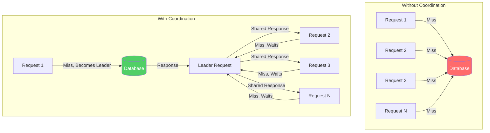
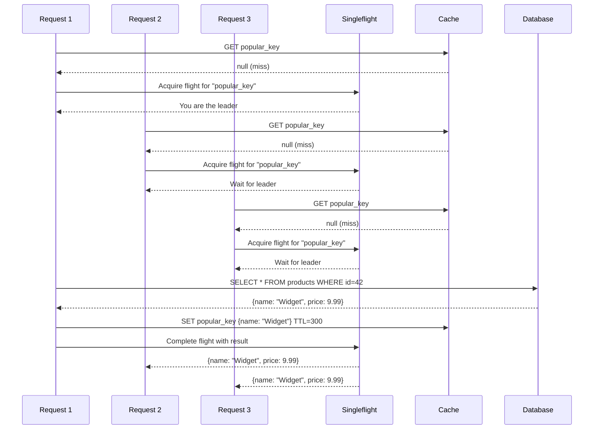
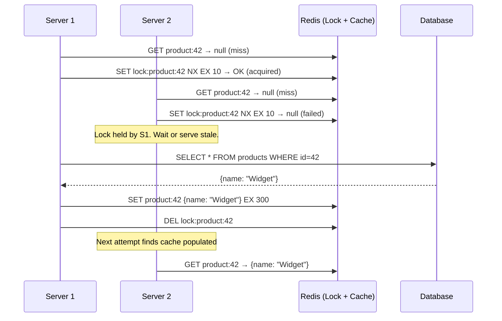
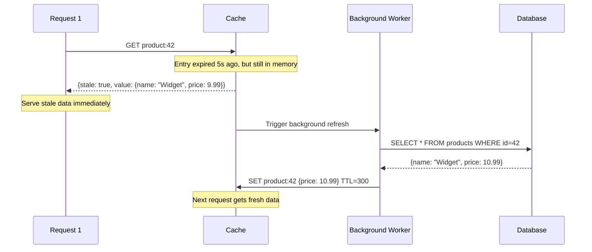

# Thundering Herd

The thundering herd problem is the most dangerous failure mode in caching. When a popular cache entry expires, all concurrent requests for that entry simultaneously discover the cache miss and independently query the origin database. Instead of one query to refresh the cache, you get thousands. The database — designed to be protected by the cache — is suddenly hit by the full unfiltered load, and it collapses. The cache that was supposed to save your system becomes the weapon that kills it.

## Why This Matters

A cache with a 99% hit rate and 10,000 requests per second means the database handles 100 requests per second. That's manageable. But when a popular key expires and 10,000 requests all miss simultaneously, the database receives 10,000 requests in a single instant. That's a 100x spike. Most databases cannot absorb that.

The thundering herd is particularly insidious because:
- It only manifests under **high concurrency** (testing with a single client never triggers it)
- It is **self-reinforcing** (DB slows down → cache population takes longer → more requests pile up → more DB load)
- It happens at the **worst possible time** (when the most popular content expires)

## First Principles

The root cause is simple: **multiple processes independently react to the same event (cache miss) without coordination**. Each process makes the same decision ("I should refresh this cache entry") without knowing that others are making the same decision simultaneously.

Every solution follows the same principle: **coordinate the response to a cache miss so that only one request reaches the origin**.



## The Math: Why It's Dangerous

Let's quantify. Suppose a cache key receives $r$ requests per second and has a TTL of $T$ seconds. After the TTL expires, there is a window $\delta$ (the time it takes to recompute and re-cache the value) during which all arriving requests are cache misses.

The expected number of simultaneous cache misses (the "herd size") is:

$$
H = r \cdot \delta
$$

For a key receiving 5,000 requests/second with a 100ms recomputation time:

$$
H = 5000 \times 0.1 = 500 \text{ simultaneous DB queries}
$$

If the database can handle 200 queries/second at acceptable latency, those 500 queries arrive in a burst, not spread over a second. The burst factor makes it worse:

$$
\text{Burst Load} = H \cdot \frac{1}{\delta} = r
$$

The burst is equivalent to sending $r$ queries in $\delta$ time — which is the full request rate, unfiltered by the cache. The cache provides zero value during this window.

### The Self-Reinforcing Loop

When the DB is overwhelmed:

1. Recomputation time $\delta$ increases (DB is slow)
2. More requests arrive during the window: $H = r \cdot \delta' > r \cdot \delta$
3. DB becomes even more overwhelmed
4. $\delta$ increases further

This is a positive feedback loop. Without intervention, it continues until the database crashes or the request rate drops (often by returning errors, which is an outage).

$$
\delta_{n+1} = f(\delta_n) \quad \text{where } f(\delta) > \delta \text{ under overload}
$$

---

## Solution 1: Request Coalescing (Singleflight Pattern)

The singleflight pattern ensures that only one request for a given cache key reaches the origin. All other concurrent requests for the same key **wait** for the first request's result and share it.

### How It Works



### TypeScript Implementation

```typescript
type InflightEntry<T> = {
  promise: Promise<T>;
  resolve: (value: T) => void;
  reject: (error: Error) => void;
};

class Singleflight<T> {
  private inflight: Map<string, InflightEntry<T>> = new Map();

  /**
   * Execute a function, coalescing concurrent calls with the same key.
   * Only the first caller actually executes the function.
   * All concurrent callers receive the same result.
   */
  async do(key: string, fn: () => Promise<T>): Promise<T> {
    // Check if a request is already in flight
    const existing = this.inflight.get(key);
    if (existing) {
      return existing.promise;
    }

    // Create the inflight entry
    let resolve!: (value: T) => void;
    let reject!: (error: Error) => void;
    const promise = new Promise<T>((res, rej) => {
      resolve = res;
      reject = rej;
    });

    this.inflight.set(key, { promise, resolve, reject });

    try {
      const result = await fn();
      resolve(result);
      return result;
    } catch (error) {
      reject(error instanceof Error ? error : new Error(String(error)));
      throw error;
    } finally {
      this.inflight.delete(key);
    }
  }

  /**
   * Returns the number of in-flight requests.
   * Useful for monitoring.
   */
  getInflightCount(): number {
    return this.inflight.size;
  }
}

// Usage with a cache
class CacheWithSingleflight<T> {
  private redis: Redis;
  private singleflight: Singleflight<T | null>;
  private ttlSeconds: number;
  private prefix: string;

  constructor(redis: Redis, options: { ttlSeconds: number; prefix: string }) {
    this.redis = redis;
    this.singleflight = new Singleflight();
    this.ttlSeconds = options.ttlSeconds;
    this.prefix = options.prefix;
  }

  private cacheKey(key: string): string {
    return `${this.prefix}:${key}`;
  }

  async get(
    key: string,
    fetcher: () => Promise<T | null>
  ): Promise<T | null> {
    const ck = this.cacheKey(key);

    // Check cache first
    const cached = await this.redis.get(ck);
    if (cached !== null) {
      return JSON.parse(cached) as T;
    }

    // Coalesce concurrent cache misses
    return this.singleflight.do(ck, async () => {
      // Double-check cache (another coalesced request may have populated it)
      const recheck = await this.redis.get(ck);
      if (recheck !== null) {
        return JSON.parse(recheck) as T;
      }

      // Fetch from origin
      const data = await fetcher();
      if (data !== null) {
        await this.redis.set(ck, JSON.stringify(data), 'EX', this.ttlSeconds);
      }
      return data;
    });
  }
}
```

### Edge Cases

**Error propagation:** If the leader request fails, all waiting requests also receive the error. This is usually correct (if the DB is down, all requests should fail), but can be surprising if the failure is transient. Consider allowing one retry before propagating the error.

**Stale waiter problem:** If the leader request takes a long time (e.g., 30 seconds), all waiting requests also wait 30 seconds. Add a timeout to the singleflight and let waiters fall through to a stale cache or error response.

```typescript
async doWithTimeout(
  key: string,
  fn: () => Promise<T>,
  timeoutMs: number
): Promise<T> {
  const existing = this.inflight.get(key);
  if (existing) {
    // Don't wait forever — if the leader is slow, timeout and try ourselves
    return Promise.race([
      existing.promise,
      new Promise<T>((_, reject) =>
        setTimeout(
          () => reject(new Error('Singleflight timeout')),
          timeoutMs
        )
      ),
    ]);
  }
  // ... leader logic as above
}
```

### Limitation: Single-Process Only

The basic singleflight pattern only coalesces requests within a single process. In a distributed system with multiple application servers, each server has its own singleflight — so you still get N simultaneous DB queries (one per server). For cross-process coalescing, see **distributed locking** below.

---

## Solution 2: Probabilistic Early Expiration (XFetch Algorithm)

The XFetch algorithm prevents thundering herds by having each request independently decide whether to refresh the cache **before it expires**, using a probabilistic function that increases the refresh probability as the TTL approaches zero.

### The Core Idea

Instead of all requests missing simultaneously when TTL hits zero, XFetch makes it increasingly likely that a single request will "volunteer" to refresh the cache early, while all other requests continue to serve the existing cached value. The probability of volunteering is calibrated so that, on average, exactly one request triggers a refresh.

### The Algorithm

For a cache entry with:
- $\delta$ = the time it took to compute the value (stored alongside the value)
- $\text{expiry}$ = the absolute expiry time
- $\beta$ = a tuning parameter (default: 1.0)

The entry should be recomputed if:

$$
\text{now} - \delta \cdot \beta \cdot \ln(\text{random}()) \geq \text{expiry}
$$

where $\text{random}()$ returns a uniform random number in $(0, 1]$.

### Mathematical Proof of Correctness

The term $-\delta \cdot \beta \cdot \ln(\text{random}())$ follows an exponential distribution with mean $\delta \cdot \beta$. As `now` approaches `expiry`, the left side approaches `expiry`, making the inequality increasingly likely to be true.

The probability that a given request triggers an early refresh at time $t$ before expiry is:

$$
P(\text{refresh at } t) = 1 - e^{-\frac{(\text{expiry} - t)}{\delta \cdot \beta}}
$$

Wait — actually, we need the probability to increase as $t$ approaches expiry. Let $\tau = \text{expiry} - t$ (time remaining). Then:

$$
P(\text{refresh}) = e^{-\frac{\tau}{\delta \cdot \beta}}
$$

When $\tau \gg \delta \cdot \beta$ (far from expiry), $P \approx 0$ — almost no one refreshes early.
When $\tau \approx 0$ (near expiry), $P \approx 1$ — almost everyone would refresh.
When $\tau = \delta \cdot \beta$, $P = e^{-1} \approx 0.368$.

The expected number of requests that trigger an early refresh is:

$$
E[\text{refreshes}] = \sum_{i=1}^{r \cdot \delta \cdot \beta} P_i \approx 1
$$

This is the key result: the algorithm is calibrated so that, in expectation, exactly one request triggers the refresh.

### TypeScript Implementation

```typescript
interface XFetchEntry<T> {
  value: T;
  delta: number;    // Time it took to compute (in seconds)
  expiry: number;   // Absolute expiry timestamp (in seconds)
}

class XFetchCache<T> {
  private redis: Redis;
  private ttlSeconds: number;
  private beta: number;
  private prefix: string;
  private singleflight: Singleflight<T | null>;

  constructor(
    redis: Redis,
    options: {
      ttlSeconds: number;
      beta?: number; // Default 1.0
      prefix: string;
    }
  ) {
    this.redis = redis;
    this.ttlSeconds = options.ttlSeconds;
    this.beta = options.beta ?? 1.0;
    this.prefix = options.prefix;
    this.singleflight = new Singleflight();
  }

  private cacheKey(key: string): string {
    return `${this.prefix}:${key}`;
  }

  async get(
    key: string,
    fetcher: () => Promise<T | null>
  ): Promise<T | null> {
    const ck = this.cacheKey(key);
    const raw = await this.redis.get(ck);

    if (raw !== null) {
      const entry: XFetchEntry<T> = JSON.parse(raw);
      const now = Date.now() / 1000;

      // XFetch probabilistic check
      if (!this.shouldRefresh(entry, now)) {
        return entry.value;
      }

      // This request volunteers to refresh — do it asynchronously
      // while returning the current (soon-to-expire) value
      this.refreshAsync(key, ck, fetcher);
      return entry.value;
    }

    // True cache miss — need synchronous fetch
    return this.singleflight.do(ck, async () => {
      // Double-check
      const recheck = await this.redis.get(ck);
      if (recheck !== null) {
        return (JSON.parse(recheck) as XFetchEntry<T>).value;
      }
      return this.fetchAndCache(key, ck, fetcher);
    });
  }

  private shouldRefresh(entry: XFetchEntry<T>, now: number): boolean {
    const timeRemaining = entry.expiry - now;
    if (timeRemaining <= 0) return true; // Already expired

    // XFetch formula: now - delta * beta * ln(random()) >= expiry
    // Equivalent: -delta * beta * ln(random()) >= timeRemaining
    const threshold = -entry.delta * this.beta * Math.log(Math.random());
    return threshold >= timeRemaining;
  }

  private async refreshAsync(
    key: string,
    cacheKey: string,
    fetcher: () => Promise<T | null>
  ): Promise<void> {
    // Fire-and-forget async refresh with singleflight
    this.singleflight
      .do(`refresh:${cacheKey}`, () => this.fetchAndCache(key, cacheKey, fetcher))
      .catch((err) => {
        console.error(`XFetch refresh failed for key=${key}:`, err);
      });
  }

  private async fetchAndCache(
    key: string,
    cacheKey: string,
    fetcher: () => Promise<T | null>
  ): Promise<T | null> {
    const startTime = Date.now();
    const data = await fetcher();
    const delta = (Date.now() - startTime) / 1000; // seconds

    if (data === null) return null;

    const entry: XFetchEntry<T> = {
      value: data,
      delta,
      expiry: Date.now() / 1000 + this.ttlSeconds,
    };

    await this.redis.set(
      cacheKey,
      JSON.stringify(entry),
      'EX',
      this.ttlSeconds
    );

    return data;
  }
}
```

### Tuning the Beta Parameter

- $\beta < 1$: Less aggressive early refresh. Higher chance of actual expiry before refresh. Use when compute cost is high and you want to minimize unnecessary refreshes.
- $\beta = 1$: Default. Good balance for most workloads.
- $\beta > 1$: More aggressive early refresh. Cache entries are refreshed well before expiry. Use for very popular keys where a miss is extremely expensive.

The optimal $\beta$ depends on the request rate $r$ and compute time $\delta$:

$$
\beta_{\text{optimal}} = \frac{1}{\ln(r \cdot \delta)}
$$

For $r = 1000$ req/s and $\delta = 0.05$s:

$$
\beta_{\text{optimal}} = \frac{1}{\ln(50)} \approx 0.256
$$

---

## Solution 3: Distributed Locking

When you have multiple application servers, singleflight only coalesces requests within a single process. Distributed locking ensures that across ALL servers, only one request refreshes the cache.

### How It Works



### TypeScript Implementation

```typescript
class LockingCache<T> {
  private redis: Redis;
  private ttlSeconds: number;
  private lockTtlSeconds: number;
  private prefix: string;
  private maxWaitMs: number;
  private pollIntervalMs: number;

  constructor(
    redis: Redis,
    options: {
      ttlSeconds: number;
      lockTtlSeconds?: number;
      prefix: string;
      maxWaitMs?: number;
      pollIntervalMs?: number;
    }
  ) {
    this.redis = redis;
    this.ttlSeconds = options.ttlSeconds;
    this.lockTtlSeconds = options.lockTtlSeconds ?? 10;
    this.prefix = options.prefix;
    this.maxWaitMs = options.maxWaitMs ?? 5000;
    this.pollIntervalMs = options.pollIntervalMs ?? 50;
  }

  private cacheKey(key: string): string {
    return `${this.prefix}:${key}`;
  }

  private lockKey(key: string): string {
    return `lock:${this.prefix}:${key}`;
  }

  async get(
    key: string,
    fetcher: () => Promise<T | null>
  ): Promise<T | null> {
    const ck = this.cacheKey(key);

    // Check cache
    const cached = await this.redis.get(ck);
    if (cached !== null) {
      return JSON.parse(cached) as T;
    }

    // Try to acquire lock
    const lockAcquired = await this.redis.set(
      this.lockKey(key),
      '1',
      'EX',
      this.lockTtlSeconds,
      'NX'
    );

    if (lockAcquired === 'OK') {
      // We are the leader — fetch and cache
      try {
        const data = await fetcher();
        if (data !== null) {
          await this.redis.set(ck, JSON.stringify(data), 'EX', this.ttlSeconds);
        }
        return data;
      } finally {
        // Release lock
        await this.redis.del(this.lockKey(key));
      }
    }

    // Lock not acquired — wait for the leader to populate the cache
    return this.waitForCache(ck, fetcher);
  }

  private async waitForCache(
    cacheKey: string,
    fetcher: () => Promise<T | null>
  ): Promise<T | null> {
    const deadline = Date.now() + this.maxWaitMs;

    while (Date.now() < deadline) {
      const cached = await this.redis.get(cacheKey);
      if (cached !== null) {
        return JSON.parse(cached) as T;
      }

      // Wait before polling again
      await new Promise((resolve) =>
        setTimeout(resolve, this.pollIntervalMs)
      );
    }

    // Timeout — fall through and fetch ourselves
    // This is a safety valve: if the leader crashed, we don't wait forever
    const data = await fetcher();
    if (data !== null) {
      await this.redis.set(
        cacheKey,
        JSON.stringify(data),
        'EX',
        this.ttlSeconds
      );
    }
    return data;
  }
}
```

### Lock Pitfalls

| Pitfall | Description | Mitigation |
|---------|-------------|------------|
| Lock holder crashes | Lock is held forever, all waiters timeout | Use TTL on lock (`EX` flag) |
| Lock holder is slow | Waiters timeout, issue their own queries | Generous lock TTL, but not too generous |
| Lock contention | Many servers compete for the lock | Lock is set NX (only one wins), others wait |
| Polling overhead | Waiters poll Redis repeatedly | Use Redis pub/sub notification instead of polling |
| False lock release | Holder A's lock expires, Holder B acquires, A deletes B's lock | Use unique lock values (UUID) and Lua script to check-then-delete |

---

## Solution 4: Stale-While-Revalidate

Instead of blocking on a cache miss, serve the stale (expired) value immediately and refresh in the background. The client gets a response instantly (from the stale cache), and the next request gets fresh data.

### How It Works



### TypeScript Implementation

```typescript
interface StaleEntry<T> {
  value: T;
  softExpiry: number;  // When the entry is "logically" expired (revalidation triggered)
  hardExpiry: number;  // When the entry is truly deleted
}

class StaleWhileRevalidateCache<T> {
  private redis: Redis;
  private softTtlSeconds: number;
  private hardTtlSeconds: number;
  private prefix: string;
  private revalidating: Set<string> = new Set();

  constructor(
    redis: Redis,
    options: {
      softTtlSeconds: number;  // When to start revalidating
      hardTtlSeconds: number;  // When to actually expire
      prefix: string;
    }
  ) {
    this.redis = redis;
    this.softTtlSeconds = options.softTtlSeconds;
    this.hardTtlSeconds = options.hardTtlSeconds;
    this.prefix = options.prefix;
  }

  private cacheKey(key: string): string {
    return `${this.prefix}:${key}`;
  }

  async get(
    key: string,
    fetcher: () => Promise<T | null>
  ): Promise<T | null> {
    const ck = this.cacheKey(key);
    const raw = await this.redis.get(ck);

    if (raw !== null) {
      const entry: StaleEntry<T> = JSON.parse(raw);
      const now = Date.now() / 1000;

      if (now < entry.softExpiry) {
        // Fresh — return as-is
        return entry.value;
      }

      // Stale but within hard TTL — serve stale, revalidate async
      this.revalidateAsync(key, ck, fetcher);
      return entry.value;
    }

    // True miss — synchronous fetch
    return this.fetchAndCache(key, ck, fetcher);
  }

  private revalidateAsync(
    key: string,
    cacheKey: string,
    fetcher: () => Promise<T | null>
  ): void {
    if (this.revalidating.has(cacheKey)) return;
    this.revalidating.add(cacheKey);

    this.fetchAndCache(key, cacheKey, fetcher)
      .catch((err) => {
        console.error(`Revalidation failed for ${key}:`, err);
      })
      .finally(() => {
        this.revalidating.delete(cacheKey);
      });
  }

  private async fetchAndCache(
    key: string,
    cacheKey: string,
    fetcher: () => Promise<T | null>
  ): Promise<T | null> {
    const data = await fetcher();
    if (data === null) return null;

    const now = Date.now() / 1000;
    const entry: StaleEntry<T> = {
      value: data,
      softExpiry: now + this.softTtlSeconds,
      hardExpiry: now + this.hardTtlSeconds,
    };

    await this.redis.set(
      cacheKey,
      JSON.stringify(entry),
      'EX',
      this.hardTtlSeconds
    );

    return data;
  }
}

// Usage
const cache = new StaleWhileRevalidateCache<Product>(redis, {
  softTtlSeconds: 60,   // Fresh for 1 minute
  hardTtlSeconds: 3600,  // Stale-serveable for 1 hour
  prefix: 'product',
});
```

### Stale-While-Revalidate in HTTP

The `Cache-Control` header natively supports this pattern:

```
Cache-Control: max-age=60, stale-while-revalidate=3600
```

This tells the CDN/browser: "Cache for 60 seconds. After that, serve stale for up to 3600 seconds while revalidating in the background."

---

## Comparison of Solutions

| Solution | Scope | Complexity | Latency Impact | Stale Data? | Best For |
|----------|-------|------------|----------------|-------------|----------|
| Singleflight | Single process | Low | Waiters blocked until leader finishes | No | Application servers with moderate concurrency |
| XFetch | Per-request (probabilistic) | Medium | No blocking (proactive refresh) | Brief, during refresh | High-traffic keys with predictable access |
| Distributed Lock | Cross-process | Medium | Waiters poll/wait | No | Multi-server deployments |
| Stale-While-Revalidate | Per-request | Low | No blocking (serve stale) | Yes, during revalidation | Low-sensitivity data, UX-critical paths |

## Combined Approach

In production, combine multiple solutions for defense in depth:

```typescript
class ProductionCache<T> {
  // Layer 1: Stale-while-revalidate prevents user-visible latency
  // Layer 2: XFetch prevents synchronized expiry
  // Layer 3: Singleflight coalesces within each process
  // Layer 4: Distributed lock coalesces across processes

  async get(key: string, fetcher: () => Promise<T | null>): Promise<T | null> {
    // Check cache with stale-while-revalidate
    const entry = await this.getEntry(key);

    if (entry && !this.isHardExpired(entry)) {
      if (this.isSoftExpired(entry) && this.xfetchShouldRefresh(entry)) {
        // Async refresh with singleflight
        this.refreshAsync(key, fetcher);
      }
      return entry.value;
    }

    // True miss — singleflight + distributed lock
    return this.singleflight.do(key, async () => {
      // Double-check cache
      const recheck = await this.getEntry(key);
      if (recheck && !this.isHardExpired(recheck)) {
        return recheck.value;
      }

      // Acquire distributed lock
      const lock = await this.acquireLock(key);
      if (!lock) {
        return this.waitForRefresh(key);
      }

      try {
        return await this.fetchAndCache(key, fetcher);
      } finally {
        await this.releaseLock(key, lock);
      }
    });
  }
}
```

::: info War Story
**The Super Bowl Cache Stampede (Streaming Platform, 2020)**

A video streaming platform cached the list of available streams. During the Super Bowl, 20 million users were on the platform. The cache TTL was 60 seconds. Every 60 seconds, the cache expired, and all 20 million clients made API calls that resulted in cache misses. The backend databases received 200,000+ queries in a single second (some clients were batched by load balancers), causing a cascade of failures.

The fix was three-fold: (1) XFetch to prevent synchronized expiry, (2) stale-while-revalidate to ensure users always got a response, and (3) TTL jitter with a 15-second random offset to spread misses. The combined effect reduced peak miss rate from 200,000/second to about 50/second.
:::

::: info War Story
**The Singleflight Error Amplification (Fintech, 2023)**

A fintech company implemented singleflight for exchange rate lookups. When the upstream rate provider had a brief outage (2 seconds), the singleflight leader request failed, and the error was propagated to all 500 waiting requests. This caused 500 simultaneous error responses, triggering alerts and customer complaints.

The fix: the singleflight implementation was modified to retry once on failure before propagating the error. Additionally, the stale-while-revalidate pattern was added so that during upstream outages, the last known exchange rate was served (with a staleness warning in the response metadata).
:::

## Performance Analysis

### Cost of No Protection

Without thundering herd protection, the cost of a cache miss for a key with request rate $r$ and recompute time $\delta$:

$$
\text{DB queries per miss event} = r \cdot \delta
$$

$$
\text{Total DB load per TTL cycle} = r \cdot \delta + \frac{r \cdot (T - \delta)}{T} \cdot 0
$$

Wait — let's think about this more carefully. During the TTL window $T$, the cache is hot and the DB sees 0 queries. When the TTL expires, the DB sees $r \cdot \delta$ queries in $\delta$ seconds. So the average DB query rate is:

$$
\bar{q} = \frac{r \cdot \delta}{T + \delta} \approx \frac{r \cdot \delta}{T} \quad \text{for } T \gg \delta
$$

### Cost With Singleflight

With singleflight (within a single process), the DB sees exactly 1 query per miss event per process. With $N$ application servers:

$$
\bar{q}_{\text{singleflight}} = \frac{N}{T}
$$

### Cost With Distributed Lock

With distributed locking, the DB sees exactly 1 query per miss event across all servers:

$$
\bar{q}_{\text{lock}} = \frac{1}{T}
$$

### Cost With XFetch

XFetch spreads the refresh across a window proportional to $\delta \cdot \beta$. The expected number of early refreshes is approximately 1:

$$
\bar{q}_{\text{xfetch}} \approx \frac{1}{T}
$$

But with the benefit of no coordination overhead and no waiters.

## Advanced: Lease-Based Protection (Facebook TAO)

Facebook's TAO (The Associations and Objects) system uses **leases** to prevent thundering herds at scale. When a cache miss occurs, the cache server issues a lease token. Only the request holding the lease can populate the cache. Other requests for the same key within the lease period receive a "wait" response.

Key properties:
- Leases are short-lived (typically 10 seconds)
- If the lease holder doesn't populate the cache in time, the lease expires and another request can try
- Leases also prevent **stale sets** — a delayed write from an old request cannot overwrite a newer value because its lease has expired

This is conceptually similar to distributed locking but implemented at the cache layer rather than the application layer, making it transparent to the application.
