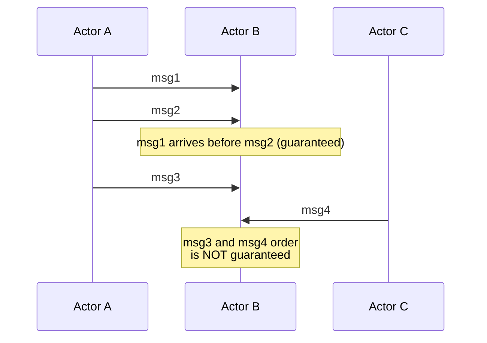
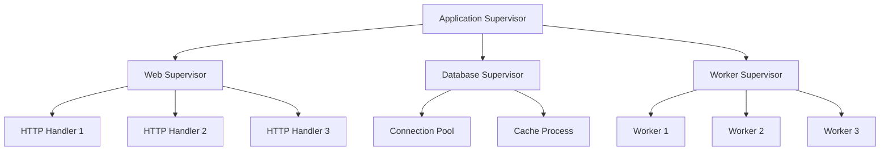
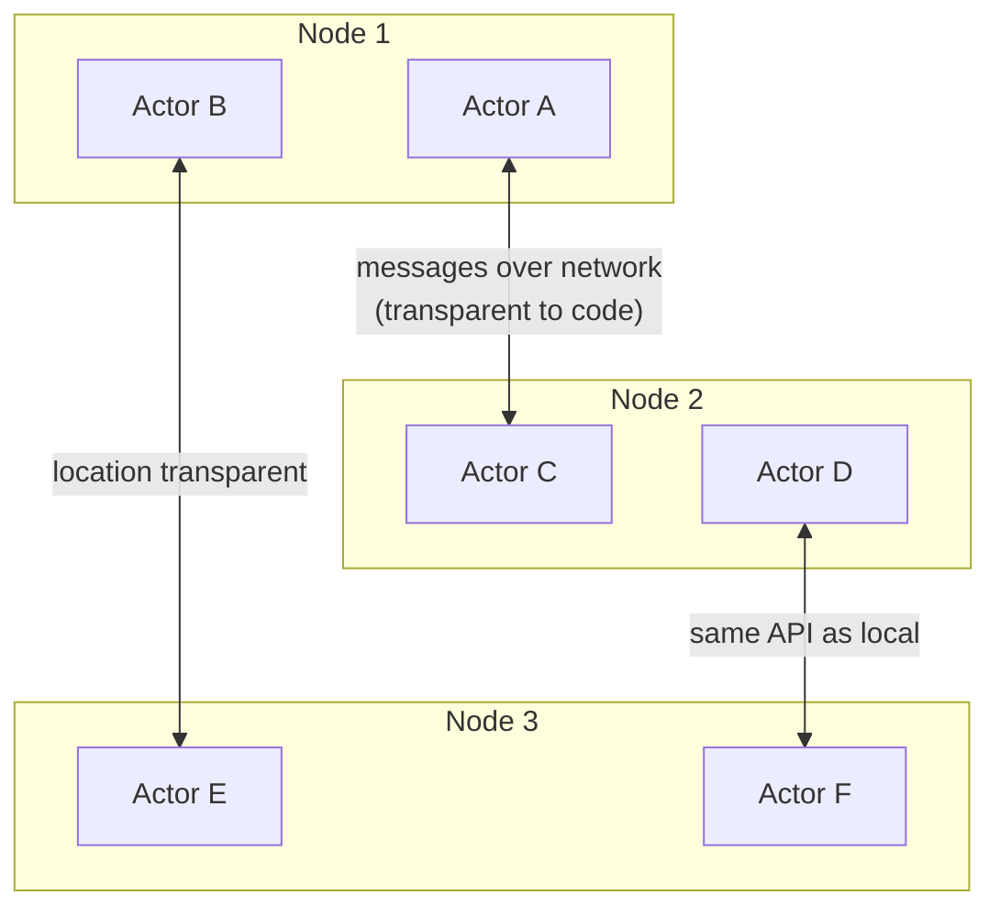
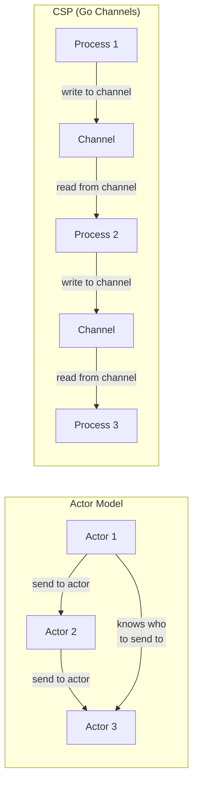

# Actor Model

## What Is the Actor Model?

The actor model, introduced by Carl Hewitt in 1973, is a mathematical model of concurrent computation where the **actor** is the fundamental unit. An actor is an independent entity that:

1. **Receives messages** — via an asynchronous mailbox
2. **Processes messages one at a time** — no concurrent access to internal state
3. **In response to a message, can:**
   - Send messages to other actors
   - Create new actors
   - Change its own internal state for the next message

The key insight: **there is no shared mutable state.** Each actor owns its state exclusively. Communication happens only through asynchronous message passing. This eliminates data races, deadlocks, and the entire class of shared-memory concurrency bugs.

```mermaid
graph TD
    subgraph "Actor A"
        MA[Mailbox A] --> BA[Behavior A<br/>State: count=5]
    end

    subgraph "Actor B"
        MB[Mailbox B] --> BB[Behavior B<br/>State: name='Alice']
    end

    subgraph "Actor C"
        MC[Mailbox C] --> BC[Behavior C<br/>State: items=[...]]
    end

    BA -->|"send message"| MB
    BA -->|"send message"| MC
    BB -->|"send message"| MA
    BC -->|"send message"| MA
```

## Core Concepts

### Mailbox

Every actor has a **mailbox** — a queue of incoming messages. Messages are processed sequentially, one at a time. This sequential processing guarantee eliminates the need for locks within an actor.

```
Actor Lifecycle:
  1. Receive message from mailbox
  2. Process message (may update state, send messages, create actors)
  3. Return to step 1

The actor never processes two messages concurrently.
```

### Location Transparency

A key property of the actor model is that the code sending a message does not know (or care) whether the target actor is:
- In the same process
- On a different thread
- On a different machine across the network

This makes the actor model a natural fit for distributed systems — scaling from one machine to a cluster requires no code changes.

### Message Ordering Guarantees

Between any **pair** of actors, message delivery order is guaranteed (FIFO). But across different sender-receiver pairs, there is no global ordering:



## Erlang/OTP

Erlang is the most mature actor model implementation, battle-tested in telecom systems since the 1980s. The BEAM virtual machine was designed from the ground up for concurrent, distributed, fault-tolerant systems.

### Erlang Processes

Erlang "processes" are actors — extremely lightweight (only ~300 bytes each), preemptively scheduled by the BEAM VM. A typical Erlang system runs millions of processes.

```erlang
%% Erlang: a simple counter actor
-module(counter).
-export([start/1, increment/1, get/1]).

start(InitialValue) ->
    spawn(fun() -> loop(InitialValue) end).

loop(Count) ->
    receive
        {increment, Amount} ->
            loop(Count + Amount);
        {get, Caller} ->
            Caller ! {count, Count},
            loop(Count);
        stop ->
            ok  % Process terminates
    end.

increment(Pid) ->
    Pid ! {increment, 1}.

get(Pid) ->
    Pid ! {get, self()},
    receive
        {count, Value} -> Value
    end.
```

```elixir
# Elixir: GenServer (OTP behavior for actors)
defmodule Counter do
  use GenServer

  # Client API
  def start_link(initial \\ 0) do
    GenServer.start_link(__MODULE__, initial)
  end

  def increment(pid, amount \\ 1) do
    GenServer.cast(pid, {:increment, amount})
  end

  def get(pid) do
    GenServer.call(pid, :get)
  end

  # Server callbacks
  @impl true
  def init(initial), do: {:ok, initial}

  @impl true
  def handle_cast({:increment, amount}, count) do
    {:noreply, count + amount}
  end

  @impl true
  def handle_call(:get, _from, count) do
    {:reply, count, count}
  end
end
```

### OTP Supervision Trees

OTP's supervision trees are the crown jewel of Erlang — a hierarchical system for managing actor lifecycles and recovering from failures.



Supervision strategies:

| Strategy | Behavior | Use Case |
|----------|----------|----------|
| **one_for_one** | Restart only the failed child | Independent workers |
| **one_for_all** | Restart ALL children when one fails | Tightly coupled processes |
| **rest_for_one** | Restart the failed child and all children started after it | Sequential dependencies |
| **simple_one_for_one** | Dynamic pool of identical workers | Worker pools |

```elixir
# Elixir: Supervisor with restart strategies
defmodule MyApp.Supervisor do
  use Supervisor

  def start_link(opts) do
    Supervisor.start_link(__MODULE__, :ok, opts)
  end

  @impl true
  def init(:ok) do
    children = [
      {MyApp.Cache, []},
      {MyApp.DatabasePool, pool_size: 10},
      {MyApp.WebServer, port: 4000},
    ]

    # If the cache crashes, only restart the cache
    Supervisor.init(children, strategy: :one_for_one)
  end
end
```

::: tip Let It Crash
Erlang's philosophy is radically different from defensive programming. Instead of trying to handle every error, **let the process crash** and let the supervisor restart it in a clean state. This works because:
1. Processes are cheap to restart (milliseconds)
2. The state is reconstructed from scratch (no corruption)
3. Transient errors (network glitch, corrupted message) are automatically cleared
4. The supervision tree limits the blast radius
:::

## Akka (JVM)

Akka brings the actor model to the JVM with a Scala and Java API. It supports both classic actors and the newer Typed Actors API.

```java
// Akka Typed (Java): a counter actor
public class Counter extends AbstractBehavior<Counter.Command> {

    // Messages (commands)
    public interface Command {}
    public record Increment(int amount) implements Command {}
    public record GetCount(ActorRef<CountResponse> replyTo) implements Command {}
    public record CountResponse(int count) {}

    // State
    private int count;

    private Counter(ActorContext<Command> context, int initial) {
        super(context);
        this.count = initial;
    }

    public static Behavior<Command> create(int initial) {
        return Behaviors.setup(ctx -> new Counter(ctx, initial));
    }

    @Override
    public Receive<Command> createReceive() {
        return newReceiveBuilder()
            .onMessage(Increment.class, this::onIncrement)
            .onMessage(GetCount.class, this::onGetCount)
            .build();
    }

    private Behavior<Command> onIncrement(Increment cmd) {
        this.count += cmd.amount();
        return this;
    }

    private Behavior<Command> onGetCount(GetCount cmd) {
        cmd.replyTo().tell(new CountResponse(this.count));
        return this;
    }
}
```

### Akka Cluster

Akka extends naturally to distributed systems with Akka Cluster — actors can communicate across nodes transparently:



## Microsoft Orleans (Virtual Actors)

Orleans introduces **virtual actors** (called "grains") — actors that always exist conceptually, are activated on demand, and deactivated automatically when idle.

```csharp
// Orleans: grain interface
public interface IPlayerGrain : IGrainWithStringKey
{
    Task<PlayerState> GetState();
    Task AddScore(int points);
    Task<int> GetScore();
}

// Orleans: grain implementation
public class PlayerGrain : Grain, IPlayerGrain
{
    private PlayerState _state;

    public override async Task OnActivateAsync(CancellationToken ct)
    {
        _state = await LoadFromDatabase(this.GetPrimaryKeyString());
    }

    public Task<PlayerState> GetState() => Task.FromResult(_state);

    public Task AddScore(int points)
    {
        _state.Score += points;
        return Task.CompletedTask;
    }

    public Task<int> GetScore() => Task.FromResult(_state.Score);
}

// Calling a grain — Orleans handles activation, placement, and routing
var player = grainFactory.GetGrain<IPlayerGrain>("player-123");
await player.AddScore(100);
// The grain may be on any server in the cluster
// Orleans activates it on demand and routes the call transparently
```

### Virtual Actors vs Traditional Actors

| Aspect | Traditional Actors (Akka, Erlang) | Virtual Actors (Orleans) |
|--------|----------------------------------|-------------------------|
| **Lifecycle** | Explicitly created and destroyed | Always exist conceptually, auto-activated |
| **Addressing** | Actor references (addresses) | Identity-based (string/guid key) |
| **Placement** | Manual or configured | Automatic, runtime-managed |
| **Persistence** | Developer-managed | Framework-managed (grain state) |
| **Learning curve** | Steeper — must manage lifecycle | Gentler — grains feel like objects |
| **Failure handling** | Supervision trees | Automatic reactivation on failure |

## Actor Model vs CSP

CSP (Communicating Sequential Processes) is a related concurrency model used by Go. Both use message passing, but they differ in fundamental ways:



| Aspect | Actor Model | CSP (Go Channels) |
|--------|------------|-------------------|
| **Communication** | Send to a known actor | Write to/read from a channel |
| **Addressing** | Actor identity (who) | Channel identity (where) |
| **Coupling** | Actors know their recipients | Processes know their channels, not each other |
| **Buffering** | Unbounded mailbox (usually) | Bounded or unbounded channels |
| **Distribution** | Natural — actors can be remote | Channels are typically in-process |
| **Backpressure** | Must be implemented manually | Built-in with bounded channels |
| **Languages** | Erlang, Akka, Orleans | Go, Clojure core.async |

```go
// Go CSP: channels decouple producers from consumers
func producer(out chan<- int) {
    for i := 0; i < 100; i++ {
        out <- i // Blocks if channel is full (backpressure)
    }
    close(out)
}

func consumer(in <-chan int, out chan<- string) {
    for n := range in {
        out <- fmt.Sprintf("processed: %d", n)
    }
    close(out)
}

func main() {
    numbers := make(chan int, 10)   // Buffered channel
    results := make(chan string, 10)

    go producer(numbers)
    go consumer(numbers, results)

    for result := range results {
        fmt.Println(result)
    }
}
```

## Building an Actor System (TypeScript)

While TypeScript does not have built-in actors, you can build a simple actor system to understand the concepts:

```typescript
type Message = { type: string; payload?: unknown; replyTo?: Actor<any> };

class Actor<S> {
  private mailbox: Message[] = [];
  private processing = false;

  constructor(
    private state: S,
    private handler: (state: S, msg: Message) => { state: S; messages?: Array<{ target: Actor<any>; msg: Message }> },
  ) {}

  send(msg: Message): void {
    this.mailbox.push(msg);
    this.processNext();
  }

  private async processNext(): Promise<void> {
    if (this.processing || this.mailbox.length === 0) return;
    this.processing = true;

    const msg = this.mailbox.shift()!;
    const result = this.handler(this.state, msg);
    this.state = result.state;

    // Send outgoing messages
    for (const { target, msg } of result.messages ?? []) {
      target.send(msg);
    }

    this.processing = false;
    this.processNext(); // Process next message
  }
}

// Counter actor
const counter = new Actor(0, (count, msg) => {
  switch (msg.type) {
    case 'increment':
      return { state: count + (msg.payload as number ?? 1) };
    case 'get':
      return {
        state: count,
        messages: msg.replyTo
          ? [{ target: msg.replyTo, msg: { type: 'count', payload: count } }]
          : [],
      };
    default:
      return { state: count };
  }
});

counter.send({ type: 'increment', payload: 5 });
counter.send({ type: 'increment', payload: 3 });
counter.send({ type: 'get', replyTo: loggerActor });
```

## When to Use the Actor Model

| Scenario | Actor Model? | Reason |
|----------|-------------|--------|
| IoT device management (millions of stateful entities) | **Yes** | Each device is a natural actor |
| Game servers (player sessions, game rooms) | **Yes** | Each player/room has independent state |
| Financial trading systems | **Yes** | Isolation prevents cascading failures |
| Simple CRUD web API | **No** | Stateless request handling is simpler |
| Batch data processing | **Depends** | Map-reduce or stream processing may be better |
| Chat/messaging systems | **Yes** | Each conversation is a natural actor |
| Real-time collaborative editing | **Yes** | Each document session as an actor |

::: warning Common Pitfalls
1. **Mailbox overflow** — Unbounded mailboxes can cause OOM. Add backpressure.
2. **Ask pattern overuse** — Synchronous ask (request-response) between actors negates the async benefits. Prefer tell (fire-and-forget) patterns.
3. **Actor granularity** — Too many fine-grained actors add routing overhead. Too few large actors recreate the shared-state problem.
4. **Distributed state** — The actor model does not solve distributed consistency. You still need [consensus algorithms](/system-design/consensus/) for strong consistency across nodes.
:::

## Further Reading

- [Concurrency & Parallelism Overview](./) — threading models and fundamentals
- [Lock-Free Data Structures](./lock-free) — alternative approach for shared-memory concurrency
- [Real-Time Systems](./real-time-systems) — WebSockets, presence, CRDTs
- [Message Queues](/system-design/message-queues/) — async messaging between services
- [Distributed Systems](/system-design/distributed-systems/) — consistency and partition tolerance
