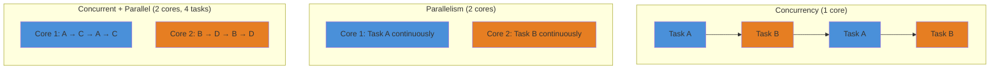
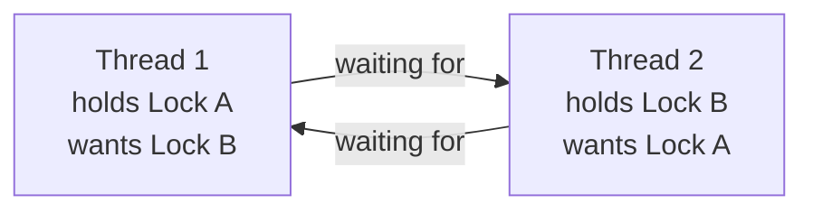
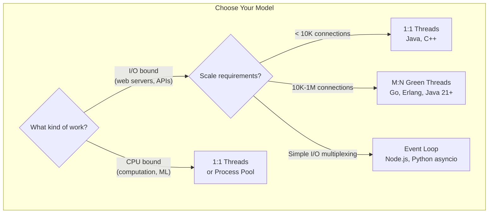

# Concurrency & Parallelism

## The Fundamental Distinction

> Concurrency is about **dealing with** lots of things at once. Parallelism is about **doing** lots of things at once.
> — Rob Pike

This distinction matters because they solve different problems and require different tools:

- **Concurrency** is a software design concern — structuring a program so that multiple tasks can make progress, even on a single CPU core. A web server handling 10,000 connections on one core is concurrent.
- **Parallelism** is a hardware concern — executing multiple computations simultaneously across multiple CPU cores. A matrix multiplication using all 16 cores is parallel.



| Aspect | Concurrency | Parallelism |
|--------|------------|-------------|
| **Definition** | Multiple tasks making progress | Multiple tasks executing simultaneously |
| **Hardware** | Possible on 1 core | Requires multiple cores |
| **Goal** | Responsiveness, throughput | Speed, computation power |
| **Examples** | Web server, UI thread, async I/O | Map-reduce, video encoding, ML training |
| **Challenges** | Race conditions, deadlocks, starvation | Data partitioning, load balancing, synchronization |

## Why Concurrency Is Hard

Concurrent programming is harder than sequential programming because of three fundamental challenges:

### 1. Shared Mutable State

When multiple threads access the same memory and at least one modifies it, the result depends on the order of execution — which is nondeterministic.

```go
// DATA RACE: two goroutines modifying the same variable
var counter int = 0

func increment() {
    for i := 0; i < 1000; i++ {
        counter++ // Not atomic: read → increment → write
    }
}

func main() {
    go increment()
    go increment()
    time.Sleep(time.Second)
    fmt.Println(counter) // Could be 1000, 1500, 2000, or anything in between
}
```

The `counter++` operation is not atomic — it is three operations: read the value, add one, write the value back. If two threads interleave these operations:

```
Thread A: read counter (0)
Thread B: read counter (0)
Thread A: increment (1)
Thread B: increment (1)
Thread A: write counter (1)
Thread B: write counter (1)   ← Lost update! Should be 2
```

### 2. Deadlocks

A deadlock occurs when two or more threads are each waiting for the other to release a resource:



Four conditions must all hold simultaneously for a deadlock (Coffman conditions):

1. **Mutual exclusion**: Resources cannot be shared
2. **Hold and wait**: A thread holds one resource while waiting for another
3. **No preemption**: Resources cannot be forcibly taken from a thread
4. **Circular wait**: A circular chain of threads, each waiting for the next

### 3. Starvation and Livelock

- **Starvation**: A thread never gets to run because other threads always have priority
- **Livelock**: Threads are active but make no progress — like two people in a hallway who keep stepping aside in the same direction

## Threading Models

### 1:1 (Kernel Threads)

Each application thread maps to one operating system thread. Used by Java, C++, Rust.

```
Application:  Thread 1    Thread 2    Thread 3
                 ↓           ↓           ↓
OS Kernel:   KThread 1   KThread 2   KThread 3
                 ↓           ↓           ↓
Hardware:    Core 1      Core 2      Core 1
```

| Pros | Cons |
|------|------|
| True parallelism across cores | Expensive to create (~1 MB stack per thread) |
| OS handles scheduling | Context switches are expensive (~1-10 us) |
| Blocking I/O is fine | Limited by OS thread limits (thousands, not millions) |

### M:N (Green Threads)

M application-level threads (green threads) are multiplexed onto N kernel threads. Used by Go (goroutines), Erlang (processes), Java (virtual threads since 21).

```
Application:  G1 G2 G3 G4 G5 G6 G7 G8  (8 goroutines)
                 ↓   ↓   ↓   ↓
Runtime:      KThread1 KThread2 KThread3 KThread4  (4 OS threads)
                 ↓       ↓       ↓       ↓
Hardware:     Core 1   Core 2   Core 3   Core 4
```

| Pros | Cons |
|------|------|
| Lightweight (~4 KB stack in Go) | Runtime scheduler adds complexity |
| Millions of concurrent tasks | Blocking system calls need special handling |
| Fast context switches (userspace) | Debugging is harder (stack traces differ) |

### Event Loop (Single-Threaded Concurrency)

A single thread processes events from a queue, using non-blocking I/O. Used by Node.js, Python asyncio, Nginx.

```
Event Queue: [request1, db_response, request2, timer, ...]
                 ↓
Event Loop:  Process event → Register callback → Next event
                 ↓
I/O:         OS-level async I/O (epoll/kqueue/IOCP)
```

| Pros | Cons |
|------|------|
| No thread safety issues (single thread) | CPU-bound work blocks the loop |
| Very efficient for I/O-bound workloads | Cannot utilize multiple cores (need workers) |
| Low memory overhead | Callback complexity (mitigated by async/await) |

### Comparison



## Shared Memory vs Message Passing

There are two fundamental approaches to communication between concurrent tasks:

### Shared Memory

Threads communicate by reading and writing shared data, protected by synchronization primitives (mutexes, semaphores, atomic operations).

```java
// Java: shared memory with synchronized access
class BankAccount {
    private final Lock lock = new ReentrantLock();
    private long balance;

    public void transfer(BankAccount target, long amount) {
        // Lock ordering prevents deadlock
        Lock first = System.identityHashCode(this) < System.identityHashCode(target)
            ? this.lock : target.lock;
        Lock second = first == this.lock ? target.lock : this.lock;

        first.lock();
        try {
            second.lock();
            try {
                if (this.balance >= amount) {
                    this.balance -= amount;
                    target.balance += amount;
                }
            } finally {
                second.unlock();
            }
        } finally {
            first.unlock();
        }
    }
}
```

### Message Passing

Tasks communicate by sending messages through channels. No shared state — each task owns its data exclusively.

```go
// Go: message passing with channels
func worker(id int, jobs <-chan Job, results chan<- Result) {
    for job := range jobs {
        result := process(job) // Each worker owns its own data
        results <- result       // Send result through channel
    }
}

func main() {
    jobs := make(chan Job, 100)
    results := make(chan Result, 100)

    // Start workers
    for w := 0; w < 10; w++ {
        go worker(w, jobs, results)
    }

    // Send jobs
    for _, job := range allJobs {
        jobs <- job
    }
    close(jobs)

    // Collect results
    for i := 0; i < len(allJobs); i++ {
        result := <-results
        fmt.Println(result)
    }
}
```

### Comparison

| Aspect | Shared Memory | Message Passing |
|--------|--------------|-----------------|
| **Communication** | Read/write shared data | Send/receive messages |
| **Synchronization** | Locks, atomics, barriers | Channel operations |
| **Data ownership** | Shared (dangerous) | Exclusive (safe) |
| **Debugging** | Hard (non-deterministic) | Easier (deterministic message order) |
| **Performance** | Lower latency (no copying) | Higher latency (data copying/moving) |
| **Scaling** | Within single machine | Across machines naturally |
| **Languages** | C, C++, Java, Rust | Go, Erlang, Elixir, Akka |

::: tip Go's philosophy
"Do not communicate by sharing memory; instead, share memory by communicating." — Effective Go

This is not just a slogan — it captures a fundamental insight: message passing eliminates an entire class of bugs (data races) by making shared mutable state structurally impossible.
:::

## Concurrency Primitives

### Mutex (Mutual Exclusion)

```typescript
// TypeScript: simple async mutex
class Mutex {
  private locked = false;
  private queue: (() => void)[] = [];

  async acquire(): Promise<void> {
    if (!this.locked) {
      this.locked = true;
      return;
    }
    return new Promise(resolve => this.queue.push(resolve));
  }

  release(): void {
    if (this.queue.length > 0) {
      const next = this.queue.shift()!;
      next();
    } else {
      this.locked = false;
    }
  }
}
```

### Semaphore

```python
# Python: limit concurrent operations
import asyncio

async def fetch_with_limit(urls: list[str], max_concurrent: int = 10):
    semaphore = asyncio.Semaphore(max_concurrent)

    async def fetch_one(url: str) -> Response:
        async with semaphore:  # At most max_concurrent tasks run here
            async with aiohttp.ClientSession() as session:
                return await session.get(url)

    return await asyncio.gather(*[fetch_one(url) for url in urls])
```

### Atomic Operations

```go
// Go: atomic counter (no mutex needed)
import "sync/atomic"

var counter int64

func increment() {
    atomic.AddInt64(&counter, 1) // Atomic read-modify-write
}

func getCount() int64 {
    return atomic.LoadInt64(&counter) // Atomic read
}
```

## Concurrency Patterns at a Glance

| Pattern | Description | Use Case |
|---------|------------|----------|
| **Producer-Consumer** | Producers put work in a queue, consumers process it | [Message queues](/system-design/message-queues/), work pools |
| **Fan-out/Fan-in** | Distribute work to many workers, collect results | Parallel API calls, map-reduce |
| **Pipeline** | Chain of stages, each processing and forwarding | Data processing, stream transformation |
| **Actor Model** | Independent actors communicate via messages | [Actor Model](./actor-model) |
| **CSP** | Communicating Sequential Processes — goroutines + channels | Go concurrency |
| **Lock-free** | Use atomic operations instead of locks | [Lock-Free Data Structures](./lock-free) |
| **Thread Pool** | Fixed set of threads processing queued tasks | HTTP servers, database connections |

## Further Reading

- [Lock-Free Data Structures](./lock-free) — CAS operations, ABA problem, memory ordering
- [Actor Model](./actor-model) — Akka, Erlang/OTP, supervision trees
- [Real-Time Systems](./real-time-systems) — WebSockets, SSE, CRDTs for collaborative editing
- [Distributed Systems](/system-design/distributed-systems/) — concurrency across machines
- [Message Queues](/system-design/message-queues/) — asynchronous communication patterns
