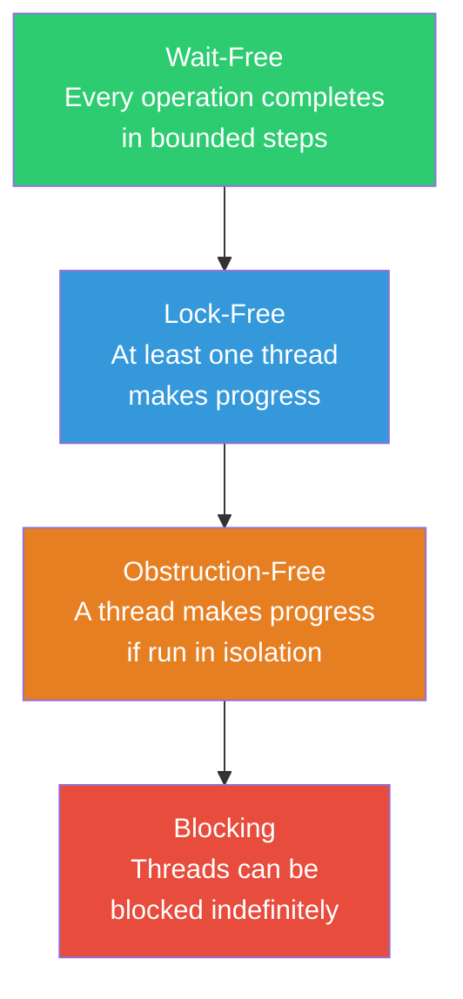
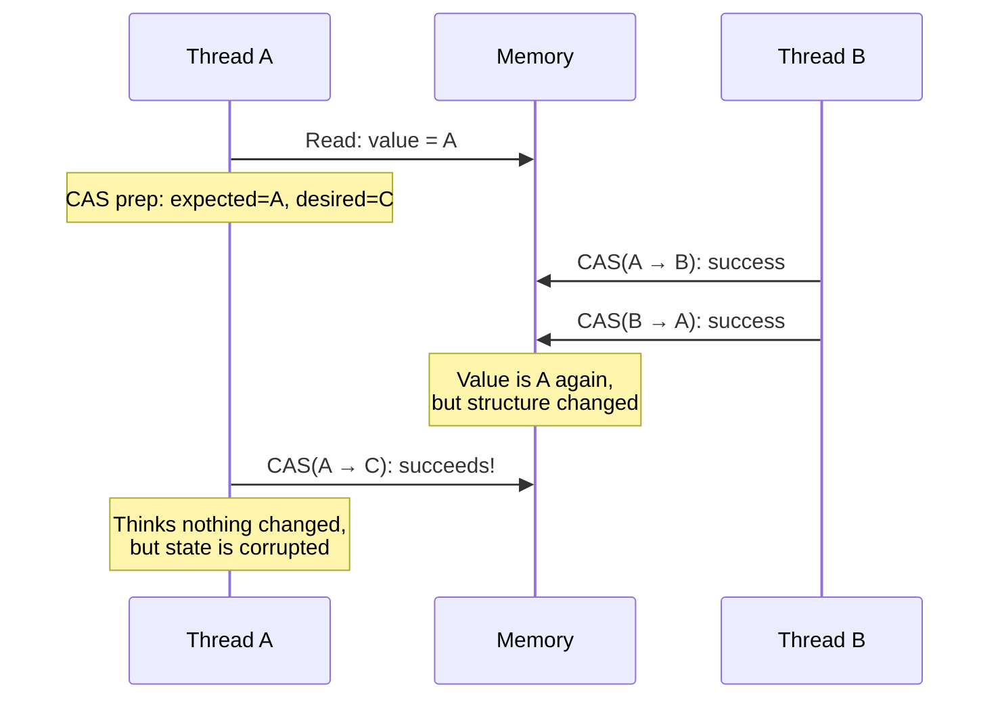
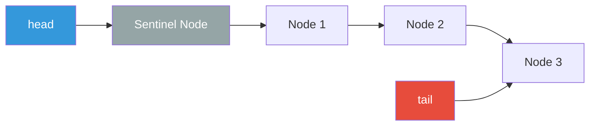
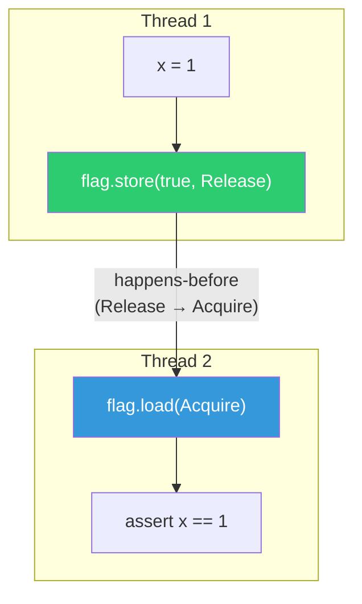

# Lock-Free Data Structures

## Why Lock-Free?

Locks work. For most applications, a well-placed mutex or read-write lock is the correct solution. But locks have fundamental limitations:

| Problem | Description |
|---------|-------------|
| **Blocking** | A thread waiting for a lock makes no progress — wasted CPU time |
| **Priority inversion** | A high-priority thread waits for a low-priority thread holding the lock |
| **Convoying** | Threads line up behind a lock holder, creating a bottleneck |
| **Deadlock risk** | Multiple locks acquired in different orders cause deadlocks |
| **Not composable** | Two lock-based data structures cannot be combined atomically |
| **Fault intolerance** | If a thread holding a lock crashes, all waiters are stuck |

Lock-free data structures eliminate these problems by using **atomic hardware operations** instead of locks. They guarantee that at least one thread in the system always makes progress — even if other threads are suspended, crash, or are preempted.

### Progress Guarantees



| Guarantee | Definition | Practical Use |
|-----------|-----------|---------------|
| **Wait-free** | Every operation completes in a bounded number of steps | Real-time systems, hard deadlines |
| **Lock-free** | At least one thread always makes progress | High-performance servers, kernel data structures |
| **Obstruction-free** | A thread completes if no other thread interferes | Theoretical interest, rarely used alone |
| **Blocking** | No progress guarantee — threads can wait indefinitely | Most application code (mutexes, semaphores) |

## Compare-And-Swap (CAS)

CAS is the fundamental building block of lock-free algorithms. It is a **hardware-level atomic operation** that compares a memory location with an expected value and, only if they match, replaces it with a new value — all in a single atomic step.

```
CAS(address, expected, desired) → boolean
  if *address == expected:
    *address = desired
    return true
  else:
    return false  // Someone else changed it
```

### CAS Loop Pattern

Most lock-free algorithms follow a retry loop: read the current value, compute the new value, attempt CAS. If CAS fails (another thread changed the value), retry.

::: code-group

```go
// Go: atomic counter using CAS
import "sync/atomic"

func atomicAdd(addr *int64, delta int64) int64 {
    for {
        old := atomic.LoadInt64(addr)
        new := old + delta
        if atomic.CompareAndSwapInt64(addr, old, new) {
            return new
        }
        // CAS failed — another goroutine modified *addr
        // Loop retries with the new value
    }
}
```

```java
// Java: AtomicInteger uses CAS internally
import java.util.concurrent.atomic.AtomicInteger;

AtomicInteger counter = new AtomicInteger(0);

// compareAndSet is Java's CAS
int expected, updated;
do {
    expected = counter.get();
    updated = expected + 1;
} while (!counter.compareAndSet(expected, updated));

// Or use the built-in CAS-based methods
counter.incrementAndGet();  // Atomic increment
counter.getAndUpdate(x -> x * 2);  // Atomic transform
```

```rust
// Rust: atomic CAS with memory ordering
use std::sync::atomic::{AtomicUsize, Ordering};

fn fetch_add(counter: &AtomicUsize, val: usize) -> usize {
    let mut current = counter.load(Ordering::Relaxed);
    loop {
        match counter.compare_exchange_weak(
            current,
            current + val,
            Ordering::AcqRel,
            Ordering::Relaxed,
        ) {
            Ok(prev) => return prev,
            Err(actual) => current = actual,
        }
    }
}
```

:::

## The ABA Problem

The ABA problem is the most subtle pitfall in lock-free programming. It occurs when:

1. Thread A reads value `A` from a shared location
2. Thread B changes the value from `A` to `B` to `A` (two modifications)
3. Thread A performs CAS — sees `A`, thinks nothing changed, and succeeds

But the data structure's state may have changed completely between steps 1 and 3.



### ABA in a Lock-Free Stack

```
Initial stack: [A] → [B] → [C]

Thread 1: wants to pop. Reads top = A, next = B
         Prepares CAS(top, A, B)

Thread 2 (before Thread 1's CAS):
  - Pops A: stack = [B] → [C]
  - Pops B: stack = [C]
  - Pushes A back: stack = [A] → [C]

Thread 1's CAS(top, A, B) succeeds!
  - top becomes B, but B was already freed
  - MEMORY CORRUPTION
```

### Solutions to ABA

| Solution | Mechanism | Overhead |
|----------|-----------|----------|
| **Tagged pointer** | Attach a version counter to the pointer | 8 bytes extra |
| **Hazard pointers** | Track which nodes are in use by each thread | Per-thread bookkeeping |
| **Epoch-based reclamation** | Defer freeing memory until no thread can observe it | 3 epochs of latency |
| **RCU (Read-Copy-Update)** | Readers use old data; writers create new copies | Write overhead |

```go
// Tagged pointer approach: embed a version counter
type TaggedPointer struct {
    ptr     unsafe.Pointer
    version uint64
}

// CAS on the combined (pointer, version) pair
// Even if ptr is recycled, version will differ
func (tp *TaggedPointer) CompareAndSwap(
    oldPtr unsafe.Pointer, oldVersion uint64,
    newPtr unsafe.Pointer,
) bool {
    // Atomically compare both ptr and version
    // If either differs, CAS fails
    newVersion := oldVersion + 1
    // ... implementation using double-width CAS or packed atomics
}
```

## Lock-Free Stack (Treiber Stack)

The Treiber stack (1986) is the simplest lock-free data structure. It is a singly-linked list where push and pop use CAS on the head pointer.

::: code-group

```typescript
// TypeScript: conceptual lock-free stack
// (Note: true lock-free requires atomic CAS, which JS does not have.
// This demonstrates the algorithm; use SharedArrayBuffer + Atomics for real impl.)

class LockFreeStack<T> {
  private head: Node<T> | null = null;

  push(value: T): void {
    const node = new Node(value);
    let currentHead: Node<T> | null;
    do {
      currentHead = this.head;
      node.next = currentHead;
    } while (!this.cas('head', currentHead, node));
    // Retry until CAS succeeds
  }

  pop(): T | null {
    let currentHead: Node<T> | null;
    let newHead: Node<T> | null;
    do {
      currentHead = this.head;
      if (currentHead === null) return null;
      newHead = currentHead.next;
    } while (!this.cas('head', currentHead, newHead));
    return currentHead.value;
  }
}
```

```java
// Java: lock-free stack using AtomicReference
import java.util.concurrent.atomic.AtomicReference;

public class TreiberStack<T> {
    private final AtomicReference<Node<T>> head = new AtomicReference<>(null);

    public void push(T value) {
        Node<T> node = new Node<>(value);
        Node<T> currentHead;
        do {
            currentHead = head.get();
            node.next = currentHead;
        } while (!head.compareAndSet(currentHead, node));
    }

    public T pop() {
        Node<T> currentHead;
        Node<T> newHead;
        do {
            currentHead = head.get();
            if (currentHead == null) return null;
            newHead = currentHead.next;
        } while (!head.compareAndSet(currentHead, newHead));
        return currentHead.value;
    }

    private static class Node<T> {
        final T value;
        Node<T> next;

        Node(T value) {
            this.value = value;
        }
    }
}
```

:::

## Lock-Free Queue (Michael-Scott Queue)

The Michael-Scott queue (1996) is the standard lock-free FIFO queue. It uses separate head and tail pointers with a sentinel node.



```java
// Michael-Scott Queue (simplified)
public class LockFreeQueue<T> {
    private final AtomicReference<Node<T>> head;
    private final AtomicReference<Node<T>> tail;

    public LockFreeQueue() {
        Node<T> sentinel = new Node<>(null);
        head = new AtomicReference<>(sentinel);
        tail = new AtomicReference<>(sentinel);
    }

    public void enqueue(T value) {
        Node<T> node = new Node<>(value);
        while (true) {
            Node<T> curTail = tail.get();
            Node<T> next = curTail.next.get();

            if (curTail == tail.get()) { // Still consistent?
                if (next == null) {
                    // Tail is pointing to last node
                    if (curTail.next.compareAndSet(null, node)) {
                        // Enqueue done; try to swing tail
                        tail.compareAndSet(curTail, node);
                        return;
                    }
                } else {
                    // Tail is behind; help advance it
                    tail.compareAndSet(curTail, next);
                }
            }
        }
    }

    public T dequeue() {
        while (true) {
            Node<T> curHead = head.get();
            Node<T> curTail = tail.get();
            Node<T> next = curHead.next.get();

            if (curHead == head.get()) { // Still consistent?
                if (curHead == curTail) {
                    // Queue empty or tail behind
                    if (next == null) return null; // Empty
                    tail.compareAndSet(curTail, next); // Help advance tail
                } else {
                    T value = next.value;
                    if (head.compareAndSet(curHead, next)) {
                        return value;
                    }
                }
            }
        }
    }

    private static class Node<T> {
        final T value;
        final AtomicReference<Node<T>> next = new AtomicReference<>(null);

        Node(T value) { this.value = value; }
    }
}
```

::: warning Key insight: helping
Notice the `tail.compareAndSet(curTail, next)` call in `dequeue`. This is the **helping** mechanism — if one thread's enqueue is incomplete (it linked the node but has not yet updated tail), other threads help complete the operation. This cooperative helping is what makes the algorithm lock-free rather than just obstruction-free.
:::

## Memory Ordering

Modern CPUs reorder instructions and memory accesses for performance. The compiler does the same. This means that without explicit ordering constraints, different threads can observe writes in different orders.

### Memory Ordering Levels

| Level | Guarantee | Performance | Use Case |
|-------|-----------|-------------|----------|
| **Relaxed** | No ordering guarantee | Fastest | Counters, statistics |
| **Acquire** | Reads after acquire see writes before matching release | Medium | Lock acquisition |
| **Release** | Writes before release are visible after matching acquire | Medium | Lock release |
| **AcqRel** | Both acquire and release | Medium | CAS operations |
| **SeqCst** | Total global ordering of all SeqCst operations | Slowest | Default safe choice |

```rust
use std::sync::atomic::{AtomicBool, AtomicUsize, Ordering};

// Relaxed: just need the count, order doesn't matter
static REQUESTS: AtomicUsize = AtomicUsize::new(0);
REQUESTS.fetch_add(1, Ordering::Relaxed);

// Acquire/Release: protecting data behind a flag
static DATA_READY: AtomicBool = AtomicBool::new(false);
static mut DATA: u64 = 0;

// Writer thread
unsafe {
    DATA = 42;  // Write data BEFORE setting flag
    DATA_READY.store(true, Ordering::Release);  // Release ensures DATA write is visible
}

// Reader thread
unsafe {
    while !DATA_READY.load(Ordering::Acquire) {}  // Acquire ensures we see DATA write
    assert_eq!(DATA, 42);  // Guaranteed to see 42
}
```

### Happens-Before Relationship

The happens-before relation is the formal model for reasoning about concurrent memory visibility:

- **Thread-local**: Within a single thread, statements execute in program order
- **Synchronization**: A release operation on a variable happens-before an acquire operation on the same variable
- **Transitivity**: If A happens-before B and B happens-before C, then A happens-before C



## Performance Characteristics

| Data Structure | Operation | Lock-Based | Lock-Free | Speedup |
|---------------|-----------|------------|-----------|---------|
| Stack | Push/Pop | ~50 ns (uncontended mutex) | ~20 ns (CAS) | 2.5x |
| Queue | Enqueue/Dequeue | ~60 ns | ~30 ns | 2x |
| Counter | Increment | ~50 ns (mutex) | ~8 ns (atomic) | 6x |
| Hash Map | Insert/Lookup | ~100 ns (RWLock) | ~50 ns (lock-free) | 2x |

::: danger
These numbers are for the **uncontended** case. Under high contention:
- Lock-based structures degrade severely (threads blocking)
- Lock-free structures degrade moderately (CAS retries)
- The speedup can be 10-100x under contention
:::

## When to Use Lock-Free

| Situation | Use Lock-Free? | Reason |
|-----------|---------------|--------|
| High-contention hot path | **Yes** | Lock-free avoids thread blocking under contention |
| Kernel / OS code | **Yes** | Cannot risk deadlocks in kernel |
| Real-time systems | **Yes** | Bounded latency required |
| Typical application code | **No** | Mutexes are simpler and fast enough |
| Single-threaded runtime | **No** | No concurrency, no need |
| Prototype or MVP | **No** | Complexity is not justified |

::: warning
Lock-free programming is among the most difficult areas in computer science. Bugs are subtle, non-deterministic, and may only manifest under specific timing conditions on specific hardware. Always prefer well-tested libraries (Java's `java.util.concurrent`, crossbeam in Rust, Go's `sync/atomic`) over hand-rolled implementations.
:::

## Further Reading

- [Concurrency & Parallelism Overview](./) — threading models, shared memory vs message passing
- [Actor Model](./actor-model) — message-passing concurrency that avoids shared state entirely
- [Distributed Systems](/system-design/distributed-systems/) — consensus and consistency across machines
- [Databases](/system-design/databases/) — MVCC and lock-free indexing in storage engines
