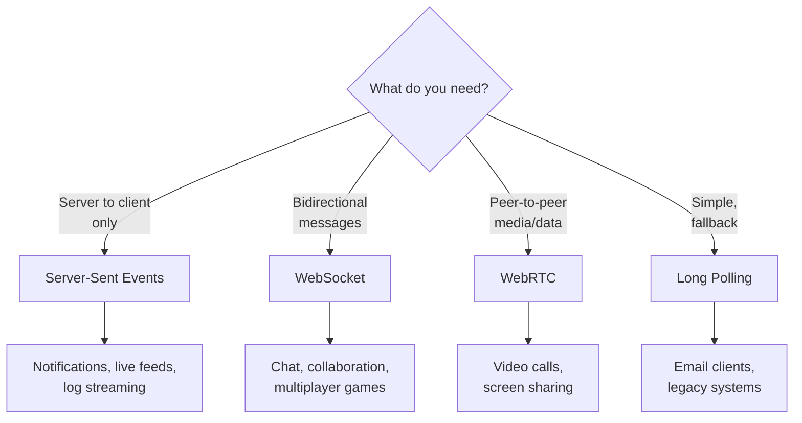
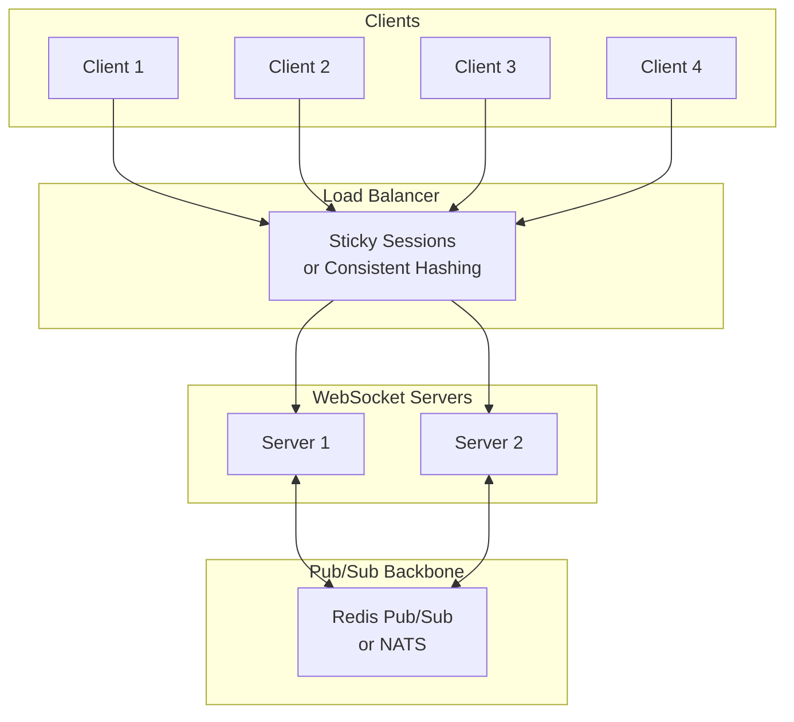
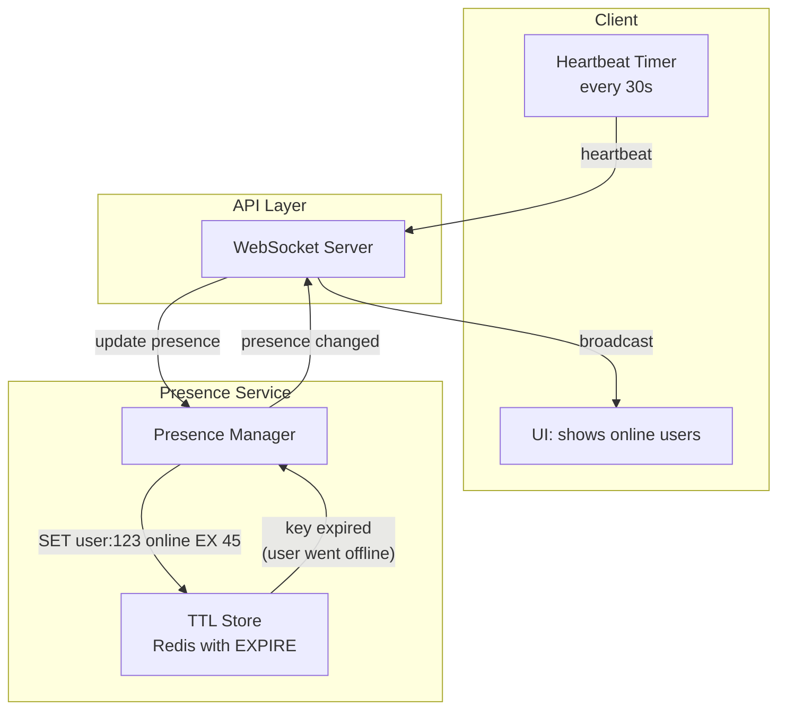
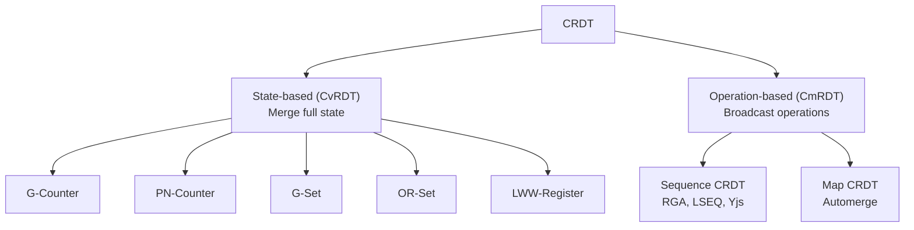
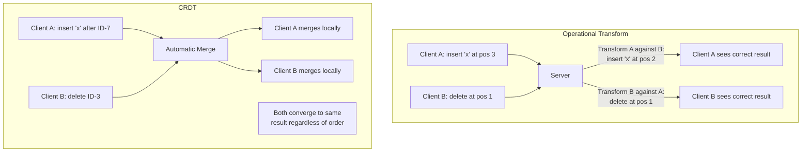
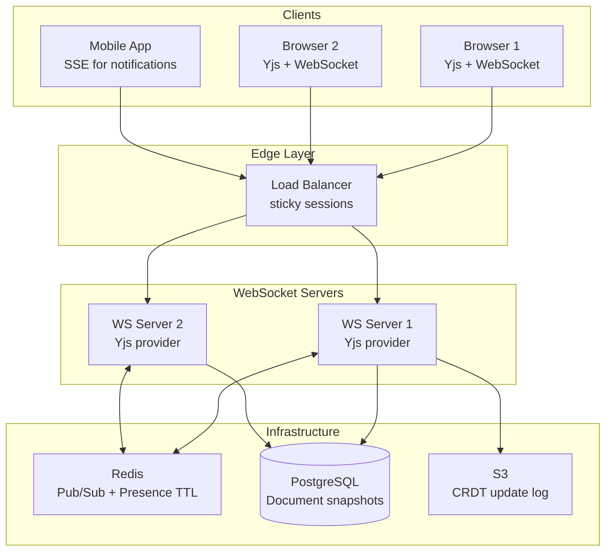

# Real-Time Systems

## What Makes a System "Real-Time"?

In web engineering, "real-time" means users see changes as they happen — typically within 50-200ms. This is fundamentally different from the request-response model of HTTP, where the client must ask for updates.

Real-time communication falls into three categories:

| Pattern | Direction | Latency | Connection | Use Case |
|---------|-----------|---------|------------|----------|
| **Polling** | Client → Server (repeated) | 1-30s | Short-lived | Legacy systems, simple dashboards |
| **Long Polling** | Client → Server (held open) | ~0s | Held open | Fallback when WebSocket unavailable |
| **Server-Sent Events (SSE)** | Server → Client (one-way) | ~0s | Persistent | Live feeds, notifications, stock tickers |
| **WebSocket** | Bidirectional | ~0s | Persistent | Chat, games, collaborative editing |
| **WebRTC** | Peer-to-peer | ~0s | P2P | Video calls, screen sharing, low-latency gaming |



## WebSocket Patterns at Scale

### Basic WebSocket Server

```typescript
// Node.js WebSocket server with ws library
import { WebSocketServer, WebSocket } from 'ws';

const wss = new WebSocketServer({ port: 8080 });

// Connection registry
const clients = new Map<string, WebSocket>();

wss.on('connection', (ws, req) => {
  const clientId = generateId();
  clients.set(clientId, ws);

  ws.on('message', (data) => {
    const message = JSON.parse(data.toString());
    handleMessage(clientId, message);
  });

  ws.on('close', () => {
    clients.delete(clientId);
    broadcastPresence();
  });

  ws.on('error', (error) => {
    console.error(`Client ${clientId} error:`, error);
    clients.delete(clientId);
  });

  // Send initial state
  ws.send(JSON.stringify({ type: 'connected', clientId }));
});

function broadcast(message: object, exclude?: string): void {
  const payload = JSON.stringify(message);
  for (const [id, client] of clients) {
    if (id !== exclude && client.readyState === WebSocket.OPEN) {
      client.send(payload);
    }
  }
}
```

### Scaling WebSockets Beyond One Server

A single server can handle ~50,000-100,000 concurrent WebSocket connections. Beyond that, you need horizontal scaling — which introduces the **fan-out problem**: how does a message sent to Server A reach clients connected to Server B?



**Solution: Pub/Sub backbone**

Each WebSocket server subscribes to a shared pub/sub system (Redis Pub/Sub, NATS, Kafka). When a message needs to reach all clients in a room, the originating server publishes to the pub/sub channel, and all servers forward it to their local clients.

```typescript
// Scaled WebSocket with Redis Pub/Sub
import { createClient } from 'redis';

const publisher = createClient();
const subscriber = createClient();
await publisher.connect();
await subscriber.connect();

// Subscribe to room channels
async function joinRoom(clientId: string, roomId: string): Promise<void> {
  // Track local clients per room
  if (!localRooms.has(roomId)) {
    localRooms.set(roomId, new Set());
    // Subscribe to Redis channel for this room
    await subscriber.subscribe(`room:${roomId}`, (message) => {
      const parsed = JSON.parse(message);
      // Deliver to local clients only (avoid echo)
      if (parsed.serverId !== SERVER_ID) {
        deliverToLocalClients(roomId, parsed);
      }
    });
  }
  localRooms.get(roomId)!.add(clientId);
}

// Broadcast to room (all servers)
async function broadcastToRoom(roomId: string, message: object): Promise<void> {
  // Publish to Redis — all subscribed servers receive it
  await publisher.publish(
    `room:${roomId}`,
    JSON.stringify({ ...message, serverId: SERVER_ID }),
  );
  // Also deliver locally (Redis won't echo back to publisher)
  deliverToLocalClients(roomId, message);
}
```

### Connection Management

```typescript
// Heartbeat / ping-pong to detect dead connections
const HEARTBEAT_INTERVAL = 30_000;
const CONNECTION_TIMEOUT = 35_000;

wss.on('connection', (ws) => {
  let isAlive = true;

  ws.on('pong', () => { isAlive = true; });

  const interval = setInterval(() => {
    if (!isAlive) {
      ws.terminate(); // Dead connection
      return;
    }
    isAlive = false;
    ws.ping();
  }, HEARTBEAT_INTERVAL);

  ws.on('close', () => clearInterval(interval));
});

// Client-side: auto-reconnect with exponential backoff
class ReconnectingWebSocket {
  private ws: WebSocket | null = null;
  private retryCount = 0;
  private maxRetries = 10;

  connect(url: string): void {
    this.ws = new WebSocket(url);

    this.ws.onopen = () => {
      this.retryCount = 0;
      this.onConnected();
    };

    this.ws.onclose = (event) => {
      if (!event.wasClean && this.retryCount < this.maxRetries) {
        const delay = Math.min(1000 * Math.pow(2, this.retryCount), 30_000);
        const jitter = Math.random() * 1000;
        setTimeout(() => this.connect(url), delay + jitter);
        this.retryCount++;
      }
    };
  }
}
```

## Server-Sent Events (SSE)

SSE is a simpler alternative to WebSockets when you only need server-to-client communication. It uses standard HTTP, works through proxies and CDNs, and reconnects automatically.

```typescript
// Node.js SSE endpoint
import { Request, Response } from 'express';

app.get('/events', (req: Request, res: Response) => {
  // SSE headers
  res.writeHead(200, {
    'Content-Type': 'text/event-stream',
    'Cache-Control': 'no-cache',
    'Connection': 'keep-alive',
    'X-Accel-Buffering': 'no', // Disable Nginx buffering
  });

  // Send initial data
  res.write(`data: ${JSON.stringify({ type: 'connected' })}\n\n`);

  // Send periodic updates
  const interval = setInterval(() => {
    res.write(`event: heartbeat\ndata: ${Date.now()}\n\n`);
  }, 15_000);

  // Register for real-time updates
  const handler = (event: AppEvent) => {
    res.write(`event: ${event.type}\ndata: ${JSON.stringify(event.data)}\nid: ${event.id}\n\n`);
  };
  eventBus.on('update', handler);

  // Cleanup on disconnect
  req.on('close', () => {
    clearInterval(interval);
    eventBus.off('update', handler);
  });
});
```

```typescript
// Client-side: EventSource with auto-reconnect
const source = new EventSource('/events');

source.onmessage = (event) => {
  const data = JSON.parse(event.data);
  updateUI(data);
};

source.addEventListener('notification', (event) => {
  showNotification(JSON.parse(event.data));
});

// EventSource automatically reconnects on disconnect
// It sends Last-Event-ID header to resume from where it left off
source.onerror = () => {
  console.log('SSE connection lost, reconnecting...');
};
```

### SSE vs WebSocket Decision

| Factor | SSE | WebSocket |
|--------|-----|-----------|
| **Direction** | Server → Client only | Bidirectional |
| **Protocol** | HTTP/1.1 or HTTP/2 | Custom protocol over TCP |
| **Auto-reconnect** | Built-in | Must implement |
| **Resume** | Built-in (Last-Event-ID) | Must implement |
| **Proxy/CDN** | Works naturally (HTTP) | May require configuration |
| **Binary data** | No (text only) | Yes |
| **Max connections** | 6 per domain (HTTP/1.1) | No browser limit |
| **Complexity** | Low | Medium |

## Presence Systems

A presence system tracks who is currently online, what they are doing, and when they were last active. Think: the green dots in Slack, "3 people viewing" in Google Docs, or "typing..." indicators.

### Architecture



### Implementation

```typescript
// Presence service with Redis TTL
class PresenceService {
  private readonly TTL_SECONDS = 45;
  private readonly HEARTBEAT_INTERVAL = 30_000;

  constructor(
    private redis: RedisClient,
    private pubsub: RedisPubSub,
  ) {}

  async setOnline(userId: string, metadata: PresenceMetadata): Promise<void> {
    const key = `presence:${userId}`;
    const data = JSON.stringify({
      status: 'online',
      lastSeen: Date.now(),
      ...metadata,
    });

    const wasOffline = !(await this.redis.exists(key));
    await this.redis.setex(key, this.TTL_SECONDS, data);

    if (wasOffline) {
      await this.pubsub.publish('presence:change', JSON.stringify({
        userId,
        status: 'online',
        timestamp: Date.now(),
      }));
    }
  }

  async heartbeat(userId: string): Promise<void> {
    const key = `presence:${userId}`;
    // Extend TTL without changing the value
    await this.redis.expire(key, this.TTL_SECONDS);
  }

  async setOffline(userId: string): Promise<void> {
    await this.redis.del(`presence:${userId}`);
    await this.pubsub.publish('presence:change', JSON.stringify({
      userId,
      status: 'offline',
      timestamp: Date.now(),
    }));
  }

  async getOnlineUsers(userIds: string[]): Promise<Map<string, PresenceData>> {
    const pipeline = this.redis.pipeline();
    for (const id of userIds) {
      pipeline.get(`presence:${id}`);
    }
    const results = await pipeline.exec();

    const presence = new Map<string, PresenceData>();
    results.forEach((result, idx) => {
      if (result) {
        presence.set(userIds[idx], JSON.parse(result as string));
      }
    });
    return presence;
  }
}
```

### Typing Indicators

```typescript
// Ephemeral typing indicator (no persistence needed)
class TypingIndicator {
  private typingUsers = new Map<string, NodeJS.Timeout>();

  startTyping(roomId: string, userId: string): void {
    // Clear existing timeout
    const existing = this.typingUsers.get(`${roomId}:${userId}`);
    if (existing) clearTimeout(existing);

    // Auto-clear after 5 seconds of no typing events
    const timeout = setTimeout(() => {
      this.stopTyping(roomId, userId);
    }, 5000);
    this.typingUsers.set(`${roomId}:${userId}`, timeout);

    // Broadcast to room (throttled to 1 event per second per user)
    this.broadcastTyping(roomId, userId, true);
  }

  stopTyping(roomId: string, userId: string): void {
    const key = `${roomId}:${userId}`;
    const timeout = this.typingUsers.get(key);
    if (timeout) {
      clearTimeout(timeout);
      this.typingUsers.delete(key);
      this.broadcastTyping(roomId, userId, false);
    }
  }
}
```

## CRDTs (Conflict-free Replicated Data Types)

CRDTs are data structures that can be **independently modified on different replicas** and **merged automatically without conflicts**. They are the foundation of collaborative editing in systems like Figma, Notion, and Liveblocks.

### Why CRDTs?

In a collaborative system, multiple users edit the same document simultaneously. Without coordination:
- User A inserts "hello" at position 5
- User B deletes characters 3-7

These operations **conflict**. Traditional approaches require a central server to resolve conflicts. CRDTs resolve conflicts **mathematically** — any merge order produces the same result.

### Types of CRDTs



### G-Counter (Grow-only Counter)

The simplest CRDT. Each replica maintains its own count; the total is the sum of all replicas.

```typescript
// G-Counter: each node has its own counter, total = sum
class GCounter {
  private counts: Map<string, number> = new Map();

  constructor(private readonly nodeId: string) {}

  increment(amount: number = 1): void {
    const current = this.counts.get(this.nodeId) ?? 0;
    this.counts.set(this.nodeId, current + amount);
  }

  value(): number {
    let total = 0;
    for (const count of this.counts.values()) {
      total += count;
    }
    return total;
  }

  // Merge: take the maximum of each node's count
  merge(other: GCounter): GCounter {
    const result = new GCounter(this.nodeId);
    const allNodes = new Set([...this.counts.keys(), ...other.counts.keys()]);

    for (const node of allNodes) {
      result.counts.set(node, Math.max(
        this.counts.get(node) ?? 0,
        other.counts.get(node) ?? 0,
      ));
    }
    return result;
  }
}
```

### LWW-Register (Last-Writer-Wins Register)

Each write has a timestamp; the write with the latest timestamp wins on merge.

```typescript
class LWWRegister<T> {
  constructor(
    private value: T,
    private timestamp: number = 0,
    private readonly nodeId: string = '',
  ) {}

  set(value: T, timestamp: number = Date.now()): void {
    if (timestamp > this.timestamp) {
      this.value = value;
      this.timestamp = timestamp;
    }
  }

  get(): T {
    return this.value;
  }

  merge(other: LWWRegister<T>): LWWRegister<T> {
    // Last writer wins; tie-break on nodeId
    if (other.timestamp > this.timestamp ||
        (other.timestamp === this.timestamp && other.nodeId > this.nodeId)) {
      return new LWWRegister(other.value, other.timestamp, other.nodeId);
    }
    return new LWWRegister(this.value, this.timestamp, this.nodeId);
  }
}
```

### OR-Set (Observed-Remove Set)

Supports both add and remove operations. Each element is tagged with a unique identifier; remove only removes observed tags.

```typescript
class ORSet<T> {
  // Each element is tagged with unique add-markers
  private elements: Map<T, Set<string>> = new Map();
  private tombstones: Map<T, Set<string>> = new Map();

  add(value: T): void {
    const tag = crypto.randomUUID();
    if (!this.elements.has(value)) {
      this.elements.set(value, new Set());
    }
    this.elements.get(value)!.add(tag);
  }

  remove(value: T): void {
    // Move current tags to tombstones
    const tags = this.elements.get(value);
    if (tags) {
      if (!this.tombstones.has(value)) {
        this.tombstones.set(value, new Set());
      }
      for (const tag of tags) {
        this.tombstones.get(value)!.add(tag);
      }
      this.elements.delete(value);
    }
  }

  has(value: T): boolean {
    const tags = this.elements.get(value);
    if (!tags) return false;
    const tombs = this.tombstones.get(value) ?? new Set();
    // Element exists if it has any non-tombstoned tags
    for (const tag of tags) {
      if (!tombs.has(tag)) return true;
    }
    return false;
  }

  merge(other: ORSet<T>): ORSet<T> {
    const result = new ORSet<T>();
    // Union of all elements minus union of all tombstones
    // ... (merge logic)
    return result;
  }
}
```

## Operational Transform vs CRDT

OT and CRDTs are the two main approaches to collaborative text editing:

| Aspect | Operational Transform (OT) | CRDT |
|--------|---------------------------|------|
| **Used by** | Google Docs | Figma, Notion, Yjs |
| **Architecture** | Requires central server | Peer-to-peer possible |
| **Correctness** | Complex transformation functions | Mathematically guaranteed |
| **Complexity** | O(n^2) transformation in worst case | Metadata overhead per character |
| **Offline support** | Limited (needs server for transforms) | Full offline support |
| **Memory** | Low (operations only) | Higher (per-element metadata) |
| **Latency** | Low (server resolves quickly) | Very low (local-first) |
| **Undo** | Complex | Complex (but solvable) |



### Modern CRDT Libraries

| Library | Language | Features |
|---------|----------|----------|
| **Yjs** | JavaScript/TypeScript | Text, rich text, arrays, maps, awareness protocol |
| **Automerge** | JavaScript/Rust | JSON-like documents, rich merge semantics |
| **Diamond Types** | Rust | High-performance text CRDT |
| **Liveblocks** | TypeScript | Managed CRDT infrastructure (SaaS) |

```typescript
// Yjs: collaborative text editing
import * as Y from 'yjs';
import { WebsocketProvider } from 'y-websocket';

// Create a shared document
const doc = new Y.Doc();

// Connect to other peers via WebSocket
const provider = new WebsocketProvider('wss://collab.example.com', 'doc-123', doc);

// Get a shared text type
const ytext = doc.getText('content');

// Local edits are automatically synced
ytext.insert(0, 'Hello, ');
ytext.insert(7, 'world!');

// Observe remote changes
ytext.observe(event => {
  console.log('Text changed:', ytext.toString());
  // Fires for both local and remote changes
});

// Awareness protocol for cursors and presence
const awareness = provider.awareness;
awareness.setLocalStateField('cursor', { anchor: 5, head: 5 });
awareness.setLocalStateField('user', { name: 'Alice', color: '#ff0000' });

awareness.on('change', () => {
  const states = awareness.getStates();
  // Render other users' cursors
  for (const [clientId, state] of states) {
    if (clientId !== doc.clientID) {
      renderCursor(state.cursor, state.user);
    }
  }
});
```

## Architecture: Putting It Together

A production real-time collaborative system combines all these patterns:



::: tip Production Checklist
1. **Connection management** — heartbeat, auto-reconnect with exponential backoff + jitter
2. **Backpressure** — buffer messages when the client is slow, drop if buffer overflows
3. **Authentication** — validate tokens on WebSocket upgrade, re-validate periodically
4. **Rate limiting** — per-connection message rate limits
5. **Monitoring** — track connection count, message throughput, latency percentiles
6. **Graceful shutdown** — drain connections before server restart
7. **State recovery** — replay missed events on reconnect using event IDs
:::

## Further Reading

- [Concurrency & Parallelism Overview](./) — foundations of concurrent system design
- [Actor Model](./actor-model) — actors as a model for real-time entities
- [Distributed Systems](/system-design/distributed-systems/) — consistency models relevant to CRDTs
- [Message Queues](/system-design/message-queues/) — pub/sub patterns for real-time fan-out
- [Networking](/system-design/networking/) — WebSocket protocol, HTTP/2 for SSE multiplexing
