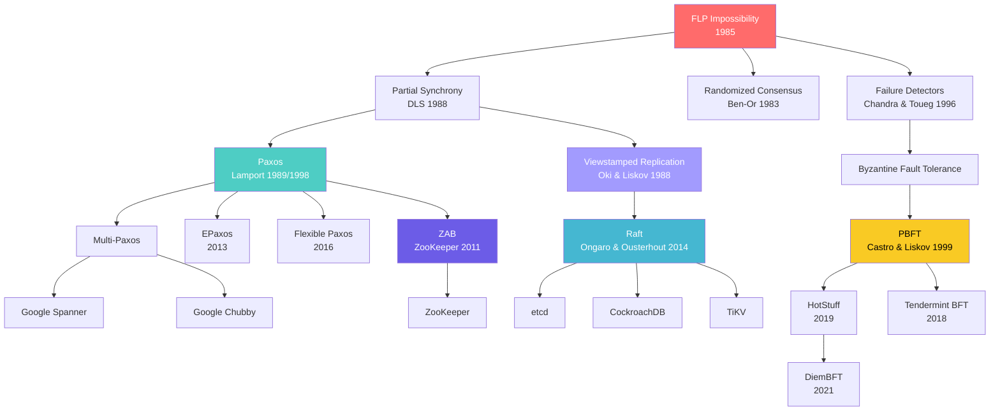

# Consensus in Distributed Systems

Consensus is the problem of getting multiple independent processes to agree on a single value. That one sentence is the foundation of every replicated database, every distributed lock, every blockchain, and every coordination service you have ever used. It is also the subject of one of the most important impossibility results in computer science.

This section is not a survey. It is a deep technical treatment of every major consensus protocol, from the theoretical foundations through working implementations.

## Why Consensus Exists

Consider a bank account replicated across three data centers. A customer in New York deposits $100. A customer in London withdraws $50. Both operations arrive at the same logical time. Without consensus, each data center might apply these operations in a different order, leaving three different balances. The system is no longer a bank — it is a random number generator.

Consensus ensures that all correct processes agree on the same sequence of operations, even when some processes crash, messages are lost, or the network partitions.

### The Three Core Problems That Require Consensus

Every use of consensus in production reduces to one of three fundamental coordination problems.

#### 1. Leader Election

A distributed system often designates a single node as the leader to serialize decisions. But leaders crash, and when they do, the remaining nodes must agree on a new leader — without the old leader's help, and without accidentally electing two leaders simultaneously.

```
Time 0: Node A is leader. Nodes B, C, D, E are followers.
Time 1: Node A crashes. Network delivers no more heartbeats.
Time 2: B and C both suspect A has failed.
Time 3: ??? Who becomes the new leader?

Without consensus:
  B thinks B is leader.
  C thinks C is leader.
  → Split brain. Data diverges. Corruption.

With consensus:
  B and C run an election protocol.
  A majority (3 of 5 survivors) must agree.
  Exactly one wins. The other accepts the result.
```

Leader election is the gateway to the other two problems. Once you have a leader, you can serialize all other decisions through it.

#### 2. State Machine Replication (SMR)

The idea behind SMR is that if you start with identical copies of a deterministic state machine and apply the same sequence of inputs in the same order, all copies will remain identical. Consensus provides the mechanism to agree on that sequence.

```
Client sends: SET x = 5

Leader proposes: "Log entry #42: SET x = 5"
Consensus ensures:
  - All replicas accept entry #42 as SET x = 5
  - No replica has a different entry at position #42
  - Entry #42 is never lost once committed

Result: All replicas converge to x = 5
```

Every replicated database (CockroachDB, TiDB, etcd, ZooKeeper) uses SMR internally. The consensus protocol is the mechanism that orders the log.

#### 3. Atomic Broadcast

Atomic broadcast (also called total order broadcast) is the communication primitive that delivers messages to all nodes in the same total order. It is formally equivalent to consensus — you can build one from the other.

If you have atomic broadcast, you have consensus: propose a value by broadcasting it; the first value delivered is the agreed value. If you have consensus, you have atomic broadcast: use consensus to agree on each successive message.

This equivalence is why Chandra and Toueg (1996) proved that consensus and atomic broadcast are "the same problem" in asynchronous systems.

## The FLP Impossibility Result

In 1985, Fischer, Lynch, and Paterson proved the most important negative result in distributed computing:

> **FLP Theorem:** In an asynchronous system where at least one process may crash, there is no deterministic algorithm that solves consensus in all executions.

The key word is *asynchronous*. An asynchronous system makes no assumptions about message delivery times or relative process speeds. You cannot distinguish a slow process from a dead one — there is no timeout that is always correct.

The proof constructs an infinite execution where the system is always one step away from deciding but never actually decides. It is a bivalence argument: the authors show that from any configuration where the outcome is still undetermined, there is always a scheduling of events that keeps it undetermined.

### What FLP Does NOT Say

FLP does not say consensus is impossible in practice. It says:

1. **No deterministic algorithm works in all executions.** But algorithms that work in *almost all* executions are fine for production.
2. **Randomized algorithms can circumvent FLP.** Ben-Or (1983) showed that randomized consensus terminates with probability 1.
3. **Partial synchrony is enough.** Dwork, Lynch, and Stockmeyer (1988) showed that if the system is *eventually* synchronous — there exists some unknown point after which messages arrive within a bounded delay — then consensus is solvable.

Every practical consensus protocol (Raft, Paxos, ZAB, PBFT) relies on partial synchrony for liveness. They are always safe (never agree on conflicting values), but they may stall during periods of asynchrony. When the network stabilizes, they make progress.

For the full treatment of failure detectors and their relationship to FLP, see the [failure detectors page](/system-design/distributed-systems/byzantine-fault-tolerance).

## Concept Map



## The Consensus Design Space

Every consensus protocol must answer the same set of design questions. The answers determine its performance characteristics, failure tolerance, and suitability for different workloads.

### Failure Model

| Failure Model | What Can Go Wrong | Tolerance | Example Protocols |
|---|---|---|---|
| Crash-stop | Processes halt and never recover | f < n/2 | Paxos, Raft, ZAB, VR |
| Crash-recovery | Processes halt and may restart with persistent state | f < n/2 | Raft, ZAB |
| Byzantine | Processes may behave arbitrarily (lie, equivocate, collude) | f < n/3 | PBFT, HotStuff, Tendermint |

### Communication Model

| Model | Assumption | Implication |
|---|---|---|
| Synchronous | Messages delivered within known bound $\Delta$ | Consensus trivially solvable. Not realistic for internet. |
| Asynchronous | No bound on message delivery | FLP: deterministic consensus impossible. |
| Partially synchronous | Eventually synchronous after unknown time GST | Practical. All production protocols assume this. |

## Comprehensive Protocol Comparison

The following table compares every consensus protocol covered in this section across the dimensions that matter for system design decisions.

| Property | Paxos | Multi-Paxos | Raft | ZAB | VR | PBFT | HotStuff | Tendermint |
|---|---|---|---|---|---|---|---|---|
| **Year** | 1989 | 1989+ | 2014 | 2011 | 1988 | 1999 | 2019 | 2018 |
| **Fault model** | Crash | Crash | Crash | Crash | Crash | Byzantine | Byzantine | Byzantine |
| **Nodes required** | 2f+1 | 2f+1 | 2f+1 | 2f+1 | 2f+1 | 3f+1 | 3f+1 | 3f+1 |
| **Leader** | No (single-decree) | Yes | Yes | Yes | Yes | Yes (rotating) | Yes (rotating) | Yes (rotating) |
| **Message complexity (normal)** | O(n^2) | O(n) | O(n) | O(n) | O(n) | O(n^2) | O(n) | O(n^2) |
| **Latency (message delays)** | 4 | 2 | 2 | 2 | 2 | 5 | 3 | 4 |
| **Understandability** | Very Hard | Hard | Easy | Medium | Medium | Hard | Medium | Medium |
| **Production use** | Google (Spanner, Chubby) | Google, many | etcd, CockroachDB, TiKV | ZooKeeper, Kafka | Limited | Hyperledger | Diem/Libra | Cosmos |
| **Out-of-order commits** | Yes | Yes | No | No | No | No | No | No |
| **Reconfiguration** | External | External | Joint consensus | Dynamic | View change | View change | Epoch change | Validator sets |

### When to Use What

**Use Raft when:**
- You need a consensus library you can understand, implement, and debug
- Your team is not staffed with distributed systems PhDs
- You want a battle-tested ecosystem (etcd, HashiCorp Raft)
- Crash fault tolerance is sufficient

**Use Multi-Paxos when:**
- You need out-of-order commit for higher throughput
- You are building a system at Google-like scale where every microsecond matters
- You have the engineering depth to implement and debug it

**Use ZAB when:**
- You need ZooKeeper-compatible semantics (ordered broadcasts with session guarantees)
- You are building a coordination service, not a general-purpose database

**Use PBFT/HotStuff/Tendermint when:**
- You cannot trust all participants (permissioned blockchains, multi-organization systems)
- Byzantine fault tolerance is a regulatory or security requirement
- You are willing to pay the 3f+1 overhead for the stronger guarantee

## The Safety/Liveness Decomposition

All practical consensus protocols separate their correctness guarantees into two independent properties:

**Safety** ("nothing bad happens"): The protocol never agrees on two different values. This holds under all network conditions, including total asynchrony, partitions, and arbitrary message delays.

**Liveness** ("something good eventually happens"): The protocol eventually makes progress and decides on a value. This requires partial synchrony — eventually, messages must be delivered within some bound.

This decomposition is fundamental. It means:
- You never get a wrong answer, even during a network outage.
- You might get *no* answer during a network outage.
- Once the network heals, progress resumes.

This is the pragmatic response to FLP. Accept that liveness cannot be guaranteed in all executions. Guarantee safety unconditionally. Guarantee liveness under reasonable conditions.

## Quorums: The Universal Mechanism

Every crash-fault-tolerant consensus protocol uses quorums. A quorum is a subset of nodes large enough to guarantee overlap with any other quorum.

For a cluster of $n = 2f + 1$ nodes (tolerating $f$ crash failures), a majority quorum requires $f + 1$ nodes.

```
n = 5, f = 2
Quorum size = 3

Quorum A = {1, 2, 3}
Quorum B = {3, 4, 5}
Intersection = {3}

Any two quorums MUST overlap.
This overlap is what transfers knowledge between phases.
```

The quorum intersection property is what makes consensus safe:
- In Paxos: a prepare quorum and an accept quorum must overlap, so a new proposer will always learn about previously accepted values.
- In Raft: a voting quorum and a replication quorum must overlap, so a new leader will always have all committed entries.
- In PBFT: quorums of size $2f + 1$ out of $3f + 1$ nodes guarantee overlap of at least $f + 1$, ensuring at least one honest node is in the intersection.

Flexible Paxos (Howard et al., 2016) showed that the two quorums (phase 1 and phase 2) do not need to be the same size — they only need to intersect. This opens the door to asymmetric quorum configurations that optimize for different workloads.

## Reading Order

This section is structured for sequential reading, but each page is also self-contained.

| Order | Page | What You'll Learn |
|---|---|---|
| 1 | [Raft Full Walkthrough](./raft-full-walkthrough) | The most understandable consensus protocol, in full detail |
| 2 | [Paxos Made Simple](./paxos-made-simple) | The protocol that started it all, explained without the Greek parliament |
| 3 | [ZAB Protocol](./zab-protocol) | ZooKeeper's atomic broadcast and why it differs from Paxos |
| 4 | [Viewstamped Replication](./viewstamped-replication) | The historical predecessor that influenced Raft |
| 5 | [Practical BFT](./practical-bft) | When crash tolerance is not enough |

Start with Raft. It was designed for understandability, and understanding it first makes every other protocol easier to learn. Then read Paxos to understand what Raft simplified and what it sacrificed. ZAB and VR provide alternative perspectives. BFT is for when your threat model includes actively malicious participants.

## Key Definitions

| Term | Definition |
|---|---|
| **Consensus** | Agreement among distributed processes on a single value |
| **State Machine Replication** | Technique for making a service fault-tolerant by replicating it across multiple servers and using consensus to agree on the order of operations |
| **Atomic Broadcast** | Communication primitive that delivers messages to all correct processes in the same total order |
| **Quorum** | A subset of nodes large enough to guarantee overlap with any other quorum |
| **Leader** | A distinguished process that serializes decisions during normal operation |
| **Term / View / Ballot** | A logical clock that increases with each leader change (different protocols use different names) |
| **Committed** | A decision that is guaranteed to survive any future failures |
| **Safety** | The guarantee that the protocol never produces an incorrect result |
| **Liveness** | The guarantee that the protocol eventually produces a result |
| **Split brain** | A failure mode where two partitions each believe they have a valid leader |
| **Dueling leaders** | A liveness issue where two candidates repeatedly interrupt each other's elections |

## References

1. Fischer, M. J., Lynch, N. A., & Paterson, M. S. (1985). "Impossibility of Distributed Consensus with One Faulty Process." *JACM*.
2. Lamport, L. (1998). "The Part-Time Parliament." *ACM TOCS*.
3. Lamport, L. (2001). "Paxos Made Simple." *ACM SIGACT News*.
4. Ongaro, D., & Ousterhout, J. (2014). "In Search of an Understandable Consensus Algorithm." *USENIX ATC*.
5. Junqueira, F. P., Reed, B. C., & Serafini, M. (2011). "Zab: High-performance broadcast for primary-backup systems." *IEEE DSN*.
6. Oki, B. M., & Liskov, B. H. (1988). "Viewstamped Replication: A New Primary Copy Method to Support Highly-Available Distributed Systems." *PODC*.
7. Castro, M., & Liskov, B. (1999). "Practical Byzantine Fault Tolerance." *OSDI*.
8. Yin, M., Malkhi, D., Reiter, M. K., Gueta, G. G., & Abraham, I. (2019). "HotStuff: BFT Consensus with Linearity and Responsiveness." *PODC*.
9. Chandra, T. D., & Toueg, S. (1996). "Unreliable Failure Detectors for Reliable Distributed Systems." *JACM*.
10. Howard, H., Malkhi, D., & Spiegelman, A. (2016). "Flexible Paxos: Quorum Intersection Revisited." *arXiv*.
