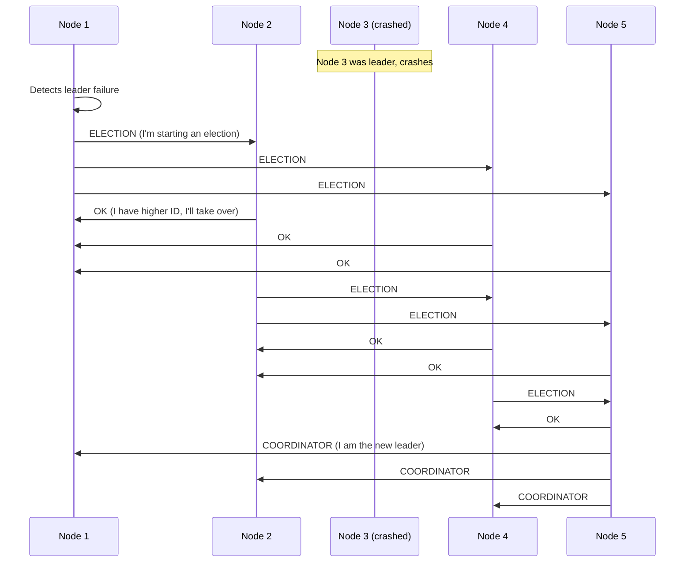
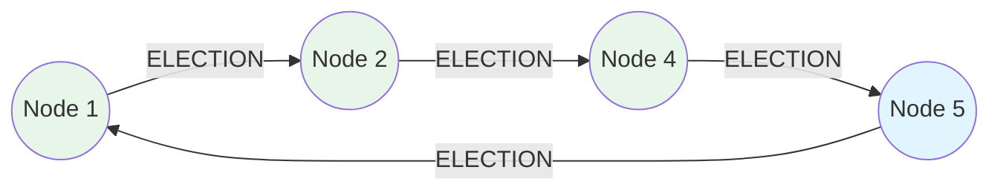
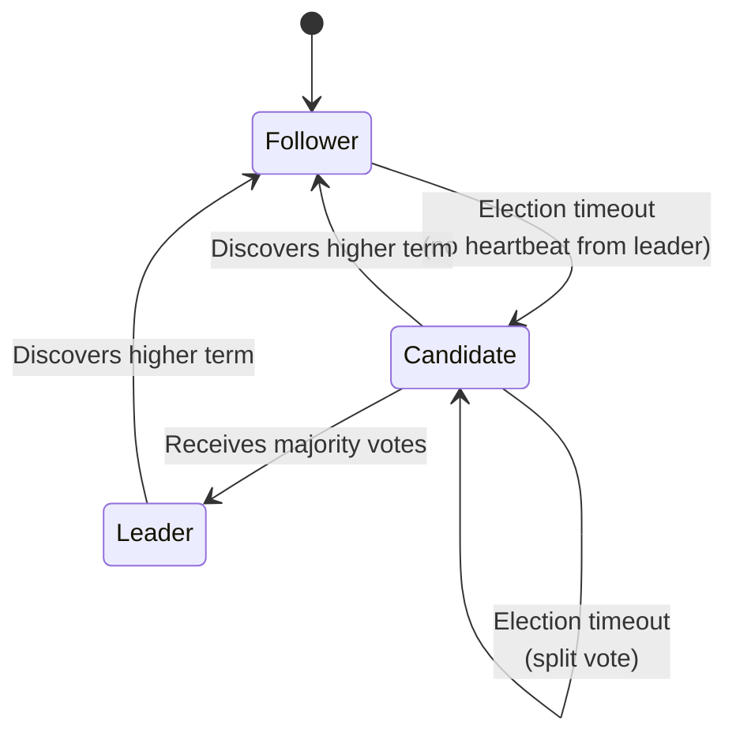
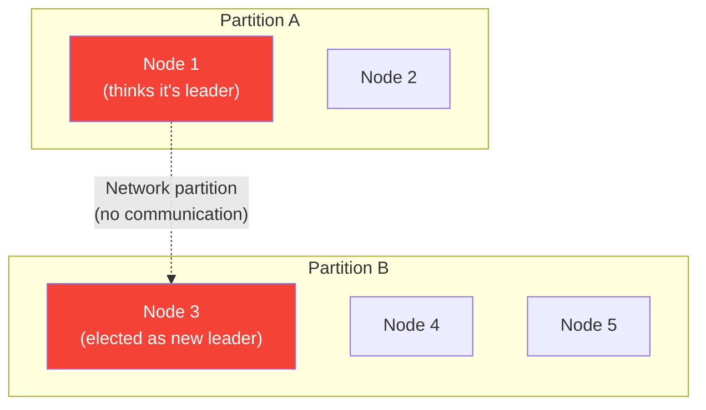

# Leader Election

Leader election is the process by which a group of distributed nodes agree on exactly one node to act as the leader (also called coordinator, master, or primary). The leader serializes decisions, coordinates work, and breaks symmetry in the system. Without a designated leader, every node would need to coordinate with every other node for every decision — an $O(n^2)$ communication pattern that does not scale.

The challenge is not choosing a leader when everything works. The challenge is choosing exactly one leader when nodes crash, networks partition, and messages arrive out of order. Getting this wrong leads to the most dangerous failure mode in distributed systems: **split brain**, where two nodes both believe they are the leader and issue conflicting commands.

## Why Leader Election Matters

Many distributed systems rely on a single leader for correctness:

| System | Leader Role |
|--------|-------------|
| **Raft/Paxos** | Serializes log entries, drives consensus |
| **Kafka** | Partition leader handles all reads/writes |
| **ZooKeeper** | The leader (via ZAB) orders all write operations |
| **Database replication** | Primary accepts writes, replicates to followers |
| **Distributed schedulers** | Leader assigns tasks to workers |
| **Elasticsearch** | Master node manages cluster state |

The leader is a single point of failure by design. The entire point of leader election is to make that single point recoverable — when the leader dies, a new one is elected quickly and correctly.

## Classical Algorithms

### The Bully Algorithm

Proposed by Garcia-Molina in 1982. The node with the highest ID always wins. When a node detects the leader has failed, it "bullies" all lower-ID nodes into accepting the highest-ID surviving node as leader.



**Algorithm steps:**

1. Node $P$ sends ELECTION message to all nodes with higher IDs
2. If no one responds within timeout, $P$ declares itself leader (sends COORDINATOR to all)
3. If a higher-ID node responds with OK, $P$ drops out
4. The highest-ID node that responds eventually sends COORDINATOR to all

```python
import threading
import time
from typing import Callable

class BullyElection:
    def __init__(self, node_id: int, all_node_ids: list[int],
                 send_fn: Callable, timeout: float = 2.0):
        self.node_id = node_id
        self.all_node_ids = sorted(all_node_ids)
        self.send = send_fn
        self.timeout = timeout
        self.leader_id: int | None = None
        self.election_in_progress = False
        self.lock = threading.Lock()

    def start_election(self):
        with self.lock:
            if self.election_in_progress:
                return
            self.election_in_progress = True

        higher_nodes = [n for n in self.all_node_ids if n > self.node_id]

        if not higher_nodes:
            # I am the highest — declare myself leader
            self._declare_victory()
            return

        # Send ELECTION to all higher nodes
        responses = []
        for node in higher_nodes:
            resp = self.send(node, "ELECTION", timeout=self.timeout)
            if resp == "OK":
                responses.append(node)

        if not responses:
            # No higher node responded — I win
            self._declare_victory()
        else:
            # A higher node will take over; wait for COORDINATOR
            self._wait_for_coordinator()

    def _declare_victory(self):
        self.leader_id = self.node_id
        for node in self.all_node_ids:
            if node != self.node_id:
                self.send(node, "COORDINATOR",
                         data={"leader": self.node_id})
        self.election_in_progress = False

    def handle_message(self, from_node: int, msg_type: str, data: dict):
        if msg_type == "ELECTION":
            # A lower node started an election; respond and start our own
            self.send(from_node, "OK")
            self.start_election()
        elif msg_type == "COORDINATOR":
            self.leader_id = data["leader"]
            self.election_in_progress = False
```

**Complexity:**

- **Best case:** $O(1)$ messages — the highest surviving node detects failure and declares itself
- **Worst case:** $O(n^2)$ messages — the lowest node starts the election
- **Time:** $O(n)$ rounds in the worst case

**Weakness:** The bully algorithm assumes reliable failure detection and synchronous communication. In an asynchronous network with unreliable failure detectors, it can oscillate between leaders.

### The Ring Algorithm

Nodes are arranged in a logical ring. When a node detects the leader has failed, it sends an ELECTION message around the ring. Each node appends its ID. When the message returns to the initiator, the node with the highest ID in the list becomes leader.



```python
class RingElection:
    def __init__(self, node_id: int, ring: list[int], send_fn):
        self.node_id = node_id
        self.ring = ring  # Ordered list of node IDs in ring
        self.send = send_fn
        self.leader_id: int | None = None
        self.participating = False

    def _next_alive_node(self) -> int:
        """Find the next alive node in the ring."""
        my_idx = self.ring.index(self.node_id)
        for i in range(1, len(self.ring)):
            candidate = self.ring[(my_idx + i) % len(self.ring)]
            if self._is_alive(candidate):
                return candidate
        return self.node_id  # Only node left

    def start_election(self):
        self.participating = True
        msg = {"type": "ELECTION", "candidates": [self.node_id]}
        next_node = self._next_alive_node()
        self.send(next_node, msg)

    def handle_message(self, msg: dict):
        if msg["type"] == "ELECTION":
            if self.node_id in msg["candidates"]:
                # Message has gone around the ring — elect the max
                leader = max(msg["candidates"])
                self.send(self._next_alive_node(),
                         {"type": "ELECTED", "leader": leader})
            else:
                msg["candidates"].append(self.node_id)
                self.send(self._next_alive_node(), msg)

        elif msg["type"] == "ELECTED":
            self.leader_id = msg["leader"]
            self.participating = False
            if msg["leader"] != self.node_id:
                # Forward to next node
                self.send(self._next_alive_node(), msg)
```

**Complexity:** Always $O(n)$ messages for election, $O(n)$ for notification. More predictable than the bully algorithm, but slower — must traverse the entire ring.

## Leader Election in Production Systems

### Raft Leader Election

Raft is the most widely used consensus algorithm in modern systems (etcd, CockroachDB, TiKV). Its leader election is tightly integrated with the consensus protocol. See [Raft Full Walkthrough](/system-design/consensus/raft-full-walkthrough) for the complete protocol.

**Key mechanism: Terms and randomized timeouts**



Each node starts as a follower. If a follower does not receive a heartbeat within its **election timeout** (randomized between 150-300ms), it becomes a candidate and starts a new **term**:

```go
type RaftNode struct {
    id          int
    currentTerm int
    votedFor    int  // -1 if not voted in current term
    state       NodeState
    peers       []int

    electionTimer *time.Timer
    heartbeatInterval time.Duration
}

func (n *RaftNode) startElection() {
    n.currentTerm++
    n.state = Candidate
    n.votedFor = n.id
    votesReceived := 1  // Vote for self

    for _, peer := range n.peers {
        go func(peer int) {
            reply := n.sendRequestVote(peer, RequestVoteArgs{
                Term:         n.currentTerm,
                CandidateID:  n.id,
                LastLogIndex: n.lastLogIndex(),
                LastLogTerm:  n.lastLogTerm(),
            })

            if reply.VoteGranted {
                votesReceived++
                if votesReceived > len(n.peers)/2 {
                    n.becomeLeader()
                }
            } else if reply.Term > n.currentTerm {
                n.stepDown(reply.Term)
            }
        }(peer)
    }

    // Reset election timer with random timeout
    n.resetElectionTimer()
}

func (n *RaftNode) becomeLeader() {
    n.state = Leader
    // Send initial empty heartbeat to establish authority
    n.broadcastHeartbeat()
    // Start periodic heartbeats
    go n.heartbeatLoop()
}
```

**Why randomized timeouts work:** If all followers had the same election timeout, they would all become candidates simultaneously, split the vote, and no one would win. By randomizing the timeout, one node typically times out first, requests votes before others become candidates, and wins the election.

$$
P(\text{single winner in round 1}) \approx 1 - \left(\frac{\Delta t}{T}\right)^{n-1}
$$

where $\Delta t$ is the typical timeout difference and $T$ is the total timeout range. With 5 nodes and a 150-300ms range, elections typically complete in one round.

### ZooKeeper Leader Election

ZooKeeper-based leader election uses ephemeral sequential nodes, similar to its [distributed lock recipe](/system-design/distributed-systems/distributed-locking):

```python
from kazoo.client import KazooClient
from kazoo.recipe.election import Election

def leader_elected(data):
    """Callback when this node becomes the leader."""
    print(f"I am the leader! Data: {data}")
    # Start leader-only work: task assignment, coordination, etc.
    while True:
        assign_tasks()
        time.sleep(1)

zk = KazooClient(hosts='zk1:2181,zk2:2181,zk3:2181')
zk.start()

election = Election(zk, "/app/leader", identifier="node-1")
# This blocks until this node becomes the leader
election.run(leader_elected, "node-1-data")
```

The ZooKeeper approach provides **strong ordering** — nodes become leader in the order they joined the election, which prevents starvation.

### etcd Leader Election

etcd provides native leader election via its concurrency API:

```go
import (
    clientv3 "go.etcd.io/etcd/client/v3"
    "go.etcd.io/etcd/client/v3/concurrency"
)

func runLeaderElection(cli *clientv3.Client, nodeID string) {
    session, _ := concurrency.NewSession(cli, concurrency.WithTTL(10))
    defer session.Close()

    election := concurrency.NewElection(session, "/app/leader")

    // Campaign blocks until this node is elected leader
    ctx := context.Background()
    if err := election.Campaign(ctx, nodeID); err != nil {
        log.Fatal(err)
    }

    log.Printf("Node %s elected as leader", nodeID)

    // Do leader work
    doLeaderWork(ctx)

    // Voluntarily resign
    election.Resign(ctx)
}

// Observe leader changes from a follower
func watchLeader(cli *clientv3.Client) {
    session, _ := concurrency.NewSession(cli)
    election := concurrency.NewElection(session, "/app/leader")

    for resp := range election.Observe(context.Background()) {
        log.Printf("Current leader: %s", string(resp.Kvs[0].Value))
    }
}
```

## The Split-Brain Problem

Split brain is the most dangerous failure mode in leader election. It occurs when two nodes both believe they are the leader, typically caused by a network partition:



### Prevention Strategies

#### 1. Quorum-Based Election

Require a majority (quorum) of votes to become leader. Since a majority of $N$ nodes is $\lfloor N/2 \rfloor + 1$, there can be at most one majority in any partition:

$$
\text{quorum} = \lfloor N/2 \rfloor + 1
$$

With 5 nodes, quorum is 3. A partition of [2, 3] nodes means only the partition with 3 can elect a leader.

#### 2. Leader Lease

The leader holds a time-bounded lease. Other nodes will not start an election until the lease expires. This prevents election storms during transient network issues:

```python
class LeaderLease:
    def __init__(self, lease_duration: float = 10.0,
                 renewal_interval: float = 3.0):
        self.lease_duration = lease_duration
        self.renewal_interval = renewal_interval
        self.lease_expiry: float = 0
        self.is_leader = False

    def try_renew(self) -> bool:
        """Called periodically by the leader."""
        if not self.is_leader:
            return False

        # Renew only if current lease hasn't expired
        now = time.monotonic()
        if now < self.lease_expiry:
            self.lease_expiry = now + self.lease_duration
            self._broadcast_lease(self.lease_expiry)
            return True

        # Lease expired — step down
        self.is_leader = False
        return False

    def should_start_election(self) -> bool:
        """Called by followers to decide if election is needed."""
        return time.monotonic() > self.lease_expiry
```

::: warning Clock Assumptions in Leases
Leader leases depend on clock monotonicity. If the leader's clock jumps backward, it might think the lease is still valid when followers think it has expired. Use `CLOCK_MONOTONIC` (not wall clock time) for lease calculations.
:::

#### 3. Fencing with Epoch Numbers

Every leader election increments a global epoch (term number). All operations carry the epoch. If a node receives a command from a leader with a stale epoch, it rejects it:

```go
type EpochGuard struct {
    currentEpoch int64
    mu           sync.RWMutex
}

func (g *EpochGuard) ValidateRequest(requestEpoch int64) error {
    g.mu.RLock()
    defer g.mu.RUnlock()

    if requestEpoch < g.currentEpoch {
        return fmt.Errorf(
            "stale epoch %d, current is %d",
            requestEpoch, g.currentEpoch)
    }
    return nil
}

func (g *EpochGuard) UpdateEpoch(newEpoch int64) {
    g.mu.Lock()
    defer g.mu.Unlock()

    if newEpoch > g.currentEpoch {
        g.currentEpoch = newEpoch
    }
}
```

## Leader Health Checks

Detecting a failed leader quickly is critical — the system is unavailable until a new leader is elected. But detecting too aggressively causes unnecessary elections (leader thrashing).

### Heartbeat-Based Detection

```python
class HeartbeatMonitor:
    def __init__(self, heartbeat_interval: float = 1.0,
                 failure_threshold: int = 3):
        self.interval = heartbeat_interval
        self.threshold = failure_threshold
        self.missed_heartbeats: dict[int, int] = {}

    def on_heartbeat_received(self, leader_id: int):
        self.missed_heartbeats[leader_id] = 0

    def on_heartbeat_timeout(self, leader_id: int) -> bool:
        """Returns True if leader should be considered failed."""
        self.missed_heartbeats[leader_id] = (
            self.missed_heartbeats.get(leader_id, 0) + 1
        )

        missed = self.missed_heartbeats[leader_id]

        if missed >= self.threshold:
            return True  # Leader is dead, start election

        return False
```

The detection time is:

$$
T_{\text{detect}} = \text{heartbeat\_interval} \times \text{failure\_threshold}
$$

With 1-second heartbeats and threshold of 3, detection takes 3 seconds. The system is unavailable during detection plus election time.

### Phi Accrual Failure Detector

A more sophisticated approach used by Akka and Cassandra. Instead of a binary alive/dead decision, it computes a **suspicion level** $\phi$ based on the statistical distribution of heartbeat intervals:

$$
\phi = -\log_{10}(1 - F(\text{time\_since\_last\_heartbeat}))
$$

where $F$ is the CDF of the normal distribution fitted to historical heartbeat arrival times. A $\phi$ of 1 means a 10% chance the node is alive. A $\phi$ of 8 means a 0.00000001% chance.

See [Failure Detectors](/system-design/distributed-systems/failure-detectors) for the complete theory.

## Production Considerations

### Leader Election in Kubernetes

Kubernetes provides a built-in leader election mechanism via its coordination API:

```go
import (
    "k8s.io/client-go/tools/leaderelection"
    "k8s.io/client-go/tools/leaderelection/resourcelock"
)

lock := &resourcelock.LeaseLock{
    LeaseMeta: metav1.ObjectMeta{
        Name:      "my-app-leader",
        Namespace: "default",
    },
    Client: client.CoordinationV1(),
    LockConfig: resourcelock.ResourceLockConfig{
        Identity: hostname,
    },
}

leaderelection.RunOrDie(ctx, leaderelection.LeaderElectionConfig{
    Lock:            lock,
    LeaseDuration:   15 * time.Second,
    RenewDeadline:   10 * time.Second,
    RetryPeriod:     2 * time.Second,
    Callbacks: leaderelection.LeaderCallbacks{
        OnStartedLeading: func(ctx context.Context) {
            log.Println("Started leading")
            runLeaderTasks(ctx)
        },
        OnStoppedLeading: func() {
            log.Println("Stopped leading")
        },
        OnNewLeader: func(identity string) {
            log.Printf("New leader: %s", identity)
        },
    },
})
```

### Graceful Leadership Transfer

When a leader needs to shut down (deployment, maintenance), it should hand off leadership gracefully rather than letting the election timeout fire:

```python
class GracefulLeader:
    def __init__(self, election_service):
        self.election = election_service
        self.is_leader = False

    def step_down(self):
        """Gracefully transfer leadership before shutdown."""
        if not self.is_leader:
            return

        # 1. Stop accepting new work
        self.stop_accepting_work()

        # 2. Drain in-flight operations
        self.drain_operations(timeout=5.0)

        # 3. Notify followers that leadership is available
        self.election.resign()

        self.is_leader = False
```

## Algorithm Comparison

| Algorithm | Message Complexity | Fault Tolerance | Ordering | Split-Brain Safe |
|-----------|-------------------|-----------------|----------|-----------------|
| Bully | $O(n^2)$ worst | Crash-stop | No | No (without quorum) |
| Ring | $O(n)$ | Crash-stop | No | No (without quorum) |
| Raft | $O(n)$ per election | $f < n/2$ crashes | Yes (terms) | Yes (quorum) |
| ZooKeeper | $O(n)$ | $f < n/2$ crashes | Yes (zxid) | Yes (quorum) |
| etcd | $O(n)$ per election | $f < n/2$ crashes | Yes (revision) | Yes (quorum) |

## Further Reading

- [Raft Full Walkthrough](/system-design/consensus/raft-full-walkthrough) — Complete Raft consensus protocol including leader election
- [ZAB Protocol](/system-design/consensus/zab-protocol) — ZooKeeper's leader election and atomic broadcast
- [Paxos Made Simple](/system-design/consensus/paxos-made-simple) — Paxos multi-decree with leader optimization
- [Failure Detectors](/system-design/distributed-systems/failure-detectors) — Theory of failure detection that underlies election triggers
- [Distributed Locking](/system-design/distributed-systems/distributed-locking) — Related coordination primitive
- [CAP Theorem](/system-design/distributed-systems/cap-theorem) — Fundamental trade-offs affecting election design
- Hector Garcia-Molina, "Elections in a Distributed Computing System" (1982)
- Diego Ongaro and John Ousterhout, "In Search of an Understandable Consensus Algorithm" (2014)
