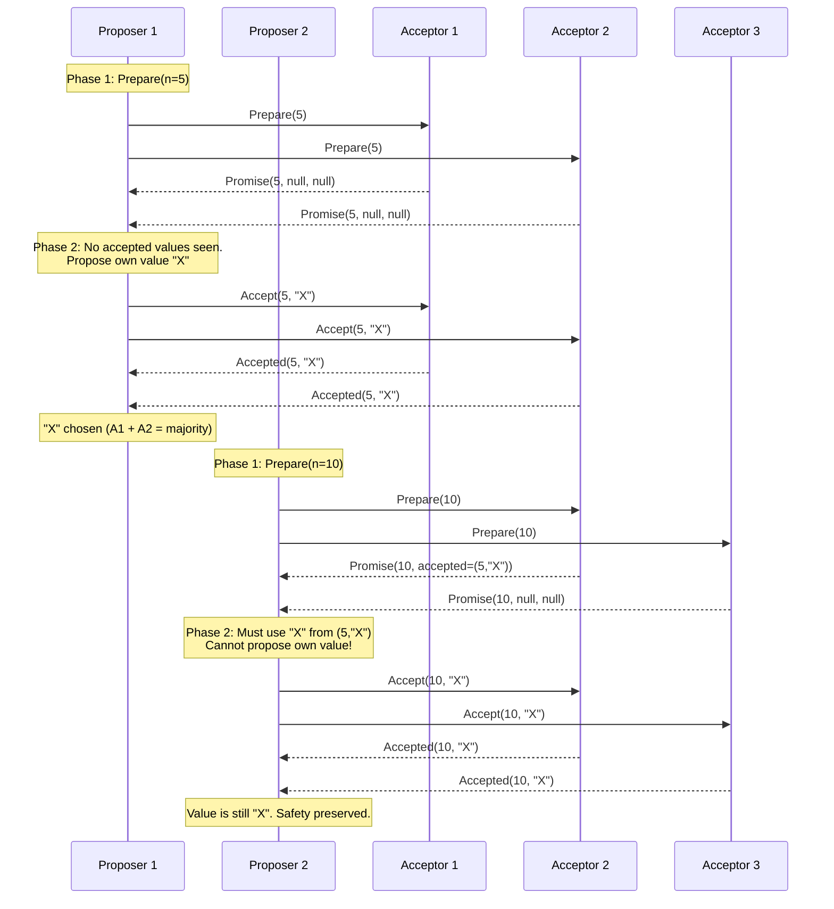
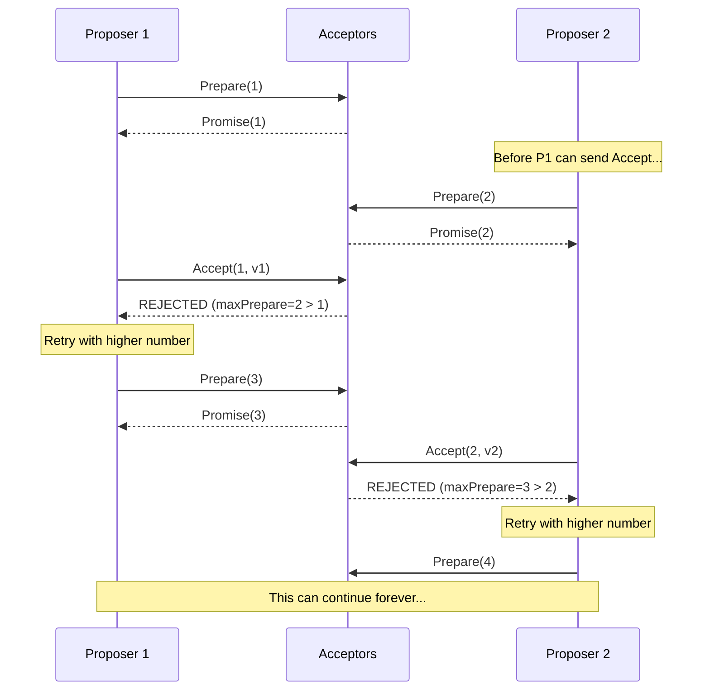
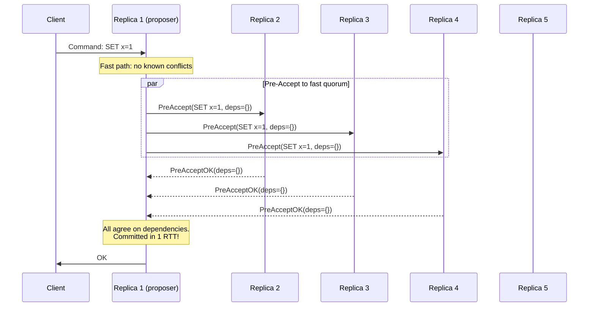
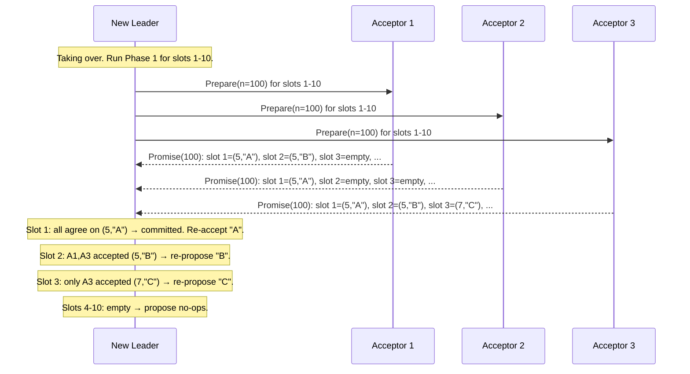

# Paxos Made Simple

Leslie Lamport first described Paxos in 1989 in a paper called "The Part-Time Parliament," which used an allegory about a fictional Greek parliament on the island of Paxos. The paper was considered so difficult to understand that it was rejected for years before finally being published in 1998. In 2001, Lamport wrote "Paxos Made Simple," a terse paper that begins with the sentence: "The Paxos algorithm, when presented in plain English, is very simple."

The irony is that Paxos is simple — as a single-decree protocol. The complexity arises when you try to build a practical system on top of it. This page explains both the simple core and the complex reality.

## The Consensus Problem (Single-Decree)

The single-decree consensus problem is: given a set of processes, each of which may propose a value, agree on exactly one of the proposed values.

Three safety requirements:

1. **Validity**: Only a proposed value may be chosen.
2. **Agreement**: At most one value is chosen.
3. **Termination** (liveness): If a value has been proposed, eventually a value is chosen.

Paxos guarantees safety (validity and agreement) in all executions. It guarantees termination only under partial synchrony — consistent with the FLP impossibility result.

## Roles

Paxos defines three roles. A single physical process may play multiple roles.

- **Proposer**: Proposes values. In practice, this is the process that receives client requests.
- **Acceptor**: Votes on proposals. Acceptors are the "memory" of the protocol — their state determines which value has been chosen.
- **Learner**: Learns the chosen value. In practice, learners are the processes that need to apply the decision (e.g., replicas that apply commands to their state machine).

A quorum is any majority of acceptors. For $n$ acceptors, a quorum is any set of size $\lfloor n/2 \rfloor + 1$. The critical property: any two quorums overlap in at least one acceptor.

## Proposal Numbers

Every proposal has a unique proposal number (also called a ballot number). Proposal numbers must be totally ordered and globally unique. A common scheme is to use a pair `(sequenceNumber, proposerId)` with lexicographic ordering — the sequence number is the primary key, and the proposer ID breaks ties.

```
Proposer A uses: (1,A), (4,A), (7,A), ...
Proposer B uses: (2,B), (5,B), (8,B), ...
Proposer C uses: (3,C), (6,C), (9,C), ...

Ordering: (1,A) < (2,B) < (3,C) < (4,A) < (5,B) < ...
```

The exact scheme does not matter as long as proposal numbers are unique and totally ordered. What matters is that a higher proposal number always takes priority over a lower one.

## The Synod Protocol (Single-Decree Paxos)

The protocol has two phases. Each phase involves the proposer communicating with a quorum of acceptors.

### Phase 1: Prepare / Promise

The proposer selects a proposal number $n$ and sends a `Prepare(n)` request to a quorum of acceptors.

An acceptor that receives `Prepare(n)`:
- If $n$ is greater than any proposal number the acceptor has already responded to (i.e., $n > maxPrepare$), the acceptor responds with a **Promise**:
  - "I promise not to accept any proposal with a number less than $n$."
  - If the acceptor has already accepted a proposal, it includes the accepted proposal's number and value in the response: `Promise(n, acceptedProposal, acceptedValue)`.
  - If the acceptor has not accepted any proposal: `Promise(n, null, null)`.
  - The acceptor updates $maxPrepare = n$.
- If $n \leq maxPrepare$, the acceptor ignores the request (or sends a NACK).

### Phase 2: Accept / Accepted

If the proposer receives promises from a quorum of acceptors, it sends an `Accept(n, v)` request to a quorum of acceptors, where:
- $n$ is the proposal number from Phase 1.
- $v$ is determined by: if any of the promise responses included an already-accepted value, the proposer MUST use the value from the highest-numbered accepted proposal. If no acceptor had accepted any value, the proposer may choose its own value.

An acceptor that receives `Accept(n, v)`:
- If $n \geq maxPrepare$ (i.e., the acceptor has not promised to ignore this proposal), the acceptor **accepts** the proposal: it records $(n, v)$ and responds `Accepted(n, v)`.
- If $n < maxPrepare$, the acceptor rejects the proposal.

A value is **chosen** when a quorum of acceptors has accepted the same proposal number.

### The Key Insight

The constraint that a proposer must adopt the highest-numbered already-accepted value is the heart of Paxos. This is what makes the protocol safe.

Here is why it is necessary. Suppose acceptors A1, A2, A3 form the quorum. A1 and A2 have already accepted value "X" with proposal number 5. A new proposer sends Prepare(10) to A2, A3. A2 responds with "I already accepted (5, X)." A3 responds with "I haven't accepted anything."

If the new proposer were free to choose its own value "Y," it would send Accept(10, Y) to A2 and A3. They would accept it (10 > their maxPrepare). Now A1 has accepted "X" and A2, A3 have accepted "Y." The previous value "X" was chosen (accepted by A1 and A2), but now "Y" is also chosen (accepted by A2 and A3). Agreement is violated.

By forcing the proposer to use "X" (the value from the highest-numbered accepted proposal in the responses), the proposer sends Accept(10, X). A2 and A3 accept (10, X). The chosen value is still "X." Safety is preserved.



### Learning the Chosen Value

Once a value is chosen (accepted by a quorum), learners need to find out. Several strategies:

1. **Each acceptor notifies all learners when it accepts a value.** The learner knows the value is chosen when it receives acceptances from a quorum. Cost: $O(n \times m)$ messages for $n$ acceptors and $m$ learners.

2. **Each acceptor notifies a distinguished learner, which notifies the other learners.** Cost: $O(n + m)$ messages but adds latency and a single point of failure.

3. **Each acceptor notifies a small set of distinguished learners.** A compromise between reliability and message count.

## Complete Single-Decree Example

Let us trace a complete example with 5 acceptors. A quorum is 3.

```
Acceptors: A1, A2, A3, A4, A5
Initial state: No proposals seen

--- Round 1: Proposer P1 proposes "BLUE" with number 1 ---

Phase 1:
  P1 → A1: Prepare(1)    A1: maxPrepare=1, responds Promise(1, null)
  P1 → A2: Prepare(1)    A2: maxPrepare=1, responds Promise(1, null)
  P1 → A3: Prepare(1)    A3: maxPrepare=1, responds Promise(1, null)

  P1 received promises from {A1,A2,A3} (quorum). No prior values.

Phase 2:
  P1 → A1: Accept(1, "BLUE")    A1: accepted=(1,"BLUE"), responds Accepted
  P1 → A2: Accept(1, "BLUE")    A2: accepted=(1,"BLUE"), responds Accepted
  P1 → A3: Accept(1, "BLUE")    — message is LOST (network failure)

  P1 received Accepted from {A1, A2}. That's only 2, not a quorum.
  P1 does NOT know if "BLUE" is chosen. (It might be — we'll see.)

--- Round 2: Proposer P2 proposes "RED" with number 2 ---

Phase 1:
  P2 → A3: Prepare(2)    A3: maxPrepare=2, responds Promise(2, null)
                          (A3 never accepted anything — the Accept was lost)
  P2 → A4: Prepare(2)    A4: maxPrepare=2, responds Promise(2, null)
  P2 → A5: Prepare(2)    A5: maxPrepare=2, responds Promise(2, null)

  P2 received promises from {A3,A4,A5}. No prior values in any response.
  P2 is free to propose its own value.

Phase 2:
  P2 → A3: Accept(2, "RED")    A3: accepted=(2,"RED"), responds Accepted
  P2 → A4: Accept(2, "RED")    A4: accepted=(2,"RED"), responds Accepted
  P2 → A5: Accept(2, "RED")    A5: accepted=(2,"RED"), responds Accepted

  P2 received Accepted from {A3,A4,A5} (quorum). "RED" is CHOSEN.

But wait — was "BLUE" also chosen? Let's check:
  A1 accepted (1, "BLUE")
  A2 accepted (1, "BLUE")
  A3 accepted (2, "RED")    — A3 never accepted "BLUE" (the message was lost)
  A4 accepted (2, "RED")
  A5 accepted (2, "RED")

  "BLUE" was accepted by {A1, A2} = 2 servers. Not a quorum. NOT chosen.
  "RED" was accepted by {A3, A4, A5} = 3 servers. Quorum. CHOSEN.

  Agreement holds: only "RED" is chosen.
```

### What If "BLUE" Had Been Accepted by A3?

If the Accept(1, "BLUE") message to A3 had NOT been lost:

```
After P1's Phase 2: A1, A2, A3 all accepted (1, "BLUE"). CHOSEN.

P2's Phase 1: Prepare(2)
  P2 → A3: Prepare(2)    A3: maxPrepare=2, responds Promise(2, accepted=(1,"BLUE"))
  P2 → A4: Prepare(2)    A4: maxPrepare=2, responds Promise(2, null)
  P2 → A5: Prepare(2)    A5: maxPrepare=2, responds Promise(2, null)

  P2 sees that A3 previously accepted (1, "BLUE").
  P2 MUST propose "BLUE" (highest-numbered accepted value).

P2's Phase 2: Accept(2, "BLUE")
  All acceptors accept (2, "BLUE"). Value is still "BLUE". Safety preserved.
```

This is the mechanism in action. The prepare phase discovers previously accepted values and forces the new proposer to continue with them.

## Formal Safety Proof

We prove that Paxos satisfies the Agreement property: at most one value is chosen.

**Theorem**: If a value $v$ is chosen with proposal number $n$, then every proposal with a higher number $m > n$ also has value $v$.

**Proof** by strong induction on $m$.

*Base case*: The first proposal (lowest number) can choose any value. Since no other value has been chosen, Agreement is trivially satisfied.

*Inductive step*: Assume the theorem holds for all proposal numbers $n, n+1, \ldots, m-1$. We must show it holds for $m$.

Value $v$ was chosen with proposal number $n$. This means a quorum $Q_1$ of acceptors accepted $(n, v)$.

For proposal number $m$ to complete Phase 1, the proposer must receive promises from a quorum $Q_2$. Since $Q_1 \cap Q_2 \neq \emptyset$, at least one acceptor $a$ is in both quorums.

Acceptor $a$ accepted $(n, v)$ (since $a \in Q_1$). By the inductive hypothesis, every proposal numbered $n$ through $m-1$ has value $v$. Therefore, the highest-numbered accepted proposal that $a$ (or any other acceptor in $Q_2$) could report is a proposal with value $v$.

The Phase 2 rule requires the proposer to use the value from the highest-numbered accepted proposal in the responses. Since that value is $v$, the proposer for proposal $m$ must propose $v$.

Therefore, every proposal $m > n$ has value $v$. $\blacksquare$

## The Dueling Proposers Problem (Livelock)

Paxos has a well-known liveness problem. Two proposers can repeatedly preempt each other:



This is not a safety violation — no two different values are ever chosen. It is a liveness violation. The standard solution is to elect a distinguished proposer (leader) who is the only process allowed to propose. This transforms Paxos into something very close to Multi-Paxos.

## Multi-Paxos

Single-decree Paxos agrees on one value. A practical system needs to agree on a sequence of values (a log). The naive approach is to run a separate instance of single-decree Paxos for each log position. Multi-Paxos optimizes this.

### The Leader Optimization

In Multi-Paxos, a stable leader runs Phase 1 once and then executes Phase 2 for many consecutive log entries without repeating Phase 1. This is possible because the Phase 1 promise is not specific to a single log entry — it is a promise about proposal numbers.

```
Without Multi-Paxos optimization:
  Entry 1: Phase 1 + Phase 2 (4 message delays)
  Entry 2: Phase 1 + Phase 2 (4 message delays)
  Entry 3: Phase 1 + Phase 2 (4 message delays)
  Total: 12 message delays

With Multi-Paxos optimization:
  Phase 1 (once): Prepare → Promise (2 message delays)
  Entry 1: Phase 2 only (2 message delays)
  Entry 2: Phase 2 only (2 message delays)
  Entry 3: Phase 2 only (2 message delays)
  Total: 8 message delays, and amortized 2 per entry
```

In steady state with a stable leader, Multi-Paxos requires only 2 message delays per entry — the same as Raft.

### Distinguished Proposer

The distinguished proposer (leader) is the only process that sends Phase 2 messages. Other processes forward their proposals to the leader. If the leader crashes, a new leader runs Phase 1 to establish itself and then continues with Phase 2.

Leader election in Multi-Paxos is not specified by the protocol. Implementations use various mechanisms:
- Highest-ID node is the leader (simple but not failure-aware)
- Lease-based leadership (the leader periodically renews a lease with a quorum)
- External failure detector (another system detects failures and triggers leadership change)

### Gaps in the Log

Unlike Raft, Multi-Paxos allows gaps in the log. A leader might successfully commit entry 5 but fail to commit entry 4 (because the Accept messages for entry 4 were lost). The new leader must fill gaps by running full Paxos for each empty slot.

```
Leader 1 log:   [v1] [v2] [??] [v4] [v5]
                  1    2    3    4    5

Entry 3 was proposed but not committed (Accept messages lost).

New leader runs Paxos for slot 3:
  Phase 1: Discovers that some acceptors accepted (n=7, v3) for slot 3.
  Phase 2: Commits v3.

Filled log:     [v1] [v2] [v3] [v4] [v5]
```

This is one reason Paxos is harder to implement than Raft. Raft avoids gaps entirely by requiring the leader to replicate entries in order and not advancing the commit index past any uncommitted entry.

## Why Paxos Is Correct but Hard to Implement

The gap between the Paxos protocol and a working system is enormous. Here are the issues that every implementer must solve, none of which are addressed in Lamport's papers:

1. **Leader election**: Multi-Paxos needs a leader, but the protocol does not specify how to elect one.
2. **Log management**: How to handle gaps, how to truncate the log, how to snapshot.
3. **Membership changes**: How to add or remove acceptors from a running cluster.
4. **Persistent state management**: What state must be fsynced to disk before responding.
5. **Flow control**: How to prevent a fast leader from overwhelming slow followers.
6. **Client interaction**: How to deduplicate client requests, how to implement linearizable reads.
7. **Recovery**: How to bring a crashed node back up to date.

Google's Chubby team reported that it took over a year to go from the Paxos paper to a working implementation, and the final system bore little resemblance to the protocol described in the paper. This experience — multiplied across dozens of teams at different companies — is what motivated Raft.

## Flexible Paxos

In 2016, Heidi Howard, Dahlia Malkhi, and Alexander Spiegelman published "Flexible Paxos: Quorum Intersection Revisited." Their insight: the Phase 1 quorum and the Phase 2 quorum do not need to be the same size. They only need to intersect.

### The Classic Quorum Requirement

Classic Paxos requires $Q_1 + Q_2 > n$ for any Phase 1 quorum $Q_1$ and Phase 2 quorum $Q_2$, where $n$ is the number of acceptors. With majority quorums, $Q_1 = Q_2 = \lfloor n/2 \rfloor + 1$.

### The Flexible Paxos Insight

The actual requirement is:

$$Q_1 \cap Q_2 \neq \emptyset$$

where $Q_1$ is ANY Phase 1 quorum and $Q_2$ is ANY Phase 2 quorum.

This means you can use different quorum sizes for the two phases:

| Configuration | Phase 1 Quorum | Phase 2 Quorum | Trade-off |
|---|---|---|---|
| Classic (n=5) | 3 | 3 | Balanced |
| Write-optimized | 4 | 2 | Fast commits (Phase 2), slow leader election (Phase 1) |
| Read-optimized | 2 | 4 | Fast leader election, slow commits |

### Why This Matters

In Multi-Paxos with a stable leader, Phase 1 is run rarely (only during leader changes). Phase 2 is run for every committed entry. Therefore, optimizing Phase 2 at the expense of Phase 1 makes sense for workloads with stable leadership.

With $n = 5$ acceptors and a write-optimized configuration:
- Phase 2 quorum = 2 (leader + one other). Commits need only 1 acknowledgment.
- Phase 1 quorum = 4. Leader election is slower but happens rarely.

```
Classic Paxos (n=5):
  Commit: Wait for 2 acks (out of 4 followers). Tolerate 2 failures.

Flexible Paxos (write-optimized, n=5):
  Commit: Wait for 1 ack (out of 4 followers). Tolerate 0 failures during Phase 2.
  But leader election: wait for 3 acks (tolerate 1 failure).
```

The trade-off is clear: you can tolerate fewer failures during normal operation, but commits are faster. For workloads where the leader is stable and failures are rare, this is a net win.

### Relationship to Raft

Flexible Paxos does not directly apply to Raft because Raft combines leader election and log replication into an intertwined protocol where the same majority serves both purposes. However, the insight inspired work on asymmetric quorum configurations in Raft-like systems.

## EPaxos (Egalitarian Paxos)

EPaxos, published by Moraru, Andersen, and Kaminsky in 2013, is a leaderless variant of Paxos that commits non-conflicting commands in a single round trip and only requires the Paxos-like two-round protocol when commands conflict.

### Motivation

In standard Multi-Paxos, all commands go through the leader. This creates two problems:
1. The leader is a bottleneck for both compute and network.
2. Clients far from the leader experience higher latency.

EPaxos eliminates the leader. Any replica can propose a command. If the command does not conflict with any concurrently proposed command, it commits in one round trip (fast path). If it does conflict, it uses a slower path similar to Paxos.

### How EPaxos Works

Each replica maintains a dependency graph (not a linear log). When a replica receives a command:

1. **Fast path** (no conflicts): The replica sends a Pre-Accept to a fast quorum ($\lfloor 3n/4 \rfloor + 1$ for $n$ replicas). If all responses agree on the dependencies, the command is committed in one round trip.

2. **Slow path** (conflicts detected): The replica falls back to a Paxos-like two-phase protocol to resolve the conflict and agree on the ordering.



### EPaxos Trade-offs

**Advantages:**
- No leader bottleneck. Any replica can accept client commands.
- Geo-replication friendly. Clients connect to the nearest replica.
- Non-conflicting commands commit in 1 RTT (vs. 2 RTT for Multi-Paxos).

**Disadvantages:**
- Complexity. The dependency graph and execution ordering are much harder to implement and reason about than a linear log.
- Conflicting commands are slower than Multi-Paxos (the slow path involves more messages).
- Recovery is complex. Bringing a crashed replica up to date requires traversing the dependency graph.
- Fewer production deployments and less battle-testing than Paxos or Raft.

### EPaxos vs. Multi-Paxos Performance

| Scenario | Multi-Paxos | EPaxos |
|---|---|---|
| No conflicts, single data center | 2 RTT | 1 RTT (fast path) |
| No conflicts, geo-distributed | 2 RTT to leader | 1 RTT to nearest quorum |
| High conflict rate | 2 RTT | 2+ RTT (slow path) |
| Leader failure | Leader election delay | No leader to fail |
| Implementation complexity | High | Very High |

## Paxos Variants Summary

| Variant | Year | Key Innovation | Leader? | Message Complexity |
|---|---|---|---|---|
| Single-Decree Paxos | 1989 | The original consensus algorithm | No | O(n) per phase |
| Multi-Paxos | 1989+ | Amortize Phase 1 across multiple decrees | Yes | O(n) amortized |
| Fast Paxos | 2005 | 1 RTT commit when no conflicts | Optional | O(n) fast, O(n) slow |
| Cheap Paxos | 2004 | Use fewer active replicas + spare replicas | Yes | O(f+1) normal |
| Generalized Paxos | 2005 | Commutative commands can be reordered | Yes | Depends on conflicts |
| Flexible Paxos | 2016 | Asymmetric Phase 1/Phase 2 quorums | Yes | O(n) with smaller n |
| EPaxos | 2013 | Leaderless with dependency graph | No | O(n) fast path |
| CASPaxos | 2018 | Paxos for compare-and-swap registers | No | O(n) per CAS |

## The Implementation Gap in Practice

The following systems use Paxos internally. Each one filled in the gaps differently:

**Google Chubby** (2006): Lock service built on Multi-Paxos. Uses master leases for reads. The Chubby paper by Burrows explicitly documents the pain of implementing Multi-Paxos and recommends future systems use a clearer specification.

**Google Spanner** (2012): Globally distributed database using Multi-Paxos for replication within each shard. Spanner adds TrueTime (GPS + atomic clocks) for external consistency, which is orthogonal to Paxos but tightly integrated with it.

**Google Megastore** (2011): Used a modified Paxos for cross-datacenter replication. Notably, Megastore's Paxos implementation has been described as "not exactly Paxos" because of the modifications needed for their use case.

**Apache Cassandra** (Paxos-based lightweight transactions): Uses single-decree Paxos for linearizable operations. Each lightweight transaction runs a full Paxos round, making them significantly slower than normal operations.

**Microsoft Autopilot**: Uses Paxos for cluster management. The implementation required significant engineering beyond the core protocol.

## Common Misconceptions

**"Paxos requires 2f+1 nodes to tolerate f failures."** This is correct for crash failures, but often stated without clarification. Paxos can make progress with any quorum (majority). Nodes that have failed are simply excluded from quorum calculations. The system can tolerate up to $f$ simultaneous failures.

**"Paxos is slow because it has two phases."** In Multi-Paxos with a stable leader, Phase 1 is amortized away. The steady-state latency is one round trip (Phase 2 only), the same as Raft.

**"Paxos guarantees exactly-once delivery."** Paxos guarantees agreement on a value. Exactly-once semantics require additional mechanisms (client deduplication, idempotency keys) on top of Paxos.

**"You should just use Raft instead of Paxos."** Raft sacrifices some of Paxos's flexibility (out-of-order commits, asymmetric quorums) for understandability. For some workloads, Paxos's flexibility provides significant performance advantages.

## Paxos Correctness: The Invariants

Understanding Paxos deeply requires understanding the invariants that hold throughout any execution. These are the properties that the safety proof depends on.

### Invariant 1: Uniqueness of Proposal Numbers

No two proposals ever have the same proposal number. This is enforced by the proposer's allocation scheme (e.g., interleaving by proposer ID). Without this, two proposers could issue Accept messages with the same number but different values, breaking agreement.

### Invariant 2: Promise Constraint

If an acceptor has promised not to accept proposals with numbers less than $n$, it will never accept a proposal with a number less than $n$. This is the "one-way ratchet" property. An acceptor's `maxPrepare` value only increases; it never decreases.

### Invariant 3: Value Selection Constraint

A proposer that completes Phase 1 with proposal number $n$ must propose the value from the highest-numbered accepted proposal among the responses, if any such proposal exists. If no acceptor in the responding quorum has accepted any proposal, the proposer is free to choose any value. This constraint is what ensures that once a value is chosen, all subsequent proposals will propose the same value.

### Invariant 4: Quorum Overlap

Any two quorums intersect in at least one acceptor. For majority quorums of size $\lfloor n/2 \rfloor + 1$ out of $n$ acceptors, the minimum intersection size is 1. This overlap is the mechanism through which Phase 1 of a new proposal discovers the value (if any) chosen by a previous proposal.

### Invariant 5: Monotonic Acceptance

Once a value $v$ is chosen (accepted by a quorum with some proposal number $n$), every proposal with a number $m > n$ that completes Phase 1 will discover $v$ (or a later proposal also carrying $v$) and will propose $v$ in Phase 2. This follows from the combination of quorum overlap and the value selection constraint.

## The Acceptor State Machine

An acceptor's behavior can be described as a simple state machine with two variables and three transitions:

```
State:
  maxPrepare: number = 0          // highest prepare seen
  accepted: (number, value) | null = null  // highest accepted proposal

Transition 1: Receive Prepare(n)
  if n > maxPrepare:
    maxPrepare = n
    respond Promise(n, accepted)
  else:
    respond Nack(maxPrepare)

Transition 2: Receive Accept(n, v)
  if n >= maxPrepare:
    maxPrepare = n
    accepted = (n, v)
    respond Accepted(n, v)
  else:
    respond Nack(maxPrepare)

Transition 3: Crash and recover
  Load maxPrepare and accepted from stable storage.
  (Both must be persisted before responding to any message.)
```

This state machine is deceptively simple. The entire correctness of Paxos rests on these three transitions and the persistence requirement. If an acceptor responds to a Prepare or Accept without first persisting its state, a crash and recovery could violate the promise constraint.

## Multi-Paxos: Filling in the Gaps

The Multi-Paxos optimization is where theory meets engineering. Here is how a practical Multi-Paxos system handles the problems that Lamport's papers leave open.

### Leader Election

The system designates one proposer as the "distinguished proposer" or leader. Only the leader proposes. Other replicas forward client requests to the leader. If the leader crashes, a new leader is elected.

Common election mechanisms:
- **Lease-based**: The leader periodically obtains a lease from a quorum of acceptors. The lease has a bounded duration. If the leader fails to renew, another proposer can claim leadership.
- **Heartbeat-based**: The leader sends periodic heartbeats. If a replica does not receive a heartbeat within a timeout, it suspects the leader has failed and attempts to become the new leader by running Phase 1 with a higher proposal number.
- **External coordinator**: A separate service (like ZooKeeper, ironically) manages leader election for the Paxos group.

### Handling Gaps During Leader Change

When a new leader takes over, it must determine the state of every log slot. For each slot, it runs Phase 1 (Prepare) and learns one of three things:

1. **Slot was decided**: Some acceptor reports an accepted value, and the new leader can determine (from the quorum) that the value was chosen. The new leader commits this value.
2. **Slot has an accepted but uncommitted value**: Some acceptor reports an accepted value, but it may not have been chosen. The new leader must re-propose this value (it cannot choose a different one, per the value selection constraint).
3. **Slot is empty**: No acceptor has accepted a value for this slot. The new leader can propose any value (or a no-op to fill the gap).



### Read Operations in Multi-Paxos

Multi-Paxos provides the same read consistency challenges as Raft. The leader must confirm it is still the leader before servicing a read. Three approaches (identical to Raft):

1. **Log the read as a write**: Run full Paxos for the read operation. Guarantees linearizability but is slow.
2. **Leader lease**: The leader maintains a time-bounded lease from a quorum. Reads can be served without running Paxos during the lease period. Requires bounded clock skew.
3. **Read quorum**: The leader contacts a quorum to confirm it is still the leader (a "heartbeat round") before servicing the read. No log entry is created, but one network round trip is required.

### Persistent State and fsync

For correctness, an acceptor MUST persist the following to stable storage BEFORE responding to any message:

- `maxPrepare` (the highest proposal number promised)
- `accepted` (the highest-numbered accepted proposal and its value)

Failure to fsync before responding means that a crash could lose the promise, allowing the acceptor to inadvertently break its promise after recovery. This is the single most common source of correctness bugs in Paxos implementations.

The fsync requirement is the performance bottleneck of Paxos (and all consensus protocols). Each proposal requires at least one fsync at the proposer and one at each acceptor. With rotating disks, fsync takes 5-15ms. With NVMe SSDs, it takes 10-100 microseconds. Batching multiple proposals into a single fsync is the primary optimization for throughput.

## Paxos in Distributed Databases

### Google Spanner's Use of Multi-Paxos

Spanner uses Multi-Paxos for replication within each shard (called a "split"). Each split is a Paxos group with 3 or 5 replicas, typically spread across data centers for geographic fault tolerance.

Spanner's key innovations on top of Multi-Paxos:

1. **TrueTime**: GPS and atomic clocks provide a globally synchronized clock with bounded uncertainty. This enables Spanner to assign globally consistent timestamps to transactions without requiring cross-shard consensus.
2. **Long-lived leaders**: Spanner uses 10-second leader leases, renewed automatically. Leader changes are rare, so the Phase 1 cost is amortized over millions of operations.
3. **Pipelined Paxos**: Spanner pipelines multiple Paxos instances, overlapping Phase 2 of one instance with Phase 2 of the next.
4. **Witness replicas**: Some replicas are "witnesses" that vote in Paxos but do not store full data. This reduces storage costs for replicas whose primary purpose is to provide a quorum.

### Apache Cassandra's Lightweight Transactions

Cassandra uses single-decree Paxos for its "lightweight transactions" (LWTs). Each LWT runs a complete Paxos round (Phase 1 + Phase 2 + Learn) for a single partition key. This is significantly slower than normal Cassandra reads and writes because:

1. Four network round trips (Prepare, Promise, Accept, Accepted).
2. Each round trip requires coordination across replicas.
3. No Multi-Paxos optimization (each LWT is independent).

The performance penalty is 4-10x compared to normal operations. For this reason, Cassandra documentation recommends using LWTs sparingly — only for operations that truly require linearizability (like unique username registration).

## Paxos TLA+ Specification

Lamport wrote a TLA+ specification of Paxos that serves as the definitive formal description. The key state variables and invariants from the specification are worth understanding even if you do not read TLA+.

### State Variables

```
VARIABLES
  maxBal,    \* maxBal[a] is the highest ballot number that acceptor a has responded to
  maxVBal,   \* maxVBal[a] is the ballot number of the highest accepted proposal by a
  maxVal     \* maxVal[a] is the value of the highest accepted proposal by a
```

### The Key Invariant (Inv)

```
Inv ==
  /\ \A a \in Acceptors : maxBal[a] >= maxVBal[a]
  /\ \A b \in Ballots :
       \A v \in Values :
         Chosen(b, v) =>
           \A b2 \in Ballots :
             b2 > b =>
               \A Q \in Quorums :
                 \E a \in Q :
                   /\ maxBal[a] >= b2
                   /\ (maxVBal[a] >= b => maxVal[a] = v)
```

This invariant states: if value $v$ is chosen with ballot $b$, then for any higher ballot $b_2$ and any quorum $Q$, there exists an acceptor $a$ in $Q$ that has responded to ballot $b_2$ or higher, and if $a$ has accepted any ballot $\geq b$, the accepted value is $v$.

This is the formal statement of the property that makes Paxos safe: once a value is chosen, every higher ballot will propose the same value.

### Model Checking

TLC (the TLA+ model checker) can verify the Paxos specification for small configurations (3-5 acceptors, 2-3 proposers, 1-2 values). Model checking exhaustively explores all possible interleavings of messages and confirms that the safety invariant holds in every reachable state.

For larger configurations, formal proofs (using the TLA+ Proof System, TLAPS) can verify the invariant for arbitrary numbers of acceptors and proposers.

## Paxos vs. Raft: A Direct Comparison

| Dimension | Paxos (Multi-Paxos) | Raft |
|---|---|---|
| **Publications** | "Part-Time Parliament" (1998), "Paxos Made Simple" (2001), dozens of variants | Single paper (2014) + PhD dissertation |
| **Specification completeness** | Single-decree only. Multi-Paxos is underspecified. | Complete specification including membership changes, compaction, client interaction |
| **Leader required?** | No (single-decree). Yes (Multi-Paxos). | Yes (always) |
| **Log ordering** | Out-of-order commits allowed | Strict sequential log, no gaps |
| **Commit rule** | Any quorum | Majority + current term only |
| **Formal verification** | TLA+ spec by Lamport | TLA+ spec available |
| **Reference implementations** | libpaxos (C), many ad hoc | etcd/raft (Go), HashiCorp raft (Go), many |
| **Typical deployment** | Google-internal systems | etcd, CockroachDB, TiKV, Consul |
| **Teaching** | Graduate-level courses | Undergraduate-accessible |

The choice between Paxos and Raft is ultimately a choice between flexibility and simplicity. Paxos gives you more design freedom (out-of-order commits, flexible quorums, leaderless operation) at the cost of implementation complexity. Raft constrains the design space (sequential log, strong leader) but rewards you with a protocol that a single engineer can implement correctly.

## References

1. Lamport, L. (1998). "The Part-Time Parliament." *ACM TOCS*.
2. Lamport, L. (2001). "Paxos Made Simple." *ACM SIGACT News*.
3. Lamport, L. (2005). "Fast Paxos." *Distributed Computing*.
4. Lamport, L. (2005). "Generalized Consensus and Paxos." *Technical Report MSR-TR-2005-33*.
5. Lamport, L., & Massa, M. (2004). "Cheap Paxos." *IEEE DSN*.
6. Van Renesse, R., & Altinbuken, D. (2015). "Paxos Made Moderately Complex." *ACM Computing Surveys*.
7. Moraru, I., Andersen, D. G., & Kaminsky, M. (2013). "There Is More Consensus in Egalitarian Parliaments." *SOSP*.
8. Howard, H., Malkhi, D., & Spiegelman, A. (2016). "Flexible Paxos: Quorum Intersection Revisited." *arXiv*.
9. Burrows, M. (2006). "The Chubby Lock Service for Loosely-Coupled Distributed Systems." *OSDI*.
10. Corbett, J. C., et al. (2012). "Spanner: Google's Globally Distributed Database." *OSDI*.
11. Rystsov, D. (2018). "CASPaxos: Replicated State Machines without Logs." *arXiv*.
