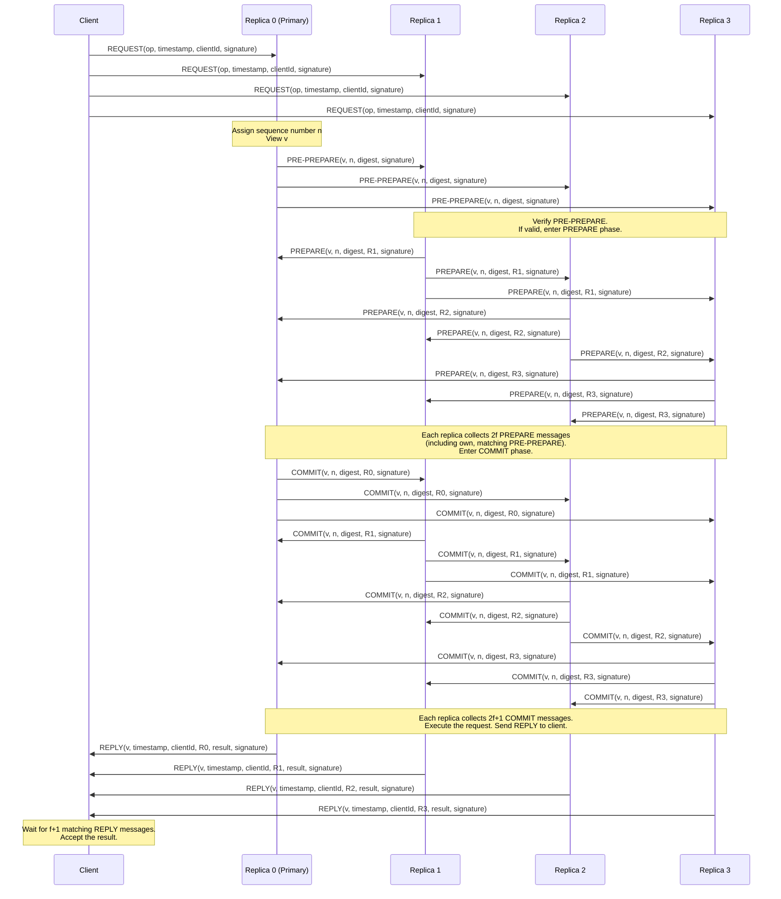
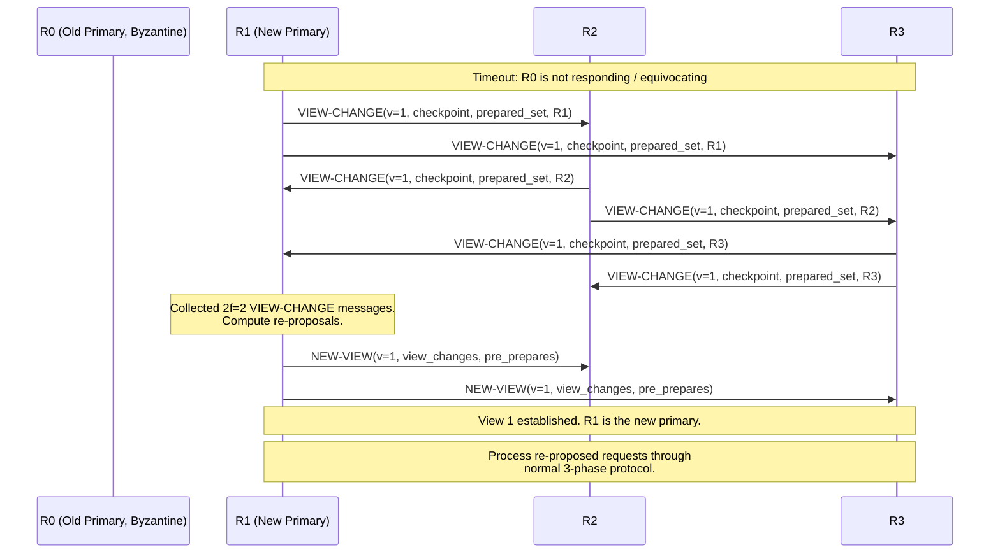
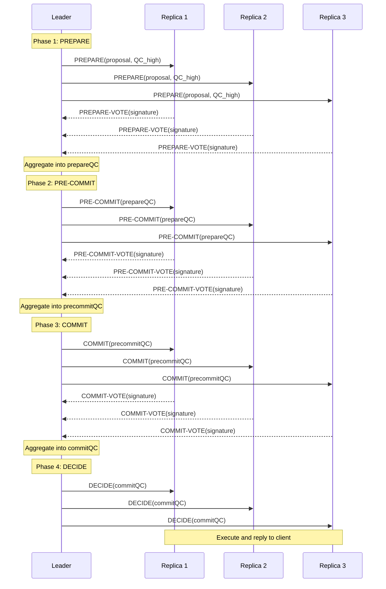
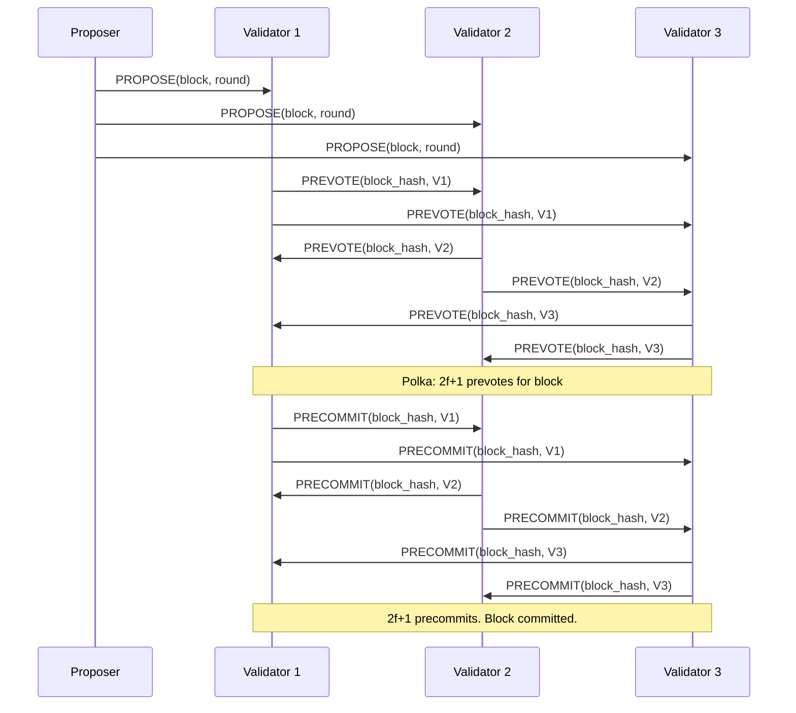

# Practical Byzantine Fault Tolerance

Byzantine fault tolerance (BFT) is the ability of a distributed system to continue operating correctly even when some participants behave arbitrarily — they may crash, send conflicting messages to different peers, collude with each other, or attempt to subvert the protocol in any way. This is the strongest failure model in distributed computing.

For most internal systems, crash fault tolerance (CFT) is sufficient. Your database replicas do not actively try to corrupt your data. But there are domains where the participants cannot be fully trusted, and in those domains, BFT is not optional.

## When You Need BFT

### Permissioned Blockchains

Enterprise blockchain networks (Hyperledger Fabric, R3 Corda, Quorum) connect organizations that cooperate but do not fully trust each other. A supply chain consortium, a trade finance network, or a healthcare data exchange involves parties with conflicting incentives. Any participant might attempt to alter records, submit fraudulent transactions, or disrupt the network.

CFT assumes that failed nodes simply stop responding. In a consortium blockchain, a "failed" node might be an actively malicious participant that sends contradictory messages to different peers to cause disagreement. Only BFT handles this threat model.

### Financial Systems

High-value financial systems — securities exchanges, central bank digital currencies, clearinghouses — face threats from nation-state attackers, insider threats, and sophisticated fraud. The cost of a consensus failure (accepting an invalid transaction) is catastrophic. BFT provides defense in depth: even if an attacker compromises some nodes, the system produces correct results as long as fewer than one-third of nodes are compromised.

### Military and Critical Infrastructure

Military command and control systems, air traffic control, and power grid management systems must operate correctly even when under active attack. An adversary that compromises a node in a CFT system can cause arbitrary damage. BFT limits the damage to the threshold $f < n/3$.

### Multi-Cloud Deployments

When a system is deployed across multiple cloud providers (AWS, Azure, GCP) and the operators of those clouds are not fully trusted (or the system must survive a cloud provider being compromised), BFT provides guarantees that CFT cannot.

## The 3f+1 Requirement: Why You Need More Nodes

### Proof

**Theorem**: Any BFT protocol that tolerates $f$ Byzantine faults requires at least $n = 3f + 1$ replicas.

**Proof**: Consider a system with $n$ replicas, of which $f$ may be Byzantine. We need to show $n \geq 3f + 1$.

The protocol must make progress even when $f$ replicas fail to respond (they might be Byzantine and refusing to participate, or they might be honest but slow). So the protocol must be able to decide based on responses from $n - f$ replicas.

Among these $n - f$ responding replicas, up to $f$ might be Byzantine and lying. The protocol must still determine the correct value from the honest replicas' responses.

The honest replicas in the responding set number at least $n - f - f = n - 2f$. For the protocol to determine the correct value, the honest replicas must outnumber the Byzantine ones. Since there are at most $f$ Byzantine replicas among the $n - f$ responders:

$$n - 2f > f$$
$$n > 3f$$
$$n \geq 3f + 1$$

Alternatively, the quorum intersection argument: any two quorums of size $q$ must intersect in at least $f + 1$ replicas (to guarantee at least one honest replica in the intersection). Each quorum must have $q \leq n - f$ (we can form a quorum without the Byzantine replicas). So:

$$2q - n \geq f + 1$$
$$2(n - f) - n \geq f + 1$$
$$n - 2f \geq f + 1$$
$$n \geq 3f + 1$$

### Practical Implications

| Byzantine faults tolerated | Nodes required (BFT) | Nodes required (CFT) | Overhead |
|---|---|---|---|
| 1 | 4 | 3 | 33% more |
| 2 | 7 | 5 | 40% more |
| 3 | 10 | 7 | 43% more |
| 10 | 31 | 21 | 48% more |
| 33 | 100 | 67 | 49% more |

The overhead approaches 50% as $f$ grows. This is significant: BFT requires roughly 50% more hardware than CFT for the same fault tolerance level, plus the computational overhead of the BFT protocol itself (more messages, cryptographic signatures).

## PBFT: Practical Byzantine Fault Tolerance

Castro and Liskov published PBFT in 1999 at OSDI. It was the first BFT protocol practical enough for real workloads, achieving throughput within a factor of 3 of an unreplicated service. The protocol extends Viewstamped Replication's ideas to the Byzantine model.

### System Model

- $n = 3f + 1$ replicas, of which at most $f$ are Byzantine.
- Asynchronous network with eventual delivery (messages may be delayed arbitrarily but are eventually delivered).
- Cryptographic assumptions: digital signatures are unforgeable, and hash functions are collision-resistant.
- All messages are authenticated (signed by the sender).

### Normal Operation: Three Phases

PBFT's normal case has three phases: pre-prepare, prepare, and commit. The extra phase (compared to CFT protocols) is necessary because the primary itself might be Byzantine.



#### Phase 1: Pre-Prepare

The primary assigns a sequence number $n$ to the client request $m$ and multicasts a `PRE-PREPARE(v, n, d)` message to all backups, where $v$ is the view number and $d$ is the digest of $m$.

A backup accepts the pre-prepare if:
1. The signature is valid.
2. The view number matches the backup's current view.
3. The backup has not accepted a different pre-prepare for the same $v$ and $n$ with a different digest. (This prevents a Byzantine primary from assigning the same sequence number to different requests.)
4. The sequence number is within the current watermark window (explained below).

#### Phase 2: Prepare

A backup that accepts a pre-prepare multicasts a `PREPARE(v, n, d, i)` message to all other replicas, where $i$ is the backup's replica ID.

A replica (including the primary) has **prepared** a request when it has:
- A valid pre-prepare for $(v, n, d)$
- $2f$ matching prepare messages from different replicas for $(v, n, d)$

The prepare phase guarantees that if a request is prepared at one honest replica, it is prepared (or will be prepared) at every honest replica. This is the BFT equivalent of replication.

**Why 2f prepares?** Among $3f + 1$ replicas, one is the primary (who sent the pre-prepare, not a prepare). Of the remaining $3f$ replicas, at most $f$ are Byzantine. We need $2f$ prepare messages from different replicas. Since at most $f$ of those could be Byzantine, at least $f$ are from honest replicas. Combined with the honest replicas that have not yet sent their prepares, this guarantees that a majority of honest replicas agree.

#### Phase 3: Commit

A replica that has prepared a request multicasts a `COMMIT(v, n, d, i)` message to all other replicas.

A replica has **committed** a request when it has collected $2f + 1$ commit messages from different replicas (including its own) for $(v, n, d)$.

The commit phase ensures that if a request is committed at one honest replica, it will eventually be committed at every honest replica, even across view changes.

**Why $2f + 1$ commits?** Among $3f + 1$ replicas, at most $f$ are Byzantine. We need $2f + 1$ commit messages, of which at most $f$ could be from Byzantine replicas. That leaves at least $f + 1$ commits from honest replicas — a majority of honest replicas have committed.

#### Client

The client sends its request to all replicas (not just the primary) and waits for $f + 1$ matching replies from different replicas. Since at most $f$ replicas are Byzantine, $f + 1$ matching replies guarantees at least one is from an honest replica, and the result is correct.

### Why Three Phases?

CFT protocols (Raft, VR, Paxos) need only two phases because the leader is trusted. If the leader says "this is entry #42," followers believe it.

In PBFT, the primary might be Byzantine. It could send different requests to different replicas with the same sequence number. The prepare phase detects this equivocation: if the primary sends request $A$ to replicas 1 and 2 and request $B$ to replicas 3 and 4, the prepare messages will reveal the inconsistency (the digests will not match), and the replicas will trigger a view change.

The commit phase is needed because the prepare phase alone does not guarantee that a prepared request survives view changes. The commit phase ensures that enough replicas have recorded the decision that any subsequent view change will include it.

```
Without commit phase (two phases only):
  Request X is prepared at replicas {R0, R1, R2} (2f+1 = 3 for f=1)
  View change happens. R0 (Byzantine) and R1 (crashed) are unavailable.
  New view: R2 and R3 participate. R3 never saw X.
  Only R2 has X. Not a quorum. X might be lost.

With commit phase (three phases):
  Request X is committed at replicas {R0, R1, R2, R3} (2f+1 = 3)
  Even if R0 is Byzantine and R1 crashes:
  R2 and R3 both committed X. 2 out of 3 honest replicas.
  View change will recover X.
```

### Message Complexity

In normal operation with $n = 3f + 1$ replicas:

| Phase | Messages | Total |
|---|---|---|
| Client → Replicas | $n$ | $n$ |
| Pre-Prepare (primary → backups) | $n - 1$ | $n - 1$ |
| Prepare (each backup → all replicas) | $(n-1) \times (n-1)$ | $O(n^2)$ |
| Commit (each replica → all replicas) | $n \times (n-1)$ | $O(n^2)$ |
| Reply (replicas → client) | $n$ | $n$ |

**Total: $O(n^2)$ messages per request.** This quadratic message complexity is the primary scalability bottleneck of PBFT. For $n = 4$ ($f = 1$), this is manageable. For $n = 100$ ($f = 33$), it becomes prohibitive.

### View Change Protocol

When replicas suspect the primary is Byzantine (timeout, inconsistent messages), they trigger a view change to install a new primary.

1. **Replica sends VIEW-CHANGE**: A replica that suspects the primary sends a `VIEW-CHANGE(v+1, n, C, P, i)` message to all replicas, where:
   - $v + 1$ is the new view number
   - $n$ is the sequence number of the last stable checkpoint
   - $C$ is a proof of the checkpoint (a set of $2f + 1$ signed checkpoint messages)
   - $P$ is a set of all prepared requests since the checkpoint (each with its pre-prepare and $2f$ prepares)
   - $i$ is the replica's ID

2. **New primary sends NEW-VIEW**: The new primary (replica $v+1 \mod n$) collects $2f$ valid `VIEW-CHANGE` messages. It then computes the set of requests that must be re-proposed (based on the prepared requests in the VIEW-CHANGE messages) and sends a `NEW-VIEW` message containing:
   - The $2f$ VIEW-CHANGE messages
   - A set of pre-prepare messages for each sequence number between the latest stable checkpoint and the highest prepared sequence number

3. **Replicas verify NEW-VIEW**: Each replica verifies the NEW-VIEW message by independently computing the set of pre-prepare messages from the VIEW-CHANGE messages. If the computation matches, the replica enters the new view and processes the pre-prepare messages.



### Checkpoint Protocol

The checkpoint protocol bounds the size of the log and the VIEW-CHANGE messages. Without checkpoints, replicas would need to include their entire history in every VIEW-CHANGE message.

Every $K$ requests (e.g., every 100), each replica takes a checkpoint:

1. Replica $i$ takes a snapshot of its state after executing request $n$.
2. Replica $i$ multicasts `CHECKPOINT(n, d, i)` to all other replicas, where $d$ is the digest of the state.
3. When a replica collects $2f + 1$ matching checkpoint messages for $(n, d)$, the checkpoint is **stable**. The replica can discard all log entries, pre-prepare messages, prepare messages, and commit messages for sequence numbers $\leq n$.

The $2f + 1$ matching checkpoint messages form a **proof of correctness**: since at most $f$ are Byzantine, at least $f + 1$ honest replicas agree on the state, which guarantees the checkpoint is correct.

### Watermarks

PBFT uses a sliding window of sequence numbers, bounded by watermarks:

- **Low watermark** ($h$): The sequence number of the last stable checkpoint.
- **High watermark** ($H = h + L$): The low watermark plus a constant $L$ (e.g., $L = 2K$ where $K$ is the checkpoint interval).

Replicas reject pre-prepare messages with sequence numbers outside the window $[h, H]$. This prevents a Byzantine primary from exhausting resources by assigning very large sequence numbers.

## Performance: BFT vs. CFT

The overhead of BFT compared to CFT comes from three sources:

### 1. More Replicas

BFT requires $3f + 1$ replicas vs. $2f + 1$ for CFT. For $f = 1$: 4 replicas vs. 3 (33% more hardware).

### 2. More Messages

BFT requires $O(n^2)$ messages per request (prepare and commit phases are all-to-all). CFT requires $O(n)$ messages (leader sends to all followers).

| Faults tolerated | CFT messages per request | PBFT messages per request |
|---|---|---|
| 1 | ~6 | ~24 |
| 2 | ~10 | ~72 |
| 3 | ~14 | ~144 |
| 10 | ~42 | ~1,800 |

### 3. Cryptographic Operations

PBFT requires digital signatures (or MACs) on every message. ECDSA signing takes ~100 microseconds; verification takes ~200 microseconds. With $O(n^2)$ messages, this adds up.

Castro and Liskov's original results showed PBFT achieving 3% overhead compared to an unreplicated service (using MAC-based authentication, not full digital signatures) for a Byzantine fault-tolerant NFS implementation. This was groundbreaking at the time. Modern BFT protocols achieve even better performance.

## Modern BFT Variants

PBFT's $O(n^2)$ message complexity limits scalability. Modern BFT protocols reduce this while maintaining the same fault tolerance guarantees.

### HotStuff (2019)

HotStuff, developed by Yin, Malkhi, Reiter, Gueta, and Abraham, achieves $O(n)$ message complexity through two innovations:

1. **Linear message complexity**: Instead of all-to-all communication, HotStuff uses a star topology where all communication goes through the leader. The leader collects votes, aggregates them into a quorum certificate (QC), and broadcasts the QC.

2. **Threshold signatures**: Instead of collecting $2f + 1$ individual signatures, HotStuff uses threshold cryptography to combine them into a single aggregate signature. This reduces the QC size from $O(n)$ to $O(1)$.

HotStuff uses three phases (like PBFT) plus a decision phase, but each phase requires only $O(n)$ messages:



Key properties:

- **$O(n)$ messages per phase**, $O(n)$ total per request (4 phases, each with $n$ messages from leader + $n$ votes back).
- **Linear view change**: The view change protocol also requires only $O(n)$ messages (compared to PBFT's $O(n^2)$).
- **Optimistic responsiveness**: HotStuff can make progress at network speed (no predetermined timeouts) when the leader is honest.

### Chained HotStuff

Chained HotStuff pipelines the three phases so that each new proposal also serves as the next phase for the previous proposal. This amortizes the latency to one round trip per decision (after the pipeline is full).

```
Round 1: Leader proposes block B1
  B1 reaches PREPARE phase

Round 2: Leader proposes block B2
  B2 reaches PREPARE phase
  B1 advances to PRE-COMMIT phase

Round 3: Leader proposes block B3
  B3 reaches PREPARE phase
  B2 advances to PRE-COMMIT phase
  B1 advances to COMMIT phase

Round 4: Leader proposes block B4
  B4 reaches PREPARE phase
  B3 advances to PRE-COMMIT phase
  B2 advances to COMMIT phase
  B1 reaches DECIDE — committed!
```

Each block is committed after 3 subsequent blocks are proposed. The pipeline amortizes the 3-phase latency.

### Tendermint BFT (2018)

Tendermint (Buchman, Kwon, Milosevic) is the consensus engine behind the Cosmos blockchain ecosystem. It is a partially synchronous BFT protocol that combines ideas from PBFT and DLS.

Tendermint's protocol:

1. **Propose**: The proposer (selected round-robin) broadcasts a block.
2. **Prevote**: Each validator broadcasts a prevote for the proposed block (or a nil prevote if the block is invalid). When a validator collects $2f + 1$ prevotes for the same block, it has a **polka**.
3. **Precommit**: Each validator that has a polka broadcasts a precommit. When a validator collects $2f + 1$ precommits for the same block, the block is committed.



Key properties:

- **Instant finality**: Once a block is committed, it is final. There is no possibility of a chain reorganization (unlike Nakamoto consensus).
- **$O(n^2)$ messages**: Like PBFT, Tendermint uses all-to-all communication. Gossip protocols can reduce the practical message load, but the theoretical complexity remains $O(n^2)$.
- **Locking mechanism**: Validators "lock" on a block after seeing a polka. They will not prevote for a different block in subsequent rounds (of the same height) unless they see a polka for a different block. This prevents equivocation across rounds.
- **Timeout-based liveness**: Each phase has a timeout. If the proposer fails to propose within the timeout, validators prevote nil, and the round moves to the next proposer.

### LibraBFT / DiemBFT (2019-2021)

DiemBFT (originally LibraBFT) was developed for Meta's Diem cryptocurrency project (formerly Libra). It is based on Chained HotStuff with several practical improvements:

1. **Pacemaker**: A mechanism that synchronizes validators' rounds to ensure they are all working on the same round. This replaces HotStuff's abstract view synchronization with a concrete protocol.

2. **Optimistic path**: In the common case (honest leader, no network delays), DiemBFT commits in 3 message delays (matching HotStuff).

3. **Fallback path**: When the leader is faulty, the pacemaker triggers a round change (analogous to PBFT's view change). The round change requires only $O(n)$ messages (inheriting HotStuff's linear view change).

4. **Block tree**: Instead of a linear chain, DiemBFT maintains a tree of proposed blocks. Committed blocks form a chain within the tree. Uncommitted branches are pruned.

## Comprehensive BFT Comparison

| Property | PBFT | HotStuff | Tendermint | DiemBFT |
|---|---|---|---|---|
| **Year** | 1999 | 2019 | 2018 | 2019-2021 |
| **Message complexity (normal)** | $O(n^2)$ | $O(n)$ | $O(n^2)$ | $O(n)$ |
| **Message complexity (view change)** | $O(n^3)$ | $O(n)$ | $O(n^2)$ | $O(n)$ |
| **Latency (message delays)** | 5 | 7 (basic) / 1 (chained, amortized) | 4 | 3 (chained, amortized) |
| **Cryptographic mechanism** | MACs or signatures | Threshold signatures | Signatures | Threshold signatures |
| **Leader selection** | Round-robin by view | Round-robin by view | Round-robin by round | Round-robin with pacemaker |
| **Finality** | Immediate | Immediate | Immediate | Immediate |
| **Responsiveness** | No (timeout-dependent) | Optimistic (network speed) | No (timeout-dependent) | Optimistic (network speed) |
| **Pipelining** | No | Yes (chained variant) | No | Yes |
| **Production use** | Hyperledger Fabric (v0.6) | Diem (via DiemBFT), Flow | Cosmos, Binance Chain | Diem (deprecated), Aptos |
| **Scalability limit** | ~20 replicas | ~100+ replicas | ~100 validators | ~100+ validators |

### Performance in Practice

Empirical measurements from published results and independent benchmarks:

| Protocol | Throughput (tx/s) | Latency (ms) | Nodes | Environment |
|---|---|---|---|---|
| PBFT | ~20,000 | ~5 | 4 | LAN |
| PBFT | ~2,000 | ~100 | 4 | WAN |
| HotStuff | ~80,000 | ~3 | 4 | LAN |
| HotStuff | ~30,000 | ~200 | 32 | WAN |
| Tendermint | ~10,000 | ~1,000 | 4 | LAN |
| Tendermint | ~1,000 | ~6,000 | 64 | WAN |
| DiemBFT | ~100,000 | ~500 | 100 | WAN (simulated) |

Note: These numbers vary significantly based on hardware, network conditions, transaction size, and benchmarking methodology. They should be taken as rough order-of-magnitude comparisons, not precise measurements.

## BFT in Practice: Implementation Challenges

### Authentication Overhead

Every message in a BFT protocol must be authenticated. Options:

- **Digital signatures (RSA, ECDSA)**: Strongest guarantee. Any replica can verify any message. But expensive: ~100-500 microseconds per operation. Used by HotStuff and Tendermint.
- **MACs (HMAC-SHA256)**: Faster (~1 microsecond per operation) but require pairwise shared keys. Each message must include $n - 1$ MACs (one for each other replica). Used by the original PBFT.
- **Threshold signatures (BLS)**: Allow aggregation of multiple signatures into a single constant-size signature. Verification is efficient, but key setup requires a distributed key generation protocol. Used by HotStuff and DiemBFT.

### State Machine Determinism

BFT requires all honest replicas to produce exactly the same output for the same input. Non-determinism in the state machine (floating-point arithmetic differences, random number generators, clock-dependent logic) will cause honest replicas to diverge, which the BFT protocol cannot distinguish from a Byzantine fault.

This is a stricter requirement than for CFT protocols, where non-determinism merely causes bugs. In BFT, non-determinism can cause the system to halt (too many "faulty" replicas).

### Trusted Execution Environments

A hybrid approach uses Trusted Execution Environments (TEEs) like Intel SGX to reduce the BFT requirement from $3f + 1$ to $2f + 1$ nodes. The TEE prevents equivocation (signing conflicting messages) at the hardware level, effectively reducing Byzantine faults to crash faults.

MinBFT and MinZyzzyva use this approach. The trade-off is trusting hardware manufacturers (Intel, AMD) to correctly implement the TEE.

### Accountability

Modern BFT protocols increasingly include **accountability**: the ability to identify and punish Byzantine replicas after the fact. If a replica is caught equivocating (signing conflicting messages), the conflicting signatures serve as cryptographic proof of misbehavior. Tendermint uses this for "evidence-based slashing" in proof-of-stake blockchains — Byzantine validators lose their staked tokens.

## The Future of BFT

Several trends are shaping the evolution of BFT protocols:

1. **DAG-based BFT** (Narwhal/Tusk, Bullshark): Separate data dissemination from consensus ordering. Transactions are disseminated through a directed acyclic graph, and consensus only orders the graph vertices. This achieves much higher throughput by parallelizing data dissemination.

2. **Optimistic BFT**: Protocols like Zyzzyva achieve 3 message delays in the best case (when all replicas are honest and responsive). They fall back to PBFT-like protocols when faults are detected.

3. **Sharded BFT**: Running multiple BFT instances in parallel, each responsible for a subset of the state. This is analogous to Multi-Raft for CFT systems. Ethereum 2.0's beacon chain uses this approach.

4. **Post-quantum BFT**: As quantum computers threaten classical cryptographic primitives (ECDSA, RSA), BFT protocols must transition to post-quantum signature schemes. This is an active area of research with significant performance implications.

## References

1. Castro, M., & Liskov, B. (1999). "Practical Byzantine Fault Tolerance." *OSDI*.
2. Castro, M., & Liskov, B. (2002). "Practical Byzantine Fault Tolerance and Proactive Recovery." *ACM TOCS*.
3. Yin, M., Malkhi, D., Reiter, M. K., Gueta, G. G., & Abraham, I. (2019). "HotStuff: BFT Consensus with Linearity and Responsiveness." *PODC*.
4. Buchman, E., Kwon, J., & Milosevic, Z. (2018). "The latest gossip on BFT consensus." *arXiv*.
5. Baudet, M., et al. (2019). "State Machine Replication in the Libra Blockchain." *Libra Technical Paper*.
6. Lamport, L., Shostak, R., & Pease, M. (1982). "The Byzantine Generals Problem." *ACM TOPLAS*.
7. Dwork, C., Lynch, N., & Stockmeyer, L. (1988). "Consensus in the Presence of Partial Synchrony." *JACM*.
8. Kotla, R., Alvisi, L., Dahlin, M., Clement, A., & Wong, E. (2007). "Zyzzyva: Speculative Byzantine Fault Tolerance." *SOSP*.
9. Danezis, G., et al. (2022). "Narwhal and Tusk: A DAG-based Mempool and Efficient BFT Consensus." *EuroSys*.
10. Spiegelman, A., Giridharan, N., Sonnino, A., & Malkhi, D. (2022). "Bullshark: DAG BFT Protocols Made Practical." *CCS*.
