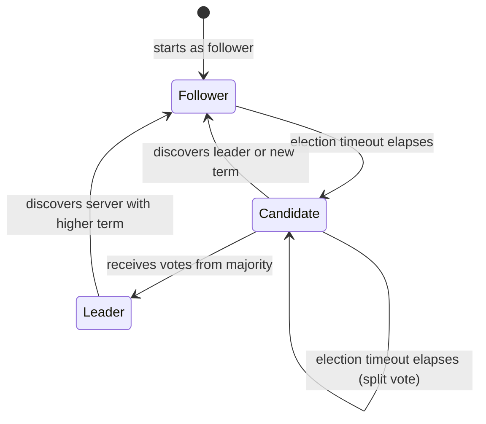
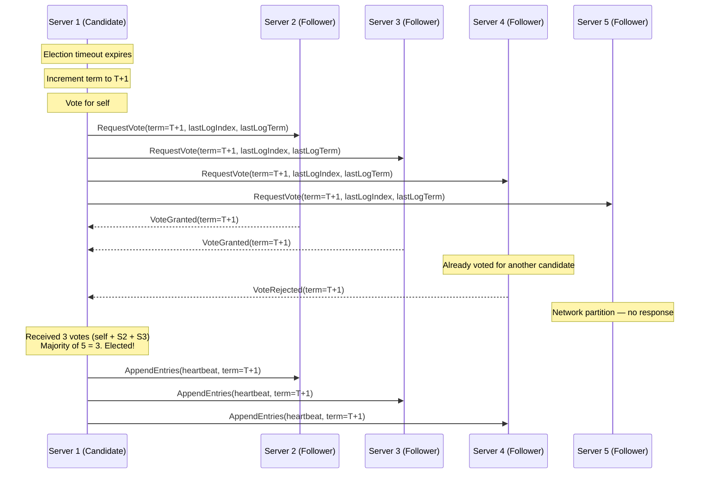
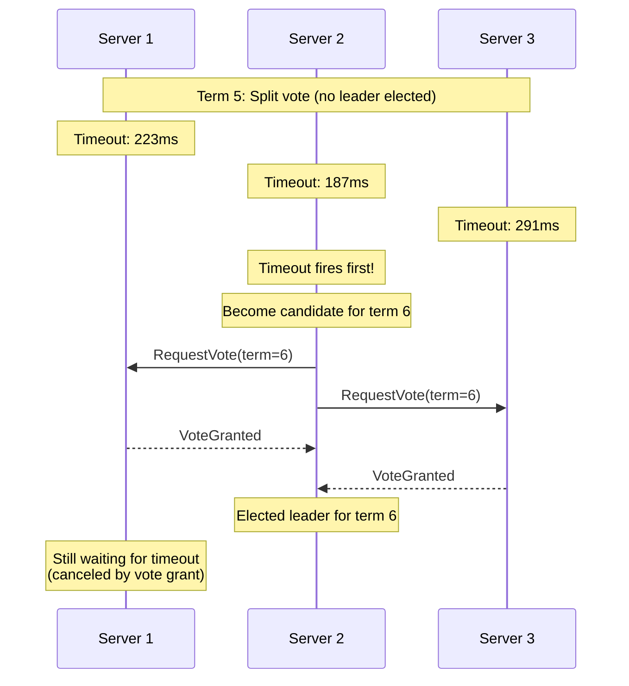
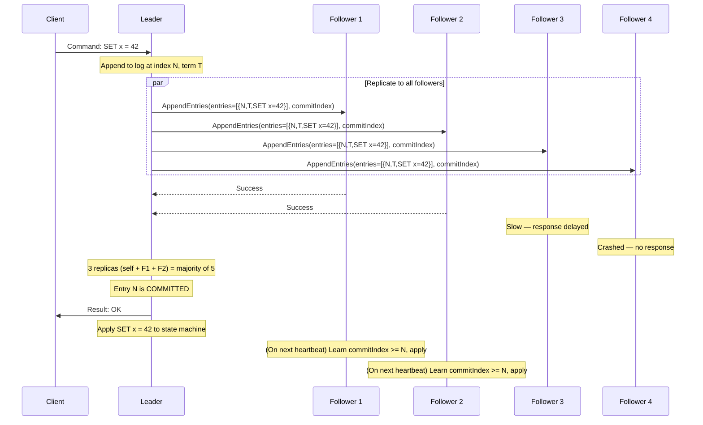
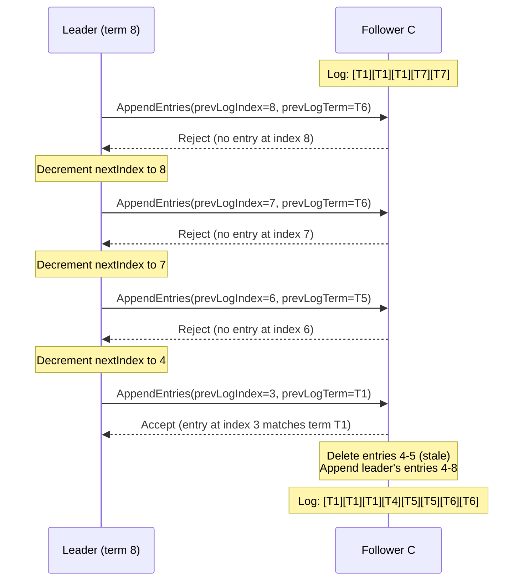
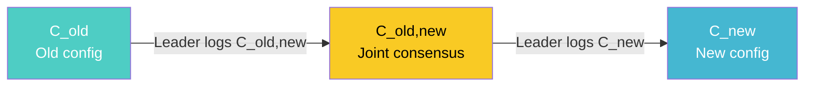
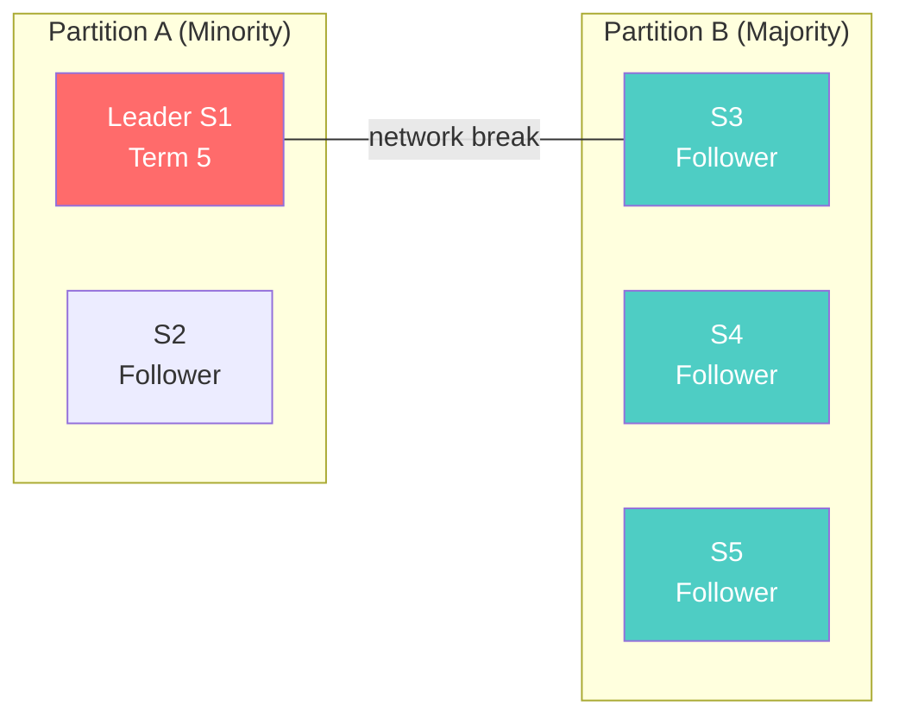
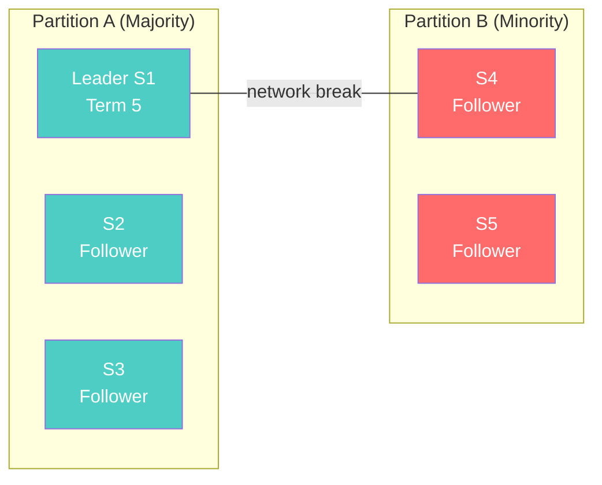

# Raft: The Definitive Walkthrough

Raft is a consensus algorithm designed to be understandable. That is its primary design goal — not performance, not minimality, not elegance in the Lamport sense, but the ability for a human being to read the paper, understand every invariant, and implement it correctly.

Diego Ongaro and John Ousterhout published Raft in 2014 after conducting a user study showing that students learned Raft significantly faster than Paxos and produced more correct implementations. The paper won best paper at USENIX ATC 2014 and has become the de facto consensus algorithm for new distributed systems.

This page is the definitive reference. Every sub-problem, every invariant, every edge case. No summaries, no hand-waving.

## Motivation: Why Not Paxos?

Lamport's Paxos has been the dominant consensus algorithm since the late 1990s. It is proven correct, well-studied, and deployed in production at Google (Chubby, Spanner), Microsoft (Autopilot), and Amazon (internally). So why replace it?

The problem is not correctness. The problem is comprehension.

Paxos describes single-decree consensus: agreement on a single value. Building a practical system requires Multi-Paxos — agreement on a sequence of values — but Lamport never fully specified Multi-Paxos. Every implementation fills in the gaps differently. The result is a collection of systems that share a name and a single-decree core but diverge in every practical detail: leader election, log management, reconfiguration, snapshotting.

Ongaro and Ousterhout identified the specific sources of confusion:

1. **Paxos is symmetric.** Any node can propose at any time. This makes reasoning about concurrent proposals extremely difficult.
2. **Single-decree Paxos does not compose easily.** The jump from one value to a log of values introduces problems (leader election, log gaps, out-of-order commits) that are not addressed in the original paper.
3. **The literature is fragmented.** There is no single document that describes a complete, implementable Multi-Paxos system.

Raft's response is to decompose consensus into three relatively independent sub-problems and solve each one with a clear mechanism:

1. **Leader election** — how to pick a leader and detect failures
2. **Log replication** — how the leader replicates entries to followers
3. **Safety** — how to guarantee that the replicated log never diverges

## Raft Fundamentals

### Server States

Every Raft server is in exactly one of three states at any given time:



- **Follower**: Passive. Responds to RPCs from leaders and candidates. If it receives no communication within the election timeout, it transitions to candidate.
- **Candidate**: Active. Starts an election by incrementing its term, voting for itself, and sending RequestVote RPCs to all other servers.
- **Leader**: Active. Handles all client requests. Replicates log entries to followers via AppendEntries RPCs. Sends periodic heartbeats (empty AppendEntries) to prevent election timeouts.

### Terms

Raft divides time into terms of arbitrary length. Each term begins with an election. If a candidate wins, it serves as leader for the rest of the term. If no candidate wins (split vote), the term ends with no leader, and a new term begins immediately.

```
Term 1      Term 2      Term 3        Term 4      Term 5
┌────────┐  ┌────────┐  ┌──┐          ┌────────┐  ┌────────
│Election │  │Election │  │E │          │Election │  │Election
│Leader A │  │Leader B │  │no│          │Leader C │  │Leader D
│operates │  │operates │  │  │leader    │operates │  │operates
└────────┘  └────────┘  └──┘          └────────┘  └────────
                         split vote
```

Terms act as a logical clock. Every RPC includes the sender's current term. If a server receives an RPC with a term greater than its own, it updates its term and reverts to follower. If a server receives an RPC with a stale term, it rejects the RPC.

This mechanism is the key to Raft's distributed locking: a leader in term 5 cannot be confused with a leader in term 7. Old leaders are automatically deposed by the term mechanism.

### RPCs

Raft uses only two RPCs during normal operation (a third, InstallSnapshot, is used for log compaction):

1. **RequestVote** — sent by candidates during elections
2. **AppendEntries** — sent by leaders for log replication and heartbeats

Both RPCs are idempotent. They can be retried safely after network failures.

## Sub-Problem 1: Leader Election

### The Election Timer

Every follower maintains an election timer. When the timer expires without receiving an AppendEntries RPC from the current leader (or granting a vote to a candidate), the follower assumes the leader has crashed and starts an election.

The election timeout is randomized: each server picks a value uniformly at random from a range, typically 150ms to 300ms. This randomization is critical for avoiding split votes. If all servers used the same timeout, they would all become candidates simultaneously, split the vote, and repeat forever.

### The Election Process



Step by step:

1. The follower's election timeout expires.
2. It increments its current term by 1.
3. It transitions to the candidate state.
4. It votes for itself (persists this vote to stable storage).
5. It sends RequestVote RPCs to all other servers in parallel.
6. It waits for responses.

Three outcomes are possible:

**Win**: The candidate receives votes from a majority of servers (including itself). It becomes leader and immediately sends heartbeat AppendEntries RPCs to all servers to establish its authority and prevent new elections.

**Lose**: The candidate receives an AppendEntries RPC from a server claiming to be leader with a term >= the candidate's current term. The candidate recognizes the leader's authority and reverts to follower.

**Draw (split vote)**: No candidate receives a majority. Each candidate's election timeout expires, and a new election begins with an incremented term. The randomized timeout ensures that split votes are rare and resolve quickly.

### RequestVote RPC

```
RequestVote RPC:

Arguments:
  term           — candidate's term
  candidateId    — candidate requesting vote
  lastLogIndex   — index of candidate's last log entry
  lastLogTerm    — term of candidate's last log entry

Results:
  term           — currentTerm, for candidate to update itself
  voteGranted    — true if candidate received vote
```

A server grants a vote if and only if ALL of the following are true:

1. The candidate's term is >= the voter's current term.
2. The voter has not already voted for a different candidate in this term.
3. The candidate's log is at least as up-to-date as the voter's log.

The third condition is the **election restriction** — the single most important safety mechanism in Raft. It ensures that any elected leader already has all committed entries in its log. This is what makes Raft's leader-based approach safe without the complex log reconciliation that Paxos requires.

### Log Comparison for Up-to-Date Check

Two logs are compared by looking at the last entry in each:

1. If the logs have last entries with different terms, the log with the later term is more up-to-date.
2. If the logs end with the same term, the longer log is more up-to-date.

```
Server A log: [T1:x=1] [T1:y=2] [T3:z=3]
Server B log: [T1:x=1] [T1:y=2] [T2:w=4] [T2:v=5]

Last entry of A: term 3, index 3
Last entry of B: term 2, index 4

A is more up-to-date because term 3 > term 2
(even though B's log is longer)
```

This comparison ensures that the elected leader's log contains every committed entry. The proof is given in the Safety section below.

### Handling Split Votes

Split votes occur when multiple candidates start elections simultaneously and no candidate gets a majority. Raft handles this purely through randomized timeouts:



The probability of repeated split votes decreases exponentially with the number of rounds. With a timeout range of 150ms to 300ms and 5 servers, the probability of needing more than two rounds is negligible.

### Pre-Vote Extension (Raft PhD Dissertation)

In Raft's original design, a partitioned server will increment its term repeatedly as it times out and starts new elections. When the partition heals, this server's high term will disrupt the current leader, even though the partitioned server's log is behind.

The Pre-Vote extension (Section 9.6 of Ongaro's dissertation) addresses this. Before starting a real election, a candidate first runs a "pre-election" phase: it sends PreVote RPCs that do not increment the term. Only if the pre-vote succeeds (a majority would vote for the candidate) does the server increment its term and start the real election.

This prevents partitioned servers from disrupting the cluster when they rejoin.

## Sub-Problem 2: Log Replication

### Normal Operation

Once a leader is elected, it services all client requests. Each client request contains a command to be executed by the replicated state machine. The leader:

1. Appends the command to its log as a new entry (with the current term number).
2. Sends AppendEntries RPCs in parallel to every follower.
3. Once the entry is replicated on a majority of servers, the leader commits the entry.
4. The leader applies the committed entry to its state machine and returns the result to the client.
5. Followers apply committed entries to their own state machines (they learn of the commit via the leader's next AppendEntries RPC, which includes the leader's commit index).



### AppendEntries RPC

```
AppendEntries RPC:

Arguments:
  term              — leader's term
  leaderId          — so follower can redirect clients
  prevLogIndex      — index of log entry immediately preceding new ones
  prevLogTerm       — term of prevLogIndex entry
  entries[]         — log entries to store (empty for heartbeat)
  leaderCommit      — leader's commitIndex

Results:
  term              — currentTerm, for leader to update itself
  success           — true if follower contained entry matching
                      prevLogIndex and prevLogTerm
```

The `prevLogIndex` and `prevLogTerm` fields implement the **Log Matching Property**: if two logs contain an entry with the same index and term, then the logs are identical in all preceding entries.

When a follower receives an AppendEntries RPC:

1. If `term < currentTerm`, reject (stale leader).
2. If the log does not contain an entry at `prevLogIndex` with term `prevLogTerm`, reject (consistency check fails).
3. If an existing entry conflicts with a new one (same index, different term), delete the existing entry and all that follow it.
4. Append any new entries not already in the log.
5. If `leaderCommit > commitIndex`, set `commitIndex = min(leaderCommit, index of last new entry)`.

### The Log Matching Property

Raft maintains two invariants that together constitute the Log Matching Property:

1. **If two entries in different logs have the same index and term, they store the same command.** This follows because a leader creates at most one entry with a given index in a given term, and entries never change their position in the log.

2. **If two entries in different logs have the same index and term, then the logs are identical in all preceding entries.** This is guaranteed inductively by the AppendEntries consistency check. When sending an AppendEntries RPC, the leader includes the index and term of the entry immediately preceding the new entries. The follower rejects the RPC unless its log matches at that point.

```
Leader log:   [T1:a] [T1:b] [T2:c] [T3:d] [T3:e]
                1      2      3      4      5

Follower log: [T1:a] [T1:b] [T2:c]
                1      2      3

AppendEntries(prevLogIndex=3, prevLogTerm=T2, entries=[{4,T3,d},{5,T3,e}])

Follower checks: Do I have entry at index 3 with term T2? YES.
→ Accept. Append entries 4 and 5.

Result:
Follower log: [T1:a] [T1:b] [T2:c] [T3:d] [T3:e]
                1      2      3      4      5
```

### Handling Log Inconsistencies

After a leader crash, the new leader's log may diverge from some followers' logs. Followers may be missing entries or have extra uncommitted entries from a previous term.

```
Leader (term 8):
  [T1] [T1] [T1] [T4] [T5] [T5] [T6] [T6]
   1    2    3    4    5    6    7    8

Follower A (missed entries 7-8):
  [T1] [T1] [T1] [T4] [T5] [T5]
   1    2    3    4    5    6

Follower B (has stale entries from old leader in term 3):
  [T1] [T1] [T1] [T4] [T5] [T5] [T6] [T6] [T3] [T3]
   1    2    3    4    5    6    7    8    9   10

Follower C (has different entries from term 7):
  [T1] [T1] [T1] [T7] [T7]
   1    2    3    4    5
```

The leader handles all inconsistencies by forcing followers' logs to match its own. For each follower, the leader maintains a `nextIndex` — the index of the next log entry to send to that follower. When a leader first comes to power, it initializes all `nextIndex` values to the index after the last entry in its log.

If a follower rejects an AppendEntries because the consistency check fails, the leader decrements `nextIndex` for that follower and retries. Eventually, `nextIndex` will reach a point where the logs agree, the AppendEntries will succeed, and the follower's conflicting entries will be overwritten.



### Optimized Backtracking

The basic backtracking algorithm decrements `nextIndex` by 1 on each rejection. For followers that are far behind, this is slow. Raft suggests an optimization where the follower includes information in its rejection response:

- **conflictTerm**: the term of the conflicting entry at `prevLogIndex`
- **conflictIndex**: the first index the follower has for `conflictTerm`

The leader can then skip all entries in the conflicting term at once, jumping `nextIndex` directly to the right position. In practice, this reduces the number of rejected RPCs from O(entries) to O(terms).

### Commit Rules

An entry is committed when the leader has replicated it on a majority of servers. But there is a critical subtlety: **a leader must not commit entries from previous terms by counting replicas.** It can only commit entries from its own current term.

This rule prevents a specific safety violation. Consider:

```
Time 1: S1 is leader in term 2, replicates entry at index 2 to S2
         S1: [T1][T2]    S2: [T1][T2]    S3: [T1]    S4: [T1]    S5: [T1]

Time 2: S1 crashes. S5 is elected leader in term 3 (votes from S3, S4, S5)
         S5 gets a client request:
         S5: [T1][T3]

Time 3: S5 crashes. S1 is elected leader in term 4 (votes from S1, S2, S3)
         S1 replicates index 2 (T2) to S3:
         S1: [T1][T2]    S2: [T1][T2]    S3: [T1][T2]    S4: [T1]    S5: [T1][T3]

         Index 2 (T2) is now on 3 of 5 servers. Is it committed?

         NO! If S1 crashes now and S5 is elected (term 5), S5's entry [T3] at
         index 2 would overwrite [T2]. The "committed" entry would be lost.

Fix: S1 in term 4 can only commit index 2 by first committing an entry from
     term 4. Once a term 4 entry at index 3 is committed on a majority,
     all preceding entries (including index 2) are implicitly committed.
```

This is the **commitment rule**: a leader commits entries from previous terms only indirectly, by committing a new entry from its current term that follows them.

## Sub-Problem 3: Safety

Raft's safety is captured by five properties. Together they guarantee that the replicated state machine never diverges.

### Property 1: Election Safety

**At most one leader can be elected in a given term.**

Proof: Each server votes for at most one candidate in a given term (the vote is persisted to stable storage before responding). A candidate needs a majority to win. Since any two majorities overlap, two candidates cannot both get a majority in the same term.

### Property 2: Leader Append-Only

**A leader never overwrites or deletes entries in its log; it only appends new entries.**

This is enforced by the protocol: the leader's AppendEntries handler never modifies the leader's own log. Only followers truncate conflicting entries.

### Property 3: Log Matching

**If two logs contain an entry with the same index and term, then the logs are identical in all entries up through the given index.**

Proof by induction on the AppendEntries consistency check, as described above.

### Property 4: Leader Completeness

**If a log entry is committed in a given term, that entry will be present in the logs of all leaders in all higher-numbered terms.**

This is the most important safety property. The proof proceeds by contradiction.

Assume a committed entry $e$ at index $i$ from term $T$ is not present in the log of some leader in term $U > T$.

1. Entry $e$ was replicated on a majority $S_1$ before being committed.
2. The leader of term $U$ received votes from a majority $S_2$.
3. $S_1 \cap S_2 \neq \emptyset$ (any two majorities overlap).
4. Let $v$ be a server in the intersection. $v$ accepted entry $e$ (since $v \in S_1$) and voted for the leader of term $U$ (since $v \in S_2$).
5. Since $v$ voted for the leader of term $U$, the leader's log must be at least as up-to-date as $v$'s log (by the election restriction).
6. $v$'s log contains entry $e$ at index $i$ with term $T$.
7. Therefore the leader's log must also contain $e$ at index $i$ with term $T$ (or a later entry at index $i$, which by the Log Matching Property implies $e$ was committed in the leader's log history).

Contradiction with our assumption. Therefore the leader of term $U$ must have entry $e$.

### Property 5: State Machine Safety

**If a server has applied a log entry at a given index to its state machine, no other server will ever apply a different log entry for the same index.**

This follows from Leader Completeness and the fact that servers apply entries in log order. Since the leader of every term has all committed entries, and entries are committed only when replicated on a majority, no server will ever see a different committed entry at the same index.

## Cluster Membership Changes

Production Raft clusters need to change membership: adding servers, removing servers, replacing failed hardware. The challenge is that you cannot change the membership of all servers simultaneously — during the transition, two different majorities could exist (one under the old configuration, one under the new), leading to split brain.

### Joint Consensus

Raft uses a two-phase approach called joint consensus:



**Phase 1**: The leader receives a membership change request. It creates a special log entry $C_{old,new}$ containing both the old and new configurations. This entry is replicated like any other log entry. Once $C_{old,new}$ is committed, the cluster is in the **joint consensus** phase. During joint consensus, decisions require a majority from BOTH the old configuration AND the new configuration.

**Phase 2**: Once $C_{old,new}$ is committed, the leader creates a new log entry $C_{new}$ containing only the new configuration. Once $C_{new}$ is committed, the old configuration is irrelevant, and servers not in the new configuration can shut down.

```
Example: Changing from {A,B,C} to {A,B,D}

Phase 1:
  Leader A creates C_old,new = {old:{A,B,C}, new:{A,B,D}}
  Commits require majority of {A,B,C} AND majority of {A,B,D}
  Entry committed when A + B accept (majority of old) AND A + B accept (majority of new)

Phase 2:
  Leader A creates C_new = {A,B,D}
  Commits require majority of {A,B,D} only
  Server C can now shut down

Safety guarantee: At no point can two independent leaders be elected,
because joint consensus requires agreement from both configurations.
```

### Single-Server Changes (Simpler Alternative)

Ongaro's dissertation describes a simpler approach that handles one server change at a time. If you only add or remove one server, the old and new majorities are guaranteed to overlap, so joint consensus is unnecessary. The leader simply logs a $C_{new}$ entry and applies it.

This is the approach used by most Raft implementations (etcd, HashiCorp Raft) because it is simpler and handles the common case (one server at a time).

The restriction is that you must wait for each single-server change to commit before starting the next one. Changing from 3 servers to 5 requires two sequential changes: 3 to 4, then 4 to 5.

## Log Compaction

Left unchecked, the Raft log grows without bound. Servers that have been running for years would have millions of entries. New servers joining the cluster would need to replay the entire log. Restarting a server after a crash would require replaying every entry.

### Snapshotting

Raft uses snapshotting for log compaction. Each server independently takes a snapshot of its state machine at a committed log position, then discards all log entries up to and including that position.

```
Before snapshot:
  Log: [T1:x=1] [T1:y=2] [T2:x=3] [T3:z=4] [T3:x=5] [T4:y=6] [T4:w=7]
         1        2        3        4        5        6        7
  State machine: {x=5, y=6, z=4, w=7}
  Last applied: 7

After snapshot at index 5:
  Snapshot: {x=5, y=2, z=4} at index 5, term T3
  Log: [T4:y=6] [T4:w=7]
         6        7
  State machine: {x=5, y=6, z=4, w=7}
```

The snapshot includes:
- The state machine state at the snapshot point
- The last included index and term (for the AppendEntries consistency check)
- The current cluster configuration (for membership changes)

### InstallSnapshot RPC

When a leader needs to send entries to a follower that are so far behind that the required entries have already been discarded, the leader sends its snapshot using the InstallSnapshot RPC.

```
InstallSnapshot RPC:

Arguments:
  term              — leader's term
  leaderId          — so follower can redirect clients
  lastIncludedIndex — the snapshot replaces all entries up through this index
  lastIncludedTerm  — term of lastIncludedIndex
  offset            — byte offset where chunk is positioned in snapshot file
  data[]            — raw bytes of the snapshot chunk
  done              — true if this is the last chunk

Results:
  term              — currentTerm, for leader to update itself
```

The follower receives the snapshot, discards its entire log up through `lastIncludedIndex`, and replaces its state machine with the snapshot contents.

## Client Interaction

### Linearizable Writes

Raft provides linearizable writes by default: every write is processed by the leader, replicated to a majority, and then applied. The commit point creates a total order, and the majority replication ensures durability.

But there is a problem: if a client sends a request and the leader commits it but crashes before responding, the client will retry. The retry will result in the command being executed twice.

The solution is that each client assigns a unique serial number to every command. The state machine tracks the latest serial number processed for each client. If it receives a command with a serial number it has already processed, it returns the cached response without re-executing the command.

```
Client sends: {clientId: "C1", serialNo: 42, cmd: "TRANSFER $100 A→B"}

Leader commits and applies. State machine records:
  clientTable["C1"] = {serialNo: 42, response: "OK"}

Leader crashes before responding.

Client retries: {clientId: "C1", serialNo: 42, cmd: "TRANSFER $100 A→B"}

New leader commits the retry. State machine checks:
  clientTable["C1"].serialNo == 42 → already processed
  Return cached response "OK" without re-executing

No double-transfer.
```

### Linearizable Reads

Reads are harder. A naive implementation where the leader simply reads from its state machine is not linearizable because the leader may have been deposed without knowing it. A new leader may have committed new entries that the old leader has not applied.

Three approaches to linearizable reads:

**Approach 1: Log reads.** Treat every read as a write: log a no-op entry, wait for it to commit, then read from the state machine. This guarantees linearizability because the commit confirms the leader's authority. Downside: every read requires disk I/O and majority replication.

**Approach 2: ReadIndex.** The leader records the current commit index as the ReadIndex. It then sends a heartbeat to a majority to confirm it is still the leader. Once the heartbeat is acknowledged, the leader waits until it has applied all entries through the ReadIndex, then services the read. This avoids logging a no-op but still requires a network round-trip.

**Approach 3: Lease-based reads.** The leader maintains a lease — a time-based guarantee that no other leader exists. If the leader has received heartbeat acknowledgments from a majority within the last `election_timeout / 2` period, it can service reads without any network round-trip. This is the fastest approach but depends on bounded clock skew. etcd uses this approach with the `--read-only` flag.

```
Read approaches comparison:

                Log Read    ReadIndex   Lease Read
Disk I/O:       Yes         No          No
Network RTT:    1           1           0
Clock dep:      No          No          Yes
Throughput:     Low         Medium      High
Safety:         Always      Always      Clock-dependent
```

### Read-Only Queries on Followers

For applications that can tolerate slightly stale reads, Raft followers can service read-only queries directly. The follower asks the leader for the current commit index (ReadIndex), waits until it has applied up to that point, then services the read locally. This distributes read load across the cluster.

This provides sequential consistency (not linearizability) — the read will return a value that was committed at some point, but it may not be the most recent value.

## Performance Optimizations

### Batching

Instead of processing one client request at a time, the leader accumulates multiple requests and replicates them in a single AppendEntries RPC. This amortizes the cost of disk I/O (one fsync for many entries) and network latency (one round trip for many entries).

```
Without batching: 10 requests = 10 RPCs × 1ms network = 10ms
With batching:    10 requests = 1 RPC × 1ms network  = 1ms (10× throughput)
```

Most Raft implementations (etcd, TiKV) batch aggressively. The leader waits a short time (e.g., 1ms) to accumulate requests before sending them.

### Pipelining

The leader does not need to wait for one batch to be acknowledged before sending the next. It can send multiple batches in flight simultaneously, using the `nextIndex` and `matchIndex` per follower to track progress.

```
Without pipelining:
  Send batch 1 → wait for ack → send batch 2 → wait for ack → ...
  Total: 2 × RTT

With pipelining:
  Send batch 1 → send batch 2 → receive ack 1 → send batch 3 → receive ack 2 → ...
  Total: 1 × RTT (amortized)
```

### Parallel Appends

The leader can write to its own disk and send AppendEntries RPCs in parallel. It does not need to persist the entry locally before replicating it — it just needs to ensure the entry is persisted on a majority (which can include itself) before committing.

```
Sequential (naive):
  Leader writes to disk (5ms) → sends RPCs → waits for majority acks
  Total: 5ms + RTT

Parallel:
  Leader writes to disk AND sends RPCs simultaneously
  Total: max(5ms, RTT) — often just RTT since disk and network overlap
```

### Asynchronous Apply

Applying committed entries to the state machine can be done asynchronously. The leader can acknowledge a commit to the client as soon as the entry is committed (replicated on a majority) without waiting for the state machine to apply it. The apply can happen in a background goroutine.

This is safe because the committed entry is durable — it will be applied eventually, even if the leader crashes. But the client must not expect to read the value immediately from the state machine; it must wait for the apply or use ReadIndex.

## TypeScript Implementation

The following is a complete, working implementation of a Raft node. It covers leader election, log replication, and the safety invariants. It does not include snapshotting or membership changes for clarity, but every core invariant is implemented.

```typescript
// raft.ts — Complete Raft consensus node implementation

// --- Types ---

type NodeId = string;

enum Role {
  Follower = "FOLLOWER",
  Candidate = "CANDIDATE",
  Leader = "LEADER",
}

interface LogEntry {
  term: number;
  index: number;
  command: string;
}

interface RequestVoteArgs {
  term: number;
  candidateId: NodeId;
  lastLogIndex: number;
  lastLogTerm: number;
}

interface RequestVoteReply {
  term: number;
  voteGranted: boolean;
}

interface AppendEntriesArgs {
  term: number;
  leaderId: NodeId;
  prevLogIndex: number;
  prevLogTerm: number;
  entries: LogEntry[];
  leaderCommit: number;
}

interface AppendEntriesReply {
  term: number;
  success: boolean;
  // Optimization: include conflict info for fast backtracking
  conflictTerm: number | null;
  conflictIndex: number | null;
}

interface PersistentState {
  currentTerm: number;
  votedFor: NodeId | null;
  log: LogEntry[];
}

interface ClientRequest {
  clientId: string;
  serialNo: number;
  command: string;
}

interface ClientResponse {
  success: boolean;
  result: string;
  leaderId: NodeId | null;
}

// --- Transport interface (abstracted for testability) ---

interface Transport {
  sendRequestVote(target: NodeId, args: RequestVoteArgs): Promise<RequestVoteReply>;
  sendAppendEntries(target: NodeId, args: AppendEntriesArgs): Promise<AppendEntriesReply>;
}

// --- Persistent storage interface ---

interface Storage {
  save(state: PersistentState): Promise<void>;
  load(): Promise<PersistentState | null>;
}

// --- State Machine interface ---

interface StateMachine {
  apply(command: string): string;
  snapshot(): Uint8Array;
  restore(data: Uint8Array): void;
}

// --- Raft Node ---

class RaftNode {
  // Identity
  readonly id: NodeId;
  private peers: NodeId[];

  // Persistent state (must be written to stable storage before responding to RPCs)
  private currentTerm: number = 0;
  private votedFor: NodeId | null = null;
  private log: LogEntry[] = [];

  // Volatile state (all servers)
  private commitIndex: number = 0;
  private lastApplied: number = 0;
  private role: Role = Role.Follower;
  private leaderId: NodeId | null = null;

  // Volatile state (leaders only, reinitialized after election)
  private nextIndex: Map<NodeId, number> = new Map();
  private matchIndex: Map<NodeId, number> = new Map();

  // Client deduplication table
  private clientTable: Map<string, { serialNo: number; response: string }> = new Map();

  // Timers
  private electionTimer: ReturnType<typeof setTimeout> | null = null;
  private heartbeatTimer: ReturnType<typeof setInterval> | null = null;

  // Configuration
  private readonly electionTimeoutMin = 150; // ms
  private readonly electionTimeoutMax = 300; // ms
  private readonly heartbeatInterval = 50;   // ms

  // Dependencies
  private transport: Transport;
  private storage: Storage;
  private stateMachine: StateMachine;

  // Pending client requests (leader only)
  private pendingRequests: Map<number, {
    resolve: (response: ClientResponse) => void;
    clientId: string;
    serialNo: number;
  }> = new Map();

  constructor(
    id: NodeId,
    peers: NodeId[],
    transport: Transport,
    storage: Storage,
    stateMachine: StateMachine
  ) {
    this.id = id;
    this.peers = peers;
    this.transport = transport;
    this.storage = storage;
    this.stateMachine = stateMachine;
  }

  // --- Initialization ---

  async start(): Promise<void> {
    const saved = await this.storage.load();
    if (saved) {
      this.currentTerm = saved.currentTerm;
      this.votedFor = saved.votedFor;
      this.log = saved.log;
    }
    this.resetElectionTimer();
  }

  stop(): void {
    if (this.electionTimer) clearTimeout(this.electionTimer);
    if (this.heartbeatTimer) clearInterval(this.heartbeatTimer);
  }

  // --- Election Timer ---

  private resetElectionTimer(): void {
    if (this.electionTimer) clearTimeout(this.electionTimer);
    const timeout = this.electionTimeoutMin +
      Math.random() * (this.electionTimeoutMax - this.electionTimeoutMin);
    this.electionTimer = setTimeout(() => this.startElection(), timeout);
  }

  // --- Elections ---

  private async startElection(): Promise<void> {
    this.role = Role.Candidate;
    this.currentTerm += 1;
    this.votedFor = this.id;
    this.leaderId = null;
    await this.persist();

    const term = this.currentTerm;
    let votesReceived = 1; // vote for self
    const majority = Math.floor((this.peers.length + 1) / 2) + 1;

    this.resetElectionTimer();

    const lastLogIndex = this.lastLogIndex();
    const lastLogTerm = this.lastLogTerm();

    const votePromises = this.peers.map(async (peer) => {
      try {
        const reply = await this.transport.sendRequestVote(peer, {
          term,
          candidateId: this.id,
          lastLogIndex,
          lastLogTerm,
        });

        // If we've moved on to a different term or role, ignore this reply
        if (this.currentTerm !== term || this.role !== Role.Candidate) return;

        if (reply.term > this.currentTerm) {
          await this.stepDown(reply.term);
          return;
        }

        if (reply.voteGranted) {
          votesReceived += 1;
          if (votesReceived >= majority) {
            this.becomeLeader();
          }
        }
      } catch {
        // RPC failed — peer is unreachable, ignore
      }
    });

    await Promise.allSettled(votePromises);
  }

  private becomeLeader(): void {
    if (this.role !== Role.Candidate) return;

    this.role = Role.Leader;
    this.leaderId = this.id;

    // Initialize nextIndex and matchIndex for all peers
    const lastIndex = this.lastLogIndex();
    for (const peer of this.peers) {
      this.nextIndex.set(peer, lastIndex + 1);
      this.matchIndex.set(peer, 0);
    }

    // Send initial empty AppendEntries (heartbeat) to assert leadership
    this.sendHeartbeats();

    // Start periodic heartbeats
    if (this.heartbeatTimer) clearInterval(this.heartbeatTimer);
    this.heartbeatTimer = setInterval(
      () => this.sendHeartbeats(),
      this.heartbeatInterval
    );

    // Append a no-op entry to commit entries from previous terms
    this.appendEntry(`NO-OP:${this.id}:${this.currentTerm}`);
  }

  // --- RequestVote RPC Handler ---

  async handleRequestVote(args: RequestVoteArgs): Promise<RequestVoteReply> {
    if (args.term > this.currentTerm) {
      await this.stepDown(args.term);
    }

    const reply: RequestVoteReply = {
      term: this.currentTerm,
      voteGranted: false,
    };

    if (args.term < this.currentTerm) {
      return reply;
    }

    const canVote =
      this.votedFor === null || this.votedFor === args.candidateId;

    if (canVote && this.isLogUpToDate(args.lastLogIndex, args.lastLogTerm)) {
      reply.voteGranted = true;
      this.votedFor = args.candidateId;
      await this.persist();
      this.resetElectionTimer();
    }

    return reply;
  }

  private isLogUpToDate(candidateLastIndex: number, candidateLastTerm: number): boolean {
    const myLastTerm = this.lastLogTerm();
    const myLastIndex = this.lastLogIndex();

    if (candidateLastTerm !== myLastTerm) {
      return candidateLastTerm > myLastTerm;
    }
    return candidateLastIndex >= myLastIndex;
  }

  // --- AppendEntries RPC Handler ---

  async handleAppendEntries(args: AppendEntriesArgs): Promise<AppendEntriesReply> {
    if (args.term > this.currentTerm) {
      await this.stepDown(args.term);
    }

    const reply: AppendEntriesReply = {
      term: this.currentTerm,
      success: false,
      conflictTerm: null,
      conflictIndex: null,
    };

    // Reply false if term < currentTerm
    if (args.term < this.currentTerm) {
      return reply;
    }

    // Valid leader — reset election timer
    this.resetElectionTimer();
    this.leaderId = args.leaderId;

    if (this.role === Role.Candidate) {
      this.role = Role.Follower;
    }

    // Consistency check: does our log have an entry at prevLogIndex with prevLogTerm?
    if (args.prevLogIndex > 0) {
      if (args.prevLogIndex > this.log.length) {
        // Log is too short
        reply.conflictIndex = this.log.length + 1;
        reply.conflictTerm = null;
        return reply;
      }

      const entry = this.log[args.prevLogIndex - 1]; // 1-indexed to 0-indexed
      if (entry.term !== args.prevLogTerm) {
        // Conflicting entry — find the first index of the conflicting term
        reply.conflictTerm = entry.term;
        let idx = args.prevLogIndex;
        while (idx > 1 && this.log[idx - 2].term === entry.term) {
          idx--;
        }
        reply.conflictIndex = idx;
        return reply;
      }
    }

    // Append new entries, removing any conflicting entries
    for (let i = 0; i < args.entries.length; i++) {
      const logIndex = args.prevLogIndex + 1 + i;
      const existingIdx = logIndex - 1; // 0-indexed

      if (existingIdx < this.log.length) {
        if (this.log[existingIdx].term !== args.entries[i].term) {
          // Conflict: delete this entry and all that follow
          this.log.splice(existingIdx);
          this.log.push(args.entries[i]);
        }
        // else: entry already matches, skip
      } else {
        this.log.push(args.entries[i]);
      }
    }

    await this.persist();

    // Update commit index
    if (args.leaderCommit > this.commitIndex) {
      const lastNewIndex = args.prevLogIndex + args.entries.length;
      this.commitIndex = Math.min(args.leaderCommit, lastNewIndex || this.log.length);
      this.applyCommitted();
    }

    reply.success = true;
    return reply;
  }

  // --- Log Replication (Leader) ---

  private async sendHeartbeats(): Promise<void> {
    if (this.role !== Role.Leader) return;

    for (const peer of this.peers) {
      this.sendAppendEntriesToPeer(peer);
    }
  }

  private async sendAppendEntriesToPeer(peer: NodeId): Promise<void> {
    if (this.role !== Role.Leader) return;

    const nextIdx = this.nextIndex.get(peer) ?? this.lastLogIndex() + 1;
    const prevLogIndex = nextIdx - 1;
    const prevLogTerm = prevLogIndex > 0 && prevLogIndex <= this.log.length
      ? this.log[prevLogIndex - 1].term
      : 0;

    const entries = this.log.slice(nextIdx - 1); // entries from nextIdx onward

    const args: AppendEntriesArgs = {
      term: this.currentTerm,
      leaderId: this.id,
      prevLogIndex,
      prevLogTerm,
      entries,
      leaderCommit: this.commitIndex,
    };

    try {
      const reply = await this.transport.sendAppendEntries(peer, args);

      if (this.role !== Role.Leader || this.currentTerm !== args.term) return;

      if (reply.term > this.currentTerm) {
        await this.stepDown(reply.term);
        return;
      }

      if (reply.success) {
        // Update nextIndex and matchIndex for this peer
        const newMatchIndex = prevLogIndex + entries.length;
        this.nextIndex.set(peer, newMatchIndex + 1);
        this.matchIndex.set(peer, newMatchIndex);

        // Check if we can advance the commit index
        this.advanceCommitIndex();
      } else {
        // Backtrack nextIndex
        if (reply.conflictTerm !== null) {
          // Find the last entry with conflictTerm in our log
          let lastIndexOfTerm = 0;
          for (let i = this.log.length - 1; i >= 0; i--) {
            if (this.log[i].term === reply.conflictTerm) {
              lastIndexOfTerm = i + 1; // 1-indexed
              break;
            }
          }
          if (lastIndexOfTerm > 0) {
            this.nextIndex.set(peer, lastIndexOfTerm + 1);
          } else {
            this.nextIndex.set(peer, reply.conflictIndex ?? 1);
          }
        } else if (reply.conflictIndex !== null) {
          this.nextIndex.set(peer, reply.conflictIndex);
        } else {
          this.nextIndex.set(peer, Math.max(1, nextIdx - 1));
        }

        // Retry immediately
        this.sendAppendEntriesToPeer(peer);
      }
    } catch {
      // RPC failed — will retry on next heartbeat
    }
  }

  private advanceCommitIndex(): void {
    // Find the highest index N such that a majority of matchIndex[i] >= N
    // and log[N].term == currentTerm
    for (let n = this.log.length; n > this.commitIndex; n--) {
      if (this.log[n - 1].term !== this.currentTerm) continue;

      let replicatedCount = 1; // count self
      for (const peer of this.peers) {
        if ((this.matchIndex.get(peer) ?? 0) >= n) {
          replicatedCount++;
        }
      }

      const majority = Math.floor((this.peers.length + 1) / 2) + 1;
      if (replicatedCount >= majority) {
        this.commitIndex = n;
        this.applyCommitted();
        break;
      }
    }
  }

  // --- State Machine Application ---

  private applyCommitted(): void {
    while (this.lastApplied < this.commitIndex) {
      this.lastApplied++;
      const entry = this.log[this.lastApplied - 1];
      const result = this.stateMachine.apply(entry.command);

      // Resolve pending client request if we are the leader
      const pending = this.pendingRequests.get(entry.index);
      if (pending) {
        // Check deduplication
        this.clientTable.set(pending.clientId, {
          serialNo: pending.serialNo,
          response: result,
        });
        pending.resolve({ success: true, result, leaderId: this.id });
        this.pendingRequests.delete(entry.index);
      }
    }
  }

  // --- Client Requests ---

  async handleClientRequest(request: ClientRequest): Promise<ClientResponse> {
    if (this.role !== Role.Leader) {
      return {
        success: false,
        result: "NOT_LEADER",
        leaderId: this.leaderId,
      };
    }

    // Check deduplication table
    const cached = this.clientTable.get(request.clientId);
    if (cached && cached.serialNo === request.serialNo) {
      return { success: true, result: cached.response, leaderId: this.id };
    }

    return new Promise((resolve) => {
      const index = this.appendEntry(request.command);
      this.pendingRequests.set(index, {
        resolve,
        clientId: request.clientId,
        serialNo: request.serialNo,
      });
      // Trigger immediate replication
      this.sendHeartbeats();
    });
  }

  private appendEntry(command: string): number {
    const entry: LogEntry = {
      term: this.currentTerm,
      index: this.log.length + 1,
      command,
    };
    this.log.push(entry);
    this.persist(); // fire-and-forget for pipelining; production code should await
    return entry.index;
  }

  // --- Utility ---

  private lastLogIndex(): number {
    return this.log.length;
  }

  private lastLogTerm(): number {
    return this.log.length > 0 ? this.log[this.log.length - 1].term : 0;
  }

  private async stepDown(newTerm: number): Promise<void> {
    this.currentTerm = newTerm;
    this.role = Role.Follower;
    this.votedFor = null;
    this.leaderId = null;
    if (this.heartbeatTimer) {
      clearInterval(this.heartbeatTimer);
      this.heartbeatTimer = null;
    }
    await this.persist();
    this.resetElectionTimer();
  }

  private async persist(): Promise<void> {
    await this.storage.save({
      currentTerm: this.currentTerm,
      votedFor: this.votedFor,
      log: [...this.log],
    });
  }

  // --- Debug / Inspection ---

  getState(): {
    id: NodeId;
    role: Role;
    term: number;
    commitIndex: number;
    lastApplied: number;
    logLength: number;
    leaderId: NodeId | null;
  } {
    return {
      id: this.id,
      role: this.role,
      term: this.currentTerm,
      commitIndex: this.commitIndex,
      lastApplied: this.lastApplied,
      logLength: this.log.length,
      leaderId: this.leaderId,
    };
  }
}

export {
  RaftNode,
  Role,
  type LogEntry,
  type RequestVoteArgs,
  type RequestVoteReply,
  type AppendEntriesArgs,
  type AppendEntriesReply,
  type Transport,
  type Storage,
  type StateMachine,
  type ClientRequest,
  type ClientResponse,
};
```

### Implementation Notes

The implementation above captures every core invariant from the Raft paper:

1. **Persistent state** (`currentTerm`, `votedFor`, `log`) is saved to stable storage before responding to any RPC. This is critical for crash recovery.
2. **Election restriction**: `isLogUpToDate` compares logs by last entry term first, then by length.
3. **Log Matching Property**: `handleAppendEntries` checks `prevLogIndex`/`prevLogTerm` before accepting entries and truncates conflicting entries.
4. **Commitment rule**: `advanceCommitIndex` only commits entries from the current term (`this.log[n-1].term !== this.currentTerm` check).
5. **Client deduplication**: `clientTable` prevents duplicate execution of retried requests.
6. **No-op on election**: `becomeLeader` appends a no-op entry to ensure entries from previous terms are committed.

### What This Implementation Does NOT Cover

- **Snapshotting / InstallSnapshot RPC**: Would add approximately 150 lines. The snapshot is a serialized state machine plus metadata.
- **Membership changes**: Would add approximately 100 lines for single-server changes.
- **Pre-Vote**: Would add approximately 50 lines and a new RPC.
- **Lease-based reads**: Would add approximately 30 lines of clock management.

These are omitted for clarity, not because they are unimportant. A production implementation must include all of them.

## Network Partition Scenarios

Understanding how Raft behaves during network partitions is essential for building and debugging production systems.

### Scenario 1: Leader on the Minority Side



1. S1 is leader in term 5. Network partitions: {S1, S2} vs {S3, S4, S5}.
2. S1 continues sending heartbeats to S2 (succeeds) and S3, S4, S5 (fails).
3. S1 can still receive client requests but cannot commit them (cannot reach a majority: needs 3 of 5, only has 2).
4. Client requests to S1 will time out (they will never be committed).
5. On the majority side, S3/S4/S5 election timers expire. One of them (say S3) wins election in term 6.
6. S3 can commit entries (3 of 5 servers reachable on the majority side).
7. When the partition heals, S1 receives an AppendEntries with term 6, steps down, and adopts S3's log.
8. Any uncommitted entries that S1 had accepted (but not committed) are overwritten.

### Scenario 2: Leader on the Majority Side



1. S1 continues as leader with a majority. Commits proceed normally.
2. S4 and S5 time out and start elections, but cannot get a majority (need 3 of 5).
3. Their terms increase with each failed election: term 6, 7, 8, ...
4. When partition heals, S4/S5 have high terms but stale logs.
5. Without Pre-Vote: S4/S5's high terms disrupt S1's leadership (S1 steps down upon seeing term 8).
6. With Pre-Vote: S4/S5's pre-vote fails (majority would not vote for them since their logs are behind), so they never increment their real term. S1 continues undisrupted.

### Scenario 3: Symmetric Partition (3-Way Split)

```
S1 can reach S2 only.
S3 can reach S4 only.
S5 can reach nobody.

No majority exists. The cluster is unavailable.
This is correct behavior: the cluster cannot commit entries because
no majority can be formed. Safety is preserved (no conflicting commits).
Availability is sacrificed, as expected from the CAP theorem.

When the partition heals, an election succeeds, and progress resumes.
```

## Multi-Raft

A single Raft group is limited by the throughput of a single leader. For systems that need to scale beyond a single machine's capacity, Multi-Raft runs multiple independent Raft groups, each responsible for a partition (range or shard) of the data.

### CockroachDB's Multi-Raft

CockroachDB divides the keyspace into ranges (default 512 MB each). Each range is a separate Raft group. A single physical node may participate in hundreds of Raft groups simultaneously.

```
Node 1: [Range 1 Leader] [Range 5 Follower] [Range 12 Leader] ...
Node 2: [Range 1 Follower] [Range 5 Leader] [Range 12 Follower] ...
Node 3: [Range 1 Follower] [Range 5 Follower] [Range 12 Follower] ...
```

Key optimizations:
- **Coalesced heartbeats**: Instead of sending one heartbeat per Raft group per tick, CockroachDB coalesces all heartbeats between two nodes into a single network message.
- **Shared transport**: All Raft groups between two nodes share a single gRPC connection.
- **Raft group scheduling**: Not all Raft groups tick simultaneously. CockroachDB uses a scheduler to process Raft messages for different groups in round-robin fashion.

### TiKV's Multi-Raft

TiKV (the storage layer of TiDB) uses a similar architecture. Each Region (TiKV's term for a range) is a Raft group. TiKV's Raft implementation is written in Rust and is one of the most performance-optimized Raft implementations available.

Key differences from CockroachDB:
- **Region splitting and merging**: TiKV automatically splits regions that grow too large and merges regions that become too small.
- **Learner replicas**: TiKV supports learner replicas that receive log entries but do not vote. This is used for live migration: add a learner, wait for it to catch up, then promote it to a voting member.
- **Joint consensus**: TiKV implements the full joint consensus protocol for membership changes, not the single-server simplification.

### Multi-Raft Challenges

1. **Cross-range transactions**: A transaction that spans multiple ranges must coordinate across multiple Raft groups. CockroachDB uses a distributed two-phase commit protocol on top of Raft. TiDB uses Percolator-style distributed transactions.

2. **Load balancing**: Some ranges may be hotter than others. The system must be able to move range leadership between nodes to balance load. This requires a "leader transfer" mechanism: the current leader sends a TimeoutNow RPC to the target, which immediately starts an election.

3. **Snapshot management**: When a new node joins or a node falls far behind, it needs snapshots for many ranges simultaneously. Throttling snapshot transfers is critical to avoid overwhelming the network.

## Comparison with Other Protocols

| Aspect | Raft | Multi-Paxos | ZAB | VR |
|---|---|---|---|---|
| Leader required | Yes | Yes (optimization) | Yes | Yes |
| Leader election | Randomized timeout | Dueling proposers | Fast Leader Election | View change |
| Log gaps allowed | No | Yes | No | No |
| Out-of-order commit | No | Yes | No | No |
| Reconfiguration | Joint consensus / single-server | External | Dynamic | View change |
| Snapshotting | InstallSnapshot RPC | Implementation-specific | Fuzzy snapshots | Recovery protocol |
| Understandability (user study) | High | Low | Medium | Medium |
| Formal verification | TLA+ spec available | TLA+ spec available | TLA+ spec available | Hand proofs |

## Common Implementation Bugs

Having reviewed dozens of Raft implementations, these are the most common correctness bugs:

1. **Not persisting votedFor before granting a vote.** If the server crashes and restarts, it may vote for a different candidate in the same term, violating election safety.

2. **Committing entries from previous terms by counting replicas.** The leader must only commit entries from its current term. This is the most subtle bug and the hardest to test for.

3. **Not resetting the election timer on granting a vote.** If the follower does not reset its timer when granting a vote, it may time out and start a competing election.

4. **Applying entries out of order.** Entries must be applied to the state machine in log order. Applying them out of order (e.g., in parallel) can corrupt the state machine.

5. **Not checking the term in RPC replies.** If the reply contains a higher term, the server must step down. Ignoring this can lead to two leaders in different terms operating simultaneously.

6. **Truncating the log incorrectly.** When AppendEntries contains entries that conflict with existing entries, the server must truncate from the first conflicting entry onward — not from `prevLogIndex + 1`.

7. **Not appending a no-op on election.** Without the no-op, entries from previous terms may never be committed, and the leader cannot service reads.

## References

1. Ongaro, D., & Ousterhout, J. (2014). "In Search of an Understandable Consensus Algorithm." *USENIX ATC*.
2. Ongaro, D. (2014). "Consensus: Bridging Theory and Practice." PhD dissertation, Stanford University.
3. Howard, H., Schwarzkopf, M., Madhavapeddy, A., & Crowcroft, J. (2015). "Raft Refloated: Do We Have Consensus?" *ACM SIGOPS Operating Systems Review*.
4. Huang, J., et al. (2020). "TiDB: A Raft-based HTAP Database." *VLDB*.
5. Taft, R., et al. (2020). "CockroachDB: The Resilient Geo-Distributed SQL Database." *SIGMOD*.
6. etcd Raft implementation: https://github.com/etcd-io/raft
7. HashiCorp Raft implementation: https://github.com/hashicorp/raft
