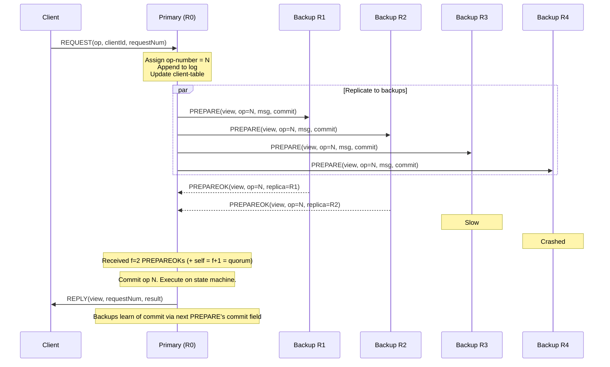
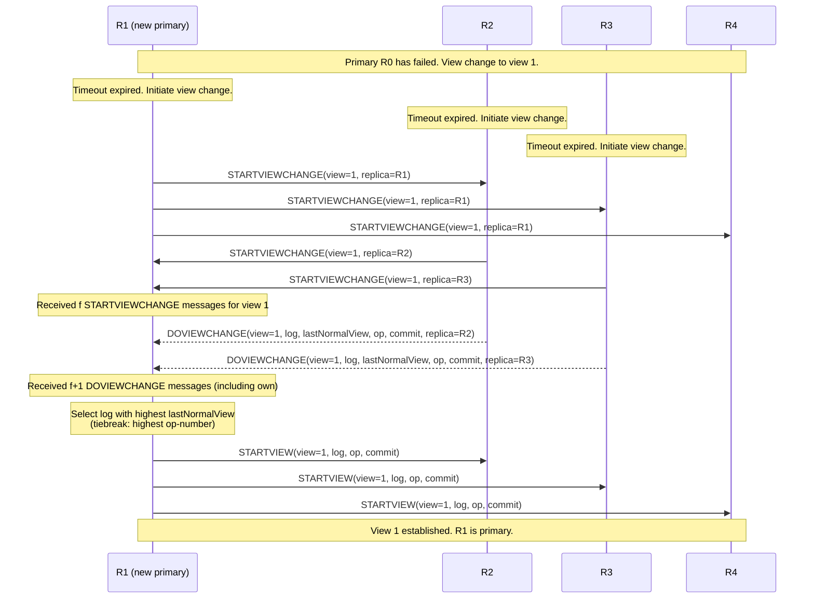
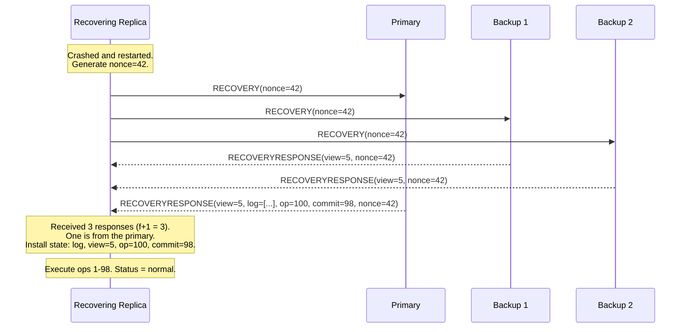

# Viewstamped Replication

Viewstamped Replication (VR) is a state machine replication protocol published by Brian Oki and Barbara Liskov in 1988 — six years before Lamport first circulated the Paxos paper, and twenty-six years before Raft. It is one of the earliest protocols to solve the state machine replication problem in a crash fault-tolerant way, and its ideas directly influenced the design of Raft.

VR is historically significant for three reasons. First, it predates Paxos and was developed independently. Second, it was the first protocol to clearly separate the normal-case replication protocol from the view change (leader election) protocol. Third, Ongaro and Ousterhout explicitly cite VR as a major influence on Raft's design, particularly its strong leader model and its approach to log management.

This page covers the Viewstamped Replication Revisited (VRR) paper by Liskov and Cowling (2012), which is a cleaned-up presentation of the original protocol. The original 1988 paper uses slightly different terminology and a more complex recovery mechanism, but the core ideas are the same.

## System Model

VR assumes:

- **Crash-stop failure model**: Nodes may crash and stop responding. They do not send incorrect messages (no Byzantine faults).
- **Asynchronous network**: Messages may be delayed, reordered, or dropped, but they are not corrupted. The protocol does not rely on timing for safety, only for liveness (failure detection).
- **$2f + 1$ replicas**: The system tolerates $f$ simultaneous crashes. A quorum is $f + 1$ replicas.
- **Deterministic state machine**: All replicas start in the same initial state and produce the same outputs when given the same inputs in the same order.

## Core Concepts

### Views

A **view** is a configuration of the system that specifies which replica is the primary (leader). Views are numbered sequentially: view 0, view 1, view 2, etc. The primary for a given view is determined by a simple formula:

$$\text{primary} = \text{view-number} \mod |\text{replicas}|$$

This means the primary rotates through the replicas in a fixed, deterministic order. There is no election campaign, no vote counting — the next primary is always known.

```
Replicas: {R0, R1, R2, R3, R4}

View 0: primary = R0
View 1: primary = R1
View 2: primary = R2
View 3: primary = R3
View 4: primary = R4
View 5: primary = R0  (wraps around)
```

A **view change** occurs when the primary is suspected of having failed. The remaining replicas transition to the next view, which has a new primary.

### Op-Number and Commit-Number

- **op-number**: A monotonically increasing counter assigned by the primary to each client request. This is analogous to Raft's log index.
- **commit-number**: The highest op-number that has been committed (replicated on a quorum and safe to execute). This is analogous to Raft's commitIndex.

### Replica State

Each replica maintains:

| Field | Description |
|---|---|
| `configuration` | Sorted list of all replica IP addresses |
| `replica-number` | This replica's index in the configuration |
| `view-number` | The current view number |
| `status` | One of: `normal`, `view-change`, `recovering` |
| `op-number` | The most recent op-number assigned by the primary |
| `log` | The ordered log of client requests |
| `commit-number` | The most recent committed op-number |
| `client-table` | Maps client IDs to their most recent request number and result |

## Normal Operation

During normal operation, the primary receives client requests, assigns op-numbers, and replicates them to backups. The protocol is remarkably simple.

### Client Request Protocol



Step by step:

1. **Client sends REQUEST**: `(op, clientId, requestNum)` to the primary. The `requestNum` increases monotonically per client and is used for deduplication.

2. **Primary processes the request**:
   - Check the `client-table`. If this `requestNum` has already been processed, return the cached result (idempotency).
   - Increment `op-number`.
   - Append the request to the `log`.
   - Update the `client-table` entry for this client.
   - Send `PREPARE(view-number, message, op-number, commit-number)` to all backups.

3. **Backups process PREPARE**:
   - If the view number matches, append the operation to the log.
   - If there are gaps (the op-number is higher than expected), the backup must request the missing operations from the primary before processing. VR does NOT skip gaps — all operations must be in order.
   - Update the commit-number to the value sent by the primary and execute any newly committed operations.
   - Respond with `PREPAREOK(view-number, op-number, replica-number)`.

4. **Primary commits**: When the primary receives `PREPAREOK` from $f$ backups (giving a total of $f + 1$ including itself), the operation is committed. The primary executes the operation on its state machine, updates `commit-number`, and sends the `REPLY` to the client.

5. **Backups learn of commits**: The next `PREPARE` message includes the primary's `commit-number`. Backups execute all operations up to this number. This piggybacks commit notifications on replication messages.

### Client Retries

If a client does not receive a reply within a timeout, it resends the request. It sends the request to all replicas (not just the primary) because the primary may have failed.

- If the request reaches the primary and has already been processed, the primary returns the cached result from the `client-table`.
- If the request reaches a backup, the backup forwards it to the primary.
- If no primary exists (view change in progress), the request is buffered until a new view is established.

## View Change Protocol

The view change protocol is VR's equivalent of leader election. It is triggered when a backup suspects the primary has failed (typically via a timeout on receiving PREPARE messages).

### View Change Steps



The protocol has three message types:

#### 1. STARTVIEWCHANGE

When a backup suspects the primary has failed, it increments its view number, sets its status to `view-change`, and sends `STARTVIEWCHANGE(view-number, replica-number)` to all other replicas.

A replica that receives a `STARTVIEWCHANGE` for a view higher than its own also transitions to `view-change` status and sends its own `STARTVIEWCHANGE`.

The new primary (determined by `view-number mod n`) waits for `STARTVIEWCHANGE` messages from $f$ other replicas (a quorum minus itself).

#### 2. DOVIEWCHANGE

Once the new primary has collected $f$ `STARTVIEWCHANGE` messages, it knows that enough replicas want to change views. Each replica sends a `DOVIEWCHANGE` message to the new primary containing:

- The replica's log
- The view number of the last view in which the replica's status was `normal` (`lastNormalView`)
- The replica's op-number
- The replica's commit-number

The new primary collects $f + 1$ `DOVIEWCHANGE` messages (including its own).

#### 3. STARTVIEW

The new primary selects the log from the `DOVIEWCHANGE` message with the highest `lastNormalView`. If there is a tie, it selects the one with the highest op-number. This ensures the new primary has the most up-to-date log.

The new primary then:
1. Sets its log to the selected log.
2. Sets its op-number to the latest op-number in the selected log.
3. Sets its view-number to the new view.
4. Sets its status to `normal`.
5. Executes all committed but unexecuted operations.
6. Sends `STARTVIEW(view-number, log, op-number, commit-number)` to all other replicas.

Backups that receive `STARTVIEW`:
1. Replace their log with the log in the message.
2. Update their view-number, op-number, and commit-number.
3. Set their status to `normal`.
4. Execute all committed but unexecuted operations.
5. Send `PREPAREOK` messages for any uncommitted operations in the log (to help the new primary commit them).

### Why the View Change Is Safe

The view change protocol is safe because:

1. **Quorum overlap**: The new primary collects `DOVIEWCHANGE` from $f + 1$ replicas. Any committed operation was replicated on at least $f + 1$ replicas. These two sets must overlap. Therefore, the new primary will see every committed operation in at least one `DOVIEWCHANGE` message.

2. **Highest lastNormalView wins**: By selecting the log from the replica with the highest `lastNormalView` (and highest op-number in case of tie), the new primary gets the most recent log. This log contains all committed operations and may contain some uncommitted operations (which is safe — they will either be committed or overwritten).

3. **Uncommitted operations are not lost**: If the old primary had partially replicated an operation (sent PREPARE but not yet committed), the operation may be in some replicas' logs. The view change will either include it (if it appears in the selected log) or discard it (if it does not). Either outcome is safe: the operation was never committed, so the client will retry.

## Recovery Protocol

When a crashed replica restarts, it cannot simply rejoin the protocol — its state is stale. VR uses a recovery protocol:

1. **The recovering replica sends RECOVERY** to all other replicas. The message includes a nonce (random number) to prevent replay of old recovery responses.

2. **Other replicas respond with RECOVERYRESPONSE**. The primary's response includes:
   - The view number
   - The complete log
   - The op-number
   - The commit-number
   - The nonce (to match the request)

   Backup responses include:
   - The view number
   - The nonce

3. **The recovering replica waits** for $f + 1$ `RECOVERYRESPONSE` messages, at least one of which is from the primary (identified by the presence of the log).

4. **The recovering replica installs the state** from the primary's response: log, view number, op-number, commit-number. It then sets its status to `normal`.



### Why a Nonce?

Without the nonce, an old `RECOVERYRESPONSE` from a previous recovery attempt could be replayed. The recovering replica might install stale state from a previous view. The nonce ensures that responses match the current recovery request.

### State Transfer Optimization

For replicas that have been down for a long time, sending the entire log is impractical. VR supports **state transfer**: instead of sending the log, the primary sends a snapshot of the application state plus recent log entries. This is analogous to Raft's InstallSnapshot RPC.

## Reconfiguration

VR supports reconfiguration — adding and removing replicas — through a special operation:

1. The administrator sends a `RECONFIGURATION` request to the primary with the new configuration (list of replicas).
2. The primary processes it like any other request: assigns an op-number, replicates to backups, commits.
3. Once committed, the new configuration takes effect. This happens at a specific op-number, so there is no ambiguity about which operations use which configuration.
4. Replicas not in the new configuration shut down after ensuring the new replicas are up to date.
5. New replicas must perform state transfer before participating.

The key insight is that reconfiguration is a logged operation. There is no separate mechanism for changing the configuration — it uses the same replication protocol as regular operations. This simplifies reasoning about correctness.

## Formal Description

For precision, here is the formal description of VR's normal-case protocol using preconditions and effects, following the style of Liskov and Cowling (2012).

### REQUEST Processing (at Primary)

```
Precondition:
  status = normal
  view-number = v (this replica is the primary for view v)
  request = ⟨op, clientId, requestNum⟩
  client-table[clientId].requestNum < requestNum

Effect:
  op-number := op-number + 1
  log[op-number] := request
  client-table[clientId] := ⟨requestNum, PENDING⟩
  Send PREPARE(v, request, op-number, commit-number) to all backups
```

### PREPARE Processing (at Backup)

```
Precondition:
  status = normal
  view-number = v (matches the PREPARE's view-number)
  op-number of PREPARE = this replica's op-number + 1
    (otherwise, request retransmission of missing ops)

Effect:
  op-number := PREPARE.op-number
  log[op-number] := PREPARE.request
  Update client-table from the request
  Send PREPAREOK(v, op-number, replica-number) to the primary
  For each op where commit-number < op-number ≤ PREPARE.commit-number:
    Execute op on state machine
    Update client-table with result
  commit-number := PREPARE.commit-number
```

### PREPAREOK Processing (at Primary)

```
Precondition:
  status = normal
  PREPAREOK.view-number = view-number
  Received PREPAREOK for op-number n from f distinct backups

Effect:
  commit-number := n
  For each op where old-commit < op ≤ n:
    result := Execute op on state machine
    client-table[op.clientId] := ⟨op.requestNum, result⟩
    Send REPLY(v, op.requestNum, result) to client
```

### STARTVIEWCHANGE Processing

```
Precondition:
  Received STARTVIEWCHANGE for view v' > view-number
  OR timeout expired and no PREPARE received from primary

Effect:
  view-number := v'
  status := view-change
  Send STARTVIEWCHANGE(v', replica-number) to all replicas
```

### DOVIEWCHANGE Processing (at New Primary)

```
Precondition:
  status = view-change
  view-number = v'
  This replica is the primary for view v'
  Received f+1 DOVIEWCHANGE messages for view v' (including own)

Effect:
  Select the log from the DOVIEWCHANGE with the highest lastNormalView
    (tiebreak: highest op-number)
  log := selected log
  op-number := highest op-number in the selected log
  commit-number := highest commit-number from all DOVIEWCHANGE messages
  view-number := v'
  status := normal
  For each op where old-commit < op ≤ commit-number:
    Execute op on state machine
  Send STARTVIEW(v', log, op-number, commit-number) to all replicas
```

## Comparison with Raft

Ongaro and Ousterhout explicitly acknowledge VR as a major influence on Raft. The two protocols share the same fundamental structure: a strong leader replicates a log to followers, and a view/term change mechanism handles leader failures. But there are meaningful differences.

| Aspect | VR | Raft |
|---|---|---|
| **Year** | 1988 | 2014 |
| **Primary selection** | Deterministic (round-robin by view number) | Randomized election (any candidate can win) |
| **Log transfer during leader change** | New primary receives full logs from quorum in DOVIEWCHANGE | New leader already has complete log (guaranteed by election restriction) |
| **Election restriction** | None — new primary picks the best log from DOVIEWCHANGE responses | Voters reject candidates with stale logs |
| **How leader gets complete log** | By collecting logs from a quorum during view change | By only electing leaders that already have all committed entries |
| **Commit rule** | Any operation can be committed at any time | Only current-term entries can be directly committed |
| **View/Term advancement** | View increments by 1, primary is view mod n | Term increments by 1, any server can be candidate |
| **Recovery** | Explicit RECOVERY protocol with nonce | Persistent state + log replay on restart |
| **Reconfiguration** | Logged operation | Joint consensus or single-server changes |

### The Fundamental Design Difference

VR and Raft solve the same problem but make different choices about where to put the complexity:

**VR**: Any replica can become the primary. During the view change, the new primary collects logs from a quorum and selects the most up-to-date one. The complexity is in the view change protocol, which must correctly merge logs and determine the authoritative history.

**Raft**: The election restriction ensures that only replicas with complete logs can become leader. This moves the complexity to the election protocol (voters must compare logs) but simplifies everything else — the leader never needs to adopt another replica's log.

Raft's approach is arguably easier to understand because the leader's log is always authoritative. In VR, the new primary must construct the authoritative log from the DOVIEWCHANGE messages, which requires careful reasoning about which log to select and how to handle partially committed operations.

### What Raft Borrowed from VR

1. **Strong leader model**: Both protocols route all client requests through the leader/primary.
2. **Sequential log with no gaps**: Both protocols require the log to be a contiguous sequence with no holes.
3. **Commit via quorum replication**: Both protocols commit an entry when it has been replicated on a majority.
4. **Commit notification piggybacked on replication messages**: Both protocols inform followers/backups about the commit index via the next replication message, rather than sending a separate commit message.
5. **Client deduplication via client table**: Both protocols track the latest request from each client to prevent duplicate execution.

### What Raft Changed

1. **Randomized elections** instead of deterministic primary rotation. This makes Raft's leader election simpler (no need for the STARTVIEWCHANGE/DOVIEWCHANGE dance) but introduces the possibility of split votes.
2. **Election restriction** instead of log transfer during leader change. This is Raft's key simplification — the leader always has the authoritative log.
3. **Term (not view)**: Raft uses terms instead of views. The terminology is different but the concept is identical: a monotonically increasing logical clock that partitions time into leadership periods.
4. **Persistent state**: Raft explicitly specifies which state must be persisted (currentTerm, votedFor, log). VR's original paper was less precise about persistence requirements.

## Why VR Matters Historically

VR is often overshadowed by Paxos and Raft in modern discussions, but its historical importance is considerable.

1. **Independent invention**: VR was developed independently of Paxos. Oki and Liskov were not aware of Lamport's work when they published in 1988. This demonstrates that the strong-leader approach to consensus is a natural design point.

2. **First clear separation of normal operation and view change**: VR cleanly separates the common case (normal replication) from the failure case (view change). This decomposition is used by every subsequent protocol, including Raft.

3. **Practical orientation**: Unlike Paxos, which was presented as an abstract protocol, VR was designed as a complete system from the start. It includes client interaction, deduplication, recovery, and reconfiguration — all the pieces needed for a real implementation.

4. **Influence on Raft**: Without VR's demonstration that a strong-leader protocol could be simple and practical, Raft might not have been designed the way it was. Ongaro's dissertation explicitly discusses VR and credits it as an inspiration.

5. **Influence on PBFT**: Castro and Liskov's PBFT protocol (1999) extends VR's ideas to the Byzantine fault model. The view change mechanism in PBFT is a direct descendant of VR's view change protocol, adapted for Byzantine adversaries.

## VR in Practice

VR has seen limited direct deployment compared to Paxos and Raft, primarily because:

1. The original 1988 paper predated the open-source movement. By the time open-source distributed systems became common, Paxos had become the standard reference.
2. Lamport's extensive writing and advocacy for Paxos established it as the "canonical" consensus protocol.
3. Raft was explicitly designed for implementation and came with reference implementations, which VR lacked.

However, VR's ideas are embedded in many systems that do not credit it explicitly:

- **Primary-backup replication** in databases (PostgreSQL streaming replication, MySQL semi-synchronous replication) uses the same basic structure as VR's normal operation.
- **View change mechanisms** in PBFT and its descendants (HotStuff, Tendermint) are direct descendants of VR's view change.
- **Leader-based consensus** in general owes a debt to VR's demonstration that a strong leader simplifies the protocol.

## Optimizations

### Witnesses

The VRR paper introduces **witnesses** — replicas that participate in voting but do not maintain the full log or state machine. Witnesses are cheaper to run (less storage, less I/O) and can be used to increase the quorum size without proportionally increasing resource costs.

A witness:
- Participates in view changes (sends STARTVIEWCHANGE and DOVIEWCHANGE).
- Accepts PREPARE messages and responds with PREPAREOK.
- Does NOT execute operations on a state machine.
- Does NOT store the full log (only keeps enough to participate in view changes).

This is similar to Raft's "learner" replicas in TiKV, though with different trade-offs.

### Batching

Like Raft, VR can batch multiple client requests into a single PREPARE message. The primary accumulates requests over a short time window and sends them all in one message. This amortizes the cost of network round trips and disk I/O.

### Pipelining

The primary can send multiple PREPARE messages without waiting for PREPAREOK from previous ones. This overlaps network latency across multiple operations and significantly improves throughput under load.

## References

1. Oki, B. M., & Liskov, B. H. (1988). "Viewstamped Replication: A New Primary Copy Method to Support Highly-Available Distributed Systems." *PODC*.
2. Liskov, B., & Cowling, J. (2012). "Viewstamped Replication Revisited." *MIT Technical Report MIT-CSAIL-TR-2012-021*.
3. Ongaro, D. (2014). "Consensus: Bridging Theory and Practice." PhD dissertation, Stanford University.
4. Castro, M., & Liskov, B. (1999). "Practical Byzantine Fault Tolerance." *OSDI*.
5. Schneider, F. B. (1990). "Implementing Fault-Tolerant Services Using the State Machine Approach: A Tutorial." *ACM Computing Surveys*.
