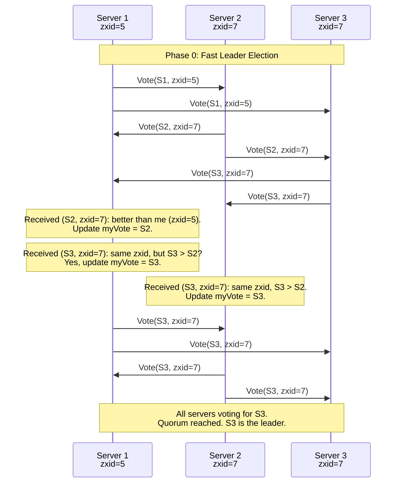
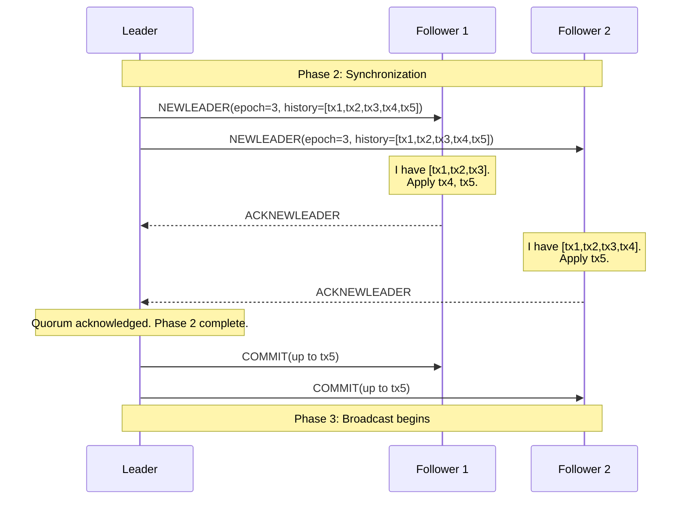
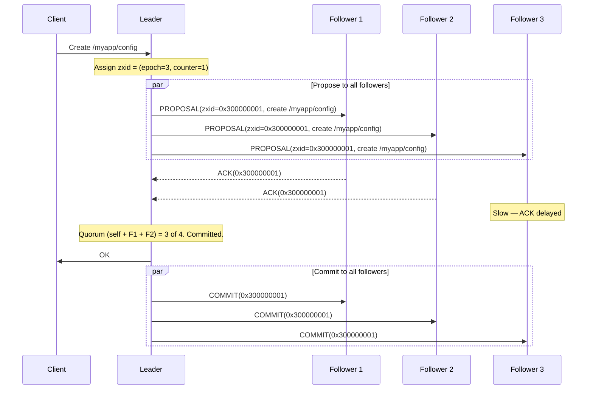

# ZAB: ZooKeeper Atomic Broadcast Protocol

ZAB (ZooKeeper Atomic Broadcast) is the protocol that powers Apache ZooKeeper, one of the most widely deployed coordination services in the world. Kafka, HBase, Hadoop, Solr, and hundreds of other systems use ZooKeeper for leader election, configuration management, distributed locking, and service discovery.

ZAB is not Paxos. This is a common misconception. ZAB was designed specifically for ZooKeeper's primary-backup architecture and provides guarantees that Paxos does not: in particular, ZAB guarantees that all state changes from a given leader are delivered in order, and that all state changes from previous leaders are delivered before any state changes from the current leader. These ordering guarantees are what make ZooKeeper's API possible.

## Why ZAB Is Not Paxos

Paxos is a consensus protocol: it agrees on individual values. ZAB is an atomic broadcast protocol: it delivers a sequence of messages in total order. While consensus and atomic broadcast are theoretically equivalent (you can build one from the other), the practical protocols are quite different.

Key differences:

| Property | Paxos | ZAB |
|---|---|---|
| **Unit of agreement** | Single value | Sequence of transactions |
| **Ordering** | Per-slot only | Total order across all transactions |
| **Leader's history** | May have gaps | Must have complete prefix |
| **Recovery** | Fill gaps independently | Synchronize complete prefix from leader |
| **Primary use** | Generic consensus | State machine replication with FIFO guarantees |

ZAB guarantees two properties that Paxos does not:

1. **FIFO order**: If a leader broadcasts transaction $a$ before transaction $b$, then all servers that deliver both will deliver $a$ before $b$.
2. **Causal order (across leaders)**: If leader $L_1$ broadcasts transaction $a$, then $L_1$ crashes, and leader $L_2$ broadcasts transaction $b$ after learning about $a$, then all servers that deliver both will deliver $a$ before $b$.

These properties are essential for ZooKeeper because clients rely on the order of operations. A client that creates a znode and then reads it must see the znode, even if the leader changes between the two operations.

## ZAB Protocol Phases

ZAB operates in four phases, executed sequentially. When a leader fails, the protocol restarts from Phase 0.

### Phase 0: Leader Election (Fast Leader Election)

ZooKeeper uses a custom election algorithm called Fast Leader Election (FLE). Unlike Raft's randomized timeout approach, FLE is a deterministic algorithm that converges on a leader in O(n) messages.

Each server maintains:
- **myVote**: the server this node currently believes should be the leader
- **myZxid**: the highest transaction ID (zxid) in this server's log

The algorithm:

1. Each server starts by voting for itself: `myVote = self`.
2. Each server broadcasts its vote `(myVote, myZxid)` to all other servers.
3. When a server receives a vote from another server, it compares:
   - If the received vote has a higher zxid, or the same zxid but a higher server ID, the server updates its vote to match and rebroadcasts.
   - Otherwise, the server keeps its current vote.
4. A server declares the election complete when it has received matching votes from a quorum of servers.



The tiebreaker (higher server ID wins when zxids are equal) ensures deterministic convergence. The "highest zxid" criterion ensures the elected leader has the most complete transaction history, which is critical for Phase 1.

### Phase 1: Discovery

In the Discovery phase, the newly elected leader learns the highest zxid among all followers in its quorum. This ensures the leader's history is at least as complete as any server in the quorum.

1. The leader sends a `FOLLOWERINFO` message to all prospective followers.
2. Each follower responds with a `LEADERINFO` message containing its highest zxid and the epoch number of the last leader it followed.
3. The leader waits for responses from a quorum.
4. The leader selects the highest epoch number from the responses, increments it by 1, and proposes this as the new epoch in a `NEWEPOCH` message.
5. Followers acknowledge the new epoch with `ACKEPOCH`.
6. The leader waits for acknowledgments from a quorum.

The epoch number serves the same purpose as Raft's term: it is a logical clock that increases with each leadership change and prevents stale leaders from making progress.

```
Discovery:
  Leader → Followers: FOLLOWERINFO(leaderZxid)
  Followers → Leader: LEADERINFO(followerZxid, followerEpoch)
  Leader selects: newEpoch = max(all epochs) + 1
  Leader → Followers: NEWEPOCH(newEpoch)
  Followers → Leader: ACKEPOCH(newEpoch, history)
```

### Phase 2: Synchronization

In the Synchronization phase, the leader brings all followers up to date before accepting new transactions. This is the key difference from Paxos: ZAB ensures a complete prefix synchronization before the leader starts broadcasting.

1. The leader determines the authoritative transaction history. It selects the history from the follower with the highest zxid (which, by the election criterion, should be the leader itself or the follower with the most complete history).
2. The leader sends a `NEWLEADER` message containing the full transaction history that followers need.
3. Followers apply the missing transactions to their local state and respond with `ACKNEWLEADER`.
4. The leader waits for acknowledgments from a quorum.
5. Once a quorum has synchronized, the leader sends a `COMMIT` for all synchronized transactions.



Three types of synchronization may be needed:

- **DIFF**: The follower is slightly behind. The leader sends only the missing transactions.
- **TRUNC**: The follower has transactions that the leader does not (from a previous leader that did not commit them). The follower truncates its log.
- **SNAP**: The follower is so far behind that individual transactions would be inefficient. The leader sends a full snapshot.

### Phase 3: Broadcast

Once synchronization is complete, the leader enters the Broadcast phase and begins accepting new client requests. This is ZAB's steady-state operation.

The broadcast protocol is a simplified two-phase commit:

1. The leader receives a client write request.
2. The leader assigns a new zxid (composed of the epoch number and a counter: `epoch << 32 | counter`).
3. The leader sends a `PROPOSAL` containing the transaction to all followers.
4. Each follower writes the transaction to its transaction log (on disk) and responds with an `ACK`.
5. The leader waits for ACKs from a quorum.
6. The leader sends a `COMMIT` to all followers.
7. Followers apply the committed transaction to their in-memory data tree.



Key properties of the broadcast:

- **FIFO ordering**: The leader sends proposals in zxid order. TCP guarantees FIFO delivery between any two nodes. Therefore, followers receive and process proposals in zxid order.
- **No gaps**: Unlike Multi-Paxos, ZAB does not allow gaps in the transaction log. Every follower processes transactions in strict sequential order.
- **Quorum acknowledgment**: A transaction is committed when the leader and a quorum of followers have written it to persistent storage.

## ZooKeeper Architecture

ZAB is the replication layer. Above it sits ZooKeeper's data model and API.

### The Data Model: Znodes

ZooKeeper maintains a hierarchical namespace (similar to a filesystem) of data nodes called **znodes**. Each znode can store up to 1 MB of data and can have children.

```
/
├── /myapp
│   ├── /myapp/config          data: "db_host=10.0.0.1"
│   ├── /myapp/leader          data: "server-3" (ephemeral)
│   └── /myapp/workers
│       ├── /myapp/workers/w-0000000001  (ephemeral, sequential)
│       ├── /myapp/workers/w-0000000002  (ephemeral, sequential)
│       └── /myapp/workers/w-0000000003  (ephemeral, sequential)
└── /locks
    └── /locks/my-lock
        ├── /locks/my-lock/lock-0000000001  (ephemeral, sequential)
        └── /locks/my-lock/lock-0000000002  (ephemeral, sequential)
```

### Znode Types

**Persistent znodes**: Survive server restarts and session disconnects. Created with `create /path data`. Must be explicitly deleted.

**Ephemeral znodes**: Automatically deleted when the session that created them ends (client disconnects or session times out). Cannot have children. Used for leader election and group membership.

**Sequential znodes**: Have a monotonically increasing counter appended to their name. Created with `create -s /path/prefix- data`, resulting in `/path/prefix-0000000001`. Used for distributed locks and queues.

**Container znodes** (ZK 3.6+): Automatically deleted when their last child is deleted. Used for recipes that create child znodes.

**TTL znodes** (ZK 3.6+): Automatically deleted after a configured time-to-live if they have no children.

### Watches

ZooKeeper's watch mechanism enables reactive programming. A client can set a watch on a znode, and ZooKeeper will send a notification when the znode changes.

Watches are:
- **One-time triggers**: After a watch fires, it must be re-registered.
- **Ordered**: Watch notifications are delivered in the order of the transactions that triggered them.
- **Session-scoped**: When a session ends, its watches are removed.

Watch types:
- `getData(path, watch)`: Fires when the data of the znode changes.
- `getChildren(path, watch)`: Fires when the children of the znode change.
- `exists(path, watch)`: Fires when the znode is created or deleted.

### Sessions

Each client maintains a session with the ZooKeeper ensemble. Sessions have:
- A unique session ID (64-bit).
- A session timeout (negotiated at connection time).
- An ordered list of pending requests.

If the client does not communicate with the server within the session timeout, the session expires. All ephemeral znodes created by the session are deleted, and all watches are removed.

Sessions can survive server failures: if the client's current server fails, the client reconnects to another server in the ensemble. The new server recognizes the session ID and continues serving the client.

## ZooKeeper Use Cases

### Distributed Locking

The standard ZooKeeper recipe for a distributed lock uses sequential ephemeral znodes:

```
To acquire lock /locks/my-lock:

1. Create sequential ephemeral znode: /locks/my-lock/lock-0000000001
2. Get children of /locks/my-lock: [lock-0000000001, lock-0000000002, ...]
3. If my znode has the LOWEST sequence number, I hold the lock. Done.
4. If not, set a watch on the znode with the next-lowest sequence number.
5. When the watch fires (that znode was deleted), go to step 2.

To release lock:
  Delete my znode. The next waiter's watch fires.

Crash recovery:
  If I crash, my ephemeral znode is automatically deleted.
  The next waiter's watch fires. No deadlock.
```

This is the "herd effect-free" lock recipe. Each waiter watches only the znode immediately before it, not all znodes. This prevents a thundering herd when the lock is released.

### Leader Election

```
To participate in leader election for /election:

1. Create sequential ephemeral znode: /election/candidate-0000000001
2. Get children of /election: [candidate-0000000001, candidate-0000000002, ...]
3. If my znode has the LOWEST sequence number, I am the leader.
4. If not, set a watch on the znode with the next-lowest sequence number.
5. When the watch fires, go to step 2.

If the leader crashes:
  Its ephemeral znode is deleted.
  The next candidate's watch fires.
  That candidate checks if it now has the lowest number. If so, it becomes leader.
```

### Configuration Management

```
Store configuration in a persistent znode:
  create /config/database "host=10.0.0.1,port=5432"

All application servers watch the znode:
  getData /config/database (with watch)

When an administrator updates the configuration:
  setData /config/database "host=10.0.0.2,port=5432"

All watchers are notified. They re-read the new data and re-register the watch.
```

### Service Discovery

```
Services register themselves by creating ephemeral znodes:
  Service A: create -e /services/payment/instance-A "host=10.0.0.1:8080"
  Service B: create -e /services/payment/instance-B "host=10.0.0.2:8080"

Clients discover services by listing children:
  getChildren /services/payment → [instance-A, instance-B]

Clients set a watch to detect changes:
  getChildren /services/payment (with watch)

If Service A crashes:
  Its ephemeral znode is deleted.
  Clients' watches fire.
  Clients re-read children: [instance-B]
  Clients stop sending traffic to Service A.
```

## TypeScript Simulation of ZAB Message Flow

The following simulation implements the core ZAB broadcast protocol and demonstrates the message flow between a leader and followers.

```typescript
// zab-simulation.ts — ZAB Atomic Broadcast simulation

// --- Types ---

type ServerId = number;

interface Zxid {
  epoch: number;
  counter: number;
}

interface Transaction {
  zxid: Zxid;
  type: "CREATE" | "SET" | "DELETE";
  path: string;
  data: string | null;
}

interface Proposal {
  transaction: Transaction;
}

interface Ack {
  zxid: Zxid;
  serverId: ServerId;
}

interface Commit {
  zxid: Zxid;
}

type ZabMessage =
  | { type: "PROPOSAL"; proposal: Proposal }
  | { type: "ACK"; ack: Ack }
  | { type: "COMMIT"; commit: Commit }
  | { type: "FOLLOWERINFO"; serverId: ServerId; lastZxid: Zxid }
  | { type: "NEWEPOCH"; epoch: number }
  | { type: "ACKEPOCH"; serverId: ServerId }
  | { type: "NEWLEADER"; epoch: number; history: Transaction[] }
  | { type: "ACKNEWLEADER"; serverId: ServerId }
  | { type: "UPTODATE" };

// --- Zxid utilities ---

function zxidToString(zxid: Zxid): string {
  return `${zxid.epoch}:${zxid.counter}`;
}

function zxidCompare(a: Zxid, b: Zxid): number {
  if (a.epoch !== b.epoch) return a.epoch - b.epoch;
  return a.counter - b.counter;
}

function zxidEquals(a: Zxid, b: Zxid): boolean {
  return a.epoch === b.epoch && a.counter === b.counter;
}

// --- In-memory Data Tree ---

interface ZNode {
  path: string;
  data: string | null;
  version: number;
  children: Set<string>;
  ephemeral: boolean;
  createdZxid: Zxid;
  modifiedZxid: Zxid;
}

class DataTree {
  private nodes: Map<string, ZNode> = new Map();

  constructor() {
    // Root node always exists
    this.nodes.set("/", {
      path: "/",
      data: null,
      version: 0,
      children: new Set(),
      ephemeral: false,
      createdZxid: { epoch: 0, counter: 0 },
      modifiedZxid: { epoch: 0, counter: 0 },
    });
  }

  applyTransaction(tx: Transaction): string {
    switch (tx.type) {
      case "CREATE":
        return this.createNode(tx.path, tx.data, tx.zxid);
      case "SET":
        return this.setData(tx.path, tx.data, tx.zxid);
      case "DELETE":
        return this.deleteNode(tx.path);
    }
  }

  private createNode(path: string, data: string | null, zxid: Zxid): string {
    if (this.nodes.has(path)) {
      return `ERROR: Node ${path} already exists`;
    }
    const parentPath = path.substring(0, path.lastIndexOf("/")) || "/";
    const parent = this.nodes.get(parentPath);
    if (!parent) {
      return `ERROR: Parent ${parentPath} does not exist`;
    }

    this.nodes.set(path, {
      path,
      data,
      version: 0,
      children: new Set(),
      ephemeral: false,
      createdZxid: zxid,
      modifiedZxid: zxid,
    });

    const childName = path.substring(path.lastIndexOf("/") + 1);
    parent.children.add(childName);

    return `CREATED ${path}`;
  }

  private setData(path: string, data: string | null, zxid: Zxid): string {
    const node = this.nodes.get(path);
    if (!node) {
      return `ERROR: Node ${path} does not exist`;
    }
    node.data = data;
    node.version += 1;
    node.modifiedZxid = zxid;
    return `SET ${path} version=${node.version}`;
  }

  private deleteNode(path: string): string {
    const node = this.nodes.get(path);
    if (!node) {
      return `ERROR: Node ${path} does not exist`;
    }
    if (node.children.size > 0) {
      return `ERROR: Node ${path} has children`;
    }

    this.nodes.delete(path);

    const parentPath = path.substring(0, path.lastIndexOf("/")) || "/";
    const parent = this.nodes.get(parentPath);
    if (parent) {
      const childName = path.substring(path.lastIndexOf("/") + 1);
      parent.children.delete(childName);
    }

    return `DELETED ${path}`;
  }

  getData(path: string): string | null {
    return this.nodes.get(path)?.data ?? null;
  }

  getChildren(path: string): string[] {
    const node = this.nodes.get(path);
    return node ? Array.from(node.children).sort() : [];
  }

  dump(): Map<string, string | null> {
    const result = new Map<string, string | null>();
    for (const [path, node] of this.nodes) {
      result.set(path, node.data);
    }
    return result;
  }
}

// --- ZAB Follower ---

class ZabFollower {
  readonly id: ServerId;
  private epoch: number = 0;
  private transactionLog: Transaction[] = [];
  private dataTree: DataTree = new DataTree();
  private messageLog: string[] = [];

  constructor(id: ServerId, initialTransactions: Transaction[] = []) {
    this.id = id;
    for (const tx of initialTransactions) {
      this.transactionLog.push(tx);
      this.dataTree.applyTransaction(tx);
      if (tx.zxid.epoch > this.epoch) this.epoch = tx.zxid.epoch;
    }
  }

  get lastZxid(): Zxid {
    if (this.transactionLog.length === 0) {
      return { epoch: 0, counter: 0 };
    }
    return this.transactionLog[this.transactionLog.length - 1].zxid;
  }

  handleNewEpoch(newEpoch: number): ZabMessage {
    this.log(`Accepting new epoch ${newEpoch} (was ${this.epoch})`);
    this.epoch = newEpoch;
    return { type: "ACKEPOCH", serverId: this.id };
  }

  handleNewLeader(epoch: number, history: Transaction[]): ZabMessage {
    this.log(`Synchronizing. Received ${history.length} transactions from leader.`);

    // Apply missing transactions
    const myLastZxid = this.lastZxid;
    for (const tx of history) {
      if (zxidCompare(tx.zxid, myLastZxid) > 0) {
        this.transactionLog.push(tx);
        const result = this.dataTree.applyTransaction(tx);
        this.log(`  Applied ${tx.type} ${tx.path} (zxid=${zxidToString(tx.zxid)}): ${result}`);
      }
    }

    return { type: "ACKNEWLEADER", serverId: this.id };
  }

  handleProposal(proposal: Proposal): ZabMessage {
    const tx = proposal.transaction;
    this.transactionLog.push(tx);
    this.log(`Received PROPOSAL zxid=${zxidToString(tx.zxid)}: ${tx.type} ${tx.path}`);

    // Write to transaction log (in a real system, this would be an fsync)
    return { type: "ACK", ack: { zxid: tx.zxid, serverId: this.id } };
  }

  handleCommit(commit: Commit): void {
    const tx = this.transactionLog.find((t) => zxidEquals(t.zxid, commit.zxid));
    if (tx) {
      const result = this.dataTree.applyTransaction(tx);
      this.log(`COMMIT zxid=${zxidToString(commit.zxid)}: ${result}`);
    }
  }

  getMessageLog(): string[] {
    return [...this.messageLog];
  }

  private log(msg: string): void {
    this.messageLog.push(`[Follower ${this.id}] ${msg}`);
  }
}

// --- ZAB Leader ---

class ZabLeader {
  readonly id: ServerId;
  private epoch: number;
  private counter: number = 0;
  private transactionLog: Transaction[] = [];
  private dataTree: DataTree = new DataTree();
  private followers: ZabFollower[] = [];
  private pendingAcks: Map<string, Set<ServerId>> = new Map();
  private quorumSize: number;
  private messageLog: string[] = [];

  constructor(id: ServerId, epoch: number, history: Transaction[] = []) {
    this.id = id;
    this.epoch = epoch;
    for (const tx of history) {
      this.transactionLog.push(tx);
      this.dataTree.applyTransaction(tx);
      if (tx.zxid.counter > this.counter) {
        this.counter = tx.zxid.counter;
      }
    }
    this.quorumSize = 1; // will be updated when followers are added
  }

  // --- Phase 1: Discovery & Phase 2: Synchronization ---

  addFollower(follower: ZabFollower): void {
    this.followers.push(follower);
    this.quorumSize = Math.floor((this.followers.length + 1) / 2) + 1;
    this.log(`Follower ${follower.id} joined. Quorum size: ${this.quorumSize}`);
  }

  runDiscoveryAndSync(): void {
    this.log(`=== Phase 1: Discovery (epoch ${this.epoch}) ===`);

    // Send NEWEPOCH to all followers
    for (const follower of this.followers) {
      follower.handleNewEpoch(this.epoch);
    }

    this.log(`=== Phase 2: Synchronization ===`);
    this.log(`Sending history (${this.transactionLog.length} transactions) to followers`);

    // Send NEWLEADER with full history
    for (const follower of this.followers) {
      follower.handleNewLeader(this.epoch, this.transactionLog);
    }

    this.log(`All followers synchronized. Entering broadcast phase.`);
    this.log(`=== Phase 3: Broadcast ===`);
  }

  // --- Phase 3: Broadcast ---

  propose(type: "CREATE" | "SET" | "DELETE", path: string, data: string | null): Transaction {
    this.counter += 1;
    const zxid: Zxid = { epoch: this.epoch, counter: this.counter };

    const transaction: Transaction = { zxid, type, path, data };
    this.transactionLog.push(transaction);

    this.log(`PROPOSE zxid=${zxidToString(zxid)}: ${type} ${path}`);

    // Track acks (leader counts as one ack)
    const key = zxidToString(zxid);
    this.pendingAcks.set(key, new Set([this.id]));

    // Send PROPOSAL to all followers
    const acks: Ack[] = [];
    for (const follower of this.followers) {
      const response = follower.handleProposal({ transaction });
      if (response.type === "ACK") {
        acks.push(response.ack);
      }
    }

    // Process acks
    for (const ack of acks) {
      this.handleAck(ack);
    }

    return transaction;
  }

  private handleAck(ack: Ack): void {
    const key = zxidToString(ack.zxid);
    const ackSet = this.pendingAcks.get(key);
    if (!ackSet) return;

    ackSet.add(ack.serverId);
    this.log(`ACK from server ${ack.serverId} for zxid=${key} (${ackSet.size}/${this.quorumSize} needed)`);

    if (ackSet.size >= this.quorumSize) {
      this.commit(ack.zxid);
      this.pendingAcks.delete(key);
    }
  }

  private commit(zxid: Zxid): void {
    this.log(`COMMIT zxid=${zxidToString(zxid)} (quorum reached)`);

    // Apply to leader's data tree
    const tx = this.transactionLog.find((t) => zxidEquals(t.zxid, zxid));
    if (tx) {
      const result = this.dataTree.applyTransaction(tx);
      this.log(`  Leader applied: ${result}`);
    }

    // Send COMMIT to all followers
    for (const follower of this.followers) {
      follower.handleCommit({ zxid });
    }
  }

  getMessageLog(): string[] {
    return [...this.messageLog];
  }

  getAllLogs(): string[] {
    const logs = [...this.messageLog];
    for (const follower of this.followers) {
      logs.push(...follower.getMessageLog());
    }
    return logs;
  }

  getDataTree(): Map<string, string | null> {
    return this.dataTree.dump();
  }

  private log(msg: string): void {
    this.messageLog.push(`[Leader ${this.id}] ${msg}`);
  }
}

// --- Simulation ---

function runSimulation(): void {
  console.log("=== ZAB Protocol Simulation ===\n");

  // Existing transaction history (from previous epoch)
  const history: Transaction[] = [
    { zxid: { epoch: 1, counter: 1 }, type: "CREATE", path: "/app", data: null },
    { zxid: { epoch: 1, counter: 2 }, type: "CREATE", path: "/app/config", data: "v1" },
  ];

  // Create leader with epoch 2 and full history
  const leader = new ZabLeader(1, 2, history);

  // Create followers with partial history
  const follower1 = new ZabFollower(2, history);       // up to date
  const follower2 = new ZabFollower(3, [history[0]]);   // missing tx2

  leader.addFollower(follower1);
  leader.addFollower(follower2);

  // Run discovery and synchronization
  leader.runDiscoveryAndSync();

  // Broadcast new transactions
  console.log("\n--- Client requests ---\n");

  leader.propose("SET", "/app/config", "v2");
  leader.propose("CREATE", "/app/workers", null);
  leader.propose("CREATE", "/app/workers/w-0001", "host=10.0.0.1");

  // Print all logs
  console.log("\n--- Complete message log ---\n");
  for (const line of leader.getAllLogs()) {
    console.log(line);
  }

  // Print final data tree
  console.log("\n--- Final data tree (leader) ---\n");
  for (const [path, data] of leader.getDataTree()) {
    console.log(`  ${path}: ${data ?? "(no data)"}`);
  }
}

runSimulation();
```

### Simulation Output

```
=== ZAB Protocol Simulation ===

--- Client requests ---

--- Complete message log ---

[Leader 1] Follower 2 joined. Quorum size: 2
[Leader 1] Follower 3 joined. Quorum size: 2
[Leader 1] === Phase 1: Discovery (epoch 2) ===
[Follower 2] Accepting new epoch 2 (was 1)
[Follower 3] Accepting new epoch 2 (was 1)
[Leader 1] === Phase 2: Synchronization ===
[Leader 1] Sending history (2 transactions) to followers
[Follower 2] Synchronizing. Received 2 transactions from leader.
[Follower 3] Synchronizing. Received 2 transactions from leader.
[Follower 3]   Applied CREATE /app/config (zxid=1:2): CREATED /app/config
[Leader 1] All followers synchronized. Entering broadcast phase.
[Leader 1] === Phase 3: Broadcast ===
[Leader 1] PROPOSE zxid=2:1: SET /app/config
[Follower 2] Received PROPOSAL zxid=2:1: SET /app/config
[Follower 3] Received PROPOSAL zxid=2:1: SET /app/config
[Leader 1] ACK from server 2 for zxid=2:1 (2/2 needed)
[Leader 1] COMMIT zxid=2:1 (quorum reached)
[Leader 1]   Leader applied: SET /app/config version=1
[Follower 2] COMMIT zxid=2:1: SET /app/config version=1
[Follower 3] COMMIT zxid=2:1: SET /app/config version=1
[Leader 1] PROPOSE zxid=2:2: CREATE /app/workers
...

--- Final data tree (leader) ---

  /: (no data)
  /app: (no data)
  /app/config: v2
  /app/workers: (no data)
  /app/workers/w-0001: host=10.0.0.1
```

## ZAB vs. Raft

| Aspect | ZAB | Raft |
|---|---|---|
| **Election criterion** | Highest zxid + highest server ID | Most up-to-date log |
| **Synchronization** | Explicit sync phase before broadcast | Leader catches up followers during normal operation |
| **Log gaps** | Not allowed | Not allowed |
| **Epoch/Term** | Epoch embedded in zxid | Term stored separately |
| **Commit rule** | Quorum ACK on proposal | Majority replication + current term |
| **Snapshotting** | Fuzzy snapshots (concurrent with operation) | InstallSnapshot RPC |
| **Read semantics** | Reads go through leader (sync) or local (stale) | Linearizable reads require special handling |
| **Design goal** | High-throughput atomic broadcast | Understandability |

## ZAB Performance Characteristics

ZAB's performance is dominated by two factors:

1. **Disk fsync latency**: Every proposal must be written to the transaction log on disk before sending an ACK. The leader must also fsync. With SSDs, this is typically 0.1-1ms. With HDDs, 5-15ms.

2. **Network round-trip latency**: The leader must wait for a quorum of ACKs before committing. In a single data center with 5 nodes, this is typically 0.1-0.5ms.

ZooKeeper's throughput is typically 10,000-100,000 operations per second for writes and 100,000-1,000,000 operations per second for reads (served by followers without going through the leader).

## References

1. Junqueira, F. P., Reed, B. C., & Serafini, M. (2011). "Zab: High-performance broadcast for primary-backup systems." *IEEE DSN*.
2. Hunt, P., Konar, M., Junqueira, F. P., & Reed, B. (2010). "ZooKeeper: Wait-free coordination for Internet-scale systems." *USENIX ATC*.
3. Medeiros, A. (2012). "ZooKeeper's Atomic Broadcast Protocol: Theory and Practice." Technical Report.
4. Reed, B., & Junqueira, F. P. (2008). "A simple totally ordered broadcast protocol." *Workshop on Large-Scale Distributed Systems and Middleware*.
5. Apache ZooKeeper documentation: https://zookeeper.apache.org/doc/current/
