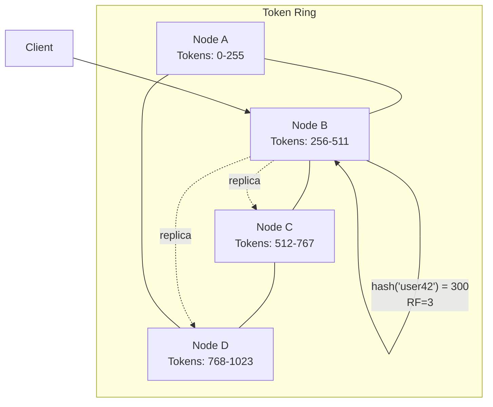
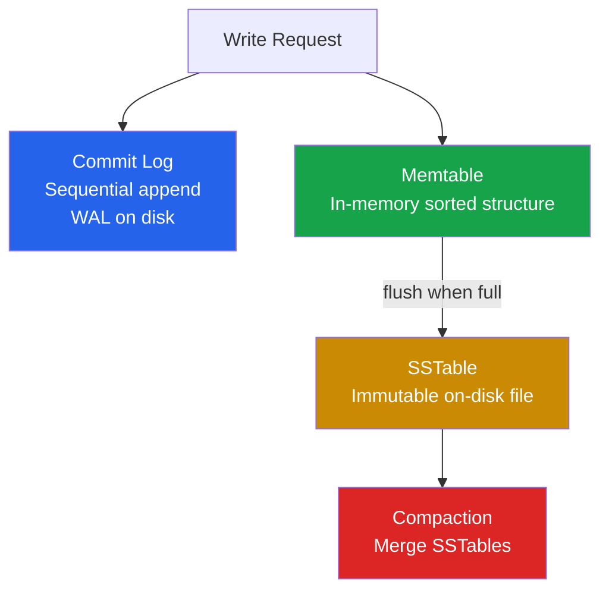
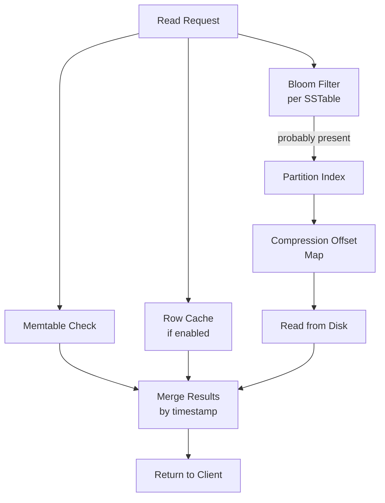

# Cassandra Internals

Apache Cassandra is a distributed wide-column store designed for write-heavy workloads that require linear horizontal scalability and high availability with no single point of failure. It was originally built at Facebook for inbox search, open-sourced in 2008, and is now used by Apple (hundreds of thousands of nodes), Netflix, Discord, and Instagram for workloads ranging from messaging to time-series telemetry.

Cassandra's architecture is fundamentally different from leader-follower databases like [PostgreSQL](/system-design/databases/postgres-internals) or [MongoDB](/system-design/databases/mongodb-internals). Every node is equal. There is no master, no primary, no leader election. This peer-to-peer design gives Cassandra its defining characteristics: linear write scalability and fault tolerance that degrades gracefully rather than failing catastrophically.

## Architecture: Peer-to-Peer Ring

### The Token Ring

Cassandra organizes its cluster as a ring of tokens. Each node owns a range of tokens on the ring. When data is written, Cassandra hashes the partition key using MurmurHash3 to produce a token, then routes the write to the node(s) that own that token range.



With virtual nodes (vnodes), each physical node owns multiple non-contiguous token ranges (typically 256 vnodes per node). This ensures even data distribution and simplifies adding or removing nodes — only a fraction of each node's data needs to move.

### Gossip Protocol

Nodes discover each other and share cluster state through a gossip protocol. Every second, each node picks a random peer and exchanges state information:

1. **Heartbeat state:** generation number and heartbeat version (monotonically increasing)
2. **Application state:** load, schema version, data center, rack, severity, net version

Gossip converges in O(log N) rounds for a cluster of N nodes. A node is marked as **DOWN** after a configurable period of missed heartbeats (default 10 seconds). Cassandra uses the **Phi Accrual Failure Detector** — rather than a binary alive/dead decision, it calculates a suspicion level (phi) based on the inter-arrival times of heartbeats. Higher phi means higher confidence the node has failed.

::: tip Phi Threshold Tuning
The default phi threshold is 8, which corresponds to roughly a 1-in-10,000 chance of false positive. In cloud environments with variable network latency, increasing this to 10 or 12 reduces false failure detections at the cost of slower actual failure detection.
:::

### Data Replication

Cassandra replicates data across nodes according to a replication strategy defined per keyspace:

| Strategy | Behavior | Use Case |
|----------|----------|----------|
| `SimpleStrategy` | Places replicas on consecutive nodes in the ring | Single data center (dev/test only) |
| `NetworkTopologyStrategy` | Places replicas across racks and data centers | Production (always use this) |

```sql
CREATE KEYSPACE ecommerce
  WITH replication = {
    'class': 'NetworkTopologyStrategy',
    'us-east': 3,
    'eu-west': 3
  };
```

The **replication factor** (RF) determines how many copies of each partition exist. With RF=3, each partition is stored on three nodes. Cassandra selects replica nodes by walking the ring clockwise from the partition's token, skipping nodes in the same rack to maximize fault tolerance.

## Data Model

### Keyspaces, Tables, and Primary Keys

```sql
CREATE KEYSPACE messaging WITH replication = {
  'class': 'NetworkTopologyStrategy', 'us-east': 3
};

CREATE TABLE messaging.messages (
  channel_id    uuid,
  message_id    timeuuid,
  author_id     uuid,
  content       text,
  created_at    timestamp,
  PRIMARY KEY (channel_id, message_id)
) WITH CLUSTERING ORDER BY (message_id DESC);
```

The primary key has two parts:

- **Partition key** (`channel_id`): determines which node stores the data. All messages in one channel live on the same partition.
- **Clustering key** (`message_id`): determines the sort order within the partition. Using `timeuuid` with `DESC` ordering means the newest messages are at the top — efficient for "show latest messages" queries.

### Wide Rows and Partition Sizing

A partition in Cassandra can theoretically hold up to 2 billion cells, but practical limits are much lower. Guidelines:

| Metric | Recommendation | Why |
|--------|---------------|-----|
| Partition size | < 100 MB | Compaction must read entire partition; large partitions cause GC pressure |
| Row count | < 100,000 rows | Paging queries over very wide partitions is slow |
| Tombstone count | < 100,000 | Tombstones are read during queries and add overhead |

::: warning Unbounded Partitions Kill Performance
If your partition key is `user_id` and users can generate unlimited data (events, messages, logs), the partition will grow unbounded. Use **time-bucketing**: make the partition key `(user_id, date_bucket)` so each day's data is a separate partition.
:::

## Write Path

Cassandra's write path is optimized for sequential I/O and avoids random disk writes entirely.



1. **Commit log:** The write is appended to an on-disk commit log for durability. This is a sequential write — extremely fast on both HDDs and SSDs.
2. **Memtable:** The write is simultaneously inserted into an in-memory sorted data structure (a skip list or a red-black tree, depending on the Cassandra version).
3. **Flush:** When the memtable reaches a threshold size (configurable, default ~256 MB), it is flushed to disk as an immutable **SSTable** (Sorted String Table).
4. **Compaction:** Background compaction merges multiple SSTables, removes tombstones and expired data, and produces larger, consolidated SSTables.

Writes succeed after step 2 — the data is durable (commit log) and queryable (memtable). There is no read-before-write, no lock acquisition, no in-place update. This is why Cassandra writes are so fast: a single write is just a sequential log append plus a memory insert.

### Tombstones and Deletes

Cassandra does not delete data immediately. Instead, it writes a special marker called a **tombstone**. The tombstone propagates through replication and compaction, and the actual data is removed only after the `gc_grace_seconds` period (default 10 days).

This design is necessary for distributed consistency: if data were deleted immediately on one replica, the other replicas would not know whether the data was deleted or simply never received. The tombstone serves as evidence that the delete occurred.

::: danger Tombstone Accumulation
If your workload involves heavy deletes or TTL expirations, tombstones can accumulate faster than compaction removes them. This causes read amplification — queries must scan through thousands of tombstones to find live data. Cassandra will abort a query if it encounters more than `tombstone_failure_threshold` (default 100,000) tombstones. Monitor the `TombstoneScannedHistogram` metric.
:::

## Read Path

The read path is more complex than writes because data may be spread across multiple SSTables and the memtable.



For each SSTable, Cassandra checks:

1. **Bloom filter:** A probabilistic data structure that says "definitely not here" or "maybe here." Avoids unnecessary disk reads with ~1% false positive rate.
2. **Partition index:** A sparse index that maps partition keys to byte offsets in the SSTable data file.
3. **Compression offset map:** Maps uncompressed byte offsets to compressed block offsets.
4. **Data block:** Reads the actual data from disk.

Results from all SSTables and the memtable are merged using **last-write-wins** (LWW) conflict resolution — the cell with the highest timestamp wins.

## Compaction Strategies

Compaction is the process of merging SSTables to reduce read amplification, reclaim disk space from tombstones, and consolidate data.

### Size-Tiered Compaction (STCS)

The default strategy. SSTables of similar size are grouped into tiers and merged together.

- **Write-optimized:** minimal compaction overhead during writes
- **Problem:** temporary 2x disk space usage during compaction; read amplification because many SSTables may contain data for the same partition
- **Best for:** write-heavy workloads, time-series data with TTL

### Leveled Compaction (LCS)

Organizes SSTables into levels with exponentially increasing sizes. L0 holds freshly flushed SSTables; each subsequent level is 10x larger. SSTables within a level have non-overlapping key ranges.

- **Read-optimized:** at most one SSTable per level contains data for a given partition, so reads touch fewer files
- **Problem:** high write amplification (each byte is rewritten ~10x across levels)
- **Best for:** read-heavy workloads, point lookups

### Time-Window Compaction (TWCS)

Groups SSTables by time window (e.g., 1-hour buckets). Within each window, STCS runs normally. Once a window expires, its SSTables are never compacted with newer data.

- **Best for:** pure time-series workloads with TTL
- **Requirement:** data must arrive in roughly chronological order

| Strategy | Read Amplification | Write Amplification | Space Amplification | Best For |
|----------|-------------------|--------------------|--------------------|----------|
| STCS | High | Low | 2x (temporary) | Write-heavy |
| LCS | Low | High (~10x) | Low (~1.1x) | Read-heavy |
| TWCS | Low (within window) | Low | Low | Time-series + TTL |

## Tunable Consistency

Cassandra lets you choose the consistency level per query. This is the mechanism that lets you trade consistency for availability and latency.

### Consistency Levels

| Level | Behavior | Availability |
|-------|----------|-------------|
| `ONE` | Ack from 1 replica | Highest — tolerates RF-1 failures |
| `TWO` | Ack from 2 replicas | Tolerates RF-2 failures |
| `QUORUM` | Ack from majority (RF/2 + 1) | Tolerates minority failures |
| `LOCAL_QUORUM` | Quorum within the local DC | Cross-DC link failure safe |
| `EACH_QUORUM` | Quorum in every DC | Strongest multi-DC guarantee |
| `ALL` | Ack from all replicas | Lowest — any failure = timeout |

### Strong Consistency Formula

For reads and writes to be strongly consistent:

```
R + W > RF
```

Where R is the read consistency level, W is the write consistency level, and RF is the replication factor. The most common configuration:

```
RF = 3, W = QUORUM (2), R = QUORUM (2)
2 + 2 = 4 > 3  →  strongly consistent
```

::: tip LOCAL_QUORUM for Multi-DC
In multi-data-center deployments, use `LOCAL_QUORUM` for both reads and writes. This provides strong consistency within each data center while keeping latency low (no cross-DC round trips). Cross-DC replication happens asynchronously, so a failure of the remote DC does not affect local operations.
:::

### Read Repair

When a read at consistency level > ONE returns data from multiple replicas, Cassandra compares the results. If replicas disagree, the coordinator:

1. Returns the most recent data to the client
2. Sends the correct data to out-of-date replicas in the background

This passive repair mechanism helps replicas converge without explicit anti-entropy repairs.

## Data Modeling Patterns

### Denormalization Is Required

Unlike relational databases, Cassandra requires you to design tables around your queries. Each query gets its own table. Data is duplicated across tables to support different access patterns.

```sql
-- Query: Get user's timeline (newest first)
CREATE TABLE user_timeline (
  user_id     uuid,
  post_id     timeuuid,
  author_id   uuid,
  content     text,
  PRIMARY KEY (user_id, post_id)
) WITH CLUSTERING ORDER BY (post_id DESC);

-- Query: Get all posts by an author
CREATE TABLE author_posts (
  author_id   uuid,
  post_id     timeuuid,
  content     text,
  PRIMARY KEY (author_id, post_id)
) WITH CLUSTERING ORDER BY (post_id DESC);
```

Both tables contain the same posts, but they are partitioned differently to support different queries. When a user publishes a post, the application writes to both tables.

### Materialized Views

Cassandra supports server-side materialized views that automatically maintain denormalized copies:

```sql
CREATE MATERIALIZED VIEW posts_by_author AS
  SELECT * FROM user_timeline
  WHERE author_id IS NOT NULL AND post_id IS NOT NULL AND user_id IS NOT NULL
  PRIMARY KEY (author_id, post_id);
```

::: warning Materialized Views Are Fragile
Materialized views in Cassandra have known consistency issues and are discouraged for production use. The Cassandra community recommends application-level denormalization (writing to multiple tables explicitly) instead. If a materialized view update fails, the view silently diverges from the base table.
:::

## Operational Essentials

### Anti-Entropy Repair

Even with read repair and hinted handoff, replicas can drift. The `nodetool repair` command runs a full Merkle-tree comparison between replicas and synchronizes any differences.

Run repairs on every node within `gc_grace_seconds` (default 10 days). If you miss this window, deleted data (whose tombstones have been garbage collected on one replica but not another) can be resurrected.

### Key Metrics to Monitor

| Metric | Healthy Range | Action |
|--------|--------------|--------|
| Read latency (p99) | < 10ms | Check compaction backlog |
| Write latency (p99) | < 5ms | Check commit log disk |
| Pending compactions | < 20 | Increase compaction throughput |
| Tombstone scans per read | < 1,000 | Adjust TTL or model |
| Heap usage | < 75% | Tune GC, reduce memtable size |
| Dropped mutations | 0 | Increase write timeout or capacity |

### JVM Tuning

Cassandra runs on the JVM, and garbage collection pauses are the most common cause of production incidents.

- Use **G1GC** for heaps > 8 GB (default since Cassandra 4.0)
- Set heap to **no more than 50% of system RAM** — the rest is used for OS page cache and off-heap memtable storage
- Maximum recommended heap: **31 GB** (to stay within compressed OOPs)
- Monitor GC pause frequency and duration — pauses > 500ms cause request timeouts

## Further Reading

- [Storage Engines](/system-design/databases/storage-engines) — LSM tree architecture that Cassandra is built on
- [Consistent Hashing](/system-design/distributed-systems/consistent-hashing) — the ring-based distribution mechanism
- [Gossip Protocols](/system-design/distributed-systems/gossip-protocols) — how Cassandra nodes discover each other
- [Write-Ahead Logging](/system-design/databases/write-ahead-logging) — commit log durability guarantees
- [DynamoDB Internals](/system-design/databases/dynamodb-internals) — managed alternative with different tradeoffs
- [Time-Series Databases](/system-design/databases/time-series-databases) — specialized alternatives for time-series workloads
