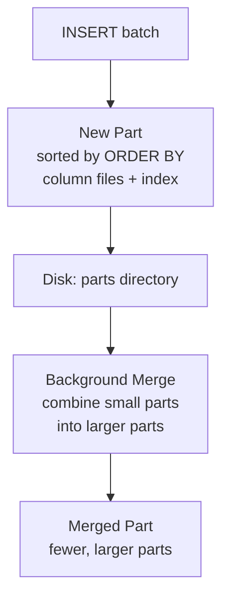
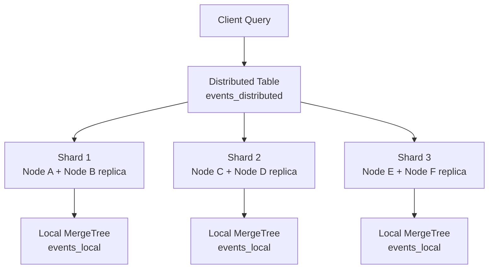

# ClickHouse Internals

ClickHouse is an open-source column-oriented database designed for online analytical processing (OLAP). Created at Yandex for the Yandex.Metrica web analytics system (processing over 20 billion events per day), it has become the default choice for high-performance analytical workloads — event analytics, log analysis, time-series aggregation, and real-time dashboards.

ClickHouse is fast. Not "fast for an analytics database" — fast in absolute terms. A single server can scan billions of rows per second for aggregation queries. This performance comes from three key architectural decisions: column-oriented storage, vectorized query execution, and aggressive use of hardware capabilities (SIMD instructions, memory bandwidth, disk I/O parallelism).

## Column-Oriented Storage

### Row vs. Column Storage

In a row-oriented database like [PostgreSQL](/system-design/databases/postgres-internals), data is stored row by row. To compute `SELECT AVG(price) FROM events WHERE date = '2026-03-20'`, the engine reads entire rows — including all columns you do not need — from disk.

In a column-oriented database, each column is stored separately. The same query reads only the `price` and `date` columns, ignoring everything else.

```
Row-oriented (PostgreSQL):
┌──────┬──────────┬───────┬────────┬─────────┐
│ id   │ date     │ price │ user   │ country │
├──────┼──────────┼───────┼────────┼─────────┤
│ 1    │ 2026-03  │ 42.50 │ alice  │ US      │
│ 2    │ 2026-03  │ 89.99 │ bob    │ UK      │
│ ...  │ ...      │ ...   │ ...    │ ...     │
└──────┴──────────┴───────┴────────┴─────────┘
Disk read: ALL columns for matching rows

Column-oriented (ClickHouse):
date:    [2026-03, 2026-03, ...]   ← only these
price:   [42.50, 89.99, ...]       ← two columns
id:      [1, 2, ...]               ← NOT read
user:    [alice, bob, ...]          ← NOT read
country: [US, UK, ...]             ← NOT read
```

### Compression

Column storage enables dramatically better compression because values in the same column have similar data types and distributions. ClickHouse uses column-specific codecs:

| Codec | Best For | Compression Ratio |
|-------|----------|-------------------|
| `LZ4` (default) | General purpose, fast decompression | 4-8x |
| `ZSTD` | Higher compression, slower decompression | 8-15x |
| `Delta` | Monotonically increasing values (timestamps, IDs) | Combined with LZ4: 20-50x |
| `DoubleDelta` | Slowly changing integers (counters) | Combined with LZ4: 50-100x |
| `T64` | 64-bit integers with limited value range | 2-10x |
| `Gorilla` | Float values that change slowly (gauge metrics) | Combined with LZ4: 10-30x |

```sql
CREATE TABLE events (
    timestamp DateTime CODEC(Delta, ZSTD),
    user_id   UInt64   CODEC(T64, LZ4),
    amount    Float64  CODEC(Gorilla, LZ4),
    country   LowCardinality(String)  -- dictionary encoding
) ENGINE = MergeTree()
ORDER BY (timestamp, user_id);
```

Real-world ClickHouse deployments achieve **10-20x compression** over raw data, which translates directly into 10-20x less disk I/O for analytical queries.

## MergeTree Engine Family

The MergeTree is ClickHouse's primary table engine. All production tables use a MergeTree variant. The name reflects its core mechanism: data is written into **parts** which are periodically **merged** in the background.

### Write Path



1. An `INSERT` writes a new **part** — a directory containing one file per column, a primary index, and metadata
2. Within the part, data is sorted by the `ORDER BY` columns
3. Background merges combine parts, maintaining sort order and applying deduplication (for `ReplacingMergeTree`)

Parts are immutable once written. Updates and deletes are implemented as mutations — a separate asynchronous process that rewrites affected parts.

### Primary Index (Sparse)

ClickHouse does not index every row. Instead, it uses a **sparse index** — one entry per granule (default 8,192 rows). The index stores the first value of the `ORDER BY` columns for each granule.

```
Granule 0: rows    0 -  8191  → index entry: (2026-03-01 00:00:00, 1001)
Granule 1: rows 8192 - 16383  → index entry: (2026-03-01 00:05:12, 2847)
Granule 2: rows 16384 - 24575 → index entry: (2026-03-01 00:10:44, 5102)
...
```

A query on `WHERE timestamp > '2026-03-01 00:06:00'` uses binary search on the sparse index to skip granules 0, then reads granules 1, 2, ... in parallel. This is why `ORDER BY` choice is critical — it determines which queries can skip data efficiently.

::: tip ORDER BY Design Rules
1. Put the most frequently filtered column first (usually a time column)
2. Put the next most filtered column second (usually a dimension like `user_id` or `tenant_id`)
3. Do NOT add columns that are only used in aggregations — they add merge overhead without improving data skipping
:::

### MergeTree Variants

| Engine | Additional Behavior |
|--------|-------------------|
| `MergeTree` | Base engine — insert-only, no deduplication |
| `ReplacingMergeTree` | Deduplicates rows by ORDER BY key during merges. Last version wins. |
| `SummingMergeTree` | Sums numeric columns for rows with the same ORDER BY key during merges |
| `AggregatingMergeTree` | Merges rows using aggregate function states (for pre-aggregated materialized views) |
| `CollapsingMergeTree` | Uses a sign column (+1/-1) to logically delete rows during merges |
| `VersionedCollapsingMergeTree` | Collapsing with version for out-of-order inserts |

```sql
-- ReplacingMergeTree: keep only the latest version of each user profile
CREATE TABLE user_profiles (
    user_id   UInt64,
    name      String,
    email     String,
    version   UInt64
) ENGINE = ReplacingMergeTree(version)
ORDER BY user_id;
```

::: warning ReplacingMergeTree Is Not Immediate
Deduplication happens during background merges, not at insert time. Until a merge runs, queries may see duplicate rows. Use `FINAL` modifier in queries to force deduplication at read time: `SELECT * FROM user_profiles FINAL WHERE user_id = 42`. But `FINAL` is slow — it forces a single-threaded merge of all parts.
:::

## Vectorized Query Execution

ClickHouse processes data in **blocks** (columns of ~65,536 rows) using vectorized operations. Instead of processing one row at a time (like a traditional Volcano-model executor), each operator processes an entire column vector at once.

```
Traditional (row-at-a-time):
for each row:
    if row.date == '2026-03-20':
        sum += row.amount

Vectorized (ClickHouse):
date_column = read_column_block("date", 65536 rows)
mask = SIMD_compare_eq(date_column, '2026-03-20')
amount_column = read_column_block("amount", 65536 rows)
sum = SIMD_masked_sum(amount_column, mask)
```

Vectorized execution:

- **Eliminates per-row function call overhead** — one function call processes thousands of values
- **Enables SIMD instructions** — ClickHouse uses SSE4.2 and AVX2/AVX-512 to process 4-16 values per CPU instruction
- **Maximizes CPU cache utilization** — processing a column vector keeps data in L1/L2 cache
- **Enables branch-free processing** — conditional operations are converted to masks, avoiding CPU branch misprediction penalties

This is why ClickHouse can aggregate 1-2 billion rows per second per core on modern hardware.

## Materialized Views

Materialized views in ClickHouse are not snapshots of a query result (as in PostgreSQL). They are **insert triggers** — when data is inserted into the source table, the materialized view's query runs on the new data and inserts the result into a destination table.

```sql
-- Source table: raw events
CREATE TABLE events (
    timestamp DateTime,
    user_id   UInt64,
    event     String,
    amount    Float64
) ENGINE = MergeTree()
ORDER BY (timestamp, user_id);

-- Materialized view: pre-aggregate daily revenue per user
CREATE MATERIALIZED VIEW daily_revenue
ENGINE = SummingMergeTree()
ORDER BY (date, user_id)
AS SELECT
    toDate(timestamp) AS date,
    user_id,
    sum(amount) AS total_amount,
    count() AS event_count
FROM events
GROUP BY date, user_id;
```

When you `INSERT INTO events`, the `daily_revenue` view automatically aggregates the new batch and inserts the result. Queries on `daily_revenue` scan a table that is orders of magnitude smaller than `events`.

::: tip Chain Materialized Views for Multi-Level Aggregation
```
Raw events → Per-minute aggregation → Per-hour aggregation → Per-day aggregation
```
Each level reduces data volume by 60x. Dashboard queries hit the most aggregated level, achieving sub-second response times over months of data.
:::

### Projections

Projections are an alternative to materialized views. They are stored inside the same table as the source data, maintaining a different sort order or pre-aggregation. ClickHouse automatically uses the optimal projection for each query.

```sql
ALTER TABLE events ADD PROJECTION events_by_user (
    SELECT * ORDER BY (user_id, timestamp)
);

ALTER TABLE events ADD PROJECTION hourly_counts (
    SELECT toStartOfHour(timestamp) AS hour, event, count()
    GROUP BY hour, event
);
```

## Distributed Tables

### Sharding Architecture



ClickHouse uses a two-table pattern for distributed queries:

```sql
-- Local table on each shard
CREATE TABLE events_local ON CLUSTER my_cluster (
    timestamp DateTime,
    user_id   UInt64,
    event     String
) ENGINE = ReplicatedMergeTree('/clickhouse/tables/{shard}/events', '{replica}')
ORDER BY (timestamp, user_id);

-- Distributed table (virtual — routes queries to shards)
CREATE TABLE events_distributed ON CLUSTER my_cluster AS events_local
ENGINE = Distributed(my_cluster, default, events_local, rand());
```

The `Distributed` engine:
- **Writes:** routes each insert batch to a shard based on the sharding expression (`rand()`, `sipHash64(user_id)`, etc.)
- **Reads:** sends the query to all shards in parallel, gathers partial results, and merges them on the coordinator node

### Replication

ClickHouse uses **ZooKeeper** (or ClickHouse Keeper, a built-in Raft-based alternative) for replication coordination. `ReplicatedMergeTree` ensures all replicas eventually converge to the same set of parts through a replication log stored in ZooKeeper.

Replication is **asynchronous** and **part-level** — entire parts are replicated, not individual rows. This makes replication bandwidth-efficient (compressed parts are transferred) but means replicas may lag behind the primary by one or more insert batches.

## When to Use ClickHouse

| Workload | ClickHouse | [PostgreSQL](/system-design/databases/postgres-internals) | [Elasticsearch](/system-design/databases/elasticsearch-internals) | [Time-Series DBs](/system-design/databases/time-series-databases) |
|----------|-----------|------------|---------------|-----------------|
| Analytics (GROUP BY, COUNT, SUM) | Excellent | Slow at scale | Limited | Good for metrics |
| Point lookups by primary key | Adequate | Excellent | Adequate | Adequate |
| Full-text search | Basic | pg_trgm, tsvector | Excellent | Not designed for |
| Time-series metrics | Excellent | TimescaleDB extension | Adequate | Purpose-built |
| ACID transactions | Not supported | Excellent | Not supported | Varies |
| Real-time inserts (< 1ms latency) | Batch inserts only | Excellent | Near-real-time | Varies |
| Joins | Limited (small dimensions) | Excellent | Not supported | Limited |

### When ClickHouse Is the Right Choice

- Analytical queries over billions of rows (event analytics, product analytics, log analysis)
- Aggregations at sub-second latency over terabytes of data
- Time-series analysis with complex GROUP BY and window functions
- Real-time dashboards fed by streaming inserts

### When ClickHouse Is the Wrong Choice

- OLTP workloads (frequent single-row updates, deletes, point lookups)
- Applications requiring ACID transactions
- Small datasets (< 1 million rows) — PostgreSQL is simpler and sufficient
- Primary data store — ClickHouse should be a secondary analytics store fed by CDC from your primary database

::: danger ClickHouse Is Not a Primary Database
ClickHouse does not support UPDATE or DELETE in the traditional sense. Mutations are asynchronous background operations that rewrite entire parts. If you need to delete a user's data for GDPR compliance, the delete may not take effect for minutes or hours. Always pair ClickHouse with a transactional primary database.
:::

## Operational Best Practices

### Insert Patterns

ClickHouse performs best with batch inserts of 10,000-1,000,000 rows. Each insert creates a new part on disk. Too many small inserts create too many parts, which overwhelms the merge process.

```
Bad:  1,000 inserts/second × 1 row each = 1,000 parts/second (will crash)
Good: 1 insert/second × 1,000 rows each = 1 part/second (healthy)
Best: 1 insert/10 seconds × 100,000 rows each = efficient
```

Use a buffer table or an external buffer (Kafka, a message queue) to batch inserts before writing to ClickHouse.

### Key Metrics

| Metric | Healthy Range | Concern |
|--------|--------------|---------|
| Parts per partition | < 300 | > 300: "too many parts" error |
| Background merges | < 50 concurrent | > 50: merge backlog |
| Query concurrency | < 100 | ClickHouse is designed for few, heavy queries |
| Replica lag | < 60 seconds | > 60s: replication falling behind |
| Memory usage | < 80% | OOM kills are the top ClickHouse failure mode |

### TTL and Data Lifecycle

```sql
CREATE TABLE events (
    timestamp DateTime,
    data      String
) ENGINE = MergeTree()
ORDER BY timestamp
TTL timestamp + INTERVAL 90 DAY DELETE,
    timestamp + INTERVAL 30 DAY TO VOLUME 'cold_storage';
```

TTL automatically moves old data to cheaper storage tiers and eventually deletes it, keeping storage costs predictable.

## Further Reading

- [Storage Engines](/system-design/databases/storage-engines) — B-tree and LSM tree fundamentals that contrast with ClickHouse's column store
- [Time-Series Databases](/system-design/databases/time-series-databases) — specialized alternatives for metrics-only workloads
- [Elasticsearch Internals](/system-design/databases/elasticsearch-internals) — when you need full-text search alongside analytics
- [Sharding](/system-design/databases/sharding) — distributed data partitioning patterns
- [Query Planning & Optimization](/system-design/databases/query-planning-optimization) — how traditional RDBMS optimizers compare
