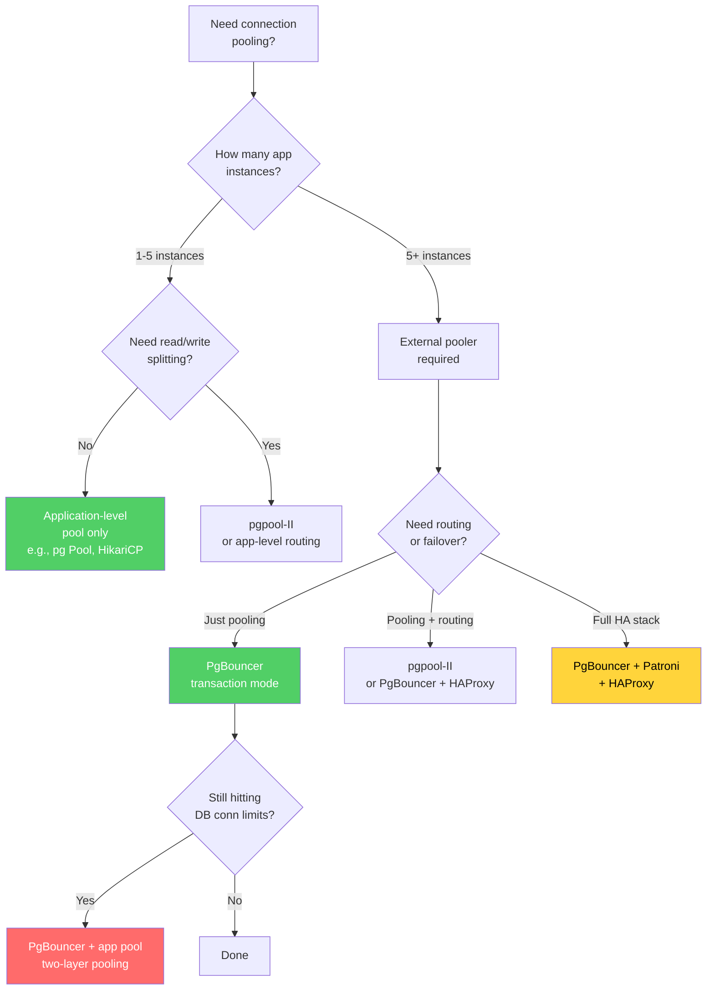

# Connection Pooling

Every time your application opens a database connection, PostgreSQL forks an entire operating system process. That process allocates ~10MB of memory, negotiates a TCP handshake (and possibly a TLS handshake), authenticates the client, and initializes per-connection state. When you close the connection, all of that work is thrown away. If your application opens and closes 500 connections per second, PostgreSQL is forking and destroying 500 processes per second — and spending more time on connection lifecycle management than on actual query execution.

Connection pooling solves this by maintaining a pool of pre-established connections and lending them to application threads on demand. It is, without exaggeration, the single most impactful infrastructure change most PostgreSQL deployments can make.

## Why Connections Are Expensive

### The PostgreSQL Process Model

Unlike MySQL (which uses threads), PostgreSQL uses a **process-per-connection** architecture. When a client connects, the `postmaster` process forks a new backend process:

```
                     Client A          Client B          Client C
                        │                  │                  │
                        ▼                  ▼                  ▼
              ┌─────────────────────────────────────────────────────┐
              │                    Postmaster                       │
              │              (accepts connections)                  │
              └────────┬──────────────┬──────────────┬─────────────┘
                       │              │              │
                       ▼              ▼              ▼
                  ┌─────────┐   ┌─────────┐   ┌─────────┐
                  │Backend A│   │Backend B│   │Backend C│
                  │ ~10MB   │   │ ~10MB   │   │ ~10MB   │
                  │ PID: 101│   │ PID: 102│   │ PID: 103│
                  └─────────┘   └─────────┘   └─────────┘
                       │              │              │
                       ▼              ▼              ▼
              ┌─────────────────────────────────────────────────────┐
              │              Shared Memory (~128MB+)                │
              │  ┌──────────┐  ┌──────────┐  ┌──────────────────┐  │
              │  │  Shared   │  │   WAL    │  │   Lock Manager   │  │
              │  │  Buffers  │  │  Buffers │  │                  │  │
              │  └──────────┘  └──────────┘  └──────────────────┘  │
              └─────────────────────────────────────────────────────┘
```

Each backend process is a full UNIX process with its own:

- **Virtual address space** (~10MB baseline, growing with complex queries)
- **Process control block** in the kernel's process table
- **File descriptors** for the client socket, WAL files, data files
- **Catalog cache** (local copy of frequently accessed system catalog entries)
- **Plan cache** (prepared statement plans)
- **Memory contexts** (per-transaction, per-query memory allocations)

### Memory Cost Per Connection

Let's break down the ~10MB per connection:

| Component | Approximate Size | Notes |
|-----------|-----------------|-------|
| Process overhead | 1-2 MB | Stack, heap, kernel structures |
| Catalog cache | 1-3 MB | Cached pg_class, pg_attribute, pg_type entries |
| Plan cache | 0.5-5 MB | Grows with number of prepared statements |
| work_mem allocation | 4 MB (default) | Per-sort or per-hash operation, can be much larger |
| temp_buffers | 8 MB (default) | Temporary table access buffers |
| Maintenance work_mem | 64 MB (default) | For VACUUM, CREATE INDEX (only when running) |
| **Typical total** | **~10 MB idle** | Can spike to 100MB+ during complex queries |

For 100 connections: ~1GB of memory just for connection overhead.
For 500 connections: ~5GB.
For 1,000 connections: ~10GB.

This memory is consumed even if the connections are idle — sitting there doing nothing.

### TCP and TLS Overhead

Every database connection involves:

1. **TCP three-way handshake** (SYN → SYN-ACK → ACK): 1 round trip (~0.5-1ms on same datacenter, 50-200ms cross-region)
2. **PostgreSQL authentication handshake**: Client sends startup message, server sends authentication request, client responds with credentials, server validates (~2-5ms)
3. **TLS handshake** (if using SSL): 2-4 additional round trips for key exchange (~2-10ms on same datacenter). Involves asymmetric cryptography that is CPU-intensive.

Total connection establishment time: **5-15ms** on the same datacenter, **100-500ms** cross-region.

If your application creates a new connection per request and handles 1,000 requests per second, you're spending 5-15 seconds per second just on connection setup. That's more than 100% of your capacity — meaning you literally cannot keep up.

### The fork() Cost

PostgreSQL's `fork()` call duplicates the entire postmaster process. On Linux, `fork()` is optimized with copy-on-write semantics, so the physical memory isn't immediately doubled. But:

- The kernel still needs to create a new process table entry
- Page tables must be duplicated (can be megabytes for large shared memory regions)
- The TLB (translation lookaside buffer) is flushed for the new process
- On some kernels, `fork()` with large shared memory can take 5-20ms

```
fork() timeline:
  ├── 0.0ms: Client sends connection request
  ├── 0.5ms: TCP handshake complete
  ├── 1.0ms: Postmaster receives startup message
  ├── 1.5ms: Postmaster calls fork()
  ├── 3.0ms: New backend process created ← fork() alone takes 1-2ms
  ├── 3.5ms: Backend initializes memory contexts
  ├── 4.0ms: Backend loads catalog cache entries
  ├── 5.0ms: Authentication exchange
  ├── 6.0ms: Connection ready for queries
  └── Total: ~6ms best case
```

## The Connection Limit Problem

### What Happens When `max_connections` Is Too High

```sql
-- Default is 100, but many people increase it
ALTER SYSTEM SET max_connections = 1000;
```

Setting `max_connections = 1000` means PostgreSQL will allow up to 1,000 concurrent connections. But having 1,000 active connections causes:

**1. Memory Exhaustion**
$$
\text{Memory} = \text{max\_connections} \times \text{memory\_per\_connection} + \text{shared\_buffers} + \text{OS}
$$
$$
= 1000 \times 10\text{MB} + 4\text{GB} + 2\text{GB} = 16\text{GB}
$$

On a 16GB server, you've used all RAM before executing a single query. Under load, with `work_mem` allocations, the system starts swapping — and a swapping database server is a dead database server.

**2. CPU Context Switching**

The Linux kernel scheduler must decide which of 1,000 processes runs on each CPU core. With 8 cores and 1,000 runnable processes:

- Each process gets ~8ms of CPU time per scheduling cycle
- The kernel spends 10-30% of CPU time on context switching overhead
- Cache lines (L1, L2, L3) are continuously invalidated as different processes run on the same core
- TLB entries are flushed on every context switch

The result: each query takes longer because it shares the CPU with 999 other processes. Throughput actually *decreases* beyond a certain point.

**3. Lock Contention**

PostgreSQL's lock manager uses shared memory structures protected by lightweight locks (LWLocks). With many concurrent connections:

- Lock wait queue management becomes expensive
- Lock table overflow can occur (controlled by `max_locks_per_transaction`)
- Deadlock detection runs more frequently (checking for cycles in a larger graph)

### What Happens When `max_connections` Is Too Low

If `max_connections = 20` and your application has 50 instances each needing a connection, 30 connections will be refused with:

```
FATAL: too many connections for role "myapp"
```

or

```
FATAL: sorry, too many clients already
```

This typically triggers a cascade: the application retries, failed retries queue up, timeouts fire, health checks fail, the load balancer marks instances as unhealthy, traffic shifts to remaining instances which also exhaust their connections, and the entire service goes down.

### The Sweet Spot

The optimal number of *active* connections (connections actually executing queries, not just sitting idle) is surprisingly small:

$$
\text{optimal\_active\_connections} = \text{CPU cores} \times 2 + \text{effective\_spindle\_count}
$$

For a server with 8 CPU cores and 1 SSD (equivalent to ~200 spindles):

$$
\text{optimal} \approx 8 \times 2 + 1 = 17
$$

Wait, only 17? Yes. PostgreSQL achieves maximum throughput with approximately **2x the number of CPU cores** active connections. Beyond that, throughput plateaus and eventually decreases due to contention.

This is the core argument for connection pooling: your application may have 500 instances that need database access, but only 17 should be running queries simultaneously. A connection pool bridges this gap.

::: info The PostgreSQL Scalability Cliff
PostgreSQL's shared buffer management uses a clock sweep algorithm with a single shared counter. With many concurrent connections accessing the buffer pool, this counter becomes a contention point. Benchmarks consistently show that PostgreSQL throughput peaks at 50-100 active connections on modern hardware and degrades beyond that. Some workloads see throughput drop by 50% when going from 100 to 500 connections.
:::

## Connection Pooling Concepts

A connection pool maintains a set of pre-established database connections and lends them to application code on demand:

```
Application Layer                    Connection Pool                 Database
┌─────────┐                     ┌───────────────────┐           ┌──────────┐
│ Thread 1 │──── borrow ────────│                   │           │          │
│          │◄─── return ────────│  Pool maintains   │           │ Backend 1│
├─────────┤                     │  N connections    │◄─────────►│ Backend 2│
│ Thread 2 │──── borrow ────────│  to the database  │           │ Backend 3│
│          │◄─── return ────────│                   │           │ Backend 4│
├─────────┤                     │  Threads borrow   │           │          │
│ Thread 3 │──── borrow ────────│  and return       │           └──────────┘
│          │◄─── return ────────│  connections       │
├─────────┤                     │                   │
│ Thread 4 │──── queue ─────────│  If all busy,     │
│  (waits) │◄─── borrow ────────│  requests queue   │
└─────────┘                     └───────────────────┘
```

### Core Configuration Parameters

#### Pool Size (min/max)

- **`min_pool_size`** (also called `minimum_idle`): The minimum number of connections kept open, even when idle. Eliminates cold-start latency.
- **`max_pool_size`**: The maximum number of connections the pool will open. This is your hard limit. Never set this higher than what the database can handle.

#### Idle Timeout

How long an idle connection stays in the pool before being closed. Prevents resource waste from unused connections but introduces latency when a burst of requests arrives after a quiet period.

```
idle_timeout = 300s (5 minutes)

Timeline:
  0:00  Connection borrowed, query executed, returned
  0:01  Connection sits idle in pool
  ...
  5:00  Connection has been idle for 5 minutes → CLOSED
  5:01  New request arrives → must create NEW connection (6ms penalty)
```

#### Max Lifetime

The maximum total lifetime of a connection, regardless of whether it's idle or active. This forces periodic connection recycling, which is important for:

- **DNS changes:** If the database hostname resolves to a new IP (e.g., after a failover), existing connections still point to the old IP. Max lifetime ensures connections are periodically re-established, picking up DNS changes.
- **Memory leaks:** Long-lived PostgreSQL backend processes can accumulate memory over time (catalog cache growth, plan cache growth). Recycling connections prevents unbounded memory growth.
- **Load balancer draining:** When removing a database node from a load balancer, max lifetime ensures connections to the old node eventually close.

#### Connection Validation (Health Checking)

Before lending a connection to application code, the pool can validate that the connection is still alive:

- **Test on borrow:** Execute `SELECT 1` before handing the connection to the application. Adds ~1ms latency per borrow but catches dead connections.
- **Test while idle:** Periodically ping idle connections. Catches dead connections without adding latency to borrows.
- **TCP keepalive:** Rely on TCP keepalive probes to detect dead connections. No query overhead but detection can be slow (default Linux TCP keepalive: 2 hours).

## PgBouncer

PgBouncer is the most widely used connection pooler for PostgreSQL. It sits between the application and the database, accepting connections from the application and multiplexing them onto a smaller set of database connections.

```
Application (500 connections)
         │
         ▼
┌─────────────────┐
│    PgBouncer     │
│  (lightweight    │
│   C process)     │
│                  │
│  500 client ──►  │
│  connections     │
│       │          │
│       ▼          │
│  20 server  ──►  │
│  connections     │
└────────┬─────────┘
         │
         ▼
PostgreSQL (20 backends)
```

PgBouncer is a single-threaded, event-driven C program that uses ~2KB of memory per connection (compare to ~10MB per connection in PostgreSQL). It can handle thousands of client connections with minimal overhead.

### Pooling Modes

PgBouncer supports three pooling modes, each with different trade-offs:

#### Transaction Mode (`pool_mode = transaction`)

A server connection is assigned to a client only for the duration of a transaction. Between transactions, the server connection is returned to the pool and can be used by another client.

```
Client A: BEGIN → query → query → COMMIT   (uses Server Conn 1)
          ─── idle ───                      (Server Conn 1 returned to pool)
          BEGIN → query → COMMIT            (might get Server Conn 3)

Client B: ─── idle ───
          BEGIN → query → COMMIT            (uses Server Conn 1, borrowed from pool)
```

**Pros:**
- Maximum connection multiplexing — 500 clients can share 20 server connections
- Ideal for short-lived transactions (typical web applications)

**Cons:**
- **Session-level features are broken:**
  - `SET` commands (e.g., `SET search_path`) don't persist between transactions
  - Prepared statements are lost between transactions (unless `max_prepared_statements` is configured)
  - `LISTEN/NOTIFY` doesn't work
  - Temporary tables are inaccessible after the transaction that created them
  - Advisory locks are released
  - Session variables are reset

**This is the most commonly used mode** and the right choice for 90% of web applications.

#### Session Mode (`pool_mode = session`)

A server connection is assigned to a client for the entire duration of the client's session (from connect to disconnect). This is the safest mode but provides the least multiplexing benefit.

```
Client A connects  →  gets Server Conn 1  →  keeps it until disconnect
Client B connects  →  gets Server Conn 2  →  keeps it until disconnect
Client C connects  →  no server conn available → waits in queue
```

**Pros:**
- All PostgreSQL features work (prepared statements, SET, LISTEN/NOTIFY, temp tables)
- Transparent to the application — no code changes needed

**Cons:**
- Limited multiplexing — if clients hold connections for long periods (connection keep-alive), you don't save many server connections
- Only useful if clients connect/disconnect frequently (reducing fork overhead)

**Use session mode when:**
- Your application uses session-level features that break in transaction mode
- You're migrating to PgBouncer and want a safe starting point
- Client connections are short-lived (connect, run queries, disconnect)

#### Statement Mode (`pool_mode = statement`)

A server connection is assigned for the duration of a single statement. After each statement completes, the connection is returned to the pool.

**Pros:**
- Maximum possible multiplexing

**Cons:**
- **Multi-statement transactions are impossible** — each statement might run on a different server connection
- Extremely limited use case

**Use statement mode only for:**
- Simple autocommit workloads (each statement is its own transaction)
- Read-only connection pools where every query is a standalone SELECT

### PgBouncer Configuration Deep Dive

A production PgBouncer configuration (`pgbouncer.ini`):

```ini
[databases]
; database = host=... port=... dbname=...
myapp = host=10.0.1.100 port=5432 dbname=myapp_production
myapp_replica = host=10.0.1.101 port=5432 dbname=myapp_production

[pgbouncer]
; ─── Pooling Mode ───
pool_mode = transaction

; ─── Connection Limits ───
; Max client connections PgBouncer will accept
max_client_conn = 1000

; Default pool size per database/user pair
default_pool_size = 20

; Extra connections allowed temporarily during traffic spikes
reserve_pool_size = 5

; How long a client must wait before getting a reserve connection
reserve_pool_timeout = 3

; Min pool size — keep at least this many connections open
min_pool_size = 5

; ─── Timeouts ───
; Close server connections that have been idle for this long
server_idle_timeout = 300

; Close server connections that have existed for this long
server_lifetime = 3600

; Timeout for establishing a new server connection
server_connect_timeout = 5

; Timeout for the authentication handshake with the server
server_login_retry = 3

; If a client hasn't sent a query for this long, disconnect them
client_idle_timeout = 0   ; 0 = disabled

; Max time a query can run
query_timeout = 0         ; 0 = disabled

; ─── Authentication ───
auth_type = md5
auth_file = /etc/pgbouncer/userlist.txt
; Or use auth passthrough:
; auth_type = hba
; auth_hba_file = /etc/pgbouncer/pg_hba.conf
; auth_query = SELECT usename, passwd FROM pg_shadow WHERE usename=$1

; ─── Logging ───
log_connections = 1
log_disconnections = 1
log_pooler_errors = 1
stats_period = 60

; ─── Performance ───
; PgBouncer is single-threaded but can handle >10K connections
listen_addr = 0.0.0.0
listen_port = 6432
unix_socket_dir = /var/run/pgbouncer

; ─── TLS ───
client_tls_sslmode = prefer
client_tls_key_file = /etc/pgbouncer/server.key
client_tls_cert_file = /etc/pgbouncer/server.crt
server_tls_sslmode = verify-full
server_tls_ca_file = /etc/pgbouncer/ca.crt
```

### Auth Passthrough

In production, you don't want to maintain a separate userlist.txt file with passwords. PgBouncer can query PostgreSQL for credentials using `auth_query`:

```ini
auth_type = md5
auth_query = SELECT usename, passwd FROM pg_shadow WHERE usename=$1
auth_user = pgbouncer_auth  ; A dedicated user with access to pg_shadow
```

This requires a dedicated PostgreSQL user that can read `pg_shadow`. PgBouncer connects as this user to validate client credentials, then connects as the actual user for the pool.

### Pause and Resume

PgBouncer supports pausing and resuming database connections, which is invaluable for maintenance:

```sql
-- Connect to PgBouncer admin console:
-- psql -p 6432 -U admin pgbouncer

-- Pause: stop sending queries, wait for active queries to finish
PAUSE myapp;

-- Now you can safely restart PostgreSQL, run maintenance, etc.

-- Resume: start accepting queries again
RESUME myapp;

-- Kill all client connections (useful in emergencies):
KILL myapp;

-- Graceful shutdown: wait for all clients to disconnect
SHUTDOWN;
```

The `PAUSE` → maintenance → `RESUME` pattern enables zero-downtime PostgreSQL restarts. During the pause, PgBouncer queues incoming client queries. When you resume, the queued queries are sent to the (now restarted) database.

### PgBouncer Monitoring

```sql
-- Connect to PgBouncer admin:
-- psql -p 6432 pgbouncer

-- Pool statistics:
SHOW POOLS;
-- database | user | cl_active | cl_waiting | sv_active | sv_idle | sv_used | sv_tested | sv_login | maxwait
-- myapp    | app  |    45     |     0      |    18     |   2     |   0     |    0      |    0     |    0

-- Per-query statistics:
SHOW STATS;
-- database | total_xact_count | total_query_count | total_received | total_sent | total_xact_time | total_query_time | total_wait_time

-- Active client connections:
SHOW CLIENTS;

-- Active server connections:
SHOW SERVERS;

-- Configuration:
SHOW CONFIG;
```

Key metrics to monitor:

| Metric | Meaning | Alert When |
|--------|---------|------------|
| `cl_waiting` | Clients waiting for a connection | > 0 for sustained period |
| `maxwait` | Longest wait time (seconds) | > 1 second |
| `sv_active` | Server connections running queries | Consistently = `default_pool_size` |
| `sv_idle` | Server connections idle in pool | Consistently 0 (pool exhausted) |
| `total_wait_time` | Cumulative time clients spent waiting | Growing rapidly |

### PgBouncer Limitations

1. **Single-threaded:** PgBouncer runs on a single CPU core. For extremely high throughput (>50,000 queries/second), you may need multiple PgBouncer instances behind a load balancer. Or use the multithreaded fork, `PgBouncer with SO_REUSEPORT`.

2. **No query routing:** PgBouncer cannot route read queries to replicas and write queries to the primary. You need separate pools or use pgpool-II.

3. **Transaction mode breaks session features:** As discussed above. This is the most common source of PgBouncer-related bugs.

4. **No failover:** PgBouncer does not detect when the backend database fails and switch to a replica. You need an external tool (Patroni, repmgr, HAProxy) for that.

## pgpool-II

pgpool-II is a more feature-rich (and more complex) connection pooler that includes:

- **Connection pooling** (like PgBouncer)
- **Load balancing** (route reads to replicas)
- **Automatic failover** (detect primary failure, promote replica)
- **Replication** (built-in replication, though rarely used in favor of PostgreSQL streaming replication)

```
Application
    │
    ▼
┌──────────────────┐
│    pgpool-II      │
│                  │
│  ┌─ Router ──┐  │
│  │ Reads  ───┤──┼──►  Replica 1
│  │           │  │
│  │ Reads  ───┤──┼──►  Replica 2
│  │           │  │
│  │ Writes ───┤──┼──►  Primary
│  └───────────┘  │
│                  │
│  ┌─ Failover ┐  │
│  │ Heartbeat │  │
│  │ Detection │  │
│  │ Promotion │  │
│  └───────────┘  │
└──────────────────┘
```

### pgpool-II vs. PgBouncer

| Feature | PgBouncer | pgpool-II |
|---------|-----------|-----------|
| Connection pooling | Excellent | Good |
| Memory overhead | ~2KB/conn | ~10KB/conn |
| Query routing | No | Yes (reads to replicas) |
| Load balancing | No | Yes |
| Failover | No | Yes |
| Complexity | Low | High |
| Performance overhead | Minimal (<1%) | Moderate (5-10%) |
| Multi-threading | No (single-threaded) | Yes (multi-process) |
| **Best for** | Pure connection pooling | Full-stack HA solution |

### When to Use pgpool-II

- You need read/write splitting without application-level changes
- You want automatic failover without Patroni or repmgr
- You need a single solution for pooling + routing + HA

### When to Use PgBouncer

- You just need connection pooling (most common case)
- You want minimal latency overhead
- You're already using Patroni or HAProxy for HA
- You need to handle thousands of client connections efficiently

### The Common Architecture: PgBouncer + Patroni

The most popular production architecture combines PgBouncer for pooling with Patroni for HA:

```
Application
    │
    ▼
HAProxy / DNS
    │
    ├──► PgBouncer (on primary)  ──► PostgreSQL Primary
    │
    ├──► PgBouncer (on replica1) ──► PostgreSQL Replica 1
    │
    └──► PgBouncer (on replica2) ──► PostgreSQL Replica 2

Patroni manages failover:
  - Detects primary failure via DCS (etcd/consul/zookeeper)
  - Promotes a replica to primary
  - Updates HAProxy/DNS to point to the new primary
```

## Application-Level Pooling

### Node.js: pg Pool

The `pg` (node-postgres) library includes a built-in connection pool:

```typescript
import { Pool } from 'pg';

const pool = new Pool({
  host: 'localhost',
  port: 5432,
  database: 'myapp',
  user: 'myapp',
  password: process.env.DB_PASSWORD,

  // Pool configuration
  max: 20,                    // Maximum connections in the pool
  min: 5,                     // Minimum idle connections maintained
  idleTimeoutMillis: 30000,   // Close idle connections after 30s
  connectionTimeoutMillis: 5000, // Wait max 5s for a connection
  maxUses: 7500,              // Close connection after 7500 uses (max lifetime proxy)

  // Connection validation
  allowExitOnIdle: false,     // Don't let pool prevent process exit

  // Statement timeout (per connection)
  statement_timeout: 30000,   // 30s query timeout
});

// Event handlers for monitoring
pool.on('connect', (client) => {
  console.log('New connection established');
});

pool.on('acquire', (client) => {
  // Connection borrowed from pool
});

pool.on('remove', (client) => {
  console.log('Connection removed from pool');
});

pool.on('error', (err, client) => {
  console.error('Unexpected error on idle client', err);
});

// Usage: automatic borrow and return
async function getUser(userId: number) {
  // pool.query() borrows a connection, runs the query, and returns it
  const result = await pool.query(
    'SELECT * FROM users WHERE id = $1',
    [userId]
  );
  return result.rows[0];
}

// Usage: manual borrow for transactions
async function transferFunds(fromId: number, toId: number, amount: number) {
  const client = await pool.connect(); // Borrow connection
  try {
    await client.query('BEGIN');
    await client.query(
      'UPDATE accounts SET balance = balance - $1 WHERE id = $2',
      [amount, fromId]
    );
    await client.query(
      'UPDATE accounts SET balance = balance + $1 WHERE id = $2',
      [amount, toId]
    );
    await client.query('COMMIT');
  } catch (e) {
    await client.query('ROLLBACK');
    throw e;
  } finally {
    client.release(); // ALWAYS return to pool, even on error
  }
}

// Graceful shutdown
process.on('SIGTERM', async () => {
  await pool.end(); // Wait for all queries to finish, close all connections
  process.exit(0);
});
```

::: danger Connection Leak Warning
If you call `pool.connect()` and forget to call `client.release()`, the connection is never returned to the pool. Eventually, all connections are leaked, and new requests hang forever waiting for a connection. ALWAYS use try/finally to ensure `release()` is called, or use `pool.query()` which handles this automatically.
:::

### Java: HikariCP

HikariCP is the fastest and most widely used Java connection pool. It's the default in Spring Boot.

```java
HikariConfig config = new HikariConfig();
config.setJdbcUrl("jdbc:postgresql://localhost:5432/myapp");
config.setUsername("myapp");
config.setPassword(System.getenv("DB_PASSWORD"));

// Pool sizing
config.setMaximumPoolSize(20);
config.setMinimumIdle(5);

// Timeouts
config.setConnectionTimeout(5000);   // 5s to wait for connection
config.setIdleTimeout(300000);        // 5min before idle conn is closed
config.setMaxLifetime(1800000);       // 30min max connection lifetime

// Validation
config.setConnectionTestQuery("SELECT 1");
config.setValidationTimeout(3000);    // 3s for validation query

// Performance
config.setAutoCommit(true);
config.addDataSourceProperty("cachePrepStmts", "true");
config.addDataSourceProperty("prepStmtCacheSize", "250");
config.addDataSourceProperty("prepStmtCacheSqlLimit", "2048");

HikariDataSource ds = new HikariDataSource(config);
```

### Application-Level vs. External Pooling

| Aspect | Application Pool (pg, HikariCP) | External Pool (PgBouncer) |
|--------|--------------------------------|--------------------------|
| Scope | Per-application-instance | Shared across all instances |
| Total connections | `pool_size × num_instances` | Fixed, regardless of instances |
| Connection reuse | Within one process | Across all processes |
| Scaling risk | Adding instances adds connections | Instances don't affect DB connections |
| Session features | Full support | Depends on mode |
| Operational complexity | None (part of app) | Separate service to manage |
| Latency overhead | None | Minimal (~0.1ms per query) |

**The problem with application-level pooling alone:**

If you have 50 application instances, each with a pool of 20 connections, that's $50 \times 20 = 1{,}000$ database connections. Scaling to 100 instances doubles it to 2,000. The application pool limits connections per instance, but not globally.

**The solution: both.**

Use application-level pooling (to avoid connection setup latency per query) AND PgBouncer (to limit total connections to the database):

```
App Instance 1 (pool_size=10) ──┐
App Instance 2 (pool_size=10) ──┤
App Instance 3 (pool_size=10) ──┼──► PgBouncer (max 30 server conns) ──► PostgreSQL
App Instance 4 (pool_size=10) ──┤
App Instance 5 (pool_size=10) ──┘

50 app connections → 30 PgBouncer connections → 30 PostgreSQL backends
```

## The Optimal Pool Size Formula

### Little's Law Application

Little's Law from queueing theory states:

$$
L = \lambda \times W
$$

Where:
- $L$ = average number of items in the system (active connections)
- $\lambda$ = arrival rate (queries per second)
- $W$ = average time each item spends in the system (query duration)

Rearranging for pool size:

$$
\text{pool\_size} = \text{QPS} \times \text{avg\_query\_duration}
$$

**Example:**
- Your application handles 500 queries per second
- Average query takes 20ms (0.02 seconds)

$$
\text{pool\_size} = 500 \times 0.02 = 10
$$

You need 10 connections to handle 500 QPS with 20ms queries. Not 100. Not 500. Ten.

### Why People Get This Wrong

Developers commonly set pool sizes based on the number of application threads or HTTP request handlers. "I have 200 request handler threads, so I need 200 database connections." This is wrong.

If each request takes 100ms total but only 20ms of that is database time, then at any given moment only 20% of threads are using a database connection. You need $200 \times 0.20 = 40$ connections, not 200.

### The CPU Bound vs. I/O Bound Adjustment

Little's Law gives you the theoretical minimum. In practice, you need to account for:

1. **Variance in query times:** If some queries take 1ms and others take 500ms, the average of 20ms underestimates the number of connections needed for bursts.
2. **Concurrent long queries:** If 5 queries run for 5 seconds each while 495 queries run for 5ms each, the 5 long queries occupy connections that can't be reused.
3. **Transaction idle time:** If your application opens a transaction, does some computation, then runs more queries, the connection is held during the computation time.

A practical formula:

$$
\text{pool\_size} = \text{QPS} \times \text{avg\_query\_duration} \times (1 + \text{variance\_factor}) + \text{long\_query\_headroom}
$$

Where `variance_factor` is typically 0.5-2.0 depending on query time distribution, and `long_query_headroom` is 2-5 connections for occasional slow queries.

### Queueing Theory: The M/M/c Model

For a more rigorous analysis, model the connection pool as an M/M/c queue (Markov arrivals, Markov service times, c servers):

- $\lambda$ = query arrival rate (queries/second)
- $\mu$ = service rate per connection (queries/second per connection) = $\frac{1}{\text{avg\_query\_time}}$
- $c$ = pool size (number of connections)
- $\rho = \frac{\lambda}{c \mu}$ = utilization per connection

The system is stable if $\rho < 1$ (utilization < 100%).

**Erlang C formula** gives the probability that a request must wait for a connection:

$$
P_W = \frac{\frac{(c\rho)^c}{c!} \cdot \frac{1}{1-\rho}}{\sum_{k=0}^{c-1} \frac{(c\rho)^k}{k!} + \frac{(c\rho)^c}{c!} \cdot \frac{1}{1-\rho}}
$$

The average wait time in the queue (before getting a connection) is:

$$
W_q = \frac{P_W}{c\mu(1-\rho)}
$$

**Practical example:**
- $\lambda = 500$ queries/second
- $\mu = 50$ queries/second per connection (20ms avg)
- Target: $P_W < 0.01$ (less than 1% of queries should wait)

For $c = 10$ connections: $\rho = \frac{500}{10 \times 50} = 1.0$ — saturated, 100% of queries wait.

For $c = 12$ connections: $\rho = \frac{500}{12 \times 50} = 0.833$ — $P_W \approx 0.35$ — 35% wait. Still too high.

For $c = 15$ connections: $\rho = \frac{500}{15 \times 50} = 0.667$ — $P_W \approx 0.04$ — 4% wait. Getting close.

For $c = 18$ connections: $\rho = \frac{500}{18 \times 50} = 0.556$ — $P_W \approx 0.005$ — 0.5% wait. Good.

For $c = 20$ connections: $\rho = \frac{500}{20 \times 50} = 0.500$ — $P_W \approx 0.001$ — 0.1% wait. Excellent.

::: tip The 70% Rule
A practical heuristic: keep pool utilization below 70%. Above 70%, queue wait times increase rapidly (queueing theory's "hockey stick" effect). So:

$$
\text{pool\_size} = \frac{\text{QPS} \times \text{avg\_query\_time}}{0.7}
$$

For 500 QPS at 20ms: $\text{pool\_size} = \frac{500 \times 0.02}{0.7} = 14.3 \approx 15$
:::

## Monitoring Connection Health

### `pg_stat_activity`

The most important view for monitoring connections:

```sql
-- See all connections and what they're doing:
SELECT
  pid,
  usename,
  application_name,
  client_addr,
  state,
  state_change,
  wait_event_type,
  wait_event,
  query_start,
  NOW() - query_start AS query_duration,
  query
FROM pg_stat_activity
WHERE datname = 'myapp'
ORDER BY state_change DESC;
```

### Connection States

| State | Meaning | Normal? |
|-------|---------|---------|
| `active` | Executing a query | Yes, if query_duration is reasonable |
| `idle` | Connected, no transaction, waiting for commands | Yes, if pool manages these |
| `idle in transaction` | In a BEGIN block but not executing a query | **Dangerous** if prolonged |
| `idle in transaction (aborted)` | Transaction has errored but not rolled back | **Very dangerous** |
| `fastpath function call` | Executing a fast-path function | Rare |

### Detecting Idle-in-Transaction

`idle in transaction` connections hold locks, prevent VACUUM from cleaning up dead tuples, and consume connection slots. They're one of the most common sources of PostgreSQL performance degradation.

```sql
-- Find connections idle in transaction for more than 5 minutes:
SELECT
  pid,
  usename,
  application_name,
  state,
  NOW() - state_change AS idle_duration,
  query
FROM pg_stat_activity
WHERE state = 'idle in transaction'
  AND NOW() - state_change > interval '5 minutes';

-- Terminate them:
SELECT pg_terminate_backend(pid)
FROM pg_stat_activity
WHERE state = 'idle in transaction'
  AND NOW() - state_change > interval '5 minutes';
```

**Prevention:**
```sql
-- Automatically abort transactions idle for more than 30 seconds:
SET idle_in_transaction_session_timeout = '30s';

-- In postgresql.conf for all connections:
idle_in_transaction_session_timeout = 30000  -- milliseconds
```

### Wait Events

Wait events tell you what a connection is waiting on:

```sql
SELECT
  wait_event_type,
  wait_event,
  COUNT(*) as count
FROM pg_stat_activity
WHERE state = 'active'
  AND wait_event IS NOT NULL
GROUP BY wait_event_type, wait_event
ORDER BY count DESC;
```

Common wait events:

| Wait Event Type | Wait Event | Meaning |
|----------------|------------|---------|
| `Lock` | `relation` | Waiting for a table lock |
| `Lock` | `transactionid` | Waiting for another transaction to complete |
| `LWLock` | `buffer_content` | Waiting for a buffer page lock |
| `IO` | `DataFileRead` | Waiting for a disk read to complete |
| `IO` | `WALWrite` | Waiting for WAL to be written |
| `Client` | `ClientRead` | Waiting for the client to send data |
| `Activity` | `WalWriterMain` | Background writer waiting for work |

### Connection Count Dashboard Query

```sql
-- Dashboard: connection counts by state
SELECT
  state,
  COUNT(*) as count,
  MAX(NOW() - state_change) as longest
FROM pg_stat_activity
WHERE datname = 'myapp'
GROUP BY state;

-- Connection usage vs. limit:
SELECT
  (SELECT COUNT(*) FROM pg_stat_activity) as current_connections,
  (SELECT setting::int FROM pg_settings WHERE name = 'max_connections') as max_connections,
  ROUND(
    (SELECT COUNT(*) FROM pg_stat_activity)::numeric /
    (SELECT setting::int FROM pg_settings WHERE name = 'max_connections') * 100,
    1
  ) as usage_percent;
```

## Common Problems

### Problem 1: Connection Leaks

A connection leak occurs when application code borrows a connection from the pool and never returns it. This is almost always caused by error handling that skips the `release()` call.

```typescript
// BAD: Connection leak on error
async function riskyQuery() {
  const client = await pool.connect();
  const result = await client.query('SELECT ...');  // If this throws...
  client.release();  // ...this never runs → LEAKED CONNECTION
  return result;
}

// GOOD: Always release in finally
async function safeQuery() {
  const client = await pool.connect();
  try {
    const result = await client.query('SELECT ...');
    return result;
  } finally {
    client.release();  // Always runs, even on error
  }
}

// BEST: Use pool.query() which handles release automatically
async function bestQuery() {
  return pool.query('SELECT ...');
}
```

**Detecting leaks:**
- Monitor pool metrics: if `total connections` grows over time but `idle connections` stays at 0, connections are being leaked
- PgBouncer: `cl_waiting` growing while `sv_idle` is 0
- PostgreSQL: `pg_stat_activity` shows many `idle` connections not associated with PgBouncer

### Problem 2: Idle-in-Transaction

An application begins a transaction, does some application logic (HTTP calls, file I/O), and then continues the transaction. The database connection is held idle during the non-database work.

```typescript
// BAD: Holding a transaction open during non-DB work
async function processOrder(orderId: number) {
  const client = await pool.connect();
  await client.query('BEGIN');

  const order = await client.query('SELECT * FROM orders WHERE id = $1', [orderId]);

  // This HTTP call takes 2 seconds — the connection is idle in transaction
  // the entire time, holding locks and preventing VACUUM
  const shippingRate = await fetch('https://shipping-api.com/rate', {
    body: JSON.stringify(order.rows[0])
  });

  await client.query('UPDATE orders SET shipping = $1 WHERE id = $2',
    [shippingRate, orderId]);
  await client.query('COMMIT');
  client.release();
}

// GOOD: Minimize transaction scope
async function processOrderFixed(orderId: number) {
  // Non-transactional work first
  const order = await pool.query('SELECT * FROM orders WHERE id = $1', [orderId]);

  const shippingRate = await fetch('https://shipping-api.com/rate', {
    body: JSON.stringify(order.rows[0])
  });

  // Short transaction for the update only
  const client = await pool.connect();
  try {
    await client.query('BEGIN');
    await client.query('UPDATE orders SET shipping = $1 WHERE id = $2',
      [shippingRate, orderId]);
    await client.query('COMMIT');
  } catch (e) {
    await client.query('ROLLBACK');
    throw e;
  } finally {
    client.release();
  }
}
```

### Problem 3: Connection Storms at Application Startup

When an application with 50 instances restarts simultaneously (e.g., a Kubernetes rolling deploy), each instance opens its `min_pool_size` connections at once. If `min_pool_size = 10` and 50 instances start within 5 seconds, that's 500 new connections in 5 seconds.

PostgreSQL's `postmaster` must fork 500 processes, each doing authentication, catalog cache warming, etc. This can overload the database for 10-30 seconds.

**Mitigations:**

1. **Staggered startup:** Add a random delay before opening connections:
```typescript
const startupDelay = Math.random() * 5000; // 0-5 seconds
setTimeout(() => {
  initializePool();
}, startupDelay);
```

2. **Lazy initialization:** Start with `min = 0` and let the pool grow as requests arrive:
```typescript
const pool = new Pool({
  min: 0,   // Don't pre-create connections
  max: 20,  // Let them be created on demand
});
```

3. **PgBouncer as buffer:** PgBouncer can absorb connection storms because it establishes server connections lazily. 500 clients connecting to PgBouncer creates 500 lightweight client connections but only `default_pool_size` server connections.

4. **Kubernetes rolling deploy rate:** Limit the deploy rate with `maxSurge` and `maxUnavailable`:
```yaml
spec:
  strategy:
    rollingUpdate:
      maxSurge: 1        # Add only 1 new pod at a time
      maxUnavailable: 0  # Don't kill old pods until new ones are ready
```

### Problem 4: Connection Exhaustion Under Load

The application's connection pool is fully utilized, and new requests queue up waiting for a connection. If the queue grows faster than connections are freed, request latency explodes.

```
Timeline of connection exhaustion:

Normal:   ████░░░░░░ (4/10 connections used, 6 idle)
Busy:     ████████░░ (8/10 connections used, 2 idle)
Stressed: ██████████ (10/10 connections used, 0 idle, queue forming)
Cascade:  ██████████ [queue: 50] (requests timing out, retries adding to queue)
Crash:    ██████████ [queue: 500] (all requests timing out, circuit breaker should trip)
```

**Mitigations:**

1. **Connection timeout:** Don't wait forever for a connection. Fail fast.
```typescript
const pool = new Pool({
  connectionTimeoutMillis: 3000,  // Fail after 3 seconds
});
```

2. **Circuit breaker:** If the pool is consistently exhausted, stop sending queries and return errors immediately:
```typescript
let consecutiveTimeouts = 0;
const CIRCUIT_BREAKER_THRESHOLD = 10;

async function queryWithCircuitBreaker(sql: string, params: unknown[]) {
  if (consecutiveTimeouts > CIRCUIT_BREAKER_THRESHOLD) {
    throw new Error('Circuit breaker open: database connection pool exhausted');
  }

  try {
    const result = await pool.query(sql, params);
    consecutiveTimeouts = 0;
    return result;
  } catch (e) {
    if (e.message.includes('timeout')) {
      consecutiveTimeouts++;
    }
    throw e;
  }
}
```

3. **Query timeout:** Kill queries that run too long, freeing the connection:
```sql
SET statement_timeout = '30s';
```

4. **Identify and fix slow queries** that hold connections for too long. Use `pg_stat_activity` to find them.

## TypeScript: Connection Pool Implementation

A complete connection pool implementation demonstrating core concepts:

```typescript
import { EventEmitter } from 'events';

interface PoolConfig {
  // Connection factory
  createConnection: () => Promise<PooledConnection>;
  destroyConnection: (conn: PooledConnection) => Promise<void>;
  validateConnection: (conn: PooledConnection) => Promise<boolean>;

  // Pool sizing
  minSize: number;        // Minimum idle connections
  maxSize: number;        // Maximum total connections
  maxQueueSize: number;   // Maximum waiting requests

  // Timeouts (milliseconds)
  acquireTimeout: number;  // Max wait for a connection
  idleTimeout: number;     // Close idle connections after this
  maxLifetime: number;     // Close connections after this total lifetime

  // Health checking
  healthCheckInterval: number;  // Check idle connections every N ms
  testOnBorrow: boolean;        // Validate before lending
}

interface PooledConnection {
  id: string;
  createdAt: number;
  lastUsedAt: number;
  lastValidatedAt: number;
  useCount: number;
  isHealthy: boolean;
}

interface PoolStats {
  totalConnections: number;
  activeConnections: number;
  idleConnections: number;
  queueLength: number;
  totalCreated: number;
  totalDestroyed: number;
  totalAcquired: number;
  totalReleased: number;
  totalTimeouts: number;
  totalValidationFailures: number;
  avgAcquireTimeMs: number;
}

interface WaitingRequest {
  resolve: (conn: PooledConnection) => void;
  reject: (err: Error) => void;
  enqueuedAt: number;
  timeoutId: ReturnType<typeof setTimeout>;
}

class ConnectionPool extends EventEmitter {
  private config: PoolConfig;
  private idleConnections: PooledConnection[] = [];
  private activeConnections: Set<PooledConnection> = new Set();
  private waitingQueue: WaitingRequest[] = [];
  private healthCheckTimer: ReturnType<typeof setInterval> | null = null;
  private idleCheckTimer: ReturnType<typeof setInterval> | null = null;
  private isShuttingDown = false;

  // Statistics
  private stats = {
    totalCreated: 0,
    totalDestroyed: 0,
    totalAcquired: 0,
    totalReleased: 0,
    totalTimeouts: 0,
    totalValidationFailures: 0,
    acquireTimeSumMs: 0,
  };

  constructor(config: Partial<PoolConfig> & {
    createConnection: () => Promise<PooledConnection>;
    destroyConnection: (conn: PooledConnection) => Promise<void>;
    validateConnection: (conn: PooledConnection) => Promise<boolean>;
  }) {
    super();
    this.config = {
      minSize: 2,
      maxSize: 10,
      maxQueueSize: 100,
      acquireTimeout: 5000,
      idleTimeout: 300000,    // 5 minutes
      maxLifetime: 1800000,   // 30 minutes
      healthCheckInterval: 30000, // 30 seconds
      testOnBorrow: true,
      ...config,
    };
  }

  /**
   * Initialize the pool: create minimum idle connections
   * and start background maintenance timers.
   */
  async initialize(): Promise<void> {
    // Create minimum connections
    const createPromises: Promise<void>[] = [];
    for (let i = 0; i < this.config.minSize; i++) {
      createPromises.push(this.createAndAddConnection());
    }
    await Promise.all(createPromises);

    // Start health check timer
    this.healthCheckTimer = setInterval(
      () => this.healthCheck(),
      this.config.healthCheckInterval
    );

    // Start idle timeout check timer
    this.idleCheckTimer = setInterval(
      () => this.evictIdleConnections(),
      Math.min(this.config.idleTimeout / 2, 30000)
    );

    this.emit('initialized', {
      totalConnections: this.totalConnections,
      idleConnections: this.idleConnections.length,
    });
  }

  /**
   * Acquire a connection from the pool.
   * If no idle connection is available and the pool is not at max,
   * create a new one. If at max, wait in queue up to acquireTimeout.
   */
  async acquire(): Promise<PooledConnection> {
    if (this.isShuttingDown) {
      throw new Error('Pool is shutting down');
    }

    const startTime = Date.now();

    // Try to get an idle connection
    const conn = await this.tryGetIdleConnection();
    if (conn) {
      this.recordAcquire(startTime);
      return conn;
    }

    // Try to create a new connection if under max
    if (this.totalConnections < this.config.maxSize) {
      try {
        const newConn = await this.createConnection();
        this.activeConnections.add(newConn);
        this.recordAcquire(startTime);
        return newConn;
      } catch (err) {
        this.emit('error', { type: 'create_failed', error: err });
        // Fall through to queue
      }
    }

    // Pool is at max capacity — queue the request
    if (this.waitingQueue.length >= this.config.maxQueueSize) {
      throw new Error(
        `Connection pool queue is full (${this.config.maxQueueSize}). ` +
        `Active: ${this.activeConnections.size}, ` +
        `Idle: ${this.idleConnections.length}`
      );
    }

    return this.enqueueRequest(startTime);
  }

  /**
   * Release a connection back to the pool.
   */
  async release(conn: PooledConnection): Promise<void> {
    this.stats.totalReleased++;
    this.activeConnections.delete(conn);

    // Check if connection has exceeded max lifetime
    if (Date.now() - conn.createdAt > this.config.maxLifetime) {
      await this.destroyConnection(conn);
      this.ensureMinConnections();
      return;
    }

    // Check if connection is still healthy
    if (!conn.isHealthy) {
      await this.destroyConnection(conn);
      this.ensureMinConnections();
      return;
    }

    conn.lastUsedAt = Date.now();
    conn.useCount++;

    // If there are waiting requests, hand the connection directly
    if (this.waitingQueue.length > 0) {
      const waiter = this.waitingQueue.shift()!;
      clearTimeout(waiter.timeoutId);
      this.activeConnections.add(conn);
      waiter.resolve(conn);
      return;
    }

    // Otherwise, return to idle pool
    this.idleConnections.push(conn);
    this.emit('release', { connectionId: conn.id });
  }

  /**
   * Get pool statistics.
   */
  getStats(): PoolStats {
    return {
      totalConnections: this.totalConnections,
      activeConnections: this.activeConnections.size,
      idleConnections: this.idleConnections.length,
      queueLength: this.waitingQueue.length,
      totalCreated: this.stats.totalCreated,
      totalDestroyed: this.stats.totalDestroyed,
      totalAcquired: this.stats.totalAcquired,
      totalReleased: this.stats.totalReleased,
      totalTimeouts: this.stats.totalTimeouts,
      totalValidationFailures: this.stats.totalValidationFailures,
      avgAcquireTimeMs: this.stats.totalAcquired > 0
        ? this.stats.acquireTimeSumMs / this.stats.totalAcquired
        : 0,
    };
  }

  /**
   * Gracefully shut down the pool.
   * Wait for active connections to be released, then close everything.
   */
  async shutdown(timeoutMs: number = 30000): Promise<void> {
    this.isShuttingDown = true;

    // Stop background tasks
    if (this.healthCheckTimer) clearInterval(this.healthCheckTimer);
    if (this.idleCheckTimer) clearInterval(this.idleCheckTimer);

    // Reject all waiting requests
    for (const waiter of this.waitingQueue) {
      clearTimeout(waiter.timeoutId);
      waiter.reject(new Error('Pool is shutting down'));
    }
    this.waitingQueue = [];

    // Wait for active connections to be released
    const deadline = Date.now() + timeoutMs;
    while (this.activeConnections.size > 0 && Date.now() < deadline) {
      await new Promise((resolve) => setTimeout(resolve, 100));
    }

    // Force-destroy remaining active connections
    for (const conn of this.activeConnections) {
      await this.destroyConnection(conn);
    }
    this.activeConnections.clear();

    // Destroy idle connections
    for (const conn of this.idleConnections) {
      await this.destroyConnection(conn);
    }
    this.idleConnections = [];

    this.emit('shutdown');
  }

  // ─── Private Methods ─────────────────────────────────────

  private get totalConnections(): number {
    return this.activeConnections.size + this.idleConnections.length;
  }

  private async tryGetIdleConnection(): Promise<PooledConnection | null> {
    while (this.idleConnections.length > 0) {
      const conn = this.idleConnections.pop()!;

      // Check max lifetime
      if (Date.now() - conn.createdAt > this.config.maxLifetime) {
        await this.destroyConnection(conn);
        continue;
      }

      // Optionally validate before lending
      if (this.config.testOnBorrow) {
        try {
          const isValid = await this.config.validateConnection(conn);
          if (!isValid) {
            this.stats.totalValidationFailures++;
            await this.destroyConnection(conn);
            continue;
          }
          conn.lastValidatedAt = Date.now();
        } catch {
          this.stats.totalValidationFailures++;
          await this.destroyConnection(conn);
          continue;
        }
      }

      this.activeConnections.add(conn);
      return conn;
    }

    return null;
  }

  private enqueueRequest(startTime: number): Promise<PooledConnection> {
    return new Promise<PooledConnection>((resolve, reject) => {
      const timeoutId = setTimeout(() => {
        // Remove from queue
        const idx = this.waitingQueue.findIndex(
          (w) => w.timeoutId === timeoutId
        );
        if (idx !== -1) this.waitingQueue.splice(idx, 1);

        this.stats.totalTimeouts++;
        reject(
          new Error(
            `Connection acquire timeout after ${this.config.acquireTimeout}ms. ` +
            `Active: ${this.activeConnections.size}, ` +
            `Idle: ${this.idleConnections.length}, ` +
            `Queue: ${this.waitingQueue.length}`
          )
        );
      }, this.config.acquireTimeout);

      this.waitingQueue.push({
        resolve: (conn) => {
          this.recordAcquire(startTime);
          resolve(conn);
        },
        reject,
        enqueuedAt: startTime,
        timeoutId,
      });

      this.emit('enqueue', {
        queueLength: this.waitingQueue.length,
        waitingMs: Date.now() - startTime,
      });
    });
  }

  private async createConnection(): Promise<PooledConnection> {
    const conn = await this.config.createConnection();
    this.stats.totalCreated++;
    this.emit('create', { connectionId: conn.id });
    return conn;
  }

  private async createAndAddConnection(): Promise<void> {
    try {
      const conn = await this.createConnection();
      this.idleConnections.push(conn);
    } catch (err) {
      this.emit('error', { type: 'create_failed', error: err });
    }
  }

  private async destroyConnection(conn: PooledConnection): Promise<void> {
    try {
      await this.config.destroyConnection(conn);
    } catch (err) {
      this.emit('error', { type: 'destroy_failed', error: err });
    }
    this.stats.totalDestroyed++;
    this.emit('destroy', {
      connectionId: conn.id,
      lifetime: Date.now() - conn.createdAt,
      useCount: conn.useCount,
    });
  }

  private recordAcquire(startTime: number): void {
    this.stats.totalAcquired++;
    this.stats.acquireTimeSumMs += Date.now() - startTime;
  }

  /**
   * Health check: validate idle connections and destroy unhealthy ones.
   */
  private async healthCheck(): Promise<void> {
    const toRemove: number[] = [];

    for (let i = 0; i < this.idleConnections.length; i++) {
      const conn = this.idleConnections[i];

      // Skip recently validated connections
      if (Date.now() - conn.lastValidatedAt < this.config.healthCheckInterval) {
        continue;
      }

      try {
        const isValid = await this.config.validateConnection(conn);
        if (isValid) {
          conn.lastValidatedAt = Date.now();
        } else {
          toRemove.push(i);
        }
      } catch {
        toRemove.push(i);
      }
    }

    // Remove unhealthy connections (iterate in reverse to preserve indices)
    for (let i = toRemove.length - 1; i >= 0; i--) {
      const conn = this.idleConnections.splice(toRemove[i], 1)[0];
      this.stats.totalValidationFailures++;
      await this.destroyConnection(conn);
    }

    this.ensureMinConnections();
  }

  /**
   * Evict connections that have been idle longer than idleTimeout.
   * Maintain at least minSize connections.
   */
  private async evictIdleConnections(): Promise<void> {
    const now = Date.now();
    const toEvict: PooledConnection[] = [];

    // Keep at least minSize connections
    while (
      this.idleConnections.length > this.config.minSize &&
      this.idleConnections.length > 0
    ) {
      // Check the oldest idle connection (front of array)
      const oldest = this.idleConnections[0];
      if (now - oldest.lastUsedAt > this.config.idleTimeout) {
        toEvict.push(this.idleConnections.shift()!);
      } else {
        break; // If the oldest isn't expired, none of the newer ones are
      }
    }

    for (const conn of toEvict) {
      await this.destroyConnection(conn);
    }
  }

  /**
   * Ensure we maintain at least minSize connections.
   */
  private ensureMinConnections(): void {
    const deficit = this.config.minSize - this.totalConnections;
    for (let i = 0; i < deficit; i++) {
      this.createAndAddConnection().catch(() => {
        // Logged via error event
      });
    }
  }
}

// ─── Usage Example ──────────────────────────────────────────

async function demonstratePool(): Promise<void> {
  let connectionCounter = 0;

  const pool = new ConnectionPool({
    createConnection: async () => {
      // Simulate creating a real PostgreSQL connection
      await new Promise((r) => setTimeout(r, 5)); // 5ms connection time
      const id = `conn-${++connectionCounter}`;
      return {
        id,
        createdAt: Date.now(),
        lastUsedAt: Date.now(),
        lastValidatedAt: Date.now(),
        useCount: 0,
        isHealthy: true,
      };
    },

    destroyConnection: async (conn) => {
      // Simulate closing a connection
      await new Promise((r) => setTimeout(r, 1));
    },

    validateConnection: async (conn) => {
      // Simulate SELECT 1 health check
      await new Promise((r) => setTimeout(r, 1));
      return conn.isHealthy;
    },

    minSize: 3,
    maxSize: 10,
    maxQueueSize: 50,
    acquireTimeout: 3000,
    idleTimeout: 60000,
    maxLifetime: 300000,
    healthCheckInterval: 15000,
    testOnBorrow: true,
  });

  // Monitor pool events
  pool.on('create', ({ connectionId }) => {
    console.log(`[POOL] Created connection: ${connectionId}`);
  });

  pool.on('destroy', ({ connectionId, lifetime, useCount }) => {
    console.log(
      `[POOL] Destroyed ${connectionId} ` +
      `(lifetime: ${(lifetime / 1000).toFixed(1)}s, uses: ${useCount})`
    );
  });

  pool.on('enqueue', ({ queueLength }) => {
    console.log(`[POOL] Request queued (queue size: ${queueLength})`);
  });

  // Initialize pool
  await pool.initialize();
  console.log('[POOL] Initialized:', pool.getStats());

  // Simulate concurrent workload
  const simulateQuery = async (id: number): Promise<void> => {
    const conn = await pool.acquire();
    // Simulate query execution (5-50ms)
    const queryTime = 5 + Math.random() * 45;
    await new Promise((r) => setTimeout(r, queryTime));
    await pool.release(conn);
  };

  // Run 50 concurrent queries on a pool of max 10 connections
  console.log('\n[WORKLOAD] Starting 50 concurrent queries...');
  const queries = Array.from({ length: 50 }, (_, i) => simulateQuery(i));
  await Promise.all(queries);

  console.log('\n[POOL] Final stats:', pool.getStats());

  // Graceful shutdown
  await pool.shutdown();
  console.log('[POOL] Shut down complete');
}

demonstratePool().catch(console.error);
```

## Decision Framework

### When to Use What



### Quick Reference

| Scenario | Recommended Setup |
|----------|------------------|
| Single app, <10 connections | App-level pool (pg Pool) |
| Single app, high connection churn | PgBouncer session mode |
| Multiple apps/instances, web workload | PgBouncer transaction mode |
| Need read/write splitting | pgpool-II or app-level routing |
| Kubernetes, many pods, auto-scaling | PgBouncer + app-level pool |
| Full HA with automatic failover | PgBouncer + Patroni + HAProxy |
| Serverless (Lambda/Cloud Functions) | PgBouncer mandatory (or RDS Proxy/Neon pooler) |

### Serverless: The Extreme Case

Serverless functions (AWS Lambda, Cloudflare Workers, Vercel Functions) create a new process for each invocation. Each invocation opens a database connection, runs a query, and closes the connection. Under load, you might have thousands of concurrent invocations, each wanting a database connection.

Without pooling: 1,000 concurrent Lambdas = 1,000 PostgreSQL backends = server crash.

With PgBouncer: 1,000 Lambdas connect to PgBouncer, which multiplexes them onto 20 PostgreSQL connections.

Managed alternatives:
- **AWS RDS Proxy:** Amazon's managed PgBouncer equivalent for RDS/Aurora
- **Neon pooler:** Built-in connection pooler for Neon serverless Postgres
- **Supabase pooler:** PgBouncer-based pooler built into Supabase

## Real-World War Stories

::: info War Story: The Black Friday Connection Exhaustion
**Company:** E-commerce platform, 200 application servers, PostgreSQL primary with 2 replicas.

**Setup:** Each app server had a connection pool of 20 connections directly to PostgreSQL. Total: $200 \times 20 = 4{,}000$ connections. `max_connections` was set to 5,000 "to be safe."

**What happened on Black Friday:**
1. Traffic tripled. Auto-scaling added 100 more app servers.
2. Total connections: $300 \times 20 = 6{,}000$. Exceeds `max_connections`.
3. New app servers couldn't connect. Health checks failed. Load balancer removed them.
4. Traffic shifted to remaining servers, overloading them.
5. Existing connections started running slow queries due to CPU context switching among 4,000 backends.
6. Response times went from 50ms to 5,000ms. Timeouts triggered.
7. Connections were held longer (slow queries = long transactions), making the pool exhaustion worse.
8. Total outage: 47 minutes on the busiest day of the year.

**Root cause:** No external connection pooler. Application-level pools multiplied with the number of instances.

**Fix:** Deployed PgBouncer between app servers and PostgreSQL. PgBouncer limited server connections to 100 (for the primary) regardless of the number of app servers. App pools were reduced to 5 per instance. Total: 300 app servers x 5 connections to PgBouncer = 1,500 client connections. PgBouncer mapped these to 100 server connections. PostgreSQL now ran with 100 backends instead of 4,000 — throughput actually increased 3x.
:::

::: info War Story: The PgBouncer Transaction Mode Surprise
**Company:** SaaS platform migrating from direct PostgreSQL connections to PgBouncer.

**Setup:** Deployed PgBouncer in transaction mode. All tests passed. Deployed to production.

**What happened:**
1. After 2 hours, customer support reported missing data.
2. Investigation revealed that the application used `SET search_path = 'tenant_123'` at the beginning of each HTTP request to implement multi-tenancy.
3. In transaction mode, `SET` is a session-level command. It applied to the server connection, but the next request might get a different server connection.
4. Result: Tenant A's queries ran with Tenant B's search_path, returning wrong data.

**The horror:** For 2 hours, queries were executing against wrong tenant schemas. Some tenants could see other tenants' data. This was a data breach.

**Root cause:** Transaction mode resets session state between transactions, but the application relied on session-level `SET` commands.

**Fix:**
1. Immediately reverted to direct PostgreSQL connections.
2. Rewrote the application to use `SET LOCAL search_path = 'tenant_123'` inside each transaction (LOCAL = transaction-scoped, works in transaction mode).
3. Added `server_reset_query = 'DISCARD ALL'` to PgBouncer config to ensure no session state leaks between clients.
4. Re-deployed PgBouncer with the fixed application.
5. Conducted a security review to assess the impact of the data exposure.

**Lesson:** When migrating to PgBouncer transaction mode, audit every `SET` command, prepared statement, temporary table, and advisory lock in your application. Switch them to transaction-scoped equivalents or use session mode.
:::

::: info War Story: The Idle-in-Transaction Lock Disaster
**Company:** Financial services platform running PostgreSQL 14.

**Setup:** Application had a bug where certain error paths didn't call `ROLLBACK` or `COMMIT`. Connections were returned to the pool in `idle in transaction` state.

**What happened:**
1. Over 12 hours, 15 connections accumulated in `idle in transaction` state.
2. These transactions held row-level locks on frequently updated rows.
3. Other transactions waiting for these locks started queueing up.
4. The queue grew until the connection pool was exhausted.
5. Meanwhile, autovacuum couldn't clean up dead tuples from tables touched by the idle transactions.
6. Table bloat grew rapidly — the `accounts` table grew from 2GB to 8GB in 12 hours.
7. Query performance degraded as sequential scans had to read 4x more pages.
8. Eventually, even after killing the idle transactions, the bloated tables caused cascading slowness until a manual `VACUUM FULL` was run during a maintenance window (which took 4 hours and required downtime).

**Fix:**
1. Set `idle_in_transaction_session_timeout = 30000` (30 seconds) in postgresql.conf to automatically kill idle-in-transaction connections.
2. Fixed the application error handling to always ROLLBACK on errors.
3. Added monitoring alert on `pg_stat_activity` for connections in `idle in transaction` state longer than 1 minute.
4. Added a `finally` block to every transaction to ensure COMMIT or ROLLBACK.
:::

## Connection Pool Sizing Worksheet

Use this worksheet to calculate your optimal pool size:

```
Step 1: Measure your workload
  - Peak queries per second (QPS):           _____ (e.g., 500)
  - Average query duration (ms):             _____ (e.g., 20ms)
  - P99 query duration (ms):                 _____ (e.g., 200ms)
  - Number of application instances:         _____ (e.g., 20)

Step 2: Calculate minimum pool size (Little's Law)
  pool_size = QPS × avg_query_duration_seconds
  pool_size = _____ × _____ = _____
  (e.g., 500 × 0.020 = 10)

Step 3: Apply the 70% utilization rule
  adjusted_pool_size = pool_size / 0.7
  adjusted_pool_size = _____ / 0.7 = _____
  (e.g., 10 / 0.7 = 14.3 ≈ 15)

Step 4: Add headroom for P99 queries
  headroom = QPS × P99_seconds × 0.01   (1% of queries at P99)
  headroom = _____ × _____ × 0.01 = _____
  (e.g., 500 × 0.200 × 0.01 = 1)

Step 5: Total server connections
  total_server_conns = adjusted_pool_size + headroom
  total_server_conns = _____ + _____ = _____
  (e.g., 15 + 1 = 16)

Step 6: Validate against CPU cores
  optimal_active = CPU_cores × 2 + effective_spindles
  optimal_active = _____ × 2 + _____ = _____
  (e.g., 8 × 2 + 1 = 17)

  If total_server_conns > optimal_active:
    Consider reducing, or accept higher context switching overhead.

Step 7: Per-instance pool size (if using external pooler)
  per_instance = max_client_conn / num_instances
  per_instance = _____ / _____ = _____
  (e.g., 200 / 20 = 10 per instance to PgBouncer)

  PgBouncer default_pool_size = total_server_conns from Step 5
  (e.g., 16)
```

## Further Reading

- **"The Right Way to Size Your Connection Pool" by HikariCP author Brett Wooldridge** — the seminal blog post on pool sizing with benchmarks
- **"PgBouncer Usage" official documentation** — configuration reference
- **"PostgreSQL Connection Scalability" by Andres Freund** — analysis of PostgreSQL's per-connection overhead
- **"Designing Data-Intensive Applications" by Martin Kleppmann, Chapter 2** — data models and query languages, relevant context for understanding connection costs
- **Next:** [Replication](./replication) — how PostgreSQL replicates data across nodes for high availability
