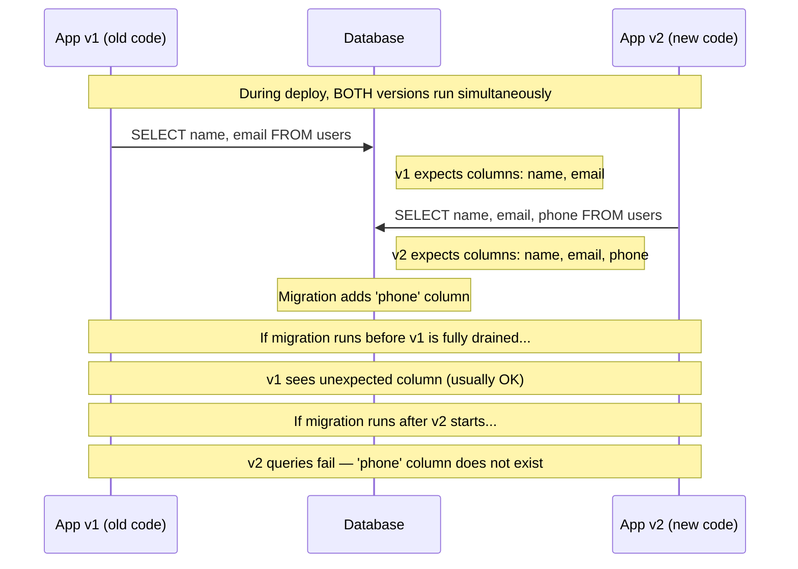
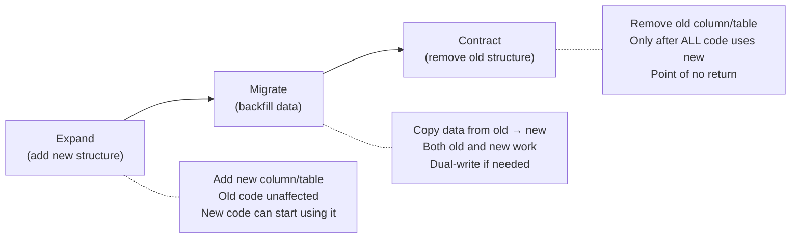
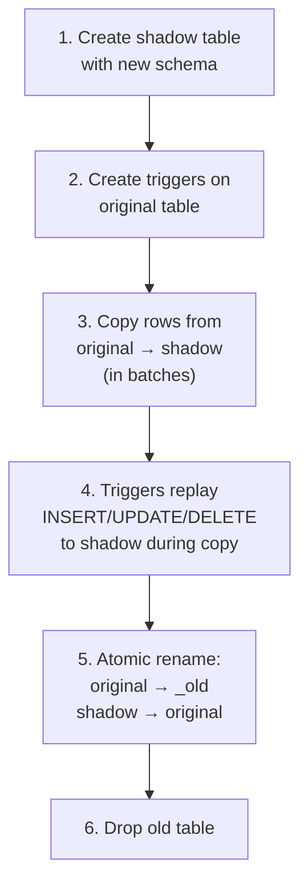
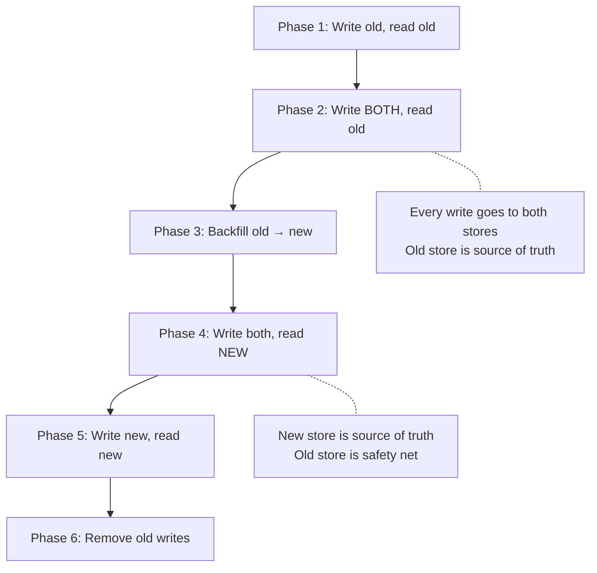

# Database Migration Strategies

Database migrations are the most dangerous routine operation in software engineering. A bad application deploy can be rolled back in seconds. A bad migration can lock your production database for hours, corrupt data irreversibly, or create a schema state that neither the old nor the new application version can handle.

The core tension is this: your application evolves continuously (dozens of deploys per day), but your database schema is a shared, stateful resource that every running instance depends on simultaneously. You cannot atomically swap a database schema the way you can atomically swap a container image. Every schema change must be carefully sequenced to maintain compatibility with running application code at every step.

This page covers the patterns, tools, and techniques for executing database migrations safely in production — from simple column additions to complex multi-step schema transformations — without downtime, data loss, or 3 AM pages.

## Why Migrations Are Dangerous

### The Lock Problem

Most DDL operations in traditional databases acquire a **schema lock** that blocks all queries on the affected table for the duration of the operation. On a small table this takes milliseconds. On a 500-million-row table, it can take minutes to hours.

```
Timeline of disaster:

14:00:00  ALTER TABLE orders ADD COLUMN tax_rate DECIMAL(5,2);
14:00:00  Schema lock acquired on 'orders' table
14:00:01  All SELECT/INSERT/UPDATE queries on 'orders' start queuing
14:00:01  Application connection pool fills up (waiting for locked queries)
14:00:02  Application health checks fail (no DB connections available)
14:00:03  Load balancer marks instances unhealthy
14:00:03  COMPLETE OUTAGE — zero requests being served
14:00:45  ALTER TABLE completes (45 seconds on 200M rows)
14:00:45  Lock released, queued queries execute
14:00:50  Connection pool recovers
14:00:55  Service restored after 55 seconds of total outage
```

55 seconds of downtime from a one-line migration. And that is a fast case — adding a column with a non-null default in older PostgreSQL versions rewrites every row, which on a large table can take 30+ minutes with the lock held the entire time.

### The Compatibility Problem

In a typical deployment, you have multiple application instances running simultaneously, and during a deploy, you have **both the old and new versions running at the same time**:



This means every migration must be **backward compatible** with the currently running application version AND **forward compatible** with the version being deployed. The migration and the deploy are not atomic — there is always a window where both versions coexist.

### The Rollback Problem

Application rollbacks are simple: deploy the previous container image. Database rollbacks are not:

- **Adding a column** can be rolled back by dropping it — but if the new code already wrote data to it, that data is lost.
- **Dropping a column** cannot be trivially rolled back — the data is gone.
- **Renaming a column** breaks old code that references the old name AND new code that references the new name during the transition.
- **Data migrations** (backfilling, transforming) may not be reversible if the original data was overwritten.

::: danger
"Just roll back the migration" is not a safe assumption. Every migration must be designed with forward-only safety in mind. If you must roll back, the rollback path should be explicitly planned and tested — not improvised under pressure.
:::

## The Expand/Contract Pattern

The expand/contract pattern (also called parallel change) is the fundamental strategy for zero-downtime schema changes. Every complex migration can be decomposed into a series of expand/contract steps.

### The Three Phases



**Example: Renaming a column from `username` to `display_name`**

This looks trivial, but a direct `ALTER TABLE users RENAME COLUMN username TO display_name` will instantly break every query that references `username`.

**Step 1 — Expand:** Add the new column.
```sql
-- Migration 001: Add new column (non-breaking)
ALTER TABLE users ADD COLUMN display_name VARCHAR(255);
```

**Step 2 — Dual-write:** Deploy code that writes to both columns.
```typescript
// Application code — writes to BOTH columns
await db.query(
  `UPDATE users SET username = $1, display_name = $1 WHERE id = $2`,
  [newName, userId]
);

// Reads from NEW column with fallback to old
const name = user.display_name ?? user.username;
```

**Step 3 — Backfill:** Copy existing data from old to new.
```sql
-- Migration 002: Backfill existing data
UPDATE users SET display_name = username WHERE display_name IS NULL;
```

**Step 4 — Switch reads:** Deploy code that reads only from the new column.
```typescript
// Application code — reads from new column only
const name = user.display_name;
```

**Step 5 — Contract:** Remove the old column (only after all application instances use the new column).
```sql
-- Migration 003: Remove old column (breaking if old code still runs)
ALTER TABLE users DROP COLUMN username;
```

::: tip
Each step is a separate migration AND a separate deploy. The expand/contract pattern trades migration simplicity for deployment safety. A one-line rename becomes three migrations and three deploys — but zero downtime.
:::

## Column Operations

### Adding a Column

Adding a nullable column with no default is the safest DDL operation — in most databases it is metadata-only and acquires the lock for milliseconds.

```sql
-- Safe: nullable, no default (metadata-only in PostgreSQL 11+)
ALTER TABLE orders ADD COLUMN notes TEXT;

-- Safe in PostgreSQL 11+: non-null with default (metadata-only)
-- The default is stored in pg_attribute, not written to every row
ALTER TABLE orders ADD COLUMN status VARCHAR(20) NOT NULL DEFAULT 'pending';

-- DANGEROUS in PostgreSQL < 11, MySQL < 8.0.12:
-- Rewrites every row to set the default value
ALTER TABLE orders ADD COLUMN status VARCHAR(20) NOT NULL DEFAULT 'pending';
```

::: warning
In PostgreSQL 11+, `ADD COLUMN ... DEFAULT ...` is metadata-only and fast. In older versions, it rewrites the entire table. Always check your database version before assuming a DDL operation is safe.
:::

### Dropping a Column

Never drop a column in the same deploy that stops using it. Follow the expand/contract pattern:

1. **Deploy code that no longer reads or writes the column** — this must be fully rolled out with zero references to the old column.
2. **Wait** — ensure no application instance references the column (at least one full deploy cycle).
3. **Drop the column** in a subsequent migration.

```sql
-- Step 1: Code deploy removes all references to 'legacy_status'
-- Step 2: Wait for full deploy rollout (all old pods drained)
-- Step 3: Drop the column
ALTER TABLE orders DROP COLUMN legacy_status;
```

In PostgreSQL, dropping a column does not rewrite the table — it marks the column as dropped in the catalog, and the space is reclaimed during VACUUM. This is a fast, safe operation as long as no running code references the column.

### Changing a Column Type

Changing a column type is one of the most dangerous operations because it often requires a full table rewrite and holds a lock for the duration.

```sql
-- DANGEROUS: rewrites entire table, holds lock
ALTER TABLE orders ALTER COLUMN amount TYPE NUMERIC(12,2);

-- Safe alternative: expand/contract
-- Step 1: Add new column
ALTER TABLE orders ADD COLUMN amount_v2 NUMERIC(12,2);

-- Step 2: Deploy dual-write code
-- Step 3: Backfill
UPDATE orders SET amount_v2 = amount::NUMERIC(12,2) WHERE amount_v2 IS NULL;

-- Step 4: Deploy code that reads from amount_v2
-- Step 5: Drop old column
ALTER TABLE orders DROP COLUMN amount;

-- Step 6 (optional): Rename new column
-- (or just keep the new name if renaming is too risky)
```

### Adding a NOT NULL Constraint

Adding a NOT NULL constraint on an existing column requires PostgreSQL to check every row, which can be slow on large tables. The safe approach:

```sql
-- Step 1: Add the constraint as NOT VALID (instant, does not scan)
ALTER TABLE orders ADD CONSTRAINT orders_status_not_null
  CHECK (status IS NOT NULL) NOT VALID;

-- Step 2: Validate the constraint (scans table but does NOT hold exclusive lock)
-- This acquires a SHARE UPDATE EXCLUSIVE lock — reads and writes continue
ALTER TABLE orders VALIDATE CONSTRAINT orders_status_not_null;

-- Step 3 (PostgreSQL 12+): Now you can safely add the real NOT NULL
-- PostgreSQL recognizes the existing CHECK constraint and skips the scan
ALTER TABLE orders ALTER COLUMN status SET NOT NULL;

-- Step 4: Drop the redundant CHECK constraint
ALTER TABLE orders DROP CONSTRAINT orders_status_not_null;
```

## Index Operations

### The CREATE INDEX Problem

A standard `CREATE INDEX` acquires a lock that blocks all writes to the table for the entire duration of the index build. On a 500M row table, this can be 10-30 minutes of write downtime.

### CREATE INDEX CONCURRENTLY

PostgreSQL's `CREATE INDEX CONCURRENTLY` builds the index without holding an exclusive lock. It scans the table twice and is slower overall, but allows reads and writes to continue.

```sql
-- DANGEROUS: blocks writes for duration of index build
CREATE INDEX idx_orders_customer ON orders (customer_id);

-- Safe: builds index without blocking writes
CREATE INDEX CONCURRENTLY idx_orders_customer ON orders (customer_id);
```

**Caveats of CONCURRENTLY:**
- Takes 2-3x longer than a regular `CREATE INDEX`
- Cannot run inside a transaction block (most migration tools handle this)
- If it fails partway through, it leaves an invalid index that must be dropped manually
- In PostgreSQL, check for invalid indexes: `SELECT * FROM pg_indexes WHERE indexdef LIKE '%INVALID%';`

```sql
-- Clean up a failed concurrent index build
DROP INDEX CONCURRENTLY IF EXISTS idx_orders_customer;
-- Then retry
CREATE INDEX CONCURRENTLY idx_orders_customer ON orders (customer_id);
```

### MySQL Index Operations

MySQL 8.0+ supports online DDL for most index operations:

```sql
-- MySQL online index creation (default in 8.0+)
ALTER TABLE orders ADD INDEX idx_customer (customer_id), ALGORITHM=INPLACE, LOCK=NONE;

-- Check online DDL support for your specific operation:
-- ALGORITHM=INPLACE: modifies table in place (no full copy)
-- LOCK=NONE: allows concurrent reads and writes
-- If MySQL rejects these options, the operation requires a table copy
```

## Table Operations (Online Schema Change Tools)

For operations that require table rewrites (changing primary key, changing storage engine, restructuring columns), dedicated online schema change tools avoid locking by using a shadow table approach.

### How Online Schema Change Works



### gh-ost (GitHub Online Schema Tooling)

GitHub's `gh-ost` is the most widely used online schema change tool for MySQL. It uses the binary log instead of triggers, which avoids trigger overhead on the original table.

```bash
# gh-ost: online ALTER TABLE for MySQL
gh-ost \
  --host=db-primary.internal \
  --database=myapp \
  --table=orders \
  --alter="ADD COLUMN tax_rate DECIMAL(5,2) DEFAULT 0.00" \
  --execute \
  --chunk-size=1000 \
  --max-load=Threads_running=25 \
  --critical-load=Threads_running=50 \
  --throttle-control-replicas=db-replica-1.internal \
  --max-lag-millis=1500

# Key flags:
# --chunk-size: rows copied per batch (tune for your write load)
# --max-load: throttle when MySQL load exceeds this threshold
# --critical-load: abort if load exceeds this threshold
# --max-lag-millis: pause if replica lag exceeds this
```

### pt-online-schema-change (Percona Toolkit)

Percona's tool uses triggers instead of binlog, which works on more MySQL configurations but adds trigger overhead.

```bash
pt-online-schema-change \
  --alter "ADD COLUMN tax_rate DECIMAL(5,2) DEFAULT 0.00" \
  --execute \
  --chunk-size=1000 \
  --max-lag=1 \
  --check-replication-filters \
  D=myapp,t=orders,h=db-primary.internal
```

### PlanetScale Branching

PlanetScale (built on Vitess) offers a Git-like branching model for database schemas:

```bash
# Create a branch from production
pscale branch create myapp add-tax-rate

# Apply migrations on the branch (safe sandbox)
pscale connect myapp add-tax-rate --port 3307
mysql -h 127.0.0.1 -P 3307 -e "ALTER TABLE orders ADD COLUMN tax_rate DECIMAL(5,2);"

# Create a deploy request (like a pull request for your schema)
pscale deploy-request create myapp add-tax-rate

# Review the schema diff
pscale deploy-request diff myapp 1

# Deploy (runs online schema change under the hood)
pscale deploy-request deploy myapp 1
```

### Comparison: Online Schema Change Tools

| Tool | Database | Mechanism | Pros | Cons |
|------|----------|-----------|------|------|
| **gh-ost** | MySQL | Binlog parsing | No triggers, throttling, testable | MySQL-only, more complex setup |
| **pt-osc** | MySQL | Triggers | Simpler, battle-tested | Trigger overhead, FK limitations |
| **PlanetScale** | MySQL (Vitess) | Managed service | Git-like workflow, zero-ops | Vendor lock-in, cost |
| **pgroll** | PostgreSQL | Shadow columns | Versioned schemas, auto dual-write | Newer, less battle-tested |
| **pg_repack** | PostgreSQL | Shadow table | Table reorganization | Does not handle schema changes |

## Data Backfill Patterns

After adding a new column, you often need to populate it with data derived from existing columns or external sources. Backfilling large tables requires careful batching to avoid overwhelming the database.

### Batch Backfill

```sql
-- BAD: updates all rows in one transaction
-- Holds a massive lock, generates huge WAL, fills replication lag
UPDATE orders SET tax_rate = 0.08 WHERE tax_rate IS NULL;

-- GOOD: batch update with throttling
DO $$
DECLARE
  batch_size INT := 10000;
  rows_updated INT;
BEGIN
  LOOP
    UPDATE orders
    SET tax_rate = 0.08
    WHERE id IN (
      SELECT id FROM orders
      WHERE tax_rate IS NULL
      ORDER BY id
      LIMIT batch_size
      FOR UPDATE SKIP LOCKED
    );

    GET DIAGNOSTICS rows_updated = ROW_COUNT;
    RAISE NOTICE 'Updated % rows', rows_updated;

    IF rows_updated = 0 THEN
      EXIT;
    END IF;

    -- Throttle: allow replication to catch up
    PERFORM pg_sleep(0.5);

    COMMIT;
  END LOOP;
END $$;
```

### Application-Level Backfill

For complex transformations, backfill from application code where you have access to business logic, external APIs, and better error handling.

```typescript
async function backfillTaxRate(db: Pool) {
  const BATCH_SIZE = 5000;
  let lastId = 0;
  let totalUpdated = 0;

  while (true) {
    // Fetch a batch using keyset pagination (not OFFSET)
    const batch = await db.query(
      `SELECT id, shipping_state FROM orders
       WHERE tax_rate IS NULL AND id > $1
       ORDER BY id LIMIT $2`,
      [lastId, BATCH_SIZE]
    );

    if (batch.rows.length === 0) break;

    // Calculate tax rate using business logic
    const updates = batch.rows.map(order => ({
      id: order.id,
      taxRate: calculateTaxRate(order.shipping_state)
    }));

    // Batch update
    await db.query(
      `UPDATE orders SET tax_rate = data.tax_rate
       FROM (SELECT unnest($1::int[]) AS id, unnest($2::numeric[]) AS tax_rate) AS data
       WHERE orders.id = data.id`,
      [updates.map(u => u.id), updates.map(u => u.taxRate)]
    );

    lastId = batch.rows[batch.rows.length - 1].id;
    totalUpdated += batch.rows.length;

    console.log(`Backfilled ${totalUpdated} rows, last_id=${lastId}`);

    // Throttle to avoid overwhelming the database
    await sleep(200);
  }

  console.log(`Backfill complete: ${totalUpdated} rows updated`);
}
```

### Lazy Backfill (Read-Time Migration)

Instead of backfilling all data at once, populate the new column when each row is read. This spreads the migration over time and avoids batch load.

```typescript
async function getOrder(orderId: string): Promise<Order> {
  const order = await db.query('SELECT * FROM orders WHERE id = $1', [orderId]);

  // Lazy backfill: if new column is null, compute and write it
  if (order.tax_rate === null) {
    const taxRate = calculateTaxRate(order.shipping_state);
    await db.query(
      'UPDATE orders SET tax_rate = $1 WHERE id = $2',
      [taxRate, orderId]
    );
    order.tax_rate = taxRate;
  }

  return order;
}
```

::: warning
Lazy backfill works well for hot data (recently accessed rows) but leaves cold data un-migrated indefinitely. Combine with a slow background batch backfill to ensure eventually all rows are migrated.
:::

## The Dual-Write Pattern

When migrating between two data stores (old table to new table, one database to another), the dual-write pattern ensures data consistency during the transition.



```typescript
// Phase 2: Dual-write, read old
async function createOrder(order: Order) {
  // Write to old store (source of truth)
  await oldDb.insert('orders', order);

  // Write to new store (best effort — failures logged but not blocking)
  try {
    await newDb.insert('orders', transformForNewSchema(order));
  } catch (error) {
    logger.error('Dual-write to new store failed', { orderId: order.id, error });
    // Queue for retry — do NOT fail the request
    await retryQueue.enqueue('dual-write', { order });
  }
}

// Phase 4: Dual-write, read NEW
async function getOrder(orderId: string) {
  // Read from new store (source of truth has shifted)
  const order = await newDb.query('SELECT * FROM orders WHERE id = $1', [orderId]);

  // Shadow read from old store for comparison (optional, for validation)
  if (config.shadowReadEnabled) {
    const oldOrder = await oldDb.query('SELECT * FROM orders WHERE id = $1', [orderId]);
    if (!deepEqual(order, transformForNewSchema(oldOrder))) {
      logger.warn('Shadow read mismatch', { orderId, diff: computeDiff(order, oldOrder) });
    }
  }

  return order;
}
```

::: tip
The dual-write pattern is complex and error-prone. If you can use a simpler approach (expand/contract on the same database), prefer that. Dual-write is necessary when migrating between different database systems (e.g., MySQL to PostgreSQL, monolith DB to microservice DB).
:::

## Blue-Green Database Deployments

Blue-green for databases is harder than blue-green for application servers because you cannot run two independent copies of a stateful database without data divergence.

### The Replication Approach

```
Blue Environment (current production):
  App v1 → Primary DB (blue)
                  ↓ replication
            Replica DB (green) ← staged schema changes applied here

Green Environment (staging):
  App v2 → Replica DB (green, promoted to primary after cutover)
```

**Steps:**
1. Set up logical replication from blue primary to green replica
2. Apply schema migrations on the green replica (it diverges from blue)
3. Deploy app v2 to green environment, pointing at green DB
4. Test green environment thoroughly
5. Cutover: promote green to primary, redirect traffic
6. Blue becomes the fallback (but data written to green after cutover is not replicated back)

::: danger
Blue-green database deployments are the most complex migration pattern. The replication lag during cutover can cause data loss if writes to blue are not fully replicated to green before promotion. Most teams use simpler patterns (expand/contract, feature flags) unless they have specific reasons to need blue-green databases.
:::

## Migration Tools

### Tool Comparison

| Tool | Language | SQL / ORM | Rollback | Key Feature |
|------|----------|-----------|----------|-------------|
| **Flyway** | Java (any DB) | Raw SQL | Undo migrations (paid) | Convention-based versioning, simple |
| **Liquibase** | Java (any DB) | XML/YAML/SQL | Auto-rollback generation | Changelog-based, diff support |
| **Alembic** | Python (SQLAlchemy) | Python + SQL | Downgrade functions | Auto-generation from model diffs |
| **Prisma Migrate** | TypeScript | Prisma schema | Not built-in | Type-safe schema, shadow DB |
| **Drizzle Kit** | TypeScript | Drizzle schema | Manual | Lightweight, SQL-first |
| **Rails Migrations** | Ruby | Ruby DSL | `down` method | Convention-over-configuration |
| **Knex** | JavaScript | JS builder | `down` function | Minimal, flexible |
| **golang-migrate** | Go | Raw SQL | Down migrations | CLI + library, database agnostic |
| **dbmate** | Any (CLI) | Raw SQL | Down migrations | Simple CLI, no runtime dependency |

### Flyway Example

```sql
-- V001__create_orders.sql (versioned migration)
CREATE TABLE orders (
  id BIGSERIAL PRIMARY KEY,
  customer_id BIGINT NOT NULL REFERENCES customers(id),
  total NUMERIC(12,2) NOT NULL,
  status VARCHAR(20) NOT NULL DEFAULT 'pending',
  created_at TIMESTAMPTZ NOT NULL DEFAULT NOW()
);

CREATE INDEX idx_orders_customer ON orders (customer_id);
CREATE INDEX idx_orders_status ON orders (status);
```

```bash
# Run pending migrations
flyway -url=jdbc:postgresql://localhost:5432/myapp migrate

# Check migration status
flyway -url=jdbc:postgresql://localhost:5432/myapp info
```

### Alembic Example (Python)

```python
# alembic/versions/001_add_tax_rate.py
"""Add tax_rate column to orders"""

revision = '001'
down_revision = None

from alembic import op
import sqlalchemy as sa

def upgrade():
    op.add_column('orders', sa.Column('tax_rate', sa.Numeric(5, 2), nullable=True))

def downgrade():
    op.drop_column('orders', 'tax_rate')
```

### Prisma Migrate Example

```prisma
// schema.prisma
model Order {
  id         Int      @id @default(autoincrement())
  customerId Int      @map("customer_id")
  total      Decimal  @db.Decimal(12, 2)
  taxRate    Decimal? @map("tax_rate") @db.Decimal(5, 2) // new field
  status     String   @default("pending") @db.VarChar(20)
  createdAt  DateTime @default(now()) @map("created_at")

  customer Customer @relation(fields: [customerId], references: [id])

  @@map("orders")
  @@index([customerId])
  @@index([status])
}
```

```bash
# Generate migration SQL from schema diff
npx prisma migrate dev --name add-tax-rate

# Apply in production (does not use shadow DB)
npx prisma migrate deploy
```

### Drizzle Kit Example

```typescript
// drizzle/schema.ts
import { pgTable, serial, bigint, decimal, varchar, timestamp } from 'drizzle-orm/pg-core';

export const orders = pgTable('orders', {
  id: serial('id').primaryKey(),
  customerId: bigint('customer_id', { mode: 'number' }).notNull(),
  total: decimal('total', { precision: 12, scale: 2 }).notNull(),
  taxRate: decimal('tax_rate', { precision: 5, scale: 2 }), // new column
  status: varchar('status', { length: 20 }).notNull().default('pending'),
  createdAt: timestamp('created_at', { withTimezone: true }).notNull().defaultNow(),
});
```

```bash
# Generate migration
npx drizzle-kit generate

# Apply migration
npx drizzle-kit migrate
```

## Rollback Strategies

### Migration Rollback Hierarchy

```
Safest ────────────────────────────────────────────── Riskiest

Forward-fix    > Additive reverse  > Down migration   > Point-in-time
(deploy new       (add column        (DROP what          recovery (PITR)
 migration         back)              was ADDed)          from backup)
 that fixes)
```

**Forward-fix** is almost always the right choice. Instead of rolling back a migration, deploy a new migration that corrects the problem. This avoids the data loss and compatibility issues of reverse migrations.

**Down migrations** are useful in development but dangerous in production because they may drop columns containing user data. Many teams disable down migrations in production entirely.

```typescript
// Migration tool config: disable down migrations in production
const config = {
  direction: process.env.NODE_ENV === 'production' ? 'up-only' : 'both',
};
```

## Testing Migrations

### Shadow Database Testing

Prisma Migrate and similar tools use a shadow database to test migrations:

```
1. Create a temporary empty database (shadow)
2. Apply ALL migrations from scratch on shadow
3. Diff the shadow schema against the desired schema
4. Generate a new migration from the diff
5. Drop the shadow database

This ensures:
- Migrations are ordered correctly
- Each migration is syntactically valid
- The full migration history produces the expected schema
```

### Pre-Production Validation

```bash
#!/bin/bash
# Migration dry-run script

# 1. Restore a recent production backup to a test database
pg_restore --dbname=migration_test --no-owner production_backup.dump

# 2. Apply the pending migration
flyway -url=jdbc:postgresql://localhost:5432/migration_test migrate

# 3. Run schema comparison
pg_dump --schema-only migration_test > actual_schema.sql
diff expected_schema.sql actual_schema.sql

# 4. Run application smoke tests against the migrated database
APP_DATABASE_URL=postgresql://localhost:5432/migration_test npm test

# 5. Check migration timing on production-sized data
\time flyway -url=jdbc:postgresql://localhost:5432/migration_test migrate

# 6. Clean up
dropdb migration_test
```

### Linting Migrations

Tools like `squawk` (PostgreSQL) catch dangerous migration patterns before they reach production:

```bash
# Install squawk (PostgreSQL migration linter)
npm install -g squawk-cli

# Lint a migration file
squawk migration.sql

# Example output:
# migration.sql:1:1: warning: prefer-robust-stmts
#   Adding a column with a volatile DEFAULT will lock the table.
#   Use: ALTER TABLE ... ADD COLUMN ... ; then UPDATE in batches.
#
# migration.sql:5:1: error: ban-drop-column
#   Dropping a column is irreversible in production.
#   Use the expand/contract pattern instead.
```

## Common Disasters and How to Avoid Them

| Disaster | What Happens | Prevention |
|----------|-------------|------------|
| **Lock timeout cascade** | DDL waits for running queries, incoming queries wait for DDL, connection pool exhausts | Set `lock_timeout` before DDL: `SET lock_timeout = '5s'` — retry if it fails instead of blocking |
| **Replication lag spiral** | Large migration generates massive WAL, replicas fall behind, reads fail | Batch backfills, throttle by replica lag, use `--max-lag-millis` in gh-ost |
| **Incompatible deploy order** | Migration runs but old code still references dropped column | Always deploy code that stops using the column BEFORE migrating to drop it |
| **Transaction wraparound** | Long-running migration prevents VACUUM, `xid` wraparound approaches | Monitor `age(datfrozenxid)`, avoid multi-hour transactions |
| **Disk space exhaustion** | Table rewrite doubles disk usage during migration | Check free disk (need 2x table size + indexes), schedule during low-traffic |
| **Backup window conflict** | Migration overlaps with backup, both compete for I/O | Schedule migrations outside backup windows |
| **Foreign key deadlock** | Adding FK constraint on large table with concurrent writes | Add FK as `NOT VALID` first, then `VALIDATE` separately |
| **Enum type change** | Adding a value to a PostgreSQL ENUM requires `ALTER TYPE` inside a transaction | Use a lookup table instead of ENUM, or add values with `ALTER TYPE ... ADD VALUE` (cannot be in transaction in PG < 12) |

### The Lock Timeout Pattern

Always set a lock timeout before running DDL in production:

```sql
-- Set a 5-second lock timeout
SET lock_timeout = '5s';

-- Attempt the migration
ALTER TABLE orders ADD COLUMN notes TEXT;

-- If the lock cannot be acquired in 5 seconds, the statement fails
-- with: ERROR: canceling statement due to lock timeout
-- This is MUCH better than blocking all queries indefinitely

-- Reset for safety
RESET lock_timeout;
```

```python
# In migration code: retry with lock timeout
import time

MAX_RETRIES = 5
for attempt in range(MAX_RETRIES):
    try:
        with db.begin():
            db.execute("SET lock_timeout = '5s'")
            db.execute("ALTER TABLE orders ADD COLUMN notes TEXT")
            db.execute("RESET lock_timeout")
        break  # Success
    except OperationalError as e:
        if 'lock timeout' in str(e):
            wait = 2 ** attempt  # Exponential backoff
            print(f"Lock timeout, retrying in {wait}s (attempt {attempt + 1})")
            time.sleep(wait)
        else:
            raise
```

---

## Key Takeaway

::: tip Key Takeaway
Every database migration in production should be decomposed into additive, backward-compatible steps using the expand/contract pattern. The "simple" one-line ALTER TABLE that works instantly in development can lock a production table for minutes, break running application instances, and create a state that is impossible to roll back from. The extra deploys and migrations are the price of zero downtime — and that price is always worth paying.
:::

---

## Misconceptions

::: danger 6 Database Migration Misconceptions

**1. "Adding a column is always safe."**
Adding a nullable column with no default is usually safe (metadata-only in modern PostgreSQL/MySQL). But adding a column with a `NOT NULL DEFAULT` in older database versions rewrites every row and holds a lock for the entire duration. Always verify the behavior for your specific database version.

**2. "Down migrations are a safety net for production."**
Down migrations are a development convenience. In production, a down migration that drops a column destroys any data written to that column since the up migration ran. Forward-fix (deploying a corrective migration) is almost always safer than rolling back.

**3. "I can rename a column in one step."**
A direct `ALTER TABLE RENAME COLUMN` breaks all running code that references the old name. The safe approach is a multi-step expand/contract: add new column, dual-write, backfill, switch reads, drop old column. Three migrations and three deploys for a "rename."

**4. "ORMs handle migrations safely."**
ORMs generate migration SQL, but they do not guarantee zero-downtime safety. Prisma, Django, Rails, and Alembic will all happily generate `DROP COLUMN` or `ALTER TYPE` statements that lock tables or destroy data. You must review the generated SQL and modify it for production safety.

**5. "Testing migrations in staging is sufficient."**
Staging databases are typically 100-1000x smaller than production. A migration that takes 50ms on staging takes 45 minutes on production. Test migration timing on a production-sized replica or backup, not just staging.

**6. "Online schema change tools eliminate all risk."**
gh-ost and pt-online-schema-change reduce lock duration but add complexity: they double disk usage during the migration (shadow table), they can fail partway through (requiring cleanup), and they add write amplification via triggers or binlog replay. They are essential tools but not magic bullets.
:::

---

## When NOT to Use Zero-Downtime Patterns

| Scenario | Why Not | What to Do Instead |
|----------|---------|-------------------|
| Development and staging environments | No users to protect, extra complexity slows iteration | Use direct ALTER TABLE, DROP COLUMN, etc. |
| Tables with fewer than ~100K rows | DDL completes in milliseconds even with locks | Direct DDL is fine; the lock is imperceptible |
| Scheduled maintenance window available | If users accept planned downtime, simplify the migration | Use direct DDL during the window |
| Greenfield project with no production data | No data to preserve, no running code to break | Destroy and recreate the database freely |
| One-time data import (initial load) | No concurrent users during import | Bulk load without batching or throttling |
| Personal projects and prototypes | No SLA, no on-call, no customers | Move fast, fix later |

---

## In Production

::: warning Production Considerations

**Always set lock_timeout.** Before any DDL in production, `SET lock_timeout = '5s'`. This prevents the cascading connection pool exhaustion that turns a slow migration into a full outage. If the lock times out, retry with backoff.

**Monitor replica lag during backfills.** Large batch updates generate WAL entries that replicas must replay. If replica lag grows beyond your threshold (usually 1-5 seconds), pause the backfill. gh-ost and pt-online-schema-change have this built in; for manual backfills, check `pg_stat_replication` between batches.

**Test on production-sized data.** The most common migration disaster is "it took 50ms in staging and 45 minutes in production." Restore a production backup to a test instance and time your migration there. This is non-negotiable for tables over 10M rows.

**Review generated SQL.** If you use an ORM migration tool (Prisma, Alembic, Rails), always review the generated SQL before applying to production. The tool does not know your uptime requirements — it generates the simplest possible DDL, which may not be safe.

**Coordinate migrations with deploys.** The expand/contract pattern requires that code changes and migrations ship in a specific order. Document the sequence explicitly: "Deploy PR #1234 (add dual-write) THEN run migration 003 THEN deploy PR #1235 (remove old reads) THEN run migration 004."

**Keep a migration runbook.** For any migration on a table over 50M rows, write a one-page runbook: expected duration, monitoring queries to run during migration, abort criteria, rollback steps if something goes wrong. Review the runbook with a second engineer before executing.
:::

---

## Quiz

::: details Quiz — 7 Questions

**Q1: Why can't you atomically swap a database schema the way you swap a container image?**
A container image is stateless — you replace one immutable artifact with another. A database schema is shared, stateful infrastructure that all running application instances depend on simultaneously. During a deploy, both old and new application versions coexist and must both be compatible with the database schema. There is no atomic cutover point where all instances and the schema change simultaneously.

**Q2: What is the expand/contract pattern?**
A three-phase approach to zero-downtime schema changes: (1) Expand — add the new structure (column, table) alongside the old one, without removing anything. (2) Migrate — backfill data from old to new, optionally dual-writing. (3) Contract — remove the old structure after all code uses the new one. Each phase is a separate migration and deploy, ensuring backward compatibility at every step.

**Q3: Why is `CREATE INDEX CONCURRENTLY` important?**
A standard `CREATE INDEX` acquires an exclusive lock that blocks all writes for the duration of the index build, which can be minutes to hours on large tables. `CREATE INDEX CONCURRENTLY` builds the index without holding an exclusive lock, allowing reads and writes to continue. It takes longer overall but avoids write downtime.

**Q4: What is the difference between gh-ost and pt-online-schema-change?**
Both perform online schema changes for MySQL using a shadow table approach. gh-ost reads the binary log to capture changes made to the original table during migration — it does not add triggers. pt-online-schema-change uses triggers on the original table to replay changes to the shadow table. gh-ost's approach avoids trigger overhead on the original table but requires binlog access.

**Q5: Why is a direct ALTER TABLE RENAME COLUMN dangerous in production?**
During a deploy, both old and new application versions run simultaneously. Old code references the old column name; new code references the new name. A rename breaks whichever version does not match the current column name. The safe approach is the expand/contract pattern: add new column, dual-write, backfill, switch reads, drop old column.

**Q6: What is the lock timeout pattern and why is it critical?**
Before running any DDL in production, set `lock_timeout` (e.g., 5 seconds). If the DDL cannot acquire the lock within that time, it fails immediately instead of blocking indefinitely. Without a lock timeout, a DDL statement can queue behind long-running queries, and all subsequent queries queue behind the DDL, cascading into full connection pool exhaustion and a complete outage.

**Q7: When should you use a dual-write pattern versus expand/contract?**
Use expand/contract when changing schema within the same database — it is simpler and avoids distributed consistency challenges. Use dual-write when migrating between different databases or data stores (e.g., MySQL to PostgreSQL, monolith DB to microservice DB) where you need to keep both stores in sync during the transition period.
:::

---

## Exercise

::: details Database Migration Exercise

**Scenario:** You have a production PostgreSQL database with a `users` table containing 150 million rows. The table currently has:

```sql
CREATE TABLE users (
  id BIGSERIAL PRIMARY KEY,
  email VARCHAR(255) NOT NULL UNIQUE,
  name VARCHAR(100),
  created_at TIMESTAMPTZ NOT NULL DEFAULT NOW()
);
```

You need to make the following changes:
1. Split the `name` column into `first_name` and `last_name`
2. Add a `phone` column with a unique constraint
3. Add a `status` column that must be NOT NULL with a default of `'active'`
4. Create a composite index on `(status, created_at DESC)`

**Part 1 — Plan the migration sequence**
Write out each migration step in order, specifying:
- The SQL for each migration
- Which deploy (code change) must happen before or after each migration
- Whether each step is safe to run without downtime

**Part 2 — Write the backfill**
Write a batched backfill script (SQL or application code) that splits the `name` column into `first_name` and `last_name` for all 150M rows without overwhelming the database.

**Part 3 — Handle the edge cases**
- What happens if the backfill fails halfway through?
- How do you handle rows where `name` has no space (single name)?
- What is your rollback plan if the migration causes production issues?
- How do you validate that the migration completed correctly?

**Evaluation criteria:**
- Uses expand/contract pattern (not direct renames or drops)
- Sets `lock_timeout` before DDL
- Uses `CREATE INDEX CONCURRENTLY` for the composite index
- Adds NOT NULL constraint using the `NOT VALID` + `VALIDATE` two-step approach
- Backfill is batched with throttling
- Each step maintains backward compatibility with running code
:::

---

## One-Liner Summary

Database migrations are the most dangerous routine operation in production — decompose every schema change into additive, backward-compatible expand/contract steps, batch your backfills, set lock timeouts, and test on production-sized data because staging lies.

---

## Further Reading

- [PostgreSQL Internals](/system-design/databases/postgres-internals) — understanding WAL, VACUUM, and lock mechanics behind migrations
- [Indexing Deep Dive](/system-design/databases/indexing-deep-dive) — B+tree internals and why index builds are expensive
- [Connection Pooling](/system-design/databases/connection-pooling) — how migrations interact with connection pools
- [Replication](/system-design/databases/replication) — replication lag during migrations and how to manage it
- [Deployment Strategies](/devops/deployment-strategies/) — coordinating code deploys with migrations
- [Incident Response Playbook](/devops/incident-response/incident-response-playbook) — what to do when a migration goes wrong
