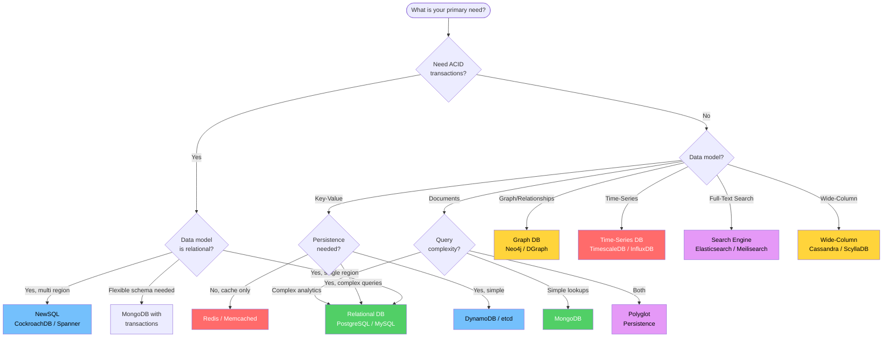
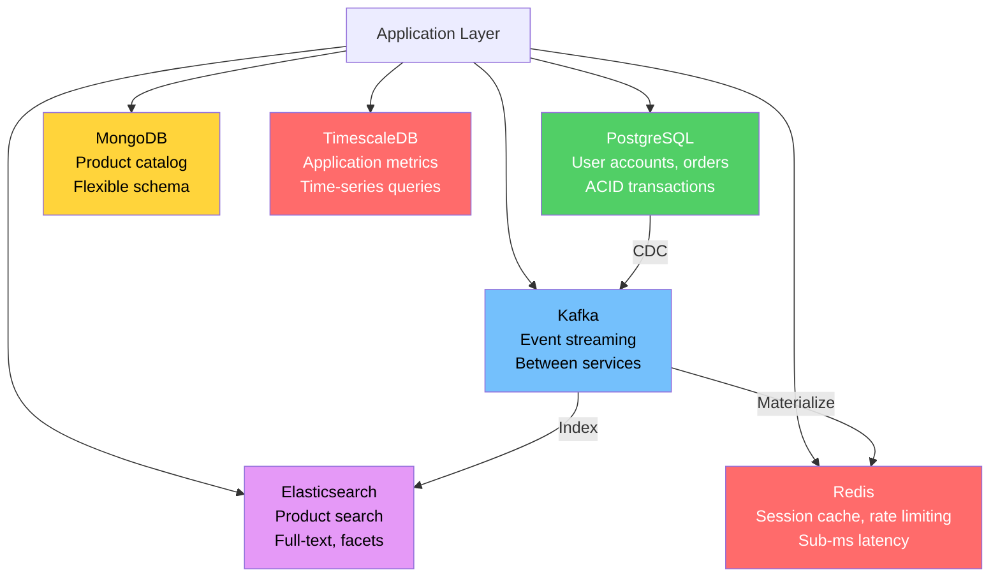

# Database Selection Guide

Choosing the wrong database is one of the most expensive mistakes an engineering team can make. It rarely causes immediate failure — instead, it manifests as a slow bleed: queries that degrade as data grows, schema migrations that take days, operational complexity that drains the team, or scaling walls that require a full rewrite to overcome.

This guide is not a feature comparison chart. It is a decision framework grounded in workload analysis, access patterns, and operational trade-offs. It covers every major category of database, explains when each excels and when each fails, and provides a concrete methodology for making the decision.

## The Decision Framework

Before looking at any database, answer these five questions about your workload:

### 1. What is the dominant access pattern?

| Pattern | Characteristics | Database Categories |
|---------|----------------|-------------------|
| Key-value lookups | Get/set by primary key, sub-millisecond latency | Key-Value (Redis, DynamoDB) |
| OLTP (transactional) | Mixed reads/writes, JOINs, ACID transactions | Relational (PostgreSQL, MySQL), NewSQL |
| OLAP (analytical) | Aggregations over large datasets, few writes | Columnar (ClickHouse, BigQuery, DuckDB) |
| Document retrieval | Fetch/update semi-structured documents by various fields | Document (MongoDB, CouchDB) |
| Graph traversal | Traverse relationships between entities, multi-hop queries | Graph (Neo4j, DGraph) |
| Time-range queries | Query events by time range, downsampling, retention | Time-Series (TimescaleDB, InfluxDB) |
| Full-text search | Relevance-ranked text queries, faceted search | Search (Elasticsearch, Meilisearch) |
| Global distribution | Consistent reads/writes across continents | NewSQL (Spanner, CockroachDB) |

### 2. What are the consistency requirements?

$$
\text{Consistency spectrum:}\quad \underbrace{\text{Eventual}}_{\text{DynamoDB, Cassandra}} \longleftrightarrow \underbrace{\text{Causal}}_{\text{MongoDB}} \longleftrightarrow \underbrace{\text{Linearizable}}_{\text{Spanner, CockroachDB}}
$$

### 3. What is the read-to-write ratio?

| Ratio | Implications |
|-------|-------------|
| Read-heavy (100:1) | Optimize for read latency, caching layers, read replicas |
| Mixed (10:1) | B-tree storage engines, standard OLTP databases |
| Write-heavy (1:1 or write-dominant) | LSM-tree engines, append-only stores, time-series DBs |

### 4. What is the expected data volume?

| Scale | Single Node | Distributed Required |
|-------|------------|---------------------|
| < 100 GB | Any database works | Not needed |
| 100 GB - 1 TB | Careful indexing, consider partitioning | Optional |
| 1 TB - 10 TB | Partitioning essential, consider sharding | Likely |
| > 10 TB | Single node is impractical | Yes |

### 5. What is the team's operational capacity?

This is the most overlooked question. A database that requires a dedicated DBA team to operate is wrong for a 3-person startup, regardless of its technical merits.

## The Decision Flowchart

## Relational Databases

Relational databases remain the correct default choice for most applications. If you have no specific reason to choose something else, choose PostgreSQL.

### PostgreSQL

**Strengths:**
- The most feature-complete open-source database — JSON support, full-text search, geospatial (PostGIS), time-series (TimescaleDB extension), graph queries (recursive CTEs), pub/sub (LISTEN/NOTIFY)
- Advanced indexing: B-tree, Hash, GIN, GiST, SP-GiST, BRIN, Bloom
- MVCC with snapshot isolation — readers never block writers
- Extensible: custom types, custom operators, custom index methods, foreign data wrappers
- Mature replication (streaming, logical), partitioning (declarative since v10)
- Excellent query planner with cost-based optimization

**Weaknesses:**
- Write amplification from MVCC (dead tuples require VACUUM)
- No native multi-master replication (requires extensions like BDR or Citus)
- Connection model (one process per connection) limits concurrency — requires PgBouncer
- Horizontal scaling requires manual sharding or Citus extension
- Replication is asynchronous by default — promoting a replica can lose the most recent transactions

**Ideal workload:** General-purpose OLTP, mixed read/write, moderate to complex queries, applications that evolve their schema over time.

**Anti-patterns:** High-velocity append-only writes (> 100K inserts/second on a single node), key-value lookups where the relational model adds overhead, workloads that need global distribution out of the box.

### MySQL

**Strengths:**
- Battle-tested at massive scale (Meta, Uber, GitHub, Shopify)
- InnoDB storage engine with clustered primary key index — range scans on primary key are very fast
- Excellent replication ecosystem (MySQL Group Replication, Vitess for sharding)
- Lower memory overhead per connection than PostgreSQL
- Simpler operational model than PostgreSQL

**Weaknesses:**
- Weaker query planner than PostgreSQL — common to need query hints
- Fewer index types (no GIN, GiST, BRIN)
- JSON support is functional but less performant than PostgreSQL's JSONB
- Character set and collation issues are a recurring source of bugs
- Default isolation level is REPEATABLE READ (not READ COMMITTED like PostgreSQL) — can cause unexpected lock waits

**Ideal workload:** High-throughput OLTP with simple queries, web applications, read-heavy workloads with read replicas.

**Anti-patterns:** Complex analytical queries, heavy use of JSON data, applications needing advanced index types.

### SQLite

**Strengths:**
- Embedded — no server, no configuration, single-file database
- Zero administration, zero operational overhead
- Surprisingly fast for read-heavy, single-writer workloads
- Perfect for local-first applications (mobile, desktop, Electron apps)
- Full ACID compliance with WAL mode

**Weaknesses:**
- Single writer at a time (readers don't block, but writers do)
- No network access — single machine only (unless using Litestream or LiteFS for replication)
- No built-in user management or access control
- Limited concurrent write throughput

**Ideal workload:** Embedded applications, local caches, prototyping, mobile apps, configuration stores, edge computing.

**Anti-patterns:** Multi-user web applications with concurrent writes, any workload requiring horizontal scaling, multi-machine deployments.

## Document Databases

Document databases store data as semi-structured documents (JSON/BSON), providing schema flexibility at the cost of weaker consistency guarantees and no JOINs (by default).

### MongoDB

**Strengths:**
- Flexible schema — fields can vary between documents in the same collection
- Rich query language with aggregation pipeline
- Built-in horizontal scaling (sharded clusters)
- Change streams for real-time event processing
- Multi-document ACID transactions (since 4.0)
- Atlas fully managed service with global clusters

**Weaknesses:**
- No JOINs by default — `$lookup` exists but is limited and slow compared to relational JOINs
- Schema flexibility becomes a liability without schema validation — data quality degrades over time
- 16 MB document size limit
- Transactions have significant performance overhead and a 60-second time limit
- WiredTiger cache pressure under high write loads
- Shard key is immutable after creation (until 5.0 resharding)

**Ideal workload:** Content management, product catalogs, user profiles, event logging, mobile backends — any workload with semi-structured data that is read by primary key or a few indexed fields.

**Anti-patterns:** Highly relational data with many relationships (use a relational DB), workloads requiring complex JOINs across collections, financial systems requiring strict transaction semantics across many collections.

### CouchDB

**Strengths:**
- Master-master replication — every node accepts writes
- Built-in conflict resolution with revision trees
- HTTP/REST API — no driver needed
- Offline-first synchronization (CouchDB + PouchDB)
- Excellent for intermittently connected clients

**Weaknesses:**
- Limited query capabilities compared to MongoDB
- Views require MapReduce functions (slow development cycle)
- Compaction can be I/O-intensive
- Smaller community and ecosystem than MongoDB

**Ideal workload:** Offline-first mobile/web apps, data synchronization between edge devices and cloud, collaborative applications.

**Anti-patterns:** Real-time analytics, workloads requiring complex queries, high-throughput OLTP.

## Key-Value Databases

Key-value stores are the simplest and fastest category — they store data as opaque values indexed by a single key.

### Redis

**Strengths:**
- Sub-millisecond latency — all data in memory
- Rich data structures: strings, hashes, lists, sets, sorted sets, streams, bitmaps, HyperLogLog
- Pub/sub messaging
- Lua scripting for atomic multi-step operations
- Redis Cluster for horizontal scaling
- Persistence options: RDB snapshots, AOF (append-only file), or both

**Weaknesses:**
- Data set must fit in memory (or use Redis on Flash)
- Single-threaded command execution (I/O is multi-threaded since Redis 6)
- Cluster mode does not support multi-key transactions across hash slots
- Not suitable as a primary database — data loss is possible during failover
- No built-in query language — application must know the key

**Ideal workload:** Caching, session storage, rate limiting, leaderboards (sorted sets), real-time analytics (HyperLogLog), message queues (streams), distributed locks.

**Anti-patterns:** Primary data store for critical data, workloads requiring complex queries, data sets larger than available RAM.

### DynamoDB

**Strengths:**
- Fully managed, serverless — zero operational overhead
- Single-digit millisecond latency at any scale
- Auto-scaling capacity
- Global tables for multi-region, active-active replication
- Transactions across multiple items and tables
- DynamoDB Streams (similar to MongoDB change streams)

**Weaknesses:**
- Extremely limited query model — primary key lookups and partition key + sort key ranges only
- Scans are expensive and slow
- No JOINs, no aggregations (must denormalize everything)
- Pricing model can be surprising — read/write capacity units are hard to estimate
- 400 KB item size limit
- Hot partitions can cause throttling

**Ideal workload:** Serverless applications, gaming leaderboards, IoT data ingestion, session management, shopping carts — any workload with well-defined access patterns.

**Anti-patterns:** Ad-hoc queries, analytical workloads, workloads where access patterns are unknown or change frequently, applications requiring complex queries.

::: warning The DynamoDB Single-Table Design Trap
DynamoDB advocates often promote "single-table design" — cramming all entities into one table with overloaded partition and sort keys. While this can work, it makes the data model extremely hard to understand, evolve, and debug. It requires knowing ALL access patterns upfront. If your access patterns change, you may need to migrate the entire table. Use single-table design only if you have stable, well-understood access patterns AND you need the performance benefits.
:::

### etcd

**Strengths:**
- Strongly consistent (linearizable) key-value store
- Raft-based consensus — proven correctness
- Watch API for change notifications
- Lease-based TTLs for ephemeral keys
- Foundation of Kubernetes (stores all cluster state)

**Weaknesses:**
- Not designed for large data volumes (recommended max: 8 GB)
- Limited throughput (~10K writes/second)
- No rich query support — key prefix scans only
- Not suitable for application data storage

**Ideal workload:** Configuration management, service discovery, leader election, distributed locking, feature flags.

**Anti-patterns:** Application data storage, large datasets, high-throughput workloads, anything requiring queries beyond key lookups.

## Wide-Column Databases

Wide-column stores organize data by columns rather than rows, with flexible column families. They excel at massive-scale, write-heavy workloads.

### Cassandra

**Strengths:**
- Linear horizontal scalability — add nodes, get proportionally more throughput
- No single point of failure — masterless, peer-to-peer architecture
- Tunable consistency (ONE, QUORUM, ALL)
- Excellent write throughput (LSM-tree storage engine)
- Multi-datacenter replication built-in
- Time-series data with TTL per row

**Weaknesses:**
- Limited query model — must design tables around query patterns (no ad-hoc queries)
- No JOINs, no subqueries, no aggregations (beyond basic COUNT, SUM)
- Data modeling requires denormalization — one table per query pattern
- Eventual consistency by default — reading your own writes requires QUORUM reads
- Compaction can cause latency spikes
- Tombstones from deletes can cause performance problems
- Operational complexity — tuning, repair, compaction strategies

**Ideal workload:** High-velocity writes (IoT, event logging, messaging), time-series data, workloads with known query patterns and no need for ad-hoc queries.

**Anti-patterns:** Workloads requiring complex queries, data with many relationships, applications where access patterns change frequently, small datasets (overhead not justified).

### ScyllaDB

**Strengths:**
- Drop-in Cassandra replacement written in C++ (vs Cassandra's Java)
- 10x lower latency and higher throughput than Cassandra due to shard-per-core architecture
- No garbage collection pauses (no JVM)
- Built-in workload prioritization and I/O scheduling
- Automatic compaction tuning

**Weaknesses:**
- Same data modeling constraints as Cassandra
- Smaller community than Cassandra
- Less battle-tested at extreme scale
- Enterprise features require commercial license

**Ideal workload:** Same as Cassandra but with stricter latency requirements or tighter hardware budgets.

### HBase

**Strengths:**
- Built on top of HDFS — integrates with the Hadoop ecosystem
- Strong consistency (CP system)
- Handles very large datasets (petabyte scale)
- Good for sparse data with many columns

**Weaknesses:**
- Heavy operational burden — requires HDFS, ZooKeeper, and HBase master
- Higher latency than Cassandra (not designed for real-time OLTP)
- Poor performance for small reads/writes
- Complex architecture with many moving parts
- Declining in popularity as the Hadoop ecosystem contracts

**Ideal workload:** Analytical workloads on HDFS, large-scale data storage with strong consistency needs, Hadoop-integrated pipelines.

**Anti-patterns:** Real-time OLTP, simple key-value lookups (too heavy), greenfield projects (choose ScyllaDB or Cassandra instead).

## Graph Databases

Graph databases model data as nodes and edges, making relationship-heavy queries natural and performant.

### Neo4j

**Strengths:**
- Native graph storage — index-free adjacency (each node physically stores pointers to its neighbors)
- Cypher query language — declarative, expressive, and readable
- Rich library of graph algorithms (PageRank, shortest path, community detection)
- ACID transactions
- Mature visualization tools

**Weaknesses:**
- Not designed for large-scale data (fits on a single machine, sharding is limited)
- Expensive enterprise license
- Write throughput is limited by single-leader architecture
- Not suitable for non-graph workloads

**Ideal workload:** Social networks, recommendation engines, fraud detection, knowledge graphs, network topology analysis.

### DGraph

**Strengths:**
- Horizontally scalable graph database
- Native GraphQL support
- Raft-based replication for consistency
- Designed for production graph workloads at scale

**Weaknesses:**
- Smaller community than Neo4j
- GraphQL-centric — may not suit all use cases
- Operational complexity of distributed deployment
- Fewer built-in graph algorithms than Neo4j

**Ideal workload:** Large-scale graph workloads requiring horizontal scaling, GraphQL-native applications.

**Anti-patterns:** Simple CRUD applications, workloads with few relationships, data best modeled as tables or documents.

## Time-Series Databases

Time-series databases are optimized for append-heavy, time-ordered data with time-range queries.

### TimescaleDB

**Strengths:**
- Full PostgreSQL compatibility — SQL, JOINs, extensions all work
- Automatic partitioning by time (hypertables)
- Continuous aggregates for pre-computed roll-ups
- Compression (10-20x compression ratios)
- Can coexist with regular PostgreSQL tables in the same database

**Weaknesses:**
- Relies on PostgreSQL's storage engine — not as write-optimized as purpose-built TSDB
- Scaling across nodes requires multi-node (still maturing)
- Higher resource consumption than InfluxDB for pure time-series workloads

**Ideal workload:** IoT data, application metrics, financial data — especially when you also need relational queries on the same data.

### InfluxDB

**Strengths:**
- Purpose-built for time-series data
- TSM engine optimized for time-series write and query patterns
- Flux query language for complex time-series transformations
- Built-in retention policies and downsampling
- High write throughput

**Weaknesses:**
- Custom query language (Flux) has a learning curve
- No JOINs between measurements
- Limited support for non-time-series queries
- OSS version is single-node only (clustering requires enterprise)
- Frequent architectural changes between major versions

**Ideal workload:** Infrastructure monitoring (often paired with Grafana), IoT sensor data, real-time analytics on time-stamped events.

### QuestDB

**Strengths:**
- Extreme write performance (millions of rows per second)
- SQL support (PostgreSQL wire protocol)
- Columnar storage optimized for time-series queries
- Low resource consumption

**Weaknesses:**
- Relatively new — smaller community, less battle-tested
- Limited ecosystem and integrations
- Single-node only (no clustering)
- Fewer features than TimescaleDB or InfluxDB

**Ideal workload:** High-frequency financial data, IoT data requiring extreme ingestion throughput.

## Search Databases

Search engines are optimized for full-text search, relevance ranking, and faceted navigation.

### Elasticsearch

**Strengths:**
- Full-text search with relevance ranking (BM25, custom scoring)
- Horizontal scaling with automatic sharding
- Rich aggregation framework (similar to SQL GROUP BY but more powerful)
- Near-real-time indexing (documents are searchable within ~1 second)
- Kibana for visualization
- Mature ecosystem (Logstash, Beats, APM)

**Weaknesses:**
- Not a primary database — no ACID transactions, eventual consistency
- High memory and disk consumption (inverted index overhead)
- Complex cluster management (shard allocation, rebalancing, split-brain)
- JVM-based — garbage collection pauses under pressure
- Schema changes (mapping changes) require reindexing
- Licensing changes (SSPL) pushed some users to OpenSearch

**Ideal workload:** Log aggregation and analysis, e-commerce product search, autocomplete, content search, observability (ELK stack).

**Anti-patterns:** Primary data store, workloads requiring strong consistency, simple key-value lookups (overkill), small datasets (overhead not justified).

### Meilisearch

**Strengths:**
- Extremely easy to set up — single binary, minimal configuration
- Typo-tolerant out of the box
- Sub-50ms search latency
- Developer-friendly API
- Good for front-end search experiences

**Weaknesses:**
- Dataset must fit in RAM
- Limited aggregation capabilities
- Single-node only (no clustering in open-source version)
- Not suitable for large-scale log analytics
- Fewer features than Elasticsearch

**Ideal workload:** Small to medium product catalogs, documentation search, autocomplete, internal search for applications under 10M documents.

**Anti-patterns:** Log aggregation, large-scale analytics, primary data store.

## NewSQL Databases

NewSQL databases provide distributed SQL with strong consistency — solving the "scale-out relational" problem.

### CockroachDB

**Strengths:**
- PostgreSQL-compatible SQL
- Distributed ACID transactions with serializable isolation
- Automatic range splitting and rebalancing
- Multi-region, multi-cloud deployments with locality-aware queries
- No single point of failure
- Online schema changes

**Weaknesses:**
- Higher latency than single-node PostgreSQL (distributed consensus overhead)
- Not all PostgreSQL features supported (stored procedures, extensions)
- Operational complexity of distributed systems
- Licensing: BSL (free for most uses, but not for DBaaS competitors)

**Ideal workload:** Applications requiring strong consistency across regions, financial systems, SaaS multi-tenancy, migration from PostgreSQL to distributed.

### TiDB

**Strengths:**
- MySQL-compatible
- Hybrid OLTP/OLAP (HTAP) with TiFlash columnar engine
- Raft-based replication with automatic failover
- Online DDL (add columns, indexes without downtime)
- Good for MySQL users who need to scale out

**Weaknesses:**
- Not 100% MySQL compatible (some edge cases)
- Complex architecture (TiDB, TiKV, PD, TiFlash — many components)
- Operational overhead of running a distributed system
- Latency is higher than single-node MySQL

**Ideal workload:** MySQL applications that have outgrown a single server, HTAP workloads combining transactions and analytics.

### Google Spanner

**Strengths:**
- Globally consistent — external consistency (strongest possible)
- TrueTime — uses atomic clocks and GPS for globally synchronized timestamps
- Managed service — no operational burden
- SQL support, schema changes, secondary indexes

**Weaknesses:**
- Google Cloud only (no self-hosted option)
- Expensive at scale
- Higher latency for cross-region transactions
- Vendor lock-in

**Ideal workload:** Global-scale applications requiring strong consistency (financial systems, inventory management, gaming leaderboards).

## The Massive Comparison Table

| Feature | PostgreSQL | MySQL | MongoDB | Cassandra | Redis | DynamoDB | Neo4j | Elasticsearch | CockroachDB | TimescaleDB |
|---------|-----------|-------|---------|-----------|-------|----------|-------|--------------|-------------|-------------|
| **Data Model** | Relational | Relational | Document | Wide-column | Key-value | Key-value | Graph | Document | Relational | Relational+TS |
| **Query Language** | SQL | SQL | MQL | CQL | Commands | PartiQL | Cypher | Query DSL | SQL | SQL |
| **ACID Transactions** | Full | Full | Multi-doc (4.0+) | Per-partition | Per-key (Lua) | Per-item | Full | No | Full distributed | Full |
| **Consistency** | Strong | Strong | Tunable | Tunable | Strong | Tunable | Strong | Eventual | Serializable | Strong |
| **Horizontal Scale** | Manual/Citus | Vitess | Built-in | Built-in | Cluster | Managed | Limited | Built-in | Built-in | Extension |
| **Replication** | Streaming | Binlog | Replica sets | Peer-to-peer | Sentinel/Cluster | Managed | Causal cluster | Node-to-node | Raft | Streaming |
| **Max Data Size** | ~TB (single) | ~TB (single) | ~PB (sharded) | ~PB | RAM-bound | Unlimited | ~100s GB | ~PB | ~PB | ~TB |
| **Write Throughput** | 10-50K/s | 20-80K/s | 50-200K/s | 100K-1M/s | 100K-1M/s | Unlimited* | 10-30K/s | 20-100K/s | 20-80K/s | 50-200K/s |
| **Read Latency (p99)** | 1-10ms | 1-5ms | 1-10ms | 2-20ms | <1ms | 1-10ms | 1-50ms | 5-50ms | 5-50ms | 1-10ms |
| **Operational Effort** | Medium | Medium | Medium-High | High | Low-Medium | Zero | Medium | High | Medium-High | Medium |
| **Best For** | General OLTP | Web apps | Flexible schema | Write-heavy | Caching | Serverless | Relationships | Search | Global OLTP | Time-series |

*DynamoDB throughput scales with provisioned capacity or on-demand pricing.

## Polyglot Persistence

Most production systems of meaningful size use multiple databases — each chosen for a specific workload. This is called polyglot persistence.

### The Cost of Polyglot Persistence

Polyglot persistence is not free. Each additional database adds:

$$
\text{Total Operational Cost} = \sum_{i=1}^{n} \left( \text{Infrastructure}_i + \text{Monitoring}_i + \text{Expertise}_i + \text{Sync Complexity}_{i} \right)
$$

- **Operational overhead:** Each database needs monitoring, backups, upgrades, and capacity planning
- **Data synchronization:** Keeping data consistent across databases requires CDC (Change Data Capture), event buses, or dual writes — each with its own failure modes
- **Team expertise:** Every database is its own specialization. A team proficient in PostgreSQL is not automatically proficient in Cassandra
- **Debugging complexity:** A bug might span multiple databases and the synchronization layer between them

::: tip When NOT to Go Polyglot
If PostgreSQL can handle your search queries (with `tsvector` and GIN indexes), your caching needs (with `UNLOGGED` tables or materialized views), and your time-series data (with partitioning or TimescaleDB extension) — then using just PostgreSQL is the better choice. One database done well beats four databases done poorly.
:::

## Real-World Mistakes

### Mistake 1: MongoDB for Highly Relational Data

**What happened:** A fintech startup chose MongoDB because "it's faster" for their core banking system. Their data model had customers, accounts, transactions, ledger entries, and regulatory reports — all deeply interconnected with referential integrity requirements.

**The problem:** Without JOINs, they denormalized everything. A customer's data was duplicated across hundreds of documents. When a customer changed their address, they needed to update documents in 12 collections. They built a custom consistency layer that was essentially a poorly-implemented transaction coordinator. Bugs in this layer led to inconsistent ledger balances.

**The fix:** They migrated to PostgreSQL. The migration took 6 months and cost $2M in engineering time.

**The lesson:** If your data has many relationships and you need referential integrity, use a relational database.

### Mistake 2: Elasticsearch as a Primary Database

**What happened:** An e-commerce company stored all product data exclusively in Elasticsearch because "we need search." No other database — Elasticsearch was the source of truth.

**The problem:** A cluster failure during a rolling upgrade corrupted the search index. Because Elasticsearch was the only copy of the data, they had no way to rebuild the index. They lost 3 days of product updates. Additionally, they discovered that Elasticsearch's eventual consistency meant that product prices were sometimes stale, leading to customers seeing different prices on different page loads.

**The fix:** They added PostgreSQL as the primary data store and used CDC to sync data to Elasticsearch for search only. Elasticsearch became an index, not a source of truth.

**The lesson:** Search engines are indexes, not databases. Always have a separate source of truth.

### Mistake 3: Redis as Persistent Storage

**What happened:** A gaming company stored player progress and in-game currency balances in Redis because of its sub-millisecond performance. They enabled RDB persistence and assumed their data was safe.

**The problem:** During a server restart, the RDB file was corrupted (a known failure mode when the system crashes during RDB save). They lost 45 minutes of player progress. Some players lost purchased in-game items, triggering refund requests and regulatory complaints.

**The fix:** They moved persistent player data to PostgreSQL and used Redis only as a cache layer with write-through to PostgreSQL for critical state changes.

**The lesson:** Redis persistence (RDB or AOF) is not a substitute for a proper database. Use Redis as a cache, not as your only copy of important data.

### Mistake 4: Cassandra for a Small Dataset

**What happened:** An analytics startup chose Cassandra for "future scalability." Their dataset was 50 GB and never grew beyond 200 GB over two years.

**The problem:** They needed two full-time engineers just to operate the Cassandra cluster — dealing with compaction tuning, repair schedules, tombstone management, and query modeling (designing one table per query). The data model was so denormalized that adding a new query pattern required creating a new table and backfilling data from existing tables. Simple ad-hoc queries (common during debugging) were impossible.

**The fix:** They migrated to PostgreSQL. The entire dataset fit on a single server with room to spare. They reduced their infrastructure team from 2 to 0.5 FTE.

**The lesson:** Do not optimize for scale you do not have. The operational cost of a distributed database only pays off when you actually need the distribution.

### Mistake 5: Graph Database for Everything

**What happened:** A startup building a social platform chose Neo4j for ALL data — user profiles, posts, messages, images metadata, notifications. "Everything is connected, so everything is a graph."

**The problem:** While social connections and recommendations worked beautifully in Neo4j, the bulk of their workload — reading posts, listing notifications, paginating through messages — was essentially tabular data that mapped naturally to SQL. Neo4j's write throughput was insufficient for their notification system (hundreds of thousands per minute). Pagination of posts was awkward in Cypher compared to simple SQL with `LIMIT/OFFSET`.

**The fix:** They moved user posts, messages, and notifications to PostgreSQL and kept Neo4j only for the social graph (friend connections, recommendations, influence analysis).

**The lesson:** Just because data is "connected" doesn't mean it needs a graph database. Reserve graph databases for workloads where the relationships ARE the query — multi-hop traversals, pathfinding, community detection.

## Decision Checklist

Before finalizing your database choice, verify:

1. **Have you prototyped your top 3 queries?** — Write them against the candidate database. Measure latency and throughput.
2. **Have you tested at projected scale?** — Load-test with 10x your current data volume.
3. **Can your team operate it?** — Does your team have experience? Is there a managed offering?
4. **Is there an exit strategy?** — If the database doesn't work out, how hard is migration?
5. **Have you accounted for evolution?** — Will your access patterns change? How flexible is the data model?
6. **Have you considered the boring option?** — Would PostgreSQL actually work? It usually does.

::: tip The Default Answer
When in doubt, use PostgreSQL. It handles 90% of workloads adequately, has the largest ecosystem, the most tooling, and the most available expertise. Only deviate when you have a specific, measurable reason that PostgreSQL cannot meet — and you have confirmed this with a prototype, not a blog post.
:::
