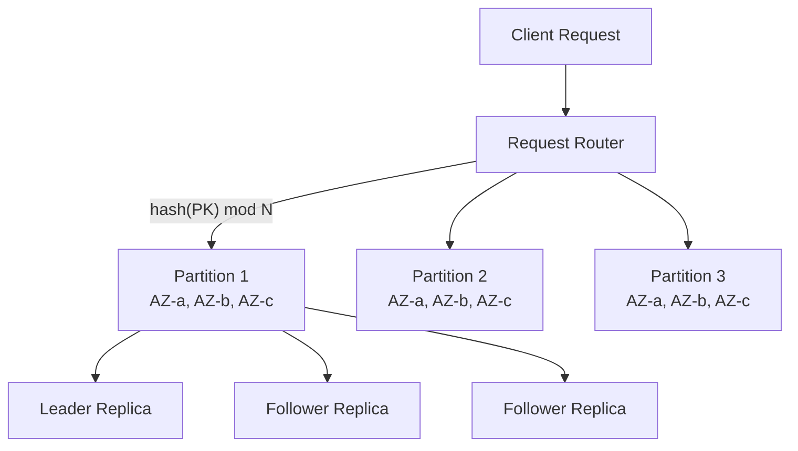
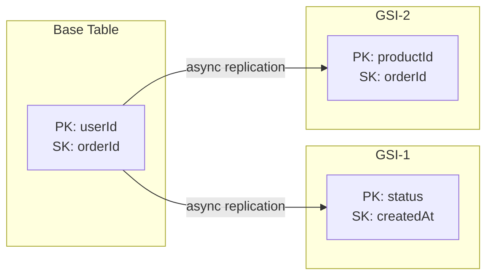
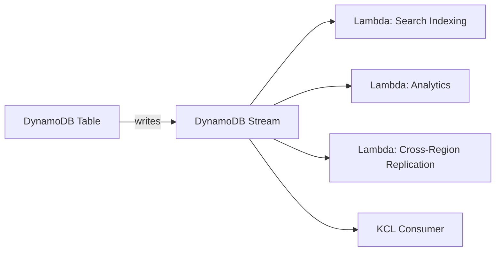

# DynamoDB Internals

DynamoDB is Amazon's fully managed key-value and document database that delivers single-digit millisecond latency at any scale. It was born from the lessons of Amazon's Dynamo paper (2007) but shares surprisingly little implementation with it. While the Dynamo paper described a decentralized system with vector clocks and eventual consistency, DynamoDB is a centralized, strongly consistent, managed service built on top of a different storage substrate.

Understanding DynamoDB internals is essential not because you will tune its storage engine — you cannot — but because every performance characteristic, every cost optimization, and every data modeling decision depends on knowing how DynamoDB routes requests, stores data, and manages capacity behind the scenes.

## The Partition Model

### How Data Is Distributed

DynamoDB distributes data across partitions using a hash of the partition key. Each partition is a unit of storage and throughput — it is a B-tree stored on SSDs across three Availability Zones.



Each partition can store up to **10 GB** of data and sustain up to **3,000 RCUs** (read capacity units) and **1,000 WCUs** (write capacity units). When either limit is exceeded, DynamoDB automatically splits the partition — a process that is invisible to the application but has real consequences for throughput distribution.

### Partition Key Design

The partition key is the single most important decision in DynamoDB data modeling. A poorly chosen partition key leads to hot partitions, throttled requests, and wasted capacity.

| Pattern | Example | Risk |
|---------|---------|------|
| High cardinality, uniform access | `userId` | Good — even distribution |
| High cardinality, skewed access | `customerId` (one customer = 80% traffic) | Hot partition |
| Low cardinality | `status` (3 possible values) | Terrible — 3 partitions max |
| Time-based | `date` | Hot partition on current date |
| Compound | `tenant#date` | Better distribution |

::: tip Write Sharding for Hot Keys
When a single partition key receives disproportionate traffic, append a random suffix: `pk = "HOT_KEY#" + random(0, N)`. Reads must then scatter-gather across N shards and merge results. This is the standard pattern for counters, leaderboards, and any item that receives more than 1,000 writes per second.
:::

### Sort Keys and Item Collections

The sort key defines the ordering of items within a partition. Together, the partition key and sort key form the composite primary key. All items with the same partition key form an **item collection** — they are stored contiguously on disk and can be queried efficiently with range operations.

```
PK: USER#alice
  SK: PROFILE                    → { name, email, ... }
  SK: ORDER#2026-01-15#001       → { total: 42.50, ... }
  SK: ORDER#2026-02-20#002       → { total: 89.99, ... }
  SK: PAYMENT#2026-01-15#txn123  → { amount: 42.50, ... }
```

This hierarchical key structure is the foundation of single-table design. A `Query` operation on `PK = USER#alice AND SK BEGINS_WITH ORDER#` returns all orders, sorted by date, in a single round trip.

## Secondary Indexes

### Global Secondary Indexes (GSIs)

A GSI is a fully independent projection of the table with a different partition key and optional sort key. DynamoDB replicates every write to every GSI asynchronously — GSIs are **eventually consistent**.



Key facts about GSIs:

- A GSI consumes its own capacity, separate from the base table
- Maximum 20 GSIs per table
- GSI partition keys can have duplicate values (unlike the base table's primary key)
- Writes to the base table that change projected attributes consume WCUs on the GSI
- If a GSI is throttled, the base table writes can also be throttled (back-pressure)

::: warning GSI Throttling Propagation
When a GSI falls behind on replication, DynamoDB throttles the base table to prevent the replication log from growing unbounded. This means an under-provisioned GSI can make your entire table slow. Always provision GSIs with enough capacity for the base table's write throughput.
:::

### Local Secondary Indexes (LSIs)

An LSI shares the same partition key as the base table but provides an alternate sort key. LSIs are strongly consistent and must be created at table creation time.

The critical constraint: LSIs limit an item collection to **10 GB**. If all items with the same partition key exceed 10 GB, writes are rejected. This is why many practitioners avoid LSIs entirely and use GSIs instead.

## Request Routing

### The Request Router

Every DynamoDB API call hits a fleet of stateless request routers. The router:

1. Authenticates the request (IAM signature verification)
2. Parses the request and identifies the target table
3. Hashes the partition key to determine the target partition
4. Looks up the partition's storage nodes in a metadata service
5. Forwards the request to the appropriate storage node

The metadata service maintains a mapping of partition key ranges to storage nodes. When partitions split or move, this mapping is updated, and routers learn about it within milliseconds.

### Consistent vs. Eventually Consistent Reads

DynamoDB stores each partition on three replicas across three AZs. One replica is the **leader**; the other two are **followers**.

| Read Type | Behavior | Cost |
|-----------|----------|------|
| Eventually consistent | Reads from any replica (may be stale by ~ms) | 0.5 RCU per 4 KB |
| Strongly consistent | Reads from the leader only | 1 RCU per 4 KB |
| Transactional | Reads from leader with transaction coordination | 2 RCU per 4 KB |

::: tip Default to Eventually Consistent
In most applications, the replication lag is under 10 milliseconds. Unless your application requires read-after-write consistency (e.g., a user updates their profile and immediately reads it back), eventually consistent reads halve your read costs.
:::

## Capacity Modes

### Provisioned Mode

You specify exact RCU and WCU values. You pay for what you provision, whether or not you use it. DynamoDB distributes this capacity evenly across partitions.

**The burst credit trap:** Each partition accumulates up to 300 seconds of unused capacity as burst credits. Short spikes are handled by these credits. But when credits are exhausted, requests are throttled. This creates a failure mode where an application works fine in testing (low sustained traffic, plenty of burst credits) but fails in production (sustained traffic exhausts burst credits).

### On-Demand Mode

DynamoDB automatically scales to handle any traffic level, up to the account limits. You pay per request — approximately 5x the per-request cost of well-utilized provisioned capacity, but with zero capacity planning.

```
Cost comparison at 1,000 WCU sustained:

Provisioned: 1,000 WCU × $0.00065/WCU-hour × 730 hours = ~$475/month
On-Demand:   1,000 writes/sec × 86,400 sec/day × 30 days × $1.25/million = ~$3,240/month
```

On-demand is ideal for unpredictable workloads, new tables, and development environments. Provisioned with auto-scaling is better for steady-state production workloads.

### Adaptive Capacity

DynamoDB continuously monitors partition-level throughput and redistributes unused capacity from cool partitions to hot ones. This does not fix fundamental hot-key problems — a single partition still has an absolute ceiling — but it dramatically reduces throttling for moderately uneven workloads.

## DynamoDB Streams

DynamoDB Streams captures a time-ordered sequence of item-level changes. Each stream record contains the primary key, the old image, the new image, or both, depending on the stream view type.



Stream records are:
- Stored for **24 hours**
- Delivered **exactly once** per shard
- Ordered **per-partition-key** (not globally)
- Available within **~100ms** of the write

::: warning Stream Shards Are Not Table Partitions
Stream shards and table partitions are related but not 1:1. When a table partition splits, the corresponding stream shard also splits. But stream shards have their own lifecycle and can be split or merged independently for scaling purposes. Your stream consumer must handle shard lineage correctly.
:::

## Transactions

DynamoDB transactions provide ACID guarantees across up to 100 items across multiple tables. Internally, transactions use a two-phase protocol:

1. **Prepare phase:** The transaction coordinator writes a transaction record and attempts to acquire locks on all target items
2. **Commit phase:** If all locks succeed, the coordinator commits all writes atomically and releases locks

Transaction costs are 2x the cost of non-transactional operations because DynamoDB performs the operation twice — once for the prepare and once for the commit.

```javascript
// TransactWriteItems — atomic multi-item write
const params = {
  TransactItems: [
    {
      Update: {
        TableName: 'Accounts',
        Key: { pk: { S: 'ACCT#alice' } },
        UpdateExpression: 'SET balance = balance - :amount',
        ConditionExpression: 'balance >= :amount',
        ExpressionAttributeValues: { ':amount': { N: '100' } }
      }
    },
    {
      Update: {
        TableName: 'Accounts',
        Key: { pk: { S: 'ACCT#bob' } },
        UpdateExpression: 'SET balance = balance + :amount',
        ExpressionAttributeValues: { ':amount': { N: '100' } }
      }
    },
    {
      Put: {
        TableName: 'Transfers',
        Item: {
          pk: { S: 'XFER#20260320-001' },
          from: { S: 'alice' },
          to: { S: 'bob' },
          amount: { N: '100' }
        }
      }
    }
  ]
};
```

## Single-Table Design

Single-table design is the most powerful — and most controversial — DynamoDB pattern. Instead of creating separate tables for each entity type, you store all entities in a single table using carefully designed partition key and sort key patterns.

### Why Single-Table?

DynamoDB does not support joins. If your application needs data from multiple entity types in a single request, you have two choices:

1. **Multiple tables:** Make N API calls (one per table), paying N × round-trip latency
2. **Single table:** Store related entities together under the same partition key, fetch them in one `Query` call

### Access Pattern Mapping

Design starts with access patterns, not entities:

| Access Pattern | PK | SK |
|---|---|---|
| Get user profile | `USER#alice` | `PROFILE` |
| Get user orders | `USER#alice` | `ORDER#<date>#<id>` |
| Get order by ID | `ORDER#<id>` | `ORDER#<id>` |
| Get orders by status | GSI1PK: `STATUS#pending` | GSI1SK: `<date>` |
| Get product reviews | `PRODUCT#<id>` | `REVIEW#<date>#<userId>` |

### Overloaded Keys

The PK and SK columns contain heterogeneous data — user IDs, order IDs, status strings. This is intentional. DynamoDB keys are just strings; the "type" prefix is a convention that enables efficient range queries within each type.

::: danger When NOT to Use Single-Table Design
Single-table design adds complexity. Avoid it when:
- Your team is new to DynamoDB — start with one table per entity
- Your access patterns are still evolving rapidly
- You have a small number of simple, independent entities
- You need to grant different IAM permissions per entity type (difficult with single table)
:::

## Operational Patterns

### Auto-Scaling Configuration

```yaml
# CloudFormation auto-scaling for DynamoDB
Resources:
  WriteScalingTarget:
    Type: AWS::ApplicationAutoScaling::ScalableTarget
    Properties:
      MaxCapacity: 10000
      MinCapacity: 100
      ResourceId: !Sub table/${DynamoTable}
      ScalableDimension: dynamodb:table:WriteCapacityUnits
      ServiceNamespace: dynamodb

  WriteScalingPolicy:
    Type: AWS::ApplicationAutoScaling::ScalingPolicy
    Properties:
      PolicyName: WriteAutoScalingPolicy
      PolicyType: TargetTrackingScaling
      ScalableTargetId: !Ref WriteScalingTarget
      TargetTrackingScalingPolicyConfiguration:
        TargetValue: 70.0  # Scale when 70% of provisioned capacity is consumed
        ScaleInCooldown: 60
        ScaleOutCooldown: 60
        PredefinedMetricSpecification:
          PredefinedMetricType: DynamoDBWriteCapacityUtilization
```

### Monitoring Key Metrics

| Metric | What It Tells You | Action Threshold |
|--------|-------------------|------------------|
| `ConsumedReadCapacityUnits` | Actual read throughput | > 80% of provisioned |
| `ThrottledRequests` | Capacity limit hits | > 0 sustained |
| `SystemErrors` | DynamoDB internal errors | Any occurrence |
| `SuccessfulRequestLatency` | End-to-end latency | p99 > 10ms |
| `AccountProvisionedReadCapacityUtilization` | Account-level capacity | > 80% |

### Backup and Recovery

DynamoDB provides two backup mechanisms:

- **Point-in-Time Recovery (PITR):** Continuous backups with 35-day retention. Restores create a new table — they do not overwrite the existing one. Restores take minutes to hours depending on table size.
- **On-Demand Backups:** Manual snapshots stored indefinitely. Useful for compliance and audit trails.

## DynamoDB vs. Other Databases

| Dimension | DynamoDB | [PostgreSQL](/system-design/databases/postgres-internals) | [MongoDB](/system-design/databases/mongodb-internals) | [Cassandra](/system-design/databases/cassandra-internals) |
|-----------|----------|------------|---------|-----------|
| Data model | Key-value / document | Relational | Document | Wide column |
| Consistency | Strong or eventual | Strong (ACID) | Configurable | Tunable |
| Scaling | Automatic | Manual sharding | Manual sharding | Linear (peer-to-peer) |
| Operations | Fully managed | Self-managed or managed | Self-managed or Atlas | Self-managed |
| Joins | None | Full SQL joins | $lookup (limited) | None |
| Transactions | 100-item limit | Full ACID | Multi-document | Lightweight |
| Best for | Serverless, predictable access | Complex queries, ACID | Flexible schema, moderate scale | Write-heavy, time-series |

## Further Reading

- **Amazon's Dynamo paper** — the original 2007 paper that inspired DynamoDB's design philosophy
- [Sharding](/system-design/databases/sharding) — consistent hashing and partition strategies
- [Replication](/system-design/databases/replication) — leader-follower replication patterns
- [Storage Engines](/system-design/databases/storage-engines) — B-tree vs. LSM tree tradeoffs
- [Cassandra Internals](/system-design/databases/cassandra-internals) — peer-to-peer alternative to DynamoDB's managed model
- [Elasticsearch Internals](/system-design/databases/elasticsearch-internals) — when your DynamoDB access patterns require full-text search
