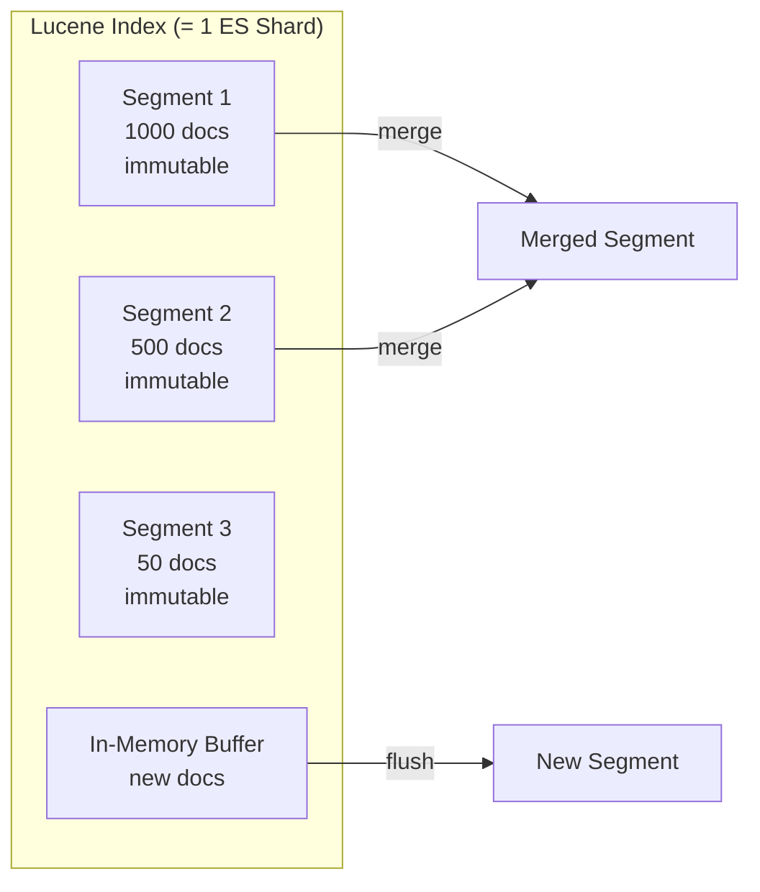
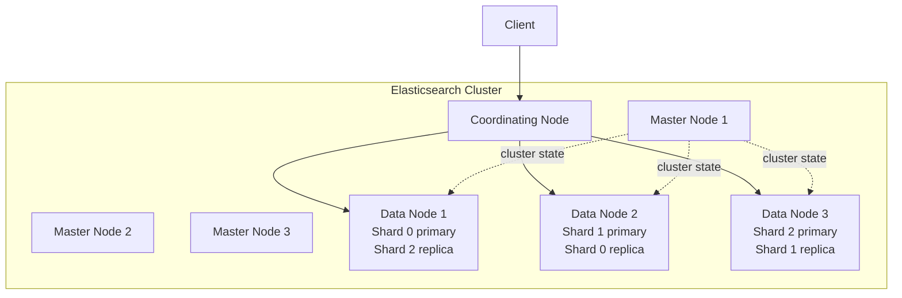
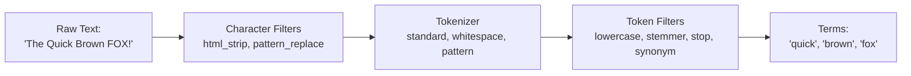

# Elasticsearch / OpenSearch Internals

Elasticsearch is a distributed search and analytics engine built on Apache Lucene. OpenSearch is the open-source fork maintained by AWS after Elastic changed its license in 2021. The internals are nearly identical — this page covers both.

Search engines solve a fundamentally different problem than transactional databases. A [PostgreSQL](/system-design/databases/postgres-internals) query scans rows and evaluates predicates. A search engine inverts this model: it pre-builds an index of every word in every document, so finding "all documents containing the word 'distributed'" is a lookup, not a scan. This architectural difference means Elasticsearch excels at full-text search, faceted navigation, autocomplete, and log analytics — but is a poor choice for primary transactional storage.

## Lucene Architecture

Elasticsearch is a distributed wrapper around Apache Lucene. Every shard in Elasticsearch is a single Lucene index. Understanding Lucene is understanding Elasticsearch.

### The Inverted Index

The inverted index is the core data structure. It maps terms to the documents that contain them — the inverse of a normal document-to-terms mapping.

```
Document 1: "the quick brown fox"
Document 2: "the lazy brown dog"
Document 3: "quick fox jumps"

Inverted Index:
┌──────────┬────────────────────┐
│ Term     │ Document IDs       │
├──────────┼────────────────────┤
│ brown    │ [1, 2]             │
│ dog      │ [2]                │
│ fox      │ [1, 3]             │
│ jumps    │ [3]                │
│ lazy     │ [2]                │
│ quick    │ [1, 3]             │
│ the      │ [1, 2]            │
└──────────┴────────────────────┘
```

Each entry also stores:

- **Term frequency:** how many times the term appears in each document
- **Positions:** the ordinal position of the term (for phrase queries)
- **Offsets:** character start/end positions (for highlighting)
- **Payloads:** arbitrary per-position metadata

### Segments and Immutability

Lucene does not modify existing index files. Instead, it writes new data into **segments** — self-contained, immutable mini-indexes. Each segment has its own inverted index, stored fields, doc values, and norms.



**Why immutability?**

- No locking needed for concurrent reads — segments never change
- OS file system cache is maximally effective — cached pages never go stale
- Crash recovery is trivial — incomplete segments are discarded on startup

**The cost:** Updates and deletes are expensive. Deleting a document writes a deletion marker (`.del` file). The document still occupies space and is filtered out at query time until the next segment merge removes it. Updating a document is a delete-then-insert.

### Segment Merging

Too many small segments degrade query performance because every query must search every segment and merge results. Lucene runs a background merge process that combines small segments into larger ones, removes deleted documents, and reduces the total segment count.

The merge policy (default: `TieredMergePolicy`) controls when and which segments are merged. Merges are I/O-intensive and can compete with indexing and search for disk bandwidth.

::: warning Force Merge Anti-Pattern
`_forcemerge` compacts all segments into a specified number (often 1). This is useful for read-only indexes (e.g., yesterday's logs), but running it on an actively indexed index causes massive I/O spikes and blocks normal merges. Never force-merge indexes that are still receiving writes.
:::

## Cluster Topology

### Nodes, Shards, and Replicas



| Node Role | Responsibility |
|-----------|---------------|
| **Master** | Manages cluster state (index metadata, shard allocation, node membership). 3 dedicated master nodes for HA. |
| **Data** | Stores shards, executes search and indexing operations. Most of the hardware. |
| **Coordinating** | Routes requests, scatters queries to shards, gathers and merges results. Stateless. |
| **Ingest** | Runs ingest pipelines (enrichment, transformation) before indexing. |

### Shard Allocation

An index is divided into a fixed number of **primary shards** (set at index creation, cannot be changed without reindexing). Each primary shard has zero or more **replica shards** for fault tolerance and read scaling.

```json
{
  "settings": {
    "number_of_shards": 5,
    "number_of_replicas": 1
  }
}
```

::: tip Shard Sizing Guidelines
- Target **10-50 GB per shard** for optimal performance
- Avoid more than **20 shards per GB of heap** on data nodes
- Too many small shards waste memory on per-shard overhead
- Too few large shards reduce parallelism and make recovery slow
- For time-series data, use Index Lifecycle Management (ILM) to create daily indexes with appropriate shard counts
:::

## Indexing Pipeline

### Analysis: From Text to Terms

When a document is indexed, text fields pass through an **analyzer** that transforms raw text into a stream of tokens. An analyzer has three components:



| Component | Examples | Purpose |
|-----------|----------|---------|
| Character filters | `html_strip`, `mapping` | Pre-process raw text (strip HTML, replace characters) |
| Tokenizer | `standard`, `whitespace`, `ngram` | Split text into tokens |
| Token filters | `lowercase`, `stemmer`, `stop`, `synonym`, `shingle` | Transform, filter, or expand tokens |

### Custom Analyzer Example

```json
{
  "settings": {
    "analysis": {
      "analyzer": {
        "product_analyzer": {
          "type": "custom",
          "tokenizer": "standard",
          "filter": ["lowercase", "english_stemmer", "product_synonyms"]
        }
      },
      "filter": {
        "english_stemmer": {
          "type": "stemmer",
          "language": "english"
        },
        "product_synonyms": {
          "type": "synonym",
          "synonyms": ["laptop,notebook", "phone,mobile,cell"]
        }
      }
    }
  }
}
```

### The Indexing Process

1. Document arrives via HTTP `PUT` or `POST` to `/_doc`
2. Coordinating node hashes the document `_id` to determine the target primary shard: `shard = hash(_id) % number_of_shards`
3. Request is forwarded to the data node holding the primary shard
4. Primary shard processes the document through its ingest pipeline and analyzers
5. Document is written to the Lucene **in-memory buffer** and the **translog** (write-ahead log)
6. Primary shard forwards the write to all replica shards
7. Once all replicas acknowledge, success is returned to the client

### Near-Real-Time Search

Documents are not immediately searchable after indexing. They become searchable after a **refresh** — the process of flushing the in-memory buffer to a new Lucene segment and opening it for search.

The default refresh interval is **1 second**, making Elasticsearch "near-real-time." You can trade search freshness for indexing throughput by increasing this interval:

```json
{ "settings": { "refresh_interval": "30s" } }
```

## Query DSL and Relevance Scoring

### Query Context vs. Filter Context

Elasticsearch queries operate in two contexts:

| Context | Scoring | Caching | Use For |
|---------|---------|---------|---------|
| **Query** | Yes — calculates relevance score | No | Full-text search, fuzzy matching |
| **Filter** | No — binary yes/no | Yes — results are cached in bitset | Exact matches, ranges, booleans |

```json
{
  "query": {
    "bool": {
      "must": [
        { "match": { "title": "distributed systems" } }
      ],
      "filter": [
        { "term": { "status": "published" } },
        { "range": { "date": { "gte": "2025-01-01" } } }
      ]
    }
  }
}
```

Always use `filter` for exact matches and ranges — it is faster (no scoring) and cacheable.

### BM25 Scoring

Elasticsearch uses **BM25** (Best Matching 25) as its default relevance scoring algorithm, replacing the older TF-IDF model. BM25 scores each document based on:

```
score(D, Q) = SUM_for_each_term_t_in_Q [
  IDF(t) * (tf(t, D) * (k1 + 1)) / (tf(t, D) + k1 * (1 - b + b * |D| / avgDL))
]

Where:
  tf(t, D)  = frequency of term t in document D
  IDF(t)    = log(1 + (N - n + 0.5) / (n + 0.5))  — inverse document frequency
  |D|       = document length
  avgDL     = average document length
  k1        = 1.2 (term frequency saturation)
  b         = 0.75 (document length normalization)
```

**Key differences from TF-IDF:**

- BM25 has **term frequency saturation** — the 10th occurrence of a word contributes much less than the 1st. TF-IDF grows linearly.
- BM25 has **configurable length normalization** — parameter `b` controls how much longer documents are penalized. Set `b=0` for fields where length should not matter (e.g., product codes).

### Fuzzy Search

Fuzzy queries find documents with terms within an edit distance (Levenshtein distance) of the query term.

```json
{
  "query": {
    "fuzzy": {
      "name": {
        "value": "elastcsearch",
        "fuzziness": "AUTO"
      }
    }
  }
}
```

`AUTO` fuzziness allows 0 edits for 1-2 character terms, 1 edit for 3-5 characters, and 2 edits for 6+ characters. Fuzzy queries are implemented as automaton intersections with the term dictionary — they are fast but generate many candidate terms for high fuzziness values.

### Autocomplete with Edge N-grams

```json
{
  "settings": {
    "analysis": {
      "analyzer": {
        "autocomplete_analyzer": {
          "type": "custom",
          "tokenizer": "autocomplete_tokenizer",
          "filter": ["lowercase"]
        }
      },
      "tokenizer": {
        "autocomplete_tokenizer": {
          "type": "edge_ngram",
          "min_gram": 2,
          "max_gram": 10,
          "token_chars": ["letter", "digit"]
        }
      }
    }
  }
}
```

This tokenizer creates prefixes: "elasticsearch" becomes ["el", "ela", "elas", "elast", ...]. At query time, the user's partial input ("elas") matches the pre-built n-gram. Use a different analyzer at search time (`search_analyzer: "standard"`) to avoid matching n-grams against n-grams.

## Aggregations

Aggregations are Elasticsearch's analytics engine. They operate on the entire result set (not just the top N hits) and can be nested, combined, and pipelined.

### Aggregation Types

| Type | Examples | Purpose |
|------|----------|---------|
| **Metric** | `sum`, `avg`, `min`, `max`, `cardinality`, `percentiles` | Calculate statistics |
| **Bucket** | `terms`, `date_histogram`, `range`, `filters`, `geohash_grid` | Group documents |
| **Pipeline** | `moving_avg`, `derivative`, `cumulative_sum`, `bucket_sort` | Process other aggregation results |

```json
{
  "size": 0,
  "aggs": {
    "orders_over_time": {
      "date_histogram": {
        "field": "created_at",
        "calendar_interval": "month"
      },
      "aggs": {
        "total_revenue": { "sum": { "field": "amount" } },
        "avg_order_value": { "avg": { "field": "amount" } },
        "unique_customers": { "cardinality": { "field": "customer_id" } }
      }
    }
  }
}
```

### Doc Values vs. Fielddata

Aggregations and sorting need access to all values of a field across all documents — the inverse of the inverted index. Elasticsearch uses two approaches:

| Structure | Stored | Used For | Memory |
|-----------|--------|----------|--------|
| **Doc values** | On disk (column-oriented) | Keyword, numeric, date, IP, geo | Minimal (OS cache) |
| **Fielddata** | In JVM heap (built on demand) | Analyzed text fields | Enormous — avoid |

::: danger Never Aggregate on Analyzed Text Fields
Enabling fielddata on analyzed text fields loads every unique term into the JVM heap. A text field with millions of unique terms can consume tens of GB of heap and cause OutOfMemoryErrors. Use `.keyword` sub-fields for aggregations.
:::

## Production Tuning

### Indexing Performance

| Tuning | Default | Optimized | Impact |
|--------|---------|-----------|--------|
| `refresh_interval` | 1s | 30s | 2-3x indexing throughput |
| `number_of_replicas` | 1 | 0 (during bulk load) | 2x indexing throughput |
| Bulk request size | varies | 5-15 MB | Reduces per-request overhead |
| `index.translog.durability` | `request` | `async` | Higher throughput, risk of data loss |

### Search Performance

- Use `filter` context for non-scoring clauses
- Avoid deep pagination (`from + size > 10,000`) — use `search_after` or `scroll`
- Profile slow queries with `_search?profile=true`
- Use `routing` to target specific shards when the partition key is known
- Pre-warm caches with `_search` requests after index creation

### Memory and JVM

- Set heap to **50% of system RAM, max 31 GB** (compressed OOPs threshold)
- Leave the other 50% for the OS file system cache — Lucene depends on it heavily
- Use **G1GC** and monitor pause times
- Set `indices.fielddata.cache.size` to limit fielddata memory

### Index Lifecycle Management (ILM)

For time-series data (logs, metrics, events), use ILM to automate index management:

```json
{
  "policy": {
    "phases": {
      "hot":    { "actions": { "rollover": { "max_size": "50gb", "max_age": "1d" } } },
      "warm":   { "min_age": "7d", "actions": { "shrink": { "number_of_shards": 1 }, "forcemerge": { "max_num_segments": 1 } } },
      "cold":   { "min_age": "30d", "actions": { "searchable_snapshot": { "snapshot_repository": "s3_repo" } } },
      "delete": { "min_age": "90d", "actions": { "delete": {} } }
    }
  }
}
```

## Elasticsearch vs. Other Search Solutions

| Feature | Elasticsearch | [PostgreSQL Full-Text](/system-design/databases/postgres-internals) | Apache Solr | Meilisearch | Typesense |
|---------|--------------|--------------------------|-------------|-------------|-----------|
| Distributed | Native | Not built-in | SolrCloud | Not built-in | Raft-based |
| Relevance tuning | BM25 + function_score | ts_rank | BM25 + boosts | Typo-tolerant ranking | Typo-tolerant |
| Aggregations | Powerful | SQL GROUP BY | Facets | Faceted search | Faceted search |
| Autocomplete | Edge n-grams, completion suggestor | Trigram (pg_trgm) | Suggestor | Built-in | Built-in |
| Operational complexity | High | Low (part of PG) | High | Low | Low |
| Best for | Large-scale search + analytics | Search within a PG app | Legacy enterprise | Developer-friendly search | Simple typo-tolerant search |

## Further Reading

- [Indexing Deep Dive](/system-design/databases/indexing-deep-dive) — B-tree, hash, and GIN index internals
- [Storage Engines](/system-design/databases/storage-engines) — LSM trees (related to Lucene segment model)
- [Sharding](/system-design/databases/sharding) — distributed data partitioning strategies
- [ClickHouse Internals](/system-design/databases/clickhouse-internals) — column-oriented analytics alternative
- [Redis Internals](/system-design/databases/redis-internals) — caching search results for performance
