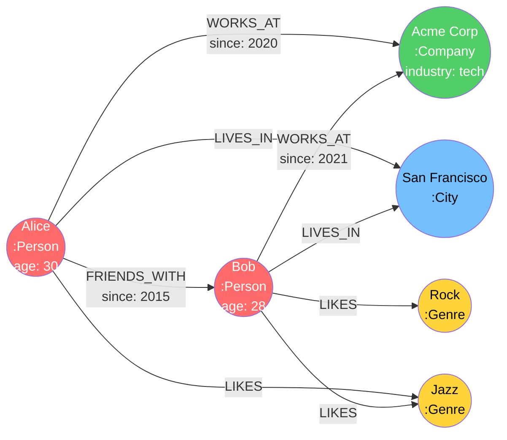
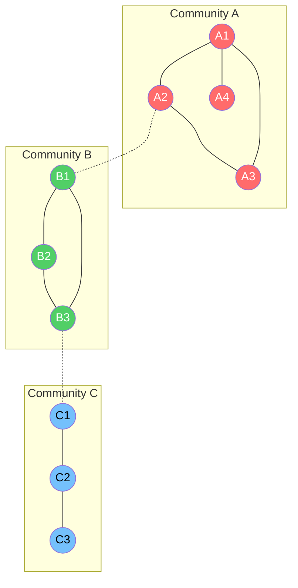
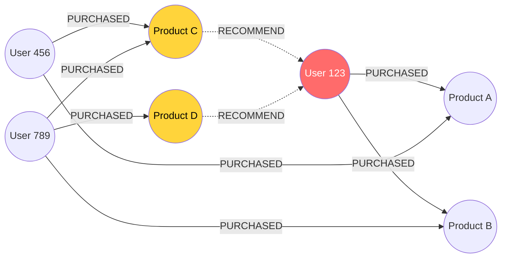
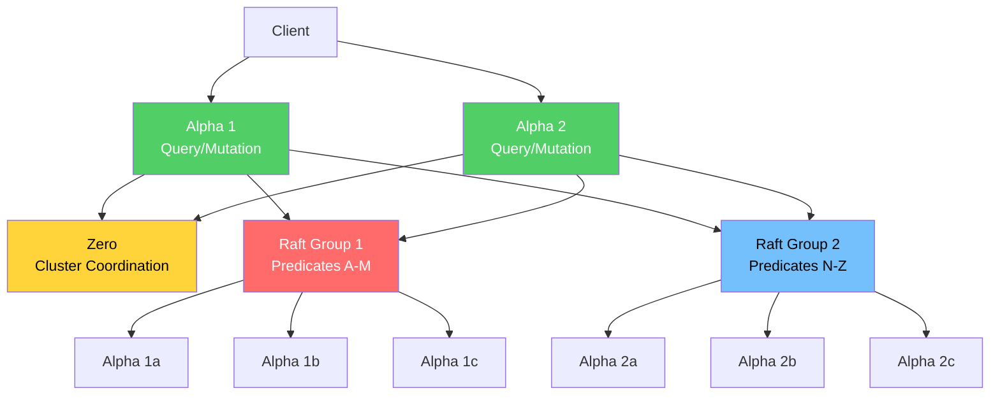

# Graph Databases

Most databases are optimized for one of two things: storing individual records efficiently (row stores) or aggregating across many records efficiently (columnar stores). Graph databases optimize for a third thing: traversing relationships between records. This difference is not incremental — for relationship-heavy queries, the performance gap between a graph database and a relational JOIN can be six orders of magnitude.

The question is never "are graph databases fast?" — they are, for graph queries. The question is: "is my query actually a graph query?"

## When Graph Models Are the Right Choice

A graph database is the right choice when your most important queries are about **relationships between entities** rather than the entities themselves. Specifically:

1. **Multi-hop traversals** — "Find all friends of friends who also like jazz" (2+ hops in a relationship chain)
2. **Variable-length paths** — "Find the shortest route between two airports" (unknown number of hops)
3. **Pattern matching** — "Find all triangles of users who mutually follow each other"
4. **Recursive relationships** — "Find all direct and indirect reports of this manager"
5. **Relationship-heavy queries** — "Find all entities connected to this fraud suspect within 3 hops"

If your most common queries are "get user by ID," "list all orders sorted by date," or "calculate total revenue by region" — you do not need a graph database. Relational databases handle these patterns better.

::: tip The JOIN Test
Ask yourself: would this query require more than 3 self-JOINs in SQL? If yes, consider a graph database. One or two JOINs are fine in SQL. Five recursive self-JOINs on a table with 100 million rows will grind to a halt — and that's where graph databases excel.
:::

## The Property Graph Model

The property graph is the dominant graph data model used by Neo4j, DGraph, Amazon Neptune, and most other graph databases. It consists of four primitives:

### Nodes (Vertices)

Nodes represent entities. Each node can have:
- One or more **labels** (like types) — e.g., `:Person`, `:Company`
- Zero or more **properties** (key-value pairs) — e.g., `name: "Alice"`, `age: 30`

### Edges (Relationships)

Edges represent connections between nodes. Each edge has:
- A **type** — e.g., `:WORKS_AT`, `:FRIENDS_WITH`
- A **direction** — from one node to another (though queries can traverse in either direction)
- Zero or more **properties** — e.g., `since: 2020`, `role: "engineer"`

### The Model Visually



### Labeled Property Graph vs RDF

There are two competing graph data models:

**Labeled Property Graph (LPG):**
- Used by Neo4j, DGraph, Amazon Neptune (in Gremlin mode)
- Nodes and edges have properties (key-value pairs)
- Edges are first-class citizens with their own properties
- More intuitive for most developers
- Queries: Cypher, Gremlin

**RDF (Resource Description Framework):**
- Used by Amazon Neptune (in SPARQL mode), Wikidata, DBpedia
- Everything is a triple: `(subject, predicate, object)`
- No properties on edges — must be modeled as intermediate nodes (reification)
- Designed for semantic web, linked data, ontologies
- Queries: SPARQL

| Aspect | LPG | RDF |
|--------|-----|-----|
| Edge properties | Native support | Requires reification (extra nodes) |
| Schema | Optional (schema-free by default) | Ontology-based (OWL, RDFS) |
| Query language | Cypher, Gremlin | SPARQL |
| Best for | Application databases, analytics | Knowledge representation, linked data |
| Learning curve | Lower | Higher |
| Interoperability | Database-specific | W3C standard |

::: tip Which to Choose
For most application use cases (social networks, fraud detection, recommendations), choose the Labeled Property Graph model. Its expressive power and developer ergonomics are superior for operational workloads. Choose RDF only if you are building a knowledge graph that needs to interoperate with other linked data systems (e.g., integrating with Wikidata or academic ontologies).
:::

## Neo4j Deep Dive

Neo4j is the most widely deployed graph database and the creator of the Cypher query language. It has been in production since 2007 and has a large ecosystem of tools, libraries, and community support.

### Native Graph Storage

Neo4j uses **index-free adjacency** — the key architectural decision that differentiates native graph databases from relational databases:

```
Relational database:
  To find Alice's friends, you must:
  1. Look up Alice in the users table
  2. Scan the friendships table (or use an index) for rows where user_id = Alice's ID
  3. For each match, look up the friend's row in the users table
  Total: 2 index lookups + 1 scan/index lookup

Native graph database (Neo4j):
  To find Alice's friends, you must:
  1. Look up Alice's node (one index lookup)
  2. Follow the relationship pointers stored IN Alice's node record
  3. Each pointer leads directly to the friend's node — no index needed
  Total: 1 index lookup + N pointer follows (where N = number of friends)
```

**Why this matters:**

In a relational database, the cost of a JOIN depends on the size of the table being joined. Finding friends-of-friends requires a self-JOIN, and the cost scales with the total number of friendships in the system.

In a graph database with index-free adjacency, the cost of traversal depends only on the number of relationships at each node — not on the total size of the graph. This is the fundamental performance advantage.

$$
\text{Relational JOIN cost:} \quad O(N \log N) \text{ where } N = \text{total rows in join table}
$$

$$
\text{Graph traversal cost:} \quad O(k^d) \text{ where } k = \text{avg degree}, d = \text{depth}
$$

For a social network with 1 billion friendships, finding one person's friends-of-friends:
- Relational: Must scan or index-lookup in a billion-row table (twice for 2 hops)
- Graph: Follows ~200 pointers (avg friends) then ~200 pointers per friend = ~40,000 pointer follows

### Neo4j Storage Layout

```
Node Store (neostore.nodestore.db):
┌─────────────┬────────────┬──────────────────┬────────────────┐
│ In Use (1b) │ Labels Ptr │ First Rel Ptr    │ First Prop Ptr │
│             │ (5 bytes)  │ (5 bytes)        │ (5 bytes)      │
└─────────────┴────────────┴──────────────────┴────────────────┘
Fixed size: 15 bytes per node

Relationship Store (neostore.relationshipstore.db):
┌─────────────┬──────────┬──────────┬──────────┬──────────┬──────────┬──────────┐
│ In Use (1b) │ Start    │ End      │ Type     │ Start    │ Start    │ End      │
│             │ Node Ptr │ Node Ptr │          │ Prev Rel │ Next Rel │ Prev Rel │
│             │          │          │          │ Ptr      │ Ptr      │ Ptr      │
└─────────────┴──────────┴──────────┴──────────┴──────────┴──────────┴──────────┘
Fixed size: ~34 bytes per relationship
(Doubly-linked list of relationships per node)
```

Every node record has a pointer to its first relationship. Each relationship has pointers to the next/previous relationship for both its start and end nodes. This forms a doubly-linked list of relationships per node — enabling O(1) traversal to the next relationship.

### Cypher Query Language

Cypher is Neo4j's declarative graph query language. Its syntax uses ASCII art to represent graph patterns:

**Node pattern:** `(variable:Label {property: value})`
**Relationship pattern:** `-[variable:TYPE {property: value}]->`
**Path pattern:** `(a)-[:KNOWS]->(b)-[:WORKS_AT]->(c)`

**Basic queries:**

```cypher
// Find Alice's friends
MATCH (alice:Person {name: "Alice"})-[:FRIENDS_WITH]->(friend:Person)
RETURN friend.name, friend.age

// Find friends of friends (2 hops)
MATCH (alice:Person {name: "Alice"})-[:FRIENDS_WITH*2]->(fof:Person)
WHERE fof <> alice  // exclude Alice herself
RETURN DISTINCT fof.name

// Variable-length path (1 to 5 hops)
MATCH path = (alice:Person {name: "Alice"})-[:FRIENDS_WITH*1..5]->(target:Person)
RETURN target.name, length(path) AS distance
ORDER BY distance

// Shortest path between two people
MATCH path = shortestPath(
    (alice:Person {name: "Alice"})-[:FRIENDS_WITH*]-(bob:Person {name: "Bob"})
)
RETURN path, length(path) AS hops

// Pattern matching: find triangles (mutual friends)
MATCH (a:Person)-[:FRIENDS_WITH]->(b:Person)-[:FRIENDS_WITH]->(c:Person)-[:FRIENDS_WITH]->(a)
RETURN a.name, b.name, c.name
```

**Aggregation:**

```cypher
// Count friends per person
MATCH (p:Person)-[:FRIENDS_WITH]->(friend)
RETURN p.name, COUNT(friend) AS friendCount
ORDER BY friendCount DESC

// Recommendation: find people who share the most friends with Alice
MATCH (alice:Person {name: "Alice"})-[:FRIENDS_WITH]->(friend)-[:FRIENDS_WITH]->(recommended)
WHERE NOT (alice)-[:FRIENDS_WITH]->(recommended)
  AND recommended <> alice
RETURN recommended.name, COUNT(friend) AS sharedFriends
ORDER BY sharedFriends DESC
LIMIT 10
```

**Write operations:**

```cypher
// Create nodes and relationships
CREATE (alice:Person {name: "Alice", age: 30})
CREATE (bob:Person {name: "Bob", age: 28})
CREATE (alice)-[:FRIENDS_WITH {since: 2015}]->(bob)

// Upsert (MERGE)
MERGE (alice:Person {name: "Alice"})
ON CREATE SET alice.createdAt = datetime()
ON MATCH SET alice.lastSeen = datetime()
```

### Neo4j Indexes

Neo4j supports several index types:

| Index Type | Purpose | Example |
|-----------|---------|---------|
| **Range index** (default) | Equality and range lookups on properties | `CREATE INDEX FOR (p:Person) ON (p.name)` |
| **Text index** | Full-text search with `CONTAINS`, `STARTS WITH` | `CREATE TEXT INDEX FOR (p:Person) ON (p.bio)` |
| **Point index** | Geospatial queries | `CREATE POINT INDEX FOR (p:Place) ON (p.location)` |
| **Composite index** | Multi-property lookups | `CREATE INDEX FOR (p:Person) ON (p.lastName, p.firstName)` |
| **Full-text index** | Lucene-based full-text search | `CREATE FULLTEXT INDEX FOR (p:Person) ON EACH [p.name, p.bio]` |
| **Unique constraint** | Uniqueness + automatic index | `CREATE CONSTRAINT FOR (p:Person) REQUIRE p.email IS UNIQUE` |

::: warning Index vs Traversal
Indexes in Neo4j are used to find the starting node(s) of a traversal. Once you have found the starting node, subsequent traversal uses pointer-following (index-free adjacency), not indexes. This means: index your properties that appear in `WHERE` clauses for the first node in your `MATCH` pattern. You do NOT need to index properties used in relationship traversals.
:::

## Comparison: Graph vs Relational JOINs

### When Graph Outperforms SQL

The performance advantage of graph databases increases with the number of hops (JOIN depth) and decreases with the selectivity of the query.

**Benchmark: Social network friend-of-friend queries**

Setup: 1 million users, 50 million friendship edges (avg 50 friends per user)

| Query | Hops | SQL (PostgreSQL) | Cypher (Neo4j) |
|-------|------|------------------|----------------|
| Direct friends | 1 | 2ms | 1ms |
| Friends of friends | 2 | 150ms | 3ms |
| 3 degrees of separation | 3 | 18s | 30ms |
| 4 degrees of separation | 4 | > 10 min | 200ms |
| 5 degrees of separation | 5 | DNF (out of memory) | 1.5s |
| Shortest path (avg) | variable | Requires recursive CTE | 5ms |

The performance divergence is exponential:

$$
\text{SQL cost for } d \text{ hops} \approx O(n^d) \text{ where } n = \text{avg friends}
$$

$$
\text{Graph cost for } d \text{ hops} \approx O(k^d) \text{ where } k = \text{avg degree at each hop}
$$

The difference: SQL's $n$ is the full table scan/index lookup on the JOIN table (millions of rows). Graph's $k$ is the local degree of each node (tens to hundreds of edges). Same exponent, radically different base.

### When SQL Outperforms Graph

Graph databases are NOT universally faster. They are slower than relational databases for:

1. **Aggregations across all data** — "What is the average age of all users?" This requires scanning all nodes. A relational table scan is faster because rows are stored contiguously in pages, enabling sequential I/O. Graph nodes are stored with their relationships, creating scattered access patterns.

2. **Bulk data loading** — Inserting millions of rows into a table is faster than creating millions of nodes and relationships because graph databases must maintain relationship pointers.

3. **Simple CRUD** — For key-value lookups, simple inserts, and updates that don't involve relationships, the graph overhead (pointer maintenance, relationship storage) adds no value.

4. **Tabular reporting** — Reports that would be simple `GROUP BY` queries in SQL require awkward `COLLECT` and `UNWIND` operations in Cypher.

## Graph Algorithms

Graph databases and libraries provide built-in implementations of fundamental graph algorithms. These algorithms power the most valuable graph use cases.

### Shortest Path

Find the shortest path between two nodes. Used in:
- Navigation and routing
- Network analysis (fewest hops between systems)
- Social distance (degrees of separation)

```cypher
// Unweighted shortest path
MATCH path = shortestPath(
    (a:Person {name: "Alice"})-[*]-(b:Person {name: "Charlie"})
)
RETURN path

// Weighted shortest path (Dijkstra)
MATCH (a:Person {name: "Alice"}), (b:Person {name: "Charlie"})
CALL gds.shortestPath.dijkstra.stream({
    sourceNode: a,
    targetNode: b,
    relationshipWeightProperty: 'cost'
})
YIELD path, totalCost
RETURN path, totalCost
```

$$
\text{Dijkstra's complexity:} \quad O((V + E) \log V)
$$

### PageRank

Assign an importance score to each node based on the number and quality of its incoming links. Originally developed by Google for web page ranking.

```cypher
CALL gds.pageRank.stream('myGraph', {
    maxIterations: 20,
    dampingFactor: 0.85
})
YIELD nodeId, score
RETURN gds.util.asNode(nodeId).name AS name, score
ORDER BY score DESC
LIMIT 10
```

$$
PR(v) = \frac{1-d}{N} + d \sum_{u \in B(v)} \frac{PR(u)}{L(u)}
$$

where:
- $PR(v)$ is the PageRank of node $v$
- $d$ is the damping factor (typically 0.85)
- $N$ is the total number of nodes
- $B(v)$ is the set of nodes linking to $v$
- $L(u)$ is the number of outgoing links from $u$

**Use cases:**
- Identifying influential users in social networks
- Ranking important nodes in knowledge graphs
- Finding critical infrastructure in network topology

### Community Detection (Louvain)

Detect clusters of densely connected nodes. The Louvain algorithm maximizes modularity — a measure of how well the network is divided into communities.

```cypher
CALL gds.louvain.stream('myGraph')
YIELD nodeId, communityId
RETURN gds.util.asNode(nodeId).name AS name, communityId
ORDER BY communityId
```



**Use cases:**
- Detecting fraud rings (clusters of accounts transacting with each other)
- Market segmentation (clusters of customers with similar behavior)
- Topic clustering in citation networks

### Centrality Measures

Centrality algorithms identify the most important nodes in a graph:

| Algorithm | What It Measures | Best For |
|-----------|-----------------|----------|
| **Degree centrality** | Number of connections | Most connected nodes |
| **Betweenness centrality** | How often a node appears on shortest paths | Bridge nodes, bottlenecks |
| **Closeness centrality** | Average distance to all other nodes | Nodes that can quickly reach the whole network |
| **Eigenvector centrality** | Connections to other important nodes | Influence (a node connected to important nodes is important) |

```cypher
// Betweenness centrality — find bridge nodes
CALL gds.betweenness.stream('myGraph')
YIELD nodeId, score
RETURN gds.util.asNode(nodeId).name AS name, score
ORDER BY score DESC
LIMIT 10
```

$$
C_B(v) = \sum_{s \neq v \neq t} \frac{\sigma_{st}(v)}{\sigma_{st}}
$$

where $\sigma_{st}$ is the number of shortest paths from $s$ to $t$, and $\sigma_{st}(v)$ is the number of those paths that pass through $v$.

## Use Cases

### Social Networks

Social networks are the canonical graph database use case. The data is naturally a graph (users are nodes, friendships/follows are edges), and the core features are graph operations:

- **Friend suggestions:** Find friends-of-friends who are not yet friends
- **Mutual friends:** Count shared connections between two users
- **Influence analysis:** PageRank on the follower graph
- **Community detection:** Find tightly-knit groups of users
- **Content propagation:** Track how posts spread through the network

### Recommendation Engines

Collaborative filtering is a graph problem. "Users who bought X also bought Y" is a 2-hop traversal:

```cypher
// Collaborative filtering: recommend products
MATCH (user:User {id: "u123"})-[:PURCHASED]->(product:Product)
      <-[:PURCHASED]-(similar:User)-[:PURCHASED]->(recommended:Product)
WHERE NOT (user)-[:PURCHASED]->(recommended)
RETURN recommended.name, COUNT(similar) AS score
ORDER BY score DESC
LIMIT 10
```



### Fraud Detection

Fraud often involves networks of connected accounts. Graph databases excel at detecting:

- **Ring structures:** Circular money transfers that attempt to launder funds
- **Account clustering:** Groups of accounts sharing phone numbers, addresses, IP addresses, or device fingerprints
- **Behavioral anomalies:** Accounts that suddenly connect to known fraud nodes
- **Identity resolution:** Linking multiple identities that belong to the same person

```cypher
// Find suspicious transfer rings (cycles of length 3-5)
MATCH path = (a:Account)-[:TRANSFERRED*3..5]->(a)
WHERE ALL(rel IN relationships(path) WHERE rel.amount > 10000)
RETURN path
```

### Knowledge Graphs

Knowledge graphs represent facts as triples: `(entity, relationship, entity)`. They power:

- Google's Knowledge Panel
- Siri, Alexa, and other virtual assistants
- Drug discovery (biological pathway analysis)
- Enterprise data catalogs (metadata relationships)

```cypher
// Knowledge graph query: who directed movies that an actor starred in?
MATCH (actor:Person {name: "Keanu Reeves"})-[:ACTED_IN]->(movie:Movie)
      <-[:DIRECTED]-(director:Person)
RETURN director.name, COLLECT(movie.title) AS movies
```

## DGraph

DGraph is a horizontally scalable graph database designed for production workloads that exceed a single machine's capacity.

### Architecture



**Components:**
- **Zero:** Cluster coordinator — manages group membership, shard assignment, leader election
- **Alpha:** Data server — handles queries and mutations, stores data
- **Raft Groups:** Data is sharded by predicate (edge type). Each group is a Raft consensus group with 3+ replicas

**Key features:**
- Native GraphQL support — schema is defined in GraphQL SDL, queries use GraphQL syntax
- Horizontal scaling — data is sharded across Raft groups
- Consistent replication via Raft — each write is replicated to a majority of replicas
- Supports both GraphQL and DQL (DGraph Query Language, similar to GraphQL)

### DGraph vs Neo4j

| Aspect | Neo4j | DGraph |
|--------|-------|--------|
| Scaling | Primarily vertical (single leader) | Horizontal (sharded Raft groups) |
| Query language | Cypher | GraphQL / DQL |
| Consistency | ACID on single node, causal in cluster | Linearizable (Raft) |
| Native format | Labeled Property Graph | GraphQL schema |
| Graph algorithms | Rich GDS library | Limited (fewer built-in) |
| Ecosystem | Large, mature | Smaller, growing |
| Best for | Complex graph analytics, single-machine datasets | Large-scale graph workloads, GraphQL-native apps |

## Amazon Neptune

Amazon Neptune is a fully managed graph database service on AWS that supports both property graph (Gremlin) and RDF (SPARQL) models.

**Strengths:**
- Fully managed — no operational overhead
- Multi-AZ high availability with automated failover
- Up to 15 read replicas
- Supports both Gremlin and SPARQL on the same data
- Integrates with AWS services (IAM, VPC, CloudWatch, S3)
- Serverless option (Neptune Serverless) for variable workloads

**Weaknesses:**
- AWS lock-in
- No Cypher support (Gremlin is more verbose than Cypher)
- Limited graph algorithm library compared to Neo4j GDS
- Performance can be unpredictable compared to dedicated graph databases
- Pricing can be expensive for large graphs

**Best for:** Teams already on AWS who need a managed graph database without the operational burden of running Neo4j or DGraph.

## Performance Characteristics of Graph Traversals

### Traversal Complexity

The cost of a graph traversal depends on three factors:

$$
\text{Cost} = f(d, k, s)
$$

where:
- $d$ = depth (number of hops)
- $k$ = average degree (edges per node)
- $s$ = selectivity (fraction of edges that match filters)

**Unfiltered traversal at depth $d$:**

$$
\text{Nodes visited} = \sum_{i=0}^{d} k^i = \frac{k^{d+1} - 1}{k - 1}
$$

For a graph with average degree 50 and depth 4:

$$
\text{Nodes visited} = \frac{50^5 - 1}{49} \approx 6.4 \text{ million}
$$

This is why deep, unfiltered traversals are dangerous — they can explode exponentially. Always add filters or limits to constrain traversal.

### Memory Consumption

Each traversal maintains state:
- **BFS (breadth-first search):** Stores all nodes at the current depth — memory is $O(k^d)$
- **DFS (depth-first search):** Stores only the current path — memory is $O(d)$, but may explore more paths

Neo4j uses BFS for shortest-path queries (guaranteed to find the shortest path first) and DFS for unbounded pattern matching (lower memory).

### Supernodes

A supernode is a node with an extremely high degree — orders of magnitude more edges than average. Examples: a celebrity with millions of followers, a popular product with millions of purchases.

Supernodes degrade traversal performance because reaching a supernode means expanding millions of edges. Strategies for handling supernodes:

1. **Filter early:** Add `WHERE` clauses that prune edges before expanding — e.g., `WHERE rel.timestamp > datetime('2024-01-01')`
2. **Limit traversal:** Use `LIMIT` or cap the variable-length path — `*1..3` instead of `*`
3. **Model differently:** Split supernodes into sub-nodes — e.g., partition a celebrity's followers by region
4. **Pre-compute:** For common queries on supernodes, pre-compute and cache the results

## Anti-Patterns: When NOT to Use a Graph Database

### Anti-Pattern 1: Using a Graph DB for Tabular Data

**Scenario:** An e-commerce company stores product listings, orders, and inventory in Neo4j because "everything is connected."

**Why it's wrong:** 95% of their queries are tabular: "list all orders for user X sorted by date," "find products matching search criteria," "calculate inventory levels." These queries are simple SELECT/WHERE/ORDER BY in SQL but require verbose and slower patterns in Cypher. The few graph queries they need (recommendations) could be implemented as a dedicated service backed by Neo4j, with the core data in PostgreSQL.

### Anti-Pattern 2: Graph DB for Time-Series Data

**Scenario:** Representing sensor readings as a chain of nodes: `(reading1)-[:NEXT]->(reading2)-[:NEXT]->(reading3)`.

**Why it's wrong:** Time-series data is sequential, not graph-shaped. Traversing a chain of millions of nodes is orders of magnitude slower than a range scan on a B-tree index. Use a time-series database or partitioned table.

### Anti-Pattern 3: Graph DB for Simple One-Hop Lookups

**Scenario:** Using Neo4j to look up "which users belong to this group" — a single JOIN in SQL.

**Why it's wrong:** One-hop lookups in a graph database have similar performance to an indexed JOIN in a relational database (both are O(log N) to find the starting point, then O(k) to expand). The graph database adds operational complexity for no benefit. The advantage only appears at 3+ hops.

### Anti-Pattern 4: Ignoring Data Size

**Scenario:** Loading a 500 GB graph into Neo4j Community Edition on a machine with 64 GB of RAM.

**Why it's wrong:** Neo4j's performance depends on the graph fitting in (or mostly fitting in) memory. When the graph exceeds RAM, traversals cause random disk I/O, and performance degrades dramatically. For very large graphs that don't fit in memory, consider DGraph (which shards across machines) or an analytical graph processing framework like Apache Spark GraphX.

### Anti-Pattern 5: Using a Graph for Everything Because "Everything Is Connected"

Everything is connected in some sense — customers connect to orders, orders connect to products, products connect to categories. But that doesn't mean a graph database is the right tool. The question is: **do your queries traverse these connections?**

If your queries are:
- "Get order by ID" — key-value lookup, not a graph query
- "List all products in a category" — simple filter, not a graph query
- "Calculate total revenue by region" — aggregation, not a graph query

Then a relational database is the right choice. Use a graph database only for queries that actually traverse multi-hop relationships.

## Decision Checklist

| Question | If Yes... |
|----------|-----------|
| Do your core queries traverse 3+ hops? | Consider a graph database |
| Do you need variable-length path queries? | Strong signal for a graph database |
| Do you need graph algorithms (PageRank, community detection)? | Neo4j with GDS is the best option |
| Is your graph > 100 GB? | Consider DGraph or Neptune for scalability |
| Are most queries simple CRUD? | Stay with a relational database |
| Do you need SQL JOINs and aggregations? | Stay with a relational database |
| Can you isolate graph queries to one service? | Use a graph DB for that service, relational for the rest |
