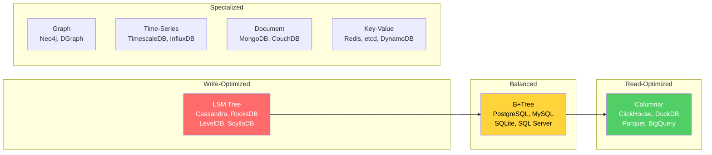

# Databases

Databases are the most critical infrastructure component in any application. They're also the most misunderstood. Most developers interact with databases through ORMs and never learn how they actually work — until something breaks at scale and they have no mental model to debug it.

This section doesn't teach you SQL syntax. It teaches you how databases work internally — from the physical storage of bytes on disk through the query planner's cost-based optimization to the replication protocols that keep your data safe across continents.

## Why Internals Matter

Understanding database internals gives you:

- **Predictable performance:** You'll know why adding an index helps this query but hurts that one
- **Better schema design:** You'll understand the physical implications of your logical model
- **Debugging superpowers:** When a query is slow, you'll know whether it's the planner, the storage engine, the buffer pool, or the network
- **Informed technology choices:** You'll pick the right database for the job instead of defaulting to Postgres for everything

## The Storage Spectrum

## Learning Path

| Order | Topic | What You'll Learn |
|-------|-------|------------------|
| 1 | [Storage Engines](./storage-engines) | How B-trees and LSM trees physically store data on disk |
| 2 | [Write-Ahead Logging](./write-ahead-logging) | How databases survive crashes without losing data |
| 3 | [MVCC](./mvcc) | How readers and writers operate without blocking each other |
| 4 | [Isolation Levels](./isolation-levels) | The four ANSI isolation levels, their anomalies, and real-world behavior |
| 5 | [Indexing Deep Dive](./indexing-deep-dive) | B+tree, hash, GIN, GiST, BRIN — when each index type is optimal |
| 6 | [Query Planning & Optimization](./query-planning-optimization) | How the query planner decides which plan to execute and how to read EXPLAIN output |
| 7 | [Connection Pooling](./connection-pooling) | Why connections are expensive and how pooling works (PgBouncer, connection limits) |
| 8 | [Replication](./replication) | Synchronous, asynchronous, semi-synchronous, and chain replication |
| 9 | [Sharding](./sharding) | Horizontal partitioning strategies, resharding, and cross-shard queries |
| 10 | [PostgreSQL Internals](./postgres-internals) | Deep dive into Postgres architecture — processes, shared buffers, VACUUM, WAL |
| 11 | [Redis Internals](./redis-internals) | Single-threaded architecture, data structures, persistence, clustering |
| 12 | [MongoDB Internals](./mongodb-internals) | WiredTiger, document model, replica sets, sharded clusters |
| 13 | [Database Selection Guide](./database-selection-guide) | Decision framework for choosing the right database |
| 14 | [Time-Series Databases](./time-series-databases) | TimescaleDB, InfluxDB, and the unique challenges of time-series data |
| 15 | [Graph Databases](./graph-databases) | Neo4j, property graphs, Cypher, when graph models are the right choice |
| 16 | [NewSQL](./newsql) | CockroachDB, TiDB, Spanner — distributed SQL with strong consistency |

## Key Insight

Every database is making a trade-off. The art is understanding which trade-off is right for your workload:

| If your workload is... | Optimize for... | Consider... |
|------------------------|-----------------|-------------|
| Heavy writes, append-only | Write throughput | LSM-tree databases (Cassandra, RocksDB) |
| Mixed read/write, OLTP | Balanced latency | B-tree databases (PostgreSQL, MySQL) |
| Analytics, aggregations | Scan speed | Columnar databases (ClickHouse, DuckDB) |
| Key-value lookups | Latency | Redis, DynamoDB, Memcached |
| Highly connected data | Traversal speed | Neo4j, DGraph |
| Time-ordered events | Time-range queries | TimescaleDB, InfluxDB |
| Global distribution | Consistency + availability | CockroachDB, Spanner |
