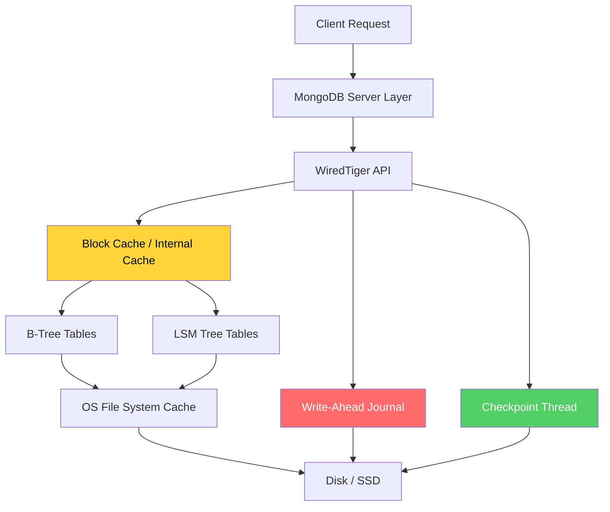
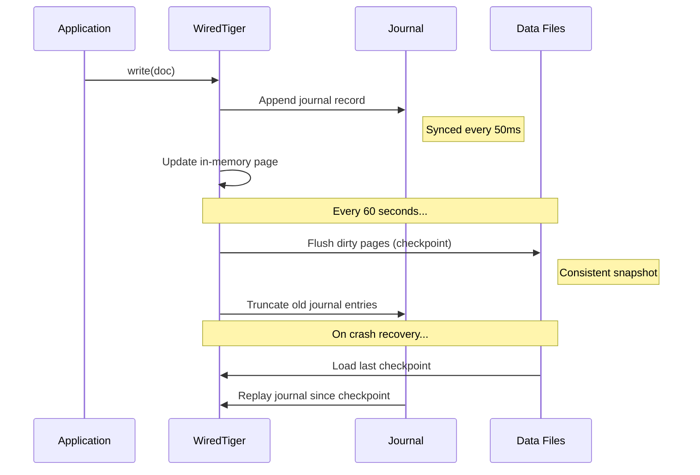
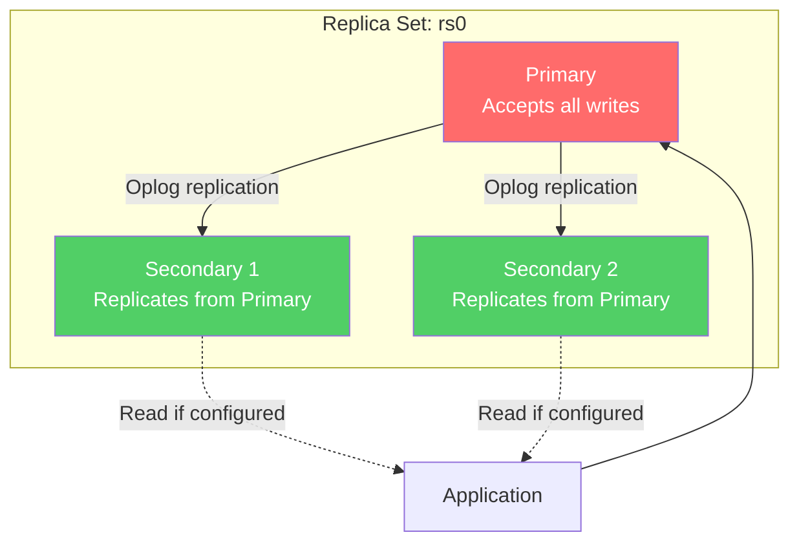
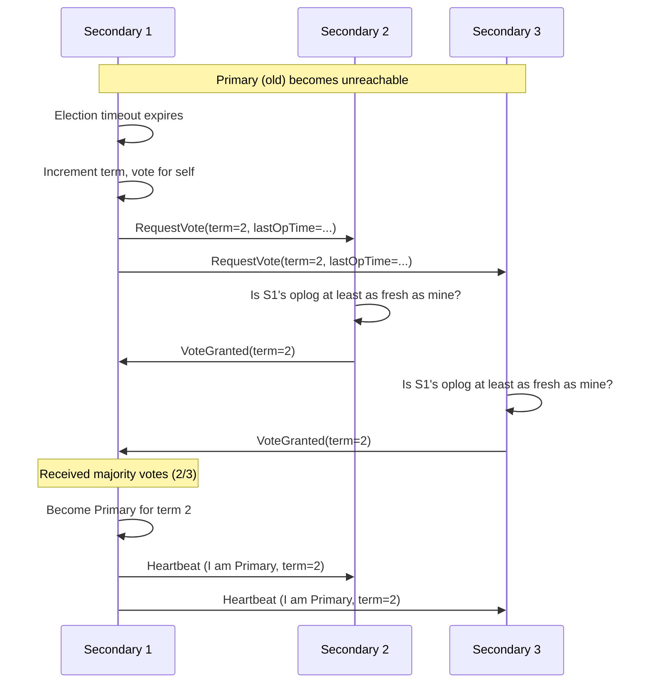
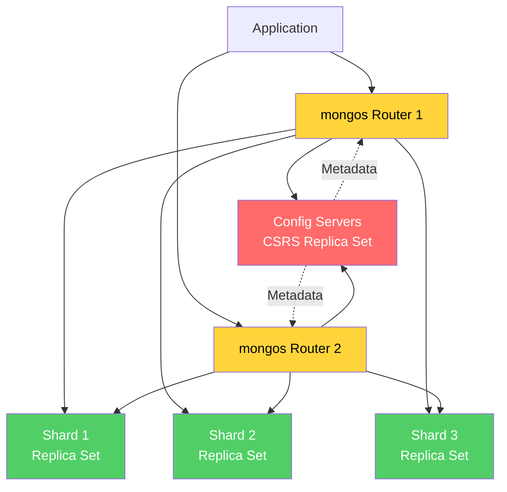
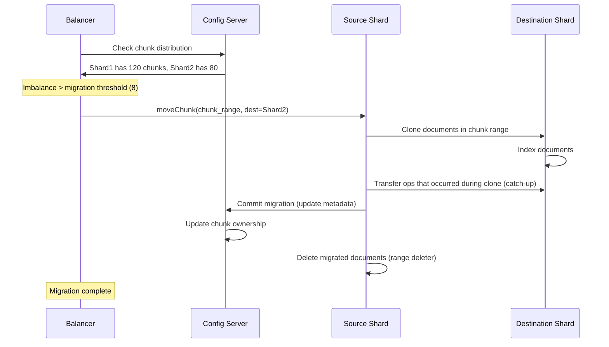
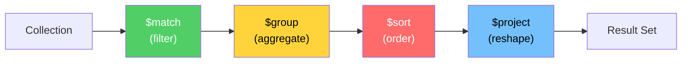
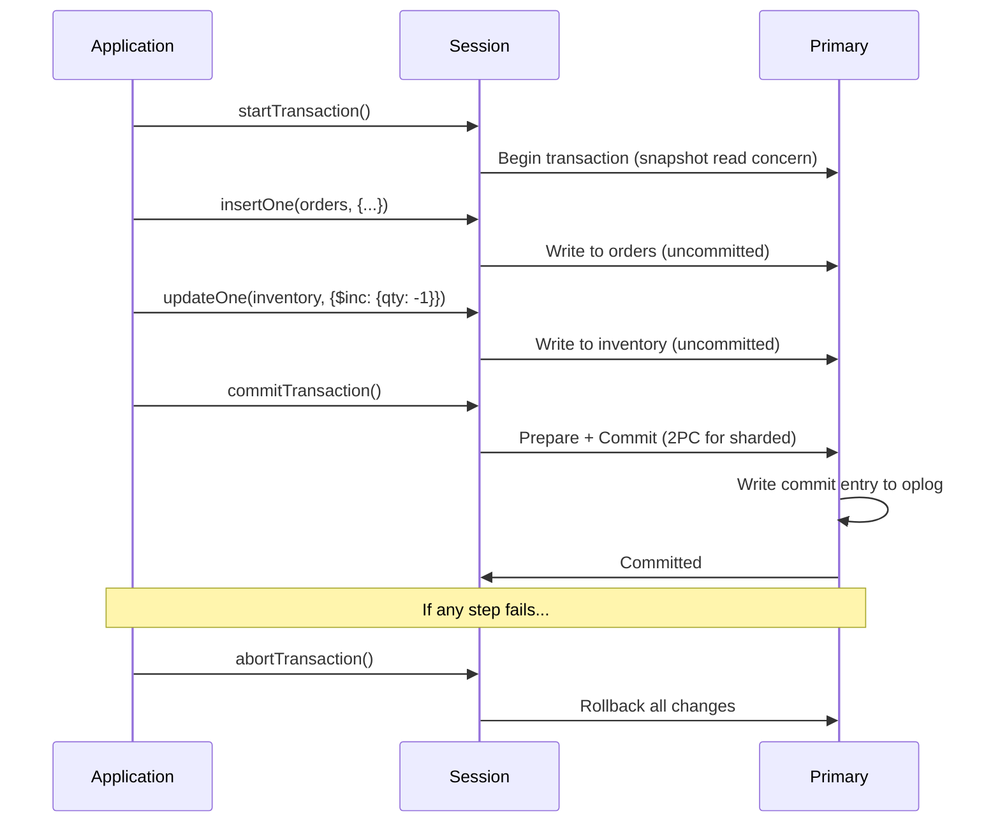

# MongoDB Internals

MongoDB is the most widely deployed document database in production. It is also the most frequently misused — developers treat it as a "schemaless" dumping ground and then wonder why queries take seconds, why the working set doesn't fit in RAM, and why the cluster splits its brain during a network partition. Understanding MongoDB's internals transforms it from a convenience into a precision tool.

This page covers every layer of the stack: the WiredTiger storage engine at the bottom, the document model and BSON encoding in the middle, the replication and sharding protocols at the top, and the aggregation pipeline, indexing, and transaction machinery woven through all of them.

## WiredTiger Storage Engine

MongoDB 3.2+ uses WiredTiger as its default storage engine, replacing the older MMAPv1 engine. WiredTiger is a high-performance, transactional engine originally developed by the creators of BerkeleyDB.

### Architecture Overview



### B-Tree vs LSM Modes

WiredTiger supports two storage formats per collection:

**B-Tree (default for MongoDB):**
- Standard B+ tree structure with pages as the unit of I/O
- Internal pages hold keys and pointers to child pages
- Leaf pages hold keys and the actual document data
- Default page size: 4 KB for internal pages, 32 KB for leaf pages
- Best for workloads with mixed reads and writes — which is most OLTP workloads

**LSM Tree (available but rarely used in MongoDB):**
- Write-optimized: all writes go to an in-memory buffer (memtable)
- When the memtable fills, it is flushed as an immutable sorted run on disk
- Background compaction merges sorted runs to maintain read performance
- Better for write-heavy, append-only workloads

::: warning Why MongoDB Defaults to B-Tree
MongoDB chose B-tree over LSM for its default because MongoDB's workload pattern is predominantly point-lookups by `_id` plus secondary index queries. B-trees offer $O(\log_B n)$ point reads with a single I/O per level. LSM trees require checking multiple levels, leading to read amplification. LSM's write advantage only matters when writes dominate reads by 10:1 or more — rare in typical MongoDB deployments.
:::

### Internal Cache

WiredTiger maintains its own internal cache, separate from the operating system's filesystem cache. This creates a two-tier caching system:

$$
\text{Effective Cache} = \text{WT Internal Cache} + \text{OS Page Cache}
$$

By default, WiredTiger uses whichever is larger:
- 50% of (RAM - 1 GB)
- 256 MB

The internal cache stores data in an uncompressed, decoded format optimized for CPU access. The OS page cache stores compressed, on-disk format pages. This means the same data can exist in both caches in different formats — which is intentional, not wasteful.

```
┌──────────────────────────────────┐
│        WiredTiger Cache          │
│  (uncompressed, decoded pages)   │
│  Fast CPU access, costly memory  │
├──────────────────────────────────┤
│       OS File System Cache       │
│  (compressed, on-disk format)    │
│  Slower access, more data fits   │
├──────────────────────────────────┤
│          Disk / SSD              │
│  (compressed, on-disk format)    │
└──────────────────────────────────┘
```

### Compression

WiredTiger supports block-level compression for both data and indexes:

| Compression | Ratio  | CPU Cost | Best For |
|-------------|--------|----------|----------|
| `snappy` (default) | ~2:1 | Very low | General-purpose, balanced |
| `zlib` | ~3-5:1 | Moderate | Archive data, cold collections |
| `zstd` | ~3-5:1 | Low-moderate | Best ratio-to-speed trade-off (MongoDB 4.2+) |
| `none` | 1:1 | Zero | When CPU is the bottleneck |

For indexes, the default is `prefix` compression — since consecutive keys in a B-tree often share prefixes, this compresses well with minimal CPU overhead.

### Journaling and Durability

WiredTiger uses a write-ahead journal (WAL) for crash recovery:

1. Every write is first recorded in the journal (an append-only log on disk)
2. The journal is synced to disk every 50ms by default (configurable via `storage.journal.commitIntervalMs`)
3. Checkpoint threads periodically write all dirty cache pages to data files (every 60 seconds by default)
4. After a successful checkpoint, journal entries before the checkpoint are no longer needed

$$
\text{Max data loss on crash} = \text{commitIntervalMs} = 50\text{ms (default)}
$$

::: danger The j:true Write Concern
Even with journaling enabled, a write acknowledged with `{w: 1}` only guarantees that the write reached the mongod's memory — not that it was journaled. To guarantee durability on a single node, use `{w: 1, j: true}`. To guarantee durability across the replica set, use `{w: "majority", j: true}`.
:::

### Checkpoints

Checkpoints create a consistent, point-in-time snapshot of all data files:



## The Document Model and BSON

### BSON Format

MongoDB stores documents in BSON (Binary JSON) — a binary-encoded superset of JSON. BSON adds data types that JSON lacks and is designed for efficient traversal.

**BSON structure:**

```
┌────────────┬──────────────────────────────┐
│ int32      │ Total document size in bytes │
├────────────┼──────────────────────────────┤
│ byte       │ Element type (e.g., 0x02 =   │
│            │ string, 0x10 = int32)        │
├────────────┼──────────────────────────────┤
│ cstring    │ Field name (null-terminated) │
├────────────┼──────────────────────────────┤
│ value      │ Field value (type-dependent  │
│            │ encoding)                    │
├────────────┼──────────────────────────────┤
│ ...        │ More elements...             │
├────────────┼──────────────────────────────┤
│ 0x00       │ Terminator byte              │
└────────────┴──────────────────────────────┘
```

**Key BSON types:**

| Type | Code | Size | Notes |
|------|------|------|-------|
| Double | 0x01 | 8 bytes | IEEE 754 floating point |
| String | 0x02 | 4 + len + 1 | Length-prefixed, UTF-8, null-terminated |
| Document | 0x03 | variable | Embedded sub-document |
| Array | 0x04 | variable | Stored as a document with string keys "0", "1", ... |
| Binary | 0x05 | 4 + 1 + len | Generic binary data with subtype |
| ObjectId | 0x07 | 12 bytes | 4-byte timestamp + 5-byte random + 3-byte counter |
| Boolean | 0x08 | 1 byte | 0x00 or 0x01 |
| DateTime | 0x09 | 8 bytes | Milliseconds since Unix epoch |
| Int32 | 0x10 | 4 bytes | Signed 32-bit integer |
| Int64 | 0x12 | 8 bytes | Signed 64-bit integer |
| Decimal128 | 0x13 | 16 bytes | IEEE 754 decimal (MongoDB 3.4+) |

### The ObjectId

Every document requires an `_id` field. If not provided, MongoDB auto-generates an ObjectId:

$$
\text{ObjectId (12 bytes)} = \underbrace{T_{4}}_{\text{timestamp}} \| \underbrace{R_{5}}_{\text{random}} \| \underbrace{C_{3}}_{\text{counter}}
$$

- **Timestamp (4 bytes):** Unix epoch seconds — makes ObjectIds roughly time-sortable
- **Random value (5 bytes):** Per-process random value — unique per machine/process
- **Counter (3 bytes):** Incrementing counter initialized to a random value — handles multiple inserts within the same second

This design means ObjectIds are globally unique without coordination between nodes — critical for distributed systems. Since the timestamp is the first component, ObjectIds are roughly chronologically ordered, which means inserts to the `_id` index are append-mostly (good for B-tree performance).

::: tip ObjectId Ordering Caveat
ObjectIds are roughly — not strictly — time-ordered. Two ObjectIds generated on different machines in the same second will have the same timestamp prefix but different random values. Do not rely on ObjectId ordering for strict event sequencing. Use an explicit `createdAt` timestamp field instead.
:::

### Document Size Limit

MongoDB imposes a **16 MB maximum document size**. This is a deliberate design constraint:

- It prevents a single document from consuming excessive memory during processing
- It encourages proper schema design (normalize when documents grow too large)
- It keeps network transfer sizes reasonable

For documents exceeding 16 MB (like large files), use GridFS, which splits files into 255 KB chunks stored across multiple documents.

## Replica Sets

A replica set is a group of mongod instances that maintain the same data set, providing redundancy and high availability. This is MongoDB's fundamental unit of data safety.

### Replica Set Topology



### The Oplog

The oplog (operation log) is a capped collection (`local.oplog.rs`) that records every write operation applied to the primary. Secondaries tail this oplog to replicate data.

**Oplog entry structure:**

```javascript
{
  "ts": Timestamp(1679000000, 1),   // Timestamp + ordinal
  "t": NumberLong(1),                // Election term
  "h": NumberLong(0),                // Deprecated hash
  "v": 2,                           // Oplog version
  "op": "i",                        // Operation type: i/u/d/c/n
  "ns": "mydb.users",               // Namespace
  "ui": UUID("..."),                 // Collection UUID
  "wall": ISODate("..."),           // Wall clock time
  "o": {                            // Operation document
    "_id": ObjectId("..."),
    "name": "Alice",
    "age": 30
  }
}
```

**Operation types:**
- `i` — insert
- `u` — update
- `d` — delete
- `c` — command (e.g., createCollection, dropDatabase)
- `n` — no-op (used for keepalives and as barriers)

::: warning Oplog Is Idempotent
Every oplog entry is idempotent. An `update` that increments a field by 1 is NOT stored as `$inc: {count: 1}` — it is stored as `$set: {count: 42}` (the final value). This means replaying the oplog multiple times produces the same result. This is critical for initial sync, rollback recovery, and change stream resumability.
:::

### Election Protocol

MongoDB uses a Raft-like consensus protocol (since MongoDB 3.2) for primary elections. When the primary becomes unreachable, the remaining members elect a new primary.

**Election triggers:**
1. The primary steps down (manually or due to `rs.stepDown()`)
2. A secondary cannot reach the primary for `electionTimeoutMillis` (default: 10 seconds)
3. A higher-priority member detects that the current primary has lower priority

**Election process:**



**Election constraints:**
- A member only votes for a candidate whose oplog is **at least as up-to-date** as its own
- A member only votes once per term
- A majority (more than half) of voting members must agree
- Only members with `priority > 0` can become primary
- Members with `votes: 0` do not participate in elections

$$
\text{Majority} = \left\lfloor \frac{N}{2} \right\rfloor + 1
$$

For a 3-member replica set, majority = 2. For a 5-member set, majority = 3.

::: danger Split-Brain Protection
The majority requirement prevents split-brain. If the network partitions a 5-member set into groups of 2 and 3, only the group of 3 can elect a primary (since 3 >= majority). The group of 2 will have no primary and will reject writes. This guarantees at most one primary exists at any time.
:::

### Read Preference

Read preference controls which replica set member the driver sends read operations to:

| Mode | Behavior | Use Case |
|------|----------|----------|
| `primary` (default) | All reads go to the primary | Strong consistency required |
| `primaryPreferred` | Reads go to primary; falls back to secondary if primary unavailable | Consistency with higher availability |
| `secondary` | Reads go to a secondary | Offload reads from primary, tolerate stale data |
| `secondaryPreferred` | Prefers secondary; falls back to primary | Analytics queries that shouldn't impact primary |
| `nearest` | Reads from the member with lowest network latency | Geo-distributed clusters, latency-sensitive reads |

::: warning Secondary Reads Are Eventually Consistent
Reading from a secondary means you may see stale data. The replication lag between primary and secondary is typically milliseconds but can spike to seconds during high write load, index builds, or compaction. Never use `secondary` read preference if your application requires read-your-own-writes consistency — unless you use causal consistency sessions (MongoDB 3.6+).
:::

## Sharded Clusters

When a single replica set cannot handle the data volume or throughput requirements, MongoDB supports horizontal scaling through sharded clusters.

### Sharded Cluster Architecture



### Components

**mongos (Query Router):**
- Stateless routers that direct queries to the correct shard(s)
- Caches metadata from config servers to know which shard holds which data
- Multiple mongos instances run for redundancy — they are interchangeable
- Performs scatter-gather for queries that span multiple shards

**Config Servers (CSRS):**
- A replica set storing cluster metadata: shard topology, chunk ranges, migration state
- Stores the authoritative mapping of chunk ranges to shards
- Must be a 3-member replica set (not an arbiter-containing set)
- Loss of config server majority halts all metadata operations (though existing queries can continue)

**Shards:**
- Each shard is a replica set holding a subset of the sharded data
- Each shard also stores unsharded collections that are local to it
- The `primary shard` for a database stores all unsharded collections for that database

### Shard Key Selection

The shard key determines how documents are distributed across shards. This is the single most important decision in a sharded MongoDB deployment.

**Shard key properties:**

| Property | Good | Bad |
|----------|------|-----|
| **Cardinality** | High (many distinct values) | Low (few distinct values — limits max shards) |
| **Frequency** | Uniform distribution | Skewed (hot shard) |
| **Monotonic change** | Random or hashed | Monotonically increasing (all writes go to last chunk) |
| **Query isolation** | Queries include shard key (targeted) | Queries don't include shard key (scatter-gather) |

::: danger The ObjectId Anti-Pattern
Using `{_id: 1}` as the shard key on a collection with auto-generated ObjectIds is one of the most common and damaging mistakes. Because ObjectIds are monotonically increasing (the timestamp prefix), ALL writes are directed to the single shard that owns the current maximum range. This creates a hot shard while other shards sit idle. Use a hashed shard key `{_id: "hashed"}` or choose a key with better distribution.
:::

### Chunk Migration

Chunks are contiguous ranges of shard key values. The balancer process runs on the config server primary and moves chunks between shards to maintain even distribution.

**Chunk lifecycle:**



The migration threshold depends on the total number of chunks:

$$
\text{threshold} = \begin{cases} 2 & \text{if total chunks} < 20 \\ 4 & \text{if } 20 \le \text{total chunks} < 80 \\ 8 & \text{if total chunks} \ge 80 \end{cases}
$$

### Targeted vs Scatter-Gather Queries

When a query includes the shard key, mongos can route the query to the specific shard that holds the data (**targeted query**). When the query does not include the shard key, mongos must send the query to ALL shards and merge the results (**scatter-gather query**).

$$
\text{Latency}_{\text{targeted}} = \text{network}_{1} + \text{shard query time}
$$

$$
\text{Latency}_{\text{scatter-gather}} = \text{network}_{N} + \max(\text{shard query times})
$$

For high-throughput applications, scatter-gather queries are a performance killer. Design your shard key so that the most frequent queries are targeted.

## Aggregation Pipeline

MongoDB's aggregation pipeline is a framework for data processing that passes documents through a sequence of stages. Each stage transforms the documents as they pass through.

### Pipeline Stages



**Core stages:**

| Stage | Purpose | Notes |
|-------|---------|-------|
| `$match` | Filter documents | Uses indexes when at the beginning of the pipeline |
| `$project` / `$addFields` | Reshape documents, compute fields | Cannot use indexes |
| `$group` | Aggregate by key (sum, avg, count, etc.) | Requires full scan of input |
| `$sort` | Order documents | Uses indexes when early in pipeline |
| `$lookup` | Left outer join with another collection | Similar to SQL LEFT JOIN |
| `$unwind` | Deconstruct array fields | Creates one document per array element |
| `$facet` | Multiple sub-pipelines in one pass | Each sub-pipeline sees the same input |
| `$bucket` / `$bucketAuto` | Group into ranges | Useful for histograms |
| `$graphLookup` | Recursive graph traversal | Tree/graph structures within collections |
| `$merge` / `$out` | Write results to a collection | `$merge` is incremental, `$out` replaces |
| `$setWindowFields` | Window functions (running totals, ranks) | MongoDB 5.0+ |

### Pipeline Optimization

MongoDB's query planner applies several automatic optimizations to the aggregation pipeline:

**1. `$match` + `$match` coalescence:**
```javascript
// Before optimization:
{ $match: { status: "active" } },
{ $match: { age: { $gte: 18 } } }

// After optimization:
{ $match: { status: "active", age: { $gte: 18 } } }
```

**2. `$sort` + `$match` reordering:**
If a `$match` follows a `$sort`, MongoDB moves the `$match` before the `$sort` to reduce the number of documents to sort.

**3. `$project` + `$skip` / `$limit` reordering:**
MongoDB pushes `$skip` and `$limit` before `$project` to reduce the number of documents that need reshaping.

**4. `$lookup` + `$unwind` coalescence:**
When `$unwind` immediately follows `$lookup` on the same field, MongoDB combines them into a single optimized stage that avoids materializing the full joined array.

::: tip allowDiskUse
By default, each pipeline stage can use a maximum of 100 MB of RAM. If a stage exceeds this (common with `$sort` and `$group` on large datasets), the operation fails. Pass `{allowDiskUse: true}` to spill to disk — but this is significantly slower. Better to add a `$match` early in the pipeline to reduce the data volume.
:::

## Indexes

Indexes are B-tree structures (stored by WiredTiger) that allow MongoDB to efficiently locate documents without scanning every document in a collection.

### Index Types

**Compound Index:**
```javascript
db.orders.createIndex({ customerId: 1, orderDate: -1 })
```
Supports queries on `customerId` alone, or `customerId` + `orderDate`. Does NOT efficiently support queries on `orderDate` alone (leftmost prefix rule — same as relational databases).

$$
\text{Compound index on } (A, B, C) \text{ supports:} \begin{cases} A \\ A, B \\ A, B, C \end{cases}
$$

**Multikey Index:**
Automatically created when an indexed field contains an array. MongoDB creates a separate index entry for each element of the array.

```javascript
// Document: { tags: ["mongodb", "database", "nosql"] }
db.articles.createIndex({ tags: 1 })
// Creates 3 index entries for this single document
```

::: warning Compound Multikey Limitation
A compound index can have at most ONE field whose value is an array. If you try to insert a document where two indexed fields are both arrays, MongoDB will reject the insert with an error. This is because the cross-product of two arrays would create $n \times m$ index entries per document, leading to index explosion.
:::

**Text Index:**
```javascript
db.articles.createIndex({ title: "text", body: "text" })
```
Supports `$text` queries with stemming, stop words, and relevance scoring. Each collection can have at most one text index. For production full-text search, consider Atlas Search (Lucene-based) or external Elasticsearch.

**Geospatial Indexes:**
- `2dsphere` — for Earth-like spherical geometry (GeoJSON points, lines, polygons)
- `2d` — for flat Euclidean plane (legacy, rarely used)

```javascript
db.places.createIndex({ location: "2dsphere" })
// Query: find all restaurants within 5km
db.places.find({
  location: {
    $near: {
      $geometry: { type: "Point", coordinates: [-73.97, 40.77] },
      $maxDistance: 5000
    }
  }
})
```

**Hashed Index:**
```javascript
db.users.createIndex({ email: "hashed" })
```
Hashes the field value and indexes the hash. Provides uniform distribution for shard keys but only supports equality queries — no range queries, no sorting.

**Wildcard Index (MongoDB 4.2+):**
```javascript
db.data.createIndex({ "metadata.$**": 1 })
```
Indexes all fields under a path, useful when the schema is truly dynamic and you can't predict which fields will be queried. Carries a significant write overhead — every update to any field under `metadata` updates the index.

### The ESR Rule

For compound indexes, the **ESR (Equality, Sort, Range)** rule produces optimal index key ordering:

1. **E**quality predicates first — fields compared with `=` or `$eq`
2. **S**ort fields next — fields in the `sort()` specification
3. **R**ange predicates last — fields compared with `$gt`, `$lt`, `$in`, etc.

```javascript
// Query: find active users in a city, sorted by age
db.users.find({ status: "active", age: { $gte: 18 } }).sort({ name: 1 })

// Optimal index (ESR):
db.users.createIndex({ status: 1, name: 1, age: 1 })
//                      ^^^^^^^^   ^^^^^^   ^^^^^^
//                      Equality   Sort     Range
```

## Read and Write Concerns

### Write Concern

Write concern determines how many replica set members must acknowledge a write before the driver considers it successful.

| Write Concern | Behavior | Durability | Performance |
|---------------|----------|------------|-------------|
| `{w: 0}` | Fire and forget — no acknowledgment | None | Fastest |
| `{w: 1}` (default) | Primary acknowledges | Survives primary process crash (if journaled) | Fast |
| `{w: "majority"}` | Majority of members acknowledge | Survives primary failure | Slower |
| `{w: <n>}` | `n` members acknowledge | Survives `n-1` member failures | Varies |

Adding `{j: true}` requires that the write has been committed to the journal on the acknowledging members.

$$
\text{Durability guarantee} = f(w, j) = \begin{cases}
\text{None} & w=0 \\
\text{Process crash survival} & w=1, j=\text{false} \\
\text{Node crash survival} & w=1, j=\text{true} \\
\text{Replica set failover survival} & w=\text{majority}, j=\text{true}
\end{cases}
$$

### Read Concern

Read concern determines the consistency and isolation level of read operations:

| Read Concern | Behavior | Guarantee |
|-------------|----------|-----------|
| `"local"` (default) | Returns most recent data from the queried node | No durability guarantee — data might be rolled back |
| `"available"` | Like `local` but for sharded clusters — may return orphaned documents | Fastest for sharded reads |
| `"majority"` | Returns data acknowledged by a majority | Data will not be rolled back |
| `"linearizable"` | Returns data reflecting all `majority`-committed writes before the read | Strongest — equivalent to a single-copy system |
| `"snapshot"` | For multi-document transactions — sees a consistent snapshot | MVCC-based transaction isolation |

::: tip Read-Your-Own-Writes
To guarantee read-your-own-writes consistency in MongoDB, use causal consistency sessions (MongoDB 3.6+). Within a causally consistent session, reads are guaranteed to see all prior writes from the same session, even if reads go to secondaries.

```javascript
const session = client.startSession({ causalConsistency: true });
const coll = session.getDatabase("mydb").getCollection("users");
coll.insertOne({ name: "Alice" });
const alice = coll.findOne({ name: "Alice" }); // guaranteed to find her
```
:::

## Change Streams

Change streams (MongoDB 3.6+) allow applications to subscribe to real-time data changes without polling. They are built on top of the oplog and provide a resumable, ordered stream of change events.

```javascript
const changeStream = db.collection("orders").watch([
  { $match: { "fullDocument.status": "shipped" } }
]);

changeStream.on("change", (event) => {
  // event.operationType: "insert" | "update" | "replace" | "delete"
  // event.fullDocument: the complete document (for insert/replace)
  // event.updateDescription: { updatedFields, removedFields }
  // event._id: resume token
  console.log(event);
});
```

**Resume tokens:** Each change event includes a resume token (`_id`). If the application disconnects, it can resume from exactly where it left off by passing the token to `watch({ resumeAfter: token })`. This works even across primary elections because resume tokens reference oplog positions.

Change streams are the foundation for:
- Real-time synchronization between services
- Event-driven architectures (replacing CDC tools like Debezium in some cases)
- Maintaining materialized views
- Triggering downstream processing (Atlas Triggers)

## Multi-Document Transactions

MongoDB 4.0 introduced multi-document ACID transactions for replica sets. MongoDB 4.2 extended them to sharded clusters.

### Transaction Lifecycle



### Transaction Limitations

| Limit | Value | Rationale |
|-------|-------|-----------|
| Max transaction time | 60 seconds (default) | Prevents long-running transactions from blocking oplog application |
| Max oplog entry size | 16 MB | Each transaction creates a single oplog entry |
| Max documents modified | No hard limit, but bounded by 16 MB oplog entry | Very large transactions must be split |
| DDL operations | Not allowed inside transactions | Cannot create/drop collections inside a transaction |
| Cross-shard transactions | Supported (4.2+) | Uses internal two-phase commit |

::: warning Transaction Performance Impact
Transactions in MongoDB are not free. They hold WiredTiger snapshots open for the duration of the transaction, which increases cache pressure. Long-running transactions prevent WiredTiger from reclaiming snapshot memory. In the worst case, a very long transaction can cause the WiredTiger cache to fill up, blocking all writes cluster-wide. Keep transactions short — ideally under 1 second.
:::

## Monitoring and Diagnostics

### serverStatus

`db.serverStatus()` is the most comprehensive monitoring command. Key sections to watch:

```javascript
// Connection metrics
db.serverStatus().connections
// { current: 142, available: 51058, totalCreated: 28491 }

// WiredTiger cache metrics
db.serverStatus().wiredTiger.cache
// "bytes currently in the cache": 1073741824,
// "maximum bytes configured": 2147483648,
// "pages read into cache": 1200000,
// "pages written from cache": 800000

// Operation counters
db.serverStatus().opcounters
// { insert: 100000, query: 5000000, update: 200000, delete: 10000 }
```

### currentOp

`db.currentOp()` shows all in-progress operations. Critical for finding long-running queries:

```javascript
db.currentOp({
  "active": true,
  "secs_running": { "$gte": 5 }  // operations running > 5 seconds
})
```

### Database Profiler

The profiler captures slow operations into the `system.profile` collection:

```javascript
// Enable profiling for operations slower than 100ms
db.setProfilingLevel(1, { slowms: 100 })

// Query the profiler
db.system.profile.find().sort({ ts: -1 }).limit(5)
```

**Profiler levels:**
- `0` — Off
- `1` — Slow operations only (above `slowms` threshold)
- `2` — All operations (WARNING: massive overhead in production)

### Common Performance Issues and Solutions

| Symptom | Likely Cause | Solution |
|---------|-------------|----------|
| High query latency | Missing index | Run `explain()`, add appropriate index |
| Growing replication lag | Secondaries can't keep up | Check secondary I/O, add secondaries, optimize writes |
| WiredTiger cache pressure | Working set exceeds cache | Increase RAM, archive old data, add shards |
| Connection count at limit | Connection leak or no pooling | Use connection pooling, check `maxPoolSize` |
| Slow writes | Unacknowledged index builds | Build indexes in background, schedule during low traffic |
| Scatter-gather queries | Missing shard key in query | Redesign queries or change shard key |
| Jumbo chunks | Low-cardinality shard key | Choose a higher-cardinality shard key |
| Page faults | Working set > available RAM | Scale vertically (more RAM) or horizontally (more shards) |
| Lock contention | Collection-level locks on DDL | Avoid frequent DDL operations, batch admin tasks |
| Oplog window too short | High write volume, small oplog | Increase oplog size with `replSetResizeOplog` |

### Diagnostic Checklist

When a MongoDB deployment is underperforming, work through this checklist in order:

1. **Check `explain("executionStats")`** for the slow query — is it using the expected index?
2. **Check WiredTiger cache utilization** — is the cache consistently above 80%?
3. **Check replication lag** — are secondaries falling behind?
4. **Check connection count** — are you running out of connections?
5. **Check disk I/O** — is the disk saturated (iostat/iotop)?
6. **Check the profiler** — what other slow operations are running concurrently?
7. **Check the balancer** — is chunk migration consuming resources?
8. **Check for collection scans** — are any queries doing `COLLSCAN` instead of `IXSCAN`?
9. **Check for index intersection** — is MongoDB merging two indexes instead of using a compound index?
10. **Check document size and structure** — are documents excessively large or deeply nested?

$$
\text{Performance} = f\!\left(\frac{\text{Working Set Size}}{\text{Available RAM}}, \text{Index Coverage}, \text{Query Pattern}, \text{Disk IOPS}\right)
$$

When the working set fits in RAM, most operations are sub-millisecond. When it doesn't, performance degrades non-linearly as the system transitions from cache-dominated to I/O-dominated operation.
