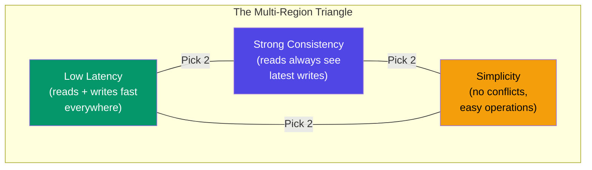
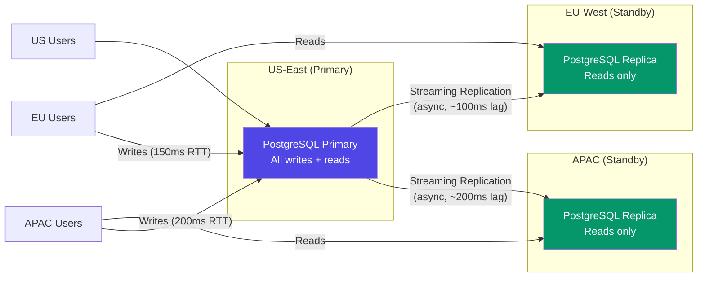
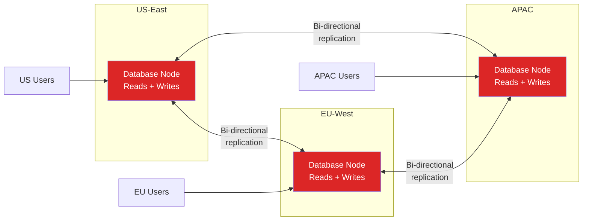
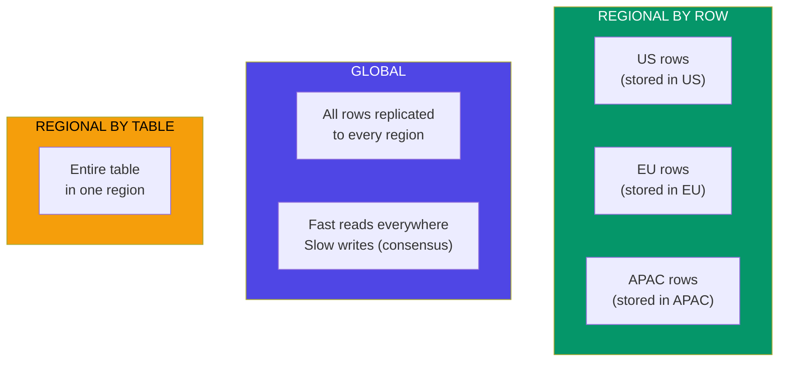
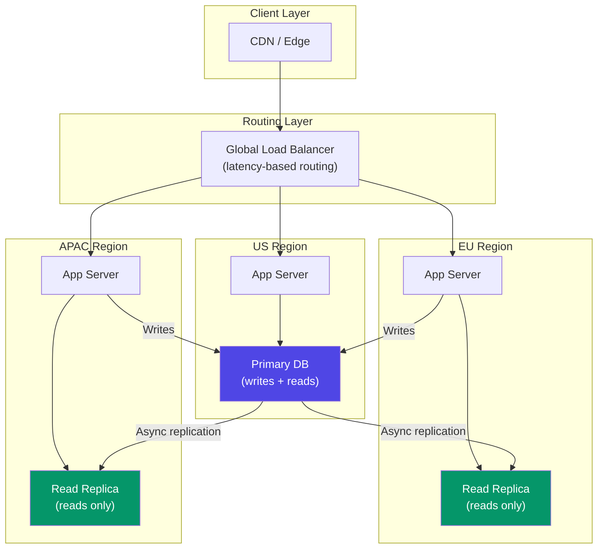

# Multi-Region Database Strategies

A single-region database has a hard ceiling: it cannot serve users on the other side of the planet with acceptable latency. A query from Tokyo to a database in Virginia takes 150-200ms round trip — and that is just the network latency, before query execution. Multiply by the number of queries per page load, and the user experience degrades to the point where people leave.

Multi-region database architecture solves this by distributing data across multiple geographic regions. The trade-off is fundamental: you are fighting the speed of light. Data cannot be in Virginia and Tokyo simultaneously, so you must choose what to sacrifice — latency, consistency, or complexity. This page covers every strategy for making that choice, with production configurations for the databases that support it.

## The Fundamental Trade-Off



You can have at most two of these three properties:

| Strategy | Latency | Consistency | Simplicity |
|----------|---------|-------------|------------|
| Active-passive | Writes are slow (cross-region) | Strong | Simple |
| Active-active with conflict resolution | Fast everywhere | Eventual | Complex |
| Distributed SQL (Spanner, CockroachDB) | Fast reads, slower writes | Strong | Medium |
| Read replicas | Fast reads, slow writes | Eventual reads | Simple |

## Active-Passive

In active-passive (also called primary-standby), one region has the primary database and handles all writes. Other regions have read replicas. If the primary region fails, a standby is promoted.



### Advantages

- Simple to operate — same as single-region PostgreSQL with replicas
- Strong consistency for writes (single primary)
- Mature tooling (PostgreSQL, MySQL native replication)

### Disadvantages

- Writes from non-primary regions are slow (cross-region latency)
- Failover requires promotion (30-60 seconds downtime)
- Primary region is a single point of failure

### PostgreSQL Cross-Region Replication

```ini
# Primary (us-east-1) — postgresql.conf
wal_level = replica
max_wal_senders = 10
wal_keep_size = '4GB'
synchronous_standby_names = ''       # async for cross-region (sync is too slow)

# Replica (eu-west-1) — postgresql.auto.conf
primary_conninfo = 'host=primary.us-east-1.internal port=5432 user=replicator password=... sslmode=require'
primary_slot_name = 'eu_west_replica'
```

### Read Routing with Connection Pooling

```typescript
// Application-level read routing
class DatabaseRouter {
  private primary: Pool;      // us-east-1
  private replicas: Pool[];   // eu-west-1, ap-northeast-1

  async query(sql: string, params: unknown[], options?: { readonly?: boolean }) {
    if (options?.readonly) {
      // Route reads to nearest replica
      const replica = this.getNearestReplica();
      return replica.query(sql, params);
    }
    // All writes go to primary
    return this.primary.query(sql, params);
  }

  private getNearestReplica(): Pool {
    // In practice, use latency-based selection or region detection
    const region = process.env.AWS_REGION;
    const replicaMap: Record<string, number> = {
      'us-east-1': 0,        // Use primary for US reads
      'eu-west-1': 0,        // EU replica
      'ap-northeast-1': 1,   // APAC replica
    };
    return this.replicas[replicaMap[region] ?? 0];
  }
}
```

::: warning Replication Lag and Stale Reads
Cross-region async replication has 100-500ms lag. A user who writes data and immediately reads it from a replica may not see their own write. Solutions: (1) read-your-writes consistency — route reads to the primary for N seconds after a write, (2) sticky sessions to the primary for write-heavy flows.
:::

## Active-Active

In active-active, every region can handle both reads and writes. This provides the lowest latency for all operations but introduces the hardest problem in distributed systems: write conflicts.



### Conflict Resolution Strategies

When two regions write to the same row simultaneously, you have a conflict. There are four strategies:

| Strategy | How It Works | Data Loss Risk | Complexity |
|----------|-------------|---------------|-----------|
| Last Write Wins (LWW) | Timestamp-based, latest write overwrites | Yes — earlier write is silently lost | Low |
| Custom merge function | Application logic resolves conflicts | Depends on logic | High |
| CRDTs | Conflict-free data structures | No — mathematically guaranteed | High (limited data types) |
| Region ownership | Each region owns specific data, no conflicts | No | Medium |

### Last Write Wins (LWW)

```sql
-- LWW with PostgreSQL logical replication and conflict resolution
-- Each row has an updated_at timestamp
-- On conflict, keep the row with the latest timestamp

CREATE TABLE users (
    id UUID PRIMARY KEY,
    name TEXT NOT NULL,
    email TEXT NOT NULL,
    updated_at TIMESTAMPTZ NOT NULL DEFAULT now()
);

-- Conflict resolution trigger (custom)
CREATE OR REPLACE FUNCTION resolve_conflict() RETURNS TRIGGER AS $$
BEGIN
    -- If incoming row has older timestamp, skip it
    IF EXISTS (
        SELECT 1 FROM users
        WHERE id = NEW.id AND updated_at > NEW.updated_at
    ) THEN
        RETURN NULL; -- skip this row
    END IF;
    RETURN NEW;
END;
$$ LANGUAGE plpgsql;
```

::: danger LWW Loses Data
Last Write Wins means "Last Write Wins, Earlier Write Loses." If a US user updates their profile and an EU admin updates the same profile 10ms later, the US update is silently overwritten. This is acceptable for some data (preferences, caches) but not for financial data or inventory counts.
:::

### Region Ownership Pattern

The safest active-active strategy: assign each piece of data to a specific region. Only the owning region writes to that data. All other regions have read-only copies.

```typescript
// Region ownership based on user's home region
function getOwnerRegion(userId: string): string {
  // User's home region is determined at registration time
  // and stored with the user record
  const user = cache.get(userId);
  return user.homeRegion; // 'us-east-1', 'eu-west-1', etc.
}

async function updateUser(userId: string, data: UpdateUserData) {
  const ownerRegion = getOwnerRegion(userId);
  const currentRegion = process.env.AWS_REGION;

  if (ownerRegion !== currentRegion) {
    // Forward write to the owning region
    return forwardToRegion(ownerRegion, 'PUT', `/users/${userId}`, data);
  }

  // We own this user — write locally
  return db.users.update(userId, data);
}
```

## Distributed SQL Databases

Distributed SQL databases (CockroachDB, YugabyteDB, Google Spanner) solve the multi-region problem at the database level. They provide SQL semantics, strong consistency, and automatic data distribution — at the cost of higher write latency and operational complexity.

### CockroachDB

CockroachDB is a distributed SQL database built on the Raft consensus protocol. It automatically replicates data across regions and provides serializable isolation.

```sql
-- CockroachDB: create a multi-region database
ALTER DATABASE mydb SET PRIMARY REGION "us-east1";
ALTER DATABASE mydb ADD REGION "europe-west1";
ALTER DATABASE mydb ADD REGION "asia-northeast1";

-- Table locality: REGIONAL BY ROW routes rows to their home region
CREATE TABLE users (
    id UUID PRIMARY KEY DEFAULT gen_random_uuid(),
    name TEXT NOT NULL,
    email TEXT NOT NULL,
    region crdb_internal_region NOT NULL DEFAULT gateway_region()::crdb_internal_region
) LOCALITY REGIONAL BY ROW;

-- Table locality: GLOBAL tables are optimized for low-latency reads
-- (writes require consensus across all regions)
CREATE TABLE countries (
    code TEXT PRIMARY KEY,
    name TEXT NOT NULL,
    currency TEXT NOT NULL
) LOCALITY GLOBAL;

-- Table locality: REGIONAL BY TABLE pins entire table to one region
CREATE TABLE audit_logs (
    id UUID PRIMARY KEY DEFAULT gen_random_uuid(),
    event_type TEXT NOT NULL,
    data JSONB NOT NULL,
    created_at TIMESTAMPTZ NOT NULL DEFAULT now()
) LOCALITY REGIONAL BY TABLE IN PRIMARY REGION;
```

### CockroachDB Locality Types



| Locality | Read Latency | Write Latency | Best For |
|----------|-------------|---------------|---------|
| REGIONAL BY ROW | Low (local reads) | Low (local writes) | User data, orders |
| GLOBAL | Low (everywhere) | High (multi-region consensus) | Reference data, config |
| REGIONAL BY TABLE | Low (in home region) | Low (in home region) | Audit logs, analytics |

### YugabyteDB

YugabyteDB is PostgreSQL-compatible distributed SQL. Migration from PostgreSQL is straightforward because it supports the same SQL syntax and wire protocol:

```sql
-- YugabyteDB: geo-partitioned table
CREATE TABLESPACE us_east_ts WITH (
    replica_placement='{"num_replicas": 3, "placement_blocks":
      [{"cloud":"aws","region":"us-east-1","zone":"us-east-1a","min_num_replicas":1},
       {"cloud":"aws","region":"us-east-1","zone":"us-east-1b","min_num_replicas":1},
       {"cloud":"aws","region":"us-east-1","zone":"us-east-1c","min_num_replicas":1}]}'
);

CREATE TABLESPACE eu_west_ts WITH (
    replica_placement='{"num_replicas": 3, "placement_blocks":
      [{"cloud":"aws","region":"eu-west-1","zone":"eu-west-1a","min_num_replicas":1},
       {"cloud":"aws","region":"eu-west-1","zone":"eu-west-1b","min_num_replicas":1},
       {"cloud":"aws","region":"eu-west-1","zone":"eu-west-1c","min_num_replicas":1}]}'
);

-- Geo-partitioned table
CREATE TABLE orders (
    id UUID NOT NULL,
    region TEXT NOT NULL,
    customer_id UUID NOT NULL,
    total DECIMAL(10,2) NOT NULL,
    created_at TIMESTAMPTZ DEFAULT now(),
    PRIMARY KEY (id, region)
) PARTITION BY LIST (region);

CREATE TABLE orders_us PARTITION OF orders
    FOR VALUES IN ('us') TABLESPACE us_east_ts;

CREATE TABLE orders_eu PARTITION OF orders
    FOR VALUES IN ('eu') TABLESPACE eu_west_ts;
```

### Google Spanner

Google Spanner is the original globally-distributed, strongly-consistent database. It uses TrueTime (GPS + atomic clocks) for globally synchronized timestamps:

```sql
-- Spanner: interleaved tables for data locality
CREATE TABLE Users (
    UserId STRING(36) NOT NULL,
    Region STRING(10) NOT NULL,
    Name STRING(100) NOT NULL,
    Email STRING(255) NOT NULL,
) PRIMARY KEY (UserId);

-- Orders interleaved with Users — stored physically together
CREATE TABLE Orders (
    UserId STRING(36) NOT NULL,
    OrderId STRING(36) NOT NULL,
    Total NUMERIC NOT NULL,
    Status STRING(20) NOT NULL,
    CreatedAt TIMESTAMP NOT NULL OPTIONS (allow_commit_timestamp=true),
) PRIMARY KEY (UserId, OrderId),
  INTERLEAVE IN PARENT Users ON DELETE CASCADE;
```

### Distributed SQL Comparison

| Feature | CockroachDB | YugabyteDB | Google Spanner |
|---------|-------------|------------|----------------|
| SQL compatibility | PostgreSQL-like | PostgreSQL wire-compatible | Google SQL |
| Consistency | Serializable | Snapshot (default) | External consistency |
| Open source | Yes (BSL) | Yes (Apache 2.0) | No (managed only) |
| Time synchronization | NTP (hybrid logical clocks) | NTP (hybrid logical clocks) | TrueTime (GPS + atomic) |
| Self-hosted | Yes | Yes | No |
| Managed service | CockroachDB Cloud | YugabyteDB Managed | Google Cloud Spanner |
| Min latency (write) | ~50ms (cross-region) | ~50ms (cross-region) | ~10ms (within region) |
| Learning curve | Medium | Low (if you know PG) | High |

## Latency vs Consistency Trade-Offs

### Latency Budget

```
User action → Application server → Database → Response

Within region:     2ms  +  1ms  +  5ms  +  1ms  =  ~9ms
Cross-region:      2ms  +  1ms  + 150ms +  1ms  =  ~154ms
Multi-region write: 2ms +  1ms  + 300ms +  1ms  =  ~304ms  (consensus)
```

### Consistency Levels

| Level | Guarantee | Latency | Use Case |
|-------|-----------|---------|----------|
| **Strong** | Reads see latest writes globally | High (consensus) | Financial transactions |
| **Bounded staleness** | Reads may be N seconds stale | Medium | Dashboards, analytics |
| **Session** | Reads within a session see own writes | Low-Medium | User profiles |
| **Eventual** | Reads may see stale data | Low | Social feeds, recommendations |

```typescript
// Implementing consistency levels in application code
class MultiRegionDB {
  async read(key: string, consistency: 'strong' | 'session' | 'eventual') {
    switch (consistency) {
      case 'strong':
        // Read from primary / consensus
        return this.primary.query(key);

      case 'session':
        // Read from primary if recent write, otherwise replica
        if (this.hasRecentWrite(key)) {
          return this.primary.query(key);
        }
        return this.localReplica.query(key);

      case 'eventual':
        // Always read from local replica
        return this.localReplica.query(key);
    }
  }

  private hasRecentWrite(key: string): boolean {
    const lastWrite = this.writeTracker.get(key);
    return lastWrite && (Date.now() - lastWrite) < 5000; // 5 seconds
  }
}
```

## Read Replicas with Routing

For applications where reads vastly outnumber writes (>90% reads), read replicas with intelligent routing provide the best cost-to-performance ratio.

### Routing Architecture



### AWS RDS Read Replica Setup

```bash
# Create primary in us-east-1
aws rds create-db-instance \
  --db-instance-identifier myapp-primary \
  --db-instance-class db.r6g.xlarge \
  --engine postgres \
  --engine-version 16.1 \
  --region us-east-1 \
  --multi-az  # High availability within region

# Create cross-region read replica in eu-west-1
aws rds create-db-instance-read-replica \
  --db-instance-identifier myapp-eu-replica \
  --source-db-instance-identifier arn:aws:rds:us-east-1:123456789:db:myapp-primary \
  --db-instance-class db.r6g.xlarge \
  --region eu-west-1

# Create cross-region read replica in ap-northeast-1
aws rds create-db-instance-read-replica \
  --db-instance-identifier myapp-apac-replica \
  --source-db-instance-identifier arn:aws:rds:us-east-1:123456789:db:myapp-primary \
  --db-instance-class db.r6g.xlarge \
  --region ap-northeast-1
```

## Data Residency Compliance

Many regulations (GDPR, LGPD, PIPL) require that personal data of residents be stored in specific geographic regions.

### Compliance Requirements

| Regulation | Region | Requirement |
|-----------|--------|------------|
| **GDPR** | EU/EEA | Personal data must have legal basis for transfer outside EU. Adequacy decisions for some countries. |
| **LGPD** | Brazil | Similar to GDPR. Data transfer requires adequate protection level. |
| **PIPL** | China | Personal data must be stored in China. Cross-border transfer requires security assessment. |
| **PDPA** | Singapore | No strict data localization, but must ensure adequate protection. |
| **POPIA** | South Africa | Similar to GDPR. Cross-border transfer requires adequate protection. |

### Implementation Pattern: Geo-Partitioned Storage

```typescript
// Data residency enforcement
const DATA_RESIDENCY_RULES: Record<string, string[]> = {
  'eu':    ['eu-west-1', 'eu-central-1'],        // EU data stays in EU
  'china': ['cn-north-1', 'cn-northwest-1'],      // China data stays in China
  'brazil': ['sa-east-1'],                         // Brazil data stays in Brazil
  'global': ['us-east-1', 'eu-west-1', 'ap-northeast-1'], // No restriction
};

function getAllowedRegions(userCountry: string): string[] {
  const regionMap: Record<string, string> = {
    'DE': 'eu', 'FR': 'eu', 'IT': 'eu', 'ES': 'eu', // EU countries
    'CN': 'china',
    'BR': 'brazil',
  };

  const residencyZone = regionMap[userCountry] || 'global';
  return DATA_RESIDENCY_RULES[residencyZone];
}

// Ensure data is stored in compliant region
async function createUser(userData: CreateUserData) {
  const allowedRegions = getAllowedRegions(userData.country);
  const storageRegion = allowedRegions[0]; // Primary region for this user

  // Store in the correct regional database
  const db = getRegionalDatabase(storageRegion);
  return db.users.create({
    ...userData,
    data_region: storageRegion,
  });
}
```

::: warning Data Residency Is Non-Negotiable
Data residency violations carry severe penalties (GDPR: up to 4% of global annual revenue). Build data residency enforcement at the database layer, not the application layer. Use geo-partitioned tables (CockroachDB REGIONAL BY ROW, or PostgreSQL partitioning) to guarantee data stays in the correct region.
:::

## Cross-References

- [Replication](/system-design/databases/replication) — single-leader, multi-leader, leaderless replication
- [PostgreSQL DBA Guide](/system-design/databases/postgresql-dba) — replication setup and monitoring
- [Connection Pooling](/system-design/databases/connection-pooling) — managing connections across regions
- [NewSQL Databases](/system-design/databases/newsql) — distributed SQL architectures
- [Consistency Models](/system-design/consensus/) — CAP theorem, consensus protocols

## Summary

| Strategy | Write Latency | Read Latency | Consistency | Complexity | Best For |
|----------|-------------|-------------|-------------|-----------|---------|
| Active-passive | High (remote writes) | Low (local reads) | Strong | Low | Read-heavy, one primary region |
| Read replicas | High (remote writes) | Low (local reads) | Eventual reads | Low | 90%+ read workloads |
| Active-active (LWW) | Low | Low | Eventual | High | Low-conflict data |
| Region ownership | Low (local writes) | Low (local reads) | Strong per-region | Medium | Data with clear ownership |
| CockroachDB | Medium (consensus) | Low (local reads) | Serializable | Medium | General purpose distributed |
| YugabyteDB | Medium (consensus) | Low (local reads) | Snapshot | Medium | PostgreSQL migration |
| Google Spanner | Low-Medium | Low | External | High (managed) | Highest consistency needs |

The right multi-region strategy depends on your read/write ratio, consistency requirements, and operational capacity. Most applications should start with active-passive (read replicas) and only move to distributed SQL or active-active when the write latency from non-primary regions becomes a measurable business problem. Do not adopt CockroachDB or Spanner because they are interesting — adopt them because single-region is provably insufficient for your users.
