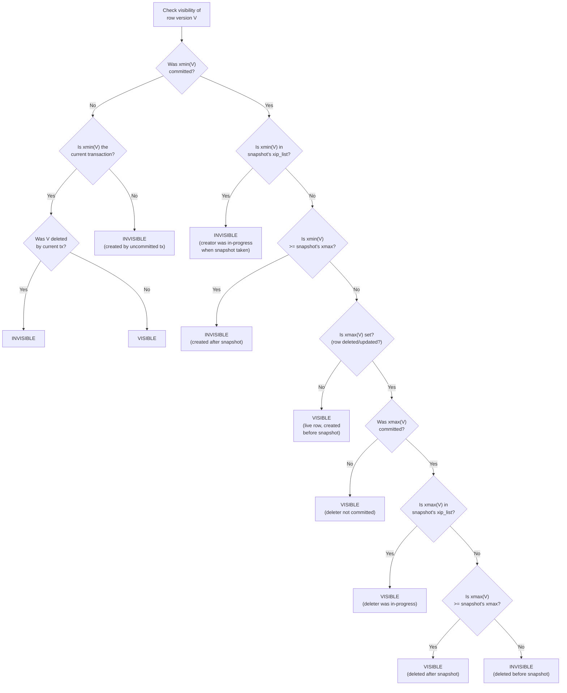
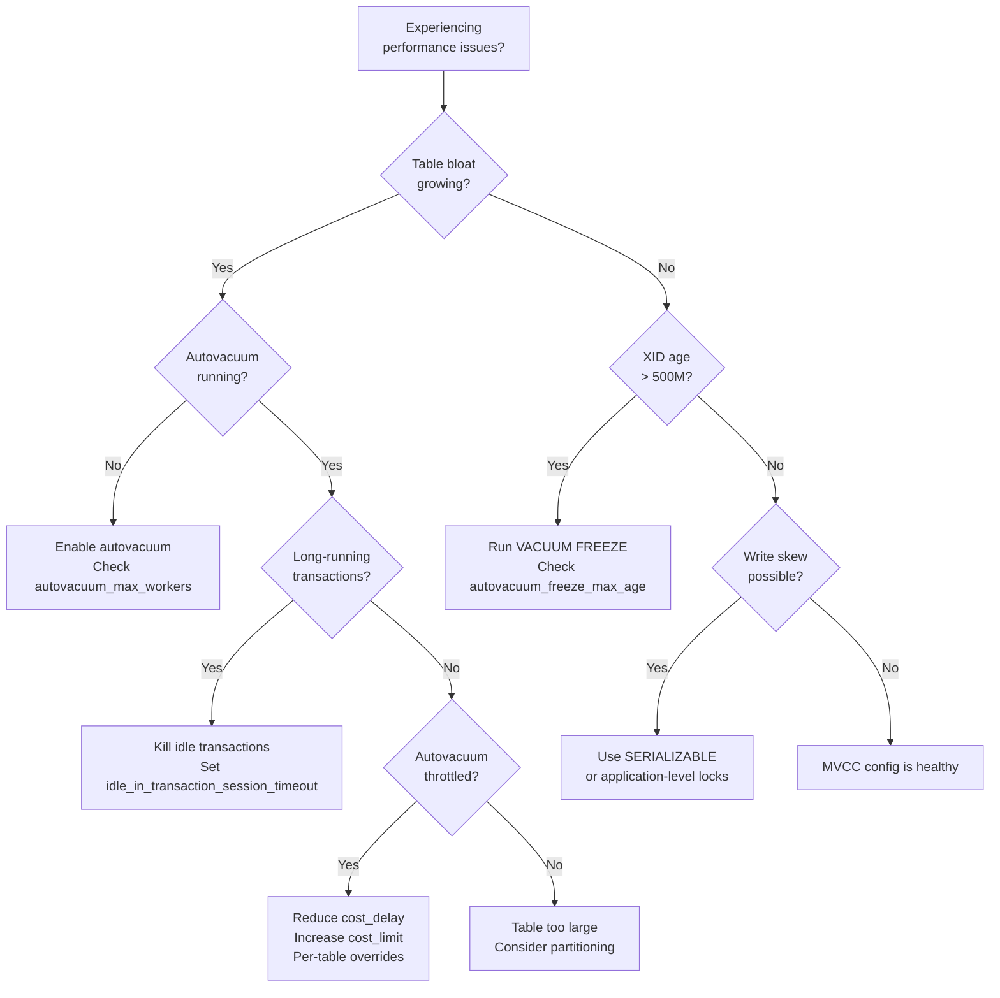

# Multi-Version Concurrency Control (MVCC)

MVCC is the concurrency control mechanism used by every major relational database — PostgreSQL, MySQL InnoDB, Oracle, SQL Server (snapshot isolation mode). It is the reason you can run a 30-second analytical query while thousands of transactions are modifying data, and neither blocks the other. It is also the reason PostgreSQL tables bloat, why VACUUM exists, why transaction ID wraparound is a real operational emergency, and why certain concurrency anomalies are subtler than most developers realize.

This is a complete treatment: from the fundamental concurrency problem through the implementation internals of PostgreSQL and MySQL, through the math of garbage collection overhead, through TypeScript simulations, through production war stories that have taken down real systems.

## Level 1: Why It Exists — The Concurrency Problem

### The Naive Approach: Locking

Without MVCC, the simplest way to handle concurrent access is locking. When a transaction reads a row, it acquires a shared (read) lock. When it writes, it acquires an exclusive (write) lock.

The problem:

```
Transaction T1 (writer):       Transaction T2 (reader):
  UPDATE accounts               SELECT balance
  SET balance = 500              FROM accounts
  WHERE id = 1;                  WHERE id = 1;

  T1 acquires EXCLUSIVE lock     T2 wants SHARED lock
  on row id=1                    on row id=1

                                 ⏳ BLOCKED — waiting for T1
                                 to commit or abort

  ... T1 does more work ...      ... T2 is stuck ...

  COMMIT;                        Lock released — T2 can proceed
                                 Returns balance = 500
```

**Readers block writers. Writers block readers.** In a system with mixed read/write workloads, this creates devastating contention. A long-running analytical query holds shared locks on thousands of rows, blocking all writes to those rows. A long-running write transaction holds exclusive locks, blocking all reads.

The throughput impact is severe:

$$
\text{Effective throughput} = \frac{\text{Total throughput}}{1 + \text{contention ratio} \times \text{avg lock hold time} \times \text{concurrency}}
$$

For a system with 100 concurrent transactions, 30% contention, and 10ms average lock hold time:

$$
\text{Effective throughput} = \frac{T}{1 + 0.3 \times 0.01 \times 100} = \frac{T}{1.3} \approx 0.77T
$$

That's a 23% throughput loss from lock contention alone — and it gets exponentially worse as concurrency increases.

### The MVCC Solution

MVCC eliminates the reader-writer conflict entirely:

> **Instead of locking a row, keep multiple versions of it. Each transaction sees a consistent snapshot of the database as of its start time. Writers create new versions; readers read old versions. Readers never block writers. Writers never block readers.**

```
Transaction T1 (writer):         Transaction T2 (reader):
  BEGIN; (snapshot at time 100)    BEGIN; (snapshot at time 100)

  UPDATE accounts                  SELECT balance
  SET balance = 500                FROM accounts
  WHERE id = 1;                    WHERE id = 1;

  Creates NEW version:             Sees OLD version:
  (id=1, balance=500, v2)          (id=1, balance=1000, v1)
                                   Returns 1000 ✓ (no blocking!)

  COMMIT;                          ... continues reading
                                   consistent snapshot ...
```

Both transactions proceed without blocking each other. T2 sees the data as it was when T2 started — a consistent snapshot. T1's changes are invisible to T2 until T2 starts a new transaction.

### The Cost of MVCC

MVCC is not free. It trades lock contention for:

1. **Space overhead:** Multiple versions of each row consume storage
2. **Garbage collection:** Old versions must eventually be cleaned up
3. **Visibility checks:** Every row access must check whether the version is visible to the current transaction
4. **Write amplification:** Updates create entirely new row versions (in PostgreSQL, even updating a non-indexed column creates a new heap tuple)

Understanding these costs — and their operational implications — is the core of this document.

## Level 2: First Principles — Snapshots and Visibility

### What Is a Snapshot?

A snapshot is a consistent, point-in-time view of the database. Formally, a snapshot $S$ at time $t$ is defined by:

$$
S(t) = \{ \text{row version } v \mid v \text{ was committed before } t \text{ and not deleted before } t \}
$$

In practice, databases don't use wall-clock time. They use transaction IDs as a logical clock:

$$
S(\text{xid}) = \{ v \mid \text{xmin}(v) < \text{xid} \wedge \text{xmin}(v) \text{ is committed} \wedge (\text{xmax}(v) = 0 \vee \text{xmax}(v) \geq \text{xid} \vee \text{xmax}(v) \text{ is not committed}) \}
$$

Where:
- $\text{xmin}(v)$: the transaction ID that created version $v$
- $\text{xmax}(v)$: the transaction ID that deleted/replaced version $v$ (0 if still live)

### Snapshot Contents

A PostgreSQL snapshot contains:

| Field | Description |
|-------|-------------|
| `xmin` | All transaction IDs below this are either committed or aborted (definitely visible or definitely invisible) |
| `xmax` | All transaction IDs >= this are in the future (definitely invisible) |
| `xip_list` | List of in-progress transaction IDs between xmin and xmax (might be visible, need to check CLOG) |

```
Snapshot: xmin=100, xmax=105, xip=[101, 103]

Transaction IDs:
  < 100: committed or aborted (check CLOG for committed status)
  100: committed (below snapshot boundary, visible if committed)
  101: IN PROGRESS — invisible (in xip_list)
  102: committed — visible (between xmin/xmax, not in xip_list)
  103: IN PROGRESS — invisible (in xip_list)
  104: committed — visible (between xmin/xmax, not in xip_list)
  ≥ 105: future — invisible
```

### Visibility Decision Flowchart



This is the actual visibility check that PostgreSQL performs for every row access. It runs billions of times per day on a busy system. That's why it must be fast — and why the CLOG (commit log, now called `pg_xact`) is cached in shared memory.

## Level 3: PostgreSQL MVCC Implementation

### Tuple Header: xmin, xmax, and Friends

Every row (tuple) in PostgreSQL carries a header with MVCC metadata:

```
PostgreSQL Heap Tuple Header (23 bytes minimum):

┌──────────┬──────────┬──────────┬──────────┬──────────┬──────────┐
│ t_xmin   │ t_xmax   │ t_cid    │ t_ctid   │ t_infomask│ t_hoff  │
│ (4 bytes)│ (4 bytes)│ (4 bytes)│ (6 bytes)│ (4 bytes)│ (1 byte)│
├──────────┴──────────┴──────────┴──────────┴──────────┴──────────┤
│                        User Data                                 │
└─────────────────────────────────────────────────────────────────┘
```

| Field | Size | Purpose |
|-------|------|---------|
| `t_xmin` | 4 bytes | Transaction ID that inserted this tuple |
| `t_xmax` | 4 bytes | Transaction ID that deleted/updated this tuple (0 = live) |
| `t_cid` | 4 bytes | Command ID within the transaction (for intra-transaction visibility) |
| `t_ctid` | 6 bytes | Current tuple ID — points to self if live, or to the newer version if updated |
| `t_infomask` | 2 bytes | Status bits (committed, aborted, has null, etc.) |
| `t_infomask2` | 2 bytes | More status bits + number of attributes |
| `t_hoff` | 1 byte | Offset to user data |

The `t_ctid` field creates a chain of versions for updated rows:

```
UPDATE users SET name = 'Bob' WHERE id = 1;

Before update:
  Page 5, Offset 2: (xmin=100, xmax=0, ctid=(5,2), data='Alice')

After update:
  Page 5, Offset 2: (xmin=100, xmax=150, ctid=(5,4), data='Alice')  ← old version
  Page 5, Offset 4: (xmin=150, xmax=0,   ctid=(5,4), data='Bob')    ← new version
                                                    │
                                          ctid points to self = live version
```

### The CLOG (pg_xact): Transaction Status

PostgreSQL tracks whether each transaction committed or aborted in the **CLOG** (Commit Log), stored in `$PGDATA/pg_xact/`. Each transaction uses 2 bits:

| Bits | Status |
|------|--------|
| `00` | In progress |
| `01` | Committed |
| `10` | Aborted |
| `11` | Sub-committed (subtransaction committed, parent unknown) |

The CLOG is stored as a set of 8 KB pages, each holding status for 32,768 transactions (8192 bytes * 4 statuses per byte). Pages are cached in shared memory for fast lookup.

### Hint Bits: Avoiding CLOG Lookups

Checking the CLOG for every visibility check would be expensive. PostgreSQL optimizes with **hint bits** — status bits set directly in the tuple header after the first CLOG lookup:

```
First access to tuple (xmin=100):
  1. Check t_infomask — no hint bits set
  2. Look up transaction 100 in CLOG → committed
  3. Set HEAP_XMIN_COMMITTED bit in t_infomask
  4. (This "dirties" the page — it will be written back to disk)

Subsequent accesses:
  1. Check t_infomask — HEAP_XMIN_COMMITTED is set
  2. Skip CLOG lookup — we already know it's committed
```

::: warning Hint Bit Side Effect
Setting hint bits dirties heap pages, generating additional WAL traffic (when `wal_level >= replica`). On a replica receiving lots of read queries against pages that haven't been hinted yet, this creates write I/O on what you thought was a read-only workload. PostgreSQL 14+ has optimizations to reduce this.
:::

### HOT Updates (Heap-Only Tuples)

When an UPDATE modifies only non-indexed columns and the new tuple fits on the same page, PostgreSQL can perform a **HOT (Heap-Only Tuple) update**:

1. The new tuple is placed on the same heap page
2. No index entries are created for the new version (existing index entries point to the original tuple, which chains to the new one via `t_ctid`)
3. Micro-VACUUM can reclaim old HOT tuples without full VACUUM

```
Before HOT update:
  Index:  id=1 → (page 5, offset 2)
  Heap:   (5,2): xmin=100, xmax=0, data=(id=1, name='Alice', bio='...')

After HOT update (only 'bio' column changed, not indexed):
  Index:  id=1 → (page 5, offset 2)  ← UNCHANGED (no index write!)
  Heap:   (5,2): xmin=100, xmax=150, ctid=(5,4), data=(id=1, name='Alice', bio='old')
          (5,4): xmin=150, xmax=0,   ctid=(5,4), data=(id=1, name='Alice', bio='new')
                                                        │
                                              HOT chain: index → (5,2) → (5,4)
```

HOT updates are critical for performance because they avoid index bloat. Without HOT, every UPDATE requires updating every index on the table — even if the indexed columns didn't change. Monitor HOT update ratio:

```sql
SELECT relname,
       n_tup_upd,
       n_tup_hot_upd,
       round(100.0 * n_tup_hot_upd / nullif(n_tup_upd, 0), 1) AS hot_pct
FROM pg_stat_user_tables
ORDER BY n_tup_upd DESC;
```

A healthy system should have 70-95% HOT updates. If the ratio is low, check for:
- Indexed columns being updated unnecessarily
- Not enough free space on pages (increase `fillfactor`)
- TOASTed columns preventing same-page placement

```sql
-- Increase fillfactor to leave room for HOT updates
ALTER TABLE users SET (fillfactor = 80);
-- This leaves 20% free space on each page for in-place updates
```

## Level 4: MySQL InnoDB MVCC Implementation

### Undo Log Architecture

InnoDB takes a fundamentally different approach to multi-versioning. Instead of keeping old versions in the heap (like PostgreSQL), InnoDB stores old versions in the **undo log**:

```
PostgreSQL approach (inline versioning):
  Heap page contains ALL versions:
  ┌──────────────────────────────────────┐
  │ V1 (old)  V2 (old)  V3 (current)    │
  └──────────────────────────────────────┘

InnoDB approach (undo log):
  Clustered index contains ONLY current version:
  ┌──────────────────────────────────────┐
  │ V3 (current) → undo pointer          │
  └──────────────────────────────────────┘
                      │
                      ▼
  Undo log:  V2 (old) → V1 (older) → ...
```

Each row in the clustered index contains:
- `DB_TRX_ID`: the transaction ID that last modified this row
- `DB_ROLL_PTR`: a pointer to the undo log record containing the previous version
- `DB_ROW_ID`: a hidden row ID (if no primary key is defined)

### InnoDB Read View

When a transaction starts a consistent read (at `REPEATABLE READ` or `READ COMMITTED` isolation), InnoDB creates a **read view** containing:

| Field | Description |
|-------|-------------|
| `m_low_limit_id` | Transaction IDs >= this are invisible (future transactions) |
| `m_up_limit_id` | Transaction IDs < this are definitely visible (if committed) |
| `m_ids` | List of active transaction IDs at the time the read view was created |
| `m_creator_trx_id` | The transaction ID that created this read view |

The visibility algorithm:

```
For a row with DB_TRX_ID = trx_id:

1. If trx_id == m_creator_trx_id → VISIBLE (own changes)
2. If trx_id < m_up_limit_id → VISIBLE (committed before read view)
3. If trx_id >= m_low_limit_id → INVISIBLE (started after read view)
4. If trx_id is in m_ids → INVISIBLE (was active when read view created)
5. Otherwise → VISIBLE (committed between m_up_limit_id and m_low_limit_id)
```

If a row is invisible, InnoDB follows the `DB_ROLL_PTR` chain through the undo log to find the most recent visible version.

### Undo Log Structure

InnoDB maintains two types of undo logs:

| Type | Purpose | Retained Until |
|------|---------|---------------|
| **Insert undo** | Undo of INSERT (delete the row) | Transaction commits (no other transaction needs to see it) |
| **Update undo** | Undo of UPDATE/DELETE (restore previous version) | All read views that might need it are closed |

The undo log is organized into **rollback segments** within **undo tablespaces**:

```
Undo Tablespace (undo_001)
├── Rollback Segment 1
│   ├── Undo Log 1 (transaction 1001)
│   │   ├── Undo Record: UPDATE row (5,2) old_value='Alice'
│   │   └── Undo Record: UPDATE row (7,1) old_value=100
│   └── Undo Log 2 (transaction 1002)
│       └── Undo Record: DELETE row (3,4) old_row=(...)
├── Rollback Segment 2
│   └── ...
└── ...
```

### InnoDB Purge Thread

Because old versions are stored in the undo log, they must be cleaned up when no longer needed. The **purge thread** handles this:

1. Determine the oldest active read view ($\text{oldest\_view}$)
2. Any undo record with $\text{trx\_id} < \text{oldest\_view}$ and committed can be purged
3. Mark the undo log space as reusable

```sql
-- Monitor purge lag
SHOW ENGINE INNODB STATUS;
-- Look for: "History list length" — number of unpurged undo records
-- A growing history list means purge is falling behind

-- Purge thread configuration
innodb_purge_threads = 4       -- Number of purge threads
innodb_max_purge_lag = 0       -- Max history list before throttling DML (0 = unlimited)
innodb_max_purge_lag_delay = 0 -- Max delay in microseconds when throttling
```

::: warning InnoDB Purge Lag
If a long-running transaction holds a read view open, purge cannot clean up undo records created after that read view. The undo tablespace grows without bound. A single `BEGIN` without `COMMIT` in a MySQL client can cause gigabytes of undo log accumulation. Always set `innodb_max_purge_lag` to alert on this condition.
:::

## Level 5: Garbage Collection — The VACUUM Problem

### Why Garbage Collection Is Necessary

In PostgreSQL, dead tuples (old versions that no transaction can see) accumulate in heap pages. They consume disk space, slow down sequential scans (the scanner must skip over dead tuples), bloat indexes (dead tuples have index entries too), and eventually cause table bloat.

```
Page before VACUUM (after many updates to same row):

┌─────────────────────────────────────────────────────┐
│ DEAD  │ DEAD  │ DEAD  │ DEAD  │ LIVE  │   FREE    │
│ v1    │ v2    │ v3    │ v4    │ v5    │           │
│ 200B  │ 200B  │ 200B  │ 200B  │ 200B  │   7KB    │
└─────────────────────────────────────────────────────┘
  Space utilization: 200/8192 = 2.4% (!!!)

Page after VACUUM:

┌─────────────────────────────────────────────────────┐
│ LIVE  │              FREE                           │
│ v5    │                                             │
│ 200B  │              ~7.8KB                         │
└─────────────────────────────────────────────────────┘
  Space utilization: 200/8192 = 2.4% (but free space is reusable)
```

### PostgreSQL VACUUM Types

| Type | What It Does | Locks | Reclaims Disk Space? |
|------|-------------|-------|---------------------|
| `VACUUM` (lazy) | Marks dead tuples as reusable within pages | No table lock (runs concurrently) | No — pages are not returned to OS |
| `VACUUM FULL` | Rewrites entire table, compacting it | **ACCESS EXCLUSIVE lock** (blocks ALL queries) | Yes — reclaims space |
| `VACUUM FREEZE` | Freezes old transaction IDs to prevent wraparound | No table lock | No |
| `pg_repack` | Online table rewrite (extension) | Brief lock at start and end | Yes — minimal downtime |

### Autovacuum: The Daemon

PostgreSQL's autovacuum daemon automatically runs VACUUM on tables that need it. It's triggered by two conditions:

```sql
-- Trigger VACUUM when dead tuples exceed threshold
autovacuum_vacuum_threshold = 50         -- minimum dead tuples
autovacuum_vacuum_scale_factor = 0.2     -- + 20% of table size

-- Effective threshold:
-- vacuum_threshold = threshold + scale_factor × n_live_tuples
-- For a 1M row table: 50 + 0.2 × 1,000,000 = 200,050 dead tuples
```

Autovacuum parameters to tune:

```sql
-- How many autovacuum workers can run simultaneously
autovacuum_max_workers = 3

-- How long a worker sleeps between tables
autovacuum_naptime = 1min

-- Cost-based throttling to limit I/O impact
autovacuum_vacuum_cost_delay = 2ms    -- sleep this long after hitting cost limit
autovacuum_vacuum_cost_limit = 200    -- cost units before sleeping

-- Per-table overrides for hot tables
ALTER TABLE orders SET (
  autovacuum_vacuum_scale_factor = 0.01,  -- vacuum after 1% dead tuples
  autovacuum_vacuum_cost_delay = 0        -- no throttling for this table
);
```

### The Visibility Map

The **visibility map** is a bitmap with one bit per heap page. If the bit is set, ALL tuples on that page are visible to all transactions (fully frozen or committed before all active snapshots). This enables:

1. **Index-only scans:** If the visibility map says the page is all-visible, the index scan doesn't need to fetch the heap page at all — it can return the value from the index directly.
2. **VACUUM skip:** VACUUM can skip all-visible pages (they have no dead tuples to clean).

```
Visibility Map:    1  1  0  1  0  1  1  1  0  1
Heap Pages:       [P0][P1][P2][P3][P4][P5][P6][P7][P8][P9]
                              ▲         ▲              ▲
                              │         │              │
                         Has dead   Has dead      Has dead
                         tuples     tuples        tuples

VACUUM only visits: P2, P4, P8
Index-only scan skips heap fetch for: P0, P1, P3, P5, P6, P7, P9
```

```sql
-- Check visibility map coverage
SELECT relname,
       pg_relation_size(oid) AS heap_size,
       pg_relation_size(oid, 'vm') AS vm_size,
       n_dead_tup,
       round(100.0 * n_dead_tup / nullif(n_live_tup + n_dead_tup, 0), 1) AS dead_pct
FROM pg_stat_user_tables
ORDER BY n_dead_tup DESC;
```

## Level 6: Transaction ID Wraparound — The Silent Killer

### The Problem

PostgreSQL uses 32-bit transaction IDs. With 4 billion possible values, you might think this is enough. It's not.

Transaction IDs are compared using **modular arithmetic**: given two transaction IDs $a$ and $b$, $a$ is "in the past" relative to $b$ if $a - b > 2^{31}$ (mod $2^{32}$). This means there are only $2^{31} \approx 2.1$ billion transaction IDs in "the past" and $2^{31}$ in "the future."

```
Transaction ID number line (circular, mod 2^32):

              2^31 IDs in "the past"
         ◄──────────────────────────────►
    ┌────────────────────────────────────────┐
    │                                        │
    │    past ◄──── current ────► future     │
    │                  │                     │
    │              xid = X                   │
    │                                        │
    └────────────────────────────────────────┘
         ◄──────────────────────────────►
              2^31 IDs in "the future"
```

If a tuple's `xmin` is more than $2^{31}$ transaction IDs in the past, it wraps around and appears to be **in the future** — making it invisible to all transactions. Your data effectively disappears.

$$
\text{Wraparound occurs when: } \text{current\_xid} - \text{xmin} > 2^{31}
$$

At 1,000 transactions per second:

$$
\text{Time to wraparound} = \frac{2^{31}}{1000 \text{ TPS}} = \frac{2{,}147{,}483{,}648}{1000} = 2{,}147{,}483 \text{ seconds} \approx 24.8 \text{ days}
$$

At 100 TPS, it's 248 days. At 10 TPS, it's 6.8 years.

### The Solution: Freezing

PostgreSQL prevents wraparound by **freezing** old transaction IDs. When a tuple's `xmin` is old enough, VACUUM replaces it with a special `FrozenTransactionId` (value 2), which is always considered "in the past" regardless of the current transaction ID.

```sql
-- When to freeze tuples
vacuum_freeze_min_age = 50000000      -- Don't freeze tuples younger than this
vacuum_freeze_table_age = 150000000   -- Scan whole table when this old
autovacuum_freeze_max_age = 200000000 -- FORCE autovacuum when this old
```

### The Anti-Wraparound Autovacuum

When a table's `relfrozenxid` (the oldest unfrozen transaction ID in the table) approaches the wraparound danger zone, PostgreSQL launches an **anti-wraparound autovacuum**. This autovacuum:

- Cannot be cancelled by the user
- Ignores cost-based throttling (runs at full speed)
- Scans the ENTIRE table (not just dirty pages)
- Will cause significant I/O load

If anti-wraparound autovacuum cannot complete (e.g., long-running transactions hold back the freeze horizon), PostgreSQL will eventually shut down with the message:

```
WARNING: database "mydb" must be vacuumed within 10000000 transactions
HINT: To avoid a database shutdown, execute a database-wide VACUUM in that database.

ERROR: database is not accepting commands to avoid wraparound data loss in database "mydb"
```

```sql
-- Monitor wraparound risk
SELECT datname,
       age(datfrozenxid) AS xid_age,
       round(100.0 * age(datfrozenxid) / 2147483647, 1) AS pct_to_wraparound
FROM pg_database
ORDER BY xid_age DESC;

-- Per-table risk
SELECT relname,
       age(relfrozenxid) AS xid_age,
       pg_size_pretty(pg_relation_size(oid)) AS size,
       last_autovacuum
FROM pg_class
WHERE relkind = 'r'
ORDER BY age(relfrozenxid) DESC
LIMIT 20;
```

### 64-bit Transaction IDs (PostgreSQL 14+)

PostgreSQL 14 introduced an internal 64-bit epoch + 32-bit XID system that allows pg_xact to be truncated more aggressively. However, the on-disk tuple format still uses 32-bit XIDs, so the freezing mechanism is still required. True 64-bit XIDs in the tuple header remain a future goal.

## Level 7: Snapshot Isolation and Its Anomalies

### Snapshot Isolation (SI) vs Serializable

Most databases that claim "REPEATABLE READ" actually implement **Snapshot Isolation** — which is NOT the same as true serializability. Snapshot Isolation prevents:

- Dirty reads
- Non-repeatable reads
- Phantom reads (mostly)

But it ALLOWS:

- **Write skew** — a subtle anomaly that can violate application-level invariants

### Write Skew: The Subtle Anomaly

Write skew occurs when two transactions read the same data, make disjoint writes based on what they read, and both commit — resulting in a state that could not have occurred under serial execution.

**Classic example: the on-call schedule**

Invariant: at least one doctor must be on call at all times.

```sql
-- Two doctors are on call: Alice and Bob
-- Both want to go off call simultaneously

-- Transaction T1 (Alice):                  -- Transaction T2 (Bob):
BEGIN;                                       BEGIN;
SELECT count(*) FROM oncall                  SELECT count(*) FROM oncall
  WHERE status = 'on';                         WHERE status = 'on';
-- Result: 2 (Alice and Bob)                 -- Result: 2 (Alice and Bob)
-- "2 > 1, safe to go off call"              -- "2 > 1, safe to go off call"

UPDATE oncall SET status = 'off'             UPDATE oncall SET status = 'off'
  WHERE doctor = 'Alice';                      WHERE doctor = 'Bob';
COMMIT; -- ✓                                 COMMIT; -- ✓

-- Final state: BOTH doctors are off call!
-- Invariant VIOLATED — but no transaction saw a conflict
```

Under Snapshot Isolation, both transactions see 2 doctors on call and both decide it's safe to go off call. Neither transaction's writes conflict (they write to different rows), so no write-write conflict is detected. Both commit. The invariant is violated.

Under true Serializable execution, one transaction would have seen the other's write and would not have committed.

### Serializable Snapshot Isolation (SSI)

PostgreSQL's `SERIALIZABLE` isolation level implements SSI (Serializable Snapshot Isolation), introduced by Cahill et al. (2008). SSI detects potentially non-serializable executions by tracking read-write dependencies:


SSI detects **dangerous structures** — cycles of rw-dependencies that could indicate a non-serializable execution. When detected, one transaction is aborted:

```sql
-- With SERIALIZABLE isolation:
-- T1 commits successfully
-- T2 gets: ERROR: could not serialize access due to read/write dependencies among transactions
-- T2 must retry
```

**The cost of SSI:** PostgreSQL must track which rows each transaction reads (predicate locks) and which it writes, then check for dangerous structures. This has memory overhead (SLRU for predicate locks) and CPU overhead (cycle detection). In practice, the overhead is 5-20% compared to REPEATABLE READ.

```sql
-- Configure SSI
max_pred_locks_per_transaction = 64      -- default
max_pred_locks_per_relation = -2         -- per-relation limit
max_pred_locks_per_page = 2              -- escalation threshold
```

### Comparison: SI vs SSI vs 2PL

| Property | Snapshot Isolation | SSI | Two-Phase Locking (2PL) |
|----------|-------------------|-----|------------------------|
| Readers block writers | No | No | Yes |
| Writers block readers | No | No | Yes |
| Write skew possible | Yes | No | No |
| Phantom possible | Rarely | No | No (with predicate locks) |
| False aborts | No | Yes (sometimes) | No |
| Deadlocks | Write-write only | No (aborts instead) | Yes |
| Overhead | Version storage | Version storage + dependency tracking | Lock table |
| Throughput | High | Medium-High | Low under contention |

## Level 8: TypeScript Implementation — MVCC Simulation

```typescript
// ============================================================
// Multi-Version Concurrency Control — Complete Simulation
// ============================================================

type TransactionId = number;
type RowId = number;

// ---- Row Version ----

interface RowVersion {
  rowId: RowId;
  xmin: TransactionId;     // Transaction that created this version
  xmax: TransactionId;     // Transaction that deleted this version (0 = live)
  data: Record<string, unknown>;
  prevVersion: RowVersion | null; // Link to previous version (for undo chain)
}

// ---- Transaction Status ----

enum TxStatus {
  ACTIVE = "ACTIVE",
  COMMITTED = "COMMITTED",
  ABORTED = "ABORTED",
}

// ---- Snapshot ----

interface Snapshot {
  xmin: TransactionId;      // All IDs below this are finalized
  xmax: TransactionId;      // All IDs >= this are in the future
  activeXids: Set<TransactionId>; // In-progress transactions at snapshot time
}

// ---- MVCC Database Engine ----

class MVCCDatabase {
  private nextXid: TransactionId = 1;
  private nextRowId: RowId = 1;

  // All row versions (simulates the heap)
  private heap: RowVersion[] = [];

  // Transaction status (simulates pg_xact / CLOG)
  private xactStatus: Map<TransactionId, TxStatus> = new Map();

  // Active transactions and their snapshots
  private activeTransactions: Map<TransactionId, Snapshot> = new Map();

  // Statistics
  private stats = {
    visibilityChecks: 0,
    versionsExamined: 0,
    deadTuplesRemoved: 0,
  };

  // ---- Transaction Lifecycle ----

  beginTransaction(): TransactionId {
    const xid = this.nextXid++;
    this.xactStatus.set(xid, TxStatus.ACTIVE);

    // Take a snapshot
    const snapshot = this.takeSnapshot(xid);
    this.activeTransactions.set(xid, snapshot);

    return xid;
  }

  commit(xid: TransactionId): void {
    this.ensureActive(xid);
    this.xactStatus.set(xid, TxStatus.COMMITTED);
    this.activeTransactions.delete(xid);
  }

  abort(xid: TransactionId): void {
    this.ensureActive(xid);
    this.xactStatus.set(xid, TxStatus.ABORTED);
    this.activeTransactions.delete(xid);
  }

  // ---- Data Operations ----

  insert(xid: TransactionId, data: Record<string, unknown>): RowId {
    this.ensureActive(xid);
    const rowId = this.nextRowId++;

    const version: RowVersion = {
      rowId,
      xmin: xid,
      xmax: 0,
      data: { ...data },
      prevVersion: null,
    };

    this.heap.push(version);
    return rowId;
  }

  update(
    xid: TransactionId,
    rowId: RowId,
    newData: Record<string, unknown>
  ): boolean {
    this.ensureActive(xid);
    const snapshot = this.activeTransactions.get(xid)!;

    // Find the visible version of this row
    const currentVersion = this.findVisibleVersion(rowId, snapshot, xid);
    if (!currentVersion) return false;

    // Check for write-write conflict
    if (currentVersion.xmax !== 0) {
      const xmaxStatus = this.xactStatus.get(currentVersion.xmax);
      if (xmaxStatus === TxStatus.ACTIVE && currentVersion.xmax !== xid) {
        // Another active transaction already updated this row
        // In a real database, we would wait or abort
        throw new Error(
          `Write-write conflict: T${xid} cannot update row ${rowId} ` +
          `(already modified by active T${currentVersion.xmax})`
        );
      }
    }

    // Mark old version as deleted by this transaction
    currentVersion.xmax = xid;

    // Create new version
    const newVersion: RowVersion = {
      rowId,
      xmin: xid,
      xmax: 0,
      data: { ...currentVersion.data, ...newData },
      prevVersion: currentVersion,
    };

    this.heap.push(newVersion);
    return true;
  }

  delete(xid: TransactionId, rowId: RowId): boolean {
    this.ensureActive(xid);
    const snapshot = this.activeTransactions.get(xid)!;

    const currentVersion = this.findVisibleVersion(rowId, snapshot, xid);
    if (!currentVersion) return false;

    // Check for write-write conflict
    if (currentVersion.xmax !== 0) {
      const xmaxStatus = this.xactStatus.get(currentVersion.xmax);
      if (xmaxStatus === TxStatus.ACTIVE && currentVersion.xmax !== xid) {
        throw new Error(
          `Write-write conflict: T${xid} cannot delete row ${rowId}`
        );
      }
    }

    // Mark as deleted
    currentVersion.xmax = xid;
    return true;
  }

  select(
    xid: TransactionId,
    predicate?: (data: Record<string, unknown>) => boolean
  ): Record<string, unknown>[] {
    this.ensureActive(xid);
    const snapshot = this.activeTransactions.get(xid)!;

    // Find all distinct row IDs
    const rowIds = new Set(this.heap.map((v) => v.rowId));
    const results: Record<string, unknown>[] = [];

    for (const rowId of rowIds) {
      const version = this.findVisibleVersion(rowId, snapshot, xid);
      if (version) {
        if (!predicate || predicate(version.data)) {
          results.push({ ...version.data });
        }
      }
    }

    return results;
  }

  // ---- Visibility Check (the core of MVCC) ----

  private isVisible(
    version: RowVersion,
    snapshot: Snapshot,
    currentXid: TransactionId
  ): boolean {
    this.stats.visibilityChecks++;

    const { xmin, xmax } = version;

    // Step 1: Check xmin visibility
    if (xmin === currentXid) {
      // Created by current transaction
      if (xmax === currentXid) {
        // Also deleted by current transaction — invisible
        return false;
      }
      // Created by us and not deleted by us — visible
      if (xmax === 0) return true;
      // Deleted by another transaction — check if that transaction committed
      const xmaxStatus = this.xactStatus.get(xmax);
      return xmaxStatus !== TxStatus.COMMITTED;
    }

    // Check if xmin transaction committed
    const xminStatus = this.xactStatus.get(xmin);
    if (xminStatus === TxStatus.ABORTED) {
      // Created by an aborted transaction — invisible
      return false;
    }
    if (xminStatus === TxStatus.ACTIVE) {
      // Created by another active transaction — invisible
      return false;
    }

    // xmin is committed — but was it committed before our snapshot?
    if (xmin >= snapshot.xmax) {
      // Started after our snapshot — invisible
      return false;
    }
    if (snapshot.activeXids.has(xmin)) {
      // Was active when we took our snapshot — invisible
      return false;
    }

    // Step 2: xmin is visible — now check xmax
    if (xmax === 0) {
      // Not deleted — visible
      return true;
    }

    if (xmax === currentXid) {
      // Deleted by current transaction — invisible
      return false;
    }

    const xmaxStatus = this.xactStatus.get(xmax);
    if (xmaxStatus !== TxStatus.COMMITTED) {
      // Deleter hasn't committed — still visible
      return true;
    }

    // xmax committed — was it committed before our snapshot?
    if (xmax >= snapshot.xmax) {
      // Deleted after our snapshot — still visible
      return true;
    }
    if (snapshot.activeXids.has(xmax)) {
      // Deleter was active when we took snapshot — still visible
      return true;
    }

    // Deleted before our snapshot — invisible
    return false;
  }

  private findVisibleVersion(
    rowId: RowId,
    snapshot: Snapshot,
    currentXid: TransactionId
  ): RowVersion | null {
    // Find all versions of this row (newest first)
    const versions = this.heap
      .filter((v) => v.rowId === rowId)
      .reverse();

    for (const version of versions) {
      this.stats.versionsExamined++;
      if (this.isVisible(version, snapshot, currentXid)) {
        return version;
      }
    }

    return null;
  }

  // ---- Snapshot ----

  private takeSnapshot(excludeXid: TransactionId): Snapshot {
    const activeXids = new Set<TransactionId>();
    let xmin = this.nextXid;
    const xmax = this.nextXid;

    for (const [txid, status] of this.xactStatus) {
      if (status === TxStatus.ACTIVE && txid !== excludeXid) {
        activeXids.add(txid);
        if (txid < xmin) xmin = txid;
      }
    }

    // xmin is the oldest active transaction ID (or nextXid if no active txns)
    return { xmin, xmax, activeXids };
  }

  // ---- VACUUM ----

  vacuum(): { deadTuplesRemoved: number; spaceBefore: number; spaceAfter: number } {
    const spaceBefore = this.heap.length;

    // Determine the oldest active snapshot
    let oldestXmin = this.nextXid;
    for (const snapshot of this.activeTransactions.values()) {
      if (snapshot.xmin < oldestXmin) {
        oldestXmin = snapshot.xmin;
      }
    }

    // A tuple is dead if:
    // 1. Its xmax is set AND committed AND < oldestXmin
    //    (deleted before all active snapshots)
    // OR
    // 2. Its xmin is aborted
    //    (created by an aborted transaction, no one can see it)

    const deadTuples: RowVersion[] = [];
    const liveTuples: RowVersion[] = [];

    for (const version of this.heap) {
      let isDead = false;

      // Check if created by an aborted transaction
      const xminStatus = this.xactStatus.get(version.xmin);
      if (xminStatus === TxStatus.ABORTED) {
        isDead = true;
      }

      // Check if deleted by a committed transaction before oldest snapshot
      if (
        !isDead &&
        version.xmax !== 0 &&
        this.xactStatus.get(version.xmax) === TxStatus.COMMITTED &&
        version.xmax < oldestXmin
      ) {
        isDead = true;
      }

      if (isDead) {
        deadTuples.push(version);
      } else {
        liveTuples.push(version);
      }
    }

    this.heap = liveTuples;
    this.stats.deadTuplesRemoved += deadTuples.length;

    const result = {
      deadTuplesRemoved: deadTuples.length,
      spaceBefore,
      spaceAfter: this.heap.length,
    };

    console.log(
      `[VACUUM] Removed ${result.deadTuplesRemoved} dead tuples. ` +
      `Heap: ${result.spaceBefore} → ${result.spaceAfter} versions. ` +
      `Oldest active xmin: ${oldestXmin}`
    );

    return result;
  }

  // ---- Helpers ----

  private ensureActive(xid: TransactionId): void {
    const status = this.xactStatus.get(xid);
    if (status !== TxStatus.ACTIVE) {
      throw new Error(
        `Transaction ${xid} is not active (status: ${status})`
      );
    }
  }

  printHeap(): void {
    console.log("\n=== HEAP (all versions) ===");
    for (const v of this.heap) {
      const xmaxStr = v.xmax === 0 ? "LIVE" : `xmax=${v.xmax}`;
      const status = this.xactStatus.get(v.xmin);
      console.log(
        `  Row ${v.rowId}: xmin=${v.xmin}(${status}) ${xmaxStr} ` +
        `data=${JSON.stringify(v.data)}`
      );
    }
  }

  printStats(): void {
    console.log("\n=== MVCC Stats ===");
    console.log(`  Visibility checks: ${this.stats.visibilityChecks}`);
    console.log(`  Versions examined: ${this.stats.versionsExamined}`);
    console.log(`  Dead tuples removed: ${this.stats.deadTuplesRemoved}`);
    console.log(`  Current heap size: ${this.heap.length} versions`);
  }
}

// ============================================================
// Demo: MVCC in action
// ============================================================

function mvccDemo(): void {
  const db = new MVCCDatabase();

  console.log("=== MVCC Demo: Snapshot Isolation ===\n");

  // Transaction T1: Insert initial data
  const t1 = db.beginTransaction();
  console.log(`T1 (xid=${t1}): INSERT Alice balance=1000`);
  const aliceId = db.insert(t1, { name: "Alice", balance: 1000 });
  console.log(`T1 (xid=${t1}): INSERT Bob balance=500`);
  const bobId = db.insert(t1, { name: "Bob", balance: 500 });
  db.commit(t1);
  console.log(`T1 committed\n`);

  // Transaction T2: Start a long-running read
  const t2 = db.beginTransaction();
  console.log(`T2 (xid=${t2}): BEGIN (snapshot taken)`);
  const t2Read1 = db.select(t2);
  console.log(`T2 reads: ${JSON.stringify(t2Read1)}\n`);

  // Transaction T3: Update Alice's balance
  const t3 = db.beginTransaction();
  console.log(`T3 (xid=${t3}): UPDATE Alice balance=800`);
  db.update(t3, aliceId, { balance: 800 });
  console.log(`T3 (xid=${t3}): UPDATE Bob balance=700`);
  db.update(t3, bobId, { balance: 700 });
  db.commit(t3);
  console.log(`T3 committed\n`);

  // T2 still sees the old data (snapshot isolation)
  const t2Read2 = db.select(t2);
  console.log(`T2 reads (after T3 committed): ${JSON.stringify(t2Read2)}`);
  console.log(`  → T2 still sees Alice=1000, Bob=500 (snapshot isolation!)\n`);

  db.commit(t2);
  console.log(`T2 committed\n`);

  // New transaction sees T3's changes
  const t4 = db.beginTransaction();
  const t4Read = db.select(t4);
  console.log(`T4 reads: ${JSON.stringify(t4Read)}`);
  console.log(`  → T4 sees Alice=800, Bob=700 (T3's changes)\n`);
  db.commit(t4);

  // Show heap state (multiple versions exist)
  db.printHeap();

  // Run VACUUM
  console.log("");
  db.vacuum();

  // Show heap after vacuum
  db.printHeap();
  db.printStats();
}

// ============================================================
// Demo: Write Skew Anomaly
// ============================================================

function writeSkewDemo(): void {
  const db = new MVCCDatabase();

  console.log("\n\n=== Write Skew Demo ===\n");

  // Setup: Two doctors on call
  const setup = db.beginTransaction();
  const aliceId = db.insert(setup, {
    doctor: "Alice",
    status: "on_call",
  });
  const bobId = db.insert(setup, {
    doctor: "Bob",
    status: "on_call",
  });
  db.commit(setup);

  // T1 (Alice wants to go off call)
  const t1 = db.beginTransaction();
  const t1OnCall = db.select(t1, (row) => row.status === "on_call");
  console.log(`T1: ${t1OnCall.length} doctors on call: ${JSON.stringify(t1OnCall)}`);
  console.log(`T1: "2 on call, safe for Alice to leave"`);

  // T2 (Bob wants to go off call — concurrent with T1)
  const t2 = db.beginTransaction();
  const t2OnCall = db.select(t2, (row) => row.status === "on_call");
  console.log(`T2: ${t2OnCall.length} doctors on call: ${JSON.stringify(t2OnCall)}`);
  console.log(`T2: "2 on call, safe for Bob to leave"`);

  // Both update different rows
  db.update(t1, aliceId, { status: "off_call" });
  console.log(`T1: UPDATE Alice → off_call`);
  db.commit(t1);
  console.log(`T1: COMMIT ✓`);

  db.update(t2, bobId, { status: "off_call" });
  console.log(`T2: UPDATE Bob → off_call`);
  db.commit(t2);
  console.log(`T2: COMMIT ✓`);

  // Check invariant
  const check = db.beginTransaction();
  const onCall = db.select(check, (row) => row.status === "on_call");
  console.log(`\nFinal state: ${onCall.length} doctors on call`);
  console.log(`INVARIANT VIOLATED: No one is on call!`);
  console.log(`(This is the write skew anomaly — only prevented by SERIALIZABLE isolation)`);
  db.commit(check);
}

mvccDemo();
writeSkewDemo();
```

## Level 9: Performance Analysis

### Space Overhead of MVCC

In PostgreSQL, every tuple carries a 23-byte header. For a table with narrow rows (say, 50 bytes of user data), the MVCC overhead is:

$$
\text{Header overhead} = \frac{23}{23 + 50} = 31.5\%
$$

Plus, during periods of high update activity, old versions accumulate:

$$
\text{Bloat ratio} = \frac{\text{dead tuples} + \text{live tuples}}{\text{live tuples}}
$$

A table with 1M live rows and 500K dead tuples (waiting for VACUUM) has a bloat ratio of 1.5x — consuming 50% more disk and memory than necessary.

### Measuring Table Bloat

```sql
-- Estimate table bloat using pgstattuple extension
CREATE EXTENSION IF NOT EXISTS pgstattuple;

SELECT
  table_len,
  tuple_count,
  tuple_len,
  tuple_percent,        -- % of space used by live tuples
  dead_tuple_count,
  dead_tuple_len,
  dead_tuple_percent,   -- % of space used by dead tuples
  free_space,
  free_percent          -- % of free space (reusable)
FROM pgstattuple('users');

-- Quick bloat estimate (no full table scan)
SELECT
  approx_tuple_count,
  approx_tuple_len,
  approx_tuple_percent,
  dead_tuple_count AS approx_dead_tuple_count,
  dead_tuple_percent AS approx_dead_tuple_percent,
  approx_free_space,
  approx_free_percent
FROM pgstattuple_approx('users');
```

### Garbage Collection Overhead

The cost of VACUUM on a table:

$$
T_{\text{vacuum}} = T_{\text{scan}} + T_{\text{index}} + T_{\text{cleanup}}
$$

Where:

$$
T_{\text{scan}} = \frac{\text{table size}}{\text{sequential read speed}} \times (1 - \text{visibility map coverage})
$$

$$
T_{\text{index}} = \sum_{i=1}^{n} \frac{\text{index}_i \text{ size}}{\text{sequential read speed}} \quad \text{(for each index containing dead entries)}
$$

For a 100 GB table with 50% visibility map coverage and 3 indexes totaling 80 GB:

$$
T_{\text{scan}} = \frac{100 \text{ GB}}{500 \text{ MB/s}} \times 0.5 = 100 \text{s}
$$

$$
T_{\text{index}} = \frac{80 \text{ GB}}{500 \text{ MB/s}} = 160 \text{s}
$$

$$
T_{\text{vacuum}} \approx 260 \text{s} \approx 4.3 \text{ minutes}
$$

With cost-based throttling (default `autovacuum_vacuum_cost_delay = 2ms`), this stretches to much longer. VACUUM may only run at 10-20% of I/O capacity.

### MVCC vs 2PL vs OCC: Performance Comparison

| Metric | MVCC | 2PL (Two-Phase Locking) | OCC (Optimistic CC) |
|--------|------|------------------------|---------------------|
| Read throughput (low contention) | Excellent | Good | Excellent |
| Read throughput (high contention) | Excellent | Poor (blocked by writers) | Excellent |
| Write throughput (low contention) | Good | Good | Good |
| Write throughput (high contention) | Good (w/w conflicts) | Fair (deadlocks) | Poor (high abort rate) |
| Long-running reads | Excellent (snapshot) | Terrible (holds locks) | Excellent |
| Space overhead | High (versions) | Low (lock table) | Medium (write sets) |
| Garbage collection needed | Yes (VACUUM/purge) | No | No |
| Implementation complexity | High | Medium | Medium |
| Best workload | Mixed OLTP/analytics | Pure OLTP, low contention | Short transactions, low contention |

### When MVCC Hurts

MVCC is not always the best choice:

1. **Write-heavy workloads with updates to the same rows:** Each update creates a new version. High update frequency on the same rows creates version chains that slow down reads and overwhelm VACUUM.

2. **Wide rows with small changes:** In PostgreSQL, updating a single column creates a copy of the entire row (unless HOT applies). A table with 100 columns and frequent updates to one column wastes enormous space.

3. **Large transaction ID consumption:** Workloads that create many small subtransactions (e.g., PL/pgSQL functions with exception handlers) consume transaction IDs quickly, accelerating the wraparound clock.

## Level 10: War Stories and Production Incidents

### The Table Bloat Crisis

**Scenario:** A SaaS company's `events` table grows from 50 GB to 800 GB over three months, despite only containing 50 GB of live data.

**Root cause chain:**
1. A monitoring tool opens a `REPEATABLE READ` transaction and runs periodic queries every 30 seconds — but never commits
2. This holds back the VACUUM freeze horizon
3. Autovacuum runs but cannot remove dead tuples newer than the monitoring transaction's snapshot
4. Dead tuples accumulate: 500K per hour
5. Table and index sizes grow without bound
6. Query performance degrades (sequential scans read 16x more pages)
7. Buffer pool hit ratio drops from 99% to 60%
8. Everything gets slower, creating more dead tuples per transaction

**Detection:**
```sql
-- Find long-running transactions holding back vacuum
SELECT pid,
       now() - xact_start AS xact_duration,
       now() - query_start AS query_duration,
       state,
       query
FROM pg_stat_activity
WHERE state != 'idle'
  AND xact_start < now() - interval '5 minutes'
ORDER BY xact_start;

-- Check if any replication slot is holding back vacuum
SELECT slot_name,
       slot_type,
       active,
       age(xmin) AS xmin_age,
       age(catalog_xmin) AS catalog_xmin_age
FROM pg_replication_slots;
```

**Resolution:**
1. Kill the monitoring tool's connection (`pg_terminate_backend()`)
2. Run `VACUUM VERBOSE` on affected tables
3. For severely bloated tables: use `pg_repack` for online rebuild
4. Add monitoring for `idle in transaction` connections older than 5 minutes
5. Set `idle_in_transaction_session_timeout = 300000` (5 minutes)

### The Transaction ID Wraparound Emergency

**Scenario:** A PostgreSQL 12 database that hasn't been properly monitored. One day, all writes fail:

```
ERROR: database is not accepting commands to avoid wraparound
       data loss in database "production"
HINT: To avoid a database shutdown, execute a database-wide
      VACUUM in that database.
```

**Root cause chain:**
1. A 2 TB table with hundreds of indexes
2. Autovacuum anti-wraparound starts but takes 40+ hours for this table
3. During anti-wraparound vacuum, a deployment restarts PostgreSQL
4. Anti-wraparound vacuum is cancelled — starts over from scratch
5. Repeat: vacuum starts, deployment cancels it, vacuum restarts
6. Transaction ID age reaches the shutdown threshold (default: 2 billion minus 3 million)

**Emergency response:**
```sql
-- Step 1: Check how close to wraparound
SELECT datname, age(datfrozenxid)
FROM pg_database ORDER BY age DESC;

-- Step 2: Prevent deployments from restarting PostgreSQL

-- Step 3: Run vacuum freeze manually on the problem table
-- Disable cost throttling for speed
SET vacuum_cost_delay = 0;
VACUUM (FREEZE, VERBOSE) the_huge_table;

-- Step 4: If the table is too large, consider
-- vacuuming in smaller chunks using page ranges (PG 16+):
-- Or vacuum individual partitions if the table is partitioned
```

**Prevention:**
```sql
-- Monitor and alert on XID age
-- Alert at 500M, page at 1B, emergency at 1.5B
SELECT relname, age(relfrozenxid) AS xid_age
FROM pg_class
WHERE relkind = 'r' AND age(relfrozenxid) > 500000000;

-- Ensure autovacuum is aggressive on large tables
ALTER TABLE huge_table SET (
  autovacuum_freeze_max_age = 100000000,
  autovacuum_vacuum_cost_delay = 0
);
```

### The InnoDB History List Length Disaster

**Scenario:** A MySQL 8.0 database experiences progressively slower SELECT queries over hours.

**Root cause:**
1. An analyst runs `BEGIN` in their MySQL client, runs a query, looks at results, goes to lunch
2. The `BEGIN` holds an InnoDB read view open
3. InnoDB's purge thread cannot purge undo records newer than this read view
4. History list length grows from hundreds to millions
5. Read queries must traverse longer undo chains to find visible versions
6. A query that took 5ms now takes 500ms because it traverses 100 undo records per row

**Detection:**
```sql
SHOW ENGINE INNODB STATUS;
-- Look for:
-- History list length 5847231  ← should be < 1000

-- Find the blocking transaction
SELECT trx_id, trx_started, trx_mysql_thread_id,
       TIMESTAMPDIFF(SECOND, trx_started, NOW()) AS age_seconds
FROM information_schema.innodb_trx
ORDER BY trx_started ASC
LIMIT 5;
```

**Resolution:**
```sql
-- Kill the idle transaction
KILL <thread_id>;

-- Monitor history list length
-- Alert if > 10000
```

### The Replication Slot That Ate the Disk

**Scenario:** PostgreSQL primary's disk fills up over a weekend.

**Root cause:**
1. A logical replication slot was created for a CDC pipeline (Debezium)
2. The CDC consumer goes down on Friday evening
3. The replication slot prevents WAL recycling — PostgreSQL must retain ALL WAL since the slot's last confirmed position
4. 60 hours of WAL accumulates: 60h * 100 MB/s = 21.6 TB
5. Disk fills up → PostgreSQL stops accepting writes

This is a consequence of MVCC-adjacent infrastructure. The logical replication slot needs WAL to reconstruct the MVCC-visible changes for the subscriber.

**Prevention:**
```sql
-- PostgreSQL 13+: set max slot WAL retention
max_slot_wal_keep_size = 100GB  -- drop the slot's data if it falls this far behind

-- Monitor slot lag
SELECT slot_name,
       pg_wal_lsn_diff(pg_current_wal_lsn(), restart_lsn) AS lag_bytes,
       pg_size_pretty(pg_wal_lsn_diff(pg_current_wal_lsn(), restart_lsn)) AS lag_pretty,
       active
FROM pg_replication_slots;
```

## Decision Framework

### When to Worry About MVCC



### MVCC Monitoring Checklist

| Metric | Warning Threshold | Critical Threshold | Query |
|--------|-------------------|-------------------|-------|
| Dead tuple ratio | > 10% | > 30% | `pg_stat_user_tables.n_dead_tup` |
| Table bloat | > 1.5x | > 3x | `pgstattuple()` |
| XID age | > 500M | > 1B | `age(relfrozenxid)` |
| Autovacuum last run | > 1 day | > 1 week | `last_autovacuum` |
| Idle in transaction | > 5 min | > 30 min | `pg_stat_activity` |
| InnoDB history list | > 10K | > 1M | `SHOW ENGINE INNODB STATUS` |
| Replication slot lag | > 1 GB | > 10 GB | `pg_replication_slots` |

## Advanced Topics

### MVCC in Distributed Databases

Distributed MVCC requires a globally ordered snapshot mechanism:

**CockroachDB (Hybrid-Logical Clocks):** Uses HLC timestamps (physical time + logical counter) to order transactions across nodes. Each node maintains its own HLC, synchronized via NTP. Read snapshots use HLC timestamps instead of transaction IDs. This avoids the transaction ID wraparound problem entirely.

**TiDB (Timestamp Oracle):** A centralized Timestamp Oracle (TSO) assigns monotonically increasing timestamps to all transactions. This creates a global ordering but introduces a single point of contention. TiDB batches timestamp requests to amortize this cost (sub-millisecond latency at 1M timestamps/second).

**Spanner (TrueTime):** Google's TrueTime API provides globally consistent timestamps using GPS clocks and atomic clocks in every data center. The uncertainty interval ($\epsilon$, typically < 7ms) is directly accounted for: a transaction that commits at time $t$ must wait until $t + \epsilon$ before being visible, ensuring causal ordering.

$$
\text{Spanner commit latency} \geq 2\epsilon \approx 14\text{ms}
$$

### Index MVCC Challenges

Indexes add complexity to MVCC because they don't carry full visibility information:

**PostgreSQL B-tree indexes:** Index entries point to heap tuples but do not store xmin/xmax. Every index scan must visit the heap to check visibility (unless the visibility map confirms the page is all-visible). This is why index-only scans require the visibility map.

**InnoDB secondary indexes:** Secondary index entries include the transaction ID when the page was last modified. If the transaction is too new for the current read view, InnoDB must look up the clustered index (primary key) and traverse the undo chain — a double lookup.

**Covering indexes in PostgreSQL 11+:** The `INCLUDE` clause allows adding non-key columns to indexes, enabling more index-only scans:

```sql
CREATE INDEX idx_users_email ON users (email) INCLUDE (name, created_at);
-- Index-only scan can return email, name, created_at without heap access
-- (if the visibility map says the page is all-visible)
```

### MVCC and Memory Pressure

MVCC versions compete for buffer pool space. In a system with high update rates:

1. Dead tuples occupy buffer pool pages that could hold live data
2. Long version chains increase the working set size
3. VACUUM itself needs buffer pool space to operate

The interaction creates a feedback loop under memory pressure:

$$
\text{More dead tuples} \rightarrow \text{lower cache hit ratio} \rightarrow \text{slower queries} \rightarrow \text{longer transactions} \rightarrow \text{more dead tuples}
$$

This is why `shared_buffers` should be sized to accommodate not just live data but also the "dead tuple overhead" during peak update activity.

### Beyond Traditional MVCC: The Umbra Approach

Recent research from the TUM database group (Umbra, successor to HyPer) explores **version storage in a separate buffer**:

- Current versions live in the main storage (optimized for OLTP)
- Old versions are moved to a separate "version buffer" managed with epoch-based reclamation
- Garbage collection is integrated into the memory allocator, not a separate process
- This eliminates the VACUUM problem entirely — old versions are reclaimed as naturally as freed memory

While not yet widely adopted in production systems, this approach points toward a future where MVCC garbage collection is a solved problem at the architecture level rather than an operational burden.

### Append-Only MVCC: Hekaton and Beyond

Microsoft's Hekaton (SQL Server In-Memory OLTP) uses a different MVCC architecture:

- All versions live in a linked list from newest to oldest
- No in-place updates — every modification creates a new version
- Garbage collection uses a cooperative scheme where every transaction helps clean up
- Timestamps are end-timestamps of the creating transaction, enabling efficient range queries on version validity

This append-only approach trades space for write throughput — there's never a need to read-modify-write a page, eliminating contention on the data structure itself.

The trade-off landscape:

| Approach | Reads | Writes | GC Complexity | Space |
|----------|-------|--------|---------------|-------|
| PostgreSQL (heap inline) | Good | Good (HOT helps) | High (VACUUM) | High |
| InnoDB (undo log) | Good (current fast) | Good | Medium (purge) | Medium |
| Hekaton (append-only) | Must traverse chain | Excellent (no contention) | Medium (cooperative) | High |
| Umbra (separate buffer) | Good | Good | Low (epoch-based) | Medium |
