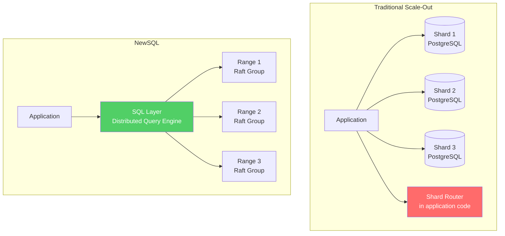
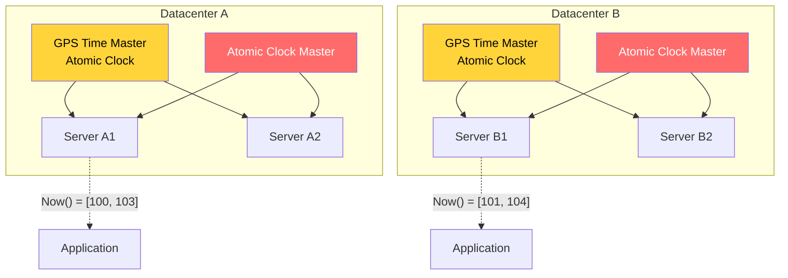
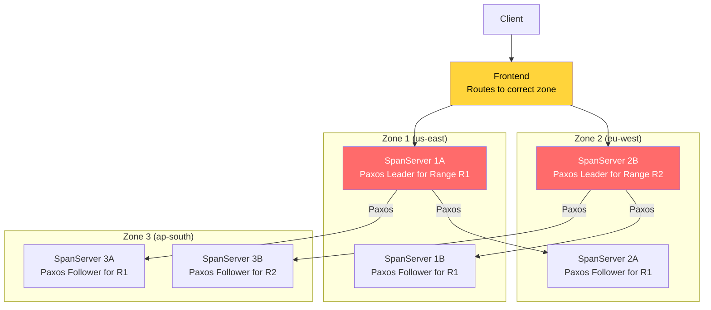
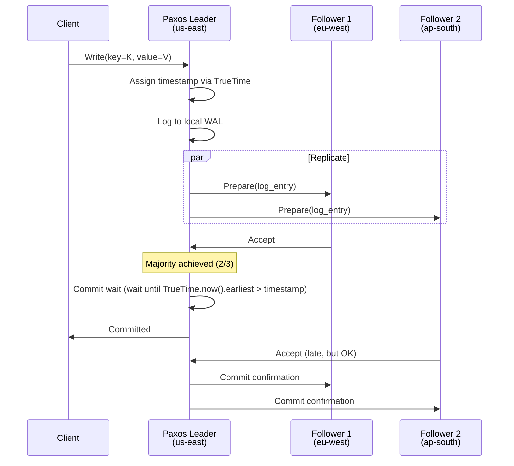
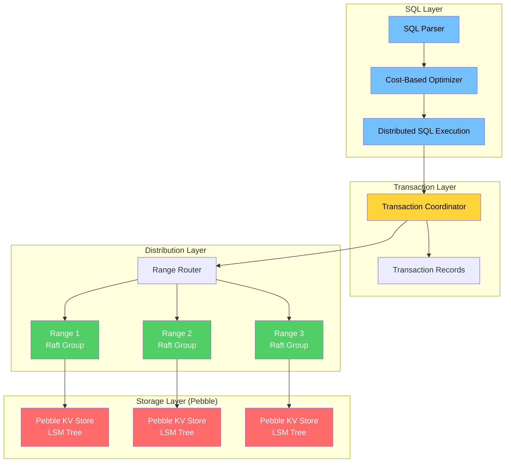
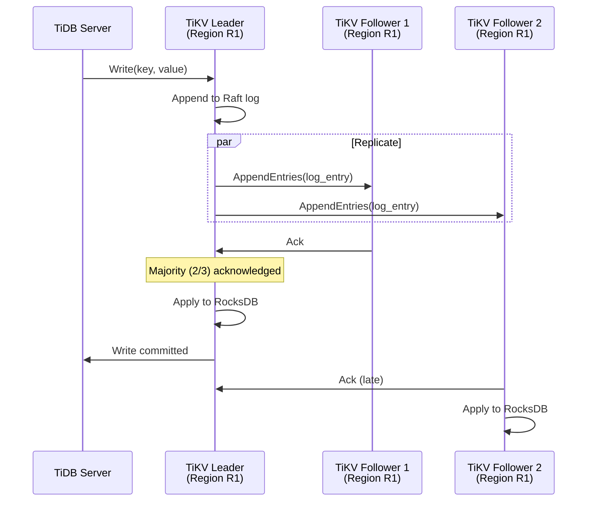
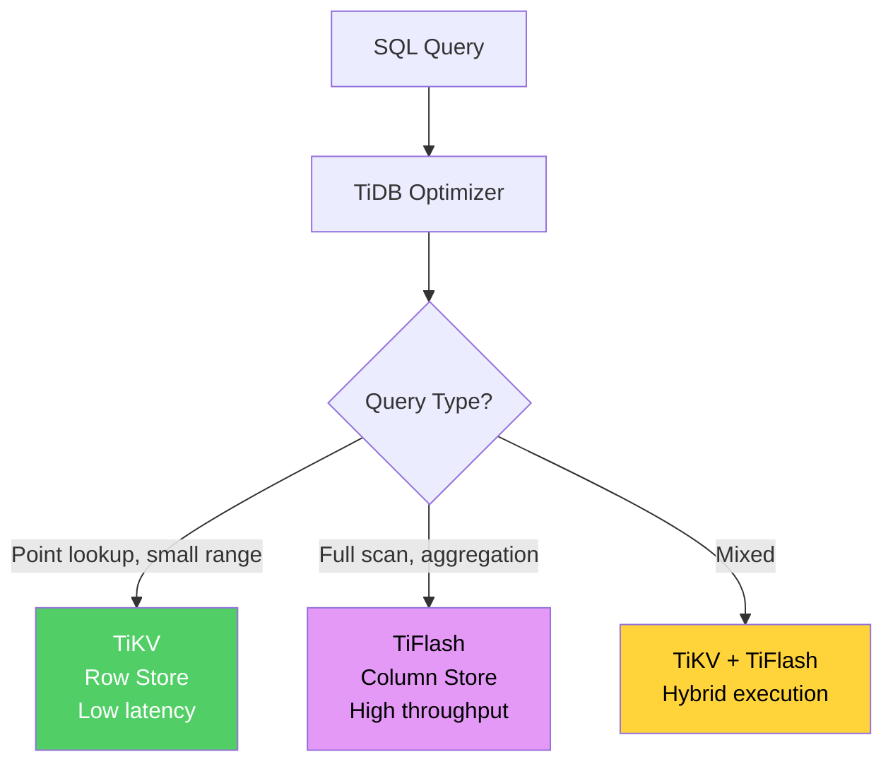
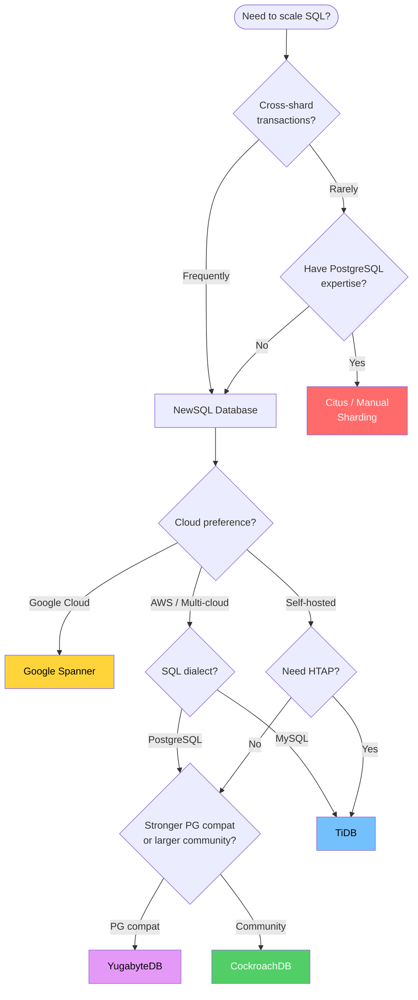

# NewSQL

NewSQL is the category of databases that solves the problem traditional databases left unsolved: how to provide the full power of SQL — ACID transactions, relational schema, secondary indexes, JOINs — while scaling horizontally across many machines and, in many cases, across multiple geographic regions.

For two decades, the choice was binary: use a relational database and accept its scaling limits, or use a NoSQL database and give up transactions, JOINs, and the relational model. NewSQL databases reject this trade-off. They achieve horizontal scalability through distributed consensus protocols (Raft, Paxos) while maintaining the SQL interface and ACID guarantees that developers depend on.

This page covers the four most important NewSQL databases — Google Spanner, CockroachDB, TiDB, and YugabyteDB — examining not just what they do but HOW they work internally.

## What NewSQL Solves

The problems NewSQL addresses:

| Problem | Traditional Solution | NewSQL Solution |
|---------|---------------------|-----------------|
| Single-node write bottleneck | Application-level sharding (complex, error-prone) | Automatic range-based sharding with rebalancing |
| Cross-shard transactions | Two-phase commit across application shards (brittle) | Built-in distributed transactions with serializable isolation |
| Geographic distribution | Read replicas (stale) or manual multi-master (conflicting) | Consensus-based replication with configurable locality |
| Schema changes at scale | Downtime or complex rolling migrations | Online schema changes (DDL without locks) |
| Failover | Manual promotion of replicas | Automatic leader election via consensus |

The core insight: if you split data into ranges, replicate each range via a consensus protocol (Raft or Paxos), and layer a SQL engine on top that can coordinate distributed transactions — you get a horizontally scalable SQL database with strong consistency.



## Google Spanner

Spanner is Google's globally distributed database. It is the original NewSQL database (though Google doesn't use that term) and remains the most technically impressive. Its key innovation — TrueTime — is something no other database has replicated.

### TrueTime

TrueTime is a globally synchronized clock API that returns not a single timestamp but an **interval** representing the uncertainty in the current time:

$$
\text{TrueTime.now()} = [t_{\text{earliest}}, t_{\text{latest}}]
$$

The actual time is guaranteed to be within this interval. The uncertainty (epsilon, $\varepsilon$) is typically 1-7 milliseconds.

**How TrueTime works:**

Each Google datacenter has a set of **time masters** — servers equipped with:
- **GPS receivers** — synchronized to atomic clocks on GPS satellites
- **Atomic clocks** (rubidium or cesium) — provide holdover when GPS signal is lost

Every server in the datacenter polls multiple time masters every 30 seconds using Marzullo's algorithm to compute its local uncertainty interval. Between polls, the uncertainty grows at the rate of the local clock's drift (about 200 microseconds per second).



### External Consistency

Spanner provides **external consistency** — the strongest possible consistency guarantee for a distributed database. It is stronger than linearizability:

$$
\text{If transaction } T_1 \text{ commits before } T_2 \text{ starts (in real time),}
$$
$$
\text{then } T_1\text{'s commit timestamp} < T_2\text{'s commit timestamp.}
$$

This means the database's timestamp order matches the real-world order of events — even across continents.

**How Spanner achieves this using TrueTime:**

When a transaction commits at timestamp $s$:

1. The leader acquires the commit timestamp $s$
2. The leader waits until $\text{TrueTime.now().earliest} > s$ — this is called the **commit wait**
3. Only after the wait does the leader respond to the client

The commit wait ensures that no other transaction can start with a timestamp less than $s$ after the commit response is sent to the client. This is because the waiting guarantees that $s$ is truly in the past by the time the response is sent.

$$
\text{Commit wait duration} \leq 2\varepsilon \approx 2\text{-}14\text{ ms}
$$

::: warning Why Nobody Else Has TrueTime
TrueTime requires specialized hardware (GPS receivers and atomic clocks in every datacenter) and a global network of time masters. No cloud provider other than Google offers this. CockroachDB and YugabyteDB use regular NTP-synchronized clocks with looser uncertainty bounds — which means they cannot provide external consistency (they provide serializable isolation instead, which is slightly weaker but sufficient for virtually all applications).
:::

### Spanner Architecture



**Key concepts:**

**Splits:** Data is divided into contiguous ranges of the primary key (splits). Each split is replicated across zones using a Paxos group.

**Paxos groups:** Each split is managed by a Paxos group with a leader and followers across multiple zones. The leader handles all reads and writes for that split. Followers participate in consensus and serve stale reads.

**Split/merge:** When a split grows too large, Spanner automatically splits it into two. When adjacent splits shrink, they are merged. This is transparent to the application.

**Directories:** A directory is a set of contiguous keys that share a common prefix. Directories are the unit of data placement — you can control which zone a directory's Paxos leader lives in, enabling locality-aware data placement.

### How Paxos Groups Work in Spanner

Each Paxos group in Spanner manages one split (range of data). The protocol ensures that all replicas agree on the order of operations:



## CockroachDB

CockroachDB is the most successful open-source NewSQL database. It provides PostgreSQL-compatible SQL on top of a distributed key-value store replicated via Raft consensus.

### Architecture Layers



### The KV Layer

At its core, CockroachDB is a sorted, distributed key-value store. Every SQL table, index, and system table is encoded into key-value pairs:

```
Table: users (id INT PRIMARY KEY, name STRING, email STRING)

Encoded KV pairs:
/Table/users/1/name  → "Alice"
/Table/users/1/email → "alice@example.com"
/Table/users/2/name  → "Bob"
/Table/users/2/email → "bob@example.com"

Index: users_email_idx ON users(email)
/Index/users_email_idx/"alice@example.com" → /Table/users/1
/Index/users_email_idx/"bob@example.com"   → /Table/users/2
```

This sorted KV space is divided into **ranges** — contiguous spans of the key space. Each range is typically 512 MB and is replicated across 3 nodes using a Raft consensus group.

### Range Distribution

```
Full KV space:
├─── Range 1: /Min ... /Table/users/1000    → Node 1 (leader), Node 3, Node 5
├─── Range 2: /Table/users/1001 ... /2000   → Node 2 (leader), Node 4, Node 6
├─── Range 3: /Table/users/2001 ... /3000   → Node 3 (leader), Node 1, Node 4
├─── Range 4: /Table/orders/1 ... /5000     → Node 4 (leader), Node 2, Node 6
└─── Range N: ...                           → ...
```

**Range splitting:** When a range exceeds 512 MB, it is automatically split into two ranges. The split happens at a key boundary that minimizes future splits.

**Range merging:** When adjacent ranges are both small (< 128 MB), they are merged into one range to reduce overhead.

**Rebalancing:** The system continuously monitors the distribution of ranges across nodes. If one node has significantly more ranges than others, the rebalancing algorithm moves ranges to achieve even distribution.

### How Distributed Transactions Work

CockroachDB implements distributed transactions using a protocol inspired by Percolator (Google's incremental processing system on top of Bigtable). Every transaction in CockroachDB is serializable — the strongest isolation level.

**Transaction lifecycle:**

```mermaid
sequenceDiagram
    participant Client
    participant Gateway as Gateway Node
    participant TxnRec as Transaction Record
    participant Range_A as Range A (leaseholder)
    participant Range_B as Range B (leaseholder)

    Client->>Gateway: BEGIN; UPDATE users SET ... WHERE id=1; UPDATE orders SET ... WHERE id=42; COMMIT;

    Gateway->>Gateway: Create Transaction Record (TxnID, status=PENDING)

    Gateway->>Range_A: Write Intent: users/1 = new_value (TxnID)
    Range_A->>Range_A: Write intent to Pebble (MVCC versioned)
    Range_A->>Gateway: Intent written

    Gateway->>Range_B: Write Intent: orders/42 = new_value (TxnID)
    Range_B->>Range_B: Write intent to Pebble (MVCC versioned)
    Range_B->>Gateway: Intent written

    Note over Gateway: All intents written — begin commit

    Gateway->>TxnRec: Update Transaction Record: status=COMMITTED, timestamp=T
    TxnRec->>TxnRec: Raft replicate commit

    Gateway->>Client: COMMIT OK

    Note over Range_A,Range_B: Asynchronous intent resolution
    Gateway->>Range_A: Resolve intent → committed value
    Gateway->>Range_B: Resolve intent → committed value
```

**Key concepts:**

**Write intents:** Instead of directly writing values, CockroachDB writes "intents" — provisional values tagged with the transaction ID. Intents are visible to concurrent transactions that can check the transaction record to determine if the intent is committed, aborted, or still pending.

**Transaction record:** Each transaction has a record stored in the range that contains the first write. This record tracks the transaction's status (PENDING, COMMITTED, ABORTED) and its commit timestamp.

**Intent resolution:** After a transaction commits, its intents are asynchronously resolved — converted from provisional intents to regular MVCC values. This is an optimization that avoids making the commit path wait for intent cleanup.

**Timestamp ordering:** CockroachDB uses MVCC with hybrid-logical clocks (HLC). Each value has a timestamp, and reads at timestamp T see only values written at timestamps <= T. Conflicts are resolved by timestamp ordering.

### Serializable Isolation

CockroachDB provides serializable isolation by default — every transaction behaves as if it executed in serial order:

$$
\text{For any concurrent execution of transactions } T_1, T_2, \ldots, T_n
$$
$$
\exists \text{ a serial ordering } T_{i_1}, T_{i_2}, \ldots, T_{i_n} \text{ that produces the same result}
$$

This is achieved through:

1. **MVCC timestamps** — every read and write has a timestamp
2. **Read refreshing** — if a transaction's read timestamp is pushed forward due to a conflicting write, CockroachDB checks if the read would return the same result at the new timestamp. If yes, the transaction continues. If no, it retries.
3. **Write-write conflict detection** — if two transactions write to the same key, one will be aborted and retried.
4. **Closed timestamp tracking** — each range tracks a "closed timestamp" below which no new writes can occur, enabling consistent reads across ranges.

### Follow-the-Workload

CockroachDB can automatically move range leaseholders closer to the nodes that read from them most frequently. This reduces read latency for geographic workloads.

```
Initial state:
  Range R1 leaseholder: Node in us-east
  Most reads for R1: coming from eu-west clients

After follow-the-workload:
  Range R1 leaseholder: Moved to Node in eu-west
  Read latency: Reduced from ~100ms to ~10ms
```

This is configured through **zone configurations** and **locality flags**:

```sql
-- Tell CockroachDB where each node is located
cockroach start --locality=region=us-east,zone=us-east-1

-- Configure a table to prefer leases in a specific region
ALTER TABLE users CONFIGURE ZONE USING
    lease_preferences = '[[+region=eu-west]]';
```

## TiDB

TiDB is a MySQL-compatible NewSQL database that separates compute (TiDB servers) from storage (TiKV) and supports both OLTP and OLAP workloads (HTAP) through TiFlash.

### Architecture

```mermaid
graph TD
    subgraph "Compute Layer"
        TiDB1[TiDB Server 1<br/>SQL + MySQL Protocol]
        TiDB2[TiDB Server 2<br/>SQL + MySQL Protocol]
    end

    subgraph "Scheduling"
        PD[PD (Placement Driver)<br/>Cluster Manager<br/>Timestamp Oracle<br/>Region Scheduler]
    end

    subgraph "Storage Layer (TiKV)"
        TiKV1[TiKV 1<br/>Raft Leader: Region 1<br/>Raft Follower: Region 3]
        TiKV2[TiKV 2<br/>Raft Leader: Region 2<br/>Raft Follower: Region 1]
        TiKV3[TiKV 3<br/>Raft Leader: Region 3<br/>Raft Follower: Region 2]
    end

    subgraph "Analytical Layer"
        TiFlash1[TiFlash 1<br/>Columnar Replica]
        TiFlash2[TiFlash 2<br/>Columnar Replica]
    end

    App[MySQL Client / Application] --> TiDB1
    App --> TiDB2

    TiDB1 --> PD
    TiDB2 --> PD
    TiDB1 --> TiKV1
    TiDB1 --> TiKV2
    TiDB1 --> TiKV3
    TiDB2 --> TiKV1
    TiDB2 --> TiKV2
    TiDB2 --> TiKV3

    TiKV1 -->|Raft log replication| TiFlash1
    TiKV2 -->|Raft log replication| TiFlash2

    style TiDB1 fill:#74c0fc,color:#000
    style TiDB2 fill:#74c0fc,color:#000
    style PD fill:#ffd43b,color:#000
    style TiKV1 fill:#51cf66,color:#fff
    style TiKV2 fill:#51cf66,color:#fff
    style TiKV3 fill:#51cf66,color:#fff
    style TiFlash1 fill:#e599f7,color:#000
    style TiFlash2 fill:#e599f7,color:#000
```

### TiKV Storage

TiKV is a distributed key-value store that uses RocksDB as its local storage engine (LSM tree) and Raft for replication.

**Data organization:**

The KV space is divided into **Regions** (similar to CockroachDB's Ranges). Each Region:
- Covers a contiguous range of keys
- Default size: 96 MB (configurable)
- Is replicated across 3 TiKV nodes via a Raft group
- Has one leader that handles all reads and writes

```
Region 1: [key_0000, key_1000) → TiKV-1 (leader), TiKV-2, TiKV-3
Region 2: [key_1000, key_2000) → TiKV-2 (leader), TiKV-3, TiKV-1
Region 3: [key_2000, key_3000) → TiKV-3 (leader), TiKV-1, TiKV-2
```

### Raft Groups in TiKV

Each Region is a Raft group. The Raft leader handles all reads and writes, and replicates the write-ahead log to followers:



### PD (Placement Driver) Scheduling

PD is TiDB's brain — it makes all scheduling decisions:

**Timestamp Oracle (TSO):**
- Allocates globally unique, monotonically increasing timestamps
- Every transaction gets a start timestamp and a commit timestamp from PD
- Timestamps are used for MVCC — determines which versions a transaction can see
- TSO throughput: ~1 million timestamps per second

**Region scheduling:**
- Monitors Region sizes and splits large Regions
- Monitors Region load and moves hot Regions to less-loaded nodes
- Ensures each Region has the configured number of replicas
- Handles node failures by re-replicating under-replicated Regions

**Leader balancing:**
- Distributes Raft leaders evenly across TiKV nodes
- Moves leaders closer to the clients that access them most

### MySQL Compatibility

TiDB speaks the MySQL wire protocol and is compatible with most MySQL syntax:

```sql
-- These all work in TiDB, same as MySQL:
CREATE TABLE users (
    id BIGINT AUTO_INCREMENT PRIMARY KEY,
    name VARCHAR(255),
    email VARCHAR(255) UNIQUE,
    created_at TIMESTAMP DEFAULT CURRENT_TIMESTAMP
);

INSERT INTO users (name, email) VALUES ('Alice', 'alice@example.com');

SELECT * FROM users WHERE email = 'alice@example.com';

-- MySQL dump/restore works:
-- mysqldump --host=tidb-host ... | mysql --host=tidb-host ...
```

**Compatibility gaps:**
- Stored procedures and triggers: limited support
- Some MySQL-specific functions may behave differently
- AUTO_INCREMENT behavior differs (not strictly sequential — allocated in batches per TiDB server)
- Foreign key constraints: supported since TiDB 6.6, but not recommended for performance reasons
- `SELECT ... FOR UPDATE` semantics differ under certain conditions

### HTAP with TiFlash

TiFlash is TiDB's columnar storage engine for analytical queries. It receives data from TiKV via Raft log replication, meaning it is always consistent with TiKV.

**How the optimizer chooses:**



The optimizer uses cost-based analysis to decide whether to read from TiKV (row store) or TiFlash (columnar store). You can also force the choice with a hint:

```sql
-- Force TiFlash for an analytical query
SELECT /*+ READ_FROM_STORAGE(TIFLASH[orders]) */
    DATE(order_date) AS day,
    SUM(amount) AS total
FROM orders
WHERE order_date > '2024-01-01'
GROUP BY DATE(order_date);
```

## YugabyteDB

YugabyteDB is a PostgreSQL-compatible NewSQL database built on a distributed document store called DocDB.

### DocDB Storage

DocDB is YugabyteDB's custom storage engine. It uses a modified version of RocksDB underneath but adds a document-oriented layer on top:

```
SQL Table: users (id, name, email)

DocDB encoding:
SubDocKey(table_id, hash(id=1), column_id=name) → "Alice"
SubDocKey(table_id, hash(id=1), column_id=email) → "alice@example.com"
SubDocKey(table_id, hash(id=2), column_id=name) → "Bob"
SubDocKey(table_id, hash(id=2), column_id=email) → "bob@example.com"
```

**Key features of DocDB:**
- Each column value is stored as a separate key-value pair (enables fine-grained MVCC)
- Keys include MVCC timestamps (hybrid timestamps, similar to CockroachDB's HLC)
- Values are encoded as a custom document format supporting nested structures
- Uses hash-based or range-based sharding for the primary key

### Raft Replication

Like CockroachDB and TiDB, YugabyteDB uses Raft for replication. The data is divided into tablets (equivalent to CockroachDB ranges or TiDB regions):

$$
\text{Tablet} = \text{Range of keys} + \text{Raft group (leader + followers)}
$$

Each tablet is replicated across 3+ nodes. The Raft leader handles all reads and writes for that tablet.

### PostgreSQL Compatibility

YugabyteDB uses the PostgreSQL query layer — it is not just "compatible" with PostgreSQL, it actually embeds the PostgreSQL parser, analyzer, and rewrite engine:

```sql
-- Full PostgreSQL syntax works:
CREATE TABLE events (
    id UUID DEFAULT gen_random_uuid() PRIMARY KEY,
    payload JSONB NOT NULL,
    created_at TIMESTAMPTZ DEFAULT now(),
    tags TEXT[] DEFAULT '{}'
);

CREATE INDEX idx_events_payload ON events USING GIN (payload);

SELECT id, payload->>'type' AS event_type
FROM events
WHERE payload @> '{"source": "web"}'
  AND created_at > now() - INTERVAL '7 days'
ORDER BY created_at DESC;
```

**Compatibility level:**
- PostgreSQL wire protocol: full compatibility
- SQL syntax: ~99% of PostgreSQL SQL
- Extensions: many work (PostGIS, pg_trgm, etc.), but not all
- System catalogs: fully compatible
- Stored procedures (PL/pgSQL): supported
- Foreign keys: supported (distributed enforcement)

### YugabyteDB vs CockroachDB

| Aspect | CockroachDB | YugabyteDB |
|--------|-------------|------------|
| SQL compatibility | PostgreSQL (partial) | PostgreSQL (deeper — embeds PG query engine) |
| Storage engine | Pebble (custom LSM) | DocDB (modified RocksDB) |
| Default isolation | Serializable | Snapshot (serializable available) |
| Sharding | Range-based only | Hash-based (default) or range-based |
| License | BSL (source-available) | Apache 2.0 (core) |
| HTAP | No columnar engine | No columnar engine |
| Geo-partitioning | Table-level locality | Row-level geo-partitioning |
| Change data capture | Built-in (changefeeds) | Built-in (CDC) |
| Maturity | More mature, larger community | Growing, strong PostgreSQL compat |

## Comparison Table: All NewSQL Databases

| Feature | Spanner | CockroachDB | TiDB | YugabyteDB |
|---------|---------|-------------|------|------------|
| **SQL Compatibility** | Google SQL (non-standard) | PostgreSQL | MySQL | PostgreSQL |
| **Consensus Protocol** | Paxos | Raft | Raft | Raft |
| **Storage Engine** | Custom (Colossus-based) | Pebble (LSM) | RocksDB (LSM) | DocDB (RocksDB-based) |
| **Strongest Isolation** | External consistency | Serializable | Snapshot + serializable | Serializable |
| **Clock Sync** | TrueTime (atomic clocks + GPS) | NTP + HLC | PD Timestamp Oracle | NTP + HLC |
| **Sharding** | Range-based (splits) | Range-based (ranges) | Range-based (regions) | Hash or range (tablets) |
| **HTAP** | No (use BigQuery) | No | Yes (TiFlash) | No |
| **Deployment** | Google Cloud only | Self-hosted or Cloud | Self-hosted or Cloud | Self-hosted or Cloud |
| **License** | Proprietary (managed) | BSL | Apache 2.0 | Apache 2.0 (core) |
| **Global Distribution** | Native (designed for it) | Supported | Supported (limited) | Supported |
| **Online DDL** | Yes | Yes | Yes | Yes |
| **Max Tested Scale** | Exabytes (Google-internal) | 100s of TB | 100s of TB | 100s of TB |
| **Community Size** | N/A (managed) | Large | Large (esp. in China) | Growing |

## When to Use NewSQL

### NewSQL vs Sharded PostgreSQL

**Choose NewSQL when:**
- You need distributed ACID transactions that span multiple shards
- You want automatic shard management (splitting, merging, rebalancing)
- You need geographic distribution with consistency guarantees
- You want automatic failover without manual replica promotion
- Your application's SQL complexity exceeds what application-level sharding can support

**Choose sharded PostgreSQL (Citus, manual sharding, or Vitess) when:**
- Your sharding key cleanly partitions the data with few cross-shard queries
- You need full PostgreSQL feature compatibility (all extensions, stored procedures)
- Your data fits on a small number of shards (< 10)
- You have existing PostgreSQL expertise and tooling
- Write latency must be minimal (single-node writes are faster than distributed consensus)

**The breakeven:**

$$
\text{Sharded PG wins when:} \quad \frac{\text{cross-shard queries}}{\text{total queries}} < 5\%
$$

$$
\text{NewSQL wins when:} \quad \frac{\text{cross-shard queries}}{\text{total queries}} > 20\%
$$

Between 5% and 20%, both approaches work — choose based on operational preference.

### NewSQL vs DynamoDB

**Choose NewSQL when:**
- You need SQL (JOINs, aggregations, subqueries)
- You need distributed transactions across multiple records
- Access patterns are not fully known upfront (need ad-hoc queries)
- You want to avoid vendor lock-in
- You need secondary indexes that are consistent with the primary data

**Choose DynamoDB when:**
- Access patterns are well-defined and stable (known key lookups)
- You want zero operational overhead (fully managed, serverless)
- You are already deep in the AWS ecosystem
- You don't need JOINs or complex queries
- Cost predictability at extreme scale matters more than flexibility

### Decision Flowchart



## Migration from PostgreSQL to CockroachDB

Migrating from single-node PostgreSQL to CockroachDB is the most common NewSQL migration path. Here is the practical process:

### Step 1: Schema Compatibility Audit

```sql
-- Features that need modification:
-- 1. SERIAL columns → Use UUID or INT with unique_rowid()
-- Instead of:
CREATE TABLE users (id SERIAL PRIMARY KEY, ...);
-- Use:
CREATE TABLE users (id UUID DEFAULT gen_random_uuid() PRIMARY KEY, ...);

-- 2. Sequences → Avoid if possible (distributed sequences are slow)
-- CockroachDB supports sequences but they become a bottleneck

-- 3. Enums → Supported since CockroachDB 20.2

-- 4. Triggers → NOT supported (move logic to application)

-- 5. Stored procedures → Limited support (move complex logic to application)

-- 6. Extensions → Most not available (pg_trgm, PostGIS limited, no custom C extensions)
```

### Step 2: Data Migration

```bash
# Option 1: IMPORT (fastest for initial load)
cockroach sql --execute="
IMPORT TABLE users (id UUID, name STRING, email STRING)
CSV DATA ('gs://mybucket/users.csv')
WITH delimiter = ',', skip = '1';
"

# Option 2: pg_dump + psql (compatibility mode)
pg_dump --no-owner --no-privileges source_db | \
    cockroach sql --database=target_db

# Option 3: CDC-based (zero-downtime migration)
# Use a tool like molt (CockroachDB's migration tool)
# or custom CDC pipeline with Debezium
```

### Step 3: Query Compatibility Testing

Common query patterns that need adjustment:

```sql
-- PostgreSQL: Subquery in FROM
SELECT * FROM (SELECT ...) AS subq;
-- CockroachDB: Usually works, but may need optimization hints

-- PostgreSQL: LATERAL JOIN
SELECT * FROM users, LATERAL (SELECT ...) AS sub;
-- CockroachDB: Supported since v21.1

-- PostgreSQL: Window functions
SELECT *, ROW_NUMBER() OVER (PARTITION BY dept ORDER BY salary DESC) ...
-- CockroachDB: Fully supported

-- PostgreSQL: CTEs (WITH clause)
WITH regional_sales AS (SELECT ...)
SELECT * FROM regional_sales;
-- CockroachDB: Supported (note: CTEs are NOT materialized by default,
-- same as PostgreSQL 12+)
```

### Step 4: Performance Tuning

```sql
-- Key differences to tune for:
-- 1. Primary key design — AVOID sequential IDs
--    Bad:  id INT AUTO_INCREMENT  (creates hotspot on one range)
--    Good: id UUID DEFAULT gen_random_uuid()  (distributed across ranges)

-- 2. Add zone configurations for locality
ALTER TABLE users CONFIGURE ZONE USING
    num_replicas = 5,
    constraints = '{+region=us-east: 2, +region=eu-west: 2, +region=ap-south: 1}',
    lease_preferences = '[[+region=us-east]]';

-- 3. Use EXPLAIN ANALYZE to understand distributed query plans
EXPLAIN ANALYZE SELECT * FROM users WHERE email = 'alice@example.com';
-- Shows: which nodes were involved, network hops, execution time per node
```

## Performance Characteristics and Trade-offs

### Latency Comparison

| Operation | Single-Node PostgreSQL | CockroachDB (same region) | CockroachDB (cross-region) | Spanner (cross-region) |
|-----------|----------------------|--------------------------|---------------------------|----------------------|
| Point read (by PK) | 0.5ms | 2-5ms | 50-200ms* | 10-100ms |
| Point write | 0.5ms | 5-15ms | 100-300ms | 15-50ms + commit wait |
| Range scan (1000 rows) | 5ms | 10-30ms | 50-200ms* | 20-100ms |
| Distributed txn (2 ranges) | N/A | 10-30ms | 200-500ms | 30-100ms |

*Cross-region reads can be fast if the leaseholder/leader is in the reading region.

### Write Amplification

NewSQL databases have inherent write amplification due to consensus replication:

$$
\text{Write amplification} = \underbrace{W_{\text{WAL}}}_{\text{1x}} + \underbrace{W_{\text{Raft log}}}_{\text{1x per replica}} + \underbrace{W_{\text{LSM compaction}}}_{\text{10-30x per replica}}
$$

For a 3-replica setup with LSM compaction factor of 10:

$$
\text{Total write amplification} \approx 1 + 3 \times (1 + 10) = 34\text{x}
$$

This means a 1 MB write to the application generates ~34 MB of actual disk I/O across the cluster. This is the fundamental cost of distributed consistency.

### Read Amplification

Reads in NewSQL databases are typically served by a single node (the Raft leader / leaseholder), so read amplification is similar to a single-node database. The exception is follower reads, which may introduce additional latency but reduce load on the leader.

$$
\text{Read latency} = \begin{cases}
\text{Local} & \text{if leaseholder is local} \\
\text{RTT}_{\text{to leader}} + \text{local} & \text{if leaseholder is remote} \\
\text{Stale read} & \text{if follower read is acceptable}
\end{cases}
$$

### The Fundamental Trade-off

NewSQL databases trade single-node latency for distributed correctness:

$$
\text{Latency}_{\text{NewSQL}} = \text{Latency}_{\text{single-node}} + \text{Consensus overhead} + \text{Network RTT}
$$

This trade-off is worth it when:
- Your data exceeds a single node's capacity
- You need automatic failover with zero data loss
- You need geographic distribution
- You need distributed transactions

It is NOT worth it when:
- Your data fits on a single node
- You can tolerate manual failover (promote a replica)
- All your traffic is in one region
- Cross-shard transactions are rare (< 5% of queries)

::: tip The Honest Assessment
If your dataset is under 1 TB, your write throughput is under 10,000 writes/second, and you operate in a single region — single-node PostgreSQL with a streaming replica for failover is simpler, faster, and cheaper than any NewSQL database. NewSQL's complexity is justified only when you have exhausted the vertical scaling of a single-node database or when you need multi-region consistency.
:::
